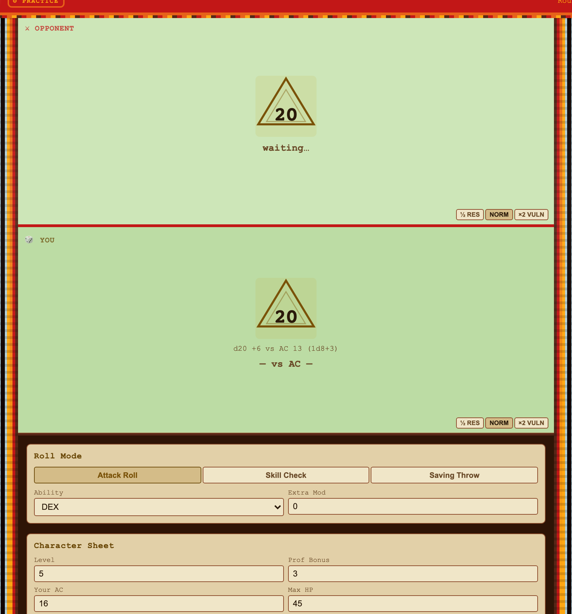
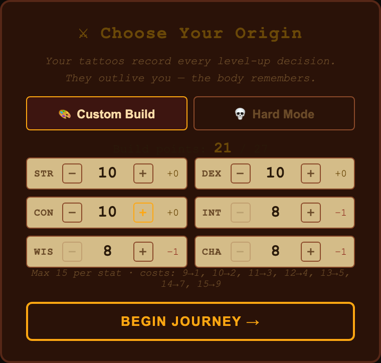
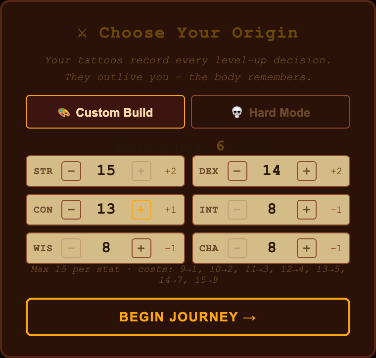
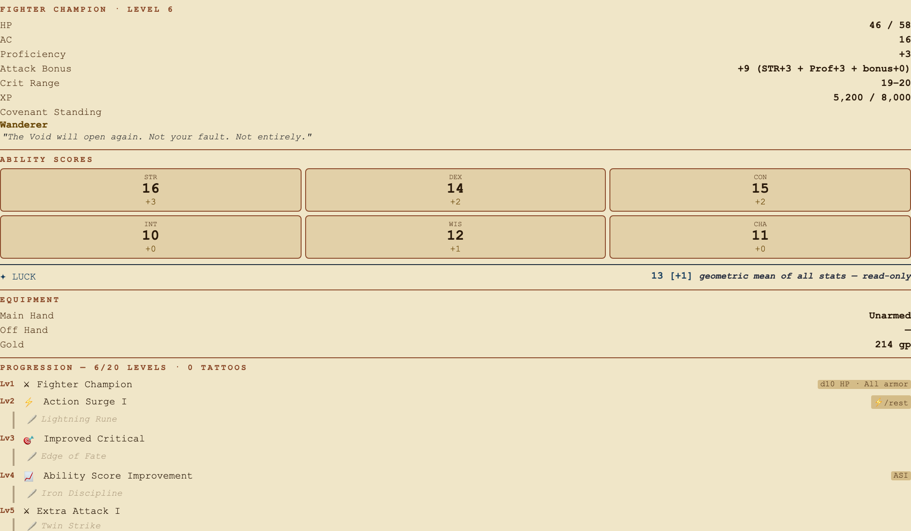
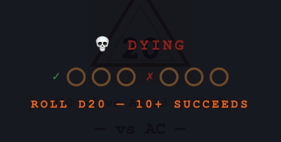
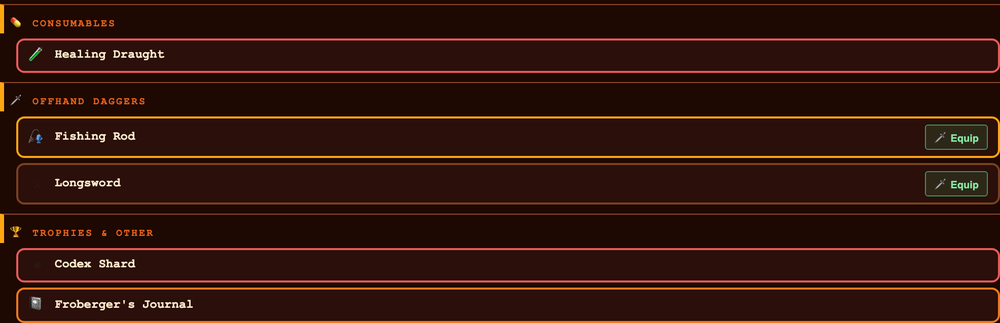
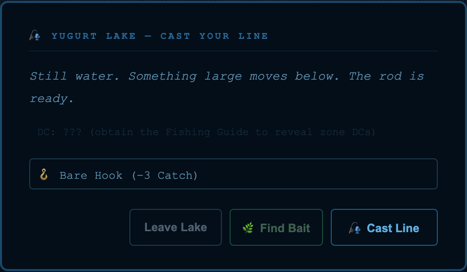
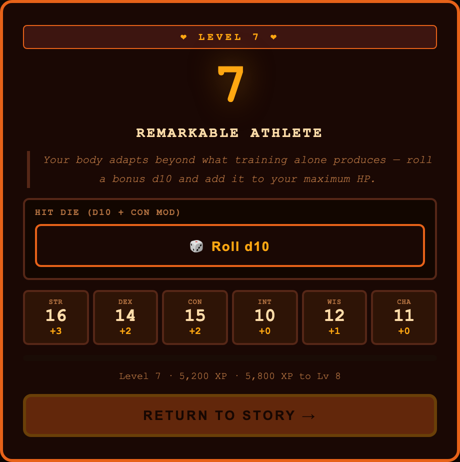

<!-- SPDX-License-Identifier: MIT — Copyright (c) 2026 Paul Richeson -->

# CODEX OF CONQUEST — a single-file adventure RPG

The entire game — combat engine, world map, NPC dialogue, quest system, save
system, hundreds of monsters, dozens of terrains, and 8 acts of story — lives
inside one HTML file. No server, no build step, no install. Open it and play.

> A dying courier presses a bloodstained map into your hand and says one word:
> *"Sweelinck."* Seven scholar-kings each carried one Shard of the Codex into
> hiding before they died, and the seals that bind the Void are weakening. The
> Void is not a fog of consuming darkness. It is a conqueror — it advances where
> the defenders are thin. You have a sword, a coin purse, and forty-nine days.

---

## Quick start

### ▶ Play it in your browser — nothing to install

**https://vonglurt.github.io/codexofconquest/**

That is the current build, served from GitHub Pages. It runs entirely in your
browser; saves live in `localStorage` on your own machine and nothing is
uploaded anywhere.

### ⬇ Download the game — one file, yours offline

Right-click and **Save Link As…** →
[**play.html**](https://raw.githubusercontent.com/vonglurt/codexofconquest/main/play.html) (~5.5 MB)

Or from a terminal:

```bash
curl -L -O https://raw.githubusercontent.com/vonglurt/codexofconquest/main/play.html
open play.html          # macOS   ·   xdg-open on Linux   ·   start on Windows
```

Double-click it, drag it onto a browser window, or `File → Open`. It is
genuinely self-contained — email it to someone, put it on a USB stick, or serve
it from any static host. No server, no build step, no account.

### 📦 The whole source

- **Repository:** <https://github.com/vonglurt/codexofconquest>
- **Clone it:** `git clone https://github.com/vonglurt/codexofconquest.git`
- **Zip:** <https://github.com/vonglurt/codexofconquest/archive/refs/heads/main.zip>
- **Releases:** <https://github.com/vonglurt/codexofconquest/releases>

### 🛠 Then build a world of your own

The authoring tool ships with the game. Open
[**edit.html**](https://vonglurt.github.io/codexofconquest/edit.html) — a visual editor for **nodes, terrains,
monsters, quests, NPCs and mission bits**, the flags the world reads to know
what has already happened.

Start small and you will see it working in minutes:

1. Run the API server — `make wbapi` (or `make edit`, which opens both).
2. Add a node, give it a terrain and a description.
3. Wire a road to somewhere that already exists.
4. Write a three-step quest arc in the Mission Builder.
5. Reload `play.html` and walk to it.

> **The editor wants the API.** Opened straight off disk it will warn you: the
> browser blocks the reads and writes it needs, so loading a world from file is
> not supported. Start the server first — `make wbapi` — then reload.

Quests, nodes, terrains, monsters and mission bits are **data**, not code, so
most content work never touches the engine. When you are ready, `make check`
runs the gate chain that looks for dead links, unreachable nodes, duplicate
keys and quests that can never complete.

---

## Screenshots

Every image is a crop of the running game, captured from the test harness by
[`src/tools/capture-screens.mjs`](src/tools/capture-screens.mjs) — not mockups.
Re-generate them any time with `node src/tools/capture-screens.mjs`.

### ⚔️ Combat on an advantaged d20



The die, the modifier, the target and the result — `d20 +6 vs AC 13 (1d8+3)`. Attack roll, skill check and saving throw are the same three buttons all game.

### 🎭 Character creation



Choose an origin, then spend a 27-point budget in the open. The costs are printed on the screen: 9→1, 10→2, 11→3, 12→4, 13→5, 14→7, 15→9.

### 🧮 Stat point allocation



Every modifier updates as you spend. Nothing is rolled behind your back.

### 📋 The character sheet



Six abilities, proficiency, AC and max HP — plus Luck as a seventh stat that behaves like none of the others.

### 🏆 Victory


A fight ends and the banner says so. What it paid — XP, gold, drops — lands in the log behind it.

### 💀 Death saves



Drop to zero and you are *dying*, not dead. Three successes or three failures on a d20, rolled where you can see them.

### 🎒 Inventory



Sorted by what a thing is for. Every item says what it does and what it is worth.

### 🎣 Fishing gear and bait



Shore, reeds and deep water unlock separately; day and night hold different species.

### ⭐ Level up



Roll the hit die yourself — d10 plus your CON modifier. The feature you gained is named, and the sheet shows what changed.

---

## What this project is

`play.html` is the single source of truth: a ~37,000-line HTML file that
*is* the game. Everything else in this repository exists to **author, document,
test, and host** that one file:

- **Docs** keep a two-way sync with the HTML — every data structure has a home
  document, every doc entry traces back to a line in the HTML.
- **The WBAPI server** (`wbapi-server.js`) is an optional local REST API that
  reads the HTML and writes edits back in place, so content can be authored via
  `edit.html` / `./api.sh` instead of editing 37k lines by hand.
- **Tests** (`src/tests/`, `src/scripts/`) guard the world's invariants.

If you only want to play, you never need any of that — just open the HTML.

---

## Running it as a project

### 1. Play locally (no tooling)

Open `play.html` in a browser. Done.

### 2. Host it (share it with others)

Because the game is a single static file, any static file server works:

```bash
# Python (already on macOS/Linux) — serves the current directory at :8000
python3 -m http.server 8000
# then visit http://localhost:8000/play.html

# …or Node's one-liner static server
npx serve .
```

To publish on the web, upload `play.html` to any static host (GitHub
Pages, Netlify, an S3 bucket, a plain nginx/Apache directory). No backend
required. Rename it to `play.html` if you want it served at the site root.

### 3. Run the authoring / API server (content editing)

The World Builder API server lets you edit the game's data programmatically and
through `edit.html`. You need **Node.js**.

```bash
# Install Node (macOS, via Homebrew — https://brew.sh)
brew install node

# Install dev dependencies (Playwright for tests, Anthropic SDK)
npm install

# Start the WBAPI server on http://localhost:1367
./wbapi-toggle.sh start        # start | stop | restart | status | fg
#   (equivalently: npm start  →  node wbapi-server.js)

# Talk to it from the CLI
./api.sh ping
./api.sh help
./api.sh list node

# Author visually: open edit.html in a browser while the server runs
```

The server reads and rewrites `play.html` in place. See
**[CONTRIBUTING.md](CONTRIBUTING.md)** for the API-first authoring workflow and
the WBAPI hazards to know before editing, and **`docs/api/`** for the full API
reference.

### Tests

```bash
npm test                # Playwright integration suite
npm run check:walk      # world-invariant CI gates (mover/terrain/roads/rooms)
npm run test:mud        # MUD server-protocol harness
```

> ⚠️ Stop the WBAPI server before running Playwright suites
> (`./wbapi-toggle.sh stop`) — see the Test-Run Rules in
> [CONTRIBUTING.md](CONTRIBUTING.md).

---

## Repository layout

```
play.html        ← THE GAME (single file — open this to play)
edit.html       ← visual authoring tool (needs the WBAPI server)

# Launch / ops scripts (root)
api.sh                  ← WBAPI CLI wrapper  (→ src/api/wb.js)
wbapi-toggle.sh         ← start/stop/restart the WBAPI server
say.sh · sayd.sh        ← narration helpers
monitor-snapshots.py · watch-snapshots.sh · archive-snapshots.sh
                        ← snapshot pipeline + server keepalive (root-anchored)

# WBAPI server bundle (Node — must stay at root together)
wbapi-server.js         ← the REST API server (reads/writes the HTML)
wbapi-core.js  mover.js  rooms.js  duel.js  mesh.js   ← required modules
roads-pins.json  walk-geo-gazetteer.json  peers.txt   ← data the server reads
package.json  node_modules/

# Core documentation (kept in two-way sync with the HTML)
index.md                ← master index + cross-reference table (start here)
world.md  story.md  mechanics.md  monsters.md  maps.md  quest.md
prompt.md               ← operating directive: how to build/add content (read before contributing)
CONTRIBUTING.md         ← development policies & directives
BACKLOG.md              ← outstanding work / to-do list
plan-archive.md         ← archived completed work

# Folders
docs/                   ← reference docs: spec/ story/ src/api/ mechanics/ notes/
docs/lab-reports/            ← design lab reports (one per major arc/system)
src/importers/              ← ⚠️ archaic one-shot content importers (historical)
src/tools/                  ← standalone dev/CLI utilities
src/sources/                ← narrative source texts
1367-sources/           ← imported source-book material
src/scripts/                ← invariant/CI check scripts (npm run check:*)
src/tests/                  ← Playwright integration + MUD harness
src/api/                    ← wb.js (the WBAPI CLI implementation)
maps/ · milepoints/ · ledger/   ← map assets, snapshots/logs, economy ledger
```

---

## Documentation system

This repo maintains a **two-way sync** between `play.html` and the
markdown docs: every data structure in the HTML has a home document, and every
documented item traces back to a line in the HTML.

| Doc | Contents |
|-----|----------|
| **`index.md`** | Master index, cross-reference table, doc-health badge — **read this first** |
| `world.md` | NODE_MAP, WORLD_DB, NPC profiles, quest IDs |
| `story.md` | All nodes, acts, narrative flow, branching |
| `mechanics.md` | Combat engine, XP table, conditions, economy, save format, multiplayer |
| `monsters.md` | MONSTER_POOL entries + terrain coverage |
| `maps.md` | Grid layout, road net, room layer, node network |
| `quest.md` | Quest catalogue (UQF format) |
| `prompt.md` | **Operating directive** — how to take a BACKLOG item from spec to shipped content (work loop · API · inserting pattern · invariants). Read before contributing. |
| `CONTRIBUTING.md` | How to work in this repo — API-first, cell-first, free-movement, test rules, lab-report policy |
| `BACKLOG.md` | Outstanding / planned work |

Deeper reference lives under **`docs/`** (`spec/`, `story/`, `src/api/`,
`mechanics/`, `notes/`), and **`docs/lab-reports/`** captures design decisions and
implementation findings per major arc or system. See `index.md` for the full
list.

---

## Player guide

### Enter Story Mode

Open the game and click **Story Mode**. You arrive in Birka — a city on the edge
of something wrong. The Void is rising. You have 49 days.

### Moving through the world

The world is a MUD-style coordinate grid. Each press of **N / E / S / W** moves
you one cell. Named locations appear when your cell matches a known node; between
them you walk through open terrain. The world is freely traversable — quests
never block a road.

| Command | Action |
|---------|--------|
| **N / E / S / W** | Move one grid cell |
| **Wait** | Rest at your location (costs time) |
| **Hunt** | Enter the wilderness to find an encounter |

Move toward quest markers, talk to everyone, and read what NPCs say — their
dialogue changes as your relationship with them grows. Click a distant map tile
to auto-travel there.

### Combat

Encounters (or choosing **Hunt**) start combat automatically. Roll initiative,
then take turns: **Attack**, **Dodge**, **Use Item**, or **Flee**. A natural
**20** crits (double damage dice); a **1** fumbles. At 0 HP you make **death
saving throws** — three successes stabilize, three failures end the run (and drop
your loose loot as a recoverable corpse where you fell).

### Leveling & NPCs

Defeating monsters earns XP toward Fighter Champion features (Action Surge,
Second Wind, crit improvements). The cap is **Level 20**. Raising an NPC's
favorability unlocks new dialogue, story context, and the best ending. The
ending notices what you *shared*, not just what you killed.

### Saving

The game autosaves to `localStorage` after every meaningful action. Use
**Export Save** to back up a run and **Import Save** to restore it.

---

## License

MIT. Fork it. Extend it. Write Level 21. See [LICENSE](LICENSE) for full text.

---
*© 2026 Paul Richeson — MIT License.*

---

---

## Layout

```
index.html          project landing page (start here)
play.html           THE GAME — one file, no build, no server
edit.html           visual world/quest/mission-bit editor
Makefile            every way to start things
run.sh              the single entry point the Makefile delegates to
bin/                shortcuts: ./bin/run, ./bin/play, ./bin/wbapi, ./bin/check …
src/                all implementation + the node project
  package.json      npm manifest lives HERE (see src/NODE.md)
  node_modules/     gitignored
  js/               engine + WBAPI server modules
  server/           start-wbapi.sh — announces where node runs, then execs it
  api/ scripts/ tools/ bin/ importers/ tests/ config/ sources/
docs/               design/ backlog/ lab-reports/ api/ maps/ mechanics/ notes/ spec/
build/              generated + runtime output (gitignored)
vendor/             working material, not published (gitignored)
```

### Running it

```
make            # list every target
make run        # API + monitor in terminals, opens the landing page
make play       # API + monitor, opens the game
make edit
make wbapi      # just the node API server, announcing its working dir
make check      # the full gate chain
make install    # restore src/node_modules
make purge      # remove node_modules + build output
make stop
```

To just play, open `play.html`. Nothing else is required.

**Where the node project lives:** `package.json`, `package-lock.json` and
`node_modules/` are in **`src/`**, not the repo root — see [src/NODE.md](src/NODE.md).
Node resolves a bare `require()` by walking *up* from the calling file, and the code
needing external packages is spread across `src/tests` (Playwright, 81 call sites) and
`src/js` + `src/api` (the Anthropic SDK). `src/` is the deepest placement where all of
them still resolve; anything deeper and the tests fail to load. Run npm from `src/`, or
use the make targets from anywhere.

## Author

**Paul Richeson** — sole copyright holder; see [LICENSE](LICENSE).

Built across 1,472 commits between 2026-05-24 and 2026-08-23. Much of the drafting
was done by Anthropic's Claude models, engaged as a contracted service and working
under the author's direction — a sub-contractor relationship that carries no
independent authorship claim. See
[CONTRIBUTING.md](CONTRIBUTING.md#authorship-and-ai-contribution).

