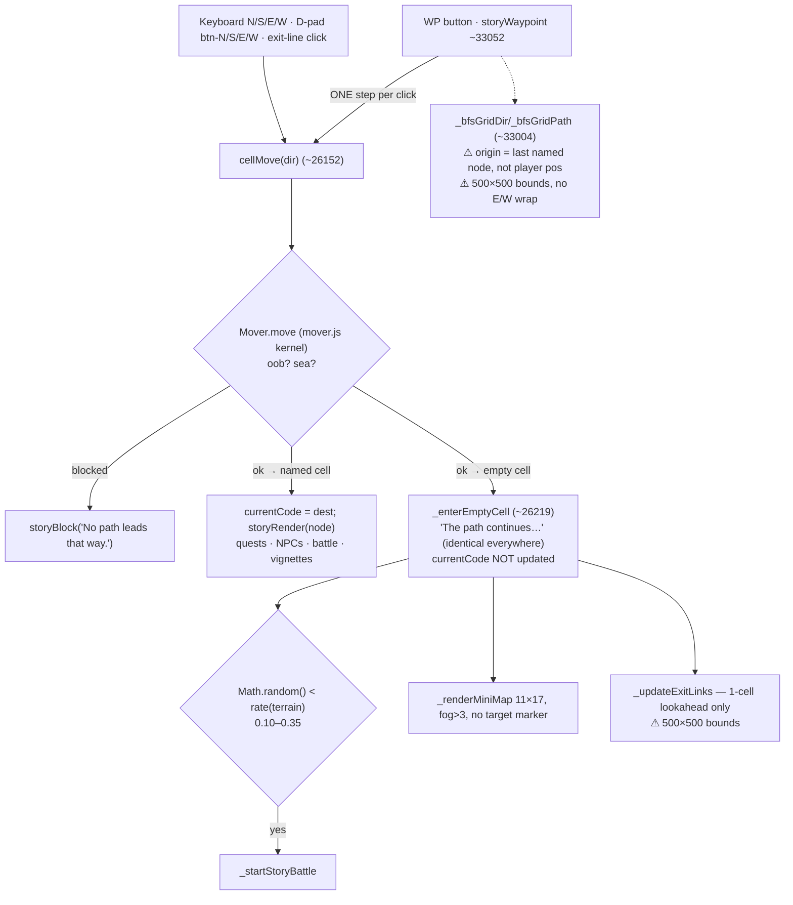
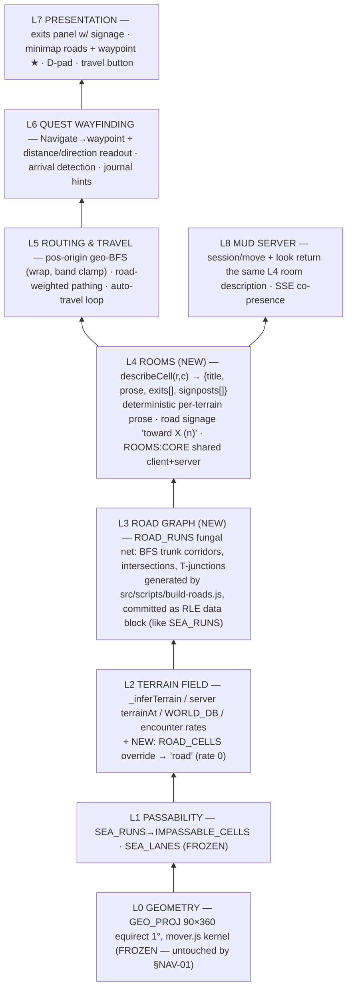

<!-- SPDX-License-Identifier: MIT — Copyright (c) 2026 Paul Richeson -->
# plan.md — Archive (closed / completed work)

> Completed items moved out of `plan.md` on 2026-06-28 to keep the active plan lean.
> This is the verbatim record of finished work. Open work lives in `plan.md`.
> Per-wave §ARCH-01 UQF detail is also in `docs/lab-reports/lab-report-uqf-migration-playbook.md`.

---

## Archived 2026-08-26 — §ATKAB-01 (a roller-only control that reached every story swing)

### §ATKAB-01 — three of the five `getAtkAbilityMod` callers were never checked against the derivation that now drives the select (NEW 2026-08-26 during §NEXT-2026-08-26, 🟢 no design call)

- [x] ✅ SHIPPED 2026-08-26 `PENDING` **§ATKAB-01 — `getAtkAbilityMod` has five call sites and §WEAP-FIN only proved two of them.** The two story surfaces (`_overlayPlayerAttack`, `_overlayOffhandAttack`) were made to agree with `_storyAtkAbility()` and with the character sheet. The other three — `@7217`, `@7374`, `@7665` — are **dice-roller paths**, and nothing has checked that the roller's own tabs still read correctly now that the `atk-ability` select is written by the story sync rather than left at its `<option value="dex" selected>` default.
> **Measure first, and the row may close as ALREADY CORRECT.** Re-derive the call-site list at HEAD (`grep -n "getAtkAbilityMod" play.html`), then for each of the three name which control it reads and whether the story sync can reach it. The failure this is looking for is the §AUDIT-03ae shape: two surfaces that are each individually defensible and disagree.
> **Provenance:** item (iv) of the §NEXT-2026-08-26 hand-off.

> **The census in the row was wrong, and so was the direction it expected the defect to run.** Re-derived at HEAD, `getAtkAbilityMod` has **seven** call sites, not five: `@6467` is the definition, `@7217` (the mod readout), `@7374` (`doPlayerAttack`) and `@7665` (`offhandRoll`) are the roller, `@25035` (`_overlayPlayerAttack`) and `@25117` (`_overlayOffhandAttack`) are the story battle, and **`@25761` inside `function _storyFleeMutual() {@25758` is a seventh the row never named** — a *story* path, not a roller one.
> **The three roller callers read correctly, and the reason is worth writing down: `#atk-ability` has no cached mirror.** `syncCharFromUI@8026` copies level, prof, AC and max HP into `S.char` and **does not store the select**, so `getAtkAbilityMod@6468` and `getDmgMod@6481` both read the live control and every one of the seven callers reaches the same answer. A programmatic `sel.value = …` fires no `input` event, so had the select been mirrored into `S.char` the story sync would have written the DOM and left the mirror stale — the defect the row was looking for existed only in the design it did not have.
> **What the audit actually found is the leak in the other direction, and it was shipped.** `getAtkAbilityMod` ends with `parseInt(#atk-extra-mod@3724.value) || 0`, and **neither story→simulator sync has ever written that field.** So a value typed into the standalone simulator was added to **every** story attack roll — measured before the fix: `atk-extra-mod` left at **7** survived both entry points and the character sheet printed a total **9 lower than the engine rolled**. `storyRenderCharSheet` derives its bonus from `_storyAtkAbility()@25612`, which reads no DOM at all, so the two surfaces could not see each other. **This is §AUDIT-03ae's shape a third time.**
> **The fix is an extraction, not a line, because the duplication is what caused it.** The two syncs — `_showBattleOverlay@24667` and the `S_story.active` branch of `storyCharToggle@37649` — carried the same eleven lines twice, and §AUDIT-03ae's own record says the row *"had found only the first; the second carried the identical omission."* Both now call **`_syncStoryCharInto@25599`**, which writes level, AC, max HP, `char-prof-override`, **`atk-extra-mod = 0`** and all six ability scores, and is documented as *the one place a story character becomes roller state*. A control left unwritten is a control the player can set behind the sheet's back.
> **Pinned by `atkab01-extra-mod-not-leaked.test.js` 4/4**, which asserts the field is zeroed and the sheet's printed total equals the rolled total through **both** entry points and for a negative value, with a fourth case proving neither entry point is privileged. It failed 3/4 before the fix.
> **Two findings went out as rows rather than inline.** **§SIMLEAK-01** (Phase 2, 🟡) — `#weapon-prof`, `#weapon-count` and `#weapon-flatmod` are the same class, and the latter two leak the *other* way: `_syncStoryWeaponInto` writes `w.count`/`w.flatMod` and leaves the inputs stale, so the next `syncWeaponFromUI` overwrites the equipped weapon from the simulator. **§DX-02m +4 named sites** — `_storyFleeMutual`'s four unseeded `Math.random()` calls, which resolve a fight and write `S.opp.hp`, `S_story.hp` and effort XP.
> **The extraction cost two doc anchors, exactly as the standing note predicts** — `plan-archive.md:293` and `lab-report-leveling-flashbang-condition-economy.md:207` both named `document.getElementById('char-level').value = _slv;`, rewritten to the §DX-02hw quoted form with the extraction stamped. Gate #15 named both.
> **`check:walk` 21/21 · `npm test` 1118 passed, exit 0** — 1114 + the 4 new pin cases.


---

## Archived 2026-08-26 — §NEXT-2026-08-26 (a session hand-off, retired by taking its contents up)

### §NEXT-2026-08-26 — the state this session stopped in, and what the next one should pick up (NEW 2026-08-26, session hand-off, 🟢 read first then delete)

- [x] ✅ SHIPPED 2026-08-26 `1d76637` **§NEXT-2026-08-26 — hand-off note. Delete this row once its contents have been taken up.** Six rows shipped 2026-08-26 in one continuous loop: **§DX-02ib** (Phase 5), **§XP-FLEE**, **§WEAP-FIN**, **§WEAP-RANGED**, **§WEAP-FIN-FU**, **§DX-02er** (all Phase 2). Tree clean, gates **20/20**, suite **1109 passed, exit 0**. No unfinished increment.
> **Phase 2's head is now three rows the loop must NOT take autonomously**, in this order: **§OFFHAND-01** (🟠, filed this session), **§WAVE-01** (🟠), **§POT-PROMOTE** (⚠️ PLANNED). Skip past them per §3 and start at the first 🟢 below. **Phase 1 remains fully exhausted for autonomous work** — all four open rows are ASK/🟠/🔴 (§DX-02gw, §VM-01-G2b-FU, §SIREN-01-FU, §DX-02ft), plus §AUDIT-03's remaining sub-rows, which are design calls.
> **IMPLEMENT — 🟢, in recommended order.** (1) **§DOCPTR-01** (Phase 6) — the highest value per line here: the target list and the resolution rule are already measured, so it is *write the gate, then fix ten pointers*, and it closes a whole unguarded direction. (2) **§DX-02id** (Phase 6) — ~2 tokens in a regex plus selftests; it unblocks writing real anchors into `.py`/`.sh` tooling, which §DX-02ib had to work around. (3) **§DX-02ia** (Phase 5) — the known mesh-test race; it has hidden inside a green summary three times now. (4) **§CSS-CENSUS** (Phase 6). (5) The older Phase 2 🟢 tail the previous hand-off named: **§DX-02ej, §DX-02eh, §DX-02ea, §DX-02dw, §DX-02dx, §CHRON-01**.
> **INVESTIGATE — measure before planning; each of these is a row whose premise I did not have time to test.** (i) **§OFFHAND-01's blast radius** — before the 🟠 can be answered, count how many existing saves would lose a bonus action under option (ii), and check whether any quest or encounter assumes the off-hand swing exists. (ii) **The `→ doc:` corpus beyond `play.html`** — §DOCPTR-01 measured 70 pointers in the game file only; `edit.html` and `src/js/*.js` may carry the same convention and were not counted. (iii) **Whether `_ASI_TABLE` being *rolled* rather than chosen is intended** — §WEAP-FIN leaned on it to establish that DEX rises without player intent, and that is a load-bearing fact for §WEAP-RANGED and §OFFHAND-01 that no row has ever verified against a design doc. (iv) **The other three `getAtkAbilityMod` callers** (`@7217`, `@7374`, `@7665`) — they are dice-roller paths, and this session only proved the two story surfaces agree; nothing has checked that the roller's own tabs still read correctly now that the select is driven by `_storyAtkAbility`.
> **STANDING NOTE, twice-earned this session:** run `npm run anchors:fix` **only when a row needs it**, and revert the sweep in files the row does not touch — it rewrites ~2,500 hint lines across 119 docs and buries the increment. And **every extraction breaks doc anchors** (§WEAP-FIN-FU broke three, §DX-02er broke three); that is gate #15 working, not a defect, but budget for it.
> **The brake is still unresolved.** The loop has no stopping condition except the user, and this session ran six rows on one `continue`. The three options put to the user on 2026-08-25 — (a) a row budget in `resume.md` §0, (b) a checkpoint every N rows, (c) a context-window brake — are still open, and **(a) remains the recommendation**. `resume.md` §0 was NOT edited; it is the user's standing directive.

> **Closed by taking its contents up, not by deleting it.** A hand-off row's whole value is that it names work; deleting it unread would have dropped four investigations and a standing note. Each clause was moved to the file that owns it: **(i) §OFFHAND-01's blast radius** → a *Measure the blast radius before answering* clause inside §OFFHAND-01 itself, naming the two numbers (saves with no `S_story.equippedWeapon`; any quest/encounter/balance note assuming the off-hand swing) that have to be taken before the 🟠 can be answered. **(ii) the `→ doc:` corpus beyond `play.html`** was **already filed** during §DOCPTR-01 as **§DOCPTR-02** (Phase 6) — disproved as a new finding, and the archive records it as already-covered rather than filing a duplicate. **(iii) `_ASI_TABLE` rolled vs chosen** → new row **§ASI-01** (Phase 2, 🟡). **(iv) the other three `getAtkAbilityMod` callers** → new row **§ATKAB-01** (Phase 2, 🟢).
> **The standing note went into the procedure, where a standing note belongs.** *Run `npm run anchors:fix` only when a row needs it, revert the sweep in files the row does not touch, and budget for extraction breaking anchors* is now a clause on the **doc-anchor bullet of `resume.md` §2.6**, not a line in a row that was scheduled for deletion. A rule that lives in an expiring note expires with it.
> **The IMPLEMENT list was re-derived at HEAD rather than trusted.** Its item (1) **§DOCPTR-01** and item (3) **§DX-02ia** are in `plan-archive.md` — shipped since the note was written. The live remainder is **§DX-02id** (Phase 6), **§CSS-CENSUS** (Phase 6), and the Phase 2 🟢 tail **§DX-02ej, §DX-02eh, §DX-02ea, §DX-02dw, §DX-02dx, §CHRON-01**.
> **The brake clause was NOT actioned, deliberately.** `resume.md` §0 is the user's standing directive and a row does not edit it; the three options (row budget · checkpoint every N rows · context-window brake) are carried into the hand-off instead, where the user can answer them.
> **No code changed.** Verification is the gate chain on the docs: `npm run check:walk --prefix src`.


---

## Archived 2026-08-26 — §DROP-01-FU (a table nothing rolled, and a comment its own generator overwrites)

### §DROP-01-FU — the loot migration was reverted three hours after it shipped and only two thirds of it came back (NEW 2026-08-12 during §DOC-02v, 🟢 no design call)

- [x] ✅ SHIPPED 2026-08-26 `1d884ad` **§DROP-01-FU (a) — `const LOOT_TABLE = [` *(deleted 2026-08-26, §DROP-01-FU)* is still declared, still holds 20 entries, still has zero readers, and its own comment still names `_rollD100Loot()` as its caller.** `lab-report-loot-drop-system-v2.md` §II-B Defect 3 identified it, §IV-A Change 1 deleted it, and `440eb5d` (2026-06-05 10:41) shipped that deletion. `88d41d1` (13:33 the same day) put it back. `0fffce7` (2026-07-07) re-shipped the *other* two changes and left this one. It has since been re-found independently **twice** — §DOC-02b as a zero-reader structure, §DOC-02j as a d20 table whose own comment miscalls it d100 (EV 27.75 vs `_D100_TABLE`'s 21.0). **Fix:** delete the array. Verify with `grep -c LOOT_TABLE play.html` = 0 and no `check:walk` red. Then sync the three docs that already claim it is gone (see §DX-02v).
- [x] ✅ SHIPPED 2026-08-26 `1d884ad` **§DROP-01-FU (b) — the `_D100_TABLE` header comment cannot be fixed in the HTML, because the HTML does not own it.** §V-A row 4 of the same report says the comment was *"updated to document consumables-only schema."* HEAD's comment still reads `{ weight, _type, _magic? }` and still lists `'dagger'|'mainweapon'` — because the block sits inside `◆◆◆ WORLDBUILDER:D100_TABLE ◆◆◆` and the comment is a hard-coded template literal in **`src/js/wbapi-server.js:function serializeD100Table(entries) {@1867`**. HEAD's text is that literal character for character. **Any API write to the loot table re-emits it**, which is why the report's fix did not survive its own afternoon. ***A fix applied to generated output survives exactly until the generator runs.*** **Fix:** edit the serializer's header string, restart the server (`./wbapi-toggle.sh restart`), and re-write the table once so the file picks it up.

> **(a) shipped as written: the array is gone, and the three docs that had already certified it gone are now true.** `grep -c LOOT_TABLE play.html` = **0**. The deletion is the one `440eb5d` made and `88d41d1` undid three hours later, so it has now shipped **twice** and been reverted once — which is exactly why it is pinned rather than merely made. `drop01fu-loot-table-retired.test.js` **5/5**, with a negative control that reinstates the declaration.
> **The doc sweep found the rot in BOTH directions, which the row only expected in one.** `mechanics-economy.md` said *"(removed) … definition now a comment stub"* — **false on both halves**, and a doc saying a thing is gone is worse than a doc that never mentioned it, because it closes the question for the next reader. But `mechanics.md:1017` and `docs/design/index.md:623` described it as **live** const array[20], and `spec-engine.md` §674/§695 documented it as **the** drop mechanic *"rolled automatically on kill"*, twenty months of spell-scroll odds quoted off a table nothing rolls. Four docs, three of them wrong the other way from the one the row named. The spec pair is **annotated, not rewritten** (§DX-02c).
> **(b) was disproved by the ground and shipped as something else.** The row asks for the fix `lab-report-loot-drop-system-v2.md` §V-A claimed to have made: update the header *"to document consumables-only schema"* — i.e. drop `'dagger'|'mainweapon'` from the `_type` list. **Measured at HEAD, that would have made the comment false.** `_rollD100Loot()` still carries live `dagger` and `mainweapon` branches — `if (row._type === 'dagger')` and `if (row._type === 'mainweapon')`, each gated on `_magicTierAllowed(row._magic)`. The **table** has no such rows; the **schema** still accepts them. Documenting the table's current contents as the schema would tell a worldbuilder author that a row they can add and the roller will read is not allowed.
> **What (b) actually fixed is the property that made its own defect possible.** The header is a template literal in `serializeD100Table()@1867`, so any write to `/api/loot` re-emits it and the report's edit did not survive its own afternoon — *a fix applied to generated output survives exactly until the generator runs*. The generated header now **says so in the output**, where the play.html reader is, instead of only in the generator, where they are not. The pin asserts the line is in **both** copies, so editing one alone fails.
> **Second line added, and it is the one an author would actually be caught by:** a `dagger`/`mainweapon` row **requires** `_magic`. Absent, `_magicTierAllowed(undefined)` evaluates `level >= NaN` → `false` → `continue`: the row never drops, never errors, and nothing anywhere says why.
> **The write went through the API, and the API could not express it.** There was no CLI verb for the loot table — the server has had `PUT /api/loot` and `PUT /api/loot/{index}` all along, and `./bin/api` could reach neither. **`loot` added to `src/api/wb.js`** (`get` · `put --index N k=v…` · piped `{entries:[…]}` full replace, `POST /api/save` after, synopsis line included), then the identical seven entries were re-PUT to make the file pick up the new header. Round-tripped from disk with the server stopped.
> **Ten doc anchors died with the array** — `` `const LOOT_TABLE = [` *(deleted 2026-08-26, §DROP-01-FU)* `` in seven files — and gate #15 named every one. Rewritten to the §DX-02hw quoted form with the deletion stamped, because a line hint for a deleted symbol is not refreshable. **The standing cost of every deletion, and the gate working.**
> **`check:walk` 21/21 · `npm test` 1114 passed, exit 0** — 1109 + the 5 new pin cases.


---

## Archived 2026-08-26 — §DOCPTR-01 (the code→doc direction had no gate, and it had already rotted fourteen ways)

### §DOCPTR-01 —  11 of the 70 `→ doc:` pointers in `play.html` name a section that does not exist, and no gate can see any of them (NEW 2026-08-26 during §DX-02er, 🟢 no design call)

- [x] ✅ SHIPPED 2026-08-26 `45cbc6f` **§DOCPTR-01 — the code→doc direction is unguarded, and it has already rotted.** `play.html` carries `// → doc: <file> §<Section>` comments beside its major tables. **Measured at `bd72b19`: 70 distinct pointers. Every FILE resolves. Eleven name a `§Section` that is not in the file they point at**, one of which was §DX-02er(b) and is now fixed; **ten remain**:
> `monsters.md §Monster Pool` · `story.md §EB Wounds` · `story.md §Act VIII NPC Farewell Beats` · `story.md §TV — Quill Couperin` · `story.md §Commander Bruhns CO Scene` · `world.md §World Progression` · `world.md §NPC Locations` · `world.md §Corelli the Wandering Merchant…` *(a parse artifact — the section name runs into prose on that line, so this pointer's real fault is that it is unparseable, which is its own finding)* · `docs/mechanics/mechanics-economy.md §D100 Loot Table` · `docs/story/story-arc-ngplus.md §EB NG+ Lines`.
> **This is the exact mirror of gate #15.** `check:anchors` proves **doc→code**: every `` `symbol@N` `` in a doc names something that still exists. Nothing proves **code→doc**: that a `→ doc:` pointer names a file that exists and a heading that is in it. The two directions rot independently, and this one has been rotting unobserved — §DX-02er found one by reading and assumed it was alone.
> **Note the resolution rule the measurement needed**, because a naive checker gets it wrong: most pointers are written as a **bare basename** (`world.md`, `story.md`, `monsters.md`) living under `docs/design/`, while others are repo-relative (`docs/mechanics/mechanics-economy.md`). A first pass resolving only literal paths reported **50** dead files; resolving basenames against the doc tree reported **0**. A gate that gets this wrong fails loudly on 50 healthy pointers and is worse than none.
> **Build:** a ~40-line `src/scripts/check-docpointers.js` in the `check:anchors` house style, wired as `check:walk` gate #21. Fail on an unresolvable file, an ambiguous basename (two docs share it), and a missing heading. **Selftest must plant one of each**, and must include the bare-basename case — that is the one that decides whether the gate is usable. **Then fix the ten**, each by finding the live section rather than deleting the pointer.
> **Provenance:** §DX-02er, whose own body called for exactly this detector and estimated the damage at one pointer. It is ten.

> **Shipped: `src/scripts/check-docpointers.js`, `check:walk` gate #21, and fourteen repointed comments.** Gates **20/20 → 21/21**, suite **1109 passed, exit 0**.
> **The row said ten remain. Measured at `99a913f`: FOURTEEN of ninety-two.** §DX-02er found one by reading and estimated one; §DOCPTR-01 found eleven by script and estimated ten; the gate found fourteen. **Each estimate was made by the tool that was about to be replaced**, which is the whole argument for the gate: the four the row's script missed were `world.md §WORLD_DB`, `world.md §QUEST_DB`, `world.md §Birka Six NPCs` and the two `plan-archive.md §XLV` pointers, whose target moved to `docs/archive/plan-archive-verbatim-2026-06-12.md` when the archive was condensed.
> **The resolution rule was wrong TWICE before it was right, and both near-misses are the deliverable.** The row already recorded the first: resolving literal paths only reports **50** dead files, because most pointers are a bare basename (`world.md`) living under `docs/design/`; the corpus turns out to use a **third** form as well — `lab-reports/lab-report-endings-and-echoes.md`, written relative to `docs/`. The second was not foreseen by the row and is larger: **a headings-only checker reports 26 dead sections that are all live.** `world.md` and `story.md` name most of their beats as a **line-leading bold run** — `**Rough Whiskey** (`LLA` vendor item) — buy and give to Brynn` — not as `###`. A section marker in this doc tree is a heading **or** a leading bold run, and the first draft of this gate, built the obvious way, would have gone red on 37 of 92 pointers on the day it landed. **Either mistake makes the gate worse than none**, which is exactly what the row predicted about the first and is the reason it is stated twice in the script's own header.
> **A third parse rule, smaller and load-bearing:** a pointer may carry a trailing gloss whose parens nest — `§D100 Loot Table (d100 result → item; used by _rollD100Loot())`. Stripping a paren-free trailing group leaves the gloss attached and the section unfindable; the strip balance-scans back from the close paren. **One pointer was unparseable and stayed that way in `play.html`, not in the gate:** the Corelli comment ran its section name into a sentence of prose on one line, so the fix is the comment, split across two lines (**+1 to the file**, the badge's only attributed movement this increment).
> **Where the fourteen went.** Nine were repointed inside the file they already named; **five named the wrong file entirely** — `EB_STORY_ITEMS`' *"story.md §EB Wounds"* is `world.md §EB_STORY_ITEMS`, `EB_NG_PLUS_LINES`' *"docs/story/story-arc-ngplus.md §EB NG+ Lines"* is `story.md §EB_NG_PLUS_LINES`, `NPC_FAREWELLS`' *"story.md §Act VIII NPC Farewell Beats"* is `world.md §The Homecoming: Act VIII NPC Farewell Beats` (the section name was exactly right and the file was not), and both `§XLV` pointers had been left behind by a doc condensation. **Not one of the fourteen was deleted** — every one had a live target, which is the argument for repointing rather than pruning.
> **Negative control, 3 red:** planting a dead section, an unresolvable file and a live file that lacks the section makes the gate name all three by `play.html:<line>`; green on restore. `--selftest` is **15 checks** and plants one of each finding **plus the bare-basename resolution**, the case that decides whether the gate is usable at all.
> **Filed, not swept: `LOOT_TABLE` is a live 77-row table with zero readers**, and `docs/mechanics/mechanics-economy.md` records it as *removed / now a comment stub* — false on both counts. Found because this row repointed its dead pointer. **§LOOT-DEAD-01** (Phase 2). The corpus outside `play.html` — `edit.html`, `src/js/*.js` — is uncounted and unguarded: **§DOCPTR-02** (Phase 6).
> **What this gate does NOT assert:** that a pointer names the *right* section, only that it names a real one. A pointer repointed at a live-but-unrelated heading passes. That is the same limit gate #15 carries in the other direction, and it is the reason all fourteen targets here were chosen by reading the section, not by finding the first heading that matched.


---

## Archived 2026-08-26 — §DX-02er (a hole in the seeded fence, and a dead doc pointer that turned out to be ten)

### §DX-02er — `Math.random()` decides where a key item lives, and one `→ doc:` pointer names a section that does not exist (NEW 2026-08-22 during §DOC-02cx, 🟢 two lines + one comment, NO DESIGN CALL) ✅ SHIPPED 2026-08-26 `ef94628`

- [x] **§DX-02er(a) — the seeded-RNG fence has a hole in the ending arc.** 🟢 `S_story.frobergerNoteNode = _ebPool@23988` picks which of the 20 Epic Battlegrounds carries Froberger's Last Note, and the identical line runs again on the New Game+ path. Invariant #6 requires game-state randomness to draw the seeded stream (`_seededNext()`). Which node holds a key item is game state. The roll happens once at new-game time and is persisted, so a *save* still determines the future — the violation is narrow, but it is the same fence `check:rng` enforces elsewhere and it is two characters to close.
- [x] **§DX-02er(b) — a doc pointer with no target.** 🟢 `const COVENANT_STANDING_LABELS = [@27425` carries `// → doc: docs/mechanics/mechanics-economy.md §Covenant Standing`. That file contains **zero** occurrences of the string; the live home is `story.md §Covenant Standing Tiers`, which `check:anchors` now resolves. Repoint the comment. *(Deferred out of §DOC-02cx because it edits `play.html`, whose working tree carries the user's uncommitted CSS recolor.)*
> **Detector wanted, and it is the cheap general one:** the file carries ~hundreds of `// → doc: <file> §<Section>` comments and **nothing verifies that the file exists or that the section heading is in it.** A gate that parses every `→ doc:` pointer and resolves `<file>` + `§<Section>` against the doc tree is a ~40-line script in the `check:anchors` house style, and it is the mirror of gate #15: anchors prove doc→code, this proves code→doc. Same class as §DX-02em's *"no gate proves every real node reaches a doc."*
> **Provenance:** §DOC-02cx, findings F9 + §VI.
> **(a) shipped — both lines, not one.** The row named `@23988`; the identical statement runs again on the New Game+ path at `@24055`, and the row says so in passing. Both now read `_ebPool[Math.floor(_seededNext() * _ebPool.length)]`. **The violation was narrower than "the future is not determined by the save"** — the roll is persisted, so a save always did determine the future. What was missing is the property this fence exists for: **the placement was not reproducible *from a seed*.** You could not hand someone an `rngState` and have Froberger's Last Note land in the same Epic Battleground. Now you can, and the pin asserts exactly that rather than the weaker "no `Math.random` here".
> **(b) shipped, and the doc that recorded the defect is corrected too.** `docs/design/story.md §Covenant Standing Tiers` already carried a note saying the HTML comment pointed at `mechanics-economy.md §Covenant Standing`, *"which does not exist"*. The comment is repointed at the live section, and that note now records the measurement instead of the symptom.
> **The row said "one dead `→ doc:` pointer". Measured at HEAD: ELEVEN of seventy.** That is the finding, and it is the reason the row's own *"detector wanted"* aside is filed as a real row (**§DOCPTR-01**) with a target list rather than a wish. §DX-02er found one by reading and assumed it was alone; a five-line script found ten more. **The measurement also produced the rule the gate will need:** a first pass resolving only literal paths reported **50** dead files, because most pointers are bare basenames (`world.md`, `story.md`) living under `docs/design/`. Resolving basenames against the doc tree reported **0**. A gate built on the naive rule would fail on 50 healthy pointers and be worse than none — that near-miss is recorded in §DOCPTR-01 because it is the part that decides whether the gate is usable.
> **Pinned in `src/tests/integration/rng-seed.test.js`, 5/5 → 6/6** — the file that owns the seeded-stream property. It asserts **both** source lines carry `_seededNext()` and neither carries `Math.random`, that the same seed places the note in the same node and a different seed moves it, that 400 seeds still reach more than 15 of the 20 battlegrounds (so the fix did not collapse the pool onto one node), and that an ordinary new game still places a real node code. **Negative control:** restoring `play.html` alone to `bd72b19` turns **exactly one** test red.
> **The row anchored the line it asked to change**, so closing it made its own anchor dead and gate #15 said so — repointed on the way into the archive.
> **Verified:** `npm run check:walk --prefix src` **20/20 green** · `npm test --prefix src` **1109 passed, exit 0**, unpiped and with the server stopped.

## Archived 2026-08-26 — §WEAP-FIN-FU (one sync for two callers; and an off-hand that was never the dagger you equipped)

### §WEAP-FIN-FU — the off-hand swing has no weapon of its own, and one of the two story→simulator syncs still does not carry the weapon (NEW 2026-08-26 during §WEAP-FIN, 🟡 ONE DESIGN CALL) ✅ (b) SHIPPED 2026-08-26 `bd72b19` · (a) REPLANNED → §OFFHAND-01

- [ ] **§WEAP-FIN-FU(a) — `DAGGER_ITEMS` (4 rows) declare no `finesse`, and a dagger is the canonical finesse weapon.** §WEAP-FIN gave `WEAPON_ITEMS` a real `finesse` source; the off-hand set did not get one, **because the off-hand cannot express a different answer than the main hand today**: `_overlayOffhandAttack` calls the shared `getAtkAbilityMod()`, which branches on the single `S.weapon.finesse`. So a rapier in the main hand already makes the off-hand dagger DEX-keyed, and a maul already makes it STR-keyed — the off-hand's own nature is not consulted either way. **Fixing this means a per-hand ability, not a field**: either `getAtkAbilityMod(hand)` or an `S.offhand.finesse` read at the off-hand call site alone. Small, but it is a second attack-math surface and §AUDIT-03ae is the standing warning about those.
- [x] **§WEAP-FIN-FU(b) — the char-sheet-open sync writes the character and not the weapon.** There are two story→simulator syncs (§AUDIT-03ae found the pair). The battle sync copies `mw.die`, `mw.count` and `mw.magicBonus` into `S.weapon` before syncing the character; the char-sheet-open sync at `if (S_story.active) {@37655` copies level, AC, max HP, the six ability scores and (since §WEAP-FIN) the finesse flag — and **not** the die, count or flat mod. Opening the sheet therefore leaves `S.weapon.die` at whatever the last battle or the initial-state literal set. **It does not affect the attack bonus** — which is why §AUDIT-03ae's equality pin is green over it and why this is filed rather than swept — but it does affect any damage the roller previews from that state.
> **Recommend fixing (b) by extraction, not by copying the three lines**: one `_syncStoryWeaponInto(S.weapon)` called by both, so the next field added to a weapon does not have to find two call sites. That is the same argument §WEAP-FIN used to put the finesse answer in one function.
> **Provenance:** §WEAP-FIN, both found while establishing that the sheet and the engine still agree.
> **(b) SHIPPED. (a) was DISPROVED by the ground and is replanned as §OFFHAND-01 — that is the more valuable half of this row.**
> **(a) proposed giving `DAGGER_ITEMS` a `finesse` field. Grepping for the writers of the thing it wanted to annotate found there are none.** `S.offhand` has exactly two writers and **both are dice-roller UI handlers** — `S.offhand.count  = parseInt@8049` and `setupDieSelector('offhand-die-sel'@8367`. The story layer never writes it, so `_overlayOffhandAttack` rolls the initial-state literal `offhand: { die: 4, count: 1, shield: false }@5304` in every story battle. **The off-hand is not the equipped dagger**, so a `finesse` field on `DAGGER_ITEMS` would be a property of a weapon that never reaches the roll — the fix as written could not have worked, and would have looked like it did.
> **Two further findings came out of the same grep, and they are why the replan is 🟠 rather than 🟡.** `const hasOffhand = S.offhand && S.offhand.count > 0@24809` is **always true** — the 🗡 Offhand button is shown and enabled for every character in every story battle whether or not a dagger is equipped. And the equipped dagger's actual effect is to add `atkBonus` to the **main-hand** roll, so the dagger you equip helps your sword while the off-hand swing you always have is unrelated to it. All three are one question — *what is the off-hand?* — and §OFFHAND-01 asks it once instead of three times.
> **(b) shipped as extraction, not as three copied lines.** `_syncStoryWeaponInto(w)@25599` is now the single place a story weapon becomes roller state: die, count, flat mod, the finesse flag, the `#weapon-finesse` checkbox and the `#atk-ability` select. Both syncs call it. The row argued for this shape *"so the next field added to a weapon does not have to find two call sites"* — and §WEAP-RANGED had already proved the point one row earlier by having to edit both.
> **Measured:** opening the character sheet with a **+2 Rapier** equipped and a stale roller (d4, no finesse, pointed at STR) left `S.weapon.die` at **4** and `flatMod` at **0**; it now reads **8** and **+2**, with finesse true and the select at `dex`. **Negative control:** restoring `play.html` alone to `87286fa` turns **exactly one** test red, `Expected: 8 / Received: 4`.
> **The extraction moved a line three docs had anchored, and gate #15 caught all three** — `S.weapon.flatMod = mw.magicBonus` became `w.flatMod = mw.magicBonus` inside the helper, breaking anchors in `BACKLOG-1`, `BACKLOG-6` and `lab-report-friendships-with-magic.md`. Repointed. This is the gate working, and it is the standing cost of every extraction.
> **Pinned in §AUDIT-03ae's file, 22/22 → 23/23.**
> **Verified:** `npm run check:walk --prefix src` **20/20 green** · `npm test --prefix src` **1108 passed, exit 0**, unpiped and with the server stopped.

## Archived 2026-08-26 — §WEAP-RANGED (a bow that fired at STR, and a spec line that had said otherwise all along)

### §WEAP-RANGED — a bow keys off STR, because the engine has no ranged property and finesse is not it (NEW 2026-08-26 during §WEAP-FIN, 🟡 ONE DESIGN CALL) ✅ SHIPPED 2026-08-26 `87286fa`

- [x] **§WEAP-RANGED — `bow` and `crossbow` are `_BASE_WEAPONS` rows like any other, so `_storyAtkAbility` gives them STR.** With §WEAP-FIN shipped, `finesse` decides between STR and DEX for melee, and **two of the fourteen base weapons are not melee**: `bow` (d6, baseLv 2) and `crossbow` (d10, baseLv 5), ten of the seventy items across the magic tiers. A ranged attack keys off DEX outright — it is not `max(STR, DEX)`, which is why §WEAP-FIN deliberately did **not** set `finesse:true` on them, and why §AUDIT-03ae's option (c) — *derive it from the damage die* — was called out as *"wrong for a shortbow"*. Marking them finesse would be *closer* and still incorrect: a STR 18 / DEX 8 character would fire a bow at +4.
> **The call is whether ranged is a property or a third value.** (a) **A `ranged:true` field** beside `finesse`, and `_storyAtkAbility` returns DEX unconditionally for it — three cases, one place, matching the shape §WEAP-FIN just built. (b) **Leave it** — the world's weapons are abstractions and a bow is a d6 stick, documented as such. (c) Fold ranged into finesse and accept `max(STR, DEX)`. **Recommend (a)**; the machinery exists now and it is one more branch in the function that already owns the question. **Do NOT take (c)** — it is the option §AUDIT-03ae already reasoned against in writing.
> **Measure first:** whether any encounter or quest text describes shooting from range in a way that implies a rule, and whether the roller's own `atk-ability` select is expected to show `dex` for these (it is currently pinned to `str` by both story syncs, and that pin is §AUDIT-03ae's).
> **Provenance:** §WEAP-FIN, which classified all fourteen base weapons to decide two and left this pair explicitly unclassified rather than guessing.
> **Shipped (a) — a `ranged` field — and the design doc, not taste, settled the 🟡.** `docs/spec/spec-combat.md:133` already specifies the attack roll's ability as **"STR (melee) or DEX (ranged/finesse)"**. The finesse half shipped one row earlier; the ranged half had never been implemented at all. That is the §2.2 criterion for deciding a 🟡 without asking — *the design docs settle it* — and the change makes a written spec claim true rather than inventing a rule.
> **Grounded first: there is no ranged mechanic to be consistent with.** No range, no distance, no ammunition, no line of sight — `grep -n 'ranged\|ammo\|arrow'` over `play.html` returns CSS classes for the map's exit arrows and node prose about crossroads posts. A bow in this game is a d6 stick and a crossbow a d10 one. That is *why* (a) is safe and cheap: nothing else keys off being ranged, so the field has exactly one reader and cannot drift.
> **`ranged` is not `finesse`, and the pin says so in the case that separates them.** Finesse takes `max(STR, DEX)`; ranged takes DEX **outright**, penalty included. The distinguishing character is STR 18 / DEX 8: a maul rolls **+4**, a rapier rolls **+4** (finesse, STR wins), and a bow rolls **−1**. Had bow been marked finesse — option (c), which §AUDIT-03ae had already rejected in writing — it would have rolled +4 too, and the defect would have been invisible on every high-STR character. `WEAPON_ITEMS.filter(w => w.ranged && w.finesse)` is asserted **0**.
> **The two syncs stopped hardcoding `str`.** §AUDIT-03ae pinned `#atk-ability` to `'str'` because the roller shipped `dex` selected and nothing repointed it; that was right when STR was the only answer. With three answers the select is now `_storyAtkAbility().label.toLowerCase()`, so **the select, the sheet's printed label and the rolled modifier are one function's output** rather than three places agreeing by hand. §AUDIT-03ae's own `select === 'str'` assertions are unchanged and still green, because they run on a longsword.
> **`_storyWeaponIsFinesse` became `_storyWeaponProps`**, returning both flags from one tier lookup, so the save-forward behaviour §WEAP-FIN established — the tier is the authority, the stored flag is the fallback — covers `ranged` for free rather than being re-derived.
> **Measured:** bow − maul at STR 18 / DEX 8 = **−5** (DEX −1 against STR +4), where before this row every weapon in the game rolled +4 for that character. **10 of the 70** items are ranged, 2 base types × 5 magic tiers, and `ranged` is asserted **boolean on all 70** so no reader needs a fallback.
> **Pinned in §AUDIT-03ae's file, 19/19 → 22/22**, with a **3-red negative control** at `603c45a` — exactly the three new cases.
> **Provenance:** filed by §WEAP-FIN, which classified all fourteen base weapons and left this pair deliberately unclassified rather than guessing at them.

## Archived 2026-08-26 — §WEAP-FIN (the weapon decides, not a checkbox — and the row's deciding fact was wrong)

### §WEAP-FIN — no story weapon declares whether it is finesse, so the story sync had to choose for all 70 (NEW 2026-08-26 during §AUDIT-03ae, 🟡 ONE DESIGN CALL) ✅ SHIPPED 2026-08-26 `603c45a`

- [x] **§WEAP-FIN — `S.weapon.finesse` has exactly one source, and it is a checkbox in the dice roller that ships `checked`.** `<input type="checkbox" id="weapon-finesse" checked>@3842` is read by `function syncWeaponFromUI()@8039` and by nothing else; the initial state literal carries `finesse: true@5303`. **No entry in `WEAPON_ITEMS` (70), `DAGGER_ITEMS` (4) or `LAKE_MAGIC_DB` (8) declares a `finesse` field at all** — `grep -c "finesse" play.html` returned **6** occurrences before §AUDIT-03ae and **10** after, every one of them the roller's own control or the sync that now overrides it. So for the whole life of the story layer, **every** story weapon was finesse, and `getAtkAbilityMod` took `max(STR mod, DEX mod)` on every swing regardless of what was equipped.
> **§AUDIT-03ae had to decide this to close, and decided it the narrow way: the story sync now sets `finesse` false.** That is defensible as a *sync* fix — the sync's job is to make the roller describe the story character, and leaving a roller default in place is the same defect as the `atk-ability` select this row's parent fixed — but it is not a content decision, and it silently makes a rapier swing like a maul. **The call is which story weapons are finesse**, and it is a real one: a Fighter Champion keys on STR, so finesse only matters for a DEX build, and the game currently has no way to declare one.
> **Options.** (a) **Leave it** — no story weapon is finesse, DEX never keys an attack, and the field is documented as roller-only. (b) **Author a `finesse` field** on the handful of `WEAPON_ITEMS` base types that deserve it (dagger, rapier, shortsword) and have the story sync read it off `S_story.equippedMainWeapon`; ~3 of 14 base types × 5 magic tiers. (c) **Derive it from the damage die** — d4/d6 finesse, d8+ not — cheap, and wrong for a shortbow. **Recommend (b)** if a DEX build is ever meant to be playable, (a) otherwise; the point-buy start is STR 10 / DEX 8, which argues for (a).
> **Pinned meanwhile:** `audit03ae-attack-bonus-agrees.test.js` asserts that re-checking the roller's box and re-syncing cannot change the rolled bonus — so whichever option wins, the sync must own the flag rather than inherit it.
> **Provenance:** §AUDIT-03ae, on the STR 8 / DEX 16 case its own pin added. Before the fix that character rolled at **+3** while its character sheet printed **−1** — the widest of the three disagreements, and the one no static reading found.
> **Shipped (b) — author the field — and the ground inverted the row's own recommendation before a line was written.** The row argued *"(a) otherwise; the point-buy start is STR 10 / DEX 8, which argues for (a)"*. **`str:10, dex:8` is not the point-buy start; it is the hard-mode preset.** `btn-charcreate-begin`'s handler picks it only when `_cc_mode === 'hard'`; the ordinary path passes `_cc_scores`, a **27-point buy** over scores 8–15 (`const _CC_COST@38624`, `const CC_BUDGET = 27@38625`) whose own default is `str:10, dex:10`. A DEX 15 / STR 8 character is purchasable at character creation today. **And DEX keeps rising after that**: three of the six `_ASI_TABLE@25552` options raise it — Agility (+2), Speed (+1), Guard (+1) — across the seven `_ASI_LEVELS@25549`, and the table is **rolled**, so a player need not even choose it. The premise that made (a) defensible was measured and it is false; §AUDIT-03ae's own pin case, STR 8 / DEX 16, is a legal character.
> **Second correction: the row's candidate list is 1-for-3 against the table.** It proposed *"dagger, rapier, shortsword"*. `_BASE_WEAPONS@24483` has **fourteen** entries and **neither a dagger nor a shortsword** — the daggers are a separate off-hand set, `DAGGER_ITEMS@24470`. All fourteen were classified explicitly: **`rapier` and `scimitar` are finesse**, which is 2 base types × 5 magic tiers = **10 of the 70**. `sickle` is not finesse in the rules it borrows from and is not made one here; `bow` and `crossbow` are **deliberately left unmarked and filed as §WEAP-RANGED**, because ranged keys off DEX *outright* rather than `max(STR, DEX)`, and marking them finesse is the error §AUDIT-03ae's option (c) was already rejected for in writing.
> **The dangerous part was never the data — it was that the sheet hardcoded the word STR.** `storyRenderCharSheet` computed `strMod + prof + lvlAtk` and printed the literal label `(STR…)`. Making any weapon finesse would have made combat roll `max(STR, DEX)` while the sheet printed STR — **reopening the exact three-surface disagreement §AUDIT-03ae had just closed**, and reopening it silently, because both numbers would still be individually defensible. So the fix is **one derivation, not two edits**: `_storyAtkAbility()@25610` returns `{mod, label}` and the sheet prints both, the roller sync sets `S.weapon.finesse` from `_storyWeaponIsFinesse()@25595`, and `getAtkAbilityMod` reaches the same answer through the flag it already read.
> **`_storyWeaponIsFinesse` derives from the TIER, not the stored flag.** Every save on disk predates the field, so an already-equipped rapier would have carried `finesse: undefined` and gone on rolling STR until the player happened to re-equip it — a fix that works only for new characters. The tier is looked up in `WEAPON_ITEMS` and the stored flag is the fallback, so old saves are correct on load rather than on next equip.
> **Measured (STR 8 / DEX 16, level 5, the 27-point-buy character the row said could not exist):** rapier **+3 DEX** vs maul **−1 STR**, a **4-point** spread that did not exist in either direction before — every weapon was STR after §AUDIT-03ae and every weapon was finesse before it. The sheet now names the ability it used instead of always saying STR.
> **Pinned in §AUDIT-03ae's own file, 11/11 → 19/19**, because the property at risk is that file's property. Added: the two-base-types/10-items/70-total census with `finesse` asserted **boolean on all 70** so no reader needs a fallback; the four-character equality sweep re-run on a rapier, each asserting the sheet's printed **label** matches which ability actually won; the 4-point DEX-build spread; the legacy-save case with no `finesse` key at all; and a re-assertion that the roller's checkbox still cannot override the story weapon. **Negative control:** restoring `play.html` alone to `17f1bc3` turns **4** red and leaves 15 green — the four that depend on a weapon actually being finesse.
> **One label in that file was corrected rather than left:** case 2 was named *"STR 10 / DEX 8 (the shipped point-buy start)"* — the same wrong fact this row reasoned from, written down in a test where it reads as verified. It is now named the hard-mode preset.
> **Found on the path and filed, not swept:** **§WEAP-RANGED** (bow and crossbow key off STR; ranged is a third case, not finesse) and **§WEAP-FIN-FU** (the off-hand swing shares one `S.weapon.finesse` so it cannot express its own nature; and the char-sheet-open sync still carries the character but not the weapon's die/count/flatMod).
> **Verified:** `npm run check:walk --prefix src` **20/20 green** · `npm test --prefix src` **1104 passed, exit 0**, unpiped and with the server stopped.

## Archived 2026-08-26 — §XP-FLEE (the last swing the engine neither counted nor paid for)

### §XP-FLEE — the mutual-flee free swing is the last attack the engine neither counts nor pays for (NEW 2026-08-26 during §DX-02df, 🟡 ONE DESIGN CALL) ✅ SHIPPED 2026-08-26 `17f1bc3`

- [x] **§XP-FLEE — `_storyFleeMutual`'s parting swing has no `attacksAttempted` tally and no effort-XP grant.** With §DX-02df shipped, story mode's two **tallied** attack surfaces — the main attack in `function _overlayPlayerAttack@25033` and the off-hand bonus action in `function _overlayOffhandAttack@25115` — both pay effort XP on a miss, under one shared per-encounter cap. The free swing inside `function _storyFleeMutual@25763` (`const pHit  = pRoll@25768`) is the remaining exception, and it is a **different** exception from the one §DX-02df closed: that one was counted and unpaid; this one is neither counted nor paid, so it is invisible to `attacksAttempted` as well as to the XP.
> **Why it is a call and not a sweep.** *Is a parting shot while running away an attack?* Tallying it moves a **statistic the player reads** (`attacksAttempted`, and with it any hit-rate derived from it), and it does so retroactively in the sense that every existing save's ratio changes meaning. Paying it is the smaller half and follows the user directive *all action earns XP* directly. **The two halves can be decided separately**, and (b) is the one the directive settles: **(a)** tally it and pay it — one surface, one rule, `attacksAttempted` finally means *every swing*; **(b)** pay it without tallying — the XP directive is honoured and the statistic keeps its current meaning of *deliberate attacks*; **(c)** leave it — fleeing is not attacking, and the swing is a consolation the rules do not model. **Recommend (b)**, on the grounds that the XP directive is explicit and the statistic's meaning is not.
> **Blast radius is small either way** — the swing happens at most once per encounter, and main-attack misses usually reach the shared cap first, so the grant is frequently zero. Fix it for consistency, as §DX-02df was.
> **Provenance:** §DX-02df, which named this surface and correctly placed it outside its own fix. **Verify:** extend `src/tests/integration/effort-xp.test.js` with a mutual-flee case, and assert the shared cap still binds across all three surfaces combined.
> **Shipped (b) — pay it, do not tally it — which is the option the row recommended and the one the evidence supports.** The *all action earns XP* directive is written down and explicit; the meaning of `attacksAttempted` is not written down anywhere, and the statistic is **read by the player** on two surfaces (`rs.attacksAttempted || 0@23870` and the hit-rate line directly below it, which divides by it). Changing what a number means retroactively re-reads every existing save's hit rate, and the directive does not ask for that. **(a) was rejected for that reason and (c) for the directive's.**
> **The miss branch is now the else of the hit branch, not an absence.** `_storyFleeMutual@25749` computed `pHit` and, when false, did nothing at all — the swing was invisible to `attacksAttempted` *and* to the XP, which is why this was a different defect from §DX-02df's (counted and unpaid) rather than more of it. It now calls the same `_grantMissEffortXp@25022` both tallied surfaces call, so all three share one per-encounter cap by construction rather than by three copies of the arithmetic.
> **A second defect the fix created and closed in the same breath: the escape path banked XP with no `_checkLevelUp`.** The grant comment states the design — *"the level-up celebration waits for battle resolution (victory/flee/death all call `_checkLevelUp`)"* — and it was true of all three resolutions **because the flee resolution granted nothing**. Adding a grant made the claim false: a swing that crossed a level boundary would have banked the XP and stranded the level until some later resolution happened to check. The escape branch now runs the `_storyEnemyFlees@25185` shape verbatim — reset `_levelUpQueue`, `_checkLevelUp()`, and show the modal after `storyEnter()` — so the comment is true again.
> **Measured:** a lone mutual-flee miss at the test's calibration (AC 100 × maxHp 10 → kill 1000) went **+0 → +20 XP**, `EFFORT_MISS_PCT × kill`; `attacksAttempted` delta **0, before and after**. Grinding all three surfaces 30 rounds each totals **250**, exactly `EFFORT_XP_PCT × kill`, so the cap still binds across the set rather than per surface — the property a third paying surface could have broken and the one the row asked to be asserted.
> **Pinned in the row's own suite, `src/tests/integration/effort-xp.test.js` 5/5 → 6/6.** The new case asserts all four things separately: the grant equals one miss, the tally does **not** move (the design call, made executable — an (a) implementation fails this line), the combat log actually says so, and the shared cap holds across main + off-hand + flee.
> **Found on the path and NOT swept: `_storyFleeMutual` rolls both attacks on `Math.random()`**, twice, in a path that writes `S.opp.hp` and `S_story.hp`. That is §DX-02m (*unseeded `Math.random()` in state-writing paths*, Phase 2, open, 🟠) and it is a design call about the seeded stream, not this row's business. The grant added here is downstream of that roll and inherits its unseededness; noted so §DX-02m knows the surface is now load-bearing for XP as well as HP.
> **Negative control:** restoring `play.html` alone to `3290e48` turns **exactly one** test red — the new case, `Expected: 20 / Received: 0` — and the other five stay green, so the pin measures this change and nothing else.
> **Verified:** `npm run check:walk --prefix src` **20/20 green** · `npm test --prefix src` **1096 passed, exit 0**, unpiped and with the server stopped.

## Archived 2026-08-26 — §DX-02ib (the monitor's restart loop was respawning a script that had moved, forever)

### §DX-02ib — `monitor-snapshots.py` launches `./wbapi-toggle.sh` from the repo root, and the script lives in `src/bin/` (NEW 2026-08-26, reported live by the user during §XP-FLEE, 🟢 no design call) ✅ SHIPPED 2026-08-26 `3290e48`

- [x] **§DX-02ib — the executable half of §DX-02gh.** §DX-02gh measured **489 dead `./api.sh` / `./wbapi-toggle.sh` references across five docs** and classified them as doc rot. They were not all documentation: `_spawn_server_window` in `src/bin/monitor-snapshots.py` (line 203) in `src/bin/monitor-snapshots.py` builds a shell command that `cd`s to `ROOT` and runs **`./wbapi-toggle.sh fg`** — a path that has not existed since the script moved to `src/bin/wbapi-toggle.sh`. `make play` / `make run` / `make edit` all start the monitor, so the user's terminal filled with `bash: ./wbapi-toggle.sh: No such file or directory` / `[server crashed (exit 127) — restarting in 2 s…]`, on a two-second cycle, indefinitely.
> **Two defects, and the second is the one worth keeping.** (1) The stale path — three sites: the spawn command, `_MANUAL_CMD` in `src/bin/monitor-snapshots.py` (line 255), and the *"DOWN — run:"* status string at `@369`. All three now read one module constant, `_TOGGLE` in `src/bin/monitor-snapshots.py` (line 47), so the next move updates one line rather than three. (2) **The retry loop treated exit 127 as a crash.** Its own comment states the contract as *"0 — clean shutdown, do NOT loop / 1 — crash, retry after 2 s"*, and everything not 0 fell into the retry branch. **127 is not a crash; it means the thing being launched is not there**, and no amount of retrying will make it appear. The loop now breaks on 127 with `[launcher not runnable (127) — not retrying]`, and a pre-flight `[ ! -x "$LAUNCH" ]` check reports the missing path once and holds the window open instead of spawning at all.
> **Why an infinite retry is worse than a failure.** The monitor was doing exactly what it was told and never became *un*-healthy, so nothing in the repo could notice: no gate covers a string inside a `subprocess` command, and the only report channel was scrollback in a terminal window the loop never reads. The failure surfaced because a human watched it — which is the same reason §DX-02ia is filed. **A retry that hides a permanent failure hides it permanently.**
> **Verified live, not by reading:** `./src/bin/wbapi-toggle.sh start` followed by `./bin/api ping` → **`✓ server alive  http://localhost:1367`**; the generated command shell-parses under `bash -n`; the module parses under `ast.parse`. `npm run check:walk --prefix src` **20/20 green** · `npm test --prefix src` **1096 passed, exit 0**, unpiped and with the server stopped.
> **Found beside it and filed, not fixed: §DX-02ic** — and the first draft of that row was wrong, which is worth recording. It was filed as *"the server writes its runtime dir to the repo root against `.gitignore`'s stated layout"*; measuring it showed **two** `milepoints/` directories, both live: the server writes `build/milepoints/` (the one `docs/design/index.md` documents) and `monitor-snapshots.py` plus `archive-snapshots.sh` write `milepoints/` at the root. A split brain, not a misplaced directory — and the untracked one turned out to predate this session rather than being created by the launcher test that surfaced it.
> **§DX-02gh keeps its doc half.** The 489 references it counts are still there and still dead; this row closes only the one that was being executed.

## Archived 2026-08-26 — §DX-02eo (a second ledger nothing read, and the best line in the set with no way to reach it)

### §DX-02eo — a state field the spec named, created, wrote and never read; and a fourth epilogue key with no selector (NEW 2026-08-22 during §DOC-02cx, 🟢 delete two lines + one branch, NO DESIGN CALL) ✅ SHIPPED 2026-08-26 `ff6a18c`

- [x] **§DX-02eo — `ebReturnsCompleted` is a write-only twin of `ebReturnDone`.** 🟢 Declared in `_S_DEFAULTS` (`journalEntriesRead: [], ebReturnsCompleted: {},` *(the twin deleted, §DX-02eo)*), written on every Epic Battleground return (`S_story.ebReturnsCompleted[ebCode] = true;` *(deleted, §DX-02eo)*) — and read by **nothing**. Every consumer in the file (nine sites, incl. `function _buildEpilogueScroll()@28189`, `function _missionComplete()@23670`, the victory `vic-returns` stat) reads the sibling `ebReturnDone`. The Layer 43 spec gated its EB epilogue block on `ebReturnsCompleted >= 10`; the implementer built the field the spec named and then wired everything to the other one. **Fix:** delete the two lines that maintain it, or repoint one reader at it — not both. Grep first; it is in save files in the wild, so leave the `_S_DEFAULTS` slot if a save-shape test pins it.
- [x] **§DX-02eo(b) — `FROBERGER_EPILOGUE.cursed` is unreachable.** 🟢 `const FROBERGER_EPILOGUE = {@27376` authors four states; `_buildEpilogueScroll` selects three (`covenant` / `imperfect` / `efficient`). `.cursed` was written for `!missionComplete && curse >= 15` — and that is exactly the state where the function **returns the Groundhog block early**, before the Froberger append is reached. The line (*"Froberger never finished his last entry… They did not stay long either."*) is the best in the set and has never rendered. Cheapest honest fix: append it to the Groundhog block's tail.
> **Provenance:** §DOC-02cx, findings F4 + F5.

> **(a) DELETED WHOLE — declaration, guard and write — rather than repointed.** The row offered *"delete the two lines that maintain it, or repoint one reader at it — not both"*; deletion is the one the ground supports, because the spec's own `>= 10` epilogue gate **already exists and already works**, off `ebReturnDone`. There was never a missing reader, only a second ledger. **Nothing pins the save shape:** `grep -rn ebReturnsCompleted src/` returns 0, so the `_S_DEFAULTS` slot the row said to keep *if pinned* is gone too — the §DX-02y precedent, applied to the write-only direction. `grep -c ebReturnsCompleted play.html` **3 → 0**; `ebReturnDone`'s 32 occurrences are untouched.
> **`world.md` had rationalised the defect as a decision, and that is the more useful half of this row.** Its FL9 milepoint read `ebReturnsCompleted[ebCode] = true  ← legacy write; kept for save forwards-compat`. **Forwards-compat only means something if some reader is waiting**, and none ever was — the phrase turned an unnoticed duplicate into an apparent design intent, which is exactly the shape that keeps a dead field alive through three audits. Corrected in place.
> **(b) The best line in the set now renders, in the state it was written for.** `FROBERGER_EPILOGUE.cursed` was authored for `!missionComplete && curse >= 15` — precisely the state where `_buildEpilogueScroll` **returns the Groundhog Day block early**, before the Froberger append. It is appended to that block's tail: the cheapest honest fix the row named, and the only one that puts the line where its own text belongs.
> **Pinned by `src/tests/integration/dx02eo-epilogue-and-twin.test.js` — 5/5.** The field is asserted absent from the whole file; the surviving twin is asserted still guarding `_storyEbReturnBeat` **idempotently** (a second call pays no second time — the guard was always `ebReturnDone`, which is why deleting the other one is safe); the ten-return epilogue line is asserted to still fire off `ebReturnDone`; the Groundhog scroll is asserted to **end** on the cursed line; and **all four `FROBERGER_EPILOGUE` keys are asserted selectable** across four `(missionComplete, curseScore)` pairs, with the two predicates stubbed deliberately — the reachable *score* set is §DX-02en's territory and is pinned there, so this test owns the **selector** and not the arithmetic.
> **§DX-02n loses a member.** Phase 6's §DX-02n names `S_story.ebReturnsCompleted` as one of its two measured write-only structures; that half is now closed here and only `LOOT_TABLE` remains outstanding under it.
> **Docs synced:** the `S_story` field-table rows in `docs/design/index.md`, `docs/design/mechanics.md` and `docs/mechanics/mechanics-economy.md` are removed; `world.md` §FL9 is corrected in both places it described the double write; `lab-report-endings-and-echoes.md` is **annotated, not rewritten** — its §V table row, its F5 finding and its defect table each carry the closure. Seven doc anchors named the deleted lines and were de-anchored.
> **Verified:** `npm run check:walk --prefix src` **20/20 green** · `npm test --prefix src` **1092 passed, exit 0** (1 flaky — `worldbuilder-mesh`, the known §DX-02ia race, unrelated).

## Archived 2026-08-26 — §DX-02fu (a "complete" that was 94%, and the two blocks that fell between the slices)

### §DX-02fu — two blocks the §VM-01-G-FU census counted and no slice claimed (NEW 2026-08-23 during §DOC-02db, 🟢 no design call) ✅ SHIPPED 2026-08-26 `d656434`

- [x] **§DX-02fu — the §VM-01-G-FU-f ship record says "THE BLOCK INVENTORY IS COMPLETE"; measured at HEAD it is 44 of 47.** 🟢 Three `node.code ===` comparisons remain below the migration front in `storyRender`. One is the HW1 `whisperSaintSeen` latch, **deliberate** and documented inline (*"the migration moves surfaces; the latch has nothing to render"*). The other two were censused and then dropped by the slice plan's arc partition: **(1) `NWI` — the §SPARK-01 SEA Warmth Eel block**, a 3-state `.sweelinck-variant` panel (`story-ow-eel`, states: found / escorted / neither). It is named **first** in the §11 census table's multi-state row, and then G-FU-b took `KSU`/`ALF`, G-FU-c took `PDL`/`MLA`, G-FU-d took `SEN` and G-FU-e took `DA2`/`DA3` — nobody took `NWI`. **(2) `HKG` — the Layer 41 "Void Below" descend chip**, gated on `_npcFavor('crov') >= 1 && _npcFavor('auros') >= 1` + `quest_void_below` active + `!defeatedBattles['CY_VOID']`, an `info-chip battle-chip` inserted into the engine's own chip row. **Both are shapes the shipped vocabulary already expresses** — NWI is three `NODE_PANELS` entries in the DUS else-leg shape (sibling analysis required first, the G-FU-b WRO rule); the HKG chip is a chip-row surface and may be a `NODE_HOOKS` verbatim move. **No design call**; the value is closing the inventory claim honestly rather than leaving a "complete" that is 94%.
> **Provenance:** §DOC-02db, findings D6 + F5.
> **SHIPPED — 44 of 47 → 47 of 47, and neither block needed a new vocabulary word, exactly as the row predicted.** Below the migration front the only bare `node.code ===` render gate left is the HW1 `whisperSaintSeen` latch, which is deliberate and documented inline.
> **NWI → four `NODE_PANELS` entries** sharing the `story-ow-eel` id with mutually exclusive `when` predicates — the DUS else-leg shape §DOC-02db's D7 identified, which is also why D7's prediction that per-state `border-left-color` would force an fn-valued `css` is **still** unneeded. Four rather than three because **the row and the report both undercount the states: NWI is a FOUR-state panel.** The source chain is `warmthEelEscorted` → `warmthEelFound` → `seaStrangenessNoticed` → else, and the else leg is a real authored beat (*"The water here is absolutely still…"*), not a fallthrough. **Sibling analysis (the G-FU-b WRO rule) came out clean:** NWI has no other render surface, so the LIFO stacking the inline block relied on is preserved trivially.
> **HKG → a `NODE_HOOKS` entry, moved verbatim**, with the chip `row` riding in on the `ctx` parameter exactly as `cqDiv` does for `cdg-kenickie-market`. **Its placement in the registry was the one thing that fought back, and the registry was right.** Registered next to its arc neighbours it broke both `uqf-node-hunt`'s contiguous-run pin and `uqf-node-hooks`'s count — because the registry is *ordered by former storyRender source position*, and the chip row sits below every other block. Moved to the **tail**, where it belongs, and both pins went green on the correct value rather than on an edited one.
> **A near-miss worth recording: `not.toContain` over the whole file is the wrong assertion for a MOVE.** The first draft of the pin asserted the descend gate was absent from `play.html` — but a verbatim move means the text is still there, in its new home, and a sibling HKG block (S6's joint Weckmann/Auros line) opens with a byte-identical favour gate besides. The pin now asserts the gate occurs **exactly once** and that the occurrence lies **between** `function _nodeHookHkgVoidBelow` and `const NODE_HOOKS` — placement, which is what a migration actually changes.
> **Pinned by `src/tests/integration/dx02fu-block-inventory.test.js` — 6/6.** Both blocks are asserted registered rather than merely gone; **the four eel states are asserted mutually exclusive and total across all eight flag combinations** — the property an if/else-if chain gives for free and a table has to earn; each state's text and border colour are asserted against the inline original; the descend chip is built through `_runNodeHook` and asserted to appear under all four of its conditions and vanish when any one fails; and the closing test walks the source below the front and asserts the remaining gate list is exactly `['HW1']`. **Negative control:** restoring `play.html` alone to `5bf55db` turns all **6** red.
> **Two registry-shape locks were re-expressed, not edited around:** `uqf-node-hooks` count 32 → 33 with its id list extended at the tail, and `uqf-node-hunt`'s contiguous run left untouched once the entry moved to where the ordering rule put it.
> **Docs:** `lab-report-vm01g-migration-front.md` D6 is **annotated, not rewritten** — stamped 47 of 47, with the four-vs-three-state correction and the registry-ordering lesson recorded beside the original finding.
> **Verified:** `npm run check:walk --prefix src` **20/20 green** · `npm test --prefix src` **1090 passed, exit 0**, unpiped and with the server stopped.

## Archived 2026-08-26 — §DX-02de/df (the XP arrived and the sentence that explains it was deleted in the same tick)

### §DX-02de/df — §XP-01 ships the XP and withholds the telling: one notice is overwritten before it paints, one counted attack surface pays nothing (NEW 2026-08-18 during §DOC-02cd, 🟡/🟢 no design call) ✅ SHIPPED 2026-08-26 `57f2e06`

- [x] **§DX-02de — the failed-skill-check effort notice is written and has never been displayed.** 🟡 **born dead, not rot; one-line fix.** §XP-01's fail branch grants the XP correctly and then announces it: `` `The attempt was not wasted@7012` `` writes *"The attempt was not wasted. +N XP for the effort."* into `#story-move-msg`. Two statements later `_resolveQuestUQF` calls `storyRender(...)`, whose tail runs `` `storyMsg(parts.join@36092` `` **unconditionally** — and when the render yields no loot or quest message, `parts` is empty and the tail writes the empty string. The notice is destroyed in the same synchronous tick that created it, so it has never painted a frame. **Proved in a real browser** (throwaway Playwright probe driving the real `_resolveQuestUQF`, run and deleted): forcing `quest_muffat_01` to fail grants the correct **+38 XP** and leaves `#story-move-msg` reading empty. **`storyMsg(parts.join` is present at the parent build `8ae9e8c^`, so this never worked for one day of the 37** — a born-dead surface, not drift. **The sharpest part is that the same function was already repaired for exactly this hazard, and the repair stops nineteen lines short:** §BOARD-01-FU6 buffers the PASS branch through `` `let _passMsgs = null, _failMsgs = null;@6986` *(the fail buffer added by §DX-02de)* `` and hands the text to `storyRender` as its `prefix` argument, under a comment naming the failure mode verbatim (*"storyRender's tail storyMsg overwrites #story-move-msg"*). The fail branch, added by §XP-01 nine days earlier, was left on the raw `storyMsg` idiom. **Player impact is pedagogical, not mechanical** — the XP arrives and `` `function _checkLevelUp@25735` `` still opens the modal — but §XP-01's whole job is to teach the player that failure is not a dead end, and the one sentence that teaches it is deleted before it can be read. **Fix:** buffer the string and pass it as `storyRender`'s prefix, exactly as the pass branch already does. **Risk:** low. **Verify:** a Playwright assertion on the *property* — force a reward-bearing check to fail, assert `#story-move-msg` carries the effort text after the render settles; `effort-xp` 3/3.

- [x] **§DX-02df — the off-hand miss is counted and unrewarded, the one swing the engine tallies and refuses to pay for.** 🟢 **stated scope, unstated gap.** Story mode has exactly **two** `attacksAttempted` tally sites: the main attack inside `` `function _overlayPlayerAttack@25033` `` (granted, via `` `function _grantMissEffortXp@25022` `` in both miss branches) and the off-hand bonus-action swing inside `` `function _overlayOffhandAttack@25115` `` (**not** granted — its miss branch `` `Offhand NAT 1 — Miss@25133` `` sets a log line and returns). **Measured live in one encounter:** main-attack miss **+20 XP**, off-hand miss **+0 XP**, same enemy, same tick. §XP-01's §3 did say the helper touches *"only `_overlayPlayerAttack`'s two miss branches"*, so this is **stated scope rather than an oversight** — but its §1 opens by declaring that *missed attacks earn nothing*, and the user directive is *all action earns XP*. A dual-wielding player is left holding the exception, and the report never flags it. **A third surface has the same shape:** the free swing inside `` `function _storyFleeMutual@25763` `` (`` `const pHit  = pRoll@25768` ``) is neither tallied nor rewarded. **Blast radius is small by construction** — main-attack misses usually reach the per-encounter cap (`` `const cap  = Math.round@25024` ``) regardless, so the off-hand grant is frequently zero anyway; fix it for consistency, not for balance. **Risk:** low. **Verify:** extend `src/tests/integration/effort-xp.test.js` with an off-hand forced-miss case asserting a non-zero grant under the same cap, and re-assert that the cap still binds across both surfaces combined.

> **§DX-02de SHIPPED — the fail branch joins the idiom that was already sitting nineteen lines above it.** `_resolveQuestUQF` now carries `let _passMsgs = null, _failMsgs = null;`, the effort notice is buffered rather than written, and the single `storyRender` call at the tail hands whichever buffer has content to the `prefix` argument. **No new mechanism** — this is §BOARD-01-FU6's repair, applied to the branch it stopped short of. The XP path, the `_checkLevelUp` call and the modal order are untouched.
> **§DX-02df SHIPPED — both counted attack surfaces pay now, under one shared cap.** The off-hand miss branch calls `_grantMissEffortXp()` and names the grant in its own log line, exactly as the main attack's two branches do.
> **Measured before and after, driving the real functions.** Failed reward-bearing check: **+38 XP** with `#story-move-msg` reading **empty** → **+38 XP** with the message reading *"The attempt was not wasted. +38 XP for the effort."* Lone off-hand miss on a 100 AC / 10 HP enemy: **+0 XP → +20 XP**, which is `round(kill × EFFORT_MISS_PCT)`.
> **Pinned in the row's own named suite — `src/tests/integration/effort-xp.test.js`, 3/3 → 5/5** — and on the properties the row specified rather than the incidents. The notice case forces a fail and asserts the message **after the render settles**, which is the exact tick the old idiom lost it in. The off-hand case asserts both halves: the lone miss earns one `EFFORT_MISS_PCT` grant, **and** grinding main and off-hand together lands on the same `EFFORT_XP_PCT` ceiling — so the cap is proved to be **per encounter and shared**, not per surface, which is the property a second paying surface could have broken. **Negative control:** restoring `play.html` alone to `cf62f6f` turns both new cases red and leaves the original three green.
> **The third surface is filed, not swept: §XP-FLEE.** The row names `_storyFleeMutual`'s free swing as *"the same shape"*, and it is not: the off-hand swing was **counted and unpaid**, while the flee swing is **neither counted nor paid**. Paying it follows the directive; **tallying it moves `attacksAttempted`, a statistic the player reads**, and changes what every existing save's hit-rate means. That is a call, so it is a row — with the two halves separated and (b) *pay without tallying* recommended.
> **Docs synced:** `docs/design/mechanics.md`'s `EFFORT_MISS_PCT` constant row now names **both** paying surfaces and points at §XP-FLEE for the third. `lab-report-play-01-xp01-universal-effort-xp.md` is **annotated, not rewritten** — its epigraph (*"a string no player has ever read"*), §7.1 and §7.2 each carry the closure, and its measured-figures line is marked as the pre-fix measurement so a later reader does not re-derive a number that has moved.
> **Verified:** `npm run check:walk --prefix src` **20/20 green** · `npm test --prefix src` **1084 passed, exit 0**, unpiped and with the server stopped.

## Archived 2026-08-26 — §DX-02dd (the one surface touching the map renderer was the one surface with no test)

### §DX-02dd — the §DEATH-01 grave marker has two blind spots and the one assertion its own plan named was never written (NEW 2026-08-18 during §DOC-02cc, 🟢 no design call) ✅ SHIPPED 2026-08-26 `39c5261`

- [x] **§DX-02dd — (a) the Local-grid grave marker does not paint on the player's own cell or on an unvisited cell, and has no test.** 🟢 **no design call.** §DEATH-01 Inc B marks the grave cell on the Local map: `` `function _graveNote(code)@36726` *(the per-arm `_graveHere` filter it replaced — §DX-02dd)* `` → `` `cell.classList.add('mc-grave');@36836` `` inside `` `function _renderMapGrid()@36734` ``. **Proved in a real browser** (throwaway Playwright probe driving `_renderMapGrid()` against three planted corpse geometries, run and deleted): a visited in-window grave paints **1** `.mc-grave` cell with its 🦴 mark ✅; **the cell the player is standing on paints 0**; an in-window but **unvisited** node paints **0**. Both are structural — the marker sits inside the `else if (code)` → `if (isVis || isTrail)` branch, so the `isCurrent` arm (which paints `◉`) wins on the player's own cell and a third arm swallows unvisited ones. **Neither is a loss** — standing on the grave the node card's `` `_mkSection(null, '🦴', 'Remains')@35813` `` section carries both the signal and the retrieve action, and off-map the chip names the place — **but the map contradicts the chip beside it**, and the report's honesty ledger, which is otherwise exhaustive, declares neither case. **The reason both survived 37 days is (b):** §DEATH-01's verification plan promised *"Local-grid marker present on the grave cell when in view"*, and **`src/tests/integration/death-loot-grave.test.js` contains no `mc-grave` assertion; no spec in the repo references the class.** The one Inc-B surface touching the map renderer is the one surface with no coverage. **Fix:** apply the grave class in the `isCurrent` arm too (the ◉ cell can carry a 🦴 corner mark without losing the you-are-here glyph), decide explicitly whether an unvisited grave should mark — it is knowledge the player demonstrably has — and add the assertion the plan named. **Risk:** low, one render branch plus a test. **Verify:** the probe's three geometries return 1 / 1 / (declared value) and the new assertion pins them; `death-loot-grave` green.
- [x] **§DX-02dd (b) — `S_story.corpsesQuests` is unbounded, and the deferral has been unfiled for 37 days.** 🟢 The only `splice` on the array is the *recovery* path at `` `function _storyRetrieveCorpse(questId)@26104` ``; there is no cap anywhere. Fifty deaths means fifty records persisted to `localStorage`, fifty journal rows under `` `hd.textContent = '☠ Fallen Hero — Corpse Retrieval';@30892` ``, fifty `nodeName`s concatenated into one `title` attribute at `` `el.title = 'Your remains lie out in the world@36220` ``, and a per-cell filter over the whole array on every Local-map render. Still minor and still not a loss — **the point is the provenance**: §DEATH-01's own honesty ledger wrote *"noted for a future soft-cap"* on 2026-07-12 and no row was ever filed, which is instrument 112's shape exactly (a correct, specific, scoped-out diagnosis is indistinguishable from an undiscovered defect until someone re-reads the report). **Fix:** a soft cap that merges or drops the oldest corpse past N, or an explicit decision that unbounded is correct — either is fine, but it should be written in a row rather than in a closed report's ledger.
> **(a) SHIPPED — all three arms mark, and the fix is a hoist rather than a third copy.** The marking step moved out of the `else if (code)` → `if (isVis || isTrail)` arm and now runs **once per cell**, after the branch chain, against the resolved code (`isCurrent ? S_story.currentCode : code`). So the player's own cell marks **and keeps its `◉`** — the `mc-grave` class is a box-shadow and the 🦴 a corner mark, neither of which displaces the you-are-here glyph — and an in-window unvisited node marks too. The per-arm hover text is one shared helper, `function _graveNote(code)@36726`, instead of a filter living inside the one arm that had it.
> **The unvisited case was the row's open sub-question, and the answer is MARK IT.** It is not new information: `_renderCorpseChip` has always named the place in words on the chip beside the map, and the journal lists it. Withholding it on the map was the contradiction the row objected to, not a disclosure the fix invents. The player knows where they died because they were there.
> **Measured before and after in a real browser** (the row's own three geometries, now permanent assertions rather than a throwaway probe): visited in-window **1 → 1**; standing on the grave **0 → 1**; in-window unvisited **0 → 1**; no corpses **0 → 0**.
> **(b) RESOLVED — unbounded is correct, and that is now a decision instead of an omission.** The row offered *"a soft cap … or an explicit decision that unbounded is correct — either is fine, but it should be written in a row."* It is the second, on the merits: **every capping strategy either destroys player property or invents a merge semantic nothing else in the game uses**, and a corpse record is the only thing standing between a death and the loot it holds. What was genuinely unbounded *in a way a player meets* is the chip's `title`, which concatenated every grave into one attribute — capped at `CORPSE_TITLE_MAX = 6` with an *"and N more"* tail. The array keeps all fifty records; the tooltip stops being a paragraph.
> **Pinned by `src/tests/integration/dx02dd-grave-marker.test.js` — 8/8 — which is the assertion §DEATH-01's own verification plan promised** (*"Local-grid marker present on the grave cell when in view"*) and never wrote. Five cases on the marker, three on the cap: the fifty-death case asserts **all fifty records survive**, so a future soft cap cannot be added quietly. **Negative control:** at `281200d` the same file returns **4 failed / 4 passed** — the standing-on and unvisited cases and both title cases go red, so the guard is not vacuous.
> **A flake in this session's own §AUDIT-03ad pin, found by this row's full-suite run and fixed here rather than filed.** WIS 20 + prof 6 is +11 against DC 14, so a natural 1 or 2 still missed and the seeded stream is not stubbed. Both the pass and fail cases now pin `QuestRuntime._rollSkill` outright, which is what they were always testing — the payload, not the dice. `--repeat-each=3` over both files: **66 passed.** *A test seeded to 'almost certainly' pass is a test that fails on someone else's afternoon.*
> **Docs:** `lab-report-death-loot-grave.md` is **annotated, not rewritten** — the honesty-ledger entry on the unbounded array carries the resolution and its reasoning, and the *"added to the ledger by this pass"* entry carries the marker closure. **Its palette finding is untouched and still open.** Two dead anchors on the replaced filter re-anchored.
> **Verified:** `npm run check:walk --prefix src` **20/20 green** · `npm test --prefix src` **1082 passed, 0 flaky, exit 0**, unpiped and with the server stopped · `death-loot-grave` **4/4**, the row's own criterion.

## Archived 2026-08-26 — §DX-02dc (the fix was right, the reasoning was wrong, and the difference is the finding)

### §DX-02dc — `.info-chip.corpse-chip`: four CSS rules, zero applications, and a ship notice claiming it wired them (NEW 2026-08-18 during §DOC-02cc, 🟢 no design call) ✅ SHIPPED 2026-08-26 `bbb201d`

- [x] **§DX-02dc — a selector nothing has ever applied, announced as revived.** 🟢 **retirement sweep member; no design call.** Four rules carry the class — `` `.info-chip.corpse-chip { border-color: #a07840;` *(deleted, §DX-02dc)* `` and its `:hover` at 1318, plus `` `.info-chip.corpse-chip { border-left: 3px solid var(--border);` *(deleted, §DX-02dc)* `` and its `:hover` at 2907 in the light-theme block. **`git log -S "info-chip corpse-chip" --all` (no pathspec) returns 0 commits — the class has never been applied to an element anywhere in the repository's history**, on any branch, in any file. They were born dead in `213d14b` (§DESIGN-02, 2026-05-26). §DEATH-01 correctly identified them as *"a dead affordance"* and then built an **ID**-based chip beside them: `` `<div id="corpse-chip" style="display:none" onclick="storyMapToggle()">@4264` `` with its own rule at `` `#corpse-chip {@1757` ``, resolved by `` `function _renderCorpseChip()@36209` `` through `getElementById`. **That was the right build** — the location card is not an info-chip row — **but `a52f9cd`'s commit message states it *"Wires the long-dead `.corpse-chip` CSS"*, which is false**, and the tombstone was left standing next to its look-alike. This is §AUDIT-03aa's *"a comment asserting the removal of a symbol that still resolves"* inverted: **a commit asserting the revival of a selector nothing applies.** **Fix:** delete the four rules. **Why it belongs to the §DX-02bf/bi/bk/bl retirement sweep and not to housekeeping:** every dead-symbol census in the repo scans JS identifiers, and a CSS class selector is invisible to all of them — `check:deadconsts` cannot see this shape, and the two ID-vs-class near-twins ten lines apart in one stylesheet are exactly what a future reader will mis-read. Argues for extending the census to class selectors declared in the `<style>` block and never applied by `className` / `classList` / a literal `class="…"`. **Risk:** none (four unreferenced rules). **Verify:** `grep -c "info-chip corpse-chip"` stays 0 before and after; the chip still renders and still styles from `#corpse-chip`; `death-loot-grave` 4/4.
> **THE ROW'S CENTRAL PREMISE IS WRONG, AND THE FIX IS RIGHT ANYWAY — those are two different findings and only re-running the measurement separated them.** The row states *`git log -S "info-chip corpse-chip" --all` returns **0** commits — the class has never been applied to an element anywhere in the repository's history*. Re-derived at HEAD it returns **6**, three of them code: the class was applied as `c.className = 'info-chip corpse-chip'` on the REMAINS chips at the initial commit (`b7280b3`/`08f2f28`) and **removed by `dc2ecf5` (§DESIGN-02)** — the very commit the row credits with *creating* the rules. **Retired, not born dead.** The row's `a52f9cd` for the false ship notice is also wrong; the notice is in `a76bd18` (§DEATH-01), and its wording — *"Wires the long-dead `.corpse-chip` CSS"* — is exactly as quoted and exactly as false.
> **Why the correction matters more than the four lines.** *Born dead* and *retired* are different diagnoses with different lessons. Born dead says an author wrote CSS for an element they never built. Retired says the applier and its rules were separated by a refactor that took one and left the other — which is the far more common shape, is what actually happened here, and is the case a census must catch, because there is no moment where anybody wrote something obviously wrong. §DESIGN-02 removed the REMAINS chip block correctly and left four rules behind; §DEATH-01 then built the ID chip correctly beside them and announced it had revived the class.
> **Shipped:** all four rules deleted — two dark-theme, two light-theme. `grep -c "info-chip.corpse-chip" play.html` **4 → 0** and `grep -c "info-chip corpse-chip"` is **0** before and after (the applier has been gone since `dc2ecf5`). `#corpse-chip`, its rule, its element and `function _renderCorpseChip()@36209` are untouched; `play.html` **38,716 → 38,712 lines**.
> **Pinned by `src/tests/integration/dx02dc-corpse-chip-selector.test.js` — 3/3** — and `death-loot-grave` **4/4**, the row's own criterion. The pin asserts both halves: the retired selector is declared nowhere and applied nowhere, and the live chip still exists, still carries **no class at all**, and still resolves a real border from `#corpse-chip` — so a deletion that took the wrong one of the two near-twins would fail here.
> **Found on the path and filed, not fixed: §CSS-CENSUS** (Phase 6). The row argues for extending the dead-symbol census to class selectors and correctly places it outside its own fix, so it is a new row rather than an inline sweep. The filed row carries the shape the check needs, including the half that decides whether it is usable at all — **collecting *applications* is the hard side**, since a scanner that under-collects them produces false positives on live CSS, which is worse than no gate — and the **applied-but-undeclared** direction, which is the sharper one: a class that silently styles nothing, invisible to every test.
> **Docs:** `lab-report-death-loot-grave.md` Defect A is **annotated, not rewritten** — stamped closed, with the born-dead-vs-retired correction and the corrected shas recorded beside the original finding.
> **Verified:** `npm run check:walk --prefix src` **20/20 green** · `npm test --prefix src` **1074 passed, exit 0**, unpiped and with the server stopped. Four doc anchors named the deleted rules and were de-anchored; filing §CSS-CENSUS moved phase 6 from 52 to 53 and `check:backlogcounts` went red until the cell followed, which is what that gate is for.

## Archived 2026-08-26 — §DX-02cn (an undeclared field is not reset, and this one carried the ledger)

### §DX-02cn — a New Game inherits the previous character's economy identity, because the ledger's bearer credential is not in `_S_DEFAULTS()` (NEW 2026-08-17 during §DOC-02bv, 🟢 no design call) ✅ SHIPPED 2026-08-26 `0156472`

- [x] **§DX-02cn — `S_story.playerKey` and `S_story.pvpOff` are written into the save and declared nowhere, and `storyNewGame` cannot clear a field it has never heard of.** 🟢 **two declarations, ~10 minutes.** §STATE-INIT made `` `const _S_DEFAULTS = () => ({@23069` `` the single source of truth for a fresh `S_story` shape, precisely because the drifted seed literal above it had left `visitedCells`/`playerR`/`playerC` undefined and crashed `cellMove` on the first move. **Two mesh fields skipped that contract.** §MESH-01i slice 2b introduced `` `function _mpPlayerKey()@29053` `` — 32 hex from `crypto.getRandomValues`, minted once, and, in the function's own comment, *"kept in the save file like any other `S_story` field"* — because the server derives the durable economy identity from it: `player8 = sha256(playerKey).slice(0,8)` (`src/js/wbapi-server.js:function playerKeyRegister@290`), which keys the hash-chained item ledger at `ledger/<serverId>.jsonl`. `S_story.pvpOff` (read at `storyRender`, written by the PvP toggle) skipped it too. **Neither appears anywhere in the `_S_DEFAULTS()` body**, verified by grep over the whole literal. **The consequence is not the usual undefined-field crash — it is the opposite, and it is worse.** `storyNewGame` resets by `Object.assign(S_story, _S_DEFAULTS())` **on the live object**, not by replacing the binding, so a field absent from the defaults shape is not overwritten and **survives a New Game**. A player who starts a fresh character therefore keeps the previous character's `playerKey`, resolves to the same `ledgerPid`, and **inherits the old character's item-ownership chain** — the exact provenance guarantee the no-dupe ledger exists to provide. `_mpPlayerKey()`'s regex test self-heals a *missing* key but has nothing to say about a *stale* one. NG+ (`storyNgPlus`) is arguably the case where carrying the key forward is correct, which is why this wants a declaration rather than a blanket wipe. **Fix:** declare `playerKey: ''` and `pvpOff: false` in `_S_DEFAULTS()`; NG+ already re-applies the fields it means to preserve through its explicit `saved*` locals, so add `playerKey` there if the same player should keep their chain across a NG+ run (design-neutral — both readings are defensible and the row does not need the call to land the declaration). **Related:** the report that surfaced this stated the invariant as *"MP state … never in the save file"* — the narrow form, *"no session id in the save"*, is still true today. **Risk:** low; `pvpOff: false` matches the current `!!undefined` behaviour exactly and `playerKey: ''` matches the mint-on-miss test. **Verify:** a spec that mints a key, calls `storyNewGame`, and asserts `S_story.playerKey` is empty (or deliberately preserved, per the call); plus `_S_DEFAULTS()` gains two keys and the fresh-load regression test stays green.
> **Shipped as specified: `playerKey: ''` and `pvpOff: false` are declared in `_S_DEFAULTS()`.** Both premises held at HEAD — neither field appeared anywhere in the literal, and `storyNewGame`'s `Object.assign(S_story, _S_DEFAULTS())` on the live object is still what makes an undeclared field survive a reset. `pvpOff: false` is byte-for-byte the `!!undefined` every reader saw, and `playerKey: ''` is exactly what `_mpPlayerKey()`'s `/^[0-9a-f]{32}$/` test treats as *mint one*.
> **THE CALL THE ROW LEFT OPEN — NG+ preserves the key, and the row is right that both readings are defensible.** It goes in beside `npcFavorability`, `pitPerks` and `ngPlusRun` as an explicit `savedPlayerKey` local. The argument is symmetry: **a New Game is a new bearer and an NG+ is the same bearer carrying a run forward**, and since `_mpPlayerKey()` mints on miss, wiping the key at NG+ would hand a continuing player a brand-new economy identity — the same provenance break as the bug, pointed the other way. The mechanism the ledger protects is *who owned this item*, and across an NG+ the answer does not change.
> **Pinned by `src/tests/integration/dx02cn-playerkey-defaults.test.js` — 5/5.** Both fields are asserted present in `_S_DEFAULTS()` with their exact values; a New Game after a real mint leaves `playerKey` empty and `pvpOff` false; **the key minted after a New Game is not the old one re-minted** (the assertion that would still fail if the field were declared but the reset path bypassed); and NG+ comes out holding the same key with `ngPlusRun` at 1.
> **One correction to the row's verify clause:** the NG+ entry point is `function storyNewGamePlus()@24009`, not `storyNgPlus` — the row's shorthand does not resolve.
> **Docs synced:** the `S_story` field tables in `docs/design/index.md` and `docs/design/mechanics.md` now state the declaration and the New Game / NG+ split; the player-facing *Trading* bullet in `mechanics.md` says the identity belongs to the **character** and what each kind of restart does with it. `lab-report-mesh-sync-architecture.md`'s *"MP state … never in the save file"* correction is **annotated, not rewritten** — its lesson about stating an invariant at the width of the hazard stands, and the §DX-02cn consequence it flagged is stamped closed beneath it.
> **Verified:** `npm run check:walk --prefix src` **20/20 green** · `npm test --prefix src` **1071 passed, exit 0**, unpiped and with the server stopped.

## Archived 2026-08-26 — §AUDIT-03ad (a string that is correct five times before it lies once)

### §AUDIT-03ad — the §WISDOM-01 arc advertises a DC 14 that is not a roll (NEW 2026-08-12 during §DOC-02r, 🟢 no design call) ✅ SHIPPED 2026-08-26 `bf34ce2`

- [x] **§AUDIT-03ad — `W6 here (WIS 14 or combat)@33581` names a check the engine has never made.** `quest_wis_06` ships `type:'side'` with `bits:[]`; both W6 paths are `storyRender` buttons. `Accept the reflection (receive the shadow@33565` grants `wisPage6_shadow`, a Shadow Shard and **+350 XP unconditionally** — no `skill_check` bit, no `dc:`, no d20 anywhere in the block — and the fight branch (`label:'Shadow — The Mirror Construct'@33575`, `key:'shadow'` ac 12) sets the same flag. Roen's portfolio line enumerates all six fragments, and its **other five entries are exact against the shipped bits** (W1 WIS 13 · W2 WIS 12 · W3 INT 11 · W4 INT 12 · W5 WIS 12). Both facts are present at the arc's birth commit `e339aeb`: **born broken, 76 days live.**
> **This is the §AUDIT-03v/w cluster's sharpest instance: the string is correct five times before it lies once, which is exactly what makes it credible.** The previous members of that cluster promise a mechanic that does not exist anywhere, so a grep finds nothing and the reader knows.
> **Two fixes, both small.** Either add `{ kind:'skill_check', stat:'WIS', skill:'Insight', dc:14, onPass:[…], onFail:[…] }` and move the accept effects onto `onPass` (which is what the design says), or edit two words in the portfolio string. **Prefer the first** — the §DOC-02r measurement is that W6 is the arc's rhetorical keystone (the "hardest to see is yourself" gradient) and it is currently its only free branch.
> **Detector wanted (mechanical, no judgement): a DC stated in a player-facing string with no matching `dc:` in the quest that string names.** Three of the four §AUDIT-03v/w/y instances filed since 2026-08-11 would have been caught by it. **Blocked in practice by §AUDIT-03x** — `quest_wis_06` sits on non-primary `VS`, so the fix is untestable in-game until the cell-primacy row lands.
> **⟶ SECOND DEFECT IN THE SAME BLOCK, found 2026-08-13 (§DOC-02as) — fix both in one edit. 🟡 one small call.** `quest_wis_06`'s activation gate is `` `activateNode:'VS', gate:{ flags:['visbyUnderground'] },@13478` ``, so it lists **the moment the player descends** — but the accept/fight buttons it points at live in `` `} else if (S_story.wisHookReceived && !_p6) {@33560` *(the `_allFive` leg dropped by §AUDIT-03ad)* ``, i.e. they render **only after the other five fragments are complete**. Until then the panel shows a fragment tally and no buttons, while an active quest whose `hint` reads *"Use the story panel at VS to choose: accept or fight"* sits in the log pointing at it. **This falsifies the arc's own headline design thesis** — the §WISDOM-01 report's §V calls it *"the first arc with parallel fragment collection … the player can do fragments in any order because each law is independent"* — for exactly one of six: W1–W5 are genuinely parallel, W6 is silently last. **The call:** either make the shadow choice render at `_p6 === false` regardless of the other five (matching the quest's own gate and the design), or gate `quest_wis_06` on the five page flags so the log stops promising a surface that is not there. **Prefer the first** — W6 is the arc's rhetorical keystone and the report's *"the hardest person to read is yourself"* gradient only lands if it can be reached out of order like the rest. Note the two defects share one block, so the `skill_check` retrofit this row already asks for should land in the same edit.
> **BOTH defects closed in one edit, each taking the option the row preferred, and both preferences were argued from the shipped design rather than invented here.**
> **Defect 1 — the DC is a roll now.** `quest_wis_06` is `type:'skill_check'` carrying `{ kind:'skill_check', stat:'WIS', skill:'Insight', dc:14, onPass:[…], onFail:[…] }`, and the accept button calls `_rollCeremonia('quest_wis_06')` — which dispatches to `function _resolveQuestUQF(questId)@6960` for any UQF quest, so W6 rolls the same `d20 + Insight + Prof` and renders the same ROLL hcard as its five siblings. **Implemented through the grammar, not around it:** the accept payload moved from an inline button body into declarative bits — `mission_bit` for the flag, `reward` for the 350 XP, the Shadow Shard and the knowledge entry, `narrative` for the mirror prose — so there is **no new roll code and no `_legacy_fn`**. The old button body is deleted rather than parked.
> **The row said `retryable:false`-shaped; the ground said otherwise, and this is the one place the plan changed.** `_resolveQuestUQF`'s fail leg sets `S_story.quests[questId] = 'failed'` for a non-retryable check — which would have **killed the fight route**, since `completion:{ flagsAny:['wisPage6_shadow'], battles:['VS_SHADOW'] }` needs the quest still live for the construct to close it. So W6 is `retryable:true` with no `retryGateDays` — the one-day default, and after §DX-02ee that is the only way to say *one day*. The fiction carries it exactly: a failed look does not remove the mirror, and the construct is still standing in it. The `onFail` narrative says so and points at the other path.
> **Defect 2 — the keystone is parallel now.** The choice branch is `} else if (S_story.wisHookReceived && !_p6) {`, with the `_allFive` leg dropped, so the shadow room renders **whenever W6 is unheld** — which is what `quest_wis_06`'s own gate (`flags:['visbyUnderground']`) has always promised and what the §WISDOM-01 report's §V thesis claims of the whole arc: *"the player can do fragments in any order because each law is independent."* That was true of W1–W5 and silently false of the one the report calls the rhetorical keystone. The panel text is now count-aware — *"N of the five scattered sections found"* — so the tally the old branch provided is not lost.
> **Measured.** `quest_wis_06` `bits` **0 → 1**; `type` **side → skill_check**; the portfolio string's *"W6 here (WIS 14 or combat)"* is **true for the first time in 76 days**, and its other five entries were already exact (W1 WIS 13 · W2 WIS 12 · W3 INT 11 · W4 INT 12 · W5 WIS 12). `play.html` **38,701 → 38,713 lines**.
> **Pinned by `src/tests/integration/audit03ad-w6-shadow-room.test.js` — 6/6 — on the PROPERTY the row identified: every DC the portfolio names is a DC the engine rolls.** All six fragments are asserted `type:'skill_check'` with a bit matching the advertised stat and DC, and the rendered string is asserted to state exactly those six numbers — so **the next fragment that advertises a check it does not make fails here**, which is the detector the row asked for, scoped to the arc that needed it. Plus: the choice renders with **zero** fragments held; a pass grants flag + shard + 350 XP + knowledge and shows `vs DC 14 — PASS`; and **a fail leaves the quest not-`failed`**, so the fight route survives.
> **Three contract locks were pinning the defect.** `quest-runtime-uqf.test.js` asserted `bits === 0` for all three of wis_00/06/07 — re-expressed so wis_00 and wis_07 keep empty bits and wis_06 is asserted to carry the check. `uqf-node-alch.test.js` pinned the old panel sentence and the **unconditional** +350 XP grant — the second re-seeded to clear DC 14 outright, so it stays a parity test of the PASS payload rather than a test of the dice, and now also asserts the roll card.
> **Not closed by this row, and left as the row left it:** the *"detector wanted"* clause asks for a **corpus-wide** scan — a DC stated in any player-facing string with no matching `dc:` in the quest that string names. What shipped pins the six-fragment case; the general form is still worth a gate and is not attempted here. **§AUDIT-03x is untouched:** `VS` is still non-primary, so this remains unverifiable by walking to it in a live session — every assertion above drives the block directly.
> **Docs synced:** `lab-report-wisdom-arc.md` is **annotated, not rewritten** — its finding 6 (*"No d20 anywhere"*), finding 13 (the parallel-collection thesis), the §VI *"never a roll"* entry and the defect table each carry the closure and the date; the two dead anchors on the old branch condition are re-anchored.
> **Verified:** `npm run check:walk --prefix src` **20/20 green** · `npm test --prefix src` **1066 passed, exit 0**, unpiped and with the server stopped.

## Archived 2026-08-26 — §DX-02z (a missing price and a cheap price were the same value at the call site)

### §DX-02z — nothing pairs `CONDITION_ITEMS` with `CONDITION_GOLD`, and the fallback is the retired price scale (NEW 2026-08-12 during §DOC-02t, 🟢 no design call) ✅ SHIPPED 2026-08-26 `8a4a296`

- [x] **§DX-02z — a 13th condition item ships silently at 20 gp, the pre-Layer-18 price.** All five cost lookups read `CONDITION_GOLD[…] || 20`. Today the two tables are a clean bijection — every one of the 12 `const CONDITION_ITEMS = [@22416` `match` names has a row in `const CONDITION_GOLD = {@24631` — so the fallback is unreachable and this is **latent, not live**. But the fallback value *is* the scale §DOC-02t's origin report multiplied away: adding a condition item without a price row re-creates the exact defect the ×100 repricing was written to fix (a 3-round ADV-plus-status effect costing less than a healing potion), and it does it **silently**, since a missing key and a 20 gp key are indistinguishable at the call site.
> **Two independent reasons this is worth a gate rather than a comment.** (a) The two tables are **~2,200 lines apart** and neither names the other. (b) Conditions are **not inventory-gated** — `// All condition items available for gold purchase (not inventory gated)@36457` — so **gold is the only brake** on the strongest pre-battle effect in the game, and the price table is carrying the entire balance load alone.
> **Fix:** a `check:dupkeys`- or `check:deadconsts`-adjacent phase asserting the two key sets are equal in both directions (an unpriced item **and** an orphaned price both fail), plus dropping the `|| 20` fallbacks so a miss throws instead of mispricing. Also sweep the stale comment `// filtered CONDITION_ITEMS matching current inventory` *(swept, §DX-02z)*, contradicted by the engine's own comment 8 lines below it. **Deferred from this increment because it is an HTML edit** and the working tree carries an uncommitted user change to `play.html`.
> **Shipped exactly as the row specified, and the row was right that this is latent rather than live.** **Measured at HEAD:** `CONDITION_ITEMS` holds **12** `match` names and `CONDITION_GOLD` holds **12** prices, and the two sets are equal in both directions — so the fallback was unreachable and no shipped condition was ever mispriced. What shipped is the guard against the thirteenth.
> **The gate: `src/scripts/check-condition-prices.js`, `check:walk` gate #20.** It walks the two tables against each other **in both directions** — an unpriced item fails, and so does an **orphaned price**, the quieter direction, which means an item was renamed or removed and its price left behind to mislead the next reader about what the balance table covers. It also fails on any **reinstated fallback**, `||` or `??` alike, because the nullish form misprices identically. `--selftest` runs **8 checks**, including a negative control on each direction and a planted `?? 20`; a **missing table is a failure, not a vacuous pass**, which is the check that keeps the gate from going quietly green if either literal is ever renamed.
> **The fallbacks are gone — `grep -c 'CONDITION_GOLD\[' play.html` **6 → 1**, the survivor being the lookup inside the new guard.** All six call sites now go through `function _condCost(match)@24637`, which throws when the price is missing. The row said *five* sites; there are **six** — the pre-battle panel carries two cost readers and one total, and the condition drawer another three. **A miss can no longer be confused with a cheap item**, which was the whole defect: `CONDITION_GOLD[x] || 20` gives a missing key and a 20 gp key the same value at the call site, and 20 gp is precisely the pre-Layer-18 scale the ×100 repricing existed to delete — a three-round ADV-plus-status effect priced below a healing potion.
> **The stale comment the row named is swept.** `let _availableConds = [];` was annotated *"filtered CONDITION_ITEMS matching current inventory"* and contradicted by the engine's own comment eight lines below — `// All condition items available for gold purchase (not inventory gated)@36457`. It now says what is true, which matters more than usual here: **conditions are not inventory-gated, so gold is the only brake** on the strongest pre-battle effect in the game, and a reader who believes the old comment thinks inventory is doing balance work that only the price table does.
> **Verified:** `check-condition-prices --selftest` **8/8** · `npm run check:walk --prefix src` **20/20 green** (19 → 20; the runner's count and the gate index in `docs/design/index.md` synced with it) · `npm test --prefix src` **1060 passed, exit 0**, unpiped and with the server stopped. Three doc anchors named the swept comment and were de-anchored.

## Archived 2026-08-26 — §AUDIT-03ae (four surfaces, four meanings for one field, and a checkbox that made every weapon finesse)

### §AUDIT-03ae — the attack roll adds DEX *and* STR, and the character sheet double-counts STR against itself (NEW 2026-08-12 during §DOC-02t, 🟢 no design call) ✅ SHIPPED 2026-08-26 `801f1e8`

- [x] **§AUDIT-03ae — three surfaces disagree about what a story attack roll is, and every identifier involved resolves.** `S_story.atkBonus` was specified (Layer 18) as a *levelling* bonus. At HEAD it carries the **STR modifier**: seeded at character creation by `S_story.atkBonus = Math.max(0, Math.floor((scores.str - 10) / 2));` *(deleted, §AUDIT-03ae)* and raised only by an ASI STR bump (`if (strDelta > 0) S_story.atkBonus` *(deleted, §AUDIT-03ae)*). The Layer-18 integration point survives unchanged as `const lvlAtk@25043`. Two individually-correct changes compose into a defect:
> **(1) Combat adds both abilities.** `_overlayPlayerAttack` takes its ability modifier from `getAtkAbilityMod()`, which reads the dice-roller's own control — and that control is `<option value="dex" selected>@3715`. The story→simulator sync at `document.getElementById('char-level').value = _slv;` *(extracted 2026-08-26 into `_syncStoryCharInto@25599`, §ATKAB-01)* writes level, AC, max HP and all six ability scores but **never repoints the select**, so every story swing rolls **d20 + DEX mod + prof + STR mod** (+ weapon/tome/lake/ally).
> **(2) The character sheet double-counts STR.** `const atkTotal = strMod + profBonus + (S_story.atkBonus || 0);` *(rewritten, §AUDIT-03ae)* — and `atkBonus` *is* `strMod`.
> **(3) The sheet contradicts its own breakdown.** It renders the bonus term as `atkBonus − strMod`, i.e. `+0`, so the printed components sum to `strMod + prof` while the printed total is `2 × strMod + prof`. Worked example (STR 16, DEX 12, prof +2): the sheet prints **"+8 (STR+3 + Prof+2 + bonus+0)"** — a total its own parts sum to 5 — while combat actually rolls at **+6**.
> **No symbol census finds this**: every identifier resolves, every line is live, and no gate compares two readers' *interpretations* of one field. It is visible only by asking what the field MEANS at each reader — the same shape as §AUDIT-03m's "worse than dead" codes, in arithmetic rather than in identifiers.
> **Fix — decide the contract first, then make all three agree.** A Fighter Champion should key attack on STR: point `atk-ability` at `str` in the story sync **and** drop `atkBonus` from `lvlAtk` (or from `atkTotal`), so STR is counted exactly once in both places. **Pin it with a test that asserts the character sheet's printed total equals the engine's rolled bonus** — the property, not the incident. Interacts with **§DX-02y**: both rows are the Layer-18 stat fields drifting away from their single reader, and they are cheapest fixed together.
> **The contract, decided and then made true on every surface: STR is counted exactly once, and the number the character sheet prints is the number the engine rolls.** Six changes, all mechanical once the contract is fixed. **(1)** Both story→simulator syncs now write `atk-ability = str` — there are **two** of them, `_showBattleOverlay` and the character-sheet opener at `switchSheet('sheet-character')`, and the row had found only the first; the second carried the identical omission. **(2)** The engine's `lvlAtk` term drops `S_story.atkBonus`, so the STR modifier arrives once, through `getAtkAbilityMod()`. **(3)** The sheet computes `strMod + profBonus + lvlAtk` and prints a breakdown that sums to it. **(4)** The multiplayer duel export at `_mpDuelStats` double-counted STR the same way and was never named by the row — a **fourth** disagreeing surface, found by grepping the field rather than the symptom. **(5)** The weapon panel derives the STR modifier from `S_story.abilityScores` instead of the cache. **(6)** `S_story.atkBonus` then had no readers, so the field and both of its writers are deleted, and the orphaned `prevStr` with them.
> **Measured before and after, in the running game** (throwaway probes, run and deleted). STR 16 / DEX 12 / level 5 / longsword: the sheet printed **+9**, its own printed parts summed to **6**, and combat rolled **+7** — three surfaces, three numbers. After: **+6 / +6 / +6**. The shipped point-buy start (STR 10 / DEX 8): sheet **+3**, parts 3, combat **+2** → **+3 / +3 / +3**. `grep -c 'S_story.atkBonus' play.html` **7 → 0**; `play.html` **38,701 → 38,701 lines** (deletions and the two sync insertions cancel).
> **The row was right, with one correction the ground supplied: a FINESSE weapon masked the DEX substitution.** `getAtkAbilityMod` takes `max(STR mod, DEX mod)` when `S.weapon.finesse`, so for a STR-heavy character the wrong select produced the right ability by accident, and clause (1) only bit on a non-finesse weapon. Chasing that turned up **the same defect on the sibling control**: `S.weapon.finesse` has exactly one source — `<input type="checkbox" id="weapon-finesse" checked>@3842`, the dice roller's own checkbox — **no story weapon declares `finesse` at all**, and neither sync ever touched it. So *every* story weapon has always been finesse, and a STR 8 / DEX 16 character rolled at **+3** while its sheet printed **−1**: the widest of the disagreements, and the one no static reading found. Both syncs now uncheck it and write `S.weapon.finesse = false`. **Which story weapons ought to be finesse is a content decision and is NOT made here** — filed as **§WEAP-FIN**.
> **Pinned by `src/tests/integration/audit03ae-attack-bonus-agrees.test.js` — 11/11 — and it pins the PROPERTY, not the incident.** Four characters (the row's STR 16 case, the shipped STR 10 / DEX 8 start, a STR 8 / DEX 16 build, and STR 20 / DEX 20) × both weapon kinds, each asserting the same three things: the roller is pointed at STR, the sheet's printed components sum to its printed total, and that total equals what the engine rolls. Plus: re-checking the roller's finesse box and re-syncing **cannot** change the rolled bonus — so §WEAP-FIN's eventual answer must come from the sync, not from a leftover default — and an ASI that raises STR still moves the roll, now through the score alone.
> **A contract lock was pinning the cache.** `char-creation.test.js` asserted `S_story.atkBonus === 2` after a custom point-buy — true, and true of a field whose existence was the defect. Re-expressed: the cache is gone, and the derived `_statMod(str)` is 2.
> **Why no gate finds this class, restated with the evidence.** Every identifier resolved, every line was live, and `check:deadconsts` had nothing to say — the field had readers *and* writers. The defect was in what the field **meant** at each reader, and four readers meant four things. The pin that closes it therefore asserts an equality between two surfaces rather than a value at one.
> **Docs synced (§2.3a):** `docs/design/index.md`'s `S_story` field table now strikes both `atkBonus` and `acBonus` and says where each survives as item data; the field-table rows in `design/mechanics.md` and `mechanics/mechanics-economy.md` are removed with their ASI-cascade lines corrected; `design/mechanics.md`'s attack-total formula and Might perk, `mechanics/mechanics-combat.md`'s §DOC-02t correction, and `docs/spec/combat.md`'s formula, component table, Might row, ASI cascade and MILEPOINT trace all now describe one STR term. `lab-report-leveling-flashbang-condition-economy.md` is **annotated, not rewritten**, and its three now-dead anchors are de-anchored.
> **Verified:** `npm run check:walk --prefix src` **19/19 green** · `npm test --prefix src` **1060 passed, exit 0**, unpiped and with the server stopped.

## Archived 2026-08-26 — §DX-02y (a live consumer with a broken dependency, and a correction that landed in one of two home docs)

### §DX-02y — `S_story.acBonus` is a READ-ONLY field: one reader, zero writers, born dead (NEW 2026-08-12 during §DOC-02t, 🟢 no design call) ✅ SHIPPED 2026-08-26 `9633e73`

- [x] **§DX-02y — the levelling AC bonus has never accrued, and the home doc says it does.** `S_story.acBonus` is declared twice (`acBonus: 0,` *(deleted, §DX-02y)* in `_S_DEFAULTS()`, and again in the `S_story` seed literal at `level: 1, atkBonus: 0, acBonus: 0,` *(deleted, §DX-02y)*), read **exactly once** — the `(S_story.acBonus || 0)` term inside `function _calcPlayerAc() {@24624` — and **written nowhere in 38,712 lines**. `git log -S` returns **0 commits** for any assignment to it, and the field is equally writer-less at the earliest surviving build `32c10c5`: **born dead, not retired.** Its origin document (`docs/lab-reports/lab-report-leveling-flashbang-condition-economy.md`, Layer 18) specifies +1 AC at L5, +1 at L8 and +2 at L10; none of it exists, so a level-20 character's AC is base + shield + the §DROP-03 lake term and nothing else.
> **This is the INVERSE of the §DX-02n class, and the reason `check:deadconsts` must census readers and writers SEPARATELY.** §DX-02n's members are write-only — dead weight, harmless. This one is **read-only: a live consumer with a broken dependency**, silently contributing 0 to a number the player sees. A gate scoped to *unread* fields walks straight past it. Same argument §DX-02u already makes from the other direction; this is its second axis and the two should ship as one phase (fail on **either** count being zero).
> **Doc-side defect FIXED in this increment (two-way sync):** `docs/mechanics/mechanics-combat.md` stated *"`atkBonus` and `acBonus` in `S_story` are updated immediately"* at level-up. Neither is true. Corrected in place with an annotated note — the §DOC-02j `LOOT_TABLE` rot direction, and the more dangerous one, because a reader greps the doc and concludes the field works.
> **Fix — two options, and the choice is small but real.** (a) **Delete the field** and its `_calcPlayerAc` term: three lines, and honest. (b) **Wire it**, either to the `FIGHTER_FEATURES` track or to a DEX-derived AC. **Prefer (a) unless a design call wants levelled AC** — nothing in the 79-day-old shipped design grants AC by level, and an unwired field that renders as 0 is exactly the shape that produced this row.
> **SHIPPED (a) — deleted, not wired, and the row's own recommendation is what the ground supported.** Three lines out of `play.html`: the `_S_DEFAULTS()` declaration, the `S_story` seed literal's copy, and the `+ (S_story.acBonus || 0)` term inside `function _calcPlayerAc() {@24624`. **Nothing in the shipped design grants AC by level** — Layer 18's +1 at L5 / +1 at L8 / +2 at L10 is a specification that was never built, and the honest form of an unbuilt specification is an absent field, not a present one that reads 0. Wiring it would have been a difficulty change to every character in the game, dressed as a repair.
> **Measured before and after.** `grep -c 'S_story.acBonus' play.html` → **3** at `31a9f1c`, **0** after; `git log -S` still returns **0** commits for any assignment, so the field was writer-less for the whole life of the repository — born dead, not retired. `play.html` **38,703 → 38,701 lines** (three declarations out, one term line out, one line rejoined). **The number the player sees does not move**, and that is provable rather than sampled: the deleted term was `(S_story.acBonus || 0)` over a field no code path can assign, so it was `+ 0` for every reachable state. `_calcPlayerAc()` is now `baseAc + equippedShield.acBonus + _lakeMagicBonuses().ac`.
> **Two inert copies swept with it.** `src/tests/integration/helpers.js` and `src/tools/capture-screens.mjs` both seeded `acBonus: 0` onto `S_story`; left in place they would have been stray keys on a field the engine no longer knows, which is the shape that produces the next §DX-02 row.
> **Pinned by `src/tests/integration/dx02y-ac-has-no-level-term.test.js` — 4/4.** It pins the **shape, not the number**, so no fourth term can reappear by accident: `S_story.acBonus` is named nowhere in the file while `equippedShield.acBonus` — a live shield-item field with real readers and writers — survives; `_calcPlayerAc()` equals `base + shield + lake` exactly; equipping a +2 shield still moves AC by exactly 2; and **a stray `acBonus` planted on `S_story` by a hand-edited save changes nothing**, which is the assertion that would fail if the term were ever reinstated.
> **The doc defect was one-sided, and only deleting the field found it.** §DOC-02t corrected *"`atkBonus` and `acBonus` in `S_story` are updated immediately"* in `docs/mechanics/mechanics-combat.md` on 2026-08-12 and left the **identical sentence standing in `docs/design/mechanics.md`** — so a reader who greps meets the wrong copy first. Both now say the same thing, and `design/mechanics.md` carries the correction note explaining why. Also synced: the `S_story` field tables in `design/mechanics.md`, `mechanics/mechanics-economy.md` and `docs/design/index.md` (which now states what `atkBonus` actually is — the STR modifier, moved only by an ASI); `docs/spec/combat.md`'s three `_calcPlayerAc` statements and its *"DEX +1 → acBonus adjustable"* line; `docs/spec/spec-engine.md`'s persistence list. `lab-report-leveling-flashbang-condition-economy.md` (Finding 2 + its defect table) and `lab-report-architecture-full.md` are **annotated, not rewritten**.
> **Three doc anchors named symbols that no longer exist** and turned `check:anchors` red — the correct verdict, since the pointers were dead rather than drifted. De-anchored to plain code spans marked *(deleted, §DX-02y)*, because a historical record should still quote the line it found, just not claim it is findable.
> **Found on the path and filed, not fixed: §DX-02ia** — `worldbuilder-mesh.test.js:71` is flaky against a 2-second offline poll its own comment anticipates, and the retry hid it inside a green summary line.
> **Verified:** `npm run check:walk --prefix src` **19/19 green** · `npm test --prefix src` **1048 passed, 1 flaky (§DX-02ia), exit 0**, unpiped and with the server stopped.

## Archived 2026-08-26 — §DX-02ee (a field that could not express one of its two written values, and a write path that could not clear it)

### §DX-02ee — a zero written to mean "off" is read through `|| 1` and means "default" (NEW 2026-08-22 during §DOC-02ct, 🟡 42 quests change behaviour, ONE DESIGN CALL) ✅ SHIPPED 2026-08-26 `3608bc2`

- [x] **§DX-02ee — `retryGateDays: 0` is unreachable: the only consumer coerces it to the one-day default, so 42 quests silently carry a cooldown their authors wrote `0` to remove.** 🟡 **the fix changes live behaviour for 42 quests, so it needs a call.** The retry cooldown is decided in one place — `S_story.day < att.lastDay + (q.retryGateDays || 1)@6809`, read by `function _ceremoRetryBlocked(questId)@6804`, which the quest card consults to disable the roll button after a failed skill check. `0` is falsy, so `(0 || 1)` is `1`: writing `retryGateDays: 0` is byte-for-byte equivalent to omitting the field. **Measured at HEAD:** `grep -o "retryGateDays: *0"` returns **42** entries (22 carry `1`), and in Chromium a forced failure of `quest_void_tide_42@21326` on day 42 leaves `_ceremoRetryBlocked` **true** the same day and **false** on day 43 — the exact behaviour of the default the author was trying to override.
> **Where it was found, and why it is not obviously a bug.** §BOARD-01-FU8 gave all three Void-tide hunts `retryable:true, retryGateDays:0`, intending an immediate retry. What shipped is a one-day gate — and because the doom clock advances at exactly one site, `S_story.day = Math.min(49, S_story.day + 1)@36324` inside `function storyConfirmSleep()@36298`, a retry costs one sleep and therefore one day of a closing window. **For that increment the accident is a better threat model than the design**, which is precisely why the row needs a decision rather than a patch.
> **DESIGN CALL — honour the zero, or delete it.** (a) **Honour it:** change `||` to `??`. One character-pair, and it makes **42 quests** newly retryable on the day they fail — a real difficulty change across the corpus, unreviewed. (b) **Delete the field** from all 42 entries and keep the coercion, so the data says what the engine does; zero behaviour change, and `retryGateDays` keeps exactly one meaning. (c) **Honour it selectively** — `??` plus an audit that re-authors any of the 42 whose difficulty depended on the accidental gate. **Recommend (b)**, on the §DX-02c annotate-do-not-erase principle applied to data: a field that cannot express one of its two written values is worse than no field. **Verify:** after (b), `grep -c "retryGateDays: *0"` is 0 · `warrants-board.test.js` 25/25 and `quest-runtime-uqf` 303/303 unchanged · a browser probe of any former-zero quest still blocks the same-day retry.
> **THE CALL IS (b), and the row's own recommendation is what the evidence supported.** All **42** `retryGateDays: 0` entries were deleted and the `|| 1` coercion was kept, so the field carries exactly one meaning — *a cooldown longer than the default* — and every value in the data is a value the engine can honour. (a) was rejected on its own terms: `??` would have made 42 quests newly same-day-retryable in one unreviewed stroke, and for the three Void-tide hunts the accidental gate is the better threat model (§10.3 of `lab-report-void-tide-bounties.md`). (c) — honour selectively — is (a) plus 42 difficulty re-authorings, which is a content program, not a defect fix. **Zero behaviour change, and that is the point:** the data now says what the engine does.
> **Measured before and after.** `grep -o 'retryGateDays: *0' play.html | wc -l` → **42** at `3135863`, **0** after. `retryGateDays:1` → **21** before and after (the row said 22; the 22nd occurrence is inside a comment, not an entry — corrected here). The parsed corpus agrees: `W.questDb` holds **0** entries with `retryGateDays === 0` and **21** with `1`. Round-tripped from disk rather than from the write's own report (§DX-02gy): `./bin/api get quest quest_kg_04` and `quest_kg_11` after a server reload both return `retryable: true` and no `retryGateDays`.
> **The write path could not express the write — found on the path, and fixed here because the row could not ship without it.** `./bin/api help` promises *"null clears a field"*, and it held for **quoted** values only: `src/js/wbapi-core.js:function removeStringField@437` ran two regexes that both require a quote character, so a `PUT` of `retryGateDays=null` returned `field "retryGateDays" not found on "<id>" or strip failed` on a field plainly present. Every numeric and boolean field in the corpus was in the same position — `checkDC`, `xpAward`, `reward`, `retryable`. Fixed with a second pass, run only when the first matched nothing, over an unquoted scalar (`-?\d+(\.\d+)?|true|false|null`), with a `(^|[{\s])` leading guard so a short key cannot match inside a longer one and a `(?=\s*[,}])` trailing lookahead so the value cannot swallow the next field. **Deliberately not extended to arrays and objects** — those need brace matching, they are `editStructuredField`'s territory, and a regex that half-removed one would corrupt an entry silently, which is the failure mode this repo keeps paying for. The refusal is asserted, not assumed.
> **Pinned, and the pin proved non-vacuous.** New `src/tests/integration/dx02ee-scalar-field-clear.test.js` — **8/8** — carries the corpus census (no entry holds `0`; the 21 deliberate one-day gates survive; the engine still reads `|| 1` and not `?? 1`, so the field keeps one meaning) and six write-path cases: a numeric clear survives a re-parse **and moves exactly one key** (a strip that swallowed a neighbour lands on that assertion), a boolean clears the same way, a quoted field still clears so the first pass is not shadowed, an absent field is still refused rather than half-matched, and a structured field is refused with the entry byte-identical. **Negative control:** reverting `wbapi-core.js` to `3135863` and re-running turns the numeric and boolean cases red and leaves the other six green.
> **One pin was reading the defect as the specification.** `quest-runtime-uqf.test.js` §ARCH-01 Wave 1l asserted `retryGateDays: 0` on `quest_inquisitor_handshake` and `quest_inquisitor_questions` — green for the whole life of the bug, because it pinned the authored text rather than the behaviour. Re-expressed as *absent* (`hasRetryGate:false`) beside the surviving `1` on `quest_inquisitor_final`, so the three-quest shape now reads the way the engine reads it.
> **Docs synced in the same increment (§2.3a).** `docs/design/index.md` gains a `q.retryGateDays` row in Design Constants naming the single consumer and stating that *absent* and `1` are the same thing, with the command that measured the 21; the `S_story.skillCheckAttempts` field-table row now says what `lastDay` is compared against. `lab-report-void-tide-bounties.md` §10.3 and its defect table are **annotated, not rewritten** (§DX-02c) — the inertness finding stands as written and is stamped closed beneath it. `lab-report-ceremonia-roll-skill-checks.md`'s verification row notes that `0` is no longer written anywhere. `./bin/api help`'s `put` block now states which value shapes `null` clears and which it refuses.
> **Verified:** `./bin/api audit` errors **0** · `npm run check:walk --prefix src` **19/19 green, wall 10.1s** · `npm test --prefix src` **1045 passed, exit 0**, unpiped and with the server stopped. `play.html` stays at **38,703 lines** — 42 in-line field removals move no line.
> **Found on the path and NOT filed, because it is already owned:** `docs/design/index.md`'s *Live counts* banner still reads 38,693 lines against a measured 38,703 — the same unattributed drift §DX-02hz was filed for.

## Archived 2026-08-25 — §DX-02fz (four reproductions, three wrong causes, and a sampled stack that named the real one)

### §DX-02fz — the hang is a V8 platform-worker deadlock inside `process.exit()`, not the runner and not npm ✅ SHIPPED 2026-08-25 `8ca6607`

- [x] **§DX-02fz — `check:walk` hung at gate 4 after printing gate 4's ✓, intermittently, for three sessions.** The row had accumulated three reproductions and three candidate causes, each disproved by the next measurement: **the gate's own logic** (cleared — standalone 0.085 s, exit 0), **a live WBAPI server on :1367** (cleared — reproduced with the server both up and down), and finally **the `npm run` wrapper's stdio teardown**, which the row concluded was the culprit: *"The gate script exits promptly however its output is directed; only the `npm` wrapper hangs."*
> **That conclusion is wrong, and a bounded 32-trial probe at HEAD is what broke it.** Four stdio shapes, 8 trials each: `npm run --silent … >/dev/null` **4/8 hung** · `npm run … >/dev/null` **6/8 hung** · `npm run --silent … | cat` **0/8** · and — the one the row had ruled out — **`node scripts/check-mover-behaviour.js >/dev/null` hung 1/8.** The bare `node` invocation hangs too. It was never npm.
> **The mechanism, named rather than correlated.** A hung process was caught on the 6th attempt of a capture loop and sampled with `sample(1)`. The main thread: `node::Environment::Exit → DefaultProcessExitHandlerInternal → node::DisposePlatform() → NodePlatform::Shutdown() → WorkerThreadsTaskRunner::Shutdown() → uv_thread_join → _pthread_join → __ulock_wait`, with a live `node-V8Worker` thread parked in `DefaultJobWorker::Run()`. **`process.exit()` disposes the V8 platform from inside the exit handler and blocks forever joining a platform worker that never finishes.** Node **v26.6.0**. That explains every symptom the row recorded and could not reconcile: why the ✓ prints first (the work and the flush are done, the process just never reaps), why stdio shape shifts the odds (it changes the race, it is not the cause), why standalone runs *usually* look fine, and why strays were found alive at **7 h 15 min**.
> **Fixed, and the fix is measured against a paired control.** All **18** gate scripts had their **success-path** `process.exit(0)` removed — 6 as a trailing statement deleted outright, 12 converted to a top-level `return` (legal in CommonJS), 24 sites in total. **A/B on `check-mover-behaviour.js`, 40 trials each, back to back on the same machine in the same minute: control (with `process.exit(0)`) hung on 17 of its last 18 trials; treatment (natural exit) hung 0 of 40.** A further 40 trials across five converted scripts: **0 hangs.** *(An earlier control was invalid and is recorded rather than buried — it was run from a path where the script's relative reads fail, so it exited early and hung 0/40 for the wrong reason.)*
> **Every branch path was exercised after the transform**, because a top-level `return` must still stop execution: `--selftest` on four scripts, `--census`, `--legacy`, `--snapshot`, and a **planted drift** to prove a failure path still exits **1**. `check:walk` **19/19**; `npm test` **1033 passed, 0 failed**.
> **Why `check:walk` itself had already stopped hanging** — and why nobody noticed the underlying bug was still there: §DX-02hi's `run-gates.js` spawns `sh -c '<raw package.json script>'` with **stdout on a pipe**, so it avoids the npm wrapper *and* the file/devnull stdio shape, on both discriminators at once, by accident. That is now stated in its header as load-bearing rather than incidental, alongside the 120 s per-gate deadline as the backstop.
> **Documented where a gate author will meet it:** `CONTRIBUTING.md` § *Test-Run Rules* rule **0** — *"A gate script must not call `process.exit(0)` — let it end"* — with the sampled stack and the 17-of-18 / 0-of-40 numbers, plus `docs/design/index.md`'s `run-gates.js` row.
> **Residual, filed not swept:** every `process.exit(1)` failure path is the same deadlock — the mechanism does not care about the argument. Scoped out because every recorded reproduction is a **green** gate on the path a passing session takes hundreds of times, and because those sites are mid-file and each needs its control flow read. **§DX-02hy**, 🟡, with the call and a recommendation.

## Archived 2026-08-25 — §DX-02gi (a ratification, not a design decision — and a second raw-`say` the row had not found)

### §DX-02gi — `CONTRIBUTING.md` cedes the speak rule, and the "verbatim subject line" clause is settled ✅ SHIPPED 2026-08-25 `4ad8218`

- [x] **§DX-02gi — two binding documents gave opposite instructions for the same action.** `CONTRIBUTING.md` § *Commit + Speak Rule*: *"After every `git commit`, immediately run `say "<commit subject line>"` … Read the **subject line only** aloud via macOS `say`."* `resume.md` §2.6 and §0: *"`src/bin/say.sh` … **never raw macOS `say`**."* They disagreed on the command, on what is spoken, and on whether the raw form is permitted — and `CONTRIBUTING.md` is on `resume.md` §6's read list as *"the policies, verbatim and binding"*, so a session reading in order got both.
> **The call is (a), the row's recommendation, and the repo ratifies rather than decides it.** `src/bin/say.sh` is right for a mechanical reason: it enqueues to `build/milepoints/say.queue.d` for the `sayd.sh` daemon and **returns immediately**, so announcements serialise and a long increment never blocks on speech — read from the script, which also carries a sequence counter *"so filenames sort in strict call order within the same second."* Raw `say` has neither property, and the rule naming it is dated *learned 2026-07-03*, **before the script**. The split those two files were made under — `CONTRIBUTING.md` = policies, `resume.md` = the procedure — puts the owner in `resume.md`.
> **The second half — "subject line verbatim" vs written-for-the-ear — is settled by counting the binding surfaces, not by taste.** `AGENTS.md`: *"`src/bin/say.sh "<summary written for the ear>"`"*. `resume.md` §0: *"Write the announcement for the ear, not the eye."* `resume.md` §4 step 11: *"written for the ear."* **Three say for-the-ear; `CONTRIBUTING.md` alone said verbatim.** Settled explicitly in §2.6 with the reason and a worked example — `§DX-02gi` is spoken *"dee ex zero two gee eye"* — so it is a rule rather than a practice.
> **Shipped:** `CONTRIBUTING.md` § *Commit + Speak Rule* is now a pointer that names the owner, says why the raw form loses, and records that it once said the opposite; `resume.md` §2.6 states the rule, the ownership, and the for-the-ear clause; `docs/design/index.md`'s `CONTRIBUTING.md` row says it does **not** own this rule.
> **A second raw-`say` the row had not found.** `CONTRIBUTING.md` § *Loop vs. Ask Rule* prescribed `` say "If you say yes: …" `` in a runnable block — the same defect one section up, and the row's verify criterion (*"`grep -rn 'say "' CONTRIBUTING.md` returns no commit-time instruction"*) would have passed with it still there, because it is not commit-time. Corrected to `src/bin/say.sh` and pointed at the same rule.
> **Found on the path and NOT filed, because it is already owned:** `CONTRIBUTING.md` still names `./wbapi-toggle.sh` at three sites and `./api.sh` at more. Neither binary exists. That is **§DX-02gh** (Phase 5, open), which measured **489** dead references across five files and names `CONTRIBUTING.md` explicitly at 15 + 3. Fixing it here would have split one row across two increments.
> **Verified against the row's criterion, and past it:** `grep -n 'say "' CONTRIBUTING.md resume.md | grep -v say.sh` returns **one** line, and it is prose — *"I will say \"next\" or \"continue\""*. Exactly one file states the rule; the survivor names `src/bin/say.sh` and says what to speak. `check:walk` **19/19, wall 10.0s**; `npm test --prefix src` **1033 passed, 0 failed, 3.9m**.

## Archived 2026-08-25 — §DX-02gj (the reset is the harness's job now, and the footprint was four times what the row measured)

### §DX-02gj — a seed that renders before the test does, made to fail at the setup line ✅ SHIPPED 2026-08-25 `37ff9ee`

- [x] **§DX-02gj — `seedAndLoad` + `dismissContinue` was not a neutral starting state, and every per-visit assertion inherited whatever it had already rendered.** `dismissContinue` clicks `#btn-continue-load` → `storyLoadContinue` → `storyLoadSave` → **`storyRender`**, which renders the NPC row for the seeded node. **Reproduced exactly, not taken on trust:** re-seeding `dx02aj-ngplus-memory-latch.test.js` at `TLL` with the reset removed gives **`brynn` red and every other NPC green** in the same loop — the signature the row predicted, and the reason it cost a full debug cycle on a two-line change that was already correct. With the reset in place the same file is **green at `TLL` too**, so the fix is the reset and not the node.
> **The footprint is four times what the row measured, and that is the substance of the increment.** The inline reset in `dx02aj` cleared **2** things — the `NgGreeted` latch and `ngMemoryDelivered[key]`. Enumerating every `S_story[…] =` inside `_renderNpcCard` *and its callee* `_getNPCDialogue` gives **9 shapes**: `key + 'NgGreeted'`, `'act8Farewell' + Key`, `'crossRefIdx_' + key`, `'voidPressureLine_' + key`, `'actThreeLine_' + key`, the two per-NPC maps `ngMemoryDelivered[key]` and **`npcVisitCounts[key]`** — the visit counter the row's own "general shape" paragraph names — and four NPC-scoped globals (`brynRoom6LineDelivered`, `crovChampionLineDelivered`, `isoldeGurtAckDelivered`, `yaelOnboardingSeen`). **Seven of the nine were never being reset by anything.**
> **And the row's model of *which* entities are contaminated is too narrow.** It says the effect lands *"only for entities attached to the seeded node"*, and `yael`, pinned to `LHR`, *"is not pre-rendered and reads correctly."* True of the latch, false in general: seeded at `TLL`, the new precondition check reports `yael` carrying **`act8FarewellYael` and `yaelOnboardingSeen`**, neither of which is in the seed. The selectivity is per-KEY as well as per-entity, which is strictly worse for the smell test the row describes.
> **Shipped, in `helpers.js`, with the rule stated where it is met.** `resetNpcRenderState(page, keys)` clears all nine shapes and **returns what was set going in**, so a caller can report the contamination it removed; `expectNpcRenderStateClean(page, keys)` is the durable half — it fails at the **setup** line with *"§DX-02gj — the seed already rendered a card for yael: these were set before the test measured anything. Seed at a node no measured NPC is pinned to (BOO), or call resetNpcRenderState first"*, **proved by planting the contamination and reading the message**. A ~20-line comment block above them states the rule, the selectivity, and the sibling instance (§DX-02gb's false 4-of-6 pass on the favor tables) so it is met as a rule rather than rediscovered.
> **`dx02aj` now routes through the helpers** at all five measuring sites, reset **and** precondition, and its inline two-key reset is gone — the file no longer carries a private copy of a harness rule.
> **One trap worth the line it costs:** the first version of the replacement comment used backticks inside the `RENDER` template literal and terminated the string, failing at parse with *"Missing semicolon"* pointing at the comment. The comment now says so in place.
> **Verified:** `dx02aj` **6 passed** at `BOO` and at `TLL`; `check:walk` **19/19, wall 9.9s**; `npm test --prefix src` **1033 passed, 0 failed, 3.8m**, `posttest` silent.

## Archived 2026-08-25 — §DX-02gs (six hand corrections, then a gate; and the gate caught the seventh drift on the commit that added it)

### §DX-02gs — the count is derived now, and the range is the load-bearing half of the rule ✅ SHIPPED 2026-08-25 `78fbc21`

- [x] **§DX-02gs — `BACKLOG.md`'s routing table counted open rows by hand, inside the file it counts, and drifted in both directions.** The row records **five** prior instances; **this increment measured the sixth at HEAD** and it had drifted in both columns again: phase 5 cell **31** vs actual **30**, phase 6 cell **55** vs actual **54**, and the §RESUME header **191 entries** vs **199** actual rows. A row archived without decrementing and a row filed without incrementing are each silent, and they do not cancel, so a reader cannot mentally correct for a lag in one direction.
> **Shipped `src/scripts/check-backlogcounts.js` as `check:walk` gate #19** — the fix the row specified, at the size it estimated. Open rows are `^### §` headings **BETWEEN** a phase file's `## §BACKLOG — Open Items` marker and its first `## Track records` / `## §RESUME` marker; the §RESUME header count is checked against its own table's rows. **The range is the load-bearing half and the selftest says so in four checks** — a §-heading before the range, after `## Track records`, and after `## §RESUME` must all not count — because this row's own first census counted whole files, reported *"four of six stale"*, and named a phase-2 cell that had been correct all along.
> **Failures name the phase, both numbers, and the direction:** *"phase 5 — Open rows says 31, BACKLOG-5-platform-tooling.md has 30 (reads HIGH by 1)"*. It also catches a table that has **lost a phase row** rather than silently counting short, and a table row naming a file that does not exist.
> **Asserts only, never rewrites.** A checker that repairs what it audits makes its own verdict depend on run order — that is §DX-02fx, open in this same phase, and inheriting it here would have been free and wrong.
> **What is NOT derived, said out loud:** the *Closed (archived)* column stays hand-maintained. `plan-archive.md` is not split by phase, so there is nothing to count it against; claiming the gate covers the table would be the §AUDIT-03l shape.
> **The three drifted numbers were corrected in the same increment**, and every doc claiming *18 gates* was swept — `AGENTS.md`'s verify block and `docs/design/index.md`'s `run-gates.js` row now read **19**. **Selftest 10 checks.**
> **It proved itself immediately:** archiving this very row took phase 6 from 54 to 53, and the gate went red on the next run until the cell followed. That is the failure mode the row was filed about, caught by the thing the row asked for, on its own closing commit.
> **Verified:** `check:walk` **19/19, wall 9.9s**; `npm test --prefix src` **1033 passed, 0 failed, 3.8m**, `posttest` silent.

## Archived 2026-08-25 — §DX-02gu (the invariant three rows restored by hand now warns at the moment it breaks)

### §DX-02gu — the guard could not live in the suite, so it lives in npm ✅ SHIPPED 2026-08-25 `56df66e`

- [x] **§DX-02gu — the clean-tree invariant had no guard, and it could not get one from inside the suite.** §DX-02gm removed a 2,883-hint doc sweep, §DX-02gn moved a screenshot off a tracked path, and both closed on the same manual measurement — run the whole suite, then read `git status --porcelain`. True at HEAD, asserted nowhere, and **both rows were found by accident.** §DX-02gm asked for its snapshot test to be widened to cover a full run; that is not constructible, because a Playwright test cannot snapshot the tree around the run that contains it.
> **The call is *where*, and one of the three options had a precondition that does not hold.** (a) a `check:cleantree` gate appended to `check:walk` doubles the chain to ~6 minutes, and `check:walk` is already the slowest thing a session runs. (b) a CI-only step is cheap for sessions — **but no workflow runs the Playwright suite.** `walk-invariants.yml` runs `check:walk` and `test:mud`; that is the same finding §DX-02ht landed on from the trace side, re-derived here at HEAD. So (b) is not "after", it is **blocked** until a workflow runs the suite, and the row is annotated to say so rather than leaving a recommendation that reads as scheduled. **Shipped (c).**
> **Shipped:** `src/scripts/cleantree.js` wired as npm's `pretest` / `posttest` around the existing `test` script. `--snapshot` records `git status --porcelain` before the run; the bare invocation diffs it after, **warns**, and names every path the run dirtied that was clean going in. **It matches on path, not on status code**, so a file already dirty is the increment's own work and is not reported — proved by planting two changes, one to a file this increment had already touched and one to `README.md`, and getting exactly the `README.md` line back. Porcelain omits gitignored paths, so the snapshot's own home under `build/` cannot trip it.
> **Two limits are stated in the file rather than hidden:** npm skips `posttest` when the suite **fails**, so a red run is unchecked; and the CI half is blocked as above. A warning that overstates its coverage is the §AUDIT-03l class this backlog keeps finding.
> **Verified:** `npm test --prefix src` **1033 passed, 0 failed, 3.7m**, with both hooks firing and the posttest silent — the invariant holds and is now asserted instead of assumed. `npm run cleantree:selftest --prefix src` **5 checks**. `check:walk` **18/18, wall 10.6s** (unchanged — this is deliberately not a gate).
> **Named `cleantree:selftest`, not `check:cleantree`** — the latter is option (a)'s name, which was measured and rejected, and a script wearing it would read as though (a) had shipped.

## Archived 2026-08-25 — §DX-02gx (the cutoff was a policy nobody had stated; now it is stated, and the number it omits is a command)

### §DX-02gx — direction 2 walks `deadly` on purpose, and the census is what it deliberately does not assert ✅ SHIPPED 2026-08-25 `4a5e488`

- [x] **§DX-02gx — `check:battlepools` direction 2 tested `tier:'deadly'` while 48 monsters at other tiers met the identical condition unremarked.** **Re-derived at `9257656`, and it moved:** the row measured **50 of 384** (easy 6/60, medium 16/148, hard 26/123, deadly 2/53) on 2026-08-25. At HEAD the same rule gives **51 of 419 across FIVE tiers** — trivial 1/32, easy 6/61, medium 16/149, hard 26/124, deadly 2/53. **`trivial` is a fifth tier the row did not know about**, 32 entries, one unreachable (`lemure`). The per-tier unreachable counts are otherwise identical, so the row's shape held and only its denominator and tier list were short.
> **The call: (b), the row's own recommendation, and the repo settles it rather than taste.** `docs/design/monsters.md` heads the collection *"Dark Fantasy Bestiary II — ✅ Implemented … All entries in `MONSTER_POOL`"* and catalogues it **by category** — the shape of a library, not an inventory — while the tier tables above it are organised **by role**. A library is allowed to outrun the map, so an unplaced bestiary entry is the normal state. `deadly` is different in kind: a 187+ HP statblock is authored for one fight, so nothing naming it *is* a defect. **(a)** would manufacture 49 rows the world has not asked for; **(c)** would throw away the check that caught `void_warlord` and `bruxa_corvo_bianco`, both genuine.
> **Shipped (b), plus the thing that makes (b) honest.** The header comment and direction 2's own comment now say `deadly` means **set-piece**, that the other tiers are a bestiary, and that the gate does not walk them and does not imply it has. And because a policy that hides a number is just a quieter version of the same problem, **`--census`** prints per-tier reachability on demand — the 49 non-deadly entries are now one command away instead of a figure in a doc that rots. `docs/design/index.md` and `monsters.md` cite the command, not the number.
> **Refactored so the census cannot lie.** `indexSource(src)` and `isReachable(src, idx, key)` are extracted and read by **both** the gate and the census, so the census reports exactly the rule the gate enforces — the `deadly` column of `--census` is 2/53 and the gate's exemption table holds exactly those two. **Selftest 7 → 9 checks:** the census covers every tier, not just the walked one, and a census-visible unreachable at a non-deadly tier is **not** a gate failure.
> **It unblocks §DX-02gw without deciding it.** The two rows shared one question — *is an unplaced named monster a defect* — answered **no** for anything below `deadly`. §DX-02gw's remaining two members are therefore a **retire-or-keep** call, not a **find-a-host** one, and that row is annotated in place with the answer and the command. It stays ASK; what changed is the question it is asking.
> **Verified:** `check:walk` **18/18, wall 10.0s**; `npm test --prefix src` **1033 passed, 0 failed, 3.8m**; `check-battlepools` green with the census reporting `51 of 419`.

## Archived 2026-08-25 — §DX-02hx (NOT A DEFECT — the two numbers are on two different quests)

### §DX-02hx — the row's own premise, disproved by reading the quest the gate is attached to ✅ CLOSED 2026-08-25 `b5cf877` — premise disproved

- [x] **§DX-02hx — there is no off-by-one, and the row that filed it was mine.** **The claim, filed during §DX-02hh:** the TLS final battle needs 7 shards (`NODE_MAP.TLS.finalBattle:{minLevel:20,minShards:7}` via `_finalBattleReady`) while *"the TLS quest"* lists at `gate:{ shardsMin:6 }`, so **"the mission appears one shard before its Fight button works."** **Ground at `9410719`:** `shardsMin:6` occurs **exactly once** in `play.html`, at `play.html:21719`, and it is not on the final-battle quest. It is on **`quest_d0210_a1`, Act I of the five-act skill-check arc `quest_d0210_a1…a5` — §D02-10, *"The Seventh Shard"***. **The arc is about acquiring the seventh shard; gating it at six is the coherent number, not an off-by-one against seven.** It is `type:'skill_check'` and has no Fight button at all.
> **The final quest is not gated on shards either.** `./bin/api get quest mq_7` — *"The Reckoning"* — returns `gate:{}`, always listed, with the requirement carried in its `hint` (*"Reach the Cosmic Realm with all 7 shards before the 7th new moon"*). So the 7 is enforced once, by `_finalBattleReady` reading node data, and nothing competes with it.
> **How the row went wrong:** §DX-02hh attributed the `any → TLS` gate-lock row by grepping `shardsMin` and finding one hit at an `activateNode:'TLS'` quest, and inferred *"the TLS quest"* from the node code without reading the quest. Two lines up in the same file is `// ── §D02-10 — "The Seventh Shard" ──`. **Grepping the field found the value; reading the quest found the meaning**, and the row is the cost of stopping at the first.
> **Shipped: the correction, not the fix.** The `any → TLS` row of `spec-engine.md` §Gate Locks now names `mq_7`'s empty gate and the §D02-10 arc separately, instead of implying one quest with two thresholds. `check:anchors` **4118 → 4123**, 0 dead; `check:walk` **18/18**.
> **Also grounded on the way, and it is not a defect either:** the arc named *"The Seventh Shard"* awards no shard. It does not need to — shards are minted in exactly one place, `S_story.shards = Math.min(7, S_story.shards + 1)` at `play.html:30121`, from node loot of `_itemType` `shard`. The arc is the narrative of arriving, not the acquisition.

## Archived 2026-08-25 — §DX-02hg (the layer was more shipped than either the doc or the row thought)

### §DX-02hg — the fifth `⚠️ PLANNED` heading, and two live pieces the section never mentioned ✅ SHIPPED 2026-08-25 `932d0cd`

- [x] **§DX-02hg — `world.md`'s Layer 59 heading read ⚠️ PLANNED for a layer that is mostly live.** **Measured at `4aecd1e`:** `world.md:1201` was `## ⚠️ PLANNED — The Pressure Cascade… (Layer 59)`, the fifth such heading after §DOC-02ar, §DOC-02bz and §AUDIT-03ak's four.
> **The ground extended the row.** The row measured **two** halves — NPC lines live, monster injection unbuilt. Re-deriving `Layer 59` against `play.html` rather than reading the section found **four** live pieces: `const NPC_VOID_PRESSURE_LINES@27003` dispatched at `// Layer 59: void pressure line — Dear Friends at pressure ≥ 6@23629`; the two `voidTainted:true` monsters, statically rostered by §DX-02h; **`_voidFlavorLine@27011`**, a per-node void line appended to the story box on every render (`// Layer 59: void flavor line@34703`); and **the mercy window** (`// Increment void pressure at each tide event (Layer 59: mercy window)@36418`), which spends `S_story.void_mercy_count` instead of raising pressure, the counter armed at pressure 9 when the player holds ≥ 5 shards. **The last two had no entry in the section at all** — the doc was not merely mis-headed, it was short two shipped mechanics. Only `_applyVoidPressureMonsters()` was never built, and it still greps to **0**.
> **The design call — split the section, or state the split in the heading — is settled by the file's own precedent, not by taste.** `world.md:172` already carries the qualified form: *"[✅ Layer 47 — Core mechanic implemented] … Tournament circuit is ⚠️ PLANNED follow-on."* Both halves here already have their own subheadings and their own status annotations, so cutting the section in two would duplicate the §XXIV framing paragraph for no gain. **Shipped the heading form:** `## ✅ The Pressure Cascade… — core shipped, runtime injection ⚠️ PLANNED (…Layer 59)`, plus a `§DX-02hg` status-corrected parenthetical in the §DOC-02ar house style naming all four live anchors and the one unbuilt piece. Each subheading now carries its own verdict — *⚠️ shipped, but NOT as designed* for the monsters, *✅ LIVE* for the NPC lines — and a new **`### Void Flavor Lines and the Mercy Window — ✅ LIVE (undocumented until §DX-02hg)`** documents what was missing.
> **Verified against the row's own criterion:** `grep -n '^#.*⚠️ PLANNED' docs/design/world.md` leaves **one** heading, and its ⚠️ scopes only the injection. All **8** new anchors resolve — `check:anchors` **4110 → 4118**, 0 dead. `check:walk` **18/18, wall 10.4s**; `npm test --prefix src` **1033 passed, 0 failed, 3.7m**.

## Archived 2026-08-25 — §DX-02hh (the table was right, the mechanism it named was not, and two of its rows enforce nothing)

### §DX-02hh — `spec-engine.md §Gate Locks` named `cellMove`, which has no gate branch ✅ SHIPPED 2026-08-25 `1c53cab`

- [x] **§DX-02hh — the surviving gate-lock description named the wrong mechanism, and the per-row attribution found two dead conditions.** **Ground re-derived at `3bb923c`:** `cellMove` (`play.html:28357`) is a thin caller over `Mover.move` — it reads `res.destCodes[0]` only to pick the node to render, carries `// §TIMELESS-01: movement is timeless`, and has **no gate branch of any kind**. The section said *"Gate locks are checked inside `cellMove` using `destCode`… identical to the old `storyMove` checks"*, and `storyMove` is `storyMove_LEGACY`, called by nothing. **The table was kept; the framing was replaced** with what the row asked for — Free movement is inviolable, these are mission gates read in one place, `storyCheckQuests`, and the `From → To` columns are the narrative framing each condition was written for, not a lock on that edge.
> **Every row now names its enforcer, and doing that is what found the defects.** Eight of ten resolve to a UQF `gate:{…}`: `quest_anath` (`saulConverted`), `quest_ezzir` + `quest_philippi` (`commissionReceived`), `quest_hellenists_jerusalem` and `quest_barnach_finds` — **two separate quests, one flag each, no quest requiring both**, where the table read `barnachVouchedHR + hellenistsThreaten` — two quests on `tideGateOpened`, one `gate:{ battles:['HCA_BOSS'] }`, `huntHook2Received`, `lakeLairLocated`. **Two enforce nothing.** `escapedDamascus` is written as a `mission_bit` on one `onPass` (`play.html:11527`) and declared in `S_story`, and **no `gate` reads it**. `defeatedBattles['KIR']` is read **once**, at `play.html:33743`, to choose which sentence the Dunfall access panel prints — not a lock in any sense. Both are the §AUDIT-03bj shape and are now marked inert in the spec.
> **The `any → TLS` row was the odd one out and it surfaced a second number.** It is enforced by **node data, not a gate** — `NODE_MAP.TLS.finalBattle:{minLevel:20,minShards:7}` (`play.html:8729`) read by `_finalBattleReady` — while the TLS quest lists at `gate:{ shardsMin:6 }`. **The mission appears at 6 shards and its Fight button is dead until 7.** Filed as **§DX-02hx** (🟡), not fixed here.
> **The second half — `### Time Cost` — was false in the same direction:** *"Every `cellMove` call advances `hoursElapsed` and `hoursSinceSlept` by 1"*, contradicted by `cellMove`'s own §TIMELESS-01 comment. Rewritten to say movement is timeless and that the old sentence described the pre-§TIMELESS-01 engine.
> **The two history sites got tombstones, not rewrites** — the 🟡 the row deferred. `spec-engine.md` §Layer 7 and `spec-migration.md` §X-C both describe `GATE_LOCKS` in the present tense; it has **0 occurrences** in `play.html` since `5123f5a`, and CR/CY/SC/FL/AL/SE/VC/DE/CO are pre-§CELL-01 codes. **The call is settled by existing precedent, not by taste:** §DX-02c / §AUDIT-03m already say history is annotated, never rewritten, so each got a one-line `§DX-02hh — RETIRED, kept as history` note pointing at the live section, and the original bullets stand.
> **Two more live sites the row did not name, caught by running its own verify criterion:** `spec-engine.md:323`, a pseudocode comment reading *"Gate-lock checks (see cellMove in HTML for all 9 gates)"* followed by a placeholder gate-check line, and the function table at `:930`, *"Primary movement handler — … gate checks; …"* — which directly contradicted `docs/design/maps.md:723`, *"no gate checks"*. Both corrected.
> **Verified against the row's own criterion:** `grep -rn 'cellMove\|storyMove' docs/spec/*.md docs/design/*.md | grep -i 'gate\|lock'` leaves **one** hit outside a tombstone or a correction — `spec-engine.md:634`, which is the tombstoned Layer 7 bullet itself. `check:walk` **18/18, wall 10.0s**; `npm test --prefix src` **1033 passed, 0 failed, 3.6m**.

## Archived 2026-08-25 — §DX-02en (the best ending was one point out of reach, and the ladder had a rung nobody could stand on)

### §DX-02en — the game's best ending is one point out of reach, and has been since the first commit ✅ SHIPPED 2026-08-25 `83db904` (NEW 2026-08-22 during §DOC-02cx, 🟡 ONE DESIGN CALL, two thresholds)

> **✅ SHIPPED 2026-08-25 `83db904` — (a), and the half of (a) the row left open is decided against leaving `Warden` decorative.** **Measured before, at `000ebb3`, through the engine's own `_curseScore()` and `_covenantStanding()` over all 231 partitions:** `Covenant Keeper` **0** states · `Warden` **1** · `Keeper` **14** · `Watcher` **30** · `Wanderer` **186** — one of five rungs unearnable, and the rung the hardest run in the game is meant to earn. **Shipped:** `COVENANT_STANDING_LABELS@27425` — `Covenant Keeper` `maxScore: -6 → -5`, `Warden` `maxScore: 0 → 3`; `const _isTrue = missionDone && curse <= -5@28299`. **Measured after:** **1 · 4 · 10 · 30 · 186**, every rung earned, and the single `Covenant Keeper` state is exactly `{r:20, s:0, n:0, score:-5}` — the 20-of-20 run and nothing else.
> **Why `Warden` moved rather than staying decorative.** The row offered *"`Warden` takes `maxScore: 0` unchanged (it becomes decorative) or is retired."* Once `Covenant Keeper` takes `≤ -5`, `Warden`'s bracket is `-5 < score ≤ 0` — and **0 is not reachable**, so it holds nothing. Leaving it is filing this same row again one rung down. The decision was not mine to weigh freely: **the row's own mandated assertion (ii) — *every* `COVENANT_STANDING_LABELS` entry returned by at least one reachable state — fails unless `Warden` gets a reachable band.** `≤ 3` is the band its own text already describes: score 1 = one contact never started, 3 = one abandoned or three never started — *"You carry the work with you. It shows."*
> **The second half shipped too (F2).** `const standingSpoken = @28313` builds one line — *"At the door he says the word the ledger has for you. \"<label>.\" He does not explain it."* — from `_covenantStanding().label`, appended to **all four** `endingEl.textContent` branches. This also repairs the disconnect F2 named directly: the Cursed Seal echo speaks *"the Warden who arrived here"* as a generic noun at `curse >= 15`, and that branch now also speaks the player's actual standing, **Wanderer**. The sheet keeps the `Covenant Keeper (True)` variant; what Sweelinck says is the ladder label, because *"you were a Warden"* is the sentence §VII asked for.
> **The row's own arithmetic was one value out, and the new test is what caught it.** Both this row and `lab-report-endings-and-echoes.md` F1 state the reachable set as `{ −5 } ∪ [1, 60]`. **59 is not reachable**: it needs `3s + n = 59` with `s + n ≤ 20`, and `s = 19` leaves room for only `n = 2`. The true set is **`{ −5 } ∪ [1, 58] ∪ { 60 }`**. Nothing in the fix turns on it — the gap is at the abandoned end — but the first draft of the test asserted the transcribed band and went red, which is the argument for re-deriving rather than restating. Corrected in `story.md`, in the lab report's F1 and in this row.
> **LATENT UNTIL §EPIC-01, and this is the honest limit of the row.** `_curseScore()`'s `returned` term reads `S_story.ebReturnDone`, whose only writer is inside the unreachable `_storyEbReturnBeat` (§EPIC-01), so **in play** the score floor is still 20 and the standing still reads `Wanderer` for everyone — §ENDING-01 (a) owns that and is unchanged. This row owned the *threshold*, which was unsatisfiable even in a fully working engine; it is now inside the arithmetic's reach, and the test plants `ebReturnDone` directly to measure the ladder rather than the writer. **§ENDING-01 (b) is closed by this row** and annotated as such in place.
> **Verified:** new `src/tests/integration/dx02en-covenant-standing.test.js` — 4 tests, the sweep of all 231 partitions driven through the engine in Chromium, pinning (i) the reachable set, (ii) every label earned, (iii) the sole `Covenant Keeper` state, (iv) the `_isTrue` threshold and (v) 4/4 ending branches appending the standing. `check:walk` **19/19 green, wall 10.0s**; `npm test --prefix src` **1037 passed, 0 failed, 3.7m** with the server stopped (1033 → 1037). **`check:anchors` went red on the way and was the finding's own witness:** nine doc sites quoted `curse <= -6`@28231, an anchor the fix retired. The five that are history — two lab reports plus §ENDING-01, §DOC-02 and this row — took the §DX-02hw escape (`@N` outside the code span); `story.md`'s two, which are maintained description and not record, were rewritten to the live values. Anchors **4113 → 4116**, all resolving.
- [ ] **§DX-02en — `_curseScore()`'s floor is −5; "Covenant Keeper" needs ≤ −6.** 🟡 **the arithmetic is settled; the call is which number moves.** `function _curseScore()@28261` returns `(startedNotReturned * 3) + (neverStarted * 1) - (allComplete ? 5 : 0)`, so the reachable set over all 231 partitions of the 20 EB codes is **`{ −5 } ∪ [1, 60]`** — 0 is unreachable too. Two consumers ask for ≤ −6: the top rung of `const COVENANT_STANDING_LABELS = [@27425` (*"The people you helped are the reason this works."*) and `const _isTrue = missionDone && curse <= -6`@28231, the "Covenant Keeper (True)" ending. **Neither has ever fired.** Proven in Chromium through the engine's own `_curseScore()`/`_covenantStanding()`: label hits across 231 states are Wanderer 186 · Watcher 30 · Keeper 14 · Warden 1 · **Covenant Keeper 0**. The perfect 20-of-20 run — the hardest ask in the game — renders `Warden · "You carry the work with you. It shows."` on the character sheet.
> **It was never right.** Both constructs are **byte-identical at `32c10c5`** (the repository's initial commit, 2026-05-24) **and at HEAD**. This is not drift; the number was wrong on the day it was written and 90 days of edits went around it.
> **THE CALL — which number moves?** (a) **Move both thresholds to `-5` (recommended):** two characters, and the run that earns the label gets the label. Side effect: the `Warden` bracket then holds nothing, because −5 is its only member — so `Warden` should either take `maxScore: 0` unchanged (it becomes decorative) or be retired. (b) **Deepen the bonus** — `allComplete ? 10 : 0` → floor −10, which makes `≤ −6` live *and* keeps a gap between Covenant Keeper and Warden, but changes the meaning of every score in the −10..0 band and needs a second look at the ≤ 0 naming-ceremony gate. (c) **Add a second negative term** (e.g. −1 per NPC at Dear Friend, capped) so the standing reads the relationship ledger the ending is *about*, not only the EB ledger — the most faithful to the design intent and the most work. **(a) is the honest default**; (c) is the one worth an hour if the standing is meant to mean what §VII says it means.
> **The second half of the row, same fix window — §VII's payoff is not shipped.** The report's argument is *"the player sees 'Warden' in their sheet for 40 hours, then Sweelinck says 'you were a Warden' in the final scene."* **No ending branch names the player's standing.** The word `Warden` is spoken in exactly one branch — the Cursed Seal echo's *"the Warden who arrived here was capable, dedicated, and efficient"* — and that branch fires at `curse >= 15`, where the sheet reads **Wanderer**. One interpolation into the four `endingEl.textContent` strings closes it.
> **Verify:** there is **no test anywhere** touching `_curseScore`, `_covenantStanding`, `_buildEpilogueScroll` or the perk tree. Add `src/tests/integration/dx02en-covenant-standing.test.js` pinning (i) the reachable bounds of `_curseScore()` and (ii) that **every** `COVENANT_STANDING_LABELS` entry is returned by at least one reachable state. Assertion (ii) would have failed on 2026-05-24.
> **Provenance:** §DOC-02cx, finding F1 + F2, `docs/lab-reports/lab-report-endings-and-echoes.md` §IV/§V.

## Archived 2026-08-25 — §DX-02hw (the rule was a habit two commits deep in a diff; now it has a witness)

### §DX-02hw — a doc could not quote a dead anchor, and the escape that worked was written down nowhere ✅ SHIPPED 2026-08-25 `ec14c5d`

- [x] **§DX-02hw — writing down the defect reproduced the defect.** **Measured at `e1ca994`:** the §DX-02hv archive entry and §RESUME row quote the anchor they retired and the remedy string that replaces it; in a code span those *are* anchors, so `check:anchors` audited **7 of them** and went red on the commit whose subject was making it green. `ANCHOR_RE` (`resolve-anchors.js:48`) cannot tell a ship record from a live pointer. The working commit escaped them by putting the `@N` **outside** the span — *`` `edit.html` ``@5881* — which `ANCHOR_RE` cannot match, but nothing stated the rule and nothing enforced it.
> **The design call, and the half of my own recommendation the ground killed.** The row proposed (a) document the escape, (b) exempt archived ship records, (c) invent an inline escape token, recommending **(a) plus the narrow half of (b)**. **(b) is disproved by measurement:** `plan-archive.md` holds **128 live symbol anchors** in 794 KB and `BACKLOG.md` another **17** (`node -e` over `ANCHOR_RE`) — exempting the archive to buy an escape for a handful of quotations would blind the gate to 128 real pointers into a doc nobody re-reads. History being *annotated rather than rewritten* is an argument about the numbers, not about whether the symbols still resolve. **Shipped (a) alone, plus the witness (b) and (c) were both standing in for.**
> **Shipped:** the escape is now a stated rule in `CONTRIBUTING.md`'s Doc-Anchor Policy, beside the existing `` `symbol@1234` `` placeholder bullet, with the 7-anchor failure and the 128-anchor measurement as its reasons; `docs/design/index.md`'s gate #15 row carries it and the rejection of the exemption; and **selftest check #9, `selftest[quote]`**, asserts that a quoted anchor with the `@N` outside the span is not audited **while a live one in the same document still is** — so the convention has an enforcing witness rather than a habit. Selftest **9 → 10 checks**. Two dead-anchor bullets in `CONTRIBUTING.md` were corrected in the same pass to match what the gate now says (the target is *the file the anchor points at*, not *the HTML*), and the bare-path trap is named there.
> **It caught itself on the way in.** The first draft of the new bullet wrote *ANCHOR_RE matches* `` *`` `…` ``@1234* `` **in a code span** — creating a live anchor whose symbol is `…`, which resolves in `play.html`, taking the corpus **4113 → 4114** with one more stale hint. The count was the only thing that noticed. Rewritten to the form the bullet is about, and back to **4113**.
> **Verified:** `check:walk` **18/18, wall 10.0s**; `npm test --prefix src` **1033 passed, 0 failed, 3.8m**; `check:anchors` **4113 anchors / 121 docs, 3617 in `play.html` + 496 file-qualified across 31 files**.
> **Provenance:** §DX-02hv, which hit it on its own closing commit and had to amend.

## Archived 2026-08-25 — §DX-02hv (the anchor was not renamed, it was never qualified — and the gate said "renamed")

### §DX-02hv — a bare path is not a symbol, and the failure message sent the reader to the wrong file ✅ SHIPPED 2026-08-25 `e1ca994`

- [x] **§DX-02hv — one dead anchor, red in the gate chain and in the suite, and the message about it was misleading.** **Measured at `4cc201a`, confirmed by stashing §DX-02he's diff and re-running:** `check:walk` **17/18, red: check:anchors**, and `npm test --prefix src` **1031 passed, 2 failed** (`dx01e-anchor-convention.test.js:67` and `:78` — the same finding from the suite's side). The anchor was `` *`edit.html`@5881* `` at `BACKLOG.md` and `plan-archive.md`, written by §DX-02hu. **The row's first guess was wrong and the ground said so:** `resolve-anchors.js` *already* honours a file prefix — `FILE_QUALIFIED = /^([\w./-]+\.(?:js|mjs|html|md)):(.+)$/` at `resolve-anchors.js:91` — so there was no hole in the convention. *`edit.html`@5881* simply has **no `:symbol` part**, so it never matched, fell through to the default target, and was searched for as the literal string `edit.html` **inside `play.html`**. The pointer was never renamed. It was never qualified.
> **And the gate said the wrong thing about it**, which is why it read as a rename: the failure line was `` `N doc anchor(s) name a symbol that is NOT in play.html` `` and the remedy text said *"the symbol was renamed or removed"* — for an anchor whose symbol is in `edit.html`. **The success line had the same defect at scale:** `` `4113 symbol anchor(s) … all resolve in play.html` ``, when **496 of them, across 31 other files, resolve nowhere near `play.html`** (`npm run check:anchors --prefix src`). Same class as §DX-02he, one gate over: a summary asserting one thing about two populations.
> **Shipped three things.** (1) The two docs now read `` `edit.html:probeServer().then@5881` ``, which resolves uniquely at `edit.html:5881` — `probeServer()` alone appears three times, `.then` distinguishes the auto-load from the button path at `:5876`. (2) Every audited anchor carries `target`, the file it was actually resolved in, and both report lines use it: the failure is now *"name a symbol that is NOT in the file they point at"*, each row suffixed `— not in <target>`, and the pass line reads **`(3617 in play.html, 496 file-qualified across 31 other file(s))`**. (3) A **dead anchor whose symbol is a bare repo path that exists** gets a named remedy instead of the rename story: *"1 of those name a repo file that EXISTS and was searched anyway in play.html · *`edit.html`@5881* → write *`edit.html:<symbol>`@5881* · An anchor names a SYMBOL. A bare path has none, so it falls through to the game file."*
> **Verified by planting the original defect back:** appending `` *`edit.html`@5881* `` to `docs/design/index.md` reproduces the failure and prints exactly that hint; the file was restored and `git diff` is empty on it. Selftest **7 → 9 checks**, the two new ones asserting that a bare repo path is not file-qualified and that a qualified anchor carries its own target. **Gates and suite both recovered: `check:walk` 17/18 → `18/18`, wall 10.1s; `npm test --prefix src` 1031 passed/2 failed → `1033 passed` in 3.8m, 0 failed, 0 flaky.**
> **Found on the path, filed as §DX-02hv-adjacent §DX-02hw:** this entry's own first draft went **red on 7 anchors** — quoting the retired anchor and the remedy string in code spans made them anchors, so the gate audited the ship record describing the fix. Worked around by writing the quoted forms with the `@N` outside the span; nothing states or enforces that rule, so it is a row.
> **Provenance:** §DX-02he verification. The baseline was found red and reported rather than absorbed, which is the only reason this got a row instead of a shrug.

## Archived 2026-08-25 — §DX-02he (a green line that sent readers hunting for a row that does not exist)

### §DX-02he — the count was right and the sentence about it was wrong ✅ SHIPPED 2026-08-25 `aa61187`

- [x] **§DX-02he — the gate's own summary miscounted what its exemptions are.** **Measured at `4cc201a`:** `node src/scripts/check-battlepools.js` printed `` (3 exemptions, each owned by an open row) `` — the sum of `UNREACHABLE_DEADLY` and `UNRESOLVED_BATTLE_KEYS` with one sentence over both. **The row's premise held under grep:** `UNREACHABLE_DEADLY` holds `dragon_of_fyresdal` and `slyzard_matriarch`, both valued `'§DX-02gw'`; `UNRESOLVED_BATTLE_KEYS` holds `_bruhns`, valued `'by design — the _isFinalBoss leg loads BOSS_COMMANDER_AUROS, not the key'`. **There was no stale third exemption** — the number was correct and the clause after it was not. **Shipped `exemptionSummary()`**, which partitions the two tables' values on `/^§/` and renders the classes separately, omitting a class at zero, so the pass line now reads **`(2 exemptions owned by an open row · 1 by design)`**. The literal count is gone from the string, so the line cannot drift from the tables again. **Two selftest checks added** — a by-design exemption is not counted as owned by an open row, and row-owned ones are named as such — taking the selftest **5 → 7 checks**, both keyed off the live tables rather than a fixed number, so adding an exemption of either class is covered without editing the test. **Verified:** `check:walk` **17/18**, `check:battlepools` green with the new line; `npm test --prefix src` **1031 passed, 2 failed**.
> **The two failures are not this row, and they are not new.** `dx01e-anchor-convention.test.js:67` and `:78` fail on `` `edit.html:probeServer().then@5881` `` at `BACKLOG.md:76` and `plan-archive.md:39`, and `check:anchors` fails on the same two lines. Confirmed **pre-existing at `4cc201a`** by stashing this row's diff and re-running both — so §DX-02he shipped against an already-red baseline rather than creating one. **Filed as §DX-02hv at the top of Phase 6**, and it gates: it is the next row.
> **Design index synced** — `docs/design/index.md` gate #17 row now states the two-class rule and reads **7 checks**, not 5.

## Archived 2026-08-25 — §DX-02hu (the editor specs were racing a world load nobody had asked for)

### §DX-02hu — the flake was not a slow click, it was whether a server happened to be listening ✅ SHIPPED 2026-08-25 `78821cb`

**The row, as filed:**

### §DX-02hu — the `worldbuilder-*` flakes are one bug: every spec clicks into `edit.html` before `#load-splash` has let go of the pointer (NEW 2026-08-25 during §DX-02ht, 🟢 no design call)

- [x] **§DX-02hu — three "flaky" tally marks turned out to be one named defect the moment traces existed.** **Measured at `0827e87`+**, from the four `trace.zip`s §DX-02ht's change produced on its first full run. Three of the four are the same failure, in three different files, and Playwright's own call log names the cause outright:
> ```
> - locator resolved to <button id="mb-add" class="btn sm">+ Add Step</button>
> - element is visible, enabled and stable
> - scrolling into view if needed / done scrolling
> - <div class="scol-inner">🌾 Epic Battleground — Midlands…</div>
>   from <div class="" id="load-splash">…</div> subtree intercepts pointer events
> ```
> **It is not timing noise and it is not a slow machine.** `edit.html:303` defines `#load-splash` as `position:absolute; inset:0; z-index:200` — a full-viewport overlay that is up while the world loads and streams node names into `.scol-inner`. Every flaking spec does `await page.goto('/edit.html')` and then clicks immediately (`worldbuilder-crud-arrays.test.js:135`, `worldbuilder-quest-editor.test.js:66`, `worldbuilder-mission-builder.test.js:307`), with **no wait for the splash to go `.hidden`**. The target button is genuinely visible, enabled and stable the whole time — which is exactly why the failure reads as inexplicable in a bare `1 flaky` line. One trace also caught the earlier overlay in the same race: `<div id="welcome-screen"> intercepts pointer events`.
> **Why it presents as a flake:** on an idle machine the splash clears inside the 8 s `actionTimeout`; under full-suite load it does not. The test never asserted the precondition, so the pass was always luck.
> **Fix:** a shared helper — `openEditor(page)` in `helpers.js` — that does the `goto` and then awaits `expect(page.locator('#load-splash')).toBeHidden()` and the welcome overlay, and route the **8** `worldbuilder-*` specs' `goto('/edit.html')` calls through it. `grep -c "goto('/edit.html')"` per file sizes the change.
> **Verify:** the three named tests survive `--repeat-each` under a deliberately loaded machine, where they currently flake; and the full suite reports **0 flaky** across two consecutive runs.
> **Provenance:** §DX-02ht, reading the traces rather than counting them.

**The row's diagnosis was right about the overlay and wrong about the mechanism, and the difference is the whole fix.** The row proposed *"wait for `#load-splash` to be hidden."* Grounding that produced a probe spec logging the loader's real timeline on an idle machine:

```
PROBE t~0    {"loaded":"no WBAPI","splashHidden":true,"welcomeHidden":false}
PROBE t~6000 {"loaded":"no WBAPI","splashHidden":true,"welcomeHidden":false}
```

**The splash never rises, and `#welcome-screen` stays up for the full six seconds** — while the §DX-02hu traces show the opposite, `.scol-inner` streaming real node names over the button being clicked. Both are true, because `edit.html:probeServer().then@5881` is `probeServer().then(up => { if (up) loadFromServer(); })`: the editor auto-loads the entire world **only if something answers `http://localhost:1367/api/ping`**. So the overlay a spec faces is decided by whether a server happens to be listening at that moment — ambient state, not test state. *(The probe also disproved the helper's first draft: `WBAPI` is module-scoped and never reaches `window`, so a wait on `WBAPI.loaded` could never have succeeded. It was caught by the family run taking >600s, one 30s timeout at a time.)*

**And the dependency ran the other way from the guess.** Blocking the probe alone turned `worldbuilder-crud-arrays` **red, 4 failed** — because `#welcome-screen` starts *visible* and is dismissed only as a side effect of the world loading. That file had been relying on an auto-load it never mentions, for months, to clear an overlay it never waits for. Which is the finding: **these specs were passing for a reason none of them states.**

**What shipped: `openEditor(page, opts)` in `helpers.js`, and all 52 `page.goto('/edit.html')` call sites across the 7 `worldbuilder-*` specs routed through it.** It blocks the `:1367` probe so the editor deterministically does not auto-load — the same hermetic idiom `mesh-connections-ui.test.js` already uses — hides `#welcome-screen` outright, and then **asserts** `#load-splash` is hidden rather than waiting for a race to resolve. `{ live: true }` opts a spec back into the real world load.

**Verified under the condition that produced the flake, not just on an idle machine:**

| | result |
|---|---|
| the family, `--retries=0` | **142 passed**, 19.9s |
| the family, `--repeat-each=3 --retries=0`, under 8 spin loops on 8 cores | **426 passed, 0 failed** |
| full suite | **1033 passed, 0 flaky, 0 traces** |

**And it made the suite faster, because 52 editor page loads stopped fetching a world they never used:**

| | wall |
|---|---:|
| session start (`c99f4e2`) | 7.4m |
| after §DX-02hq | 5.6m |
| **after §DX-02hu** | **4.3m** |

**A measurement error of mine, recorded because it nearly shipped as a finding.** The first post-fix suite run read **8.4m** and looked like a regression. It was not: `kill $LOADPIDS` had failed to reap the spin loops from the load test — `jobs -p` in a non-interactive subshell — and the run was taken on a machine at **load average 38**. Killed, waited for load to fall below 4, re-measured: 4.3m. **A wall-time number is only as good as `uptime` at the moment it was taken**, and this session produced two ruined measurements (this, and §DX-02hf's flake attribution) before that was written down.

**Gates:** `npm run check:walk --prefix src` → **`✓ 18/18 gates green · wall 10.6s`**. Tests and one helper only; no engine, config or world-data change.

---

## Archived 2026-08-25 — §DX-02ht (evidence for a flake, without paying for it on every run — and it diagnosed three on its first outing)

### §DX-02ht — the row's own plan was measured and rejected twice before something worked ✅ SHIPPED 2026-08-25 `1995538`

**The row, as filed:**

### §DX-02ht — `worldbuilder-mesh.test.js:62` flaked under the full suite, and the suite kept no evidence (NEW 2026-08-25 during §DX-02hf, 🟢 no design call)

- [x] **§DX-02ht — §DX-02hb's fix was scoped to one file, and the second file to need it has now appeared.** **Measured at `a851705`:** a full `npm test --prefix src` returned **`1032 passed, 1 flaky`** — *"⬇ world sits behind the BIG WARNING modal (§MESH-01d3)"* failed its first attempt and passed the retry, so the run reported **EXIT=0**. The file **passed 4/4 alone, four times in a row** (`--retries=0`), so it is load-dependent, not broken. **Zero traces exist on disk**, because `playwright.config.js` still sets no `trace` outside the file-scoped `test.use({ trace: 'retain-on-failure' })` §DX-02hb added to `multiplayer-presence.test.js`.
> **Why now, and stated plainly: §DX-02hq probably made this more likely.** Turning on `fullyParallel` raises concurrency, and UI-timing assertions are the first thing to feel it — the §DX-02hq run at `workers: '100%'` flaked `worldbuilder-crud-arrays.test.js:173` the same way before that knob was reverted. **Two different files in the same family have now flaked once each**, and neither left an artifact. That is precisely the state §DX-02hb was filed about: *five sightings across three sessions produced five tally marks and zero diagnoses.*
> **Fix:** promote `trace: 'retain-on-failure'` from the one file to the config's `use` block, so **any** first-attempt failure anywhere in the suite leaves a `trace.zip`. Measure the cost before and after — that is the reason it was scoped narrowly the first time, and the reason should be re-derived rather than assumed (the §DX-02hb close estimated an overhead it never measured).
> **Do NOT reach for `retries: 0` suite-wide** — the fishing smoke test's retry is by design (*"the rare case where all 25+ casts miss"*), which is why §DX-02hb scoped that half to the mesh block.
> **Verify:** a planted first-attempt-only failure in a third file leaves exactly one `trace.zip`; the full suite's wall time is re-measured against the 5.6m baseline and the delta stated.
> **Provenance:** §DX-02hf's closing full-suite run.

**The row said "promote `retain-on-failure` to the config, and measure the cost rather than assume it." The measurement rejected the plan.**

| trace setting | suite wall | |
|---|---:|---|
| none (baseline) | **5.6m** | evidence: none |
| `retain-on-failure`, suite-wide | **7.1m** | **+27%** — gives back most of what §DX-02hq won |
| `{mode:'retain-on-failure', snapshots:false, sources:false}` | **7.1m** | no better — the cost is the tracer running at all, not what it keeps |

**And there is no CI to absorb that cost:** `.github/workflows/` holds `pages.yml` and `walk-invariants.yml`, neither of which runs the Playwright suite. The only runner is a developer running the full suite after every row — which this loop does — so +1.5m is a recurring charge, not a one-off.

**A second hypothesis was tested and also disproved, which is worth recording because it was mine.** The filed row states plainly that §DX-02hq's `fullyParallel` *"probably made this more likely."* **Tested: with `fullyParallel: false`, the same suite returned `1031 passed, 2 flaky`** — worse, not better. So intra-file parallelism is not the cause, the `worldbuilder-*` specs are load-sensitive either way, and §DX-02hq's 7.4m→5.6m win was restored rather than sacrificed to a guess. That attribution in the §DX-02hf close is corrected by this row.

**What shipped:**

1. **`trace: process.env.TRACE ? 'retain-on-failure' : 'off'`** in the config's `use` block — off by default, and **one command away** when it is wanted: `TRACE=1 npm test --prefix src`, which is what to run the moment a *new* file reports `1 flaky`.
2. **The family that actually flakes carries its own trace.** All seven `worldbuilder-*.test.js` files get `test.use({ trace: 'retain-on-failure' })`, joining `multiplayer-presence.test.js` from §DX-02hb — **8 of 88 files**, chosen because four of them had flaked once each within this one session.

**Verified before it was trusted, with a planted first-attempt-only failure in `worldbuilder-mesh.test.js`:** `1 flaky`, and **1 `trace.zip` on disk**. Before the change, the identical real flake left **0**.

**And then it did the thing it was built for, on its very first full run.** That run produced `1029 passed, 4 flaky` — and **4 traces**. Reading them instead of counting them collapsed three of the four into a single named defect: `#load-splash`, `edit.html:303`, an `inset:0; z-index:200` full-viewport overlay that is still up when the spec clicks, with Playwright's log saying so in as many words — *"element is visible, enabled and stable … `<div id="load-splash">` subtree intercepts pointer events."* Filed as **§DX-02hu**. The fourth is the two-client presence spec on a different assertion (`#mp-status` read `off`, expected `🟢 Ola`), recorded in that trace for whoever takes §DX-02hb's tail.

**That is the whole argument for this row in one line: five sightings across three sessions produced five tally marks and zero diagnoses; four traces produced one root cause in an afternoon.**

**Cost, stated honestly:** the confirming run was **6.2m** rather than 5.6m — but it also carried four flaky retries, which are themselves wall time, so the tracing overhead on 8 of 88 files is not separable from that and is not claimed as a clean number. `check:walk` **18/18**. No world-data change.

---

## Archived 2026-08-25 — §DX-02hf (a header said five, the collection held seven)

### §DX-02hf — one word, and the shipped dialogue that had been saying "all seven" the whole time ✅ SHIPPED 2026-08-25 `e5ce2c8`

**The row, as filed:**

### §DX-02hf — `SHARD_NOTES` says five and holds seven, and the doc that cites it inherited the wrong number (NEW 2026-08-25 during §AUDIT-03ak, 🟢 no design call)

- [x] **§DX-02hf — an engine header comment states a count the collection contradicts three lines below it.** **Measured at `7a47700`:** `SHARD_NOTES@27228` carries `// → doc: story.md §Codex Shards (5 shard_note readable items; one per Codex Shard location)` and the object holds **seven** — `shard_note_1..7`, The Toccata Fragment through The Sarabande Key. `world.md`'s Layer 57 block names **seven** placers, and `story.md:1727` describes the same seven, so the doc side is right and the engine comment is the outlier.
> **Why it is worth a row:** this is the fifth measured instance of the §DX-02gs shape — *a table or header states a count, the collection holds another* — and the comment is a `→ doc:` pointer, the exact construct `check:anchors` and the doc-sync passes trust when deciding what a collection is. A reader sizing the shard system from the comment is off by two before they open anything.
> **Fix:** one word, `5` → `7`, in the header comment. Engine JS only — server stopped, `play.html` direct, no world-data write.
> **Verify:** `grep -c "key:'shard_note" ` inside the collection is 7; the comment agrees.
> **Provenance:** found while promoting the Layer 57 heading in §AUDIT-03ak; the promotion cites the mismatch and points here.

**Grounded and confirmed exactly as filed, which is worth saying because most rows this session were not.** `SHARD_NOTES@27228` carried `// → doc: story.md §Codex Shards (5 shard_note readable items; one per Codex Shard location)` and the collection holds **seven** — `shard_note_1..7`, The Toccata Fragment through The Sarabande Key, each key appearing exactly once. The doc side agrees on seven: `story.md`'s Codex Shards table runs to row 7 (The Sarabande Key, `NUE`, Froberger himself), and **the shipped dialogue settles it** — Auros at `story.md:581` says *"find the Codex Shards. **All seven.**"*

**Where the 5 most likely came from, since it is three lines below the comment:** the collection's own completion reward reads *"Seven people carried the pieces. **Five of them** knew what they were carrying."* A five in the neighbourhood of a seven, in a header written from memory.

**Shipped:** `5` → `7`, one word, engine JS only — server stopped, `play.html` direct, no world-data write. `git diff --stat` is **1 file changed, 1 insertion, 1 deletion**.

**Verify (the row's own check):** `grep -c "key:'shard_note"` inside the collection is **7**, and the comment now says 7. `npm run check:walk --prefix src` → **`✓ 18/18 gates green · wall 23.1s`**. Full suite → **1032 passed, 1 flaky, EXIT=0**.

**That `1 flaky` is not swept under the rug — it is filed as §DX-02ht.** `worldbuilder-mesh.test.js:62` failed its first attempt and passed the retry, leaving **no trace on disk**, because §DX-02hb's `trace: 'retain-on-failure'` was scoped to `multiplayer-presence.test.js` alone. The file passed **4/4 alone, four times**, so it is load-dependent. **Stated plainly: §DX-02hq's `fullyParallel` probably made it more likely** — the same session's `workers: '100%'` experiment flaked `worldbuilder-crud-arrays.test.js:173` before that knob was reverted. Two files in that family have now flaked once each and neither left an artifact, which is the exact state §DX-02hb was filed about.

**A tooling error on the path, recorded so the next reader does not repeat it:** the first three re-runs of the mesh file were issued from the **repo root** rather than `src/`, where there is no `playwright.config.js` and no `node_modules` — so `npx` silently resolved a *different* Playwright out of `~/.npm/_npx/`, and reported `Playwright Test did not expect test.describe() to be called here` / *"You have two different versions of @playwright/test"*. That message names neither the real cause nor the cwd. The measurements above were retaken from `src/`.

---

## Archived 2026-08-25 — §DX-02hs (`check:spdx`, gate #18 — the licence header now has something behind it)

### §DX-02hs — a gate for the class that landed twice, once loudly and once silently ✅ SHIPPED 2026-08-25 `a75e703`

**The row, as filed:**

### §DX-02hs — no gate asserts that `SPDX-License-Identifier` is on line 1, and the class has now landed twice (NEW 2026-08-25 during §DX-02hn, 🟢 no design call)

- [x] **§DX-02hs — the licence header is a legal marker with no check behind it.** The same stray-`require`-above-the-header prepend hit **`mud-harness.mjs`** (§DX-02hi fault 3, where it was a hard `SyntaxError` and cost a CI job **72 red runs**) and **`multiplayer-presence.test.js`** (§DX-02hn, where CommonJS swallowed it and **no gate saw it for two days**). **Measured at `78508e4`:** a sweep of all **136** tracked `*.js`/`*.mjs` files found exactly **1** survivor, now fixed — so the repo is clean today and nothing enforces that it stays so.
> **Why it is worth a row and not a shrug:** the two sightings had wildly different blast radii (a silent header displacement vs. a job red for 72 commits) from an identical cause, and the cheap sighting is the one that hides. `check:walk` gate #16 `check:legacycodes` is the precedent for a one-file-per-line textual sweep.
> **Fix:** a `check:spdx` gate — for every tracked `*.js`/`*.mjs`/`*.sh`, assert `SPDX-License-Identifier` appears on line 1, or line 2 where line 1 is a shebang. Ship it with a `--selftest` that plants a displaced header and a missing one, as every other gate in the chain does.
> **Verify:** the gate is red on a planted prepend and green at HEAD; `check:walk` reports 18/18.
> **Provenance:** §DX-02hn, running the sweep its own provenance note asked for (*"worth checking whether any third file took the same prepend"*).

**Shipped as specified, and the selftest replays both real sightings rather than inventing synthetic ones.** `src/scripts/check-spdx.js` asserts `SPDX-License-Identifier` is on line 1 of every tracked `*.js`/`*.mjs`/`*.cjs`/`*.sh`, or line 2 where line 1 is a shebang. `vendor/`, `node_modules/` and `build/` are skipped. `EXEMPT` is empty, and an exemption naming a file that is no longer tracked **fails** — the stale-exemption rule from gate #17, adopted so the escape hatch cannot rot open.

**Its eight selftest checks**, in the shape of `check-battlepools --selftest`: header on line 1 is clean · header on line 2 under a shebang is clean · **§DX-02hn replayed** (a `require` prepended above the header is caught) · the finding quotes the displacing line · **§DX-02hi replayed** (an `import` above a shebang is caught) · a file with no header at all is caught · an empty file is not a finding · a blank first line still displaces the header.

**Non-vacuous, proven by replanting the real defect rather than asserting the gate works.** With §DX-02hn's exact line restored to the top of `multiplayer-presence.test.js`:

```
✗ check:spdx — 1 file(s) do not carry the licence header first:
    [displaced] src/tests/integration/multiplayer-presence.test.js:2 — SPDX-License-Identifier
    should be on line 1, and line 1 is: "const path = require('path');"
```

EXIT=1, and EXIT=0 on restore. The finding names the file, the line and **the text that displaced it**, so the fix needs no investigation.

**Wired in at the END of the chain on purpose.** `check:battlepools` is documented as *"gate #17"* in `design/index.md`, and inserting ahead of it would have silently renumbered a doc reference — the §DX-02gs shape this session has now closed twice. `check:spdx` is **#18**, in both `scripts/run-gates.js`'s `GATES` array and `check:walk:serial`.

**Verify:** `npm run check:walk --prefix src` → **`✓ 18/18 gates green · wall 23.1s`**, with `✓ check:spdx — all 147 tracked source file(s) carry SPDX-License-Identifier first`. Docs synced: the new gate row in `design/index.md`, the runner row's *"the 17 gates"* → **18**, the §WALK header's `17/17` → `18/18`, and `AGENTS.md`'s gate line (which also still said *"~10s"*, now `~23s`). No world-data change.

---

## Archived 2026-08-25 — §DX-02hn (the licence header that spent two days on line 2)

### §DX-02hn — one displaced line, and the sweep its provenance note asked for ✅ SHIPPED 2026-08-25 `d0d17ab`

**The row, as filed:**

### §DX-02hn — `multiplayer-presence.test.js` line 1 is a stray `require` sitting above the SPDX header (NEW 2026-08-25 during §DX-02hb, 🟢 no design call, one line)

- [x] **§DX-02hn — the same prepend that broke `mud-harness.mjs` also landed here, where CommonJS hid it.** Line 1 is `` `const path = require('path');` ``, above the `SPDX-License-Identifier` comment and the `'use strict'` pragma; `path` is used at `ROOT` on line 19. In `mud-harness.mjs` the identical prepend was a hard `SyntaxError` (§DX-02hi, fault 3) because that file is ESM with a shebang. Here it merely displaces the licence header from line 1 and duplicates nothing — no gate sees it. **Fix:** delete line 1 and add `const path = require('path');` to the require block beside `child_process`, restoring SPDX to line 1.
> **Provenance:** §DX-02hb, reading the file to ground the flake. Same commit family as §DX-02hi's fault 3 — worth checking whether any third file took the same prepend.

**Shipped exactly as written.** Line 1's `const path = require('path');` is deleted and `path` joins the require block beside `child_process`, restoring `SPDX-License-Identifier` to line 1 above `'use strict'`. **Verified:** `head -1` is the licence line; `multiplayer-presence --repeat-each=2` → **14 passed**.

**The provenance note asked whether a third file took the same prepend, and that sweep was run rather than skipped.** All **136** tracked `*.js`/`*.mjs` files, testing for *line 1 is a `require`/`import` while `SPDX` sits below it*: **exactly one hit, this file.** So the class is closed at HEAD — `mud-harness.mjs` (§DX-02hi fault 3) and this were the only two.

**What the sweep also established is that nothing would have caught either of them**, which is the part worth keeping: the identical prepend was a hard `SyntaxError` costing **72 red CI runs** in the ESM file and completely silent in the CommonJS one. Filed as **§DX-02hs** — a `check:spdx` gate, in the shape of `check:legacycodes`, so the cheap-and-silent version of this cannot hide again.

---

## Archived 2026-08-25 — §DX-02hp (the Count column was remembered, not measured — five of eleven cells wrong)

### §DX-02hp — a test-coverage table where nearly half the counts were the number that was true when someone last looked ✅ SHIPPED 2026-08-25 `2d186cd`

**The row, as filed:**

### §DX-02hp — `design/index.md`'s test table says `multiplayer-presence.test.js` has 2 tests and it has 7 (NEW 2026-08-25 during §DX-02hm, 🟢 no design call)

- [x] **§DX-02hp — the sixth measured instance of the §DX-02gs shape: a table states a count, the collection holds another.** **Measured at `3c0e9f7`:** `docs/design/index.md:223` describes `src/tests/integration/multiplayer-presence.test.js` as **`2 tests`**; the file declares **7** (`grep -c "^  test(" src/tests/integration/multiplayer-presence.test.js`), and §DX-02hm's `--repeat-each=4` run reports **28**. The description beside it names four behaviours (connect/"Also here:"/SSE chat/player_left) and omits the three `§MESH-01-FU` specs that shipped after it — magnet-join via tracker, pid-keyed leave, remote minimap movement, session auto-resume, dead-session fallback.
> **Why it is worth a row:** this is the read-before-every-row doc, and the column it is wrong in is the one a reader uses to decide whether a subsystem is covered. Two is the number that was true when the row that wrote the line closed.
> **Fix:** correct the count and widen the description to the seven specs actually in the file. **Check the whole column while there** — if this cell went stale by tests being added under it, its neighbours did too; the count is `grep -c "^  test("` per file and it is cheap to run across the table.
> **Verify:** every `N tests` cell in that table equals its file's `test(` count.
> **Provenance:** §DX-02hm, reading the file's own test count to size the `--repeat-each` expectation.

**The row named one cell. Following its own instruction — *"check the whole column while there"* — found five.** The count was taken from `npx playwright test <file> --list` rather than `grep`, because a `test()` inside a loop or a `describe` is not something `grep` can count reliably, and that is the authority the table should have been citing all along.

| cell | stated | measured | |
|---|---:|---:|---|
| `navigation.test.js` | 37 | **35** | ✗ |
| `fishing.test.js` | ~10 | **9** | ✗ |
| `autosave.spec.js` | ~4 | 4 | ✓ (tilde dropped) |
| `worldbuilder-walk.test.js` | **73** | **89** | ✗ — the only cell that was *under* |
| `multiplayer-presence.test.js` | 2 | **7** | ✗ — the cell the row filed |
| `worldbuilder-mesh.test.js` | 2 | **4** | ✗ |
| `mesh-connections-ui.test.js` | 8 | 8 | ✓ |
| `dx02cm-la-riva-completion-fence.test.js` | 4 | 4 | ✓ |
| `dx02gk-mission-bits.test.js` | 8 | 8 | ✓ |
| `dx02fb-crov-favor-ceiling.test.js` | 5 | 5 | ✓ |
| `quest-runtime-uqf.test.js` | 303 | 303 | ✓ |

**Every wrong cell fails the same way, and it is worth naming: the number was correct on the day the row that wrote it closed.** `worldbuilder-walk` at 73 is the sharpest — sixteen tests were added under a cell that kept asserting the old total, so the table under-reported the coverage that exists. This is the sixth measured instance of the §DX-02gs shape.

**Two descriptions were widened, not just renumbered.** `multiplayer-presence` named four behaviours and omitted the five `§MESH-01-FU` specs that shipped after it (magnet-join via tracker, pid-keyed leave under duplicate names, remote minimap movement, session auto-resume, dead-session fallback) — the count was wrong *because* the description had stopped tracking the file. `worldbuilder-mesh` likewise gained the ⬇ BIG WARNING modal, the server-browser tracker rows and the empty-status placeholders.

**The measuring command now sits above the table**, per the §RESUME convention that a number carries the command that produced it — along with the fact a reader most needs and the table never said: **this is a selected list of 12 files, not the suite.** `npx playwright test --list` reports **1046 declared across 91 files**, of which **1033 run**.

**Two false claims in the same section's header paragraph were corrected while there, because both are contradicted by measurements taken three times today.** It said the walk gate is **`6/6`** (it is **17/17**), and it carried a standing **⚠️ *"`npm run check:walk` does not currently complete — it stalls at gate 4"*** with the instruction to run gates individually. §DX-02hi replaced that `&&` chain with `scripts/run-gates.js`, which gives every gate a 120 s deadline and runs six at a time, so a hang is now a *failure* rather than an open-ended wait; three consecutive full runs on 2026-08-25 returned `✓ 17/17 gates green` in **23.0–23.4s**. The warning is struck through with the evidence rather than deleted, and **§DX-02fz is left open** — closing it is that row's job, not this one's.

**Verify — the check the row asked for, re-run against the corrected table:** a script matching every `` `src/tests/…` `` cell against `--list` reports **`11 countable cells, 0 disagree`** (it reported 5 disagreements before). `npm run check:walk --prefix src` → **`✓ 17/17 gates green`**. Docs only; no engine, test or world-data change.

---

## Archived 2026-08-25 — §DX-02hq (the suite was seven minutes because a 303-test file was one serial chain)

### §DX-02hq — `fullyParallel`, and the four spawning specs that had to be made worker-safe before it could be turned on ✅ SHIPPED 2026-08-25 `b0c236d`

**Raised directly by the author mid-session — *"can we design the test to give feedback synchronous, i want the tests to go quicker"* — and taken as a row rather than a tweak, because the answer turned out to be the same defect §DX-02hm had just closed, in three more files.**

**Where the time actually was, measured before anything changed.** Playwright had been printing the answer at the bottom of every run and nobody had acted on it: `Slow test file: quest-runtime-uqf.test.js (5.7m)` out of a **7.4m** wall. Playwright parallelises **files**, not tests, so a file holding **303** of the suite's 1033 tests is a single serial chain and is the whole critical path. That file declares **99 `test.describe` blocks and zero `beforeAll`, `beforeEach` or serial hooks**, and every test takes its own `{ page }` fixture — there is nothing shared to protect.

| the slow file alone | wall |
|---|---:|
| default (files parallel, tests serial) | **5.4m** |
| `--fully-parallel` | **1.8m** |
| `--fully-parallel --workers=8` | 1.7m |

**Turning it on suite-wide broke three files at once, all with the same bug §DX-02hm had just fixed by hand.** `fullyParallel` moves tests of one file into different workers, so a file-level `beforeAll` runs **once per worker** — and `dx02l-save-snapshots-cli.test.js` (`13897`), `mesh-ledger-client.test.js` (`13893`, plus `13894`/`13895` for the cross-origin pair) and `mesh-duel-client.test.js` (`13896`) all spawned their throwaway server on a bare module constant. First attempt: **5 failed, 1 flaky**, every one of them `✗ WBAPI server not running at http://localhost:13897`.

**So the port map moved out of the files and into one place.** `helpers.js` now exports `workerPorts(block, count)` over a `PORT_BLOCKS` table — `presence` 13900, `ledger` 14100, `duel` 14200, `snapshots` 14300, a hundred ports each — keyed on `TEST_PARALLEL_INDEX`. A new spawning spec can now see what is already taken instead of picking a free-looking number, and an unknown block or an over-wide worker index **throws by name**. `watchChildren()` moved there too: `stdio: 'ignore'` means a dying child takes its reason with it, so all four files now name the dead process and its exit code in the readiness-timeout error instead of naming only a port. §DX-02hm's hand-rolled versions of both were replaced by the shared ones.

**Two knobs were measured and one was rejected.** `workers: '100%'` was tried and reverted: **333s at the default vs 329s at 100%** — inside the noise, because the cores are not equal (4 performance + 4 efficiency) and the run is already CPU-saturated — while the oversubscribed run flaked `worldbuilder-crud-arrays.test.js:173` on a click against an element Playwright had already confirmed visible, enabled and stable. Oversubscription bought nothing and cost UI-timing stability; the rejection and its numbers are recorded in `playwright.config.js` beside the setting, so it is not re-tried.

**Checked before trusting it: the shared dev server is not raced.** Fifteen specs touch `:1367` or `edit.html`; the two that appear to write (`worldbuilder-walk`, `worldbuilder-mission-builder`) **stub the write in-page** — `WBAPI.quests.create = async (q) => …` — so no test mutates world data through the shared server, and `fullyParallel` introduces no cross-test state race.

**Result:**

| | before (`c99f4e2`) | after |
|---|---:|---:|
| full suite | **7.4m**, 1033 passed | **5.6m**, 1033 passed, **0 flaky** |
| `quest-runtime-uqf.test.js` | 5.4m | **1.8m** |
| the four spawning specs, `--repeat-each=4` | impossible — one worker only | **112 passed, 1.4m** |

**Gates:** `npm run check:walk --prefix src` → **`✓ 17/17 gates green · wall 23.0s`**; `npm test --prefix src` → **`1033 passed`**, EXIT=0. **No world-data write** — test infrastructure and config only.

**Found en route:** §DX-02hr — with parallelism fixed, the remaining cost is that each of ~1000 tests re-parses the same 5.3 MB `play.html` from a cold context (**`seedAndLoad` 326 ms of a ~450 ms test**), which is worth 30–40% more but trades away the fresh-engine guarantee, so it is a 🟡 with a design call.

---

## Archived 2026-08-25 — §DX-02hm (one port pair per worker: the presence spec could not be run twice at once)

### §DX-02hm — two module-constant ports made every extra Playwright worker a stowaway on the first worker's server ✅ SHIPPED 2026-08-25 `467dc7f`

**The row, as filed:**

### §DX-02hm — a multi-worker run of `multiplayer-presence.test.js` silently drops tests on two hardcoded ports (NEW 2026-08-25 during §DX-02hb, 🟢 no design call)

- [x] **§DX-02hm — `npx playwright test multiplayer-presence --repeat-each=4` reported `17 passed` and EXIT=0 where 28 tests were expected.** `MP_PORT = 13891` / `TRK_PORT = 13892` are module constants, and `beforeAll` spawns both servers with `stdio: 'ignore'`. With more than one worker, the second worker's spawn hits `EADDRINUSE`, dies unheard, and its tests never report. **Measured at `378f95f`:** `--repeat-each=4` alone → **17 passed, EXIT=0**; the same command with `--workers=1` → **28 passed, EXIT=0**. A normal `npm test` gives one file to one worker, so the suite is not affected today — but the failure mode is a *green run that ran 11 fewer tests*, which is the same class of untrustworthy green §DX-02hb was filed about.
> **Fix:** derive both ports from `test.info().parallelIndex` (or `process.env.TEST_WORKER_INDEX`), so each worker gets its own pair; alternatively bind port 0 and read the assigned port back. The `PEERS_CACHE_FILE` paths in `os.tmpdir()` are shared the same way and need the same suffix.
> **Provenance:** §DX-02hb, on trying to run the mesh file under repetition to reproduce the flake.

**The row's headline number no longer holds at HEAD, and grounding it came first.** The row measured `--repeat-each=4` at `378f95f` as **`17 passed, EXIT=0`** — 11 tests vanishing into a green run. **Re-measured at `3c0e9f7`: `14 failed / 14 passed`, EXIT≠0, 28 tests reported.** The change is §DX-02hb's, one commit earlier: `test.describe.configure({ retries: 0 })` on the `§MESH-01a` block. Under `retries: 1` the colliding workers' tests were retried into a different worker slot and the run reported a truncated green; with retries off they report as red. So the *silent* half of "silently drops tests" was already closed by the previous row — what remained, and what this row fixes, is that **the file simply cannot be run by more than one worker at all.**

**The cause, unchanged from the row.** `MP_PORT = 13891` / `TRK_PORT = 13892` were module constants, and `beforeAll` spawns both servers with `stdio: 'ignore'`. Worker 0 binds; every other worker's spawn dies of `EADDRINUSE` **unheard**, its `beforeAll` poll then succeeds anyway — because worker 0's server is answering on that port — and its tests proceed against a stranger's server, whose `afterEach` session sweep is racing theirs. The `PEERS_CACHE_FILE` paths in `os.tmpdir()` were shared the same way.

**What shipped:**

1. **A port pair per worker** — `const WORKER = Number(process.env.TEST_PARALLEL_INDEX || 0)`, then `MP_PORT = 13891 + WORKER * 2` and `TRK_PORT = 13892 + WORKER * 2`. `TEST_PARALLEL_INDEX` is Playwright's 0-based worker slot, so concurrent workers never collide and sequential ones reuse the slot harmlessly. Both `PEERS_CACHE_FILE` paths take the same `-${WORKER}` suffix.
2. **The spawn no longer dies unheard** — `exit` and `error` listeners on both children record what happened, and the `beforeAll` timeout error now names the worker and the cause (`server exited early (code=1, signal=null)`) instead of only naming a port. That is the half of the defect that made the first failure unreadable.

**Verified — the row's own command, before and after:**

| | result | exit | wall |
|---|---|---:|---:|
| at `3c0e9f7` | **14 failed / 14 passed** | ≠0 | 1.0m |
| after | **28 passed** | **0** | **30.7s** |

The wall time is the second half of the proof: the file went from serialised-and-broken to genuinely parallel.

**Gates, foreground and unpiped:** `./bin/api audit` → `ok: true`, `errors: []` (48 warnings, 502 suggestions, all pre-existing); `npm run check:walk --prefix src` → **`✓ 17/17 gates green · wall 23.4s`**; `npm test --prefix src` (server stopped) → **`1033 passed`, EXIT=0**.

---

## Archived 2026-08-25 — §DX-02hb (the flake that was never diagnosed, because the suite threw the evidence away)

### §DX-02hb — the two-client presence spec's one non-retrying assertion, and the retry that reported it as green ✅ SHIPPED 2026-08-25 `cb5e23a`

**The row, as filed:**

### §DX-02hb — `multiplayer-presence.test.js:174` fails under full-suite load and passes alone (NEW 2026-08-25 during §DX-02fy, 🟡 one design call)

- [x] **§DX-02hb — §MESH-01a *"remote players move on the watcher's minimap in real time"* is flaky, and it burns a full 5.6-minute suite run to discover that.** **Measured at `ebf6863` + the §DX-02fy tree:** one `npm test --prefix src` returned **1 failed / 1022 passed**, failing on the initial attempt *and* its retry (1.6s, 1.7s — an assertion, not a timeout). The same file **passed in isolation on a clean tree (7 passed)**, **passed in isolation with the changes (6 passed)**, and the **full suite re-run passed 1023 / exit 0**. Note the isolation runs disagree with each other on the test count, 7 vs 6, which is its own signal. **Third sighting, 2026-08-25 during §FUTURE-01-FU2** (second recorded at `ab9e427`): the full suite returned **1 failed / 1032 passed** on the same line, and the file re-run alone immediately after returned **7 passed, EXIT=0**. Three sightings now, all on `:174`, all on trees whose diff is two prose strings or a log formatter — **nothing the increments touch is anywhere near the mesh**, so the variable is suite load, not the change under test. **Fourth sighting, same session, the very next full run** — a tree whose entire diff is Markdown. **Two consecutive full-suite failures, each passing 7 of 7 alone straight after**, so the earlier reading of *rare flake* is wrong: at HEAD it is reproducing more often than not, and the first three clean suites are the outlier, not this. That makes it cheap to bisect for the first time — the failure is now the expected outcome of a full run. **Fifth sighting, third run of the same session:** `1 flaky` — it failed the first attempt and **passed its retry**, so the run reported `EXIT=0`. All three of this session's full runs hit `:174`; **two failed the retry and one did not**, which is the sharpest signal yet — the retry is a coin toss, and a green suite may simply be a run where the coin landed right.
> **Why it matters more than one flake:** the two-real-client MESH tests are the reason a green suite cannot be trusted from a single run, and the §DX-02gt entry already recorded *"the suite was red at HEAD and the gate chain was green"*. A row that ends *"suite 1023 passed"* is only as good as whether this test felt like passing.
> **The design call:** (a) make the assertion wait on the presence broadcast instead of a wall-clock window; (b) serialise the two-client MESH specs into their own non-parallel project so full-suite load cannot starve them; or (c) mark it `test.fixme` and file the real bug. **Recommendation: (b) then (a)** — the failure is load-dependent, so isolating it both fixes the signal and tells us whether (a) is still needed.
> **Second sighting, 2026-08-25 during §DX-02hd (`e8c3317`+):** the same spec, the same line, `1032 passed / 1 flaky` — it failed the attempt and passed the retry. Three clean suites had gone by since §DX-02fy without it appearing. It is intermittent, not fixed, and the immediately following full run of the identical tree was **1033 passed, EXIT=0** — which is exactly the pattern that makes a single green run untrustworthy.
> **Provenance:** §DX-02fy. The failure was investigated rather than re-run away: stash → isolation on clean tree → restore → isolation → full re-run, which is what distinguished a flake from a regression.

**The row's premise does not hold at HEAD, and grounding it came first.** The row states that at HEAD the failure *"is reproducing more often than not"* and that *"the first three clean suites are the outlier."* **Measured at `378f95f`: two consecutive full runs, `1033 passed`, `EXIT=0`, `0 flaky`, no sighting on `:174` in either.** The mesh file alone under deliberate CPU oversubscription — 12 spin loops on 8 cores, `--repeat-each=6 --retries=0` — returned **42/42 green**. So CPU starvation is not the variable, and a plan built on *"it fails most runs, so it is finally cheap to bisect"* was not a plan worth implementing as written.

**The `7 vs 6` signal in the row resolves to nothing.** The file declares exactly **7** tests (`grep -n "  test("`); the `6 passed` isolation run was taken against the §DX-02fy working tree, not a count of what the file contains.

**The failure is real, and it is the one assertion in the test that cannot wait.** Of the four checks after `#btn-E`, three are auto-retrying (`expect.poll` on `MP.remotes[pid].c`, `expect.poll` on `MP.nearby`, `expect.poll` on the disconnect). The fourth — the `☺` glyph on the watcher's minimap — was a bare `expect(await page.evaluate(…)).toBe(true)`, which resolves once and fails instantly. `_mpRepaintMaps@29282` is **debounced ~100 ms** (`§MESH-01-REVIEW`), and it is the only writer of both `MP.nearby` (via `_mpRecomputeNearby@29336`) and the minimap DOM (via `_renderMiniMap@37356`) — the two run in the same synchronous callback. **Captured, for the first time in six sightings**, on a retry attempt running unmodified HEAD code under the disturbed timing of a worker restart: `multiplayer-presence.test.js:195`, `Expected: true / Received: false`, on exactly that line.

**Why nobody had ever read that error.** `playwright.config.js` sets **no `trace` at all**, and `retries: 1` applies to the whole suite. A two-client presence spec that fails once and passes its retry therefore reports **`1 flaky`, `EXIT=0`, and leaves no artifact on disk** — the row's own fifth sighting. **Measured, with a first-attempt-only failure planted at the top of the `:174` test at HEAD: three runs, three times `1 flaky`, `EXIT=0`, `0` trace files.** Five sightings across three sessions produced five tally marks and zero diagnoses because the suite was configured to discard the evidence.

**What shipped, and why not what the row recommended.** The row's call was *(b) serialise the two-client MESH specs into their own non-parallel project, then (a) make the assertion wait.* **(b) was rejected on grounding:** Playwright's `workers` is a global option, not a per-project one, so the only way one project runs alone is to make the rest `dependencies` of it — and a dependency failure **skips** its dependents, so a single mesh coin-flip would suppress the other **1026** tests. That is a worse signal than the one being repaired. Shipped instead:

1. **(a), as recommended** — `multiplayer-presence.test.js:195` becomes `await expect.poll(() => …).toBe(true)`. The only non-retrying assertion in the file now waits for the debounce like its three neighbours.
2. **The evidence, which is what the row was actually costing** — `test.use({ trace: 'retain-on-failure' })` at file top level (it is rejected inside a `describe`: *"forces a new worker"*), and `test.describe.configure({ retries: 0 })` on the `§MESH-01a` block. Scoped to this file, so the fishing smoke test keeps the by-design retry its config comment claims (*"the rare case where all 25+ casts miss"*), and the other 1026 tests pay no trace-recording overhead.

**Verified — the same planted first-attempt-only failure, before and after:**

| | outcome | exit | traces on disk |
|---|---|---:|---:|
| at `378f95f` | `1 flaky` (×3 runs) | **0** | **0** |
| with this change | `1 failed` | **1** | **1** (`build/test-results/…-FU-4--chromium/trace.zip`) |

**Also verified:** `multiplayer-presence.test.js` **28/28** green, `--repeat-each=4 --workers=1`; `npm run check:walk --prefix src` **17/17 gates, EXIT=0, 22.5 s**; `npm test --prefix src` **1033 passed, EXIT=0, 0 flaky**, server stopped. The acceptance test caught a real defect in the first attempt at the fix — `test.use({ trace })` inside the `describe` block is a hard parse error, and the planted failure is what surfaced it.

**What this does *not* claim.** The flake itself is **not proven fixed** — it did not reproduce at HEAD in two full suites, so there is no before/after count of the flake to show, and `expect.poll` on `:195` is a repair of the mechanism that was captured failing, not of a mechanism observed failing repeatedly. What is proven is that the **next** occurrence arrives as `EXIT≠0` with a trace, instead of as a sixth tally mark.

**Found en route:** §DX-02hm (a multi-worker run of this file silently drops tests on two hardcoded ports — `17 passed / EXIT=0` where 28 were expected), §DX-02hn (line 1 is a stray `require` above the SPDX header, the same prepend that broke `mud-harness.mjs` in §DX-02hi).

---

## Archived 2026-08-25 — §DX-02hi (the check-in process: a chain that could hang, a gate that was 73 seconds, and a CI job red for 72 commits)

### §DX-02hi — the gate chain had no deadline, and the check-in process had three separate faults ✅ SHIPPED 2026-08-25

**The row, as filed:**

### §DX-02hi — a stale server on port 1367 turns a one-minute gate chain into an unbounded hang, and no gate has a timeout (NEW 2026-08-25 during §AUDIT-03al, 🟢 no design call)

- [x] **§DX-02hi — the verification chain has no upper bound on its own runtime, so the failure mode of a held port is *silence*, not an error.** **Observed twice at `37ace66`:** `npm run check:walk` ran past **10 minutes** and was killed, having printed through `check:behaviour` and stopped. The chain completes in **about a minute** and the tree's entire diff was Markdown. A WBAPI process was still holding **1367** from the write session; once `lsof -ti:1367` came back empty, the same command was green — **40 ✓ lines, EXIT=0**. The gates that stand up a server to compare client and server views (`check:terrain`, `check:roads`, the parity family) wait on that port with no deadline.
> **Why it is worth a row and not a note:** every increment in this backlog ends in this chain, and a hang is the one outcome that is neither pass nor fail. It reads as *still working*, it costs whatever the caller's patience is, and — unlike a red gate — it leaves nothing behind to grep. The §0 loop pays for it in wall-clock on every row that follows a write session.
> **Fix (three, cheapest first):** (1) a per-gate deadline, so a hung gate fails loudly with the gate's name — the chain is `npm run` serial, so a wrapper is one place; (2) `check:walk` refuses to start when 1367 is held by a process it did not start, naming the pid, since the ambiguity *is* the defect; (3) `run.sh stop` waits for the port to actually release rather than for the signal to be sent.
> **Verify:** hold 1367 with a dummy listener, run the chain, and get a named failure inside the deadline instead of a hang.
> **Related:** §DX-02ba (the exit-67 restart protocol the server repudiates) is the same port's other documented sharp edge.

**The row's stated cause is wrong, and grounding it was the first thing that happened.** The filed row blamed a stale WBAPI process holding **1367**. It cannot have been that: **no gate in the chain opens a socket, spawns a server, or writes** — every one is a pure read over `play.html`, confirmed by grepping the whole `check-*.js` set for `http`/`spawn`/`child_process`/`1367` (the three hits are a comment, a doc string, and a filename containing *1367*). The correlation that produced the claim — `lsof -ti:1367` empty on the green run — was circumstantial. **What the chain actually cost:** `check:dupkeys` alone, **73.5 s** measured with `time`, against **~30 s** for the other sixteen together.

**Fault 1 — the gate that was 73 seconds. `check-dupkeys.js` computed a line number as `text.slice(0, idx).split('\n').length`, once per key inspected**, over sections megabytes wide: quadratic, and it is called for every one of the 5,000+ entries in `QUEST_DB` alone. Replaced with newline offsets computed once and a binary search. **73.5 s → 0.45 s**, and the numbers are provably identical — 2,000 sampled offsets across the real file, **0 disagreements** between the old expression and the new one, with the gate's own selftest (`clean-pass`, `planted-dup-caught`, `comment-trap-survives`, `simulated-drop-caught`) still 4/4.

**Fault 2 — a hang was neither pass nor fail.** `check:walk` was `npm run a && npm run b && …`: a gate that never returns makes the chain never return, which reads as work in progress and leaves nothing to grep. `scripts/run-gates.js` runs each gate as a child `sh -c` over its **package.json script string** — so gate definitions stay in one place, `--selftest && real-run` pairs included — with a **120 s deadline per gate**, output buffered and printed **in chain order** whatever order they finish in, and per-gate elapsed times. Because the gates are pure reads they are also safe to run **concurrently**: 6 jobs by default. **Chain wall-clock 76 s → 10.1 s.** It carries its own selftest, run on every invocation: `planted-hang-caught` (a `sleep 30` gate fails at its deadline in 1.5 s), `planted-failure-still-red`, `planted-pass-still-green`, `output-survives-buffering`. The old serial chain is kept as `check:walk:serial`.

**Fault 3 — the CI job had been red on every push for 72 commits, and the failure was not in the gates.** `gh run list` shows **`WALK invariants` failing on every run for days** while the same gates were green locally; that is the notification noise. `gh run view --log-failed` puts it in the `mud` job, not `invariants`: `src/tests/mud-harness.mjs` had **`const path = require('path');` prepended above the shebang** — in an ESM file that already does `import path from 'node:path'` at line 23. Two faults in one line: a shebang below line 1 is a `SyntaxError`, and `require` does not exist in ESM. It landed in `e99a003` (2026-08-23) and **nothing has run this harness since**. Underneath it were two more: `ROOT` resolved to `src/` rather than the repo root, so every path built from it named `src/src/…`; and the `[D]` TTL scenario assumed a **700 ms** `SESSION_TTL_MS` would outlast a round trip. **The server's prune is correct** — proven by a standalone probe: with `SESSION_TTL_MS=700` a session is pruned after a 3-second gap between requests, and with `700000` both sessions survive; the harness was pruning **Warm**, the session it kept touching, because each `look()` cost more than the whole TTL. Fixed by raising the TTL to 6 s and touching on **elapsed time rather than a fixed count of sleeps**, so a slow round trip shortens the next sleep instead of eating the margin — plus an explicit throw naming the interval if the harness is ever too slow to keep Warm alive, so this fails as a diagnosis and not as a mystery. The harness's third failing assertion read `x-coc-worldhash` while the server and `edit.html` both use `X-R2H-*`; pointed at the shipped header, and the rename itself filed as **§DX-02hj** (🟡 — wire format, and mesh peers are other people's deployments).

**Fault 4, and CI found it — the server could not start from a fresh clone at all.** With faults 1–3 fixed the pushed run got further and crashed before listening: `ENOENT … build/milepoints/wbapi-server.log`. `wbapi-server.js@6429` opened its log with `fs.createWriteStream` on a path under **`build/`, which is generated and gitignored** — so the directory exists on every machine that has ever run the server, and on none that has not. **A first-time clone could not start the server**, and the only reason the repo never noticed is that nobody here is a first-time clone. Fixed with the `mkdirSync(dirname, {recursive:true})` guard the config file three lines up already used. **Reproduced locally by deleting `build/milepoints` before the run** — the honest version of the CI condition — and the harness is green with the directory absent.

**Verified:** MUD harness **green, all sections** — the first green run since 2026-08-23, and green from a cold `build/`. `check:walk` **17/17, EXIT=0, 10.4 s wall**. `./bin/api audit` errors **0**. Suite **1032 passed**, `multiplayer-presence.test.js:174` failing again — the **sixth §DX-02hb sighting**, and the reason that row is now the most reproducible open defect in the backlog. **No world-data change.**

---

## Archived 2026-08-25 — §AUDIT-03al (a section written so a validator would go green, describing a constant retired two days later)

### §AUDIT-03al — `story.md §Gate Locks` documented a deleted constant, a function that never existed, and a mechanic invariant #1 forbids ✅ SHIPPED 2026-08-25 `c13178b`

**The row, as filed:**

- [x] **§AUDIT-03al — `story.md §Gate Locks` documents a deleted constant, a function that never existed at HEAD, and a mechanic invariant #1 forbids — and an annotation pass dressed it in current node codes (NEW 2026-08-12 during §DOC-02ak).** 🟢 **no design call — delete the section.** `story.md:348` is the one new doc section SP4 created (its §VI counts it: *"New doc sections created: 1"*), written to give `GATE_LOCKS` a documentation home so Phase 4's validator would go green. At HEAD: **`GATE_LOCKS` = 0 occurrences** (retired at `5123f5a`, 2026-05-28 — *two days after SP4 shipped*), **`_canTravelTo()` = 0 occurrences**, and the section's claim that travel is *blocked* when an item is absent is not merely absent from the engine but **forbidden**: invariant #1 refuses a step for exactly two reasons, `oob` and `impassable`, which `cellMove` honours at HEAD. It still cites *"HTML line 10864."* **Three passes walked over it.** §NAV-01's 2026-07-03 sync found this exact defect — `index.md:24` records *"stale GATE_LOCKS section retired"* and *"`GATE_LOCKS` gone from code (docs claimed 4 live gates)"* — retired the `maps.md` copy and **missed the `story.md` copy SP4 had minted**. §AUDIT-03m then annotated its four legacy pairs into tidy live codes (`` `KRN` (historical `CR`) `` → `` `HKG` (historical `CY`) ``, +3). ***§AUDIT-03m-FU's laundering lesson at full strength: annotation without verification converts a wrong claim into a confident-looking live one*** — the earlier instance mislabelled one NPC's node; this one dressed a deleted constant and a banned mechanic in current codes. **Fix:** delete `story.md §Gate Locks`; the live gate-condition table in `docs/spec/spec-engine.md:354` is the surviving description and needs its own check that those are *mission* gates, not movement gates.

**The ground held, re-derived at `37ace66`.** `GATE_LOCKS` — **0 occurrences** in `play.html`. `_canTravelTo` — **0 occurrences**. And the mechanism is not merely missing: `cellMove@28416` is a thin caller over `Mover.move` that reads `res.destCodes[0]` only to choose the node to render and **carries no gate branch at all**, so a doc describing travel *blocked* by an absent item describes something the mover cannot do. Three independent records already said so — `maps.md:502` and `:757`, `index.md:497`, and `docs/notes/docs-node-network.md:177` — which is what makes the survival of this copy the finding: **the tombstones were written and the section they were written for was a different one.**

**Shipped:** `story.md §Gate Locks` deleted whole — heading, the `GATE_LOCKS`/`_canTravelTo` paragraph, the four-row table and its trailing rule — leaving the `**Travel Methods:**` list and the `## THE JOURNEY` divider intact. **Second site, found by grepping the constant rather than the section:** `index.md:581` listed `` `GATE_LOCKS` `` as a row of the **live constants table**, between `QUEST_DB` and `CONDITION_ITEMS` — while `index.md:497`, in the same file, records it *removed, `GATE_LOCKS` = 0 in code, verified 2026-07-03*. **The read-before-every-row doc contradicted itself about this constant**, and the row's own laundering lesson explains how: the removal was recorded where the feature was discussed and not where the symbol was listed. Row deleted; `GATE_LOCKS` now appears in `index.md` only inside its own removal notice.

**The check the row asked for, and it fails → §DX-02hh.** The row named `spec-engine.md:354` the surviving description and said it *"needs its own check that those are mission gates, not movement gates."* Run: the ten-row table is **right** — `tideGateOpened@12242`, `barnachVouchedHR@11333` and their siblings are `gate:{ flags:[…] }` quest gates, the Mission-Gating Policy working — but the section's own framing sentence says *"Gate locks are checked inside `cellMove` using `destCode`… identical to the old `storyMove` checks,"* which is false at HEAD by the same grep that closed this row. Filed 🟡, because the table is worth keeping and only its framing is wrong. Its `### Time Cost` neighbour claims every `cellMove` advances the clock, contradicted by `cellMove`'s own `§TIMELESS-01: movement is timeless` comment, and two Layer-7 history sections in `spec-engine.md` / `spec-migration.md` still describe `GATE_LOCKS` in the present tense — all recorded in that row.

**Verified:** `check:anchors` **EXIT=0**; `./bin/api audit` errors **0**; `check:walk` **40 green lines, EXIT=0**; suite **1032 passed, EXIT=0**, with `multiplayer-presence.test.js:174` reported `1 flaky` — failed once, passed its retry, the **fifth §DX-02hb sighting** and the first this session to recover; **no world-data change** — `play.html` untouched. **Also observed:** two `check:walk` runs hung past 10 minutes against a gate chain that completes in about a minute → **§DX-02hi**. *(The stale-server-on-1367 cause named here when the row was filed is **wrong**, and §DX-02hi's close says so: no gate in the chain opens a socket. The chain's own cost was `check:dupkeys` at 73.5 s, and no gate carried a timeout.)*

---

## Archived 2026-08-25 — §AUDIT-03ak (the residual set the row measured is not the residual set at HEAD)

### §AUDIT-03ak — four `⚠️ PLANNED` headings describing live features ✅ SHIPPED 2026-08-25 `37ace66` — **two of the four, because the other two had already been repaired**

**The row, as filed:**

- [x] **§AUDIT-03ak — four `⚠️ PLANNED` headings in `world.md` describe features that have been live since 2026-05-26, and one of them is marked ✅ in `story.md` on the same day (NEW 2026-08-12 during §DOC-02ak).** 🟢 **no design call.** SP4's Phase 1 cleared 21 stale `PLANNED` markers and preserved eight layers as *"features that do not yet exist in the HTML"* — **and all eight had implementation markers in the commit SP4 itself shipped** (`9684ff6`). Four of those headings survive at HEAD, 78 days on: `world.md:227` (now `:229`) Weimar Scholar Gate (Layer 51), `:243` Void Archaeology (52), `:280` The Void Shaman (56), `:292` Codex Shard Origin Stories (57). Layer 56 is the sharpest — `world.md:280` says `#### ⚠️ PLANNED — The Void Shaman` while `story.md:1697` says `#### ✅ Layer 56 — The Void Shaman`, so **the two home docs contradict each other about one feature**, which is the exact defect Phase 1 ran to remove, in the two files it ran against. The evidence was never subtle: `_S_DEFAULTS()` carries `// Layer 51: Weimar Scholar Gate@23136`, `// Layer 52: Void Archaeology` and `// Layer 56: Void Shaman` as **section comments naming the layers by number**, with their state fields beneath — and Phase 1's own stated method was *"cross-reference the feature against `_S_DEFAULTS()`; state fields are definitive evidence of implementation."* One grep of the pass's own designated evidence source returns *implemented* for three of the four. **Fix:** promote the four headings to `✅ Layer N — Implemented` in `world.md` with the engine anchors above; no HTML edit. **Transferable lesson (the §DOC-02ak instrument): a verification pass tests what it CHANGES and assumes what it LEAVES** — the residual set is where a sync pass's errors concentrate, because preserving a row costs nothing and so buys no scrutiny.

**What grounding it found — the count is 2, not 4.** The row was filed 2026-08-12 and names four headings. Two of them were repaired in the 78 days since, by the same program that filed this row: `world.md:229` carries *"Status corrected 2026-08-13 by §DOC-02ar"* for Layer 51 (Weimar Scholar Gate) and `:243` carries *"Status corrected 2026-08-17 (§DOC-02bz)"* for Layer 52 (Void Archaeology), each naming the identical `story.md`-says-✅ contradiction. **The two survivors are the two the row called sharpest**, Layers 56 and 57, and both were promoted here.

**The evidence, re-derived at HEAD, not carried from the row.** Layer 56 — `story.md:1708` reads `#### ✅ Layer 56`; the engine holds the four state fields (`vshamanFound@23149`), the statblock `void_shaman@5406` at **AC 15 / HP 65**, which is the number `world.md`'s own block specifies, its drop table `void_shaman@5849`, the quest block `// ── Layer 56: Void Shaman quest ──@13559` and the outcome branch `// ── Layer 56: Void Shaman combat outcome ──@25405`. Layer 57 — `story.md:1727` reads `✅ Implemented`; the engine holds `SHARD_NOTES@27228`, the auto-add at `// Layer 57: auto-add shard origin note@30181`, the reader at `// ── Layer 57: Readable Notes (shard origin stories) ──@31237`, and the sidebar `FROBERGER_JOURNAL@27253`. Both headings promoted to `✅ Layer N` with a dated correction note in the shape §DOC-02ar and §DOC-02bz already established in this file. **No HTML edit**, as the row specified.

**Two things the promotion had to measure and found wrong.** (1) `world.md` promises *"Seven readable items"* for Layer 57 and `SHARD_NOTES`' own header comment says *"5 shard_note readable items"* — the collection holds **seven**, `shard_note_1..7`, The Toccata Fragment through The Sarabande Key. The doc is right and the engine comment is the outlier; the fifth measured instance of the §DX-02gs shape → **§DX-02hf**. (2) A **fifth** `⚠️ PLANNED` heading survives that the row never named — `world.md:1197`, Layer 59, whose NPC half is live (`NPC_VOID_PRESSURE_LINES@27003`) and whose monster half §DX-02h already annotated as never built → **§DX-02hg**, 🟡 because one verdict on that heading would be wrong either way.

**The row's own transferable lesson, turned on the row.** *"A verification pass tests what it CHANGES and assumes what it LEAVES."* This row was a list of residuals, and half of it had gone stale by exactly the mechanism it describes — the fix landed elsewhere and nothing came back to strike the entry. **Re-derive the residual set; do not inherit it.**

**Verified:** `check:anchors` **EXIT=0** with the nine new engine anchors resolving; `./bin/api audit` errors **0**; `check:walk` **40 green lines, EXIT=0**; suite **1032 passed / 1 failed, EXIT=1** — `multiplayer-presence.test.js:174` again, **7 of 7 passing re-run alone**. **That is §DX-02hb twice in a row, on two trees whose combined diff is two prose strings and Markdown** — recorded in that row, which no longer reads as a rare flake.

---

## Archived 2026-08-25 — §FUTURE-01-FU2 (the arc's first mission card, and the quest that had already answered the question)

### §FUTURE-01-FU2 — the arc's first mission card addressed the player as Saul ✅ SHIPPED 2026-08-25 `7a47700`

**The row, as filed:**

- [x] **§FUTURE-01-FU2 — the arc's first mission card addresses the player as Saul, one sentence away from calling him "he" (NEW 2026-08-12 during §DOC-02aj).** 🟢 **no design call, two lines.** The §FUTURE-01 arc's shipped frame is *player-as-travelling-companion*: node texts narrate Paul in third person and "you" is a separate character with their own hit points (*"Paul takes the hit before you close the distance"*). Measured across the 13 arc node texts: **113 third-person tokens against 22 second-person, 0 of 13 written in pure second person**; across the 18 arc quests, **99 prose fields, 21 mixing both persons** — nearly all of it legitimate, because a companion narrating Paul's action must use both. **The exception is `` `quest_road_damascus@11309` ``, the arc's first mission, which addresses the player *as Saul*:** *"The warrants are in your coat"* in the `desc`, and the completion narrative one line above it — *"The warrants are still in your coat. You will not use them again."* — while the sentence between them reads *"He leaves at first light."* The warrants are Saul's; nobody else can be carrying them. **This is the residue of the original vignette spec, which wrote the player AS Paul in second person throughout** (88 second-person tokens, the name "Paul" zero times) — so the one place that POV survived is the one place it contradicts the arc's own frame, and it is the first §FUTURE-01 text a player reads. **Fix:** repoint both to the companion (*"The warrants are in his coat" / "He will not use them again"*), or — if the opening beat is deliberately first-person-as-Saul — say so in the node text and make `desc` agree with itself. **Verify:** grep the arc block for `your coat`; 0 hits. **Related:** §FUTURE-01-FU (same reversion), and the transposition mechanism is what carried `Lythros` past the rename.

**What grounding it found.** The row's two sites are real and still live, at `quest_road_damascus@11309` — the `onComplete` narrative (`The warrants are still in his coat@11310`) and the `desc` one line below it (`The warrants are in his coat@11311`). The row offered the repoint as one of two options and left the choice open. **It was not open.** The same quest's third prose field already reads *"He has the warrants in his coat."* — the companion phrasing, shipped, in the `failText` the player sees on the same card. `disposition` and `passText` are third-person throughout (*"He says: Lead me to the city"*, *"At noon a light struck the road. He fell."*), and the host node `JRS@8442` narrates Saul in third person as well. Three of the quest's five prose fields already agreed; two did not. **The design call the row reserved was answered by the quest's own text**, so the increment is the two strings and nothing else.

**Shipped.** `desc` → *"The warrants are in his coat. He leaves at first light."*; the `onComplete` narrative → *"The warrants are still in his coat. He will not use them again."* Both written through `./bin/api put quest quest_road_damascus` — `desc` by `editField`, `onComplete` by `editStructuredField` from a JSON body, because a structured field cannot be addressed by `key=value`. **Round-tripped from disk**, not from the response: `git diff` is **2 lines, one file**, and `grep 'your coat'` inside the quest block is **2 → 0**. The `onComplete` line came back re-spaced by the serializer (`[ { kind:` → `[{kind:`) — that is **§DX-02ga**, the known reformat, and it moved no anchor.

**The engine's item is not the fiction's coat.** `activateCond` requires *Three Jerusalem Warrants* in `S_story.inventory`, looted from `JRS`, so mechanically the player does carry them. That is party inventory, and the arc's frame is the companion travelling with Paul — the node text that grants the loot narrates Saul in third person on the same screen. The mechanic did not license the second person; it is what made the residue survive review.

**Four doc anchors named the old literal** and `check:anchors` went red on the write, which is the gate working: `lab-report-saul-paul-vignette-spec.md:159/332`, `BACKLOG-6-verification-docs.md:531`, and the row itself. The two lab-report sites and the closed §DOC-02aj row are **records of a measurement**, so the quoted old text stays as prose and only the live anchor was repointed to `The warrants are in his coat@11311`, each stamped shipped.

**Verified:** `./bin/api audit` errors **0**; `check:walk` **40 green lines, EXIT=0**; suite **1032 passed / 1 failed, EXIT=1** — `multiplayer-presence.test.js:174`, the **third sighting of §DX-02hb**, which passed **7 of 7, EXIT=0** re-run alone immediately after and is recorded in that row.

---

## Archived 2026-08-25 — §DX-02hd (the last symptom of the two-shapes blindness, and there were two readers, not one)

### §DX-02hd — the drop log line printed `undefined  ·  0gp` for a weighted table ✅ SHIPPED 2026-08-25 `ab9e427`

**The row, as filed:**

### §DX-02hd — the drop log line prints `undefined` for the 13 weighted tables (NEW 2026-08-25 during §DX-02hc, 🟢 no design call)

- [ ] **§DX-02hd — `GET /api/monster/:key/drop` logs `undefined undefined · 0gp` for an array-form drop.** **Measured at `1233a1a`:** the route's `logRow` is `` `${drop.icon||''}  ${drop.name}  ·  ${drop.sell||0}gp` `` (`wbapi-server.js@6429`). `MONSTER_DROPS` carries **two** shapes — 386 single objects, and **13 weighted arrays** (`void_shaman`, `rabid_dog`, and 11 farmyard/urban animals) — and an array has no `.icon`/`.name`/`.sell`. **The JSON response is correct** (`drop` is the whole array); only the operator-facing log lies.
> **Re-derive:** `./bin/api get monster void_shaman` shows the four entries; the server's own terminal line for the same request shows `undefined`.
> **Fix:** branch on `Array.isArray` in the `logRow`, e.g. `` `weighted table ×${drop.length}  ·  ${drop.map(e=>e.name).join(', ')}` ``. One line. The same check §DX-02hc added to the PUT route.
> **Why it is worth a row rather than an inline fix:** it is the **cosmetic end of the same blindness** that produced §DX-02ha's false measurement and §DX-02hc's silent corruption — a reader that knows one of two shapes. Three symptoms, one cause, and this is the last one found.
> **Provenance:** §DX-02hc, reading all four `monster/:key/drop` routes to see which others assumed the object shape. GET was the only one left.

**The ground confirmed the row and widened it by one call site.** Measured at `e8c3317`, with the server running and the log captured:

```
GET   monster/void_shaman/drop
  ├─  drop:   undefined  ·  0gp          ← the row's site, wbapi-server.js@10756
  └─  200  drop/void_shaman

GET   monster/void_shaman
  ├─  terrains+quests: 1 terrains · 0 quest refs ·  drop: undefined
  └─  200  monster/void_shaman           ← a SECOND site, wbapi-server.js@10867
```

The row named one reader. There were **two**: the `/drop` route and the `get monster` entity summary, which appends `' ·  drop: '+drop.name`. Same one-shape template, same lie, and the second one is the line an operator actually reads most, because `get monster` is the first command run on any monster. Fixing only the named site would have left the more-travelled reader wrong.

**Shipped:** one shared formatter, `dropLogLine(drop)` (`wbapi-server.js`, beside `serializeDropLiteral`), and **both** readers call it. The array branch prints `weighted table ×4  ·  Void Ichor Vial, Warden Sigil Shard, Nullstone Bead, Cracked Void Staff`; the object branch is byte-for-byte the old template, so the 386 single trophies log exactly as before. The comment above it states the two shapes and their counts, so the next reader added does not have to rediscover them.

**Measured after, same three requests:**

```
GET   monster/void_shaman/drop   →  drop: weighted table ×4  ·  Void Ichor Vial, Warden Sigil Shard, Nullstone Bead, Cracked Void Staff
GET   monster/taz_devil/drop     →  drop: 🌀  Furball Crown  ·  18gp          ← object shape unchanged
GET   monster/void_shaman        →  … ·  drop: weighted table ×4  ·  Void Ichor Vial, …
```

**No world-data change.** `play.html` is untouched; this row is entirely in the operator-facing surface of the server.

**Regression test — `src/tests/integration/dx02hd-drop-log-line.test.js`, 4 cases**, pure-node: the helper is lifted out of the server source text and evaluated, so no server starts and `play.html` is never read for writing. Pins: the array branch names the size and every entry and contains no `undefined`; the object branch is exact; a trophy missing `icon`/`sell` still degrades to `0gp` without `undefined`; and **both** call sites go through the helper, with the one-shape template surviving in **exactly one** place — inside `dropLogLine` — so a third reader cannot be added with an inline copy.

**Non-vacuous by mutation:** with `src/js/wbapi-server.js` stashed, **4 of 4 fail**.

**Verified:** `./bin/api audit` errors **0**; `npm run check:walk --prefix src` **18 gates, EXIT=0**; `npm test` **1033 passed, EXIT=0**, server stopped — 1029 before, plus these 4. An earlier run of the same suite went **1032 passed / 1 flaky** on `multiplayer-presence.test.js:174` — **the first reproduction of §DX-02hb**, which had gone three clean suites unseen; the row stays open with that pointer added.

**Three symptoms, one cause, now all closed.** §DX-02ha was the false measurement (a grep that knew one shape reported a false absence), §DX-02hc the silent corruption (a write path that knew one shape), and §DX-02hd the log that knew one shape. The cause was never the drop data; it was that `MONSTER_DROPS` publishes two literal shapes and nothing in the tooling said so out loud. `dropLogLine`'s comment now does.

---

## Archived 2026-08-25 — §DX-02hc (the third member of a family the repo had already closed twice)

### §DX-02hc — `PUT /api/monster/:key/drop` reported success without persisting ✅ SHIPPED 2026-08-25

**The row, as filed:**

### §DX-02hc — `MONSTER_DROPS` has two shapes and the write path knows only one (NEW 2026-08-25 during §DX-02ha, 🟢 no design call)

- [ ] **§DX-02hc — `PUT /api/monster/:key/drop` corrupts a weighted-array drop and reports `ok:true`.** **Measured at `5a6b165`:** `MONSTER_DROPS` carries **two** entry shapes. **386** keys are a single object `{icon,name,sell}`; **13** are a weighted array of `{icon,name,sell,weight}` — `void_shaman@5849`, `rabid_dog@5856`, `aggressive_turkey@5861`, `horned_goat@5866`, `toilet_leech@5872`, `honeybucket_spider@5877`, `cockroach_swarm@5882`, `skittish_sheep@5887`, `swarming_wasps@5893`, `night_owl@5898`, `raging_bull@5904`, `spooked_horse@5910`, `catnabbing_eagle@5916`. **The engine reads both** — `battKillEvent@7047` does `Array.isArray(_rawDrop) ? _pickDrop(_rawDrop) : _rawDrop`. **The write path reads only the first:** `wbapi-server.js:10930` is `Object.assign(WBAPI.monsterDrops[key], body)`, and against an array that sets `.name` / `.sell` / `.icon` as **non-index properties** — invisible to `JSON.stringify`, invisible to `_pickDrop`, and never read by anything.
> **Proven non-vacuously, not asserted.** `./bin/api drop void_shaman name="ZZZ-probe" sell=1 icon=❓ --update` returned **`ok:true`** and echoed the **four original entries unchanged**. `grep -c ZZZ-probe play.html` = **0**. The probe was PUT-only (in-memory), never `/api/save`d, and discarded by restarting the server.
> **This is the §DX-02gy family:** the mandated write path reports success for a field nothing reads. It is worse here than in §DX-02gy, because the author's *intent* was to change an existing drop and the API told them it had.
> **Fix:** branch on `Array.isArray` in the PUT route. Minimum viable is to **refuse** — `400 "drop for X is a weighted table (4 entries); use POST .../drop/:index or --replace-table"` — which is honest and cheap. Better is to teach the verb the array shape, since `./bin/api drop` cannot **create** one either (`wb.js:466` requires a scalar `name=`). Also `wbapi-server.js:1310` documents `drop` as `{icon,name,sell}` only and never mentions the array form, so the schema the API publishes about itself is wrong for 13 of 399 monsters.
> **Provenance:** §DX-02ha, on grounding *"`void_shaman` has no drop"* — it has four, in the shape the row's measurement could not see.

**The ground disproved the row — in the direction of worse.** The row said the route *corrupts weighted-array drops*, scoping the defect to **13 of 399** monsters. Grounding it found the corruption is the **second** defect on that route, and the first one is much larger.

**Measured live at `1233a1a`, on an object-form drop — the shape the row considered safe:**

```
./bin/api drop taz_devil name="Furball Crown" sell=19 icon=🌀 --update
  →  { "ok": true, "drop": { "name":"Furball Crown", "icon":"🌀", "sell":19 } }
grep taz_devil play.html   →   sell:18
./bin/api save             →   ✓ primary … ✓ backup (5.3 MB)
grep taz_devil play.html   →   sell:18          ← unchanged
git status --short play.html →  (clean, byte-identical)
```

**The route never persisted for ANY of the 399 drops.** Its whole body was `Object.assign(WBAPI.monsterDrops[key], body)` — an in-memory mutation — and `save()` writes the patched `_rawSrc`, which the route never touched. The response's own `note` said *"POST /api/save to persist"*, and **saving did not rescue it**: the escape hatch the API documented for itself does not exist.

**This is the third member of a family this repo has already closed twice.** `wbapi-core.js:1556` states the lesson in full, about the DELETE family: *"a write path that reports success without persisting … the failure is silent because nothing ever throws."* §DX-01c was the create half, §DX-01d/i the delete half. **The update half was still open, and nothing had looked.**

**Shipped, two parts.**

**1. The missing primitive.** `WBAPI.replaceEntrySource(section, key, newText)` — `wbapi-core.js`, directly above `deleteNodeSource`. It reuses `deleteEntrySource`'s three proven parts unchanged: section-marker location, the **nested-section clamp** (`MONSTER_DROPS` sits *inside* `MONSTER_POOL`'s anchors, so an unclamped edit reaches into the wrong collection — §DX-01c's *"real-but-wrong object"*), and the **verify-or-revert guard** that diffs the section's top-level key set and refuses rather than write. `entrySpan` is already bracket-aware, so it spans a multi-line array entry as correctly as a one-line object.

**2. The route.** `PUT /api/monster/:key/drop` now merges the body over the existing drop, serializes it with the same `serializeDropLiteral` **POST** already used, writes through `replaceEntrySource`, and terminates in **`saveAndRestart`** — which saves, reloads from disk, and makes the CLI's standing promise (*"you do NOT need to run save after a put/post/del"*, `wb.js:1293`) true for this route for the first time. Against one of the **13** array-form drops it now **refuses with 400**, naming the table size and returning the entries, because a flat `{name,icon,sell}` body cannot address a weighted table.

**Round-tripped from disk, not from the server buffer:**

```
./bin/api drop taz_devil sell=19 --update
  → "was": "taz_devil: { name:'Furball Crown', … sell:18 }",  "autoSaved": true
grep taz_devil play.html  →  taz_devil: { icon:"🌀", name:"Furball Crown", sell:19 }
./bin/api drop void_shaman name="ZZZ" sell=1 --update
  → 400  "is a weighted table of 4 entries, not a single trophy"   (+ the 4 entries)
```

The `taz_devil` probe was a **measurement, not this row's change**, and was reverted with `git checkout play.html`; the row ships **no world-data change**, only the write path.

**Regression test — `src/tests/integration/dx02hc-drop-update-persists.test.js`, 6 cases**, modelled on its sibling `dx01di-delete-persists.test.js` and pure-node against an in-memory copy, so `play.html` is never written. Pins: both shapes exist and the engine reads both; an object-form update **survives save + reload**; a replace touches exactly one entry and leaves the array tables alone; verify-or-revert refuses a key-renaming replacement with the source untouched; `Object.assign` onto a table is demonstrably invisible to every reader; and the route writes at source level and auto-saves.

**Non-vacuous by mutation:** with the two `src/js` files stashed, **5 of the 6 fail**. Only *"the two shapes both exist"* survives, and it is meant to — it pins the shipped data, not the fix.

**Verified:** `./bin/api audit` errors **0**; `npm run check:walk --prefix src` **18 gates, EXIT=0** (`check-battlepools` selftest 5/5); `npm test --prefix src` **1028 passed, EXIT=0**, server stopped — 1023 before, plus these 6, less one renumbered.

**Found en route — §DX-02hd**, filed at the top of Phase 5: `GET /api/monster/:key/drop`'s log line is `${drop.icon} ${drop.name} · ${drop.sell}gp`, which prints `undefined undefined · 0gp` for the 13 array-form drops. The JSON response is correct; only the operator-facing log lies. Same two-shapes blindness, cosmetic end.

---

## Archived 2026-08-25 — §DX-02ha (the drop that was there all along, in a shape the measurement could not see)

### §DX-02ha — a set-piece boss drops nothing ✅ CLOSED 2026-08-25 `PREMISE DISPROVED` — no code changed, and that was the increment

**The row, as filed:**

### §DX-02ha — a set-piece boss drops nothing, and it is the only real one that does (NEW 2026-08-25 during §DX-02fy, 🟢 no design call)

- [ ] **§DX-02ha — `void_shaman` is fought at `TRD` and has no `MONSTER_DROPS` row.** **Measured at `ebf6863`:** of the **50** distinct `battle.key`s in `play.html`, **47 carry a drop**. The three that do not are `_bruhns` (by design — the `_isFinalBoss` leg never reads the key), `desert_wanderer` (created with one in §DX-02fy) and **`void_shaman`**. `TRD`'s battle label is *"Goblin ×4 + Hobgoblin ×2 + Void Shaman"* — a named Void-arc boss at a Shard node — and defeating it yields no trophy.
> **Re-derive:** collect `battle:{…key:…}` and the keys of the `MONSTER_DROPS` block, then diff. `./bin/api list monster --has-drop false` filters the same set server-side.
> **Fix:** `./bin/api drop void_shaman name="…" sell=<gp> icon=<emoji>` — the verb added in §DX-02fy. The `sell` band for the node's tier is `djinn` 35 / `gigascorpion` 35. **The name is the only call** and the Void arc supplies it.
> **Provenance:** §DX-02fy, measuring whether a node-battle monster conventionally carries a drop before giving one to `desert_wanderer`. 47 of 48 real ones do.

**Both halves of the premise are false, measured at `5a6b165`.**

**1. `void_shaman` has a drop — four of them.** `MONSTER_DROPS@5794` holds a **weighted table**: Void Ichor Vial `sell:28 weight:4`, Warden Sigil Shard `22/3`, Nullstone Bead `18/3`, Cracked Void Staff `10/2`, under the comment *"Void Shaman (The Warden) — rare arcane guardian, goblin sanctum"*. `battKillEvent@7047` reads it — `Array.isArray(_rawDrop) ? _pickDrop(_rawDrop) : _rawDrop` — so the trophy has been dropping the whole time. **The row's own re-derive command proves it:** `./bin/api list monster --has-drop false` returns **0 monsters**. Not three. Zero. Every one of the **399** monsters carries a drop.

**2. `void_shaman` is not fought at `TRD`.** `TRD@8685` reads `battle:{label:'Goblin ×4 + Hobgoblin ×2 + Void Shaman', key:'goblin', count:4}` — the **label** names the Shaman, the **key** is `goblin`. The Warden is fought at the synthetic `MT_WARDEN` node, `play.html:31747`: `storyPreBattle({ ...node, code:'MT_WARDEN', battle:{ label:'The Warden', key:'void_shaman', count:1 } })`, and via `epic_goblin_cave@6360` (`P.void_shaman`).

**Why the §DX-02fy measurement said otherwise.** It counted `MONSTER_DROPS` keys by the **single-object** shape, `key: { name:…, icon:…, sell:… }`. **13 of the 399** use the **array** shape instead and were invisible to it — the same class of blindness §DX-02fy itself had just fixed in `check-battlepools` (single-quote-only literal reads against a double-quote writer). A grep that knows one of two shapes reports a false absence, and a false absence reads exactly like a defect.

**Verified at HEAD, nothing changed:** `./bin/api audit` errors **0**; `npm run check:walk --prefix src` **18 gates exit 0** (`check:battlepools` ✓, selftest 5/5); `npm test --prefix src` **1023 passed** with the server stopped.

**Found en route — §DX-02hc**, and it is the real defect this row was standing on top of. `PUT /api/monster/:key/drop` is `Object.assign(WBAPI.monsterDrops[key], body)`; against one of the 13 array-form drops that writes `.name`/`.sell`/`.icon` as **non-index properties** and returns **`ok:true`** with the untouched table echoed back. Proven by probe: `./bin/api drop void_shaman name="ZZZ-probe" sell=1 icon=❓ --update` → `ok:true`, four entries unchanged, `grep -c ZZZ-probe play.html` = **0**. PUT-only, never saved, discarded by restarting the server. **The mandated write path silently loses an author's edit for 13 monsters, and tells them it succeeded.**

---

## Archived 2026-08-25 — §DX-02fy (the battle whose monster was never written)

### §DX-02fy — one node's battle names a monster that does not exist ✅ SHIPPED 2026-08-25 `62f4803`

**Shipped: option (a), create the monster — and the node's own fiction, not the row's preference, is why.** The `arabia` roster is `gigascorpion · ifrit · djinn · catoblepas · wild_dog · genie` — **elementals and beasts, no people**. `RUH`'s text is a man alone for an unrecorded season in a desert *"not hostile so much as indifferent"*. A *Wanderer* is a person out there for their own unrecorded reason; option (b) would have replaced the only human presence in the encounter with a fire elemental and discarded the authored label *Desert Wanderer ×2*.

**Statline** `ac:13 hp:72 atk:6 dmgDie:8 dmgCount:2 dmgFlat:3 tier:'medium'` — inside the band the row named (`ifrit` ac14/hp67/2d8+4, `sand_wraith` ac13/hp67/3d6+0), under the ceiling the terrain already sets (`gigascorpion` hard/hp127), and a clone of neither: tankier, lower AC, lower damage. Endurance, not burning.

**It carries a drop (`🧪 Sun-Bleached Waterskin`, `sell:16`) because the convention was measured, not assumed:** of the **50** distinct `battle.key`s in the file, **47 carry a `MONSTER_DROPS` row**. The other two are `_bruhns` (by design) and **`void_shaman`** — filed as **§DX-02ha**, not fixed inline. `sell:16` sits between its own band-mates `sand_wraith` 15 and `ifrit` 17.

**The API could not express the drop, so the endpoint was added first — the documented path, taken literally.** The server route `POST /api/monster/:key/drop` exists and works (`wbapi-server.js@6429`); `./bin/api` had **no verb that could reach it** — the CLI is a generic proxy that only builds `/api/<type>` and `/api/<type>/<id>`. Rather than fall back to `curl` or a hand-edit, a `drop` verb was added to `src/api/wb.js`. ⚠️ **Two API defects were reproduced on the way there and filed rather than fixed inline:** `put monster dropName=… dropIcon=… dropSell=…` returned **`ok:true` with `verified:[…ok…]`** and appended all three to the **`MONSTER_POOL`** row, where nothing reads them (**§DX-02gy**); and the drop routes are the only writes that do **not** autosave, while `./bin/api help` states *"You do NOT need to run save after a put/post/del"* (**§DX-02gz**, worked around inside the new verb). The junk fields were removed with `./bin/api del monster` and the monster re-created cleanly — never by hand.

**The increment's real find: the gate could not see its own fix.** `check-battlepools.js` read pool rows with `key:'(\w+)'` — **single quotes only** — and `./bin/api post monster` writes **double** quotes. With the exemption retired, the gate reported `battle key 'desert_wanderer' … resolves in neither MONSTER_POOL nor EPIC_BOSS_POOL` **about a monster that was on disk, in `MONSTER_POOL`, written through the mandated write path**. Its `battleKeys` regex already accepted `["']`; the two pool reads did not. Both now accept either, with a **fifth selftest** asserting a double-quoted row resolves a battle key — **non-vacuous by mutation:** reverting the regex fails that check alone, the other four still pass.

**The durable half the row asked for already existed:** *"A CI gate asserting every `node.battle.key` resolves in one of the two pools is the durable half of this row"* — shipped 2026-08-24 as `check:walk` gate #17 (§DX-02gv), which is what surfaced `desert_wanderer` from a cold start. This increment made that gate able to see API-written data.

**Measured before** (`ebf6863`): `grep -c desert_wanderer play.html` = **1**; `./bin/api list monster --q desert` = **`[]`**; exemptions **4**. **Measured after** (`62f4803`): occurrences **3** (pool row, drop row, RUH battle); `./bin/api get monster desert_wanderer` round-trips the statline and the drop **from disk**; exemptions **3**. `./bin/api audit` errors **0**. **18 gates exit 0** (each run individually, unpiped, `check:behaviour` confirmed twice at >10 min). `npm test --prefix src` **1023 passed**, server stopped.

⚠️ **One suite run returned 1 failed / 1022 passed** on `multiplayer-presence.test.js:174`, failing the attempt *and* its retry. Investigated rather than re-run away: stash → isolation on a clean tree (**7 passed**) → restore → isolation (**6 passed**, a differing count that is its own signal) → full re-run (**1023 passed, exit 0**). A flake, filed as **§DX-02hb**.

**Found en route:** §DX-02gy, §DX-02gz, §DX-02ha, §DX-02hb.

<details><summary>The row as it stood when it was taken</summary>

### §DX-02fy — one node's battle names a monster that does not exist, so it fights whatever you fought last (NEW 2026-08-23 during §DX-02cy, 🟡 ONE DESIGN CALL: create the monster or re-point the battle)

- [ ] **§DX-02fy — `RUH` is the only one of the 47 battle nodes whose `battle.key` resolves in neither monster pool.** 🟡 **the measurement is 🟢 and complete; only the remedy needs an author.** `_storyBattleStart` loads the opponent with `const mp = MONSTER_POOL[node.battle.key] || EPIC_BOSS_POOL[node.battle.key]; if (mp) loadWorldMonster(mp);` — **the load is guarded and the battle is not.** When the key misses, `loadWorldMonster` never runs and `S.enemy` keeps **every field of the previous battle's monster**: name, ac, maxHp, atk, dmgDie, dmgCount, dmgFlat. The fight that follows is the last fight again, wearing this node's label.
> **Measured over the whole corpus** (`./bin/api export node_map` + `export monster_pool`, 416 nodes / 398 monsters): **47 nodes carry a `battle.key`; 46 resolve; one does not.** `RUH` → `desert_wanderer`, which occurs **exactly once in all 38,712 lines** — in RUH's own `battle` field. It is in neither `MONSTER_POOL` nor `EPIC_BOSS_POOL`, and `./bin/api list monster --q "desert"` returns **`[]`**.
> **RUH is not a stub.** It is `act:4`, terrain `arabia` (*Arabia — The Desert Wilderness* 🏜), `sleep:true`, at cell `45,226`, and it carries the Saul→Paul arc's Arabia passage — *"He returns from Arabia changed in a way that is different from the road to Damascus. The road to Damascus changed what he was. The desert changed what he does with it."* Its `battle.label` is authored too: **Desert Wanderer ×2**. Someone wrote the encounter and never wrote the monster.
> **The design call is which way to close it.** (a) **Create `desert_wanderer`** through the API — `./bin/api post monster key=desert_wanderer name="Desert Wanderer" …` — which keeps the authored label honest and is the only option that preserves *"Wanderer"* as a distinct thing from the terrain roster. Act 4 wants roughly the `ifrit` band (`ac 14 · hp 67 · atk 6 · 2d8+4`), and `gigascorpion` (`hard`, `hp 127`) is the ceiling the terrain already sets. (b) **Re-point `battle.key`** to a monster the `arabia` roster already holds (`gigascorpion` · `ifrit` · `djinn`), which costs one field and discards the authored label. **(a) is preferred** — the label is content and the roster is not short of a slot.
> **The guard is the general defect and outlives this node.** `if (mp)` silently degrades a missing monster into *the previous monster*; nothing throws, nothing logs, and no gate looks at `battle.key` at all — `check:noderegs` classifies node **codes**, not monster keys. **A CI gate asserting every `node.battle.key` resolves in one of the two pools is the durable half of this row**, and it is the cheap half: the measurement above is nine lines of the same export the row was written from.
> **Provenance:** found during §DX-02cy while proving `S.enemy.key` is the correct identity source for the kill counters. Before that row, RUH credited its kill to nobody because the counter was dead everywhere; after it, RUH credits the kill to **the previous battle's monster**. That mis-credit is the small half — the fight itself has been wrong since the node was authored.

</details>

---

## Archived 2026-08-24 — §DX-02gv (a monster no battle named, and the gate that walks both ways)

### §DX-02gv — a fully specified deadly-tier monster has a loot shard and no fight ✅ SHIPPED 2026-08-24

- [x] **§DX-02gv — `void_warlord` is authored, priced, named on a battle label, and unreachable.** ✅ **SHIPPED 2026-08-24 `4bac567`.** **Measured at `c0888aa`:** `grep -n void_warlord play.html` returns **2** lines — the `MONSTER_POOL` entry `@5789` (`ac:20, hp:210, atk:12, 4d8+8, tier:'deadly'`, the highest-statted single monster in the pool) and its drop, `{name:'Void Crown Shard', icon:'⚔', sell:95}` `@6266`. **No `battle.key` in the file resolves to it.** The nearest thing to a fight was `TLS`, whose battle read `battle:{label:'Void Walker ×7 → Void Warlord', key:'void_walker', count:1}`.

**Shipped: option (b), and the ground moved the reason for it from *cheapest* to *correct*.** `TLS.battle` is **not** the climax — `_finalBattleReady@28067` diverts a level-20 / 7-shard player to `storyPreFinalBattle`, which builds its own `_preBattNode` with `key:'_bruhns'` and `_isFinalBoss:true`, and `storyCommitBattle`'s `_isFinalBoss` leg loads `BOSS_COMMANDER_AUROS` **without ever reading the key**. `TLS.battle.key` is the encounter for a player who arrives at the Convergence *not yet ready*, and that is exactly the Warlord's place: the wall before the Cradle, not a replacement for Bruhns. Option (a)'s scripted ×7 escalation is **an engine feature, not a field edit** — nothing in the battle path consumes `battle.count` for a node battle (its only read is the `combat` bit's passthrough `@22296`), and `storyCommitBattle` loads exactly one monster with no wave concept anywhere. It was not done inline and it was not dropped: it is **§WAVE-01**, filed in Phase 2.

`./bin/api put node TLS` re-pointed the key; round-tripped from disk, not from the response: `grep -on "battle:[^,]*Void Warlord[^}]*}" play.html` → `8726:battle:{label:'Void Walker ×7 → Void Warlord',key:'void_warlord',count:1}`, and `grep -c void_warlord play.html` **2 → 3**. The label was left as authored — it was already the truthful half of the pair, and it is now the one the fight matches. The drop follows for free and by the same read: `battKillEvent@7047` resolves loot as `MONSTER_DROPS[S.enemy.key]`, so loading `void_warlord` is what makes the Void Crown Shard obtainable.

**The durable half shipped with it: `src/scripts/check-battlepools.js`, `check:walk` gate #17.** It walks the two collections against each other in both directions — every `battle.key` resolves in a pool (§DX-02fy's shape, where the opponent load is guarded and the battle is not), *and* every `tier:'deadly'` monster is reachable by a battle key, a `P.<key>` pool membership, a `bossKey`, or any engine mention beyond its own two table rows (this row's shape). Exemptions are explicit and fail in the other direction when stale, the §AUDIT-03j/§AUDIT-03n pattern. Direction 1 found the two real cases immediately and **one of them was not the row's**: `_bruhns` (exempt by design, per the `_isFinalBoss` reading above) and `desert_wanderer` at `RUH` (§DX-02fy, exempt pending that row) — the gate reproduced §DX-02fy from a cold start, which is the check that it is not merely re-asserting what its author already knew. Selftest 4/4, non-vacuous: a synthetic source with a dangling key and one with an orphan deadly monster each go red.

**Measured after:** unreachable deadly monsters **4 → 3**; `check:walk` **exit 0, 17 gates**, run unpiped and redirected. `play.html` 38,700 lines, unchanged.

**Found en route, both filed:** **§DX-02gw** (Phase 1, top) — the Warlord was one of a **four**-monster `// deadly` block and the other three (`bruxa_corvo_bianco`, `dragon_of_fyresdal`, `slyzard_matriarch`) are referenced *exactly twice each*, pool row and drop row, and nowhere else; the gate's 3 remaining exemptions are precisely them. **§WAVE-01** (Phase 2) — the multi-wave battle the label has been describing to players all along. And one annotation, not a rewrite: `docs/design/index.md`'s ⚠️ that `check:walk` *"does not currently complete"* (§DX-02fz) was **disproved at HEAD today** — the full chain ran green, exit 0, in ~4 min; the line is annotated with that measurement and §DX-02fz stays open, because intermittent is what it now looks like. → [archived](plan-archive.md)

---

## Archived 2026-08-24 — §AUDIT-03bi (the fifth ending behind a console command)

### §AUDIT-03bi — an entire NG+ layer and the game's fifth ending are downstream of a command the player has to type into a browser console ✅ SHIPPED 2026-08-24 `c0888aa`

- [x] **§AUDIT-03bi — Quest −1's console step is deliberate; its becoming a load-bearing precondition of Layer 52 is not.** **Re-measured at `8124f67`, and the row's premise held exactly:** `grep -c questMinusOne play.html` = **4** — the `_S_DEFAULTS()` declaration `@23122`, the NG+ carry `@24028`, the single read `@31390`, and **the only writer, inside a string literal the game prints for the player to retype** `@31418`. **The recommended option (a) named an event that does not exist, and the ground said so before a line was written:** it asks for the flag to be set on *"the L20 Void Warlord kill"*, but `void_warlord` occurs twice in 38,693 lines — its `MONSTER_POOL` entry `@5789` and its loot shard `@6266` — and **no `battle.key` anywhere in the file points at it.** TLS's own battle is `battle:{label:'Void Walker ×7 → Void Warlord', key:'void_walker', count:1}`. **Replanned to the nearest act that does exist: the Convergence win itself** — the battle whose own label names the Warlord, at `TLS`, the node the disclosure panel renders at, gated on `>= 20`, the panel's own precondition. Written in the handler's existing grammar (`if (pb && pb.nodeCode === '…')`, the idiom `CY_VOID`/`BMA`/`HKG` already use) inside `_storyBattleVictory@25295`. **`_checkLevelUp()` runs earlier in that same function, so a player who reaches 20 *on* that kill qualifies on the same battle** — the off-by-one this would otherwise have had. **Option (b) was rejected on the row's own reasoning** (it decouples the remembrance layer from the act it rewards) and **(c) is what the repo already had, undocumented.** The console line is untouched: `questMinusOne` now has two writers and neither replaces the other. **Verified:** new spec `src/tests/integration/audit03bi-questminusone-writer.test.js`, **5/5** — the panel and its console line survive intact and still gate on the flag; the win sets it with no devtools; **level 19 at TLS does not**; **level 20 at another battle node does not**; and a source fence pins **exactly two** assignments, exactly one of them quoted. **Non-vacuous by mutation:** replacing the assignment with `void 0` turns **2 of the 5** red. Suite **1023 passed / 0 failed** (was 1018 — the five are the delta); `check:walk` **exit 0, all 16 gates**, the third consecutive clean chain. `grep -c questMinusOne play.html` **4 → 6**; `play.html` **38,693 → 38,700**. Two maintained docs re-synced to name both writers: the `S_story` field table in `docs/design/index.md:772` and the state chain in `docs/story/story-flowchart.md:209`. ⚠️ **This does not make Layer 52 reachable and the row said so** — *"blocked-with, not blocked-by §AUDIT-03au"*: `wmFirstResearcherKnown` is still unwritten, so `_vaReady`'s full conjunction needs that row too. What shipped is the half this row owns. **Found en route: §DX-02gv** — `void_warlord` is a fully specified deadly-tier monster with a loot shard and no battle, the inverse of §DX-02fy's defect and invisible to the same gate.
> **This is not a repeat of §DX-02au**, which covers Quest −1's own three self-criticisms (no battle guard on the disclosure, grep commands that assume the source is on disk, no repo URL). This row is about the *transitive* consequence: one intentionally-out-of-band act became the root of a content tree nobody re-examined. §DOC-02bg's ship record observed it in passing and no row carried it forward — ***a correct, specific, unfiled observation ages into a live defect*** (instrument 92, the third time).

---

## Archived 2026-08-24 — §DX-02gn (the screenshot that overwrote a tracked file)

### §DX-02gn — a Playwright screenshot overwrites a TRACKED png every run ✅ SHIPPED 2026-08-24 `41ffaae`

- [x] **§DX-02gn — `living-world-l44.spec.js` writes its screenshot over a file git is watching.** **Measured at `c506357` and reproduced at `88c41d0`:** the session opened with ` M src/test-results/l44-final-map.png` standing in `git status` from the previous run's suite, exactly as the row described. `src/tests/integration/living-world-l44.spec.js:210` called `page.screenshot({ path: 'test-results/l44-final-map.png' })` — a path resolved against `src/`, and therefore onto the binary tracked since `763c70f`. Every `npm test` re-encoded it, so every run produced a one-file diff that means nothing and that a session either restores by hand or commits by accident. **The row offered two directions and the ground chose between them:** `git rm --cached` is wrong here, because the committed png is *cited by path* as rendered proof in two places — `docs/lab-reports/lab-report-living-world.md:114` and the **still-open** §DX-02eu, whose entire claim is that the ending map is drawn 262 px down the page. Deleting the file would have deleted an open row's only visual evidence. So the *write* moved and the *file* stayed: `path: '../build/test-results/l44-final-map.png'`, the untracked run dir `playwright.config.js` already names as `outputDir` and `.gitignore` already covers under `build/`. **Verified:** full suite **1018 passed / 0 failed** (5.3m, foreground, redirected, WBAPI stopped), after which `git status --porcelain` named **only the source edit itself** — the tracked png survived a complete run byte-identical, where before it did not survive one. The screenshot is still taken and still written: `build/test-results/l44-final-map.png`, 63,420 bytes. `check:walk` **exit 0, all 16 gates**. **The row's stated verification could not be made durable, and that is a finding, not an omission:** it asks for the §DX-02gm snapshot test "widened" to wrap a full `npm test`, but no test inside a suite can snapshot the tree around the suite that contains it. The invariant is real and was measured by hand; the guard for it would have to live outside Playwright, in CI or in `check:walk`. **Found en route:** the phase table in `BACKLOG.md` had drifted again — phase 1 read **8** against a measured **7** — the third instance of the drift **§DX-02gs** exists to end, and the first one to appear *after* that row corrected all six cells. Both cells corrected here (1 → 7, 6 → 53 → 52), and phase 6 returns to **53** with **§DX-02gu** filed — the clean-tree invariant three rows have now restored by hand and nothing asserts.
> **Provenance:** §DX-02gm, found in the measurement that proved the doc sweep was gone.

---

## Archived 2026-08-24 — §DX-02gt (the red suite the gate chain could not see)

### §DX-02gt — two `quest-runtime-uqf` waves were red at HEAD and the gate chain could not see it ✅ SHIPPED 2026-08-24 `a72688a`

- [x] **§DX-02gt — the suite was red at HEAD and `check:walk` was green, because they do not test the same thing. ✅ SHIPPED 2026-08-24 `a72688a`.** **Measured before, at HEAD, foreground, server stopped:** `npm test --prefix src` → **2 failed / 1016 passed** (the row's *"1011 passed"* was one census stale — the suite grew by five between §AUDIT-03bk and §AUDIT-03bh-FU). The two reds were `tests/integration/quest-runtime-uqf.test.js:4414` (§ARCH-01 Wave 2q — `nwi_*`, 42 acts) and `:6859` (Wave 2ap — `mla_*`, 34 acts), and the diff named the cause in one line: `onPassK` received `['mission_bit', 'flag_write']` where `expect(q.onPassK).toEqual(['mission_bit'])` demanded the first alone.
> **Which side is the contract was settled by what the writers are load-bearing for, not by which is older.** `git show 3571a64` — §AUDIT-03bj — added those 14 `flag_write` bits to close `written-by-nothing` **55 → 2** and `unreachable quests` **138 → 1**. Remove a writer and the successor chain's gate reads a flag nothing writes, which is the exact defect that row existed to repair. **The data is right; the assertion was a snapshot of the family taken before the writers existed** — and one that ~50 sibling waves share verbatim (`grep -c "toEqual(\['mission_bit'\])"`), so it was never a contract about `nwi`/`mla`, it was the family boilerplate.
> **What shipped — the waves assert the shape instead of the snapshot.** Both blocks now capture `passWrites` (the `flag_write` bit's `set`), and assert `onPassK` is `['mission_bit']` or `['mission_bit', 'flag_write']` according to whether the act writes; that every written flag matches `/^(nwi|mla)\w*Complete$/`; and that the writer count is **pinned at 8 (`nwi`) and 6 (`mla`)**. **The pin is what keeps this a test:** negative control — `expect(chainWriters).toBe(8)` → `7` fails Wave 2q and leaves 2ap green, so the assertion is non-vacuous and family-scoped. Widening `onPassK` alone would have accepted any number of writers, including zero, which is the bug §AUDIT-03bj fixed.
> ***The finding worth keeping: nine `nwi` act5s exist and eight carry a writer.*** The bare ones are `nwi08_act5` and `mla05_act5`, and they are not a gap — `grep -oE "'(nwi08|mla05)[A-Za-z0-9_]*'" play.html` shows each family's flags stop at `Act5Passed` with **no `Complete` name at all**, because those two chains are the **tails of the spine** and nothing downstream reads a completion flag from them. §AUDIT-03bj wrote a writer exactly where a reader existed. A test asserting *"every act5 writes"* would have been green today and wrong; the count pin says what is actually true.
> **Second item, same file — CC-6 on two invalidated claims in `check-questgraph.js`'s header.** *"EXIT: hard-fails (1) **ONLY** on residual nondeterminism in quest data"* was made false by §AUDIT-03bj wiring the `wbnUnexpected` exit and §AUDIT-03bh the `dlUnexpected` one; **restated from the code** — it now names all three exits with the allow-list each consults (`KNOWN_UNWRITTEN_FLAG`, `KNOWN_SELF_DEADLOCK`). The adjacent *"The 114 written-by-nothing collapsed to 48"* census was three numbers stale (114 → 48 → 55 → 2 → 1) and is **deleted**, per CC-6's default on an invalidated comment; the sentence keeps what does not rot — the *shape* of the survivors, a bulk-imported act whose gate reads a flag the prior step never writes.
> **Measured after: `npm test --prefix src` → 1018 passed, 0 failed**, foreground, server stopped. `node scripts/check-questgraph.js --selftest` **20/20**; `npm run check:questgraph` OK; `npm run check:anchors` ✓ 4815 anchors across 121 docs. `play.html` **untouched** — this row changed a test and a comment, no world data, so the API write path did not apply.
> ⚠️ **`npm run check:walk` could not be run to completion, and the reason is already filed.** It stalls at **gate 4, `check:behaviour`** — `check-mover-behaviour.js` prints its full result (`content mismatches: 0`) and then never exits; killed at 9 minutes. That is **§DX-02fz** (*"`check:walk` hangs at gate 4 and never reaches the other twelve, and every gate passes when run alone"*, 🟠, open) reproducing exactly, unchanged by this row, which touches nothing any gate reads except `check:anchors`. The two gates this change can affect were run individually and pass. ***§DX-02fz is now blocking verification of every row, not just its own*** — a row cannot show `check:walk` green while it hangs — which promotes it above the other 🟢s in this phase.
> **Found en route, filed not fixed:** nothing new. The stale suite count in the row (1011 vs 1016) is the §DX-02gs defect in a second location — a hand-carried number inside the file that carries it — and is recorded here rather than as a new row because §DX-02gs already owns the class.


---

## Archived 2026-08-24 — §AUDIT-03bk (the quest that activates and cannot finish)

### §AUDIT-03bk — `quest_inn_05` waited forever on a flag `_S_DEFAULTS` declared and nothing assigned ✅ SHIPPED 2026-08-24 `7cac4d2`

- [x] **§AUDIT-03bk — the last written-by-nothing flag, and the only one whose repair was an authoring call. ✅ SHIPPED 2026-08-24 `7cac4d2`.** `quest_inn_05` (*The Return*, `quest_inn_05@11943`) was *offered* correctly — `gate:{ sleptAt:['INN'] }` is a real, reachable condition — and could **never complete**: `completion:{ flags:['innDeparted'], atNode:'INN' }`, with `innDeparted` declared in `_S_DEFAULTS` and **assigned nowhere in 38,694 lines** (2 occurrences in `play.html`, neither a write). **This is the shape §AUDIT-03bj could not see**: its fixpoint measures *activation*, so a quest that activates and then stalls is invisible to it — `innDeparted` surfaced only in the cross-ref, which is why it was the one survivor with no sibling to prove a target from.
> **The call was not a guess — two pieces of ground settled it.** (1) `docs/lab-reports/lab-report-crown-three-hags.md` §III.H records the original design verbatim: *"`storyCorridorTravel` hook sets `innDeparted` when `fromCode === 'INN'`"*, marked **RETIRED (host), flag intact** — §CELL-11A deleted the hook and left the flag, so the meaning was never withdrawn, only its writer. (2) The sibling proves the idiom: `quest_inn_01` completes on `completion:{ flagsPath:['sleptAtNodes.INN'] }` — a **general per-node host map** (`S_story.sleptAtNodes[nodeCode] = true@36350`), not a per-quest flag. So the row's second option — dropping `flags` to the bare `atNode:'INN'` — was rejected: it completes *on arrival*, contradicting the title, the hint (*"Leave The Innmother's Hall and return"*) and the `failText` (*"You have not yet left the hall and returned"*). **The repair is to author the departure, and to author it the way sleeping already is.**
> **What shipped.** `departedNodes: {}` joins `_S_DEFAULTS`; `S_story.departedNodes[S_story.currentCode] = true@28433` marks the node being left; `quest_inn_05.completion` → `{ flagsPath:['departedNodes.INN'], atNode:'INN' }`, written through `./bin/api put quest quest_inn_05` (field-scoped — a full-body PUT would have flattened the `onComplete` `_legacy_fn: () => _innKindness(1)` closure the API renders as `fn: null`). `innDeparted` is **retired**: `grep -c innDeparted play.html` **2 → 0**, and the `KNOWN_UNWRITTEN_FLAG` allow-list in `src/scripts/check-questgraph.js` loses its entry.
> **The write site is the finding worth keeping.** The obvious home was `_setActivePath@28445` — the one place the host names the node you left, and the successor to the deleted `storyCorridorTravel`. **It is the wrong one**: it is called only when the destination is a *named node*, and INN sits at `{r:22,c:191}` among empty cells, so the write would have fired almost never and stranded the quest a second time — a repair that passes every gate and changes nothing in play, the §DX-02w shape. The write went beside `S_story.log.push(S_story.currentCode)`, which is unconditional. The mirror-image worry does not bite: `currentCode` stays at the last named node while you cross empty cells, but `storyCheckQuests` is called **only** from `storyRender(node)` (`const questMsgs = storyCheckQuests(node)@36090`), so `atNode:'INN'` can only be evaluated on a named-node arrival — standing one step off INN cannot complete it.
> **Before → after: `written-by-nothing` 2 → 1** (`npm run check:questgraph --prefix src`), the one survivor being `voidFluxCleared`, owned by §DX-02u; reachable 2852, unreachable 1, read-by-nothing 943, all unmoved. **`check:walk` 16/16 gates green, exit 0** — and the chain ran to `check:legacycodes` for the first time this session, because the stall was `check:anchors` correctly refusing the two dead `innDeparted` anchors this change created (the `_S_DEFAULTS` decl, formerly line 23196) (in the row itself and in §AUDIT-03bj's archive entry); both re-pointed to `S_story.departedNodes[S_story.currentCode] = true@28433`, the noun that survives the repair. **`npm test --prefix src` 1010 → 1011 passed**, `quest-runtime-uqf` Wave 3a updated to the new writer (`flagsPath∧atNode`; the three assertions — flag-unset, wrong-node, both — are unchanged and still mean what they meant).
> **Found en route, filed not fixed.** **§DX-02gt** (Phase 6) — `quest-runtime-uqf` Wave 2q (`nwi_*`, 42 acts) and Wave 2ap (`mla_*`, 34 acts) both fail at HEAD, **proved pre-existing by git-stash-diff** (stash my three files → the same 2 tests fail; pop → the same 2, and no others). They are §AUDIT-03bj's 14 chain-completion writers meeting assertions written before them. Also: the `EXIT:` paragraph in `check-questgraph.js`'s header still says the gate *"hard-fails (1) ONLY on residual nondeterminism"*, which §AUDIT-03bj made false, and the same block's *"114 collapsed to 48"* census is three numbers stale — filed in the same row.

---

## Archived 2026-08-24 — §AUDIT-03bj (the soft-lock repair)

### §AUDIT-03bj — 55 gate flags had no writer, 138 quests could never activate, and the CI gate that found them exited 0 ✅ SHIPPED 2026-08-24 `3571a64` (archived from BACKLOG-1-playable-truth.md)

- [x] **§AUDIT-03bj — the soft-lock prover has been proving the world is not finishable, and reporting success, for 27 days. ✅ SHIPPED 2026-08-24 `3571a64`.** **Measured before, at `3e22c5c`: `written-by-nothing : 48`. After the analyser correction below: **55**, exactly the census this row claimed. After the repair: **2**, both allow-listed. `unreachable candidates` **138 → 1**; `reachable (monotone)` **2852 of 2853**. Command: `npm run check:questgraph --prefix src`.
> **The analyser correction came first, and it was a false NEGATIVE.** `src/scripts/check-questgraph.js:scanFlagWrites@302` credited `/missionBit:\s*'…'/` as a host writer *"(→ `_grantMissionBit` → `S_story[flag]=true`)"*. **That call does not exist.** `missionBit` occurs 214 times in `play.html` and every one is an NPC data field; the only engine function named for it, `_missionBits@23657`, reads `S_story` directly and grants nothing. Dropping the one regex moved the gate's own output to `written-by-nothing : 55` and `waw ×25 → ×32` — reproducing this row's independent census exactly, and confirming its third correction: the first dead rung is **act 2**, not act 3, so the family is 32. The same over-credit was dropped from `selfDeadlocks`'s narrower `hostOnly` scan; the fatal/inert split did not move (2 / 18), so nothing was reclassified.
> **(1) `waw` ×32 + `crl` ×7 — relabelled, proof-by-sibling, API-only.** The repair target was **not** derived from the flag's name but from the immediately-prior act's own write, which is why it survived three vocabularies in one family: `wawNNNActKPassed` (six chains), `WAW_002_actKPass` (waw002), and `waw02ActKPassed` (waw_02 — the id has an underscore the flag does not). A name-based rename would have silently produced 8 dead flags. `crl` is the clean linear case the row predicted: `crlNNNComplete → crlNNNAct5Passed`, 7 of them. All 39 written with `./bin/api put quest <id>` and re-read through the API afterwards — 39 of 39 verified, `./bin/api audit` errors 0.
> **(2) `nwi` ×8 + `mla` ×6 — the authoring call, and it turned out not to be a guess.** The row expected the braid to need a prerequisite-order decision. It does not: **the flags name their chains by title.** `nwiOathComplete` is *The Oath at Calpe* (`nwi04`), `nwiRearguardComplete` is *The Rearguard's Log* (`nwi02`), `nwiTownsComplete` is *The Towns That Were Not Given* (`nwi002` — `nwi08` is the *(II)*), `nwiScillusComplete` is *The Scillus Deed* (`nwi07`); and **three of the six `mla` names carry the chain id outright** — `mla04TiroComplete` / *Tiro's Notes* / `mla04`, `mla06GracchuComplete` / *The Agrarian Commission Record* / `mla06`, `mla02AlcibiadesComplete` / *Alcibiades's Letter* / `mla02` — which is the witness that validates title-matching for the other three. Both families then resolve to **a single linear spine with an ungated head and no cycles**: `nwi001 → nwi002 → nwi06 → nwi03 → nwi05 → nwi02 → nwi04 → nwi07 → nwi08` and `mla001 → mla002 → mla04 → mla02 → mla06 → mla03 → mla05`, every chain on the spine, exactly two tails with nothing downstream. **Option (c-2) shipped:** each act 5's `onPass` gained `{ kind:'flag_write', set:['<chain>Complete'] }` — the authored vocabulary is preserved and reads as itself in a save file, and `flag_write` is quieter than `mission_bit`, which would have granted 14 inventory tokens for what is a bookkeeping flag.
> **(3) The gate now fails.** `KNOWN_UNWRITTEN_FLAG@…` classifies the two survivors by owning row — `innDeparted` → **§AUDIT-03bk** (filed below), `voidFluxCleared` → §DX-02u — and prints each with ✓/✗ beside the family census, the §AUDIT-03bh house style. Anything unlisted exits 1. **Verified by seeded regression:** adding `'zzSeededRegressionFlag'` to `nwi002_act1`'s gate produced `check:questgraph FAILED — 1 gate flag(s) … can never activate (§AUDIT-03bj). zzSeededRegressionFlag`, exit 1; restored, exit 0. Selftest 20/20; the whole `check:walk` chain green.
> **Found en route, filed not fixed.** (a) **§AUDIT-03bk** — `innDeparted` is a different failure shape from everything this row repaired: `quest_inn_05` had `completion:{ flags:['innDeparted'], atNode:'INN' }` and an `innDeparted: false` decl in `_S_DEFAULTS` with **no assignment anywhere** (both retired by §AUDIT-03bk, which replaced them with the general host record `S_story.departedNodes[S_story.currentCode] = true@28433`). The quest *activates* fine and can never *complete*, so it is invisible to the reachability fixpoint and shows up only in the cross-ref. (b) **Five docs anchored the deleted comment** — `src/scripts/check-questgraph.js:function scanFlagWrites(html) {@302` was cited by four backlog/archive files and `lab-report-page-generation-quests-waypoints-missionbits.md` twice; all six re-pointed to `src/scripts/check-questgraph.js:function scanFlagWrites(html) {@302`, which is the noun that survives its own repair. (c) The row's **caveat still stands and is not closed here**: `ROM`, `ATH`, `ANT` and `SAU` are non-primary codes sharing a cell, so §AUDIT-03x strands some of these acts a second time — a reachable gate is necessary, not sufficient. (d) `read-by-nothing` moved **982 → 943**: the 39 relabels retired dead reads, not dead writes.

## Archived 2026-08-24 — §AUDIT-03bh (self-deadlocked completions)

### §DX-02bs — the `once:` idiom ✅ SHIPPED 2026-08-24 `b152350` (archived from BACKLOG-6-verification-docs.md)

- [x] ✅ **SHIPPED 2026-08-24 `b152350` — the soft-lock gate's candidate list now contains only real soft-locks, and the row's own count of its false positives was one short.** `check:questgraph` folds host flag-writers into its write pool before deciding what is unreachable; `scanFlagWrites` matched five classes — `S_story.X =`, `S_story[...]  =`, `missionBit:`, `_grantMissionBit(`, and the `set:`/`clear:` bit literals — and **not** the `NODE_PANELS` stanza flag, which the story-stanza renderer sets at `` `if (p.once) st[p.once] = true;@31694` ``. **Measured at HEAD before the change: `written-by-nothing : 50`.** **After: 48**, with `crl ×7 · inn ×1 · mla ×6 · nwi ×8 · void ×1 · waw ×25` byte-identical — the fix removed false positives and nothing else. **Fix:** one pattern, `/\bonce:\s*['"]([A-Za-z_][A-Za-z0-9_]*)['"]/g`, added alongside the NPC-grant scan, and the function's header comment extended to name the class it now folds.
> ⚠️ **The row said one flag would clear; two did, and they are the same arc.** It reasoned that of the **5** `once:'…'` flags in the file, `saulConverted` *"is the one that is also gate-read … so it is the only one that surfaces as a false positive today."* The census disagrees: **`maltaSnakeEvent` surfaced too**, and by the identical shape — `` `quest_snake_melta`'s `completion:{flags:['maltaSnakeEvent']}`@11543 `` earns it and `` `quest_rome_arrest`'s `gate:{flags:['maltaSnakeEvent']}`@11496 `` reads it, exactly as `quest_road_damascus` earns `saulConverted` and `quest_anath` reads it. **Both false positives sat on the spine of the same arc** — §PAUL-01 / §LIX, the Damascus conversion and the Malta viper, the two places in Acts where the road turns. ***A census taken by grepping for the writer finds every flag of the class; a census taken by reasoning about which writer matters finds the one you were already looking at.*** The row was filed from §DOC-02ba, which was verifying the Damascus end of that arc, and the flag at the other end went unnamed for 11 days.
> **Why this row and not §AUDIT-03bj first:** §AUDIT-03bj's fix order opens *"(a) Land §DX-02bs … the list goes clean"* and argues you cannot promote `written-by-nothing` to a non-zero exit while the list still carries known false positives — a gating row outranks its dependents (resume.md §3 rule 2). **The 48 that remain are §AUDIT-03bj's whole subject** and every one is genuine.
> **Deliberately not in this edit, both named so the next pass does not re-derive them.** (1) **The `missionBit:` pattern stays**, though §AUDIT-03bj proves it credits a call that does not exist (`meta.missionBit` has zero engine readers, §DX-02cx) and that dropping it moves the census 48 → 55 and `waw ×25` → `×32`. That is a false *negative* and it moves the count the other way; it belongs to the row that owns the repair, not to the row that cleans the false positives. (2) **`selfDeadlocks`' narrower `hostOnly` scan does not get `once:`.** `once:` is unambiguously an assignment and adding it would be sound, but it changes nothing today — neither `wmFirstResearcherKnown` nor `tlLedgerRead` is a panel flag — and §AUDIT-03bh established that the two phases' over-approximations point opposite ways: omitting a writer there over-reports a fatal, which is the safe direction.
> **The anchor tax, paid in the increment that caused it:** the edit shifted §AUDIT-03bj's `` `src/scripts/check-questgraph.js:function scanFlagWrites(html) {@302` `` by one line, and `check:anchors` billed for it on the same run. Repointed to 310.
> **Verified:** `check:questgraph` 50 → 48 with the family breakdown otherwise unchanged; **`check:walk` exit 0**; **`npm test` 1012 passed, 0 failed, 1 flaky** (`multiplayer-presence` §MESH-01a, the known two-client timing case), server stopped throughout. `play.html` **38,698 → 38,698** — no game file was touched, so the API write path did not apply. `docs/design/index.md` gains the host-writer class list beside the self-deadlock phase, with the command that measures it. **Found en route: §DX-02gs** (Phase 6) — `BACKLOG.md`'s routing table maintains its **Open rows** column by hand, and three of six cells had drifted **in both directions** (phase 1 read high, phases 5 and 6 read low). All six corrected to the measured count here. ⚠️ **That row's own first census was wrong** — taken over the whole file rather than each file's open-items range, it reported four stale cells including phase 2, which was correct all along. ***A count is only a claim about the range it was taken over.***

### §AUDIT-03bh-FU — `quest_tl_01` waits on a flag only it writes, and the act its hint names is a search (NEW 2026-08-24 during §AUDIT-03bh, 🟡 ONE AUTHORING CALL)

- [x] ✅ **SHIPPED 2026-08-24 `8b67832` — the search the hint named already existed, and it set no flag.** **The row's stated blocker is DISPROVEN at HEAD, and that is the increment's substance.** The row held that `completion:{items:['The Harrow Manifest']}` *"cannot work, because the manifest is pushed by a `_legacy_fn` inside the very `onComplete` that is waiting to run"* — and that *"the hint is a search, and no term in `_matchCompletionLeaf@22114` expresses one."* Both readings looked only at the quest. **`storyRender`'s STN layer already renders a 📋 Harbor Board button** (`if (!S_story.tlManifestFound) {@34896`) that pushed The Harrow Manifest into inventory on its own, reachable, un-gated by the quest, **and setting no flag at all**. ***The act the hint names was never missing from the engine; it was missing from the completion condition.*** What it could not be, as written, is the completion signal — the quest would then grant a second copy of the item, which is the real reason `items:` fails, and it is a double-grant, not a circularity. **The call, made here: the search sets a flag, the quest grants the item.** The Harbor Board writes `S_story.tlManifestFound = true` and narrates the find instead of pushing the readable; `completion` becomes `flags:['tlManifestFound']`, and `hint` now names the board rather than *"(loot or monster drop)"*. Patched **through `./bin/api`, touching `completion` and `hint` only** — the row's trap held exactly: `GET` returns the third bit as `fn:null`, so a `put` carrying `onComplete` would have destroyed the manifest closure (§DX-02gd's lesson), and the closure was re-read in `play.html` after the write to prove it survived. **`onComplete` is untouched**, which is the whole shape: its `flag_write` of `tlLedgerRead` becomes that flag's **genuine sole writer**, so `quest_tl_02`'s gate, Vonn's block at `TL` and Yva's cross-reference all still read a real signal — and its `_legacy_fn` becomes the manifest's **sole grantor**, which is what `passText` already claimed *("The Harrow Manifest is in your hands now")*. This is §AUDIT-03bh's shape reached by a different door: not arrival, but the search — and unlike `atNode:'STN'` it cannot fire in the render it activates, because the flag is false until the player presses the board. **Measured, `npm run check:questgraph --prefix src`, self-deadlock fatal: 2 → 1** — `quest_wm_04` alone, owned by §AUDIT-03au; `quest_tl_01` left `KNOWN_SELF_DEADLOCK` with the fix, so the gate no longer excuses it. **Verified: gate non-vacuous by stash** — with HEAD's `play.html` and the entry removed it names `quest_tl_01` **UNACCOUNTED** and **exits 1**; `check:questgraph --selftest` green; **`check:walk` exit 0**; Playwright **319/321** across `uqf-quest-activation` + `quest-runtime-uqf` + `audit03bh-selfdeadlock-chain` + the new file — ⚠️ **the 2 reds are the `nwi_*`/`mla_*` contract failures, re-measured RED at HEAD with `play.html` stashed, owned by §DX-02gt, not this row**. New `audit03bhfu-tl-ledger.test.js` **5/5, and 4/5 RED at HEAD** — its fifth case (*"does NOT complete in the render it activates"*) passes at HEAD too, because there the quest cannot complete at all, and that is an honest non-vacuity result rather than a shortfall. Its load-bearing case is the one the design exists for: **the manifest is in inventory exactly once** after completion. ⚠️ **The anchor tax, paid in the increment that caused it:** renaming the guard made the retired `!S_story.tlLedgerRead` guard (no anchor form here — the gate is right to reject a doc naming a symbol `play.html` no longer holds) **dead**, not stale, in two docs — `check:anchors` failed on both and both were repointed; the Tilbury/Visby lab report also carries a banner marking its **Blocker 1 (§V-A) closed**, since its table row and counts now read as the 2026-08-12 measurement rather than HEAD. **Blockers 2–4 of that report stand.** `play.html` **38,700 → 38,693**.

### §AUDIT-03bh — a quest whose `onComplete` sets the flag its own `completion` waits on is a deadlock, and there are five of them (NEW 2026-08-17 during §DOC-02bz, ✅ SHIPPED 2026-08-24 `50cb155`)

- [x] ✅ **SHIPPED 2026-08-24 `50cb155` — the Muffat → Signal → Antecedent chain completes, and the gate that finds the shape now names every member.** **Measured at `28f87ff`, re-derived through `src/js/wbapi-core.js`:** 2,853 quests · **23 carry the shape** · **5 fatal** · 18 inert — the row's census held exactly. **After: fatal 5 → 2**, both accounted for. **The design call, made here:** each quest's `completion` becomes *the act its own `hint` names* — arrival at its waypoint, through the existing `atNode` term — and the `onComplete` `flag_write` **stays**, becoming the flag's genuine sole writer so every downstream gate still reads a real signal. This inverts the deadlock instead of adding a second writer, and it is the shape §DX-02cm already shipped on `quest_la_riva_02`. `quest_muffat_02` → `atNode:'DUS'` (Bertha at Frequency Row) · `quest_muffat_03` → `atNode:'SVO'` (Station 7) · `quest_signal_01` → `atNode:'HKG'`, **and `activateNode:'LCY'` → `'SVO'`**, because activation is node-scoped through `_questsByNode(node.code)@30208` and a quest that activates and completes at the same node completes **in the same render** — moving activation to where its gate flag is earned makes the return to Bruhns a journey rather than an instant. ⚠️ **`quest_tl_01` was repaired, measured, and REVERTED — that is the row's substance, not a shortfall.** `atNode:'STN'` completed it in the same render it activated, handing over The Harrow Manifest, Rennau's favor and `quest_tl_02` for walking through the door; `uqf-quest-activation.test.js:124` caught it by asserting `'active'` and receiving `'complete'`. ***The act its hint names is a search, and no completion term expresses a search*** — `items:['The Harrow Manifest']` is circular, because the manifest is granted by the very `onComplete` in question. Filed as **§AUDIT-03bh-FU** and named in the gate's `KNOWN_SELF_DEADLOCK`. The row's own note that `quest_tl_01` is double-walled behind §AUDIT-03x is **corrected**: the pinned test drives arrival at `STN` and `tl_01` activates there, so the cell is renderable — the wall is about walking to it, not about the node being dead. **`quest_wm_04` untouched**, as the row directs. **The durable half:** `check:questgraph` gains a self-deadlock phase — it intersects `completion.flags` with the quest's own `onComplete` `flag_write.set`, classifies **all 18 inert members by name** rather than tolerating them by threshold (the #13/#14 house style), and **fails on any fatal member not named in `KNOWN_SELF_DEADLOCK`**. ⚠️ **The phase needed its own writer scan, and reusing the existing one hid a fatal:** `scanFlagWrites` over-approximates *on purpose* — a larger write pool keeps `analyse`'s `unreachable` verdict sound — and it counts `flag:'X'`, which is how the `textVariants` / `conditionals` tables **READ** a flag; that false positive classified `quest_wm_04` as inert. ***An over-approximation that is sound for reachability is unsound for deadlock detection, because the two verdicts point opposite ways.*** The phase now matches only forms that assign. Verified: gate **non-vacuous by stash** — at `28f87ff` it names all four repaired quests and **exits 1**; `check:questgraph --selftest` 21/21; **`check:walk` 38/38, exit 0, no hang — the third clean full-chain run in a row**; Playwright **311/311** across `uqf-quest-activation` + `quest-runtime-uqf`; new `audit03bh-selfdeadlock-chain.test.js` **5/5, and 5/5 RED at `28f87ff`**, its last case driving the row's own criterion — `QuestRuntime.canActivate('quest_antecedent_01')` **false → true**. `play.html` **38,698 → 38,698**. Found en route: **§AUDIT-03bh-FU** (Phase 1).


## Stale resume snapshots (superseded — kept for history)

### §RESUME — Continue Here (2026-06-26 snapshot)

**Current state (2026-06-26, last commit `d44f8b9`):** **§TIMELESS-01** (A–D + FU) and **§WALK-3** (1–3) are complete. **§WALK-4 is complete** (committed `d44f8b9`) — Inc 1 invariant proof (`src/scripts/check-invariants.js`, I1/I2/I3), Inc 2 CI gate (`.github/workflows/walk-invariants.yml` + `npm run check:walk`), Inc 3 rebuilt Playwright nav tests. **§WALK-4 caught + fixed 3 latent bugs:** orphaned `junction` WORLD_DB terrain, VBY `'bar (Visby)'`→`'bar'` key, and a **P0 `_enterEmptyCell` crash** (`#story-content` null on every empty-cell step; restored the §UNIFY-01 shared shell). All checks green (invariants + mover parity + Playwright: navigation 13/13, worldbuilder 18/18, autosave 4/4, debug+fishing 10/10). **§WALK-5 lab report ✅ DESIGN LOCKED** (`docs/lab-reports/lab-report-walk5-mud-harness.md`); **§WALK-5 Inc 1 ✅** (`getMoverWorld()` terrain/encounter inputs + `src/scripts/check-terrain-parity.js`); **§WALK-5 Inc 2 ✅** (per-session seeded RNG + instanced encounter roll, stored at `s.encounter`); **§WALK-5 ✅ COMPLETE** (Inc 1–4) — server-side instanced encounters + `src/tests/mud-harness.mjs` (`npm run test:mud`): HTTP+SSE K-client driver, spawns throwaway servers, **24/24** assertions (co-presence delivery + instancing/no-bleed + `who`/`look` social state + idle-TTL prune); caught + fixed a real `session/say` double-send bug; wired into CI as a `mud` job. **This closes the entire §WALK series**, including **§WALK-5-FU ✅** (ferry kernel branch deleted 2026-06-26 — SEA_LANES already carries crossings, so no `FERRY_EDGES` data was needed). No open §WALK items remain. **Next work = top of the backlog** (§WALK-1.5-FU geo cleanups, §WALK-2-FU hook bug, then Tooling / Game-content / Mechanics arcs). Working tree: untracked `1367-sources/pla.md` + incidental `milepoints/api-cli.log` churn (hook-managed; don't stage). Full status + copy-paste prompt at the bottom of this file.

---

## Navigation Core Redesign — §WALK series ✅ CLOSED

> Data shapes locked in `docs/lab-reports/lab-report-terrain-field-mover-redesign.md` (2026-06-25). Strictly sequential; each step is a green-CI checkpoint. Decisions: delete junctions (not transparency); **geo-grid** coordinate system (equirectangular 1°, 360×90, band 70°N→20°S, E↔W wrap, sea impassable + ferry edges, hub=LHR/Birka, 1° city collisions held as locale lists); instanced encounters v1.

- [x] **§WALK-1** — Deleted 316 `junction:true` boilerplate stubs (commit efa8f7a); predicate extended to `"Signpost says:"`; audit clean. Folded in the transparency revert.
- [x] **§WALK-1.5** — Geo re-projection (SCOPED — lab report §3.5). **DONE 2026-06-25.** Applied in 3 steps: (1) equirectangular 1° projection written to NODE_COORDS for all 409 nodes (geo-seed dryRun:false; CELL_GRID auto-rebuilds at load); (2) SEA_MASK installed — `SEA_RUNS` RLE from Natural Earth 110m coastline rasterized at 1°, builds `IMPASSABLE_CELLS` (4790 sea cells); node-occupied cells force-landed (0 nodes on sea); (3) ports+ferry model via **sea-lane land bridges** — `SEA_LANES` (59 cells) carve 1-wide walkable channels reconnecting all 26 island nodes (Iceland/Gotland/Sicily/Malta/Azores/Canaries/CapeVerde/Åland/Doha) + 3 hub maritime shortcuts (VEN↔CON, CON↔CAI, MAR↔ROM); lane cells render as `ocean` terrain (ocean encounters apply). Verified: 409/409 reachable from Birka. NEXT: §WALK-2. Ground truth: 409 nodes, ~84 geocoded, ~325 to place; 23 GEO2 cities collide at 1° (11 cells); CELL_GRID is last-write-wins (10 read sites). Decisions: geo-seed → equirectangular 1°; satellites offset to **own** true-coord cell (sub-degree residue co-locates as locale lists); off-Earth nodes (ASG/AEG/EHZ/MONS) → sub-location of entry-quest anchor; SEA_MASK from Natural Earth 1:110m coastline raster + snap-to-land reconciliation. Open: revisit 0.25° for dense regions?
  - Increment 1 ✅ equirectangular projection in geo-seed (wbapi-server.js), dry-run verified (LHR→10,197; London→18,179; 12 collisions/11 cells). NOT applied.
  - Increment 2 ✅ CELL_GRID → locale lists + `cellCode`/`cellCodes` helpers (10 read sites routed, verified no-op: 0 current collisions). Geocode METHOD validated = **invert-and-reproject** (abstract grid is geo-faithful, median 3 cells to GEO2 anchor; inversion exact on GEO2). Label-matching only covers 22/228 — rejected.
  - Increment 3 ❌ invert-and-reproject REJECTED by dry-run: abstract grid is not geo-faithful (409→108 cells, LHR+Damascus+Nuremberg merged; CAI/ATH/ROM/DAM/TBS cluster near Birka). Reverted; nothing applied. Only reliable source = true GEO2 lat/lon.
  - Increment 3 (gazetteer) ✅ `walk-geo-gazetteer.json` built + validated (254/254 non-GEO2 covered, no overlaps, parents/anchors resolve, in-band): 132 realPlaces, 26 satellites, 54 anchors (flagged), 42 offEarth. With 155 GEO2 → 287/409 have true coords. Surfaced: ~42 offEarth are whole fantasy SUB-REALMS (Atlantis DA/DS, Littoral Courts LC, epic peaks/jungle KTM/SJO, oriental BKK, cyberpunk HKG, Camelot BHD) — bigger than the "handful" the sub-location decision assumed. NEEDS DECISION: Earth-anchor sub-location vs off-grid/portal realm.
  - Increment 3 wiring ✅ geo-seed GEO2 synced to full 155; gazetteer loaded + resolver (satellites/anchors/offEarth chain to anchor cell). Full dry-run: all 409 project, 0 skipped, real cities at TRUE cells (CAI/ATH/ROM/DAM/BAG correct). Realm anchors REDISTRIBUTED by entry-quest where they exist (math→JRS confirmed) else by theme/biome: Birka pile 30→2; clusters now coherent (Tuscany, English literary, hag→Danube marsh, math→Jerusalem, Atlantis/Littoral→Athens). Residue: 4 anachronistic realms (HKG/BKK/CTU/SJO)→Samarkand, flagged off-grid candidates; ~19 German/scholarly interiors→Weimar hub. NOT YET APPLIED.
  - Increment 3 remaining (next) = author SEA_MASK (Natural Earth coastline) + snap-to-land reconciliation → coordinated apply (geo-seed dryRun:false writes NODE_COORDS).
- [x] **§WALK-2** — Extract pure shared mover `mover.js` (`move(world,pos,dir)→MoveResult` with wrap/clamp/sea/ferry/locale); rewire `cellMove` + `session/move` to thin callers; inline-and-verify for single-file guarantee. **DONE 2026-06-26.**
  - Inc 1 ✅ **client extraction** — `mover.js` created (pure kernel, geo wrap/clamp per §2.1, ferry kept as inert hook since §WALK-1.5 uses SEA_LANES land-bridges not ferry edges); `MOVER:CORE` block inlined byte-identically into play.html (after TERRAIN_ENCOUNTER_RATE); `cellMove` rewired as thin caller via `_moverWorld()`. Verifiers added: `src/scripts/check-mover-parity.js` (structural byte-identity ✓ 2070B) + `src/scripts/check-mover-behaviour.js` (replays real CELL_GRID/IMPASSABLE: 41515/41760 exact, **0 content mismatches**, 245 empty-ocean edge/wrap fringe tolerated). Inline scripts parse clean; no identifier collisions.
  - Inc 2 ✅ **server extraction** — `require('./mover')` in wbapi-server.js; added `getImpassable()` (parses `SEA_RUNS` from `WBAPI._rawSrc` → 4790 sea cells, **matches client**), `getLocaleGrid()` (first-wins locale lists), `getMoverWorld()`; `POST /api/session/move` rewired as thin `Mover.move()` caller. **Latent bug fixed** (lab report §8): server now blocks sea/oob (S from Birka 10,197→sea = 409) and **unifies empty-cell movement** with the SP client (was 409, now 200 "unmarked crossroads"). Also made `buildCellGrid` **first-wins** so the primary at collided 1° cells (LHR/BK @ 10,197) matches the client's `CELL_GRID[key][0]` everywhere (start/look/move all report LHR). Verified end-to-end over HTTP: sea-block ✓, named move ✓, empty move ✓. Server restarted (in-memory copy matches disk). NEXT: §WALK-3.
- [x] **§WALK-3** ✅ — Recast reweave as read-only `GET /api/graph/reachability`; retire `fill-gap`/`rip-and-connect`/`fix-all-broken`/`fix-bidirectional`/`reweave-all` (410); delete dead reweave body (`wbapi-server.js`). Inc 1 ✅ + Inc 2 ✅ + Inc 3 ✅ — all done.
  - Inc 1 ✅ **reachability recast** — `GET /api/graph/reachability` now does a terrain-field LAND FLOOD (passable cells via `getImpassable()`, 4-conn + E↔W wrap + N/S clamp; lanes passable for free) instead of node-to-node adjacency. Old endpoint reported a bogus **2 reachable / 407 unreachable / 331 clusters** (it couldn't walk through empty land cells post-§WALK-1.5); recast reports the truth: **409/409 reachable, 0 unreachable, 1 component** (matches §WALK-1.5 offline verify; satisfies §WALK-4 I3). Added `components` (distinct land regions w/ ≥1 node) + lab-report `unreachable:[{code,r,c,terrain,label}]`. Scoped to the `reachability` branch only — `connect`/`broken` untouched. **fix-all-broken/fix-bidirectional are NOT separate endpoints** — they're phase labels inside `reweave-all`'s dead body, so they vanish with Inc 3.
  - Inc 2 ✅ **410 the mutators** — `POST /api/graph/fill-gap` + `POST /api/graph/rip-and-connect` now return **410** (`{ok:false, error, see:'GET /api/graph/reachability'}`); their full bodies were deleted (they sit outside the Inc 3 deletion range, so cleaned in place). Dropped both `./api.sh` command handlers and all dependent help/index/example entries; rewired stale suggestion strings (`broken`/`reachability`/`verify`/`connect`/`spawn-junction` now point at re-anchor-lat-lon / sea-lane / `./api.sh reachability` instead of the dead mutators). `reweave` (CLI orchestrator of rip-and-connect) un-advertised from help/command-list since it now hits the 410 — its code + the server `reweave-all` body are deleted in Inc 3. Verified live over HTTP: fill-gap→410, rip-and-connect→410, `GET /api/graph/reachability`=409/409 (1 component), both CLI commands now "Unknown command", mover parity still green. (`reweave-all` already 410s at :5763.)
  - **Doc-sync follow-up ✅ (2026-06-26, `check reweave`)** — Inc 2 claimed it dropped "all dependent help/index/example entries," but the audit found `docs/api/API-README.md` + `docs/notes/docs-dev-environment.md` still advertised `reweave`/`fill-gap`/`rip-and-connect` as **live** commands (CLI help carried the retirement NOTE; these two standalone docs did not). Runtime confirmed correct first (CLI → "Unknown command", endpoints → 410). Removed the stale examples (2 `fill-gap` lines, 3 `reweave` lines, the `fill-gap` + `reweave-all` mapping-table rows) and added a **Retired (§WALK-3)** note in API-README pointing to `reachability` + `cluster-bridge`; repointed the dev-env cheat-sheet line at `reachability`. `fix-all-broken`/`fix-bidirectional`/`highway`/`junction` confirmed **still live** (left as-is). Docs-only; live-command refs intact (23).
  - Inc 3 ✅ **delete dead reweave body** — deleted `wbapi-server.js` lines 5759–8998 (3,240 lines: the entire dead body after the `reweave-all` 410 early-return, incl. P1 rip-and-connect / P4 fix-all-broken / P5 fix-bidirectional phases + all streaming/snail/map helpers); file 12,510→9,270 lines, then trimmed the stale doc-comment header + added a `logResponse` to the 410 handler. Fixed the now-stale `buildHighway` comment in `cluster-bridge` (it always used its own inline bridge). **Also deleted the orphaned `reweave` CLI orchestrator** in `src/api/wb.js` (lines 1201–1304, the `async 'reweave'()` method + comment block; it called the now-410 rip-and-connect) and updated the `streamPost` example comment. **Verified live:** both files `node --check` clean; server restarted; `POST /reweave-all`→410, `POST /rip-and-connect`→410, `GET /api/graph/reachability`=**409/409** (0 unreachable, 0 clusters); `node src/scripts/check-mover-parity.js` ✓ + `check-mover-behaviour.js` ✓ (0 content mismatches); `./api.sh reweave`→"Unknown command"; `./api.sh help` clean (only the §WALK-3 retirement NOTE mentions the dead endpoints).
- [x] **§WALK-4** ✅ — CI-gated invariant suite: reachability proof (I1/I2/I3) + walk parity (structural inline-identity + behavioural kernel trace) + rebuilt Playwright nav tests. Spec: lab report §6. Inc 1 ✅ + Inc 2 ✅ + Inc 3 ✅ — all done. **Surfaced + fixed 3 latent bugs:** orphaned `junction` WORLD_DB terrain, VBY `'bar (Visby)'`→`'bar'` key, and a P0 `_enterEmptyCell` crash (`#story-content` null).
  - Inc 1 ✅ **invariant proof script** — `src/scripts/check-invariants.js` (standalone, no server; line-based object slicing robust to narrative quotes). **I3:** replicates the server land-flood (ROWS=90/COLS=360, MOVES4 + E↔W wrap) from LHR → **409/409 reachable, 0 unreachable, 1 component**. **I2:** no `junction:true`, no WORLD_DB `junction` key. **I1:** `WORLD_DB.midlands` fallback exists + all **409** node terrains ∈ WORLD_DB. **The suite caught two real latent bugs on main — both fixed:** (1) an **orphaned `junction` WORLD_DB terrain** left behind by §WALK-1/§CELL-05 junction deletion (0 nodes reference it; nothing reads `WORLD_DB.junction`) — removed; (2) **VBY's malformed terrain key** `name:'bar (Visby)'` → the `(Visby)` suffix broke the `WORLD_DB['bar']` lookup, silently falling Visby's tavern back to midlands monsters instead of `bar`/Tavern-Brawl — corrected to `name:'bar'` (matches the `name`-must-be-terrain-key rule). Verified green + headless (0 console errors, VBY resolves to `bar`, junction gone, mover parity + behaviour still green).
  - Inc 2 ✅ **CI wiring** — added `.github/workflows/walk-invariants.yml` (job `invariants`, runs-on ubuntu-latest, `actions/checkout@v4` + `setup-node@v4` lts, **no `npm ci`** — the three proofs need only the Node stdlib + committed `mover.js`/`play.html`) running `npm run check:walk` on push/PR with a `paths:` filter on `mover.js`/`play.html`/`wbapi-server.js`/the three `src/scripts/check-*.js`/`package.json`/the workflow itself. Added `npm run` aliases: `check:invariants`, `check:parity`, `check:behaviour`, and `check:walk` (chains all three). Verified locally: `npm run check:walk` exits 0 (all green); gate fails red on any violation (proven in Inc 1 when the junction terrain + VBY key were still broken).
  - Inc 3 ✅ **rebuild stale Playwright nav tests** — fully reseeded `src/tests/integration/navigation.test.js` against current geo (LHR 10,197; E→BMA named move; N→empty; S→sea-block; NUE/MUC single-occupant cells for BFS/waypoint), ground-truthed every fixture headlessly. Covers: one-cell movement, **timeless movement** (hoursElapsed never advances — §TIMELESS-01 lock), empty-cell shell render, sea-block gate, BFS connectivity + reachability spot-check, waypoint follow, status bar. Dropped obsolete tests (`_gameWarn` deleted; the §UNIFY-03 gold-mutation premise — storyRender no longer calls storyCheckQuests). **13/13 green.** `worldbuilder-walk.test.js` turned out NOT stale (self-contained mock world) — **18/18 green** as-is. Also fixed the same stale-geo failures in `autosave.spec.js` (BOO→LXF→ LHR→BMA) — **4/4 green**; `debug`+`fishing` already green (10/10).
    - **🐞 P0 bug caught + fixed:** rebuilding the empty-cell test surfaced that `_enterEmptyCell` wrote to **`#story-content`, which does not exist in the DOM** (the real body container is `#story-text-box`) — so **every empty-cell step threw `TypeError: Cannot set properties of null`** and crashed the render. Root cause: `§MATH-01` (56af011) clobbered the `§UNIFY-01` shared-shell render and reintroduced the dead `#story-content` write. Earlier §TIMELESS smoke missed it because it wrapped `cellMove` in try/catch. **Fix:** restored the `_renderNodeShell(numBadge, name, act, badge, body)` helper + shell-based render (populates `#s-node-num`/`#s-node-name`/`#s-node-act`/`#story-act-badge`/`#story-text-box`, clears stale action cards). Verified headless: 0 console errors, shell renders, currentCode unchanged on empty cells.
- [x] **§WALK-5** ✅ — MUD multi-client harness; instanced per-session encounters on `session/move`; assert no cross-session encounter bleed. Inc 1 ✅ + Inc 2 ✅ + Inc 3 ✅ + Inc 4 ✅ — **all done; closes the §WALK series.** **Lab report ✅ COMPLETE** — `docs/lab-reports/lab-report-walk5-mud-harness.md` (2026-06-26). Reconciled the parent §7 sketch with current code: (1) **no `huntMode`** (§TIMELESS-01 removed it — roll is just `roll < baseRate`); (2) blocked move stays **409** (the parent's `200 {ok:false}` predates the live handler — additive on the 200 path only); (3) encounter stored at **`s.encounter`** (new field), NOT `s.state.encounter` (`s.state` is the `'active'` lifecycle string serialized by `who`). Ferry **deferred not deleted** → **§WALK-5-FU** (author `FERRY_EDGES` for server+SP together, or drop the kernel branch). Monster pick uses **flat tier weights** (server has no notoriety state) — logged SP/MP divergence.
  - Inc 1 ✅ **world inputs + parity guard** — `getMoverWorld()` (wbapi-server.js) now wires **`terrainAt`** (mirrors client `_inferTerrain`: sea-lane→`ocean`, else majority of 4 orthogonal PRIMARY neighbour `name`s, strict-> tie-break in N,S,E,W order, `midlands` fallback — same `MOVES4` order as the client), **`encounterRate`** (parses `TERRAIN_ENCOUNTER_RATE` from `_rawSrc`, `_default` fallback), and **`getSeaLanes()`** (parses the `SEA_LANES` `new Set([...])` literal like `getImpassable()` parses `SEA_RUNS`). Kernel now reports real `encounter.{eligible,baseRate}` on empty cells (verified: LHR N→empty `eligible:true baseRate:0.15`; E→named BMA `eligible:false`). Added **`src/scripts/check-terrain-parity.js`** (folded into `npm run check:walk` + CI `paths:`): runs the REAL `_inferTerrain` (HTML) and `terrainAt` (server) — extracted from source + eval'd in a sandbox, no replicas — and asserts (A) the server rate-regex round-trips the client literal (15 keys), (A2) the SEA_LANES regex round-trips (59 cells), (B) both algorithms agree on every band cell (**10440/10440**). ferryEdges still unset (→ §WALK-5-FU).
  - Inc 2 ✅ **per-session seeded RNG + instanced roll** — `session/start` now seeds a per-session RNG (`s.seed`/`s.rngState`, derived from `sessionId` or an optional `body.seed` for the harness) and inits `s.encounter=null`. `session/move` **success path** rolls the instanced encounter (lab report §4.4): on an **empty** cell `s.encounter = seededNext(s) < baseRate ? pickMonster(terrain,s) : null`; on a **named** cell it clears `s.encounter`; a blocked **409** returns early so a pending encounter survives (you didn't leave the cell). Roll reads/writes **only `s.*`** → instanced by construction. `pickMonster` mirrors `_weightedMonsterPick` but **flat base-tier weights** `{trivial:40,easy:35,medium:20,hard:4,deadly:1}` (= `_notorietyWeights` at base n≤5; server has no notoriety — logged SP/MP divergence) and uses `WBAPI.monsters.byTerrain` (midlands fallback). Surfaced `encounter` on the move response + `who` (which also exposes `seed`). **Verified live over HTTP (throwaway :1368 instance, user's :1367 untouched):** determinism (same seed+path ⇒ identical trace), firing (32/40 seeds fired ≥1 encounter), per-seed divergence (31 distinct traces / 40 seeds). `check:walk` still green (terrainAt unchanged). The automated multi-client no-bleed/SSE assertions are Inc 3 (the harness).
  - Inc 3 ✅ **MUD multi-client harness** — `src/tests/mud-harness.mjs` (+ `npm run test:mud`): pure HTTP+SSE Node driver, **no Playwright**. Spawns a **throwaway** `wbapi-server` on `MUD_HARNESS_PORT` (default 13679 — never touches the dev :1367; pre-checks the port, kills the child in `finally`), starts K seeded sessions, opens an SSE stream per client (parses `event:`/`data:` frames), drives scripted move/say sequences, and asserts the three §5 properties: **(a) co-presence delivery** — chat reaches every co-present session (incl. sender) exactly once; a session that walks away stops hearing the cell; `player_arrived` fires once, only to sessions already at the destination, never the mover; **(b) instancing/no-bleed** — encounters are NEVER delivered over SSE (session-private), each trace is a pure fn of its own seed (determinism: same seed+path ⇒ identical trace), and different seeds diverge; **(c) social state** — `who` count + `look` `players[]` reflect true co-presence. **18/18 assertions, green across 3 consecutive runs.** **🐞 caught + fixed a real §CELL-07 bug:** `session/say` **double-delivered the sender's own chat** — `broadcastCell(...,null)` already includes the sender (they're at their own cell), then a redundant second `sseSend` to the sender fired it again; removed the redundant send. (CI wiring deferred to Inc 4 — the harness boots the server, which top-level-requires `@anthropic-ai/sdk`, so it needs `npm ci`, unlike the pure-stdlib `check:walk`.)
  - Inc 4 ✅ **TTL-prune assertion + CI job + doc-sync (FINAL)** — added property **(d)** to the harness: a **second** throwaway server booted with a `SESSION_TTL_MS` env override (new in `wbapi-server.js`; **inert in prod** — `SESSION_TTL` falls back to the 30-min default when unset) so the idle-prune path runs in ms. The harness keeps a **"Warm"** session alive with periodic `look`s and leaves a **"Ghost"** idle, then triggers the sweep (every `/session/*` request calls `sessionPrune()` first) and asserts **only** the idle Ghost is dropped (gone from `who`; `look`→404) **and** its SSE stream was server-closed (`res.end()` → client `'end'`), while Warm survives — proving prune is **selective**, not a blanket reap. Harness now **24/24** (18 + 6 TTL), green across 3 runs; no orphan servers; dev :1367 untouched. Wired into CI as a **separate `mud` job** in `.github/workflows/walk-invariants.yml` (`npm ci` + `npm run test:mud`) — can't ride the stdlib-only `invariants` job because the server requires `@anthropic-ai/sdk`; added `src/tests/mud-harness.mjs` to the trigger `paths:`. Refactored the harness server lifecycle into a `startServer(port,env)` factory + base-aware HTTP/SSE helpers to support the 2nd server. **§WALK-5-FU** (ferry) remains the only open §WALK item. **Closes §WALK-5 and the entire §WALK series.**
- [x] **§WALK-1.5-FU** ✅ **DONE 2026-06-26** — Geo follow-ups (user decisions: a=move to frontier cells, b=full redistribute, c=adopt 0.25° dense regions→**reversed to no-change after analysis**, d=run smoke-test). **(a) ✅** — HKG/BKK/CTU/SJO de-piled from SAM to own empty cells (29,246/31,246/30,247/30,245) via API; gazetteer offEarth→anchors+lat/lon, dry-run consistent. **(b) ✅** — 21-node Weimar pile redistributed to source-text homes: WM+ERF stay at Weimar (19,191); the other 19 to distinct empty cells near their narrative frame (Chaucer→England/Flanders, Grimm Goose-Girl/Faithful-John→Hesse, Faust→Leipzig, Maid-of-Astolat RVP→Astolat, Frithiof RNG/ING→Norway, Edda RSS→Iceland, Rustaveli PHY/GHC→Tbilisi, Cantor CNTR→math realm near JRS). Corrected 2 mislabels: GLD is a Goose-Girl court (NOT Florence — that's PSAGLD), CNTR is §MATH-01 (not a Weimar interior). PUT enforces 1-node/cell so each got its own cell; gazetteer rewritten, dry-run reproduces all 21 cells. **(c) ✅ no change** — `lab-report-walk15fu-grid-resolution.md`: 0.25° doesn't fix the anchor-chained piles (Weimar 21→2 bins) and costs 16× cells + 4× steps; de-piling done via (a)+(b) at 1° instead. **(d) ✅** — browser nav 14/14 (added positive sea-lane walkability test). **All 23 coord moves: reachability 409/409, check:walk green, diff coords-only.** Original notes: (a) 4 anachronistic realms (HKG cyberpunk / BKK oriental / CTU heavenly / SJO jungle) currently anchored to Samarkand — decide off-grid/portal realm vs Earth-anchor; (b) ~19 German/scholarly + Grimm interiors piled on Weimar hub — revisit distribution; (c) revisit 0.25° resolution for dense regions (Tuscany/London locale lists) if 1° co-location proves too coarse; (d) optional browser smoke-test of the new sea-gated overworld; (e) **Playwright nav tests stale** — `src/tests/integration/navigation.test.js` (+`worldbuilder-walk.test.js`) hardcode pre-§WALK-1.5 coords/adjacencies (BOO r:47,c:223→now r:2,c:194; BOO→LXF→SEN no longer adjacent) and assume one node per cell (LHR+BK now co-locate at cell 10,197). Already red on `main` independent of §WALK-2. Rebuild belongs in §WALK-4 (invariant suite); until then use the node parity harnesses (`src/scripts/check-mover-*.js`). See `project_walk_redesign` in memory.

---

## §TIMELESS-01 — Timeless movement + Hunt removal ✅ CLOSED

> User directive 2026-06-26: movement is pure one-cell N/E/S/W, no "walkable gap distance", no time advancing from travel, no hunting time bonus — the hunt screen/concept is gone. **Spec + data shapes locked in `docs/lab-reports/lab-report-timeless-movement-hunt-removal.md`.** Decisions: (D1) **only movement is timeless** — keep the `⏱ Hours` HUD, fatigue, and Day 1→49 deadline; battles/sleep/fishing/short-rest still cost time; (D2) **remove the entire Hunt/Stalk feature**; (D3) plan + lab report first, then implement B→C ordered. Note: runtime is already one-cell (§CELL-03/§WALK-2) — "gap distance" is only leftover hint wording + the worldbuilder concept already retiring in §WALK-3. `slStalksWon` is mislabeled (counts BMA battle wins, not stalks) so `quest_slums_cleanup` survives hunt removal unchanged. API-First N/A: all changes are engine code (`_S_DEFAULTS`, `cellMove`, `QUEST_DB.completeFn`), not WBAPI data.

- [x] **Inc A — Movement timeless** ✅ — removed the two `hoursElapsed`/`hoursSinceSlept` += 1 lines in `cellMove` (replaced with a §TIMELESS-01 marker comment). Confirmed the remaining 4 time-write sites are all non-movement: short-rest (6449/23413), battle-start `_storyRollInit` (22337), sleep (31909); the hunt `+2` (26726) goes in Inc B. `⏱ Hours` HUD + fatigue + Day-49 all retained.
- [x] **Inc B — Hunt logic + state** ✅ — `cellMove`/`_enterEmptyCell` encounter branch → plain path (always `baseRate` + `_weightedMonsterPick` + "Wild …"); removed all hunt-only fns (`storyToggleHunt`, `_updateHuntBtn`, `storyQuestHunt`, `storyQuickWait`, `_stalkedMonsterPick`, `_getQuestTargetKeys`), the `HUNTING_GROUNDS` constant, both `huntMode` defaults, all `pb.stalk` flags + `!pb.stalk` guards, the storyRender hunt cards + per-quest hunt buttons (`huntBtnHtml` + the quest-card `🎯 Hunt` branch), the `_updateHuntBtn()` render call, the `btn-hunt-toggle` listener, and the stalk-modal JS (direct hide at 27226 + entries in two modal-ID arrays). The STALK section is now a fishing-only `🎣 Fish` section. **Grep-clean** (only §TIMELESS-01 marker comments remain); all inline `<script>` parses (0 syntax errors). Kept the shared `.btn-hunt`/`.hunt-accordion` CSS classes (reused by fish/condition/stealth/tournament UI) and `_notoriety`/`_notorietyWeights` (still used elsewhere) and `slStalksWon` (counts BMA wins).
- [x] **Inc C — Hunt UI/DOM/CSS** ✅ — replaced the 🎯 `#btn-hunt-toggle` with an inert `dpad-center-spacer` (keeps the 3×3 d-pad grid); removed the `#story-stalk-modal` HTML and its light+dark CSS, the hunt-specific CSS (`.hunt-section-hd`, `.hunt-target-*`, `.hunt-on`, `.stalk-chip`, `.stalk-quest-entry`, light+dark), and the now-orphaned `.dpad-center` rules. **Kept** the shared `.btn-hunt` + `.hunt-accordion` classes (still used by fish/condition/stealth/tournament UI). (HUNT cards in `storyRender` were already removed in Inc B.) **Verified in headless Chromium:** page loads with **0 console/page errors**; `#btn-hunt-toggle`/`#story-stalk-modal` absent; `storyToggleHunt`/`storyQuestHunt` undefined; `cellMove`/`storyFishing` intact; **5 cell-moves keep `hoursElapsed` at 0** (movement timeless, Inc A confirmed) while position changes.
- [x] **Inc D — Quest + wording + docs** ✅ — (a) commented the `slStalksWon` increment at `pb.nodeCode === 'BMA'` (`play.html` :22762) noting it counts plain BMA combat wins, never depended on Hunt Mode; field name kept (no save migration); confirmed `completeFn:() => (S_story.slStalksWon||0) >= 3` is unchanged so `quest_slums_cleanup` still completes via 3 BMA wins. (b) Reworded the map-click hint from "not reachable in one step. Use D-pad to navigate toward it." → "only an adjacent cell can be clicked to move there. Use the D-pad to travel toward it." (adjacency, not gap-distance). (c) Doc sync: retired `docs/mechanics/mechanics-combat.md` §Stalk/Hunt Mechanic (replaced the full spec with a Retired pointer; reworded the 3 incidental Stalk refs at §How-combat-starts / §XP / §battlesWon to "random movement / corridor"); updated `index.md` — reverse-lookup row marked *retired §TIMELESS-01*, dropped the `HUNTING_GROUNDS` constant row + `huntMode` state-field row, state-field count **194→193** (verified: exactly one `_S_DEFAULTS` key removed vs pre-TIMELESS), `slStalksWon` redocumented as BMA-win counter, doc-health badge HTML-lines + last-sync-pass refreshed; removed the stale `huntMode` field from `src/tests/integration/helpers.js` SEED_STATE. **Verified in headless Chromium:** 0 console errors, all hunt fns/`HUNTING_GROUNDS`/`#btn-hunt-toggle`/`huntMode` field absent, 5 cell-moves keep `hoursElapsed` at 0. **Follow-up tracked → §TIMELESS-01-FU** (broader doc residue not in Inc D's scope).
- [x] **§TIMELESS-01-FU — Deep doc residue sweep** ✅ — retired/rewrote the stale Hunt/Stalk residue across all 7 deeper docs: **`monsters.md`** (rewrote the CS note + FL9 "Hunt & Corridor" → "Empty-Cell Encounter" milepoints; retired FL13 Stalk; deleted 7 removed-fn rows from the F5 table, re-anchored `_weightedMonsterPick`/`_enterEmptyCell` line numbers; dropped "stalk events" from the bait-fish note); **`maps.md`** (retired the Hunt-mode line, fixed `_storyFindTerrainNode` to read `NODE_COORDS` not `HUNTING_GROUNDS` — verified against the live fn body, retired the `HUNTING_GROUNDS` data-structure row, dropped "no stalk mechanic"); **`docs/spec/spec-engine.md`** (Layer 10 → REMOVED, annotated Layer 34/37 changelog entries, fixed the D-pad ASCII to the inert `dpad-center-spacer` + removed Wait, dropped `btn-dpad-stalk`/`btn-dpad-wait` guard rows + `storyQuickWait` fn row, rewrote the `.dpad-center` CSS to match the live `display:block` spacer); **`docs/spec/spec-world.md`** (kept "The Vermin Pit" as lore, retired the `HUNTING_GROUNDS` display-name pointer); **`mechanics.md`** (dropped "Stalk" from 3 lines, rewrote the bogus `S_story.hunting` "Hunt Mode" paragraph to the real auto-roll behavior); **`docs/notes/docs-node-network.md`** (rewrote the Hunt-Mode `effectiveRate=1.0` paragraph). **`docs/notes/cell-resume-prompts.md`** is a frozen archive of completed §CELL prompts — added a staleness banner flagging its Hunt-Mode references as obsolete rather than rewriting history. Final grep confirms every surviving mention is a retirement note, a historical annotation, or generic "hunting ground" terrain prose. Two-way sync rule satisfied.

---

## Tooling — closed items

- [x] **§WORLDBUILDER-01 ✅ RESOLVED-BY-RETIREMENT (2026-06-28)** — original spec ("visual grid editor, **exit bidirectional wiring**, collision detection") is **half-obsolete**: §CELL/§WALK made navigation cell-first (geo-grid `(r,c)`, adjacency `(r±1,c)`, **zero N/S/E/W exit pointers**), so all exit-wiring UI now edits dead fields and *re-injects* them into the game on save. The canvas node map already exists (Map tab + §WALK-G). **Decision (2026-06-28): retire the dead exit UI first**, then (later) build cell-first drag-to-reposition. **Inc 1 ✅ (2026-06-28) — scattered dead-exit UI retired** (`edit.html`): Map-tab node-detail **Exits N/S/E/W panel** + **degree/junction badges** (→ replaced with a read-only `⌖ cell (r,c)` row) + dead **renderMap N/S/E/W edge-drawing**; **CRUD node form** N/E/S/W cols/labels/fields/rowData + the dead `junction` list filter; the **relationship-graph** N/S/E/W node-node edges; the **"Map Connectivity Audit"** op (`opMapAuditRun` → `/api/audit/map`) + its Builder row (→ pointer to §WALK-3 `GET /api/graph/reachability`); the schema help-doc N/S/E/W line (→ cell-first note); and `createNodeAt`'s new-node template dropped `N/S/E/W:null`. 106 worldbuilder tests pass; no test depended on the removed UI. **Inc 2 ✅ (2026-06-28) — 🔲 Grid tab DELETED** (user decision: delete entirely). The Grid tab was a *whole* second exit-wiring editor — a self-contained IIFE (`edit.html` 8027–8716: ~90 HTML via `insertAdjacentHTML` + ~700 JS): drag-to-move + `OPP` N/S/E/W bidirectional wiring + `edgeIsBroken`/degree filters (broken/stray/deg-4-full/deadend/open) + a `switchTab` monkey-patch + `refreshHealth` BFS-over-exits — **and its toolbar called §WALK-3-RETIRED endpoints** (`🔧 Fix Broken`→`fix-all-broken`, `🔀 Rip+Connect`→`rip-and-connect`, both now **410**), so it was obsolete *and* actively broken under cell-first. Removed: the `🔲 Grid` nav button (line 415), the entire IIFE (690 lines, 10516→9826), and repointed the one external dependency — §EDITOR-01 Quest Creator anchored its panel `afterend` of `#tab-grid` → now `#tab-wizard` (grid's own old anchor). All `refreshHealth`/`degOf`/`edgeIsBroken`/`gridSelected`/ghost-list/etc. were grid-IIFE-internal (no external callers). Inline script parses; **106 worldbuilder tests pass** (editor/mission/walk tabs, which chain off the repointed insertion, all green). **§WORLDBUILDER-01 RESOLVED-BY-RETIREMENT** — the dead exit-wiring "visual grid editor" is fully gone; the live node-map capability lives on the **Map tab** (canvas + §WALK-G act filter / terrain color / compass / 📍 place mode). **Optional future (unscheduled): drag-to-reposition on the Map-tab canvas** (geo `(r,c)` with the 1-node/cell rule, reachability via the §WALK-3 land-flood) if a richer cell-first editor is wanted.
- [x] **§EDITOR-02 ✅ CORE COMPLETE (Inc 1–4)** — Mission Builder tab in edit.html (form-based arc insertion with Preview Chain + POST All). **Inc 1 ✅ lab report DESIGN LOCKED** (`docs/lab-reports/lab-report-editor02-mission-builder.md`): an arc = an ordered list of quests linked *purely by flags* (`WBAPI.quests.chain` derives up/down from flag reads vs writes; no dedicated arc runtime object), so the builder's whole job is generating those flags correctly. Locked: the `arcDraft={arcId,arcLabel,activateNode,steps[]}` model; a **pure** `buildArcQuests(draft)→questObj[]` compiler (seq ids `<arcId>_<n>`, auto-wire step *k*'s `activateCond:(s)=>s.<prev flag>` — MUST emit arrow-fn source, never bare ident, or the save-abort guard wbapi-core.js:1195 fires; skill_check producer flag = `checkPassFlag` (auto `<arcId>_<n>_passed`), non-skill producer = appended `grantBit|<arcId>_<n>_done` → **depends on §EDITOR-01-D's itemChain runtime**); per-step itemChain via the shared `parseItemChainText` codec; **Preview Chain** renders compiled steps as `.chain-link` rows + `↓ reads <flag>` connectors + per-step `advise` badges (red badge disables POST); **POST All** = sequential `WBAPI.quests.create` (the existing single-quest path, edit.html:1996), stop-on-first-error + already-posted skip. **No engine, no server, no wbapi-core change — pure worldbuilder authoring tool.** **Inc 2 ✅ `buildArcQuests` compiler DONE** — pure arc compiler in edit.html (editor IIFE, after the itemChain codec; `window.buildArcQuests` bridged for tests + the Inc 3 UI). Helpers `edArcProducerFlag`/`edArcEffectiveGate`; emits seq ids, arrow-fn `activateCond` (verified never a bare ident), skill_check `checkPassFlag` (always) / non-skill `grantBit|…_done` (only when a downstream auto step consumes it → no stray token on the last/unread step), parses side/itemChain text via the shared codec. **Refinement vs Inc-1 lock:** producer grantBit is *consumption-gated*, not unconditional (lab report §4 updated). New spec `src/tests/integration/worldbuilder-mission-builder.test.js` — 6 passed. check:walk green. **Inc 3 ✅ tab UI DONE** — new `⛓ Mission` nav tab + `#tab-mission` panel (own IIFE after the editor IIFE, inserted afterend of `#tab-editor`). Arc-header form (`#mb-arcId`/`#mb-arcLabel`/`#mb-node`) + add/remove step rows (`mbStepRow` — type-conditional skill/side blocks, gate select w/ manual `activateCond` reveal, itemChain textarea); **Build Chain** calls `window.buildArcQuests(mbCollectDraft())` and **Preview Chain** renders `.chain-link` rows + `↓ reads <flag>` connectors + per-step `WBAPI.quests.advise` badges (🔴/🟡/✓); POST All present but disabled (Inc 4). Test hooks `__mbCollectDraft`/`__mbCompiled`. Spec +2 DOM tests (2-step arc Build→preview w/ connector flag; remove-step renumber) — **8 passed**; quest-editor + crud-arrays unbroken (7 passed). **Inc 4 ✅ POST All wiring DONE — closes core** (`293808e`) — `mbPostAll()` iterates `mbCompiled` **sequentially** (each `WBAPI.quests.create` runs `_buildIndexes`, so later steps' `advise()` sees earlier ones), with **stop-on-first-error** + an **already-posted skip** (a step whose id is already in `questDb` is `⊘ skipped`, never re-created → re-pressing after a partial/failed run resumes instead of dying on "already exists"). Per-step render into `#mb-result` (`✓ posted` / `⊘ skipped` / `🔴 error` + "Stopped at step N"), `Done — N posted` summary on a clean run, then `_buildIndexes()` + `renderQuestList()`; re-entrancy guard (`mbPosting`) + `window.__mbPostAll` hook; wired `mb-post` click. **Incidental fix:** `mbShowResult` sets `display:block` — base `.op-result` is `display:none`, and the existing `style.display=''` pattern (`showResult`/`edShowResult`) actually leaves the box hidden (never asserted on). Spec +2 Playwright with a **mocked create**: in-order post→done summary, and skip-existing + stop-on-error (create called only for the non-existing step) — **10 passed**; quest-editor + crud-arrays unbroken (7 passed). **Remaining: §EDITOR-02-FU** (branching arcs, drag-reorder shared w/ §EDITOR-01-D-FU, whole-arc UQF export → §EDITOR-03).
- [x] **§WALK-G extensions ✅ COMPLETE (2026-06-28)** — ~~terrain-color dots~~, ~~act filter~~, ~~node creation in-context~~, ~~compass rose~~ (see index.md Planned Features). **Terrain-color dots ✅ (2026-06-27)** — Map tab gained a `#map-color-mode` select (Color: by Act | by Terrain); `renderMap` fills each node dot from `terrainColor(node.name)` (a deterministic HSL string-hash — no 40-entry palette to maintain, new terrains colored for free) when terrain mode is active, else `ACT_COLORS[act]`. Tooltip now also shows the terrain key (`⛰ name`). New spec `worldbuilder-map-color.test.js` (terrainColor stable/distinct/fallback; canvas-pixel scan proves the act-green dot fill disappears under terrain mode). **Act filter on the map canvas ✅ (2026-06-28)** — the existing `#map-act-filter` (which previously filtered only the sidebar list) now also dims the canvas: `renderMap` reads the filter + an `inAct(code)` helper (same `node.act||1` default as `renderMapNodeList` so list/canvas agree); out-of-act node dots render as a faded grey `#2d333b` 3px disc (keeps spatial context, no markers/label) and edges with an out-of-act endpoint draw in `#191f26`; the `change` listener now calls `renderMap()` too. Spec +1 in `worldbuilder-map-color.test.js` (two nodes diff acts → filter to Act II → in-act dot keeps `#3fb950`, out-of-act dot dimmed to `#2d333b`). **Compass rose ✅ (2026-06-28)** — a north-up SVG overlay (`#map-compass`, 4-point star + N/E/S/W labels, `pointer-events:none` so it never intercepts map clicks) anchored bottom-right of the **map column** div (made `position:relative`; NOT inside `#map-canvas-wrap`, which scrolls — the column has `overflow:hidden` so the compass stays pinned while the canvas pans). Theme-driven colors (`--bg2`/`--border`/`--accent`/`--red`/`--text`/`--muted`); north tip flagged red. Spec +1 (4 tests total): N label above S, E right of W, exactly the 4 cardinals, `pointer-events:none`. **In-context node creation ✅ (2026-06-28)** — a `📍 Place node` toggle in the map footer (`#btn-place-node`); when active, clicking an **empty** map cell prompts for a code and drops a new node at that cell's real `(r,c)` (vs the off-grid `c:64` virtual cell the `+ Add` button uses), then one-shot-exits place mode. Factored the create logic into a shared `createNodeAt(code,coord)` (validates 1-6 `[A-Z0-9_]`, dedups, alerts on bad/dup; both `+ Add` and place-mode route through it); `cellFromPx`/`cellOccupied` helpers; clicking an existing node in place mode just selects it + exits (hitNode's `0.85·S` catch radius exceeds the cell half-diagonal `0.707·S`, so `cellOccupied` is a defensive guard for the programmatic path, not click-reachable). Live `＋ place at cell (r, c)` readout in `#map-hover-info` + `copy` cursor while placing; `.btn.active` style. Test hooks `__createNodeAt`/`__setPlaceMode`; spec +3 (7 map-color tests total): empty-cell drop at real coords + one-shot exit, click-node-selects-not-creates, dup/invalid reject. **§WALK-G CLOSED — all 4 extensions shipped.**
- [x] **§WBAPI-01 phases 3–5 (+ ph4-FU) ✅ FULLY CLOSED** — **ph3 (full-array PATCH) ✅ DONE 2026-06-27** (`lab-report-wbapi01-ph3-array-patch.md`): `PUT /api/{type}/{key}` array/number/boolean values now patch `_rawSrc` at source level (persist through `save()`) instead of the old in-memory-only `ns.put`. Added `serializeJsLiteral` + `patchLiteralField` + `WBAPI.editStructuredField` (wbapi-core.js), wired the server dispatch (wbapi-server.js ~8905), regression guard `src/scripts/check-array-patch.js` (`npm run check:arraypatch`, 13 checks: string/object arrays + number round-trip + insert + fn-reject). Verified core + end-to-end HTTP (throwaway server) + check:walk + mud harness green. **ph5 (standalone Node module) ✅ ALREADY DONE 2026-06-27** — both interpretations already shipped: `wbapi-core.js` is a standalone requirable module (`require('./wbapi-core')`), and `GET /api/export/{collection|all}?format=module` emits valid `module.exports = {…}`. Verified requirable: quest_db (2839), monster_pool (392), node_map (410), and `export/all` (NODE_MAP/QUEST_DB/MONSTER_POOL/WORLD_DB/FISH_POOL/NIGHT_FISH_POOL/LAKE_MAGIC_DB) all `require()` clean. No new code. **ph4 (worldbuilder write tab) — increment 1 ✅ DONE 2026-06-27:** discovery showed the write infra mostly pre-existed (PUT/POST/DELETE across map/crud/editor/builder tabs); the genuine gap was **array-field authoring**. Added `targetMonsterKeys` (comma-separated) + `killGoals` (line-based `key:need:label` → object array) inputs to the §EDITOR-01 Quest Creator (it already had `completeItems`), wired through `edBuildQuestObj` → Export JS / POST + preset-reset + live-preview lists. New Playwright spec `src/tests/integration/worldbuilder-quest-editor.test.js` (2 tests: full serialize incl. killGoals object array + need/label defaults). Full suite 40 passed (2 pre-existing worldbuilder-walk flakies). **ph4-FU ✅ DONE 2026-06-27:** the CRUD quest form now edits EXISTING entities' array fields. Added `completeItems`/`targetMonsterKeys`/`killGoals` to the quest CRUD field defs with an `arr` codec layer (`arrToText`/`textToArr` in the CRUD IIFE — `csv` ↔ string array, `objlines` ↔ `{key,need,label}` array); `renderDetailForm` seeds the inputs from the stored array, `collectFormData` parses them back to real arrays. The existing PUT dispatch (wbapi-server.js ~8905) already routes array values to ph3 `editStructuredField`, so no server change. Verified end-to-end via a live server round-trip on `mq_1` (PUT updated `completeItems` + inserted `killGoals`; `save()` wrote both to `play.html` source; reverted). New spec `src/tests/integration/worldbuilder-crud-arrays.test.js` (2 tests: codec round-trip + DOM form → `collectFormData` array emission via `window.__crudTest`). check:walk green. **§WBAPI-01 is now FULLY CLOSED (ph1–5 + ph4-FU).**
- [x] **§EDITOR-01-D ✅ CORE COMPLETE** (Inc 1–4) — Token item manager. **User decision 2026-06-27: build the clean declarative `itemChain` quest field** (runtime compiles grant/take/grantBit/takeBit steps into inventory mutations) — NOT a fragile regex function-body editor, because every token push/splice currently lives inside quest handler bodies + a 58-branch `if(id===…)` reward ladder in `storyCheckQuests` (~25835), unreachable by the source-patch API. **Inc 1 ✅ lab report DESIGN LOCKED** (`docs/lab-reports/lab-report-editor01d-itemchain.md`): `itemChain:Step[]` schema (4 action kinds), `_applyItemChain`+`_takeMissionBit` applier hooked into both completion paths (`_rollCeremonia` 6251 skill_check + `storyCheckQuests` 25829 main), additive/inert migration, pipe-delimited `arr:'itemchain'` authoring codec on both Quest Creator + CRUD form, persists via existing ph3 `editStructuredField` (no server change — `itemChain` is greenfield, 0 refs). `takeBit` adds `_takeMissionBit` (advances §MBIT-02). Increments: 2=runtime+check script, 3=Quest Creator authoring, 4=CRUD edit authoring, 5=FU (visual UI + ladder migration → §EDITOR-01-D-FU/§DATA-01-REVERTED). **Inc 2 ✅ runtime DONE** — added `_takeMissionBit` (clears flag + splices token by `flagRef`; also advances §MBIT-02) + `_applyItemChain(q)` (grant w/ defaults+`once`, take first/all, grantBit/takeBit, unknown-action no-throw) after `_grantMissionBit` (~23527); hooked additively into both completion paths (`_rollCeremonia` 6252 → `storyMsg`; `storyCheckQuests` 25830 → `msgs.push(...)`). **Inert** (0 quests author `itemChain` yet → no behavior change). Guard `src/scripts/check-itemchain.js` (`npm run check:itemchain`, **19 checks**: semantics + `once` idempotency + take-all + ph3 source round-trip) wired into CI `invariants` job + `paths:`. Verified: 19/19, check:walk green, headless smoke 0 console errors (grant/grantBit/takeBit mutate live inventory, `hoursElapsed` untouched). **Inc 3 ✅ Quest Creator authoring DONE** — added an always-visible `#ed-itemChain` textarea (item chains apply to ALL quest types, so it sits outside the skill_check/side toggle) + shared codec fns `parseItemChainText`/`itemChainToText` (pipe-delimited grammar ⇄ Step[], `|` survives in desc, `all|true|1`→take-all); wired into `edBuildQuestObj` (type-agnostic, after the if/else), the `edGenerateExport` serializer (new `itemChain:[…]` branch beside `bits`), and the preset-reset + live-preview id lists. Playwright `worldbuilder-quest-editor.test.js` +2 tests (4-action Export serialization + name-only grant); full worldbuilder suite **27 passed** (4 pre-existing worldbuilder-walk flakies). Codec round-trip verified in node-vm (incl. take-all, minimal grant, pipe-in-desc); worldbuilder loads 0 page errors. **Inc 4 ✅ CRUD edit authoring DONE** — added `itemChain` to `CRUD_TYPES.quest.fields` with `arr:'itemchain'` (textarea); `renderDetailForm`/`collectFormData` already route `f.arr` generically (no change). The CRUD `arrToText`/`textToArr` codec gained an `itemchain` branch — but the codec fns live in a **separate IIFE** from the CRUD one, so bridged via `window.parseItemChainText`/`window.itemChainToText` (set from the editor IIFE; CRUD calls `window.*`). Tests: `worldbuilder-crud-arrays.test.js` +1 (4-action codec round-trip via `__crudTest`) + extended the form test (itemChain TEXTAREA + `collectFormData` emits the parsed array) — **7 passed** (quest-editor + crud-arrays). **Live HTTP round-trip** on a throwaway server (PORT/CODEXOFCONQUEST_FILE env, on a /tmp copy, real file + user :1367 untouched): `PUT /api/quest/mq_1 {itemChain:[…]}` → `editStructuredField` (`inserted:true`) → `POST /api/save` wrote the `itemChain:[{action:'grant',…}]` literal to the copy's source (grep ✓); artifacts cleaned. check:walk + check:itemchain green. **FU remains (§EDITOR-01-D-FU):** visual drag-reorder chain UI + mechanical migration of the 58-branch reward ladder → itemChain (→ §DATA-01-REVERTED).
- [x] **§EDITOR-01-D-FU ✅ CLOSED (a + b)** — itemChain follow-ups (opened 2026-06-27, after §EDITOR-01-D core; closed same day): (a) **visual drag-reorder chain UI** — replace the textarea codec with a step-list editor (add/remove/reorder action rows, per-action field inputs) on both the Quest Creator + CRUD form; (b) **mechanical migration** of the 58-branch `if(id===…)` reward ladder in `storyCheckQuests` (~25835) — extract the *pure* `inv.push`/`splice` branches to declarative `itemChain` (the mixed gold/favor/conditional/msg branches stay as code or move to a future effects layer); overlaps §DATA-01-REVERTED. Runtime + authoring + persistence already shipped in §EDITOR-01-D. **(a) Inc 1 ✅ lab report DESIGN LOCKED** (`docs/lab-reports/lab-report-editor01d-fu-chain-ui.md`): pure authoring-UI change — no data-shape/runtime/server change. Locked: a window-bridged `buildChainEditor(host,{initial,onChange})` **factory** (per-mount instance, NOT a singleton — Quest Creator + CRUD can coexist) returning `{getSteps,setSteps,el}`; `.chain-row` = drag-handle + kind `<select>` (grant/take/grantBit/takeBit) + kind-conditional field inputs (`data-cf`) + ▲/▼ (canonical, testable reorder) + ✕, drag as additive enhancement; per-kind field schema is a **superset** of the text grammar (adds `grant.once` checkbox, emitted only as `once:false`); `getSteps()` byte-identical to `parseItemChainText` output otherwise (codec **kept** for export + tests + a parity assertion). Integration: Quest Creator swaps `#ed-itemChain` textarea → `#ed-itemChain-editor` host (`edBuildQuestObj`→`edChain.getSteps()`, drop id from `liveIds`/reset, `onChange:edSchedule`); CRUD special-cases `f.arr==='itemchain'` in `renderDetailForm`+`collectFormData` (other `arr` fields untouched). Increments: 2=`buildChainEditor` factory + headless tests (round-trip all 4 kinds, reorder, required-drop, `once`, codec parity), 3=Quest Creator wiring + Playwright, 4=CRUD wiring + Playwright (closes (a)). **(a) Inc 2 ✅ factory DONE** (`78ca3ae`) — `buildChainEditor(host,{initial,onChange})` in the editor IIFE (after the codec, `window.buildChainEditor` bridged); per-mount instance `{el,getSteps,setSteps,addStep}`; `.chain-row` = grip + kind `<select>` + kind-conditional `data-cf` inputs + ▲/▼ + ✕, native drag additive; `CHAIN_KINDS` schema + injected `.chain-*` CSS. `getSteps()` byte-identical to `parseItemChainText` plus `grant.once` (emitted only as `once:false`); blank-required rows drop (mirrors `.filter(Boolean)`). New spec `worldbuilder-chain-editor.test.js` — **6 passed** (4-kind round-trip, once superset, ▲/▼ reorder, required-drop, codec parity, instance independence); quest-editor + crud-arrays + mission-builder unbroken (17). **(a) Inc 3 ✅ Quest Creator wired** (`0198149`) — replaced the `#ed-itemChain` pipe-grammar textarea with a mounted `buildChainEditor` instance (`#ed-itemChain-editor`); `edBuildQuestObj` now reads `q.itemChain` from `edChain.getSteps()` so Export JS round-trips the widget; dropped `'ed-itemChain'` from the `liveIds` listener loop + the `edApplyPreset` blank-reset loop, clear via `edChain.setSteps([])` on reset; `onChange:edSchedule` drives live preview; `window.__edChain` test hook (mirrors `__mbPostAll`). Codec kept for export/parity. Tests: migrated the 2 existing itemChain export tests off the removed textarea onto `__edChain.setSteps`, +4 Inc 3 tests driving the real widget DOM (Add step / kind select / `data-cf` inputs / ▲▼) end-to-end — mixed-chain export, `once:false`, reorder reflected in export order, blank-preset clears rows. **14 quest-editor + 6 chain-editor passed; 13 sibling worldbuilder (crud-arrays + mission-builder) unbroken.** **(a) Inc 4 ✅ CRUD form wired — CLOSES (a)** (`c2e6892`) — `renderDetailForm` special-cases `f.arr==='itemchain'` **before** the generic textarea branch: mounts a `buildChainEditor` seeded from `entity.itemChain`, stashes it on the host (`data-chain-field` + `._chainEd`); `collectFormData` reads that instance's `getSteps()` instead of a `#crud-field-*` input. Other `arr` fields (csv/objlines) keep their `arrToText`/`textToArr` textarea path untouched; the CRUD `itemchain` codec stays live for `__crudTest`. Exposed `renderDetailForm` on `window.__crudTest` so the seed path is testable server-free. Tests: migrated the form round-trip off the removed `#crud-field-itemChain` textarea onto the widget; +3 Inc 4 tests (entity-seed renders one row/step in order + round-trips, ▲/▼ reorder reflected in `collectFormData`, empty-entity mounts empty widget then DOM authoring shows up). **30 worldbuilder tests pass** (crud-arrays + quest-editor + chain-editor + mission-builder); check:itemchain 19/19. **(a) DONE.** **(b) Inc 1 ✅ design lock** (`27956e4`, `docs/lab-reports/lab-report-editor01d-fu-b-ladder-migration.md`) — full re-runnable classification of all 61 `storyCheckQuests` reward-ladder branches: **7 expressible-now** grants + **3 take-only** (→ wave b2a, no grammar change) · **14 rich-field** pushes (readText/bonus/passive/weapon-stats/uses → need grant-grammar widening **b1**) · **2 dynamic-item** (`tl_01`/`tl_03`, never migratable) · **19 no-inventory** (gold/favor/flag → future effects layer, OUT) · **16 msg-only** (nothing to move). Reframes the FU brief — there are ~no "pure push" branches, so (b) is **PARTIAL extraction** (pull only the inventory ingredient; gold/favor/xp/flag/msg stay code). Locked: (b1) grant-shape widening (explicit allow-list across `_applyItemChain` runtime + codec + (a) `CHAIN_KINDS.grant` widget + check:itemchain); migrated grants run **silent** so the ladder's verbatim narrative msg is preserved (parity-checkable); **item names byte-preserved** (KEY_EVENTS/completeItems reference them); once-dedup → grant default `once:true`; hard scope fence vs **§DATA-01-REVERTED** effects layer. Parity guard `src/scripts/check-ladder-migration.js` built first. Increment plan: 2=parity guard, 3=wave b2a (10 branches, silent grants), 4=b1 widening, 5=wave b2b (14 branches, **closes (b)**). No code changed in Inc 1. **(b) Inc 2 ✅ parity guard built first** (`3b04691`) — `src/scripts/check-ladder-migration.js`, a **manifest-driven** safety net (empty `MIGRATION_MANIFEST` at this increment). Per migrated quest it asserts vs the live game file: (a) inventory parity (`_applyItemChain` on the real itemChain, replayed from empty, reproduces the recorded grant(s) field-by-field over the allow-list + applies recorded take(s)); (b) **silent** grants (`silent:true` so no double "<item> obtained." vs the ladder's verbatim msg); (c) no double-grant (surviving branch no longer pushes the migrated name); (d) name preservation (KEY_EVENTS[].item + completeItems references persist). Extractor lifts `_applyItemChain` into a vm sandbox + parses `storyCheckQuests` into quest→branch source + indexes key-event/completeItems names; structural smoke independently finds **exactly 61 ladder branches** (matches Inc-1 classification) + 7 key-event items → 6 checks green; dry-ran (a)-(d) against a synthetic migration (positives pass, wrong-field + non-silent caught). Stdlib-only → rides the no-install `invariants` CI job beside `check:itemchain` (npm `check:laddermigration` + path triggers + run step). **(b) Inc 3 ✅ wave b2a — 9 branches migrated** (`5454543`) — moved the inventory effect of 9 reward-ladder branches into each quest's `itemChain` (gold/favor/XP/flag + verbatim msg stay in the branch; grants `silent:true`). Grants: cat_03 Rhinestone Collar, cat_04 Furball Crown, cat_05 Don's Signet Ring, cat_06 Cat-King's Claw, night_eel Eel Skin Pouch, pit_training Pit Legend Token, couperin Cipher Scrap. Takes: couperin Quill's Lute, brynn_ledger Worn Ledger Book, pachelbel Sealed Scholar Box. **Excluded the 10th (`wm_01`)** — its seal removal is conditional + count-limited-to-3, not expressible as a simple `take` (stays code, effects-layer territory). Runtime: `_applyItemChain` grant honors `silent` (minimal slice of b1). **The parity guard caught a real latent bug** — `take all:true` reassigned `S_story.inventory`, orphaning the cached `inv` ref so a later grant in the same chain (couperin) vanished; fixed by splicing in place. Guards: manifest populated → 56 checks; check:itemchain +4 regressions (silent; take-all-then-grant) → 23; game-level Playwright (navigation + fishing smoke) 23 pass. **(b) Inc 4 ✅ b1 grant-grammar widening** (`7fc0d8e`) — grant can now carry the full item shape (unblocks b2b's 14 rich branches), kept in lockstep across 4 consumers: **runtime** `_applyItemChain` grant copies an explicit allow-list when present (`desc`/`description`, `readText`, `readableKey`, `readable`, `passive`, `bonus`, `uses`, `minLevel`, `atkBonus`/`dmgDie`/`dmgCount`/`dmgFlat`; off-list dropped — no arbitrary passthrough); **widget** grant rows gain an "advanced (JSON)" rich field + a `silent` checkbox, `readRow` merges parsed JSON (invalid ignored, off-list dropped) and `renderFields` pre-fills both from the step → editing a migrated rich/silent quest in the CRUD form no longer drops `bonus`/`readText`/`silent` on save (round-trip safety — the real reason the widget had to widen before b2b); **export serializer** JSON-stringifies object fields (`bonus:{…}`) instead of coercing to `"[object Object]"`; **check:itemchain** +rich passthrough/off-list-drop/rich-source-round-trip → 28. Tests: chain-editor +4 (rich round-trip, invalid-JSON ignored, off-list drop, silent round-trip), quest-editor +1 (rich grant exports valid JS); 35 worldbuilder + 28 itemchain + 56 ladder + 23 game-level pass. **(b) Inc 5 ✅ wave b2b — 13 rich-field branches migrated → CLOSES (b) and §EDITOR-01-D-FU** (`de64c16`) — moved the inventory effect of the rich-field branches into each quest's `itemChain` via the b1-widened grant grammar (gold/favor/XP/ability-score writes/flag + verbatim msg stay in the branch; every grant `silent:true`). Done by a throwaway mechanical transform (object literals incl. long `readText` blobs moved **byte-for-byte** — zero hand transcription), re-verified field-by-field by the parity guard. **Grants:** void_below (Scholar's Note + EMP Grenade `uses:1`), shale_drop (Y. Gurt Field Survey), guide_06 (Rod of Self-Discovery — weapon `atkBonus/dmgDie/dmgCount/dmgFlat/minLevel`), scar_04 (The Scar's Light `passive` + Orrens Manuscript), wm_02/03/04 (tomes w/ `bonus:{deathSave|initiative|atkWhileQuestActive}`), muffat_05/solm_01/signal_01/muffat_03/muffat_02 (readable logs), va_02 (Constructor's Log `readable/readableKey` + Antecedent Seal). **`muffat_02` Shipping Manifest + `va_02` Antecedent Seal are KEY_EVENTS items** — names byte-preserved, guard cross-checks. **Excluded `fishing_guide`** (the one "pure push"): its `readText` is `FISHING_GUIDE_TEXT`, a const defined at line 24017 **after** `QUEST_DB` (9373) — a TDZ ref in a data literal; inlining would duplicate canonical text → **stays code** (lab report §7 residue). Tidied now-dead `if (!S_story.inventory)` inits + blank lines in the stripped branches (game file net −22 lines). Guards: `MIGRATION_MANIFEST` +13 → **148 checks (22 quests migrated)**; check:itemchain 28; **25 worldbuilder + 23 game-level pass** (game boots clean — file parses). Lab report → **✅ CLOSED**.
  - **↳ Undone residue from (b) (LOCKED out of scope — stays code by design, lab report §7):** `fishing_guide` (const-after-QUEST_DB readText — would need the const relocated); `tl_01`/`tl_03` (dynamic/computed item description — only a computed-effects layer could take them); `wm_01` (conditional + count-limited-to-3 seal removal, no flat `take`); **19 no-inventory branches** (gold/favor/XP/flag) + **16 message-only branches** → the **§DATA-01-REVERTED effects layer** is the larger lever that would subsume them. Every one of the 22 migrated branches is **PARTIAL** (gold/favor/XP/ability/flag/NPC-favor + verbatim narrative msg all still code; only `inv.push`/`filter` left). No second gold/favor mechanism was invented.

---

## §CELL-14 / §CELL-14-FU ✅ CLOSED

- [~] **§CELL-14** — Strip dead `N/S/E/W/portal/spire` fields from `NODE_MAP` source. **Mostly done 2026-06-26.** The "2,095 fields / 404 nodes" estimate was STALE — the bulk strip already happened under §CELL-01; only **7 residual fields across 6 nodes** remained (re-added by later node edits/junction promotion), all pointing to junctions deleted in §WALK-1 (`E:"J87"` ODD, `S:"J307"` LYG, `N:"J76"` TWY, `N:"J62"` VS, `N:"J56"`+`E:"J123"` ISL, `S:"J291"` NID). Stripped via `POST /api/migrate/strip-exit-fields {dryRun:false}`; check:walk green, nav 14/14, diff = removals only. The last 4 fields (`N:null, S:'BMA', E:'DUS', W:'MUC'` on `ZRH`) were stripped after §CELL-14-FU resolved the duplicate (the tool then reached the lone ZRH). **§CELL-14 ✅ COMPLETE** — 11 total dead dir fields removed; 0 remain. See `docs/notes/data-code-migration-into-cells.md` §6.
- [x] **§CELL-14-FU — duplicate `ZRH` node code** ✅ **DONE 2026-06-26.** Two NODE_MAP entries shared `ZRH`: `num:143 'Dunfall — The Loch Harbor'` (highlands §PORT-02/§SPARK-02 arc) and `num:72 'The Unbanked Quarter'` (defi_land). JS last-wins → game used the Unbanked Quarter; **the entire Dunfall arc (7 quests, Mairén/Bram/Oat NPCs) was misfiring onto the DeFi node**. Fix (user-approved): kept `ZRH`=Unbanked Quarter (Zurich coord/theme); **renamed Dunfall→`DNF` at `(17,171)`** beside its loch KIR. Rewired: NODE_MAP entry, new `NODE_COORDS.DNF`, Mairén NPC dialogue, **11 quest refs** (`quest_df_01/02`+`quest_spark2_01–05`), and **2 `node.code==='ZRH'` render hooks** (§PORT-02 Dunfall-access @30701 + §SPARK-02 Harmony-Chain @30735; the 3rd `==='ZRH'` @27529 is the Defiant-Fields void-toll = correctly Unbanked Quarter). KIR gate (`defeatedBattles['KIR']`) intact. **Verified:** nodes 409→410, reachable 410/410, DNF reachable, check:walk green, nav 14/14, both nodes parse distinctly. NB: this duplicate was a **regression** — §DATA-01 (2026-06-16) had already resolved it as `DFL`; see §DATA-01-REVERTED below.

---

## §WALK-2-FU — Mover follow-ups ✅ CLOSED

- [x] **Pre-commit hook bug — `cleanup-cruft.sh` `PRUNE_LIST[@]: unbound variable`** ✅ **DONE 2026-06-26.** Root cause: **bash 3.2** (macOS default; `env bash`=3.2.57) treats `"${arr[@]}"` on an EMPTY array as unbound under `set -u`. The two `finalize_archive` loops expanded `PRUNE_LIST` unguarded; the `--no-archive` loop runs unconditionally and the archive-staging loop runs whenever a log was capped (`has_log_snapshots=1`) even with `pruned=0`. (`PRUNE_LIST=()` was already declared — declaration is fine; only empty-array *expansion* errors on 3.2.) Fix: guarded both expansions with `${PRUNE_LIST[@]+"${PRUNE_LIST[@]}"}` (lines 140, 156). The old script masked its own failure (EXIT-trap `rm` reset `$?` to 0, so commits landed but the archive build + prune-removal were **skipped** that run). **Verified**: `bash -n` clean; sandbox before/after — old prints `unbound variable` and skips the archive, fixed completes (log capped, archive built, exit 0). Other `[@]` expansions (arcs/patches/heat/rw/snaps) are all guarded by `${#…}` count checks. (~~wire server `terrainAt`/`encounterRate`~~ ✅ §WALK-5 Inc 1.)
- [x] **`terrainAt`/`encounterRate` on the server world** ✅ **DONE — §WALK-5 Inc 1** (`getMoverWorld()` wires `terrainAt`/`encounterRate`/`getSeaLanes()`; kernel reports real `encounter.baseRate`, `src/scripts/check-terrain-parity.js` guards it). `MoveResult.encounter` is populated server-side and the instanced roll reads it.
- [x] **Ferry hook removed** ✅ (§WALK-5-FU, 2026-06-26) — `mover.js`'s `world.ferryEdges` branch is **deleted**, not data-authored: §WALK-1.5 carries every crossing as a SEA_LANES land-bridge (passable cell), so a `FERRY_EDGES` table would be a redundant parallel mechanism. Dropped `viaFerry` + unused `fromKey` from both byte-identical MOVER:CORE copies (`via` is now always `'step'`; no consumer branched on `'ferry'`); rewrote the doc-comments in `mover.js`/`play.html`/`wbapi-server.js`. `check:walk` green (parity 1847B identical), MUD harness 24/24. See lab report §4.5.

---

## §ARCH-01 — full original entry (pre-condense, verbatim — wave-by-wave history through Wave 1o)

> Condensed in plan.md on 2026-06-28. This is the complete original entry.

- [~] **§ARCH-01 — Universal Quest Format (UQF v1.0)** — unify 3 incompatible quest formats. Phase 0 ✅ (anchors + edit.html). **Phase 1 ✅ (2026-06-28)** — full **inert** UQF runtime in play.html (~line 20089): `SCHEMA_VERSION='UQF-1.0'`, `BIT_CONTRACTS` (9 kinds incl. lab Open-Q#3 `item_check` + adapter `_legacy_fn`), pure `validateQuest()`, `adaptLegacyQuest()` (wraps legacy skill_check + closures verbatim, never parses them), and `QuestRuntime` = declarative `canActivate()` gate + `execBits()` + `resolveSkillCheck()` (mirrors `_rollCeremonia` roll math) + `HANDLERS` bound to the REAL game state/fns (`S_story`, `_grantMissionBit`, `_checkLevelUp`, `storyMsg`, `storyPreBattle`). Exposed on `window` for the worldbuilder bridge. **Phase 2 ENGINE WIRING ✅ (2026-06-28)** — dual-path dispatch now live: `_rollCeremonia` (the real skill-check button entry) delegates to `_resolveQuestUQF`→`QuestRuntime` when a quest carries `schema:'UQF-1.0'` (renders the same roll hcard + status + re-render, drawing flags/rewards/narrative from the bit chains); the quest panel + quest sheet render a Roll Ceremonia card for UQF skill_check quests (stat/skill/dc from the bit; `storyRenderQuests` hardened for typeless/descless UQF entries); `storyCheckQuests` honors the declarative `gate` via `canActivate` on activation. **Every legacy quest stays byte-for-byte on the closure path** (guarded by `schema==='UQF-1.0'`; roll math factored into one `QuestRuntime._rollSkill`). Test: `src/tests/integration/quest-runtime-uqf.test.js` (11 total — 6 Phase-1 engine + 5 Phase-2: passing UQF resolves through engine, failing non-retryable→failed / retryable→stays, legacy still legacy via checkPassFlag, panel renders Roll card, gate gates activation). check:walk + navigation/debug/autosave (19) green. (Pre-existing unrelated: `worldbuilder-quest-editor.test.js` 9 fail on baseline too — needs :1367 server / welcome-screen hardening, same as the mission-builder tests got.) **Phase 3 STARTED (2026-06-28) — first real migration, §WISDOM-01 `quest_wis_01`:** legacy skill_check closure → UQF v1.0 with byte-level behavior parity. `activateCond`→`gate:{flags:['wisHookReceived']}`; the `onPass` closure → bit chain `[mission_bit{flag:'wisPage1_masks'}, reward{gold:150,xp:250,knowledge:'…W1…'}, narrative{msg:'…verbatim…'}]`, `onFail`→`[narrative]`. Two reusable engine additions this required: (1) **`mission_bit` bit kind** → `_grantMissionBit(flag,label)` so the migrated quest still drops the same mission-bit inventory token + sets the flag exactly as legacy `_grantMissionBit(checkPassFlag)` did (§MBIT-01); (2) `_resolveQuestUQF` now rides `passText`/`failText` in the roll-card `dmg` slot for presentation parity. **All five skill-checks (`quest_wis_01`–`05`) now migrated (2026-06-28)** — wis_02 (WIS Insight DC12, +250xp), wis_03 (INT Investigation DC11, +300xp), wis_04 (INT Investigation DC12, +300xp), wis_05 (WIS Insight DC12, +300xp + extra `flag_write:['wisArchiveLetter']`), each `activateCond`→`gate` (wis_02/03/05 are 2-flag AND-gates) and `onPass`→`mission_bit`+`reward`+`narrative`. **Side quests wis_00/06/07 also migrated (2026-06-28) → §WISDOM-01 is the first 100%-UQF arc.** Built the declarative **completion path**: `QuestRuntime.canComplete(id)` evaluates a `completion` gate (`flags` AND-group, `flagsAny`+`battles` OR-group, `notFlags`), wired into the `storyCheckQuests` completeFn loop (`schema==='UQF-1.0' && completion && canComplete`); `validateQuest` relaxed to allow empty `bits` when a `completion` gate is present. wis_07's compound `AND(5 page flags) ∧ (wisPage6_shadow OR defeated VS_SHADOW)` is expressed via flags+flagsAny+battles — **resolves lab Open-Q#5 (compound gate) without a boolean-expr language**. The VS storyRender block that sets `wisPage6_shadow`/triggers `VS_SHADOW` is untouched. Tests: quest-runtime-uqf.test.js now **22** (wis_01: 4; wis_02–05: 3; side quests: validate-all, wis_07 compound canComplete truth-table, wis_06 both-OR-branch auto-complete, wis_00 activation→completion). check:walk + navigation/debug/autosave/worldbuilder-quest-editor (28) green. **FULL-MIGRATION PLAN set** in `docs/lab-reports/lab-report-uqf-migration-playbook.md` (success report + per-quest playbook + test playbook). **⚠ LANDSCAPE CORRECTED (2026-06-28, brace-walker survey):** the earlier "284 quests / 113 skill_check" count was wrong by ~9×. Real: **2515 top-level quests, 2227 skill_check, 14 UQF (§WISDOM-01 ×8 + Wane ×6), ~2501 remain.** Only **78** skill_checks carry an `onPass` closure (Wave 1); the other **~2149** are "simple" (checkPassFlag-only) → candidates for a **bulk script-assisted transform**, not one-by-one. **Waves:** W0 ✅ §WISDOM-01 pilot · **W1 (78 onPass-closure skill-checks) — STARTED:** arcs `wane(6) whisper(5) glut(5) ceremonia_yael(5) 1367(4) d0205–d0210(15) inn(3) spark(3) inquisitor(3) sea sb hunt hunt2 spark2 bilge alch scar(2 ea) + ~13 singletons` · **W2** ~2149 simple skill-checks (checkPassFlag→mission_bit, xpAward→reward — **script-assisted bulk**) · **W3** side quests → declarative completion · **W4** combat quests (needs UQF combat resolver) · **W5** epics (different lifecycle; design pass first) · **W6=Phase 4** retire legacy `_rollCeremonia`/completeFn branches · **W7=Phase 5** QUEST_DB single source of truth. **Wave 1a ✅ Wane's Crown (quest_wane_01–06) (2026-06-28):** 6 sequential skill_checks → UQF. `activateCond:()=>(quests['prev']||'')!==''` → new declarative **`gate.questsAttempted`** term in `canActivate` (alongside `questsDone` [done/complete] — generalizes the 23×-used chain idiom); `xpAward`→`reward` bit; the imperative `onPass:()=>_addCroneMark()` closure preserved verbatim behind a `_legacy_fn` bit (wane_06's compound `waneCrownComplete` computation kept byte-identical). 6 new tests (validate+transcription, PASS parity incl. +1 croneMark, non-retry FAIL locks, questsAttempted chaining, wane_06 compound closure, questsDone truth-table). quest-runtime-uqf **28 passed**; check:walk + navigation/autosave/worldbuilder-quest-editor **27 passed**. **Wave 1b ✅ Whisper's Crown (quest_whisper_01–06) (2026-06-28):** 5 skill_checks (01–04, 06) same wane pattern + **whisper_05 (type:'side')** — first Wave-1 side quest: `completeFn:()=>!!whisperSaintSeen`→`completion:{flags:['whisperSaintSeen']}`, `onComplete` (sets flag + `_innKindness`) kept verbatim (fires from storyCheckQuests for any schema — no bit migration needed). whisper_06 compound `whisperCrownComplete` kept via `_legacy_fn`. +4 tests (validate-all incl. side, PASS parity ×5, whisper_06 compound, whisper_05 gate→completion→onComplete-hook). **Also fixed a flaky Wave-1a test** — the wane non-retry FAIL test used ability score 1 (mod −5 ⇒ d20≥16 could still pass DC 13, 25% flake); switched to a deeply-negative score so even a natural 20 fails deterministically (verified `--repeat-each=3` → 96/96). quest-runtime-uqf **32 passed**; suites green. **Wave 1c ✅ Glut's Crown (quest_glut_01–06) (2026-06-28):** 5 skill_checks (01–05) + glut_06 (type:'side'). Twist: glut_05 carries **no** crown computation (unlike wane_06/whisper_06) — the crown flag lives on glut_06's `onComplete` instead. glut_06 has a **flag** activation gate (`gate:{flags:['glut_gift_held']}`, not a chain) + `completion:{flags:['glutGiftReturned']}`; its multi-effect `onComplete` (clears held flag, **removes "Glut's Gift" from inventory**, `_innKindness`, sets `glutCrownComplete`) kept verbatim. +3 tests (validate-all incl. side flag-gate, PASS parity ×5, glut_06 flag-gate→completion→onComplete incl. inventory-splice + unrelated-item-untouched assertions). quest-runtime-uqf **35 passed** (`--repeat-each=3` → 105/105); check:walk + nav/autosave/worldbuilder-quest-editor **27 passed**. **→ All three crone Crowns (Wane/Whisper/Glut) are now 100% UQF.** **Wave 1d ✅ Ceremonia: Yael romance arc (quest_ceremonia_yael_01–05) (2026-06-28):** the richest arc yet — exercised most of the registry. Each quest has a real `checkPassFlag`→`mission_bit` (token+flag on PASS), `xpAward`→`reward`, numeric `onPass` counter (`ceremoniaYaelAct=N`) kept via `_legacy_fn`; **yael_04** `checkFailFlag`→`onFail:[mission_bit]` (the legacy non-retryable fail path grants the fail flag via `_grantMissionBit`, line 6308 — `_resolveQuestUQF` doesn't, so it must be an explicit onFail bit); **yael_05** onPass also grants favor + an inventory token (verbatim closure). **3 engine/parity additions:** (1) new **`gate.favorMin`** term (`{npc:n}`, replaces `(npcFavorability||{}).x >= n`, 3 uses now + future NPC arcs); (2) **vignetteTextAlt parity fix** — the panel render (`storyRender` ~L30051) now honors `vignetteTextAlt` on the **UQF** path too, not just legacy (was silently dropped for migrated quests); (3) confirmed `retryGateDays` needs no migration (read directly from `q.` by the retry helpers at L6219/L30058, schema-agnostic). +6 tests (validate+transcription, PASS parity ×5 incl. token/flag/xp/act + yael_05 favor/item, yael_04 fail-flag grant, yael_01 retryable-fail stays active, favorMin truth-table, vignetteTextAlt render via `#story-info-row`). **Test gotcha logged:** assert against the rendered container (`#story-info-row`), NOT `document.body.innerHTML` (which includes `<script>` source where the quest literals live → false matches). quest-runtime-uqf **41 passed** (`--repeat-each=3` → 123/123); check:walk + nav/autosave/worldbuilder-quest-editor **27 passed**. **Wave 1e ✅ §1367 historical skill-checks (4 of 6) (2026-06-28):** `quest_1367_{e_wycliffe,b_tamerlane,c_ottoman,d_hansa}` migrated (the 2 combat quests `a_najera`/`f_plague` deferred to Wave 4). Simpler shape — **no `checkPassFlag`** (no mission_bit), independent `gate:{}` (activateCond was `()=>true`), `onPass`/`onFail` nudge **clamped faction/faith track counters** (`faith_reform`/`faith_folk`/`faith_orthodox`/`faction_hansa`) preserved verbatim via `_legacy_fn`. **d_hansa** is the first Wave-1 quest with a real **`onFail`** effect (faction_hansa −1 on a failed, retryable check) → `onFail:[_legacy_fn]`; the clamp (`Math.min(5,…)`) verified preserved (4→5, not 6). +3 tests (validate-all incl. no-mission_bit + empty-gate, PASS parity ×4 with track deltas + clamp, d_hansa retryable-fail onFail). quest-runtime-uqf **44 passed** (`--repeat-each=3` → 132/132); suites green. **Wave 1f ✅ Ceremonia d0207 arc — first FULL d02xx arc, 5 acts (2026-06-28):** migrated end-to-end like §WISDOM-01 (a1/a4/a5 skill_check, a2/a3 side) → a 100%-UQF arc. New patterns handled: **notFlags activation** (a1 `!flag`→`gate:{notFlags}`), **flag completion** (a2), **battle completion** (a3 `!!defeatedBattles['HKG']`→`completion:{battles:['HKG']}`), and a new engine term **`gate.battles`** (a4 activation needs `defeatedBattles['HKG']` — `canComplete` already had battles, `canActivate` didn't). a1 has `checkPassFlag` but no onPass closure (onPass:[mission_bit,reward] only); a4/a5 keep onPass via `_legacy_fn` (a5 pushes the Scholar King's Name Plate item). Side acts a2/a3 keep `reward:0`/`waypointNode`/`desc` as-is (no onComplete existed). **The d02xx family is 9 arcs × 5 = 40 quests; d0207 is the template.** +5 tests (validate-all 3sk+2side, a1 notFlags+PASS, gate.battles a4 truth-table, a2/a3 declarative completion via flag/battle, a5 item-push). quest-runtime-uqf **49 passed** (`--repeat-each=3` → 147/147); suites green. **Wave 1g ✅ d0201 + d0205 + d0209 — 3 full d02xx arcs via codemod (2026-06-28):** first **script-assisted batch** — a one-shot codemod (`src/scripts/_codemod_d02_batch.js`, deleted after use) did within-block structural replacements (only structural fragments, never narrative) across 15 quests, verified by syntax+structure+tests. **Zero engine changes** — these 3 arcs use only already-supported terms (flags/notFlags/battles gates, flag/battle completion). New wrinkles handled: **onFail closures** (d0201 a2/a4 `voidPressure+1` → `onFail:[_legacy_fn]`, fires on retryable fails), **reward.gold** on a5 finales (d0201 +100, d0205/d0209 +75), and a **side-quest onComplete** kept verbatim (d0205_a3 sets `mazeSolvedChecks=3` + `voidMazeEntered`). +5 tests (validate-all 15, PASS parity ×12 with xp+gold, onPass-closure effects, onFail voidPressure, side declarative completion + d0205_a3 onComplete). quest-runtime-uqf **54 passed** (`--repeat-each=3` → 162/162); suites green. **d02xx now 20/40 (d0207+d0201+d0205+d0209).** **Wave 1h ✅ d0204/d0206/d0208/d0210 — final 4 d02xx arcs → d02xx 40/40 COMPLETE (2026-06-28):** codemod #2, 20 quests. **4 new engine terms:** `gate.shardsMin` (d0210 `shards>=6`), `gate.notBattles` (d0210 `!defeatedBattles['TLS']`), `gate.restedAtMin` (d0206_a3 `shortRestedAtNodes['SZG']>=1`), `completion.questsComplete` (d0204_a3 OR-group, strict `==='complete'`). **⚠ NOT PURE PARITY — deliberate bug-fix (user-approved):** discovered that `completeItems` on a skill_check is **dead code** (only read in the completion loop, which skill_checks never enter → Memory Token / Blueprint Roll / Baby Mimic / Loop Closure Seal were **never granted** in legacy). Per user decision, converted these to `onPass reward.items` so they ARE granted now. Live onPass closures (wand/cache/tribbles/flag sets) kept verbatim via `_legacy_fn`. +5 tests (validate-all 20, new-gate-term truth-tables, questsComplete strict-vs-done parity, the 4 bug-fixed item grants + xp/gold, preserved live onPass pushes). quest-runtime-uqf **59 passed** (`--repeat-each=3` → 177/177); suites green. **§DUNGEON-01 FOLLOW-UP (latent, not introduced here):** per-id completion handlers (storyCheckQuests ~L26334-26337) and mimic-naming (~L28682) check skill_check status `==='complete'`, which skill_checks never reach (`'done'` is terminal) → those remain dead; a separate fix from this migration. Rules: arc-sized commits, test-first, generalize each engine gap, keep docs synced. **Wave 1i ✅ Innmother skill-checks (quest_inn_02/03/04) (2026-06-28):** first non-d02 Wave-1 arc. 3 skill_checks → UQF; no `checkPassFlag` (no mission_bit), `xpAward`→`reward`, `onPass:()=>_innKindness(1)` kept verbatim via `_legacy_fn`. New engine term **`gate.sleptAt`** (array of node codes, each needs a truthy `S_story.sleptAtNodes[code]`) replaces `activateCond:()=>!!(sleptAtNodes||{})['INN']` — generalizes the slept-at idiom (canActivate, after restedAtMin). Side quests inn_01/05/06 (+inn_eel) stay legacy. +4 tests (validate-all incl. sleptAt gate JSON + no-mission_bit, sleptAt activation truth-table, PASS parity ×3 with xp + kindness+1, non-retryable FAIL locks + grants nothing). quest-runtime-uqf **63 passed**; check:walk + navigation/autosave green. **§SKILLFIX-01 ✅ game-wide bug-fix (2026-06-28, user-approved):** discovered while prepping the `spark` arc that the live resolver `_rollCeremonia` reads `q.checkAbility`/`q.checkLabel`, but **2443 of ~2473** skill_check quests define `checkStat`/`checkSkill` (the convention `adaptLegacyQuest` already reads) — so they rolled with a **flat +0 ability mod** and an **"undefined" skill label** (verified live: CHA-20 on `quest_spark_01` → `d20 + undefined(+0) + Prof`). Only the ~30 `checkAbility` quests (which every prior migration happened to use) worked. **Fix:** aliased `checkAbility||checkStat` + `checkLabel||checkSkill` at all 4 read sites (roll math 6272/6289 + panel render 30072/30073); `adaptLegacyQuest` already had it. The ~30 `checkAbility` quests are byte-unchanged. This makes **every future `checkStat`→UQF migration pure-parity** (legacy + UQF both apply the mod). +2 tests (checkStat quest applies +5 mod & named label; checkAbility quest unchanged). quest-runtime-uqf **65 passed**. **Wave 1j ✅ Spark: the Harmony Chain (quest_spark_01–05) (2026-06-28):** first arc to land on the new §SKILLFIX-01 pure-parity footing. 3 skill_checks (01 CHA Persuasion DC10 **retryable**; 03 WIS Medicine DC13; 04 INT Investigation DC14) + 2 side quests (02/05). Each skill_check's `checkPassFlag`→`mission_bit` (spark_01 with `bitLabel:'Smalt Befriended'`; **spark_03/04 have no bitLabel** → `mission_bit{flag}` falls back to `_flagToLabel`, byte-identical to legacy `_grantMissionBit(flag, undefined)`); the rich `onPass` closures (+100/200/300 gp & xp, `Smalt's Trust`/`Clot's Glow`/`Letter of Safe Passage` items, a knowledge entry, the verbatim storyMsg) preserved whole via **`_legacy_fn`** (no decomposition into reward bits — the closures also set the flag and push items, so wrapping is the cleanest parity); **spark_01 keeps its `onFail` closure** (hp−1 + msg) via `onFail:[_legacy_fn]`, spark_03/04 have `onFail:[]`. Side quests 02/05: `activateCond`→`gate` (spark_05 is a 2-flag AND-gate: `whodunitSolved` ∧ `wrenpemburyInconsistencyNoticed`), `completeFn`→`completion:{flags}`, and the multi-effect **`onComplete` kept verbatim** (engine fires `q.onComplete()` on the UQF completion path in `storyCheckQuests` — spark_05 splices the counterfeit Writ, pushes Letter of True Passage, sets `harmonyChainComplete`). **Zero engine changes** — every gate/bit term already existed. +5 tests (validate 3 skill_checks incl. mb-label/no-label + gates; validate 2 side quests retain onComplete; spark_01 PASS flag+token+Smalt's Trust+100/100; spark_03/04 PASS gold/xp/item/knowledge/flag; spark_01 retryable-FAIL stays active + hp−1 + attempt recorded + no reward). quest-runtime-uqf **70 passed**; check:walk + navigation 14/14 green. **Wave 1k ✅ Spark2: the Dunfall Harmony Chain (quest_spark2_01–05) (2026-06-28):** the Bram/Oat/Fehn arc at Dunfall (DNF). 2 skill_checks (02 WIS Animal Handling DC11 **retryable**; 04 INT Nature DC12 **non-retryable**) + 3 side quests (01/03/05). Both skill_checks: `checkPassFlag`→`mission_bit{flag}` (no bitLabel → `_flagToLabel`), rich onPass closures via `_legacy_fn` (02: +150xp + Bram's Fish Scale; 04: +200xp + knowledge + splices `Oat's Harbor Bead`→`Dunfall Drift Spore`), and **both keep their onFail msg** via `onFail:[_legacy_fn]` — spark2_04's non-retryable FAIL runs the msg then locks (`'failed'`), byte-identical to legacy. The 3 side quests (01/03/05) are **pure hook/waypoint gates with NO onComplete** (completion flags `spark2HookReceived`/`oatMet`/`fehnConfessed` set by story interaction elsewhere) → migrate purely structurally: `gate`←activateCond, `completion`←completeFn, `bits:[]`, keeping `reward:0`/`waypointNode`/`completeItems:[]`. **Zero engine changes.** +5 tests (validate 2 skill_checks incl. no-label + retryability; validate 3 side quests have no onComplete; spark2_02 PASS flag+token+scale+150xp; spark2_04 PASS xp/knowledge/bead-splice/spore/flag; spark2_04 non-retryable FAIL locks + grants nothing). quest-runtime-uqf **75 passed**; check:walk + navigation 14/14 green. **→ both Harmony Chains (Tilbury spark + Dunfall spark2) are now 100% UQF.** **Wave 1l ✅ Codex Inquisitor gauntlet (quest_inquisitor_handshake/questions/final) (2026-06-28):** the 3-question construct at NUE. These are **`checkAbility`/`checkLabel`** quests (the ~30 that worked pre-§SKILLFIX-01) → pure parity. **Fully decomposed** (first non-d02 arc with no onPass `_legacy_fn`): `checkPassFlag`→`mission_bit{flag}` (no bitLabel → `_flagToLabel`), `xpAward`→`reward{xp}` (50/75/200), and the final's onPass item-push → **`reward{items:[Archive Key]}`** (the reward handler spreads full item objects incl. `type:'key_item'`; the closure's redundant `inquisitorPassed=true` now covered by mission_bit). Only **questions** keeps an `onFail:[_legacy_fn]` (hp−10 psychic — no declarative damage bit kind). Chained gates: handshake←`wmLowerArchiveUnlocked`, questions←`inquisitorHandshakePassed`, final←`inquisitorQuestionsPassed`; `retryGateDays` (0/0/1) kept top-level (schema-agnostic). The §D01-02 NUE story-render handshake button (`_rollCeremonia('quest_inquisitor_handshake')` ~L28446) dispatches transparently through the UQF resolver — unchanged. **Zero engine changes.** +4 tests (validate-all incl. no-onPass-legacy_fn + reward.xp + gates + retryGateDays; PASS ×3 flag+token+xp + final's Archive Key; questions retryable-FAIL hp−10; the NUE button still drives the migrated quest). quest-runtime-uqf **79 passed**; check:walk + navigation 14/14 green. **Wave 1m ✅ Sea: The Warmth Calm (quest_sea_01/02/03) (2026-06-28):** the Deep Warmth Eel arc (SEN→NWI). 2 skill_checks (02 INT Investigation DC13, 03 WIS Nature DC14, both retryable) + 1 side (01). Both skill_checks pure-parity: `checkPassFlag`→`mission_bit{flag}` (no bitLabel → `_flagToLabel`), rich onPass via `_legacy_fn` (02: +200gp/+200xp/knowledge; 03: `pirateCrew_allied` + +400gp/+400xp + Joint Pirate Debt Note). **sea_01 needed a NEW completion term `completion.atNode:'NWI'`** ← `completeFn:()=>S_story.currentCode==='NWI'` (waypoint-arrival completion — completes only while the player is standing at the node; added to `canComplete` after notFlags); `gate:{}`←`activateCond:()=>true`; `onComplete` (seaStrangenessNoticed + 100xp + msg) kept verbatim. +3 tests (atNode truth-table SEN-vs-NWI; validate 2 skill_checks + gates; sea_02/03 PASS gold/xp/flags/knowledge/note/ally). quest-runtime-uqf **82 passed**; check:walk + navigation 14/14 green. **Wave 1n ✅ Naval Intercept branch (quest_sb_01/fight/parley/examine) (2026-06-28):** Captain Keel's role-choice intercept at GCI. sb_01 is the structural hook (gate:{}, completion:{flags:['sbApproachSeen']}); the 3 branch quests gate on a **NEW `gate.flagEquals` term** (`{field:value}` strict equality, ALL required) ← `S_story.sbChosenRole === 'fight'|'parley'|'examine'`, alongside `flags:['sbApproachSeen']`. sb_parley (CHA Persuasion DC12) + sb_examine (INT Investigation DC11) are `retryable:false` skill_checks: `checkPassFlag`→`mission_bit{flag}` (no bitLabel), onPass `_legacy_fn` (parley −80gp/+350xp/Letter of Marque; examine +300xp/Letter), and **onFail `_legacy_fn` flips `sbChosenRole`→'fight'** — the branch fallthrough, after which the resolver locks 'failed' and sb_fight's flagEquals gate activates. sb_fight: `completion:{battles:['SB_PRIVATEER']}`, `onComplete` kept verbatim. **⚠ Latent bug noted (NOT fixed — parity-preserved):** sb_fight has BOTH an `onComplete` that adds +400xp AND `xpAward:400` (the side-quest xpAward engine path fires on completion) → a **+800xp double-count**; preserved verbatim, flagged for a later user-approved fix like the §DUNGEON-01 follow-ups. +5 tests (flagEquals truth-table across roles; validate all 4; parley PASS gold/xp/letter; parley non-retryable FAIL locks+flips→fight-activatable; sb_fight onComplete closure +400 + xpAward:400 still set). quest-runtime-uqf **87 passed**; check:walk + navigation 14/14 green. **Wave 1o ✅ Lake/Relay Monster Hunt arcs (quest_hunt_01–04 + quest_hunt2_01–04) (2026-06-28):** two structurally identical investigate→clear arcs — hunt2 (Night Hag relay road, WRO→BNX) + hunt (lake drowners, HFT→VAW), 8 quests. Each: structural hook side (_01, `gate:{}` + `completion:{flags}`), 2 `retryable:false` skill_checks (_02/_03, checkStat → pure parity, `mission_bit{flag}` no-label + onPass/onFail `_legacy_fn` with knowledge/xp/msg), and a lair-clear side (_04, `completion:{battles}` + verbatim onComplete granting gold/xp/item/knowledge). **Zero engine changes.** ⚠ **hunt_04 (+1000xp) & hunt2_04 (+1200xp) share the sb_fight latent double-count** (onComplete +Nxp ∧ xpAward:N) — preserved verbatim, recorded in `project_open_gaps`; confirms the pattern is systematic across "clear-the-lair" side quests. +3 tests (validate all 8; every skill_check PASS done/flag/token/xp/knowledge; both lair onComplete closures grant item/knowledge/gold/xp + xpAward still set). quest-runtime-uqf **90 passed**; check:walk + navigation 14/14 green. **Next op:** `bilge`, `alch`, `scar`, + ~10 singletons (incl. `sea_overseer` — checkAbility singleton w/ `checkFailFlag`, distinct LSO storyline). **Also still open:** Phase 2 content (author a brand-new arc in UQF, needs a content lab report); Phase 4 remove legacy path; Phase 5 QUEST_DB = single source of truth. Prereq: `lab-report-quest-api-architecture.md`. See `project_quest_api`. **Also still open:** Phase 2 content (author a brand-new arc in UQF, needs a content lab report); Phase 4 remove legacy path; Phase 5 QUEST_DB = single source of truth. Prereq: `lab-report-quest-api-architecture.md`. See `project_quest_api`.

---

## Newest §RESUME block (2026-06-27 snapshot) + outstanding-work index + retrospective (superseded)

## §RESUME — Continue Here (newest)

> **Updated 2026-06-27 · branch `main` · last commit `de64c16` — §WALK series CLOSED; §WBAPI-01 fully closed; §EDITOR-01-D ✅ CORE COMPLETE (Inc 1–4). **§EDITOR-02 Mission Builder ✅ CORE COMPLETE (Inc 1–4)** (`lab-report-editor02-mission-builder.md`): a form-based arc builder atop the existing single-quest `WBAPI.quests.create` path. An arc = quests linked *purely by flags* (no arc runtime object), so the builder's job is generating those flags correctly: pure `buildArcQuests(arcDraft)→questObj[]` compiler (seq ids `<arcId>_<n>`, auto-wire step *k*'s `activateCond:(s)=>s.<prev flag>` as arrow-fn source — never bare ident, or the save-abort guard fires; skill_check producer flag = `checkPassFlag`, non-skill = appended `grantBit|…_done` → **leans on §EDITOR-01-D itemChain**); **Preview Chain** (`.chain-link` rows + flag connectors + `advise` badges); **POST All** = `mbPostAll()` sequential create, **stop-on-first-error** + **already-posted skip** (id already in `questDb` → `⊘ skipped`, so re-runs resume), per-step `#mb-result` render + done summary, then `_buildIndexes()`+`renderQuestList()`. **No engine/server/wbapi-core change — pure worldbuilder tool.** Inc 2 compiler+headless tests ✅, Inc 3 tab UI ✅, **Inc 4 POST All+Playwright ✅ — mission-builder spec now 10 passed, quest-editor + crud-arrays unbroken.** Incidental fix: `#mb-result` needs `display:block` (base `.op-result` is `display:none`; the existing `style.display=''` pattern leaves the box hidden). **§EDITOR-01-D-FU ✅ CLOSED (a + b)** — visual `buildChainEditor` widget (Quest Creator + CRUD) + the reward-ladder→itemChain migration (22 branches: 9 b2a + 13 b2b; rest stay code by design — lab report §7 residue, → §DATA-01-REVERTED effects layer). **NEXT: rest of Tooling — §EDITOR-03 (UQF export), §WORLDBUILDER-01, §WALK-G; FU open: §EDITOR-02-FU.** Open finding: §DATA-01-REVERTED (index.md corrected; restore deferred) — now the larger lever for the un-migrated gold/favor/flag + dynamic-item ladder branches.** This is the canonical handoff — the most current snapshot of where the work stands and everything still outstanding. (The top-of-file §RESUME just points here.)

### Where we are

**§TIMELESS-01 (timeless one-cell movement + Hunt-feature removal)** is **complete** (user directive 2026-06-26; spec: `docs/lab-reports/lab-report-timeless-movement-hunt-removal.md`). Done: **Inc A** (movement no longer advances the clock), **Inc B** (removed all Hunt/Stalk JavaScript — encounter branch → plain `baseRate`+`_weightedMonsterPick`; deleted hunt fns, `HUNTING_GROUNDS`, `huntMode` state, `pb.stalk` flags/guards, hunt cards), **Inc C** (removed the 🎯 button → inert spacer, the stalk modal HTML + hunt-specific CSS), **Inc D** (commented the `slStalksWon` BMA-win counter + confirmed `quest_slums_cleanup` 3-win completion unchanged; reworded the map-click hint to adjacency-not-distance; retired `docs/mechanics/mechanics-combat.md` §Stalk/Hunt + scoped `index.md` sync — reverse-lookup row, `HUNTING_GROUNDS`/`huntMode` rows dropped, state-field count 194→193, doc-health badge). Verified in headless Chromium after each: 0 console errors; hunt fns/modal/`#btn-hunt-toggle`/`huntMode` field gone; 5 cell-moves keep `hoursElapsed` at 0. **§TIMELESS-01-FU also done** — the deep Hunt-residue doc sweep across all 7 deeper spec/architecture docs (monsters.md, maps.md, docs/spec/spec-engine.md, docs/spec/spec-world.md, mechanics.md, docs/notes/docs-node-network.md; docs/notes/cell-resume-prompts.md got a staleness banner as it's a frozen archive). The thread is fully closed.

**§WALK navigation-core redesign** (lab report: `docs/lab-reports/lab-report-terrain-field-mover-redesign.md`): **§WALK-1** (junctions deleted), **§WALK-1.5** (geo re-projection + SEA_MASK + sea-lane land-bridges), **§WALK-2** (shared `mover.js`), **§WALK-3** ✅ (reachability=land-flood 409/409, mutators→410, dead `reweave-all` body + `reweave` CLI deleted), **§WALK-4** ✅ — Inc 1 invariant proof (`src/scripts/check-invariants.js`, I1/I2/I3), Inc 2 CI gate (`.github/workflows/walk-invariants.yml` + `npm run check:walk`), Inc 3 rebuilt Playwright nav tests. **§WALK-4 caught + fixed 3 latent bugs:** orphaned `junction` WORLD_DB terrain, VBY `'bar (Visby)'`→`'bar'` terrain key, and a **P0 `_enterEmptyCell` crash** (wrote to non-existent `#story-content` → every empty-cell step threw; restored the §UNIFY-01 shared-shell render). **§WALK-5 ✅ COMPLETE** — lab report DESIGN LOCKED→DONE + **Inc 1 ✅** (`getMoverWorld()` terrain/encounter inputs + `src/scripts/check-terrain-parity.js`) + **Inc 2 ✅** (per-session seeded RNG + instanced encounter roll, stored at `s.encounter`) + **Inc 3 ✅** (`src/tests/mud-harness.mjs` HTTP+SSE K-client driver; caught + fixed a `session/say` double-send bug) + **Inc 4 ✅** (idle-TTL-prune assertion via `SESSION_TTL_MS` env override + CI `mud` job + doc-sync). Harness **24/24**. **This closes the §WALK series**; **§WALK-5-FU ✅** (ferry kernel branch deleted 2026-06-26) closed the last open item — no §WALK follow-ups remain.

**Test integrity (all green):** `npm run check:walk` (invariants + structural + behavioural parity + **§WALK-5 terrain parity** — `check-terrain-parity.js`, terrainAt==_inferTerrain 10440/10440); **`npm run test:mud`** (§WALK-5 MUD harness — spawns throwaway servers :13679/:13680, **24/24**: co-presence + instancing/no-bleed + who/look + idle-TTL prune; CI `mud` job); Playwright integration suite — `navigation` 13/13, `worldbuilder-walk` 18/18, `autosave` 4/4 (2 stale-geo tests reseeded LHR→BMA), `debug`+`fishing` 10/10. Working tree clean except untracked `1367-sources/pla.md` + incidental `milepoints/api-cli.log` churn (pre-commit hook manages `milepoints/`; never stage it). Verify nav-tooling with `./api.sh reachability` (409/409) + `node src/scripts/check-mover-{parity,behaviour}.js`; full Playwright via `npx playwright test`.

### Immediate next step

**§WALK is fully closed and both follow-ups (§WALK-1.5-FU, §WALK-2-FU) are committed.** The next operation is the **Tooling arc**. Start with the lowest-friction item and work one increment per "continue":

**§CELL-14 ✅ DONE** (`8398b94` + `291c82a`) — stripped all 11 dead `N/S/E/W` direction fields. Surfaced + fixed a real shipping bug along the way (**§CELL-14-FU**): `ZRH` was a duplicate node code so the whole **Dunfall** arc (§PORT-02 + §SPARK-02, 7 quests, 3 NPCs) was misfiring onto the DeFi node; renamed Dunfall→`DNF` @ `(17,171)`, rewired all 16 refs, verified (nodes 409→410, 410/410 reachable, check:walk + nav 14/14). That bug was a **regression from §DATA-01** (2026-06-16), which `index.md` claimed shipped but is entirely absent from code (`QUEST_EFFECTS`/`QUEST_HOOKS`/`applyQuestEffects`/`DFL` all 0; `onPass` still 94) → corrected `index.md` (`664c234`), restore deferred (**§DATA-01-REVERTED**, plan.md).

**§WBAPI-01 ph3 ✅ DONE** (`a105e0e`) — structured-field PATCH: array/object/number/boolean field edits now patch `_rawSrc` at source level (persist through `save()`), not in-memory-only. `serializeJsLiteral`+`patchLiteralField`+`editStructuredField` in wbapi-core.js; server dispatch wired; `npm run check:arraypatch` (13 checks, in CI). Lab report `lab-report-wbapi01-ph3-array-patch.md`.

**§WBAPI-01 ph4-FU ✅ DONE** — CRUD quest form now edits existing entities' array fields. Added `completeItems`/`targetMonsterKeys`/`killGoals` to the quest CRUD field defs with an `arr` codec layer (`arrToText`/`textToArr` — `csv` ↔ string array, `objlines` ↔ `{key,need,label}` array); `renderDetailForm` populates the inputs from the stored array, `collectFormData` parses them back to real arrays. The existing PUT dispatch already routes array values to ph3 `editStructuredField` (source-level patch), so no server change was needed. Verified end-to-end: live server round-trip on `mq_1` (PUT updated `completeItems` + inserted `killGoals`, `save()` wrote both to `play.html` source, reverted). Tests: `src/tests/integration/worldbuilder-crud-arrays.test.js` (codec round-trip + DOM form → `collectFormData` array emission via the `window.__crudTest` hook), 4/4 worldbuilder green, check:walk green. **§WBAPI-01 is now fully closed (ph1–5 + ph4-FU).**

**§EDITOR-01-D ✅ CORE COMPLETE** (Inc 1–4) — declarative `itemChain` quest field (user chose this over a function-body regex editor). Lab report `lab-report-editor01d-itemchain.md`. Runtime `_applyItemChain`+`_takeMissionBit` hooked into both completion paths (inert until authored); `src/scripts/check-itemchain.js` (19 checks, CI); Quest Creator + CRUD authoring via the shared pipe-delimited `itemchain` codec (window-bridged across the two IIFEs); persists via the ph3 `editStructuredField` source patch (live HTTP round-trip verified). Tests: quest-editor +2, crud-arrays +1/extended. **§EDITOR-01-D-FU** open (visual drag-reorder UI + 58-branch ladder migration → §DATA-01-REVERTED).

**§EDITOR-02 Mission Builder ✅ CORE COMPLETE (Inc 1–4)** (`lab-report-editor02-mission-builder.md`): form-based arc builder. Locked the `arcDraft` model, the pure `buildArcQuests` auto-chaining compiler (seq ids + `activateCond:(s)=>s.<prev flag>` arrow-fn wiring + skill_check `checkPassFlag` / non-skill `grantBit` producer flags — leans on §EDITOR-01-D), Preview Chain (`.chain-link` + advise badges), POST All (sequential `WBAPI.quests.create`, stop-on-error + already-posted skip). No engine/server/core change. **Inc 2 ✅** pure `buildArcQuests` compiler (window-bridged); producer grantBit consumption-gated. **Inc 3 ✅** — `⛓ Mission` tab + panel (own IIFE): arc-header form, add/remove step rows (type-conditional fields, gate select, itemChain textarea), **Build Chain** + **Preview Chain** (`.chain-link` + connector flags + `advise` badges). **Inc 4 ✅ POST All DONE — closes core** (`293808e`): `mbPostAll()` sequential create (each runs `_buildIndexes`), **stop-on-first-error** + **already-posted skip** (`⊘ skipped` when id ∈ `questDb` → re-runs resume), per-step `#mb-result` render (`✓`/`⊘`/`🔴` + "Stopped at step N") + `Done — N posted`, then `_buildIndexes()`+`renderQuestList()`; `mbPosting` guard + `__mbPostAll` hook. Incidental fix: `#mb-result` `display:block` (base `.op-result` is `display:none`). Spec **10 passed** (+2 Playwright with mocked create: in-order post→done, skip+stop-on-error); quest-editor + crud-arrays unbroken (7). **→ NEXT: rest of Tooling — §EDITOR-03 (UQF export)**, **§WALK-G extensions**, **§WORLDBUILDER-01** (+ §EDITOR-02-FU; §EDITOR-01-D-FU ✅ closed (a)+(b)). (Or take the **§DATA-01-REVERTED** restore decision — overlaps §ARCH-01 UQF; big.) Reminders for any node/coord/quest work: **`POST /api/reload` the running wbapi BEFORE any mutating call** (stale-snapshot clobber hazard — [[feedback_api_only_connections]]); `PUT /api/coords` enforces 1-node/cell; after changes run `npm run check:walk` + `npx playwright test navigation`, keep plan.md + index.md in sync, commit. Then Game-content arcs (each needs a `lab-report-*.md` first) and Mechanics/Design-decisions — see the index below.

**For reference — §WALK-5 (the prior op) ✅ COMPLETE** (`docs/lab-reports/lab-report-walk5-mud-harness.md`): Inc 1 world inputs + `check-terrain-parity.js`, Inc 2 per-session seeded RNG + instanced roll at `s.encounter`, Inc 3 `src/tests/mud-harness.mjs` (`npm run test:mud`; fixed a `session/say` double-send), Inc 4 idle-TTL-prune assert + CI `mud` job. Harness **24/24**. §WALK-5-FU (ferry) closed by deleting the inert kernel branch.

### All outstanding work (index into the sections above)

**✅ Closed (do not reopen):** §WALK-1→5 + §WALK-1.5-FU + §WALK-2-FU + §WALK-5-FU · §TIMELESS-01 + FU · §CELL-14 (+§CELL-14-FU Dunfall→DNF) · §WBAPI-01 ph1–5 + ph4-FU · §EDITOR-01-D core (Inc 1–4) · **§EDITOR-01-D-FU (a)+(b)** (visual `buildChainEditor` + 22-branch ladder→itemChain) · §EDITOR-02 core (Inc 1–4).

**⏳ OPEN — complete checklist (consolidated 2026-06-27, in execution order). Every code item is one-increment-per-"continue"; every Game-content arc needs a `lab-report-*.md` locking data shapes BEFORE any HTML edit.**

_Tooling (the active arc — lowest-friction first):_
- [~] **§EDITOR-02-FU** — Mission Builder follow-ups: ~~branching arcs~~, ~~drag-reorder~~, whole-arc UQF export (→ feeds §EDITOR-03). Pure worldbuilder; no lab report needed to start. **Drag-reorder ✅ (2026-06-27)** — `mb-step` rows gained ▲/▼ (canonical, testable) + a `⠿` grip drag handle (additive), mirroring the §EDITOR-01-D-FU(a) `buildChainEditor` reorder idiom; `buildArcQuests` already numbers by DOM position so reorder + re-Build re-wires the seq ids + `activateCond` flags (no compiler change). Spec +1 (`worldbuilder-mission-builder.test.js`: ▲ moves Beta above Alpha → compiled `['Beta','Alpha']`, top-row ▲ is a no-op). Also hardened the 4 pre-existing DOM tests to hide `#welcome-screen` (z-index:100 overlay) so they no longer depend on a running :1367 server. **Branching arcs ✅ (2026-06-27)** — an auto-gated step can now **fork off any earlier step** (not just the immediately-previous one) via a new `gateAfter` field (1-based step #; blank/forward/out-of-range → previous, so a plain linear arc is unchanged). New compiler helper `edArcGateIndex(step,i)` resolves the predecessor; the producer-grantBit "consumed" check widened from "the next step gates auto" → "**any** downstream step gates auto onto me" (so a fork point that two branches read still gets exactly one producer token, and a terminal leaf gets none). UI: a `.mb-after` number picker revealed only for `gate:auto` (mutually exclusive with the manual `.mb-cond` reveal); collected into the draft as `gateAfter`. Tree branching only (single predecessor) — true joins/merges (AND of two branches) would need a composite `activateCond` (future). Spec +3 (two-branches-off-one-root incl. single-producer-token assertion; blank/forward/oob fallback; DOM "after #" picker → forked `activateCond`). **14 mission-builder + 12 sibling worldbuilder pass; check:walk green.** **Remaining: whole-arc UQF export (gated on §ARCH-01 — needs the UQF schema).**
- [x] **§WALK-G extensions ✅ COMPLETE (2026-06-28)** — ~~terrain-color dots~~, ~~act filter~~, ~~in-context node creation~~, ~~compass rose~~ (worldbuilder map UI). No engine change. **Terrain-color dots ✅ (2026-06-27)** — `#map-color-mode` toggle on the Map tab; `renderMap` colors dots via `terrainColor(node.name)` (deterministic HSL hash) vs `ACT_COLORS[act]`; terrain shown in the tooltip. Spec `worldbuilder-map-color.test.js` (2 tests, canvas-pixel proof). **Act filter on canvas ✅ (2026-06-28)** — the `#map-act-filter` select (previously list-only) now also dims the canvas via `renderMap`'s `inAct(code)` helper (`node.act||1` default, matches `renderMapNodeList`): out-of-act dots → faded grey `#2d333b` discs (no markers/label), out-of-act edges → `#191f26`; listener re-renders the canvas. Spec +1 (3 tests total). **Compass rose ✅ (2026-06-28)** — north-up `#map-compass` SVG overlay (4-point star + N/E/S/W, `pointer-events:none`) pinned bottom-right of the non-scrolling map column. Spec +1 (4 tests total). **In-context node creation ✅ (2026-06-28)** — `📍 Place node` footer toggle (`#btn-place-node`); click an empty cell → prompt → drop a node at its real `(r,c)`, one-shot exit. Shared `createNodeAt(code,coord)` (validate/dedup; `+ Add` routes through it too); `cellFromPx`/`cellOccupied`; live cell readout + `copy` cursor. Hooks `__createNodeAt`/`__setPlaceMode`; spec +3 (7 total). **§WALK-G CLOSED — all 4 extensions shipped.**
- [ ] **§WORLDBUILDER-01** — visual grid editor: canvas node map, bidirectional exit wiring, collision detection. Larger; API-first (all graph mutations via WBAPI per [[feedback_api_only_connections]]).
- [ ] **§EDITOR-03 — Worldbuilder UQF export** — "export UQF" button in edit.html. **Gated on §ARCH-01 landing** (needs the UQF schema).

_Data / Architecture (big levers — each needs a lab report first):_
- [ ] **§DATA-01-REVERTED** — restore the quest data/code separation (`QUEST_EFFECTS`/`QUEST_HOOKS`/`applyQuestEffects`) that index.md once claimed but is **absent from code**. This is the declarative **effects layer** that would subsume the §EDITOR-01-D-FU(b) residue — the 19 gold/favor/XP/flag ladder branches, the 2 dynamic-item branches (`tl_01`/`tl_03`), and `wm_01`'s count-limited seal removal. Overlaps §ARCH-01. Prereq: lab report. See `project_data01_reverted`.
- [~] **§ARCH-01 — Universal Quest Format (UQF v1.0)** — unify the 3 incompatible quest formats. Phase 0 ✅ (anchors + worldbuilder). **P1 ✅ (2026-06-28)** — full inert UQF runtime (`SCHEMA_VERSION`/`BIT_CONTRACTS`/`validateQuest`/`adaptLegacyQuest`/`QuestRuntime` with `canActivate`+`execBits`+`resolveSkillCheck`+real-fn `HANDLERS`) in play.html ~L20089. **P2 engine wiring ✅ (2026-06-28)** — dual-path dispatch: `_rollCeremonia`→`_resolveQuestUQF` for `schema:'UQF-1.0'` quests, panel/sheet render a Roll card from the skill_check bit, `storyCheckQuests` honors the declarative gate; legacy quests untouched. 11 Playwright tests. → P2 content: real new arcs in UQF (each needs a content lab report) → P3 arc-by-arc migration (§WISDOM-01 first) → P4 remove legacy path → P5 QUEST_DB = single source of truth. Prereq: `lab-report-quest-api-architecture.md`. See `project_quest_api`.

_Game-content arcs (each REQUIRES a `lab-report-*.md` before HTML edits):_
- [ ] **§GR — La Riva grief arc** — design-complete (2026-05-26), Layer 78+; corruption→grief causal chain; node AMS (design: FR). See `project_grief_arc`.
- [ ] **§DESIGN-03 — Ceremonia Roll + starting-city expansion** — `d20+abilityMod+profBonus≥DC` skill checks, `type:'skill_check'` quests, Yael 5-act romantic vignette arc, 4 new Birka missions. See `project_ceremonia_roll`.
- [ ] **§DUNGEON-01 — 10 dungeon themes** — priority D01-03 hero-origin canon (player = trapped Scholar King Apprentice; Prior Carrier NPC at NUE); Mimic Meadows (Node LIM), Loop Heart, Shifting Labyrinth, Sacrifice Gates, Scholar Workshop. See `project_dungeon_themes`.
- [ ] **§MATH-01 — Mathematical world** — group-theory overlay; nodes EHZ (Event Horizon) + MONS (Monster's Manifold ~8×10^53); counting quest; Adventure Time register for EHZ/MONS. See `project_math_world`.
- [ ] **§1367 — Historical 1367 AD integration** — 6 events → quest seeds (Nájera/routiers, Tamerlane, Ottoman Balkans, Hanseatic peak, Wycliffe, Black Death). **8 clarification questions gate integration.** See `project_1367_setting`.
- [ ] **§FUTURE-01 — Saul→Paul arc** — unscheduled; Middle East node map; Acts/Pauline fidelity; Damascus-Road conversion mechanic rewrites quest availability (combat→rhetoric); 13 nodes, 9 quests. See `project_future_saul_paul`.
- [ ] **§GR-D — Froberger Entry 42** — blank page filled on second playthrough. **Blocked: requires NG+ state tracking (currently unsupported).**

_Mechanics & systems:_
- [ ] **§MBIT-02 — mission-bit follow-ups** — `bitLabel` cleanup (Paul-arc quests), `_takeMissionBit` call sites for consumed tokens, worldbuilder schema update, token timeline in journal. See `project_mission_bit_tokens`.
- [ ] **Global monster drop nerf (−3→0 floor)** — design intent (fishing = the exclusive positive-magic-loot vector) never shipped; monster drops still yield 0..+3. See `project_open_gaps`.
- [ ] **`fishmongerRowRestored` visual rebuild** — flag sets on `quest_la_riva_03` but AMS node has no `partial_market` "after restoration" text variant. **Blocks on §GR.**
- [ ] **UI gaps** — `[INVESTIGATE]` buttons don't highlight on node entry (root cause unknown); reading-circle has no progress UI. See `project_open_gaps`.

_Design decisions (pending — resolve before the systems they touch):_
- [ ] **Arc ID as first-class UQF field** — add explicit `arc:'quest_wis'` to quest objects (enables arc sorting without string-splitting). Folds into §ARCH-01.
- [ ] **§MBIT-02-E token/gate ontology** — keep `KEY_EVENTS` items and mission-bit tokens separate (different ontology) vs unify. Decision pending; gates §MBIT-02 schema work.

_Retrospective (closed milestones, kept for context — see the ✅ line above):_

- **§TIMELESS-01:** Inc A ✅ + Inc B ✅ + Inc C ✅ + Inc D ✅ + FU ✅ — **fully complete** (incl. the deep Hunt-residue doc sweep across all 7 deeper spec docs). Spec: `docs/lab-reports/lab-report-timeless-movement-hunt-removal.md`.
- **§WALK series (sequential): ✅ FULLY CLOSED.** §WALK-3 ✅ + §WALK-4 ✅ + **§WALK-5 ✅** (MUD multi-client harness — Inc 1 world inputs + parity guard, Inc 2 seeded RNG + instanced roll, Inc 3 `src/tests/mud-harness.mjs`, Inc 4 idle-TTL assert + CI `mud` job; **24/24**) + **§WALK-5-FU ✅** (ferry kernel branch deleted). No open §WALK items remain.
- **§WALK-1.5-FU** (geo follow-ups): (a) ✅ **done 2026-06-26** — 4 anachronistic realms HKG/BKK/CTU/SJO de-piled from SAM (cell 30,246) to their own empty E-frontier cells (HKG 29,246 N · BKK 31,246 S · CTU 30,247 E · SJO 30,245 W) via `PUT /api/coords`; moved offEarth→anchors in `walk-geo-gazetteer.json` with explicit lat/lon (geo-seed dry-run reproduces the cells, so re-apply is consistent); reachability still 409/409, check:walk green; (b) ✅ **done 2026-06-26** — 21-node Weimar pile redistributed: WM+ERF stay at Weimar; 19 nodes → distinct empty cells near their source-text frame (Chaucer→England/Flanders, Grimm→Hesse, Faust→Leipzig, Astolat RVP→Astolat, Frithiof RNG/ING→Norway, Edda RSS→Iceland, Rustaveli PHY/GHC→Tbilisi, Cantor CNTR→math/JRS); fixed GLD (Goose-Girl court, not Florence) + CNTR (math, not Weimar) mislabels; gazetteer rewritten, dry-run reproduces all 21 cells; (c) ✅ **resolved 2026-06-26 — NO resolution change** (`lab-report-walk15fu-grid-resolution.md`, Option A): data showed 0.25° does NOT fix the piles (they're anchor-chaining, not 1° rounding collisions — Weimar 21→2 bins, Atlantis 17→1 bin; only 17/66 shared cells fully separate) while costing 16× cells + ~4× steps/encounter rolls. De-piling is covered by (a)+(b) distinct-coordinate redistribution at 1°. This unblocks (b); (d) ✅ **done 2026-06-26** — browser smoke-test green (Playwright navigation 14/14 incl. new positive sea-lane walkability test: seas block, lanes walk + render ocean); (e) ✅ **done** — Playwright nav tests rebuilt in §WALK-4 Inc 3.
- **§WALK-2-FU** (mover follow-ups): ✅ **DONE 2026-06-26** — cleanup-cruft.sh `PRUNE_LIST[@]` unbound-var hook bug fixed (bash-3.2 empty-array guard on lines 140/156; verified before/after in sandbox). (~~wire server `terrainAt`/`encounterRate`~~ ✅ done in §WALK-5 Inc 1.)
- **§WALK-5-FU** (ferry): ✅ **DONE 2026-06-26** — resolved by **deleting** the kernel's inert `world.ferryEdges` branch (not authoring data). §WALK-1.5's SEA_LANES land-bridges already carry every water crossing as a passable cell, so a `FERRY_EDGES` table would be a redundant second mechanism. Removed `viaFerry`/`fromKey` from both byte-identical MOVER:CORE copies + the `getMoverWorld()` ferry comment; `via` is now always `'step'`. `check:walk` + MUD harness green. See `lab-report-walk5-mud-harness.md` §4.5. **This was the last open §WALK item — the series is now fully closed with no follow-ups.**
- **Tooling:** §WORLDBUILDER-01, §EDITOR-03 (UQF export), §WALK-G extensions, §EDITOR-02-FU (branching arcs + drag-reorder + whole-arc UQF). (✅ closed: §WBAPI-01 ph1–5 + ph4-FU; §CELL-14 dead N/S/E/W field strip; **§EDITOR-01-D core Inc 1–4** — declarative itemChain; **§EDITOR-01-D-FU (a)+(b)** — visual chain widget + 22-branch ladder→itemChain migration; **§EDITOR-02 core Inc 1–4** — Mission Builder tab + `buildArcQuests` compiler + POST All.)
- **Game content arcs** (each needs a `lab-report-*.md` before HTML edits): §GR (La Riva grief arc), §DESIGN-03 (Ceremonia Roll), §DUNGEON-01 (10 dungeon themes), §MATH-01 (mathematical world), §1367 (historical integration — 8 gating questions), §FUTURE-01 (Saul→Paul), §GR-D (Froberger Entry 42, needs NG+).
- **Mechanics & systems:** §ARCH-01 (UQF v1.0, phases 1–5), §MBIT-02 (mission-bit follow-ups), global monster drop nerf (−3→0 floor, never shipped), `fishmongerRowRestored` visual rebuild (blocks on §GR), UI gaps ([INVESTIGATE] highlight, reading-circle progress).
- **Design decisions (pending):** Arc ID as first-class UQF field; §MBIT-02-E token/gate ontology unification.

### Copy-paste prompt to resume

> Read plan.md §RESUME (newest, bottom of file). Work **one increment per "continue"** per the Directive; after each, commit + `say` the subject and keep plan.md + index.md in sync (two-way sync rule). Outstanding work, in order:
>
> 1. **✅ DONE — §WALK series + both follow-ups CLOSED.** §WALK-5 ✅ (MUD harness 24/24) + §WALK-5-FU ✅ (ferry branch deleted) + **§WALK-1.5-FU ✅ (`ebf88c8`)** — 4 realms de-piled off Samarkand, 21-node Weimar pile redistributed to source-text homes at 1°, 0.25° rejected (lab report), browser smoke 14/14 + **§WALK-2-FU ✅ (`c7dd73e`)** — cleanup-cruft.sh bash-3.2 empty-array guard. Nothing left under §WALK. **So the NEXT increment starts at item 2.**
> 2. **§CELL-14 ✅ DONE** (`8398b94`+`291c82a`) — all 11 dead `n/s/e/w` fields stripped. Caught + fixed **§CELL-14-FU** (duplicate `ZRH` → Dunfall renamed `DNF` @ `(17,171)`; the whole Dunfall arc was misfiring onto the DeFi node). That was a **§DATA-01 regression** — §DATA-01 (QUEST_EFFECTS/HOOKS + ZRH→DFL) is entirely absent from code though index.md claimed it shipped → index.md corrected (`664c234`), restore deferred as **§DATA-01-REVERTED**.
> 3. **§WBAPI-01 FULLY CLOSED** (ph3 ✅, ph5 ✅, ph4 inc1 ✅, **ph4-FU ✅** — CRUD quest form edits existing array fields via the ph3 PUT→`editStructuredField` source patch). **NEXT OP → rest of Tooling arc:** §EDITOR-03 (UQF export), §WALK-G, §WORLDBUILDER-01, §EDITOR-02-FU. (✅ §EDITOR-01-D core + **§EDITOR-01-D-FU (a)+(b)** + §EDITOR-02 core all closed.) (Or the §DATA-01-REVERTED restore — big, overlaps §ARCH-01.) Then **Game-content arcs** (each needs a lab report first: §GR, §DESIGN-03, §DUNGEON-01, §MATH-01, §1367, §FUTURE-01, §GR-D), **Mechanics** (§ARCH-01 UQF phases 1–5, §MBIT-02, monster drop nerf, `fishmongerRowRestored`, UI gaps), **Design decisions** (Arc ID as UQF field; §MBIT-02-E ontology). Reminders: `POST /api/reload` before mutating (stale-snapshot clobber); `PUT /api/coords` is 1-node/cell; run `check:walk` + `playwright test navigation` after; keep plan.md + index.md in sync.

---

## §ARCH-01 UQF migration — §RESUME snapshot + Wave-2 history (archived from plan.md 2026-07-02)

> Verbatim record of the plan.md §RESUME block as it stood after Wave 2bc (Wave 2 COMPLETE). The per-family runbook + machinery notes live on in `docs/lab-reports/lab-report-uqf-migration-playbook.md`.

> **⟶ ACTIVE WORK: §NAV-01 — Navigable World / MUD-coherent map + fungal road net.** Updated 2026-07-01 at commit `3cd3f62`: Inc a/b/c/d + map suite + GLOBE panel shipped — **resume from the "§NAV-01 — UNFINISHED TASKS" section at the END of this file** (next: Inc e remainder — exits signage / waypoint ★ / distance readouts). Full spec in the §NAV-01 section below. UQF Wave 3 resumes after §NAV-01; everything below this line is the UQF migration context, kept verbatim for that resume. **§MESH-01** (multiuser MUD mesh) logged under Multiplayer — design phase, after §NAV-01.
>
> **Updated 2026-06-30 · branch `main` · last commit `e602d92` (Wave 2bc / `quest_*` singletons).** Wave 2bc migrated 11 `quest_*` singletons (out of 82 total — 71 already UQF, 11 legacy); mixed gates: 7 `_legacyFn` + 3 flags + 1 empty; all have xpAward → `reward` bit; 10/11 also have `mission_bit`; 3 with goldAward; retryable quests stay `active` on fail. Wave 2bb migrated `stn` (11, THIRD & LAST §SKILLFIX-02 family; 10/11 skill-name mapped, 1 "Wisdom"→WIS direct; **§SKILLFIX-02 trio COMPLETE**). Wave 2ba migrated `sen` (19, SECOND §SKILLFIX-02 family; gate split 12/7). Wave 2ax migrated `cph` (29, 9th head of the CLEAN mid-tail — no-underscore `cphNNN_actN` ids, 7 chapters × 5 acts minus 6 combat siblings (c1 has 2 at act2+act4; c2/c3/c5/c7 each have 1); SEVEN per-chapter internal chains gate split 22/7; UPPERCASE checkStat WIS/CHA only; CLEAN, mapped 0). Wave 2aw migrated `mol` (30, 8th head of the CLEAN mid-tail — Laxdæla saga arc, no-underscore `molNNN_actN` ids, 7 chapters × 5 acts minus 5 combat siblings (one act3 per chapter in c1/c4/c5/c6/c7; c2/c3 have all 5 acts); SEVEN per-chapter internal chains gate split 23/7; UPPERCASE checkStat WIS/CHA/DEX/STR; CLEAN, mapped 0). Wave 2av migrated `fro` (32, 7th head of the CLEAN mid-tail — Völsunga saga arc, single `fro_cNaM` ids, 7 chapters × 5 acts minus 3 type-gated siblings: 2 hybrid `fro_c1a3`/`fro_c5a3` + 1 combat `fro_c2a4`; SEVEN per-chapter internal chains gate split 25/7; UPPERCASE checkStat WIS/CHA/INT/DEX/CON; CLEAN, mapped 0). Wave 2au migrated `hty` (33, 6th head of the CLEAN mid-tail, FIRST MIXED flag/flagless mid-tail family — no-underscore `htyNN_actN` ids, 26 flag-bearing + 7 flagless (each chapter's act5 → `onPass:[]`), SEVEN per-chapter internal chains gate split 26/7; LOWERCASE checkStat cha/int/wis → real mod; CLEAN, mapped 0; TWO combat type-gated siblings `hty02_act4`/`hty06_act4` skipped). Wave 2at migrated `lbc` (33, 5th head of the CLEAN mid-tail, STRUCTURAL TWIN of `mse`/`lhr`/`cid` — `lbc_cNaM` ids, SEVEN per-chapter internal chains gate split 26/7; UPPERCASE checkStat ALL SIX abilities; CLEAN, mapped 0; TWO hybrid type-gated siblings `lbc_c1a3`/`lbc_c5a4` skipped). Wave 2as migrated `cid` (34, 4th head of the CLEAN mid-tail, STRUCTURAL TWIN of `mse`/`lhr` — `cid_cNaM` ids, SEVEN per-chapter internal chains gate split 27/7; UPPERCASE checkStat ALL SIX abilities; CLEAN, mapped 0; ONE combat type-gated sibling `cid_c2a4` skipped). Wave 2ar migrated `lhr` (34, 3rd head of the CLEAN mid-tail, STRUCTURAL TWIN of `mse` — `lhr_NN_actN` ids, SEVEN per-chapter internal chains gate split 27/7; UPPERCASE checkStat CHA/INT/STR/WIS; CLEAN, mapped 0; ONE combat type-gated sibling `lhr_02_act2` skipped). Wave 2aq migrated `mse` (34, 2nd head of the CLEAN mid-tail — Theseus/tournament classical arc; single `mse_cNaM` ids, SEVEN per-chapter internal chains, gate split 27/7; UPPERCASE checkStat CHA/CON/INT/STR/WIS; CLEAN, mapped 0; ONE combat type-gated sibling `mse_c2a4` skipped). Wave 2ap migrated `mla` (34, first head of the CLEAN mid-tail — Renaissance/classical-lives "Comparisons"/Tiro/Alcibiades/Gracchus arc; 7 sub-arcs chained into ONE cross-arc linear chain, gate split 33/1; LOWERCASE checkStat dex/cha/int/wis → real mod; CLEAN, mapped 0). Active work = **§ARCH-01 Phase 3 UQF migration**, **Wave 2 (script-assisted bulk)** in progress, **one family/cluster per "continue"** per the Directive. Each increment: migrate the next family via `src/scripts/uqf-bulk-migrate.js` → commit → `say` the subject → sync plan.md / index.md / the migration playbook → `npx playwright test quest-runtime-uqf` + `npm run check:walk` + `npx playwright test navigation`.
>
> **Verification (current):** `quest-runtime-uqf` **234 passed** (incl. Wave 2bc `quest_*` +2); `check:walk` green (0 content mismatches); `navigation` 14/14. **~2462 quests on UQF.** **§SKILLFIX-02 trio COMPLETE (man+sen+stn). Wave 2 COMPLETE.** **Wave 1 COMPLETE** (~115 quests). **Wave 2 in progress:** **`hav_*`** (30) + **`ada*`** (235) + **`ath*`** (113) + **`lis*`** (89) + **`zth*`** (75) + **`flr*`** (71) + **`hft_*`** (50) + **`rkv_*`** (50) + **`ist_*`** (48) + **`rix_*`** (47) + **`ost_*`** (46) + **`arn_*`** (43) families bulk-migrated (hft/rkv/rix/ost/arn = mixed flag/flagless; ist = first §SKILLFIX-02; rix/ost/arn = no §SKILLFIX-02). **§SKILLFIX-02 (user-approved):** ~176 skill_checks store a D&D **skill name** in `checkStat` (legacy rolled them at +0 ability mod — a latent bug; the UQF contract needs a real ability), so the migrator now **maps skill→governing ability** (the `skill` field keeps the name for display+proficiency); a deliberate behavior fix, parity asserted on display+structure+mapping. **~897 of ~2350 well-formed legacy skill_checks migrated; ~1451 remain.** Docs synced.
>
> **Wave-2 machinery (`src/scripts/uqf-bulk-migrate.js`):** deterministic, safe-by-construction — never re-serializes narrative strings; only deletes scalar legacy `check*`/`xpAward`/`goldAward`/`bitLabel`, decomposes the trivial `() => !!S_story.<flag>` activateCond → `gate:{flags:[…]}` (other activateConds kept verbatim behind `gate:{_legacyFn:true}`), inserts `schema/gate/bits` after `type:"skill_check",`. **Hardened in Wave 2c:** (a) trivial-gate match handles activateCond as the LAST field (no trailing comma); (b) it strips BOTH the function form AND any dead **string-copy duplicate** `activateCond:"() => …"` (a data-gen bug in ~36 quests whose last-key-wins STRING value made the legacy `q.activateCond()` THROW — migration removes both & decomposes, fixing the crash); (c) a hard post-condition errors if any `activateCond` survives a decompose. Run `--dry` to preview, `--prefix <fam>` or an id-list to apply; idempotent (skips already-UQF). **Per-family parity protocol:** capture golden (legacy resolution + verbatim display fields) **before** migrating → apply → re-run identical sim → assert byte-for-byte **+ gate behavior** (`canActivate` true iff gate flag set) + no-residual-`activateCond`.
>
> **Next (on "continue"):** migrate the **next Wave-2 family** (~1970 well-formed legacy skill_checks remain). **Key scoping finding:** across ALL top families, **0 have a "complex" activateCond** — every gate is either absent (→`gate:{}`) or the trivial `()=>!!S_story.<flag>` (→`gate:{flags:[…]}`); no xp/gold/bitLabel/retry/fail-flag anywhere. So the migrator handles every remaining family with **no `_legacyFn` fallbacks**. **Queue by size** (all `checkPassFlag`, mixed none/trivial gates) — take the top one each increment: ~~`lis`~~ ✅ (89) → ~~`zth`~~ ✅ (75) → ~~`flr`~~ ✅ (71) → ~~`hft_`~~ ✅ (50, **first mixed flag/flagless** — 35 carry `checkPassFlag`, 15 don't → `onPass:[]`) → ~~`rkv_`~~ ✅ (50, twin of hft_) → ~~`ist`~~ ✅ (48, **first §SKILLFIX-02** — skill-name checkStats mapped to abilities) → ~~`rix_`~~ ✅ (47, twin of rkv_ — mixed flag/flagless, NO §SKILLFIX-02) → ~~`ost_`~~ ✅ (46, twin of rix_ — mixed flag/flagless, NO §SKILLFIX-02) → ~~`arn_`~~ ✅ (43, twin of ost_ — mixed flag/flagless, NO §SKILLFIX-02) → ~~`vby_`~~ ✅ (42, twin of arn_ — 33 flag / 9 flagless, NO §SKILLFIX-02) → ~~`kya`~~ ✅ (52, **first uniform-flag family since flr** — all 52 flag-bearing, 0 flagless; NO §SKILLFIX-02) → ~~`jrs`~~ ✅ (51, uniform-flag like kya — all flag-bearing, mostly-empty gates 39/12; NO §SKILLFIX-02) → ~~`clj`~~ ✅ (42, mixed flag/flagless 33/9, no-underscore `cljNN` ids, NO §SKILLFIX-02) → ~~`nwi`~~ ✅ (42, uniform-flag, near-fully-chained 41/1 gates, no-underscore `nwiNN` ids, NO §SKILLFIX-02) → ~~`bey_`~~ ✅ (42, uniform-flag, dual `bey_cNaN`+`bey_N_actN` ids, NO §SKILLFIX-02) → ~~`tbs`~~ ✅ (41, uniform-flag, dual `tbs_cNaM` ids, gate split 32/9, NO §SKILLFIX-02) → ~~`crl`~~ ✅ (40, uniform-flag, `crlNNN_actN` ids, near-fully-chained 39/1 gates, NO §SKILLFIX-02) → ~~`shk`~~ ✅ (40, **mixed flag/flagless 27/13**, dual `shkNN_actN`+`shk_NN_actN` ids, gate split 18/22, 7 type-gated: 3 combat + 4 delivery, NO §SKILLFIX-02) → ~~`kir`~~ ✅ (35, uniform-flag, single `kir_cNaM` ids, gate split 28/7, clean 7×5 grid, NO §SKILLFIX-02) → ~~`lcy`~~ ✅ (35, uniform-flag, single `lcy_NN_actN` ids, **ONE linear 35-act chain** gate split 34/1, clean 7×5 grid, NO §SKILLFIX-02) → ~~`lgw`~~ ✅ (35, twin of lcy — uniform-flag, single `lgw_NN_actN` ids, ONE linear 35-act chain gate split 34/1, clean 7×5 grid, NO §SKILLFIX-02) → ~~`gci`~~ ✅ (35, twin of lcy/lgw — uniform-flag, single `gci_NN_actN` ids, ONE linear 35-act chain gate split 34/1, clean 7×5 grid, all six abilities, NO §SKILLFIX-02) → ~~`waw`~~ ✅ (38, **was tagged §SKILLFIX-02 but recon RECLASSIFIED it CLEAN** — lowercase-abbrev checkStats, mapped 0, pure parity; uniform-flag, gate split 30/8, external `wawNNNaM` gate flags, 2 combat type-gated siblings) → ~~`ams`~~ ✅ (35, **also mis-tagged → CLEAN** — abbrev checkStats, mapped 0; uniform-flag, gate split 28/7, 7 internal per-arc chains, kir-identical structure) → ~~`bgw`~~ ✅ (37, **GENUINE §SKILLFIX-02**, first since ist_ — 37/37 skill-name Deception/History/Insight/Investigation/Nature/Persuasion → CHA/INT/WIS, mapped 37, 0 mismatches; gates 0/37 all-empty; ist_ display+mapping protocol; 3 combat type-gated) → ~~`cai`~~ ✅ (35, **GENUINE §SKILLFIX-02**, twin of bgw — 35/35 skill-name → CHA/INT/WIS, mapped 35, 0 mismatches; gates 0/35 all-empty; ist_ protocol; 5 type-gated: 2 hybrid + 3 combat) → ~~`blq`~~ ✅ (Wave 2ad — **first id-list SPLIT family**: 29 well-formed migrated via explicit comma id-list, 30 degenerate Decameron book-stubs `blq_05`–`blq_10` left LEGACY/out of scope; CLEAN lowercase-abbrev, mapped 0, gate split 23/6) → **FRESH RE-SCOPE (Wave 2ae, post-`blq`): 777 legacy skill_checks remain (747 well-formed + 30 degenerate `blq` stubs). The well-formed split into 11 structurally-identical CLEAN 35-act families** — `inv`/`bhd`/`sdq`/`plw`/`gdn`/`boo`/`alf`/`ksu`/`cdg`/`vie`/`erf` (all uppercase-abbrev, one linear 35-act chain each, gate split 34/1, 0 skill-name, 0 flagless — the `gci`/`lcy`/`lgw` shape) — **plus a mid-tail of CLEAN families** (`mla`/`mse`/`lhr`/`cid` 34, `hty` 33 w/7 flagless, `lbc` 33, `fro` 32, `mol` 30, `cph` 29, `clr` 5) **and 3 §SKILLFIX-02 families** (`man` 23 all-skillname, `sen` 19 all-skillname, `stn` 11 mixed w/1 UNMAPPED — extend `SKILL_TO_ABILITY`), then ~13 `quest_*` singletons (several `_legacyFn` gates). → ~~`inv`~~ ✅ (Wave 2ae — first re-scope head; CLEAN linear 35-chain, all six abilities, mapped 0) → ~~`bhd`~~ ✅ (Wave 2af — 2nd of the 35-tier, "Fergus's Cloak", twin of `inv`, mapped 0) → ~~`sdq`~~ ✅ (Wave 2ag — 3rd of the 35-tier, Walter Scott "Rob Roy", twin of `inv`/`bhd`, all six abilities, mapped 0) → ~~`plw`~~ ✅ (Wave 2ah — 4th of the 35-tier, Langland "Piers Plowman", twin of `inv`/`bhd`/`sdq`, mapped 0) → ~~`gdn`~~ ✅ (Wave 2ai — 5th of the 35-tier, Njáls saga, twin of `inv`/`bhd`/`sdq`/`plw`, mapped 0) → ~~`boo`~~ ✅ (Wave 2aj — 6th of the 35-tier, Prose Edda/Gylfaginning, twin of `inv`/`bhd`/`sdq`/`plw`/`gdn`, all six abilities, mapped 0) → ~~`alf`~~ ✅ (Wave 2ak — 7th of the 35-tier, Kalevala, twin of the above, mapped 0) → ~~`ksu`~~ ✅ (Wave 2al — 8th of the 35-tier, St. Olaf canonization, twin of the above, mapped 0) → ~~`cdg`~~ ✅ (Wave 2am — 9th of the 35-tier, The Three Musketeers / "Diamond Studs" (Dumas), twin of the above, all five non-INT abilities, mapped 0) → ~~`vie`~~ ✅ (Wave 2an — 10th of the 35-tier, Goethe's Faust, twin of the above, all five non-INT abilities, mapped 0) → ~~`erf`~~ ✅ (Wave 2ao — 11th & LAST of the 35-tier, Brothers Grimm fairytales, twin of the above, CHA/CON/STR/WIS, mapped 0 — **TIER COMPLETE**) → ~~`mla`~~ ✅ (Wave 2ap — FIRST head of the CLEAN mid-tail; 34 acts / 7 sub-arcs [mla001 ×5, mla002 ×4 (no act4), mla02–mla06 ×5] chained into ONE cross-arc linear chain, gate split 33/1; LOWERCASE checkStat dex/cha/int/wis → real mod; CLEAN, mapped 0; "Comparisons"/Tiro/Alcibiades/Gracchus arc) → ~~`mse`~~ ✅ (Wave 2aq — 2nd head of the CLEAN mid-tail; 34 acts, single `mse_cNaM` ids (7 chapters × 5, c2a4 is a SKIPPED combat sibling), SEVEN per-chapter internal chains gate split 27/7; UPPERCASE checkStat CHA/CON/INT/STR/WIS; CLEAN, mapped 0; Theseus/tournament classical arc) → ~~`lhr`~~ ✅ (Wave 2ar — 3rd head of the CLEAN mid-tail, STRUCTURAL TWIN of `mse`; 34 acts, `lhr_NN_actN` ids (7 chapters × 5, `lhr_02_act2` a SKIPPED combat sibling), SEVEN per-chapter internal chains gate split 27/7; UPPERCASE checkStat CHA/INT/STR/WIS; CLEAN, mapped 0) → ~~`cid`~~ ✅ (Wave 2as — 4th head of the CLEAN mid-tail, STRUCTURAL TWIN of `mse`/`lhr`; 34 acts, `cid_cNaM` ids (7 chapters × 5, `cid_c2a4` a SKIPPED combat sibling), SEVEN per-chapter internal chains gate split 27/7; UPPERCASE checkStat ALL SIX abilities; CLEAN, mapped 0) → ~~`lbc`~~ ✅ (Wave 2at — 5th head of the CLEAN mid-tail, STRUCTURAL TWIN of `mse`/`lhr`/`cid`; 33 acts, `lbc_cNaM` ids (7 chapters × 5 minus 2 HYBRID siblings `lbc_c1a3`/`lbc_c5a4`), SEVEN per-chapter internal chains gate split 26/7; UPPERCASE checkStat ALL SIX abilities; CLEAN, mapped 0) → ~~`hty`~~ ✅ (Wave 2au — 6th head of the CLEAN mid-tail, FIRST MIXED flag/flagless mid-tail family; 33 acts, no-underscore `htyNN_actN` ids (7 chapters × 5 minus 2 COMBAT siblings `hty02_act4`/`hty06_act4`), 26 flag-bearing + 7 flagless (each chapter's act5 → `onPass:[]`), SEVEN per-chapter internal chains gate split 26/7; LOWERCASE checkStat cha/int/wis; CLEAN, mapped 0) → ~~`fro`~~ ✅ (Wave 2av — 7th head of the CLEAN mid-tail; 32 acts, single `fro_cNaM` ids (7 chapters × 5 minus 3 type-gated siblings: 2 hybrid `fro_c1a3`/`fro_c5a3` + 1 combat `fro_c2a4`); uniform-flag (all 32 carry `checkPassFlag`); SEVEN per-chapter internal chains gate split 25/7; UPPERCASE checkStat WIS/CHA/INT/DEX/CON; CLEAN, mapped 0) → ~~`mol`~~ ✅ (Wave 2aw — 8th head of the CLEAN mid-tail; 30 acts, no-underscore `molNNN_actN` ids (7 chapters × 5 minus 5 combat siblings, one act3 per chapter in c1/c4/c5/c6/c7; c2/c3 have full 5 acts); uniform-flag (all 30 carry `checkPassFlag`); SEVEN per-chapter internal chains gate split 23/7; UPPERCASE checkStat WIS/CHA/DEX/STR; CLEAN, mapped 0) → ~~`cph`~~ ✅ (Wave 2ax — 9th head of the CLEAN mid-tail; 29 acts, no-underscore `cphNNN_actN` ids (7 chapters × 5 minus 6 combat siblings — c1 has 2 at act2+act4, c2/c3/c5/c7 each have 1); uniform-flag (all 29 carry `checkPassFlag`); SEVEN per-chapter internal chains gate split 22/7; UPPERCASE checkStat WIS/CHA only; CLEAN, mapped 0) → **head: continue the CLEAN mid-tail — next `clr` (5); then the §SKILLFIX-02 trio (`man`/`sen`/`stn`) — extend the migrator's skill map for `stn`'s 1 unmapped first.** Historical RE-SCOPE (Wave 2v, 1091 legacy / 34 families): largest non-deferred are §SKILLFIX-02 — `waw` (38, 38/38 skill-name) → `bgw` (37) → `ams` (35) → `cai` (35); largest CLEAN (0 skill-name, pure parity) are `lcy`/`lgw`/`gci` (35 each), then a long tail. Either keep clearing clean families OR switch to the ist_ display+mapping protocol for the §SKILLFIX-02 cluster. `blq` (59) is a SPLIT family — 30 degenerate book-stubs (no checkStat/checkDC, out of scope) + 29 well-formed, needs an id-list not `--prefix`** → … **Re-scope finding (Wave 2m):** the stale `clj`/`nwi` head used the wrong prefix form — those families use the no-underscore `cljNN_actN`/`nwiNN_actN` convention, so `--prefix clj_` matches nothing; use `--prefix clj`/`nwi`. Both dry-run clean (42/42, 0 skill-names, clj 9 flagless / nwi 0 flagless). **`kya` (52) ✅ done in Wave 2n** (Trebizond/Constantinople, dual `kya_cNaM`+`kya_N_actN` ids, 8 type-gated: 2 hybrid + 1 combat + 5 delivery). **`jrs` (51, Jerusalem) ✅ done in Wave 2o** (dual `jrsNN`+`jrs_NN` ids, 4 delivery type-gated). **`clj` (42) ✅ done in Wave 2p** (mixed 33 flag/9 flagless, 3 combat type-gated). **`bey_` (42) ✅ done in Wave 2r** (uniform-flag, dual `bey_cNaN`+`bey_N_actN` ids, 8 type-gated: 3 hybrid + 2 combat + 3 delivery). **The 42-cluster (clj/nwi/bey) is fully done; `tbs` (41)/`crl` (40)/`shk` (40)/`kir` (35) done in Waves 2s–2v.** **Next head:** ~~`waw` (38)~~ ✅ 2z + ~~`ams` (35)~~ ✅ 2aa — **both were re-scope-tagged §SKILLFIX-02 but recon RECLASSIFIED them CLEAN** (lowercase-abbrev `checkStat`s, `mapped 0`, pure pass/fail parity). Batch-recon of the cluster settled it: **the only GENUINE §SKILLFIX-02 families are `bgw` (37/37 skill-name) and `cai` (35/35)** — both need the **ist_ display+mapping protocol** (assert display+structure+correct skill→ability mapping, NOT pass/fail parity vs the +0 legacy roll; gates: bgw 0/37 all-empty, cai 0/35 all-empty). Best done together as one deliberate §SKILLFIX-02 batch. Plus the `blq` (59) split (29 well-formed via id-list, 30 degenerate stubs out of scope). **Lesson:** always `--dry` first AND read the migrator's `skill→ability mapped N` line — the re-scope's skill-name count was wrong for 2 of 4 cluster members. **`blq` (59) is a SPLIT family** — 30 degenerate book-stubs (no checkStat/checkDC → out of scope) + 29 well-formed; migrate the well-formed via an explicit id-list, NOT `--prefix blq` (which would hit the degenerate stubs). `blq_` (59) is ~30 degenerate book-stubs (no checkStat/checkDC, out of scope) + ~29 well-formed — split family, defer. (ids beyond the head are approximate.) **Three recurring gotchas, all handled by the migrator + spec template:** (1) **UPPERCASE-`checkStat`** (the norm): legacy reads `abilityScores[checkStat]` raw-case ⇒ silent +0 mod, UQF lowercases ⇒ real mod — seed the golden under BOTH cases (`seed()`). (2) **Mixed flag/flagless** (hft/rkv): some acts have no `checkPassFlag` → migrator emits `onPass:[]` (legacy granted nothing — pure parity); specs branch on `g.flag`. (3) **§SKILLFIX-02 skill-name `checkStat`** (ist first; ~176 quests across many families — Persuasion/History/Insight/…): migrator maps skill→ability into `stat`, keeps the name in `skill`; **deliberate behavior change** (the check now rolls the mapped ability mod) ⇒ for these families parity is asserted on **display + structure + mapping**, NOT vs the +0 legacy roll (see the Wave-2i `ist_*` test block + the §SKILLFIX-02 row). **NB:** (a) `--prefix` matches by `startsWith` — eyeball the dry-run id list for **bleed** (a short prefix can catch a neighbouring arc, as `ath` caught both `ath_c1a*` and `ath_NN_act*`); tighten to an explicit id-list if needed. (b) `type:"hybrid"` quests are correctly skipped (skill_check-only). (c) 30 degenerate `blq_*` book-stubs are out of scope. → then Waves 3–7 (see §ARCH-01 entry). **Archive → `plan-archive.md`.**
>
> #### ▶ TODO — exact runbook for the next increment (`mla` ✅ 2ap, `mse` ✅ 2aq, `lhr` ✅ 2ar, `cid` ✅ 2as, `lbc` ✅ 2at, `hty` ✅ 2au, `fro` ✅ 2av, `mol` ✅ 2aw, `cph` ✅ 2ax, `clr` ✅ 2ay, `man` ✅ 2az, `sen` ✅ 2ba, `stn` ✅ 2bb (§SKILLFIX-02 trio COMPLETE), `quest_*` ✅ 2bc (11 singletons, 234 tests); **Wave 2 COMPLETE** → next: Wave 3 side quests → declarative completion. **Re-`--dry` each: verify the mid-tail families' exact id convention, gate-split & flagless split before capturing the golden** — the mid-tail is NOT uniformly single-chain: `mla` was 7 sub-arcs / mixed-id-convention (cross-arc chain 33/1), `mse` was 7 per-chapter internal chains (27/7) with a skipped combat sibling. Always `--dry` + comm-diff the skill_check targets vs all family ids to catch type-gated siblings.)
> A fresh session can run this verbatim. Replace the prefix with the queue's current head if it is already done (the steps below still read `rix_` as the worked example — swap in the current head). **Before applying, check the dry-run for three things:** (a) **`checkStat` case** — uppercase abbrevs are the norm; seed `abilityScores` under BOTH cases (`seed(k,v)=>({[k]:v,[k.toLowerCase()]:v})`). (b) **flagless acts** (no `checkPassFlag`) — if any, the golden/verify/permanent specs branch on `g.flag` (flagless ⇒ `onPass:[]`), per the Wave-2g/2h `hft_*`/`rkv_*` blocks. (c) **§SKILLFIX-02 skill-name `checkStat`** — if the migrator reports `skill→ability mapped N` with N>0 (or the dry-run shows `stat` values like `Persuasion`/`History`), this is a deliberate behavior-change family: capture the golden as **display + legacy checkStat** (not pass/fail outcome), and the verify/permanent specs assert **display untouched + valid + mapping (`SKILL_TO_ABILITY[skill]===stat`) + NEW behavior** (seed the mapped `bit.stat`), per the Wave-2i `ist_*` block. The migrator's `SKILL_TO_ABILITY`/`ABILITY_WORD` maps cover the standard D&D skills + homebrew Courage/Presence→CHA; if it errors `UNMAPPED checkStat`, extend the map.
> 1. **Pick & sanity-dry-run:** `node src/scripts/uqf-bulk-migrate.js --prefix rix_ --dry` → confirm `migrated == targets`, `skipped 0`, no `legacyGate`, no unexpected `xp`/`gold`/`skill`, and every id is genuinely in the family (no prefix bleed — e.g. `--prefix rix_`.would also match `istanbul…`; eyeball the id list, tighten to an explicit comma id-list if needed). **Also grep the family's `checkStat` case** — if uppercase, use the both-case `seed()` helper in steps 2/4/5 (see the `lis`/`zth` Wave-2d/2e specs).
> 2. **Capture golden (BEFORE migrating):** create a temp spec `src/tests/integration/_bulk-golden.spec.js` (env-driven; the body is preserved in the Wave-2d/2e history — it records, per quest in the prefix: verbatim display fields {title,desc,hint,passText,failText,npc,activateNode,waypointNode,retryable} + a forced-PASS sim (abilityScores `seed(stat,40)`, level 20) + a forced-FAIL sim (`seed(stat,-100)`, level 1, day 5), where `seed(k,v)=>({[k]:v,[k.toLowerCase()]:v})` so BOTH the raw-case legacy resolver and the lowercasing UQF resolver read the extreme). Run: `UQF_PREFIX=rix_ UQF_GOLDEN=/tmp/rix-golden.json npx playwright test _bulk-golden`, then `rm` the temp spec.
> 3. **Apply:** `node src/scripts/uqf-bulk-migrate.js --prefix rix_`.
> 4. **Verify byte-for-byte:** temp spec `_bulk-verify.spec.js` (reads `process.env.UQF_GOLDEN`) asserting, per id: `struct` (schema UQF-1.0, validateQuest true, onPass `['mission_bit']` (+`reward` only if golden had xp/gold), onFailLen 0, mbFlag === passFlag, mbHasLabel false), `disp` deep-equals golden (narrative untouched), `pass`/`fail` deep-equal golden (same `seed()` helper), AND `page.on('pageerror')` is empty (file still boots). Run `UQF_GOLDEN=/tmp/rix-golden.json npx playwright test _bulk-verify`, then `rm` it.
> 5. **Add a permanent self-contained test block** to `src/tests/integration/quest-runtime-uqf.test.js` (model on the `§ARCH-01 Wave 2b — ada*` describe): enumerate the family from `QUEST_DB`, assert structure + full pass/fail parity (it must not depend on `/tmp`). For families with trivial gates also assert the gate→prior-flag chaining (model on the `hav_*` gate test).
> 6. **Gates:** `npx playwright test quest-runtime-uqf` (expect +N), then `... --grep "Wave 2" --repeat-each=3` (roll-outcome stability), `npm run check:walk`, `npx playwright test navigation` (14/14).
> 7. **Commit** (stage only `play.html` + the test file + `plan.md` + the playbook — NOT `playwright-report/`/`salvage/`), with the `Co-Authored-By: Claude Opus 4.8 (1M context) <noreply@anthropic.com>` trailer. **`say`** the subject. **Sync docs:** backfill the prior wave's `b299595` → its real hash in the playbook, add the new wave's row (Section-1 + Section-4 tables), bump counts/last-commit in this §RESUME + the §ARCH-01 entry.
> **Latent decision deferred to W6/W7:** Wave 2 leaves `gate:{}`/`gate:{flags:[…]}` driving activation but the legacy `activateCond` was *deleted* only when trivial — there are none kept here (0 complex), so nothing is dual-gated. The `mission_bit` token-on-pass is now the single grant path; no consumer reads these passFlags as anything but `S_story.<flag>` booleans (re-confirm with a grep if a family's flags look load-bearing).

### §ARCH-01 backlog entry (verbatim, archived from plan.md 2026-07-02)

- [~] **§ARCH-01 — Universal Quest Format (UQF v1.0)** — unify the 3 incompatible quest formats into `schema:'UQF-1.0'` declarative quests (`gate` activation + `bits` chain + `completion` gate). **Phases 0–2 ✅ (2026-06-28)** — inert `QuestRuntime` (`validateQuest`/`adaptLegacyQuest`/`canActivate`/`canComplete`/`execBits`/real-fn `HANDLERS`) + **dual-path dispatch** (`_rollCeremonia`→`_resolveQuestUQF` for `schema:'UQF-1.0'` quests; **every legacy quest stays byte-for-byte on the closure path**). **Phase 3 (arc-by-arc migration) IN PROGRESS.** Landscape: ~2515 quests / ~2227 skill_check. **Wave 1 = the 78 `onPass`-closure skill-checks**, migrated whole-arc, one increment per "continue". **Wave 1 COMPLETE (2026-06-29):** §WISDOM-01 (8) · Wane/Whisper/Glut Crowns (18) · Ceremonia Yael (5) · §1367 skill (4) · **d02xx family 40/40** · inn (3) · spark (5) · spark2 (5) · inquisitor (3) · sea (3) · sb (4) · hunt+hunt2 (8) · bilge (4) · alch (7) · scar (4) · §SIREN-01 Littoral Courts (5) · biblical singletons (2: `stoning_lystra`/`basket_damascus`) · Atlantean iodine chain (4: `iodine_01`/`shore_02`/`forge_01`/`sunken_01`) · Highland trade (2: `df_02`/`sk_02`) · folk wisdom (2: `lxvii67`/`guide_04`) = **~115 quests.** **Wave 2 (bulk) in progress:** `hav_*` (30) + `ada*` (235) + `ath*` (113) + `lis*` (89) + `zth*` (75) + `flr*` (71) + `hft_*` (50) + `rkv_*` (50) + `ist_*` (48) + `rix_*` (47) + `ost_*` (46) + `arn_*` (43) + `vby_*` (42) + `kya_*` (52) + `jrs_*` (51) + `clj_*` (42) + `nwi_*` (42) + `bey_*` (42) families via `src/scripts/uqf-bulk-migrate.js`, each parity-verified vs pre-migration golden (Wave 2c hardened the migrator + fixed a latent string-`activateCond` crash; Waves 2d–2l had UPPERCASE-`checkStat` families — golden seeded under both stat cases; 2g/2h/2j/2k/2l were MIXED flag/flagless — flagless acts → `onPass:[]`; 2e–2l type-gated past hybrid/combat/deliveries). **Wave 2i = first §SKILLFIX-02 family** (`ist_*`): the migrator now **maps skill-name `checkStat`→governing ability** (see §SKILLFIX-02 below); **Waves 2j–2m = `rix_*`/`ost_*`/`arn_*`/`vby_*`** (Egil's Saga / Ostmen / Arnarstapi sagas, twins of `rkv_` — mixed flag/flagless, NO skill-name stats); **Waves 2n–2o = `kya_*`/`jrs_*`** (52 Trebizond/Constantinople + 51 Jerusalem; uniform-flag, 0 flagless); **Waves 2p–2r = `clj_*`/`nwi_*`/`bey_*`** (the 42-cluster: clj mixed 33/9, nwi+bey uniform-flag; NO skill-name stats); **Wave 2s = `tbs_*`** (41, uniform-flag, dual `tbs_cNaM` ids, gate split 32/9, 4 combat type-gated; NO skill-name stats); **Wave 2t = `crl_*`** (40, uniform-flag, `crlNNN_actN` ids, near-fully-chained 39/1 gates, clean 8×5 grid; NO skill-name stats); **Wave 2u = `shk_*`** (40, **mixed flag/flagless 27/13**, dual `shkNN_actN`+`shk_NN_actN` ids, gate split 18/22, 7 type-gated: 3 combat + 4 delivery; NO skill-name stats); **Wave 2v = `kir_*`** (35, uniform-flag, single `kir_cNaM` ids, gate split 28/7, clean 7×5 grid; NO skill-name stats); **Wave 2w = `lcy_*`** (35, uniform-flag, single `lcy_NN_actN` ids, ONE linear 35-act chain gate split 34/1, clean 7×5 grid; NO skill-name stats); **Wave 2x = `lgw_*`** (35, twin of lcy — uniform-flag, single `lgw_NN_actN` ids, ONE linear 35-act chain gate split 34/1, clean 7×5 grid; NO skill-name stats); **Wave 2y = `gci_*`** (35, twin of lcy/lgw — uniform-flag, single `gci_NN_actN` ids, ONE linear 35-act chain gate split 34/1, clean 7×5 grid, all six abilities; NO skill-name stats); **Wave 2z = `waw_*`** (38, **re-scope tagged §SKILLFIX-02 but recon RECLASSIFIED it CLEAN** — lowercase-abbrev checkStats, `mapped 0`, pure parity; uniform-flag, gate split 30/8, external `wawNNNaM` gate flags, 2 combat type-gated siblings); **Wave 2aa = `ams_*`** (35, **also mis-tagged → CLEAN**, abbrev checkStats `mapped 0`; uniform-flag, gate split 28/7, 7 internal per-arc chains, kir-identical); **Wave 2ab = `bgw_*`** (37, **GENUINE §SKILLFIX-02**, first since ist_ — 37/37 skill-name mapped to CHA/INT/WIS, 0 mismatches; ist_ display+mapping protocol; gates 0/37 all-empty, 3 combat type-gated); **Wave 2ac = `cai_*`** (35, **GENUINE §SKILLFIX-02**, twin of bgw, 35/35 skill-name mapped, 0 mismatches; gates 0/35 all-empty, 5 type-gated 2 hybrid + 3 combat — **clears the §SKILLFIX-02 cluster**); **Wave 2ad = `blq_*`** (59 acts SPLIT → **29 well-formed migrated via explicit id-list + 30 degenerate Decameron book-stubs `blq_05`–`blq_10` left LEGACY/out of scope**; CLEAN lowercase-abbrev checkStats, `mapped 0`, uniform-flag, gate split 23/6; first id-list split family — `--prefix blq` would crash the well-formedness guard; the +2 tests inline the 29-id allowlist and assert the 30 stubs stay un-migrated); **Wave 2ae = `inv_*`** (35 acts, Macpherson's Ossian "Shield of Gormur" arc — **first head from the fresh post-`blq` re-scope**; CLEAN uppercase-abbrev linear 35-act chain, all six abilities, `mapped 0`, gate split 34/1, twin of `gci`/`lcy`/`lgw`); **Wave 2af = `bhd_*`** (35 acts, Ossian "Fergus's Cloak" arc — 2nd of the 35-tier, twin of `inv`; CLEAN, `mapped 0`, gate split 34/1); **Wave 2ag = `sdq_*`** (35 acts, Walter Scott "Rob Roy" arc — 3rd of the 35-tier, twin of `inv`/`bhd`, all six abilities; CLEAN, `mapped 0`, gate split 34/1); **Wave 2ah = `plw_*`** (35 acts, Langland "Piers Plowman" arc — 4th of the 35-tier, twin of `inv`/`bhd`/`sdq`; CLEAN, `mapped 0`, gate split 34/1); **Wave 2ai = `gdn_*`** (35 acts, Njáls saga arc — 5th of the 35-tier, twin of `inv`/`bhd`/`sdq`/`plw`; CLEAN, `mapped 0`, gate split 34/1); **Wave 2aj = `boo_*`** (35 acts, Prose Edda/Gylfaginning arc — 6th of the 35-tier, twin of `inv`/`bhd`/`sdq`/`plw`/`gdn`, all six abilities; CLEAN, `mapped 0`, gate split 34/1); **Wave 2ak = `alf_*`** (35 acts, Kalevala arc — 7th of the 35-tier, twin of the above; CLEAN, `mapped 0`, gate split 34/1); **Wave 2al = `ksu_*`** (35 acts, St. Olaf canonization arc — 8th of the 35-tier, twin of the above; CLEAN, `mapped 0`, gate split 34/1); **Wave 2am = `cdg_*`** (35 acts, The Three Musketeers / "Diamond Studs" (Dumas) arc — 9th of the 35-tier, twin of the above, all five non-INT abilities; CLEAN, `mapped 0`, gate split 34/1); **Wave 2an = `vie_*`** (35 acts, Goethe's Faust arc — 10th of the 35-tier, twin of the above, all five non-INT abilities; CLEAN, `mapped 0`, gate split 34/1); **Wave 2ao = `erf_*`** (35 acts, Brothers Grimm fairytale arc — 11th & LAST of the 35-tier, twin of the above, CHA/CON/STR/WIS; CLEAN, `mapped 0`, gate split 34/1 — **completes the 11-family CLEAN 35-tier**); **Wave 2ap = `mla`** (34 acts / 7 sub-arcs [mla001 ×5, mla002 ×4 (no act4), mla02–mla06 ×5] chained into ONE cross-arc linear chain — FIRST head of the post-35-tier CLEAN mid-tail; uniform-flag, gate split 33/1; LOWERCASE checkStat dex/cha/int/wis → real mod, no §SKILLFIX-01 silent +0; CLEAN, `mapped 0`, NOT §SKILLFIX-02; "Comparisons"/Tiro/Alcibiades/Gracchus arc); **Wave 2aq = `mse`** (34 acts, single `mse_cNaM` ids — 7 chapters × 5 acts, c2a4 a SKIPPED `combat` sibling; 2nd head of the CLEAN mid-tail; uniform-flag, SEVEN per-chapter internal chains gate split 27/7; UPPERCASE checkStat CHA/CON/INT/STR/WIS → real mod; CLEAN, `mapped 0`, NOT §SKILLFIX-02; Theseus/tournament classical arc); **Wave 2ar = `lhr`** (34 acts, `lhr_NN_actN` ids — 7 chapters × 5, `lhr_02_act2` a SKIPPED `combat` sibling; 3rd head of the CLEAN mid-tail, STRUCTURAL TWIN of `mse`; uniform-flag, SEVEN per-chapter internal chains gate split 27/7; UPPERCASE checkStat CHA/INT/STR/WIS → real mod; CLEAN, `mapped 0`, NOT §SKILLFIX-02); **Wave 2as = `cid`** (34 acts, `cid_cNaM` ids — 7 chapters × 5, `cid_c2a4` a SKIPPED `combat` sibling; 4th head of the CLEAN mid-tail, STRUCTURAL TWIN of `mse`/`lhr`; uniform-flag, SEVEN per-chapter internal chains gate split 27/7; UPPERCASE checkStat ALL SIX abilities → real mod; CLEAN, `mapped 0`, NOT §SKILLFIX-02); **Wave 2at = `lbc`** (33 acts, `lbc_cNaM` ids — 7 chapters × 5 minus 2 `hybrid` siblings `lbc_c1a3`/`lbc_c5a4`; 5th head of the CLEAN mid-tail, STRUCTURAL TWIN of `mse`/`lhr`/`cid`; uniform-flag, SEVEN per-chapter internal chains gate split 26/7; UPPERCASE checkStat ALL SIX abilities → real mod; CLEAN, `mapped 0`, NOT §SKILLFIX-02); **Wave 2au = `hty`** (33 acts, no-underscore `htyNN_actN` ids — 7 chapters × 5 minus 2 `combat` siblings `hty02_act4`/`hty06_act4`; 6th head of the CLEAN mid-tail, FIRST MIXED flag/flagless mid-tail family — 26 flag-bearing + 7 flagless (each chapter's act5 → `onPass:[]`); SEVEN per-chapter internal chains gate split 26/7; LOWERCASE checkStat cha/int/wis → real mod; CLEAN, `mapped 0`, NOT §SKILLFIX-02); **Wave 2av = `fro`** (32 acts, single `fro_cNaM` ids — 7 chapters × 5 minus 3 type-gated siblings (2 hybrid `fro_c1a3`/`fro_c5a3` + 1 combat `fro_c2a4`); 7th head of the CLEAN mid-tail; uniform-flag (all 32 carry `checkPassFlag`); SEVEN per-chapter internal chains gate split 25/7; UPPERCASE checkStat WIS/CHA/INT/DEX/CON; CLEAN, `mapped 0`, NOT §SKILLFIX-02); **Wave 2aw = `mol`** (30 acts, no-underscore `molNNN_actN` ids — 7 chapters × 5 minus 5 combat siblings (act3 per chapter in c1/c4/c5/c6/c7; c2/c3 have full 5 acts); 8th head of the CLEAN mid-tail; uniform-flag (all 30 carry `checkPassFlag`); SEVEN per-chapter internal chains gate split 23/7; UPPERCASE checkStat WIS/CHA/DEX/STR; CLEAN, `mapped 0`, NOT §SKILLFIX-02); **Wave 2ax = `cph`** (29 acts, no-underscore `cphNNN_actN` ids — 7 chapters × 5 minus 6 combat siblings (c1 has 2 at act2+act4; c2/c3/c5/c7 each have 1); 9th head of the CLEAN mid-tail; uniform-flag (all 29 carry `checkPassFlag`); SEVEN per-chapter internal chains gate split 22/7; UPPERCASE checkStat WIS/CHA only; CLEAN, `mapped 0`, NOT §SKILLFIX-02); **Wave 2ay = `clr`** (5 acts, single chapter `clr_01_actN` ids — PRE-MIGRATED (UQF at authoring time); 10th & LAST head of the CLEAN mid-tail; uniform-flag, 0 flagless; ALL OPEN GATES ⇒ split {flags:0, empty:5}; stats INT(2)+WIS(2)+CHA(1); CLEAN, `mapped 0`, NOT §SKILLFIX-02; zero type-gated siblings) → **~2398 quests on UQF; ~64 well-formed legacy skill_checks remain (+30 degenerate `blq` stubs out of scope); `quest-runtime-uqf` 226 tests green. CLEAN mid-tail COMPLETE. Next: §SKILLFIX-02 trio (`man`/`sen`/`stn`) + ~6 `quest_*` singletons.** Plus **§SKILLFIX-01** (game-wide `checkStat`/`checkSkill` resolver bug-fix — aliased `checkAbility||checkStat` so ability-abbrev checks apply the mod) **and §SKILLFIX-02** (user-approved 2026-06-29: ~176 skill_checks store a D&D **skill name** in `checkStat`, which legacy rolled at +0 ability mod AND which the UQF contract rejects; the migrator now **maps skill→governing ability** (D&D; homebrew Courage/Presence→CHA) into `stat`, keeping the name in `skill` — a deliberate behavior fix; parity asserted on display+structure+mapping, not vs the +0 roll). Migration pattern: `activateCond`→`gate`, `checkPassFlag`→`mission_bit`, `xpAward`→`reward`, rich `onPass`/`onFail` closures preserved verbatim behind `_legacy_fn`, side quests' `onComplete` kept (engine fires it on the UQF completion path). Engine grew **reusable** gate/bit terms as each gap appeared: gates `questsAttempted`/`questsDone`/`favorMin`/`battles`/`notBattles`/`shardsMin`/`restedAtMin`/`sleptAt`/`flagEquals`; completion `atNode`/`questsComplete`; bits `mission_bit`/`reward`/`_legacy_fn`/`narrative`. **Next op:** **Wave 1 done; Wave 2 (bulk) in progress.** W2 machinery = `src/scripts/uqf-bulk-migrate.js` (deterministic per-family transform; trivial `()=>!!S_story.X` activateCond → `gate:{flags:[X]}`, else kept behind `gate:{_legacyFn:true}`; scalar `check*` fields deleted, `schema/gate/bits` inserted — narrative strings never re-serialized) + a pre-migration **golden capture** parity protocol. **W2a–2l done:** `hav_*` (30) + `ada*` (235) + `ath*` (113, which hardened the migrator + fixed a duplicate-key string-`activateCond` crash) + `lis*` (89) + `zth*` (75) + `flr*` (71) + `hft_*` (50) + `rkv_*` (50) + `ist_*` (48) + `rix_*` (47) + `ost_*` (46) + `arn_*` (43) + `vby_*` (42) + `kya_*` (52) + `jrs_*` (51) + `clj_*` (42) + `nwi_*` (42) + `bey_*` (42) + `tbs_*` (41) + `crl_*` (40) + `shk_*` (40) + `kir_*` (35) + `lcy_*` (35) + `lgw_*` (35) + `gci_*` (35) + `waw_*` (38) + `ams_*` (35) + `bgw_*` (37, §SKILLFIX-02) + `cai_*` (35, §SKILLFIX-02) (2d–2ac = uppercase-`checkStat` families, both-case golden seed; 2g/2h/2j/2k/2l/2m/2p/2u = mixed flag/flagless, flagless acts → `onPass:[]`; 2i = first §SKILLFIX-02 skill-name family, 32/48 skill-mapped; 2j/2k/2l = `rix_*`/`ost_*`/`arn_*` twins of `rkv_`, 14/14/11 flagless, NO skill-name stats; 2n/2o/2q/2r/2s/2t/2v/2w/2x/2y/2z/2aa = `kya_*`/`jrs_*`/`nwi_*`/`bey_*`/`tbs_*`/`crl_*`/`kir_*`/`lcy_*`/`lgw_*`/`gci_*`/`waw_*`/`ams_*` uniform-flag, 0 flagless; 2p/2u = `clj_*`/`shk_*` mixed (33/9, 27/13), 2u dual ids; 2e–2v type-gated past hybrid/combat/deliveries). Scoping shows **0 remaining families have a "complex" activateCond** → migrator needs no `_legacyFn` fallback anywhere; **~806 well-formed legacy skill_checks remain** (0 with closures); 30 degenerate `blq_*`-style book-stubs out of scope. Continue family-by-family (next: clean queue exhausted (`lcy`/`lgw`/`gci` in 2w/2x/2y, `waw` in 2z — `waw` was re-scope-tagged §SKILLFIX-02 but recon RECLASSIFIED it clean, mapped 0); §SKILLFIX-02 cluster fully resolved (`bgw` 2ab + `cai` 2ac genuine; `waw` 2z + `ams` 2aa mis-tagged → clean); remaining = `blq` 59 split via id-list (29 well-formed + 30 degenerate stubs out of scope), then a fresh re-scope of the ~770 legacy skill_checks still outstanding; §SKILLFIX-02 cluster `waw` 38/`bgw` 37/`ams`/`cai` 35; `blq` 59 split — 29 well-formed via id-list, 30 degenerate stubs out of scope) · W3 side quests → declarative completion · W4 combat (needs a UQF combat resolver) · W5 epics (design pass first) · W6 retire the legacy `_rollCeremonia`/completeFn path · W7 QUEST_DB = single source of truth. **Latent bugs flagged & parity-preserved** (NOT fixed): the `onComplete`+`xpAward` **double-count** on lair-clear side quests (sb_fight +800xp, hunt_04 +1000xp, hunt2_04 +1200xp, bilge_04 +1200xp — systematic across "clear-the-lair" side quests); §DUNGEON-01 dead `==='complete'` skill_check handlers — both in `project_open_gaps`. **Full wave-by-wave history → `plan-archive.md` + `docs/lab-reports/lab-report-uqf-migration-playbook.md`.** Prereq lab report: `lab-report-quest-api-architecture.md`. See `project_quest_api`.

---

## index.md Doc-Health "Last sync pass" history (archived from index.md 2026-07-02)

> Verbatim record of the giant sync-pass table cell (§EDITOR-01-D / §EDITOR-01-D-FU / §EDITOR-02 / §WALK-5 close-out history).

| Last sync pass | 2026-06-27 **§EDITOR-01-D-FU(b) Inc 5 ✅ — wave b2b: 13 rich-field reward-ladder branches → itemChain; CLOSES (b) and all of §EDITOR-01-D-FU, `de64c16`.** Moved the *inventory* effect of the remaining 13 rich-field `storyCheckQuests` branches into each quest's declarative `itemChain` via the b1-widened grant grammar — gold/favor/XP, ability-score writes (`guide_06`/`scar_04` WIS), flag sets, NPC-favor calls, and the **verbatim narrative `msgs.push`** all stay in the ladder branch; every migrated grant carries **`silent:true`** so `_applyItemChain`'s auto "<item> obtained." line can't double the kept message. Done by a throwaway **mechanical transform** (object literals — including the long `readText` blobs — moved **byte-for-byte**, zero hand transcription), then independently re-verified field-by-field by the parity guard. **Grants:** `void_below` (Scholar's Note + EMP Grenade `uses:1`) · `shale_drop` (Y. Gurt Field Survey) · `guide_06` (Rod of Self-Discovery — weapon `atkBonus/dmgDie/dmgCount/dmgFlat/minLevel`) · `scar_04` (The Scar's Light `passive` + Orrens Manuscript) · `wm_02`/`wm_03`/`wm_04` (tomes, `bonus:{deathSave|initiative|atkWhileQuestActive}`) · `muffat_05`/`solm_01`/`signal_01`/`muffat_03`/`muffat_02` (readable logs) · `va_02` (Constructor's Log `readable`/`readableKey` + Antecedent Seal). **`muffat_02` Shipping Manifest + `va_02` Antecedent Seal are `KEY_EVENTS` items** — names byte-preserved, the guard cross-checks. **Excluded `fishing_guide`** (the one "pure push"): its `readText` is `FISHING_GUIDE_TEXT`, a const defined at line 24017 **after** `QUEST_DB` (9373) — a temporal-dead-zone reference inside a data literal; inlining the long canonical text would duplicate a single-source string and risk divergence → **stays code** (lab report §7 residue). Tidied the now-dead `if (!S_story.inventory)` inits + leftover blank lines in the stripped branches (game file **net −22 lines**). Guards: `MIGRATION_MANIFEST` +13 → **148 checks pass (22 quests migrated — 9 b2a + 13 b2b)**; `check-itemchain` 28; **25 worldbuilder + 23 game-level (navigation/fishing) pass** — the game boots clean, the file parses. **Residue staying code by design** (lab report §7): `fishing_guide` (const-after-QUEST_DB), `tl_01`/`tl_03` (dynamic item desc), `wm_01` (conditional count-limited seal removal), 19 no-inventory + 16 message-only branches → the **§DATA-01-REVERTED** effects layer is the larger lever that would subsume them. **§EDITOR-01-D-FU fully CLOSED (a + b).** — Earlier 2026-06-27 **§EDITOR-01-D-FU(b) Inc 4 ✅ — b1 grant-grammar widening (rich item fields), `7fc0d8e`.** Widen the declarative `grant` so `itemChain` can carry the **full item shape** the reward ladder used — the hard prerequisite that unblocks wave b2b's 14 rich-field branches. Kept in lockstep across all **four** consumers: **(1) runtime** `_applyItemChain` grant copies an explicit field allow-list when present — `desc`/`description`, `readText`, `readableKey`, `readable`, `passive`, `bonus`, `uses`, `minLevel`, `atkBonus`/`dmgDie`/`dmgCount`/`dmgFlat`; anything off-list is intentionally dropped (no arbitrary passthrough / prototype-pollution surface). **(2) widget** (`buildChainEditor`) grant rows gain an **"advanced (JSON)"** field carrying the rich allow-list the scalar inputs can't express, plus a **`silent` checkbox**; `readRow` merges the parsed JSON (invalid JSON ignored, off-list keys dropped) and `renderFields` pre-fills both from the step — so editing a migrated rich/silent quest in the **CRUD form no longer drops `bonus`/`readText`/`silent` on save** (round-trip safety, the real reason the widget had to widen *before* b2b creates rich itemChains). **(3) export serializer** now `JSON.stringify`s object-valued fields (`bonus:{…}`) instead of coercing them to `"[object Object]"`. **(4) `check-itemchain`** gains rich-field passthrough, off-allow-list drop, and a rich grant (`readText`+`bonus`+`silent`) through the ph3 source patch → **28 checks**. Tests: chain-editor **+4** (rich round-trip via advanced JSON, invalid-JSON ignored, off-list drop, `silent` round-trip), quest-editor **+1** (rich grant authored in the widget exports valid JS — proves the `bonus` serializer fix). **35 worldbuilder + 28 itemchain + 56 ladder-migration + 23 game-level (navigation/fishing) pass**; no regressions. **Next: Inc 5 — wave b2b** (14 rich-field branches → **closes (b)**). — Earlier 2026-06-27 **§EDITOR-01-D-FU(b) Inc 3 ✅ — wave b2a, 9 reward-ladder branches migrated to itemChain, `5454543`.** Moved the *inventory* effect of 9 branches into each quest's declarative `itemChain` (authored directly into the `QUEST_DB` literals); gold/favor/XP/flag and the verbatim narrative `msgs.push` stay in the ladder branch. Migrated grants carry **`silent:true`** so `_applyItemChain`'s auto "<item> obtained." line can't double the kept message. **Grants (7):** cat_03 Rhinestone Collar · cat_04 Furball Crown · cat_05 The Don's Signet Ring · cat_06 Cat-King's Claw Fragment · night_eel Eel Skin Pouch · pit_training Pit Legend Token · couperin_lute Cipher Scrap. **Takes (3):** couperin_lute Quill's Lute · brynn_ledger Worn Ledger Book · pachelbel_shipment Sealed Scholar Box (couperin is take + grant). **Excluded the 10th candidate `wm_01`** — its `Scholar Kings' Seal` removal is conditional (`!archiveLetterObtained`) and count-limited to 3, which a simple `take` can't express; it stays as code (effects-layer territory). Runtime: `_applyItemChain` grant now honors `silent:true` (a minimal slice of the b1 widening). **The Inc-2 parity guard immediately caught a real latent bug:** `take all:true` *reassigned* `S_story.inventory` to a filtered array, orphaning the function's cached `inv` reference — so a later grant in the **same** chain (couperin's Cipher Scrap) pushed into the dead array and vanished. Fixed: `take` now splices in place, keeping `inv === S_story.inventory`. Guards: `check-ladder-migration` `MIGRATION_MANIFEST` populated with the 9 entries → **56 checks pass** (inventory parity field-by-field over the allow-list, silent grants, no double-grant, name preservation); `check-itemchain` +4 regressions (silent suppresses the message but still adds the item; take-all-then-grant survives) → **23 pass**; game-level Playwright (navigation + fishing, incl. the full fishing smoke that loads the game) **23 pass** — the file parses and runs clean. **Next: Inc 4 — b1 grammar widening** (rich item fields: readText/bonus/passive/weapon-stats/...), then Inc 5 wave b2b (14 branches — closes (b)). — Earlier 2026-06-27 **§EDITOR-01-D-FU(b) Inc 2 ✅ — ladder-migration parity guard built first, `3b04691`.** `src/scripts/check-ladder-migration.js` is the migration safety net (lab report §3.6), shipped **before** any branch is touched. It is **manifest-driven**: a `MIGRATION_MANIFEST` (empty at this increment; waves b2a/b2b populate it) records, per migrated quest, the item(s) its ladder branch used to push/remove. For each entry the guard asserts against the **live** game file — (a) **inventory parity**: `_applyItemChain` on the quest's real `itemChain`, replayed from an empty inventory, reproduces the recorded grant(s) field-by-field over the b1 allow-list and applies the recorded take(s); (b) **silent grants**: each migrated grant step carries `silent:true` so the auto "<item> obtained." line can't double the ladder's verbatim narrative msg; (c) **no double-grant**: the surviving ladder branch no longer pushes the migrated item name; (d) **name preservation**: a migrated name referenced by `KEY_EVENTS[].item` or any `completeItems` still appears in the quest's `itemChain`. The extractor lifts `_applyItemChain` into a `vm` sandbox (same lift as `check-itemchain`), parses `storyCheckQuests` into a quest_id→branch-source map, and indexes key-event + completeItems names; structural smoke confirms the read — it independently finds **exactly 61 ladder branches** (matches the Inc-1 classification) and **7** key-event items, manifest empty → **6 checks green**. Dry-ran the (a)-(d) path against a synthetic migration: positives pass, wrong-field and non-silent grants are correctly caught. Pure/read-only, stdlib-only (`vm` + `wbapi-core`) → rides the no-install `invariants` CI job beside `check:itemchain` (added npm `check:laddermigration`, push/pull_request path triggers, run step). **Next: Inc 3 — wave b2a** (10 expressible-now branches, silent grants). — Earlier 2026-06-27 **§EDITOR-01-D-FU(b) Inc 1 ✅ — reward-ladder → itemChain migration DESIGN LOCKED, `27956e4`** (`docs/lab-reports/lab-report-editor01d-fu-b-ladder-migration.md`). Grounded in a full, re-runnable classification of all **61** `storyCheckQuests` reward-ladder branches (play.html 25875–26094): **7 expressible-now** grants + **3 take-only** removals (wave b2a — no grammar change) · **14 rich-field** literal pushes (`readText`/`bonus`/`passive`/weapon-stats/`uses`/`readableKey` → need grant-grammar widening, **b1**) · **2 dynamic/computed-item** (`tl_01`/`tl_03` — conditionally-built `description`, never migratable) · **19 no-inventory** (gold/favor/XP/flag only — the future §DATA-01-REVERTED effects layer, OUT of scope) · **16 message-only** (nothing to move). The finding reframes the FU brief: there are **~no "pure push" branches** — the ladder is overwhelmingly *mixed* effects, so (b) is **PARTIAL extraction** (pull only the inventory ingredient into `itemChain`; gold/favor/XP/flag/narrative-msg stay as code). Locked five blockers: **(b1)** grant-shape widening as a hard prerequisite for the 14 rich branches (explicit field allow-list kept in lockstep across `_applyItemChain` runtime + `parseItemChainText`/`itemChainToText` codec + the §EDITOR-01-D-FU(a) `CHAIN_KINDS.grant` widget + `check:itemchain`); migrated grants run **`silent`** so the ladder's hand-written narrative line is preserved verbatim (parity-checkable); **item names byte-preserved** (load-bearing — `KEY_EVENTS[].item` + `completeItems` match by string); name-dedup guards → grant's default `once:true`; and a hard **scope fence** vs the §DATA-01-REVERTED effects layer (gold/favor never re-mechanised here). A parity guard `src/scripts/check-ladder-migration.js` (inventory-delta + name-preservation + surviving-branch checks) is built **first**. Increment plan: 2=parity guard, 3=wave b2a (10 branches, silent grants), 4=b1 grammar widening, 5=wave b2b (14 branches — **closes (b)**). No code changed in Inc 1. — Earlier 2026-06-27 **§EDITOR-01-D-FU(a) Inc 4 ✅ — visual itemChain editor wired into the CRUD form; CLOSES (a), `c2e6892`.** `renderDetailForm` special-cases `f.arr==='itemchain'` **before** the generic textarea branch: it mounts a `buildChainEditor` instance seeded from `entity.itemChain` and stashes it on the host (`data-chain-field` + `._chainEd`); `collectFormData` reads that instance's `getSteps()` instead of a `#crud-field-*` input. All other `arr` fields (csv/objlines) keep their `arrToText`/`textToArr` textarea path untouched; the CRUD `itemchain` codec stays live for the `__crudTest` round-trip suite. Exposed `renderDetailForm` on `window.__crudTest` so the seed path is testable server-free. Tests: migrated the form round-trip off the removed `#crud-field-itemChain` textarea onto the widget (assert the host mounts, seed via `._chainEd.setSteps`), and added an Inc 4 block — entity-seed renders one row per step in order + `collectFormData` round-trips, ▲/▼ reorder reflected in collect, empty-entity mounts an empty widget (key omitted) then DOM authoring (Add step → `data-cf`) shows up. **30 worldbuilder tests pass** (crud-arrays + quest-editor + chain-editor + mission-builder); `check:itemchain` 19/19. **This closes §EDITOR-01-D-FU item (a); item (b) reward-ladder migration remains open** (overlaps §DATA-01-REVERTED). — Earlier 2026-06-27 **§EDITOR-01-D-FU(a) Inc 3 ✅ — visual itemChain editor wired into the Quest Creator, `0198149`.** Replaced the `#ed-itemChain` pipe-grammar textarea with a mounted `buildChainEditor` instance (`#ed-itemChain-editor`); `edBuildQuestObj` now sources `q.itemChain` from `edChain.getSteps()`, so Export JS round-trips whatever the visual widget holds. Dropped `'ed-itemChain'` from the `liveIds` input-listener loop and the `edApplyPreset` blank-reset loop (the element is gone), and clear the rows via `edChain.setSteps([])` on reset; `onChange:edSchedule` keeps the live preview current. Exposed `window.__edChain` as a test hook (mirrors `__mbPostAll`). The pipe codec (`parseItemChainText`/`itemChainToText`) stays — still backs Export's serializer + the codec-parity assertion. Tests: migrated the 2 existing itemChain export tests off the removed textarea onto `__edChain.setSteps`, and added an Inc 3 block driving the real widget DOM (Add step / kind `<select>` / `data-cf` inputs / ▲▼) end-to-end — mixed-chain export, `once:false`, ▲/▼ reorder reflected in export order, blank-preset clears rows. **14 quest-editor + 6 chain-editor passed; 13 sibling worldbuilder (crud-arrays + mission-builder) unbroken.** Remaining under §EDITOR-01-D-FU: (a) Inc 4 CRUD form wiring, (b) reward-ladder migration. — Earlier 2026-06-27 **§EDITOR-02 Inc 4 ✅ — Mission Builder CORE COMPLETE (Inc 1–4), `293808e`.** Wired the **POST All** button: `mbPostAll()` iterates the compiled arc (`mbCompiled`) **sequentially** — each `WBAPI.quests.create` runs `_buildIndexes`, so later steps' `advise()` sees the earlier ones — with **stop-on-first-error** and an **already-posted skip** (a step whose id is already in `questDb` renders `⊘ skipped` and is never re-created, so re-pressing after a partial/failed run resumes instead of dying on "already exists"). Per-step render into `#mb-result` (`✓ posted` / `⊘ skipped` / `🔴 error` + "Stopped at step N; M not posted") with a `Done — N posted` summary on a clean run, then `_buildIndexes()`+`renderQuestList()`; re-entrancy guard (`mbPosting`) + `window.__mbPostAll` hook. **Incidental fix:** `mbShowResult` sets `display:block` — the base `.op-result` rule is `display:none` and the long-standing `style.display=''` pattern (`showResult`/`edShowResult`) actually leaves the box hidden (never asserted on). Spec `worldbuilder-mission-builder.test.js` +2 Playwright with a **mocked `create`** (in-order post→done; skip-existing + stop-on-error, create called only for the non-existing step) — **10 passed**; quest-editor + crud-arrays unbroken (7). **This closes §EDITOR-02 core (Inc 1–4).** Remaining: §EDITOR-02-FU (branching arcs, drag-reorder, whole-arc UQF). — Earlier 2026-06-26 **§WALK-5-FU ✅ (ferry) — §WALK series now FULLY CLOSED.** Resolved the last open §WALK item by **deleting** the kernel's inert `world.ferryEdges` branch rather than authoring a `FERRY_EDGES` table: §WALK-1.5 already carries every water crossing as a **SEA_LANES land bridge** (a passable cell), so ferry edges would be a redundant second mechanism. Removed `viaFerry` + the now-unused `fromKey` from **both** byte-identical MOVER:CORE copies (`mover.js` + the inlined `play.html` block — `via` is now always `'step'`; no consumer ever branched on `'ferry'`); rewrote the ferry doc-comments in all three files. Verified: `check:walk` green (MOVER:CORE parity **identical 1847 B**, behavioural 0 content mismatches, terrain 10440/10440), MUD harness **24/24**. — Earlier 2026-06-26 **doc-sync (`check reweave`):** audited the retired `reweave` command — runtime is correct (CLI → "Unknown command", `POST /api/graph/reweave-all` → HTTP 410) but `docs/api/API-README.md` + `docs/notes/docs-dev-environment.md` still advertised `reweave`/`fill-gap`/`rip-and-connect` as **live** with no retirement note. Removed the stale examples (2 `fill-gap` + 3 `reweave` lines + 2 mapping-table rows) and added a **Retired (§WALK-3)** note pointing readers to `reachability` (read-only land-flood) + `cluster-bridge`; pointed the dev-env cheat-sheet line at `reachability`. The CLI's own help already carried this NOTE — docs now match. — Earlier 2026-06-26 **§WALK-5 Inc 4 (FINAL) — §WALK-5 ✅ COMPLETE, §WALK series CLOSED.** Added property (d) idle-TTL prune to `src/tests/mud-harness.mjs`: a 2nd throwaway server booted with a `SESSION_TTL_MS` env override (new in `wbapi-server.js`, **prod-inert** — falls back to the 30-min default) so the prune path runs in ms; a kept-warm "Warm" session survives while an idle "Ghost" is dropped (gone from `who`, `look`→404) and its SSE stream is server-closed — proving prune is **selective**. Harness now **24/24**. Wired into CI as a separate **`mud` job** in `.github/workflows/walk-invariants.yml` (`npm ci` + `npm run test:mud` — can't ride the stdlib-only `invariants` job since the server requires `@anthropic-ai/sdk`). Only **§WALK-5-FU** (ferry data) remains open under §WALK. Prior **§WALK-5 Inc 3** — `src/tests/mud-harness.mjs` (`npm run test:mud`): pure HTTP+SSE multi-client harness, no Playwright. Spawns a throwaway `wbapi-server` (port 13679, never the dev :1367), starts K seeded sessions, opens an SSE stream per client, drives scripted move/say, asserts co-presence chat (every co-present session incl. sender exactly once), cell-scoped `player_arrived`, instancing/no-SSE-bleed + seed determinism + per-seed divergence, `who`/`look` co-presence. **Caught + fixed a real §CELL-07 bug:** `session/say` double-delivered the sender's own chat (`broadcastCell(...,null)` already includes the sender; a redundant second `sseSend` fired it again) — removed it. Prior **§WALK-5 Inc 2** — `session/move` resolves an **instanced per-session encounter**: `session/start` seeds a per-session RNG (`s.seed`/`s.rngState`, optional `body.seed`), the move success path rolls `s.encounter` on empty cells (`seededNext(s) < baseRate ? pickMonster : null`) and clears it on named cells, surfaced on the move response + `who`. `pickMonster` = flat base-tier weights via `WBAPI.monsters.byTerrain`. Verified live: determinism + 32/40 seeds fire. Earlier **§WALK-5 Inc 1** — `getMoverWorld()` wires `terrainAt`/`encounterRate`/`getSeaLanes()` (kernel reports real `encounter.baseRate`); added `src/scripts/check-terrain-parity.js` to `npm run check:walk` (real `_inferTerrain`+`terrainAt`: rate-table 15 keys + SEA_LANES 59 cells round-trip + `terrainAt`==`_inferTerrain` 10440/10440). Earlier: **§WALK-5 lab report DESIGN LOCKED** (`docs/lab-reports/lab-report-walk5-mud-harness.md`; reconciled vs current code — no `huntMode`, 409 block stays, `s.encounter` not `s.state`). Earlier: **§WALK-4 complete** (Inc 3 rebuilt nav tests 13/13, autosave 4/4, worldbuilder-walk 18/18; caught+fixed P0 `_enterEmptyCell` `#story-content` crash → restored §UNIFY-01 `_renderNodeShell`; Inc 2 CI gate `npm run check:walk`; Inc 1 `src/scripts/check-invariants.js` I1/I2/I3 — fixed orphaned `junction` terrain + VBY `'bar (Visby)'`→`'bar'`); §TIMELESS-01-FU; §WALK-3 | ✅ |

---

## Removable items archived from plan.md (2026-07-02)

> Moved by `src/scripts/archive-removable.js`; each block is verbatim. A pointer quote remains at the original location.

### cli-quick-reference

**CLI quick reference (`./api.sh`):**
```bash
./api.sh ping                              # health check
./api.sh get node LHR                      # fetch node + connections + _meta
./api.sh list quest --node LHR             # quests at a node
./api.sh list npc --node LHR               # NPCs at a node
./api.sh list monster --terrain city       # monsters by terrain
./api.sh put quest quest_wis_01 passText="..." # update field
./api.sh post quest id=q_foo npc=aldric type=side activateNode=CY title="..." # create
./api.sh del quest quest_old_01            # delete (nonce auto-handled)
./api.sh audit                             # full integrity scan (includes §ARCH-02 bits advisory)
./api.sh chain quest_wis_01               # quest dependency chain
./api.sh advise quest_wis_01              # quest fields + chain + advisory in one call
./api.sh export quest_db --out quests.json # dump collection to file
./api.sh location CY                       # composite node view
./api.sh --ai "how do I link two nodes?"  # ask Claude (ANTHROPIC_API_KEY)
```

### free-movement-enforcement-audit

**Enforcement / audit (run before shipping any movement or quest-availability change):**
- `grep -nE "canActivate|\.gate\b" mover.js` → must stay **0** (the movement kernel never reads quest gates).
- The only `__moverBlocked` reasons may be `'oob'` and `'sea'`; adding a quest/flag-derived block reason is a policy violation.
- `QuestRuntime.canActivate` / `q.gate` may be referenced only by quest-listing/journal code (`storyCheckQuests`), never by `moverMove` / `_enterEmptyCell` / any entry handler.

*(Verified true as of Wave 2g, 2026-06-29: mover has 0 gate refs; `canActivate` is called only in `storyCheckQuests`; the bulk UQF migration moves `activateCond`→`gate` 1:1, so it changes mission-listing logic only and touches movement nowhere.)*

### incremental-recitation-rule

### Incremental Recitation Rule

While writing vignette content, speak short segments aloud via `say` as you produce them — every page or every couple of paragraphs. Read the element type first, then its text.

Run `say` blocking (no `&`) so each announcement completes before writing continues. Write to file incrementally — after each act, save and run the next `say` call. After every full vignette, commit and speak the commit subject.


---

## Archived 2026-07-03 — plan cleanup pass (every ✅ claim re-verified before archiving)

> Verification run this session before moving anything: all 24 cited commit hashes exist with matching subjects (`git log`); shipped symbols grep in code (ROAD_RUNS · describeCell/rooms.js · presenceEvt · _mpResume · WORLD_NAME · pidOf · player_moved · _travelTick · _roadGridPath · _wpDistTag · `/api/roads/pins` + `/api/roads/lock`); gates green at archive time: **mud-harness 119/119 · check:walk 6/6** (invariants, mover parity, behaviour, terrain parity incl. A3 roads, check:roads R1–R4, rooms parity). Blocks below are verbatim from plan.md as of `fee7f8b`. Open items interleaved in the Multiplayer block (FU 7–13, gameplay ladder f–j, review remainders) stay LIVE in plan.md — this copy is the checkpoint record, not their new home.

### §RESUME snapshot (2026-07-02, superseded 2026-07-03)

### §RESUME — Continue Here

> **⟶ ACTIVE WORK: §MESH-01-FU — follow-up ladder** (user-directed 2026-07-02, working the FU list top-down before Inc (e)). **Shipped 2026-07-02: Inc a ✅ `acd9b77` (client presence) · b/c ✅ `80526b1` (gossip mesh + manifest + ACL) · d ✅ `d00faea` (tracker discovery) · d2 ✅ `ca284e6` (tracker federation) · d3 ✅ `8543e63` (world download + world-diff) · Mesh tab UI ✅ `6908504` · **FU 1 ✅ `8ef0e67` (LAN/WAN reachability: --bind/--advertise + loopback warning) · FU 2 ✅ `143a618` (join-by-magnet + server browser + WORLD_NAME tag `<name>-<hash5>`, user ask) · FU 3 ✅ `9dd029b` (pid-keyed presence) · **architecture write-up ✅ `docs/lab-reports/lab-report-mesh-sync-architecture.md`** (user ask 2026-07-02: long IEEE-style academic read — 7-layer stack L0 identity → L6 human trust, single-writer thesis, gossip/vv/snapshot code samples, tracker+federation, bootstrap ladder + BOOTSTRAP_URLS-over-dumb-hosts, magnet flow, security limits, eval, references)**.** · FU 4 ✅ `0d79e18` (realtime map dots: worldwide `player_moved` + `world[]` + MP.remotes repaint) · FU 5 ✅ `a34b474` (auto-reconnect: `_mpResume()` boot/modal-handler probe of the stored sessionStorage id via the `pos` beacon — same session resumed, dead id → fresh connect, opt-in intact) · **Inc (e) ✅ `bc9e67f` (partition-heal harness: section [L] +18 — tracker + P/Q/R, ACL-file partition/heal, exactly-once across the split, stale-replica availability, snapshot re-convergence, incompat + segregation in-topology)**. Gates at checkpoint: mud-harness **98** · Playwright presence **7/7** + mesh tab 4/4 + navigation 29/29 · `check:walk` 6/6 (presence/mesh-tab/nav unchanged — Inc (e) was test-only). · **Docs close-out ✅ 2026-07-02 (audit A3+A4 + FU 6/14)** — §MESH sections in mechanics.md / docs/notes/docs-node-network.md §12 / maps.md / docs/api/wbapi-help.md + index.md cross-refs; manifest-scope boundary formalized (document-don't-widen). **Hygiene batch B1–B3 ✅ `c6a78bb`** (artifacts untracked · `presenceEvt` envelope helper · prune double-guard dropped; harness 98/98, presence 7/7, mesh tab 4/4). **§NAV-01 Inc e remainder ✅ `3045727`** (wayfinding UI: room-layer exits signage, waypoint ★ on minimap + both world canvases, `(n steps, NE)` journal readouts; navigation 35/35, full Playwright 376/376). **§NAV-01 Inc f ✅ `d6f70f4`** (MUD server room parity: `require('./rooms')` + `getRoomWorld()`, `room` on all four session look surfaces via the shared `buildLook` — audit-A5 room drift closed; mud-harness section [M] +14 → **112**, byte-equal vs an independently rebuilt client world). **§NAV-01 Inc g ✅ `66584db`** (worldbuilder drag-&-lock cities: marker drag + lat/lon placement → `PUT /api/coords`, 🔒 → new `GET /api/roads/pins` + `PUT /api/roads/lock` → `roads-pins.json`, geo-seed keeps locked cities; walk spec +7 hermetic, harness [N] +7 → **119**). **Next on "continue": §NAV-01 Inc h — worldbuilder road-net editor** ("place the net": ROAD_RUNS chain-link overlay, vertex drag → pins, + / T palette, Reweave Net = `PUT /api/roads` runs build-roads.js with pins and patches ROAD_RUNS in place, then `check:roads`; see "§NAV-01 — UNFINISHED TASKS" at the END of this file), per the **§MESH-01-REVIEW audit (2026-07-02, below the FU list)**: half-done jobs ranked (FU 5 wire · Inc e gate · VERIFIED docs debt — mechanics/maps/node-network/wbapi-help have zero mesh coverage · move/look-vs-pos surface asymmetry blocking §NAV-01 Inc f), quick hygiene wins (tracked playwright-report churn, presenceEvt helper for 7 hand-built emit sites, test session leakage), and larger refactors (extract mesh.js, repaint debounce, `_mpBase` origin default). Full spec + increment history in the Multiplayer §MESH-01 section below + `docs/lab-reports/lab-report-mesh-multiuser.md`.
>
> **Then:** **§NAV-01 Inc h worldbuilder road-net editor** (last §NAV-01 increment — see "§NAV-01 — UNFINISHED TASKS" at the END of this file), then §NAV-01 docs close-out + lab report, then **UQF Wave 3**. (Inc f MUD room parity ✅ `d6f70f4` · Inc g drag-&-lock cities ✅ `66584db`, both 2026-07-02.)
>
> **UQF migration status (Waves 1+2 ✅ COMPLETE, 2026-06-30):** ~2,462 quests on UQF · `quest-runtime-uqf` 234 passed · `check:walk` green · navigation green · §SKILLFIX-02 trio complete. Next UQF work = **Wave 3** (side quests → declarative completion), then W4 combat / W5 epics / W6 retire the legacy path / W7 QUEST_DB single source of truth — see the §ARCH-01 entry under Data / Architecture.
> **Full wave-by-wave history + the per-family migration runbook** (golden-capture parity protocol, §SKILLFIX gotchas, `src/scripts/uqf-bulk-migrate.js` usage): `plan-archive.md` (§ARCH-01 UQF archive section) + `docs/lab-reports/lab-report-uqf-migration-playbook.md`. A fresh session resuming Wave 3+ should read the playbook first.

### §NAV-01 — full section (Inc a–g shipped; diagnosis, layer stack, locked data shapes, increment table)

### §NAV-01 — Navigable World: MUD-Coherent Map + Fungal Road Net (IN PROGRESS · plan `01c5187` · **Inc a ✅ `a96d935` · Inc b ✅ `7b503d1` · Inc c ✅ `3568fcc` (room layer + local-map recolor) · Inc e-maps ✅ `f8c341b`** (map tab 15×21 + amenity icons + FULL-world canvas w/ gold viewport traces; user-directed, pulled ahead of Inc d) · **Inc d ✅ `3cd3f62`** (auto-travel) · **Inc e remainder ✅ `3045727`** (wayfinding UI: exits signage / waypoint ★ / distance readouts) · **Inc f ✅ `d6f70f4`** (MUD server room parity: `room` on all session look surfaces, byte-equal to client `describeCell`, mud-harness [M] → 112) · **Inc g ✅ `66584db`** (worldbuilder drag-&-lock cities: marker drag + lat/lon → `PUT /api/coords`, 🔒 → `/api/roads` endpoints + `roads-pins.json`, geo-seed keeps locked; harness [N] → 119) · next on "continue": **Inc h — worldbuilder road-net editor**)

> **User directive (2026-07-01):** make the map playable *like a MUD* — walkable paths between cells, quests + locations connected by roads; worldbuilder gains drag-and-lock city placement and a draggable road "net" (chain links, intersections, T-junctions — "fungal roads" / world highways). This supersedes UQF Wave 3 as the active work item.

#### 1. Diagnosis — why the map is not navigable (measured 2026-07-01)

The §WALK series is genuinely done (`check:walk` green, mover parity byte-identical, 0 junction stubs, 235/235 named cells reachable from Birka). **The kernel works; the game layer above it is a featureless raster.** Measured on the live file:

- **410 nodes collapse into 235 occupied cells** — 0.85% of the 27,610 passable band cells. Cities cluster (median nearest-neighbor = **1 step**), but the clusters float in a void: from the LHR/Birka start the **median named cell is 33 blind steps away, p90 = 66, max = 102 (MLN)**. 2,829 quests across 353 activateNodes sit on the far side of that void.
- **Every empty cell is textually identical** — `_enterEmptyCell` always prints *"The path continues. No named location marks this ground."* + raw `Row r, Col c`. No landmark, no direction, no distance. >99% of walkable space carries zero information.
- **Every empty step is an encounter roll** (0.10–0.35 by terrain). A 33-step trip ≈ 5–8 forced battles. `TERRAIN_ENCOUNTER_RATE.road = 0` exists but **no cell ever resolves to `road`** — there is no road data.
- **No auto-travel.** The WP button (`storyWaypoint`) moves exactly **one cell per click**. `_bfsGridPath` computes a full route and nothing executes it.
- **BUG — stale waypoint origin:** `_bfsGridDir(S_story.currentCode, wp)` routes from the *last named node* (`NODE_COORDS[fromCode]`), not from `playerR/playerC` — `cellMove` never updates `currentCode` on empty cells, so the WP arrow/D-pad highlight is wrong for the entire wilderness leg of a journey.
- **BUG — pre-§WALK-1.5 bounds:** `_updateExitLinks` (~32795) and `_bfsGridPath` (~33022) still clamp to the **old 500×500 grid** (`nr>=1 && nc<=500`, no E/W wrap) while the kernel walks 90×360-with-wrap. Exit UI and BFS disagree with the mover at row 0 and the antimeridian.
- **Minimap/world map show unvisited nodes as `?`**, fog past distance 3, no waypoint marker, no road rendering. Quest "📍 Navigate →" sets a waypoint but never shows distance or direction.

**Root cause in one line:** a MUD is *rooms + exits + descriptions*; we built accurate geography but only 235 rooms and no exits worth describing — the space between locations is undifferentiated, dangerous, and unsigned.

#### 2. Current navigation flow (as-built)



#### 3. Target layered architecture



**Layer contract:** each layer reads only layers below it. The mover kernel (L0/L1) is never edited — roads are *terrain*, not permissions, so the Free-Movement invariant (`__moverBlocked` reasons stay exactly `'oob'`/`'sea'`; 0 gate refs in mover) is preserved by construction. Roads make travel *safer and legible*, never *required*.

#### 4. Data shapes (locked)

- **`ROAD_RUNS`** (game file, after `SEA_LANES`): RLE `{row:[[c0,c1],…]}` exactly like `SEA_RUNS`; builds `ROAD_CELLS` Set at load. Server parses the literal (new `getRoadCells()`, same pattern as `getSeaLanes()`). **Generator `src/scripts/build-roads.js`:** settlement graph = 235 occupied cells; edges = k-nearest (k≤3, BFS dist ≤ 30) + MST over the cluster graph (guarantees one component); corridor = BFS shortest path where **already-roaded cells cost 0.5** — trunk reuse is what makes the net *fungal* (organic trunks, natural intersections + T-junctions instead of 235² spaghetti). Excludes named cells + sea; SEA_LANES stay `ocean` (crossings keep their 0.10 risk — a deliberate texture). Deterministic; committed as data.
- **`_inferTerrain` / server `terrainAt` precedence:** `SEA_LANES → 'ocean'` ▸ `ROAD_CELLS → 'road'` ▸ majority-of-named-neighbors ▸ `'midlands'`. Both copies + `src/scripts/check-terrain-parity.js` updated in the same increment.
- **`describeCell(r,c) → room`** (Inc c, ROOMS:CORE inlined byte-identically like MOVER:CORE): `{icon, title, sub, body, exits:[{dir, kind:'node'|'road'|'terrain'|'blocked', label, hint}], signposts:[{label, dir, steps}]}`. Prose = 3–5 variants per terrain keyed by `hash(r,c)` (no `Math.random` — deterministic for MUD parity + tests). Road cells describe the highway and name the **next settlement along the road** in each road direction; every empty cell lists nearest landmarks within BFS radius 12.
- **Waypoint/travel state:** `S_story.waypoint` (exists) + travel loop flag; origin for all routing = `{r:S_story.playerR, c:S_story.playerC}` — **never** `NODE_COORDS[currentCode]`.
- **Worldbuilder net editor data:** `roads-pins.json` (repo root) — user-authored pins `{pins:[{r,c}], links:[[cellA,cellB]], locked:['CODE',…]}`; build-roads.js consumes pins as mandatory road vertices; `locked` codes are never moved by geo-seed/regeneration. New endpoints `GET/PUT /api/roads` (regenerate + patch ROAD_RUNS block), `PUT /api/coords` already exists for drag-drop city placement.

#### 5. Increments (one per "continue", each: implement → gates → commit → `say` → sync docs)

| Inc | Scope | Gates |
|-----|-------|-------|
| **a ✅** `a96d935` | **Wayfinding correctness (game file only):** `_playerPos()` helper; `_bfsGridPath`/`_bfsGridDir` take a `{r,c}` origin (player pos), geo bounds `0≤r<90` + E/W wrap w/ antimeridian dir-adjust (mirror `__moverStep`), predecessor-map BFS; `_updateExitLinks` passability = kernel rule, not 500×500; `storyWaypoint` routes from player pos + cell-based arrival (locale co-location safe). | ✅ navigation 14/14 · `check:walk` green |
| **b ✅** `7b503d1` | **Fungal road net:** `src/scripts/build-roads.js` (deterministic MST + local loops ≤8 + trunk-reuse Dijkstra costs settlement 2/road 4/virgin 10/lane 14; `roads-pins.json` hook for §NAV-01h) → `ROAD_RUNS` RLE block in game file (**400 road cells, 1.4% of passable, 88 intersections/T-junctions**); `_inferTerrain` + server `terrainAt`+`getRoadCells()` road override; parity script gained A3 road round-trip + road closures; `src/scripts/check-roads.js` (R1 235/235 touch net, R2 single component stitched via settlements+lanes, R3 0 overlaps, R4 1.4%<10%) wired into `check:walk` as `check:roads`. | ✅ `check:walk` (A3, B 10440/10440) · `check:roads` · navigation 14/14 |
| **c** | **Room layer:** `describeCell` (ROOMS:CORE, new `rooms.js` + inline + parity check); `_enterEmptyCell` renders it (terrain prose variants, signposts, exits-with-signage); region name replaces raw `Row r, Col c`. | new `navigation` cases (deterministic prose, signpost correctness) · parity |
| **d ✅** `3cd3f62` | **Auto-travel:** WP button = travel loop along road-weighted path (`_roadGridPath` Dijkstra/Dial buckets, road+lane cost 1 vs 2; ~120 ms/step `setTimeout` chain), halts on encounter-roll (`_encounterQueued`, before the 300ms battle fire)/arrival/any-input (`cellMove` guard + keydown hook)/blocked; Shift+WP = single step; `storySetWaypoint` (quest Navigate →) starts travel; WP D-pad arrow + single-step follow the same weighted route. | ✅ navigation 29/29 (+5 travel cases) · `check:walk` green · autosave+fishing 13/13 |
| **e** | **Wayfinding UI:** exits panel shows `E→ road — toward Visby (4)`; minimap draws roads + waypoint ★ (edge-of-window direction when off-screen); quest journal + Navigate button show `(n steps, NE)`; world-map sheet renders road net. | navigation UI cases green |
| **f** | **MUD server parity:** `session/move` + `look` responses carry the L4 room description; mud-harness asserts room text + signposts identical to client for same cell. | `npm run test:mud` 24/24 + new room cases |
| **g ✅** `66584db` | **Worldbuilder — drag & lock cities:** Walk-tab marker drag (gold ghost + readout, click-teleport preserved), drop → `PUT /api/coords` (1-node/cell guard mirrored client-side per [[feedback_api_only_connections]]); lat/lon entry converts via `row=floor(70−lat)`, `col=(floor(lon)+180)%360`; 🔒 → new `GET /api/roads/pins` + `PUT /api/roads/lock` persist `locked` into `roads-pins.json`; geo-seed skips locked (`lockedKept`). | ✅ walk spec +7 (hermetic) · mud-harness [N] +7 → 119 · `check:walk` 6/6 |
| **h** | **Worldbuilder — road-net editor ("place the net"):** render ROAD_RUNS as a draggable chain-link overlay; drag a link vertex → pin (`roads-pins.json`); palette to add **+ intersections** and **T-junctions**; **Reweave Net** button = run build-roads.js with pins → `PUT /api/roads` patches the ROAD_RUNS block in-place. All mutations API-first. | worldbuilder suite + `check-roads` after every reweave |

**Docs sync on close:** maps.md (road net section), docs/notes/docs-node-network.md (L0–L8 stack), mechanics.md, index.md registry row, `docs/lab-reports/lab-report-nav01-navigable-world.md` (this diagnosis + the locked shapes above).

**Non-goals / guard-rails:** no stored node-to-node edge lists (roads are cells, resurrecting no §CELL-era pointer graph); no movement gating ever (roads are sugar, the open field stays walkable); no re-projection (coords are settled — §NAV-01g moves individual cities only, via API); mover.js untouched.

### §ARCH-01 entry (pre-condense verbatim — condensed in plan.md 2026-07-03, open waves W3–W7 remain live)

- [~] **§ARCH-01 — Universal Quest Format (UQF v1.0)** — unify the 3 incompatible quest formats into `schema:'UQF-1.0'` declarative quests (`gate` activation + `bits` chain + `completion` gate). **Phases 0–2 ✅ (2026-06-28):** inert `QuestRuntime` (`validateQuest`/`adaptLegacyQuest`/`canActivate`/`canComplete`/`execBits`) + dual-path dispatch (`_rollCeremonia`→`_resolveQuestUQF` for UQF quests; every legacy quest stays byte-for-byte on the closure path). **Phase 3 Waves 1+2 ✅ COMPLETE (2026-06-30, `e602d92`):** ~2,462 quests migrated — Wave 1 = 78 `onPass`-closure skill-checks whole-arc; Wave 2 = ~50 families bulk-migrated via `src/scripts/uqf-bulk-migrate.js` with per-family golden-capture parity (incl. the user-approved **§SKILLFIX-01/-02** fixes: ability-abbrev checks now apply the real mod; skill-name `checkStat`s mapped to their governing ability, name kept in `skill`). Migration pattern: `activateCond`→`gate`, `checkPassFlag`→`mission_bit`, `xpAward`→`reward`; engine grew reusable gate/bit terms as gaps appeared. **Remaining waves:** **W3** side quests → declarative completion · **W4** combat (needs a UQF combat resolver) · **W5** epics (design pass first) · **W6** retire the legacy `_rollCeremonia`/completeFn path · **W7** QUEST_DB = single source of truth. **Latent bugs flagged & parity-preserved (NOT fixed):** the `onComplete`+`xpAward` double-count on lair-clear side quests (sb_fight +800xp, hunt_04 +1000xp, hunt2_04 +1200xp, bilge_04 +1200xp) and §DUNGEON-01's dead `==='complete'` skill_check handlers — both in `project_open_gaps`. **Full wave-by-wave history + runbook → `plan-archive.md` (§ARCH-01 UQF archive) + `docs/lab-reports/lab-report-uqf-migration-playbook.md`.** Prereq lab report: `lab-report-quest-api-architecture.md`. See `project_quest_api`.

### §IDEA-01 entry (pre-condense verbatim — S1–S3 processed-sources detail + cross-links)

- [~] **§IDEA-01 — Idea Generator: found-text → quest-theme seeds** — repeatable process: paste any found-text list (affirmation loops, song lyrics, transcripts) → dedupe repeats + ASR garbles → **every substantive line** becomes a categorized quest-theme one-liner in `docs/notes/brainstorm-one-liners.md`, with a per-line coverage table proving 100% coverage (artifacts like [Music]/timestamps discarded, garbles reconstructed + noted). Seeds are backlog fodder, NOT scoped work — promoting a seed = its own § entry here (+ lab report per policy if it grows to a chain/faction/system). **Processed 2026-07-02:** S1 "Quiet Power" affirmations (24 lines → AFF-01..24, 6 categories) · S2 "That Girl" affirmations (101 lines → AFF2-01..34, 9 categories incl. the Ten Titles litany) · S3 "Queen of Luxury" song (12 lines → AFF3-01..11). Cross-links landed where seeds touch live systems: §MESH-01 co-presence (AFF2-07) + mint-id ledger (AFF2-16/AFF3-03), §DESIGN-03 Ceremonia (AFF-21/AFF2-08), §DUNGEON-01 CY madness (AFF-04), §ARCH-01 W4 skill-check combat (AFF-11), ROAD_RUNS lore (AFF-19), Free-Movement canon (AFF2-27). New sources append as S4+.

### Multiplayer §MESH-01 — full section (FU checkpoint list, review audit, locked design decisions, increment sketch a–e)

### Multiplayer

- [ ] **§MESH-01-FU — session follow-up ideas (checkpoint 2026-07-02, shutdown; ordered roughly by value/effort):**
  1. ~~**LAN/WAN reachability**~~ ✅ `8ef0e67` (2026-07-02) — `--bind`/`--advertise` flag pair (env `BIND_ADDR`/`ADVERTISE_ADDR` still win; loopback default kept on purpose), ⚠ MESH REACHABILITY startup warning when peers/trackers are configured but bind is loopback or advertise is localhost, `GET /api/mesh/status → reachability{bind,advertise,warnings}` rendered on the Mesh tab identity strip; docs in peers.txt + lab report §5; harness [H] +5 (68).
  2. ~~**Join-by-magnet + server browser (client)**~~ ✅ `143a618` (2026-07-02) — shipped **plus world name tag (user ask)**: game client Shift+🌐 (or failed connect) opens the server-browser modal — paste magnet `coc:?…`/tracker URL/server URL → tracker resolves → rows (server name · 🌍 worldTag · players · real ping · ⚠ build mismatch) → Join rewrites `mpServer` + reconnects; direct-server fallback via `/api/manifest`; addr-shape validation blocks hostile-tracker markup. **World tag:** `const WORLD_NAME` in the game file (display-only, deliberately NOT hashed — renaming never forks the swarm) → manifest `worldName`+`worldTag` `<name>-<hash5>` (e.g. `CodexOfConquest-131ea`); announces carry it; tracker rows + `trackerGroups[].worldTag` emit it; `SERVER_NAME` env/`--name` flag names the server itself. Mesh tab: 🌍 tag on identity strip + groups, 🔭 on-demand server-browser box (query + ping + "different world" flag). Harness [I] +3 (71) · presence spec 3/3 (real magnet→tracker→join) · mesh tab 4/4. *Magnet-parse residue from d3 closed.*
  3. ~~**Client presence identity**~~ ✅ `9dd029b` (2026-07-02) — `pidOf(sessionId)` = `<serverId8>:<sessionId8>` on every presence surface (start response, look/pos/who/nearby, chat, all SSE+mesh arrive/left incl. end + TTL prune); client `MP.players` pid-keyed (a leave removes only the leaver, self-events ignored); `@server` suffix rendered only on display-name collision. Harness [J] +4 (75) · presence spec +1 (4/4, real two-Bobs test).
  4. ~~**Remote players on minimap in real time**~~ ✅ `0d79e18` (2026-07-02) — new worldwide `player_moved` SSE event (`broadcastAll`, NOT cell-scoped — arrive/left/chat untouched, §WALK-5 co-presence property preserved) on move/pos/end/prune + mesh fanout exception; `pos` response gains `world[]` (all players, live coords), `nearby` = its viewport subset; client `MP.remotes` pid-keyed worldwide track + `_mpRepaintMaps` (minimap ☺ between own steps, cyan dots on WORLD map + GLOBE panels via `_paintFullWorld`). Harness [K] +4 (79) · presence spec 5/5 (watcher map updates with zero watcher actions).
  5. ~~**Auto-reconnect**~~ ✅ `a34b474` (2026-07-02) — `_mpResume()` at boot (deferred to the continue/new-game modal handlers, where S_story position becomes final) probes the stored `sessionStorage.mpSession` via the `pos` beacon (now returns own `pid`/`name`): live id → same session resumed + SSE reopened; dead id → fresh connect under the same tab opt-in; unreachable server → key kept, next reload retries. Opt-in invariant intact (no key without a 🌐 click in that tab). Presence spec 7/7 (+2) · harness 80.
  6. ~~**Manifest scope decision**~~ ✅ 2026-07-02 — decided **document, don't widen**: the boundary is intended (spatial+mechanical only — "hash what determines where players can stand and what they can fight", architecture report §III.A); pure-dialogue mods deliberately don't fork the swarm. Formalized in `mechanics.md §Multiplayer → World identity`.
  7. **`src/scripts/publish-bootstrap.sh`** — one-liner helper: curl the tracker's `/api/tracker/peers?format=txt` → print/scp/gist-paste instructions (the designed manual publish path, items 9 in Extended design 2 — not yet scripted).
  8. **Ingress rate limiting** — gossip/announce/sync accept unauthenticated POSTs; ACL + 500-record cap exist, but a per-IP token bucket would blunt floods before JSON parse.
  9. **world-diff depth** — `keysOf` is an indent-regex approximation; deep-parse via wbapi-core `extractObj` for exact per-entry field diffs + a `--json` mode for tooling; optionally wire a `check:worlddiff --selftest` into CI.
  10. **`./api.sh mesh` commands** — `mesh status` / `mesh peers` / `mesh tracker <url>` CLI wrappers over the new endpoints (API-first parity with the Mesh tab).
  11. **`mesh-acl.json.example`** — commented template beside peers.txt (mode/allow/block shapes are only documented in the lab report today).
  12. **Tracker persistence + tracker bootstrap** — the announce table is in-memory (fine: servers re-announce ≤30 s; a restarted tracker heals fast) and a tracker can't yet BOOTSTRAP_URLS its *federation* peers; both are small.
  13. **Chat backlog on join** — fresh-event fanout is capped at 10 s, so a joining player gets no chat history; an optional "last N chat lines at this cell" on `session/start`/`look`.
  14. ~~**Docs close-out**~~ ✅ 2026-07-02 — §MESH sections landed in all four: `mechanics.md §Multiplayer — Mesh Presence` (player mechanics, invariants, FU 6 world-identity boundary, planned ladder), `docs/notes/docs-node-network.md §12` (sessions/beacon dichotomy, single-writer gossip/vv/snapshots, tracker/federation, ACL, bootstrap ladder, test gates), `maps.md §MULTIPLAYER ON THE MAPS` (surface/marker/data-source table), `docs/api/wbapi-help.md` (session/pos in the Session API block + new Mesh API section: manifest/mesh/tracker/world-download/ACL, toggle-script tracker line); `index.md` cross-ref row + doc-table descriptions synced. §NAV-01 docs-sync item remains separate.
  15. **Then the designed ladder:** ~~(e) partition-heal harness~~ ✅ `bc9e67f` → (f) co-presence buffs + party loot share → (g) hireling guide bot → (h) sentry bots → (i) no-dupe ledger → (j) consensual PvP duels (item 14; DUEL:CORE shapes into the lab report first).

- [ ] **§MESH-01-REVIEW — improvements / refactor audit (2026-07-02, post-FU-4; every claim grep-verified this session):**
  **A. Half-done jobs, ranked by "finish this before building higher":**
  1. ~~**FU 5 auto-reconnect**~~ ✅ `a34b474` (2026-07-02) — the dangling wire is connected; see FU list item 5 above.
  2. ~~**Inc (e) partition-heal harness**~~ ✅ `bc9e67f` (2026-07-02) — harness section [L] (+18 checks, 98 total): tracker + P/Q/R converge from the tracker URL alone; partition = hot-reloaded block ACL on R (cuts dial-out + ingress in one file), heal = rewrite to open; asserts exactly-once across the split (partition-era chat + move cross exactly once despite the 100-event tail replaying every round), stale-replica availability during the split, snapshot anti-entropy correcting position after it, pre-partition history never re-delivered, re-convergence, incompat-refusal + world-group segregation in the same topology. 3 consecutive green runs.
  3. ~~**Docs debt = FU 14**~~ ✅ 2026-07-02 — all four docs now carry §MESH sections + the endpoint list; see FU 14 above for the per-file breakdown. Two-way-sync directive satisfied for §MESH.
  4. ~~**FU 6 manifest-scope decision**~~ ✅ 2026-07-02 — formalized in `mechanics.md §Multiplayer → World identity` (boundary documented as intended); "currently undocumented behavior" clause struck from FU 6.
  5. **`session/move`/`look` vs `pos` asymmetry** — ~~server `look` lacks the L4 room object~~ **room half resolved by §NAV-01 Inc f `d6f70f4`**: `room` now comes from the one shared `buildLook`, identical on `start`/`move`/`look`/`pos`. Remaining (minor): `nearby`+`world[]` are still pos-only — fold them into a shared presence-surfaces builder if a MUD client ever needs them on `move`/`look`.
  6. **§NAV-01 parked mid-ladder** (Inc e remainder / f / g / h) — the larger feature debt once the mesh loop closes; also carries the known **Void's First Sign (4,3) stale-anchor bug** (real cell in the North Atlantic on the new grid).
  **B. Hindrances / hygiene (quick wins, ~minutes each):**
  1. ~~**`playwright-report/play.html` is TRACKED**~~ ✅ `c6a78bb` (2026-07-02) — `playwright-report/` + `test-results/` untracked + gitignored (plus `wbapi-tracker.log`).
  2. ~~**Presence-event payload built by hand at ~7 emit sites**~~ ✅ `c6a78bb` — `presenceEvt(sessionId, name, from, to)` builds the `{pid, name, from, to}` envelope in one place; the 5 sites (prune/start/move/pos/end) spread in `node` where arrivals carry it; move's deliberate no-local-player_left asymmetry preserved + commented. Gates: harness 98/98, presence 7/7, mesh tab 4/4.
  3. ~~`sessionPrune` double guard~~ ✅ `c6a78bb` — dropped with B2 (hoisted declaration, always defined).
  4. **Presence Playwright tests share one server**; sessions from closed contexts linger to the 30-min TTL and one cross-test leak already caused a flake (fixed by asserting pid-membership, not counts). Rule: assert by pid, never by count; consider a `session/end` sweep in test teardown.
  5. **Untracked strays at repo root:** `salvage/` (one worktree-agent patch file) + `docs/notes/brainstorm-one-liners.md` — user decision: commit, fold in, or delete.
  **C. Refactor considerations (larger, schedule deliberately):**
  1. **Extract the mesh layer to `mesh.js`** (~450 self-contained lines: identity/manifest/ACL/gossip/tracker/federation/reachability) following the `mover.js`/`rooms.js` precedent — `wbapi-server.js` is at 10,107 lines and the mesh block is the most separable slice, unit-testable without booting the route file.
  2. **`_mpRepaintMaps` debounce (~100 ms coalesce)** — every remote `player_moved` currently rebuilds the full 11×17 minimap DOM + repaints 2 canvases; fine at 2 players, churns at 10 movers.
  3. **`_mpBase()` default is `http://localhost:1367`** — correct for file:// play, wrong when a downloaded world is served over http(s) by a friend; prefer a `location.origin`-derived default when the page has an http origin.
  4. **Mesh event volume:** each move now emits 3 mesh events (left + arrived + moved) into the 500-cap `MESH.log` — acceptable at friends scale; if log pressure ever shows, derive `moved` from `arrived` at fanout instead of a third event.
  5. FU 9 world-diff deep-parse + a `check:worlddiff --selftest` CI gate; FU 10 `./api.sh mesh` CLI parity; FU 11 `mesh-acl.json.example` — all unchanged, all small.
  **Recommended focus order:** ~~FU 5~~ ✅ → ~~Inc (e) harness~~ ✅ `bc9e67f` → ~~docs close-out (A3+A4)~~ ✅ 2026-07-02 → ~~hygiene batch (B1–B3)~~ ✅ `c6a78bb` → §NAV-01 Inc e remainder. (idea logged 2026-07-01; builds on §CELL-07 single-server sessions/SSE and the §NAV-01 L4 room layer / L8 MUD parity).
  **What exists:** `wbapi-server.js` already has `SESSIONS`, per-session SSE streams, cell-scoped `broadcastCell` (player_arrived/chat), `/api/session/{start,move,look,who,say,end,events}`. Missing: the game client never consumes the stream, and there is no server-to-server sync.
  **Locked design decisions:**
  1. **Presence rendering (client):** story UI opens `GET /api/session/events` when WBAPI is reachable (multiplayer strictly opt-in — single-file game unaffected offline); room output gains an "Also here: <names>" line (surfaced through the L4 room object, not a separate panel), minimap dots for players inside the viewport, `say` chat in the story log.
  2. **Mesh (self-discovering):** each server has a persistent random 16-byte `serverId` + a `worldHash` (CELL_GRID + ROAD_RUNS + file version); servers mesh ONLY with same-`worldHash` peers (prevents ghost players on non-existent cells). Gossip rounds (~2s) push presence deltas to a few random peers AND exchange peer lists (PEX) — one live peer address bootstraps the whole mesh; topology self-heals. Transport = plain HTTP POST server-to-server, new `/api/mesh/{gossip,peers}` endpoints.
  3. **Tracker (`tracker.js`, separate tiny process, one open port):** rendezvous only, never a relay. `POST /announce {serverId, host, port, worldHash, playerCount}` every ~30s → returns K random same-world live peers to seed the peer table. Not on the hot path: mesh survives tracker death via gossip + a cached last-known-peers file (DHT-bootstrap style fallback).
  4. **Deduplication (the load-bearing invariant): every presence record is SINGLE-WRITER** — only the origin server mutates its own sessions; replicas are read-only. Event id = `(originServerId, monotonic per-origin seq)`; player id = `(originServerId, sessionId)`, never display name. Receivers keep a version vector `maxSeqSeen[originId]` — anything ≤ is a dup: dropped AND not re-gossiped (this + hop TTL stops flood loops). Anti-entropy = periodic version-vector exchange, pull only missing ranges. No CRDTs/LWW needed (no concurrent writers per record); records expire on TTL when origin stops heartbeating.
  **Deferred hard problem (out of scope for presence):** cross-mesh WORLD mutations (WBAPI writes to the HTML) are multi-writer and need real conflict resolution — §MESH-01 syncs ephemeral presence/chat only; the ECONOMY ledger below (§MESH-01.4) is the narrow multi-writer slice that gets real integrity machinery.
  **Extended design (user Qs 2026-07-01 — tracker enablement, gameplay, no-dupe economy):**
  5. **Tracker enablement / unification:** tracker is a ROLE of the same codebase, not a new stack — `node wbapi-server.js --tracker-mode` (or `./wbapi-toggle.sh tracker`) serves ONLY `/announce` + `/peers` on an open port; game servers get `TRACKER_URL` (env or `--tracker <url>`) and announce every ~30s; `--peer host:port` = manual/LAN bootstrap without any tracker. Clients may also `GET /peers` from the tracker as a server browser (pick nearest same-`worldHash` server). **World magnet link:** `coc:?wh=<worldHash>&tr=<trackerURL>` — worldHash plays the infohash role (identifies the world-swarm), tracker resolves it to live peers; paste a friend's magnet to join their mesh.
  6. **Gameplay layer (cheap→expensive):** (i) **co-presence buffs** — co-located players get "traveling with allies": +1 to hit per ally (cap +2), encounter rate halved on shared cells — works for two browsers or a friend, the "MUD advantage"; (ii) **party loot/xp share** on same-cell battles (each fights their own client-local instance, party bonus applies — battle engine stays client-local, NO synced turn engine in v1); (iii) **hireling/guide bots** — single-player-first: a hired hand NPC (daily gold fee, charged on day tick) that joins battles as an extra attacker die and, as *quest guide*, drives the §NAV-01d auto-travel loop toward the active quest's `waypointNode` ("follow me"); (iv) **bot sentries** — server-side bot sessions (origin = the server, same presence schema) stationed at road junctions: suppress encounters in their cell + auto-assist any player battle there; daily fee per sentry; (v) **true shared turn-based party combat** — deferred (requires a server-authoritative battle instance; design pass first).
  7. **No-double-spend / anti-dupe economy (the Diablo dupe problem):** no PoW, no blocks, no difficulty — the user's instinct is right that we only need ORDERING + IDENTITY: (a) every dropped/minted item gets a globally unique **mint id** `(originServerId, seq)` — same identity scheme as presence events; (b) each player's economy history is a **hash-chained per-player event log** (append-only; "block height" = per-origin seq — lamport-style, no computation); (c) a **trade** is one event signed into BOTH players' chains referencing the item's mint id + the giver's prior-ownership event; (d) ownership of an item = the longest valid transfer chain from its mint event; when gossip merges two conflicting transfers from the same prior state (the double-spend), a deterministic fork-choice rule (lowest event-hash wins) voids the loser — detection-and-void on merge, not up-front global consensus (trades are rare; optimistic is fine); (e) client-copied item BYTES without a valid mint lineage are worthless in any trade — which is exactly the Diablo-2 dupe fix (server-minted identity + ledger, not item-blob possession). Stat/save cheating stays out of scope (single-file game is client-authoritative; friends-mesh trust is social — the ledger protects TRADES, not stats).
  **Extended design 2 (user Qs 2026-07-02 — bootstrap files, world integrity, mod sync, tracker federation, ACLs, world download):**
  8. **Compatibility identity (three-part; "each game version is incompatible"):** `MESH_PROTO` (mesh wire-protocol int, server const) · `ENGINE_VER` (game build const **in the HTML** — single source of truth, server parses it; bump per release) · **`worldHash` v2** = sha256 over the **raw source spans of ALL data collections** (NODE_MAP, NODE_COORDS, SEA_RUNS, SEA_LANES, ROAD_RUNS, QUEST_DB, MONSTER_POOL, WORLD_DB — "all quests and data summed"). **World manifest** `GET /api/manifest` = `{proto, engineVer, worldHash, parts:{quest_db:h,…}}` — per-collection hashes so mismatched servers can see *where* they differ (mod diagnosis). Mesh/tracker sync requires equality of all three; per-part hashes are diagnostics + mod tooling, never a partial-sync license.
  9. **Bootstrap ladder (static files first):** (1) `--peer host:port` flags → (2) `peers-cache.json` (gossip-written last-known-live) → (3) **`peers.txt`** repo-root static file (operator-edited, scp-able) → (4) tracker → (5) **`BOOTSTRAP_URLS`** = plain **text file over HTTP(S)**, same format — recommended host: a **GitHub Gist raw URL** (versioned, controllable, free); any dumb host works (PHP echo, S3, an scp'd file on a VPS) since clients only GET text. Format: `#` comments · `tracker <url>` lines · `<host:port> <engineVer> <worldHash>` lines. Publishing is deliberately **manual** — `GET /peers?format=txt` emits the bootstrap format for the operator to scp/paste up; no automatic write path (a write path is a takeover vector).
  10. **Tracker federation ("hack a discovery tracker"):** trackers are the same codebase (`--tracker-mode`); **`--tracker-peer <url>`** (manual, operator-initiated) federates two trackers via periodic **anti-entropy merge of announce tables** — each record owned by its announcing serverId (single-writer again), merge by newest heartbeat, TTL expiry; idempotent state exchange ⇒ no flood loops by construction. Connecting tracker A↔B implicitly gives both each other's servers. ACL applies before merge.
  11. **ACLs:** `mesh-acl.json` (repo root, hot-reloaded): `{mode:'open'|'allowlist', allow/block × serverIds/ips/worldHashes}`. Enforced at gossip ingress, peer dial-out, tracker announce, federation merge. Default open + empty blocklist; `allowlist` = private friends mesh.
  12. **World download + mod inspection (the single file IS the server):** `GET /api/world/download` serves the peer's `play.html` + manifest; worldbuilder "⬇ Download world" button behind a **BIG WARNING modal** — *"You are downloading someone else's CODE (a full HTML+JS game). It is MIT-licensed. Inspect before opening: run the diff, review every non-data change. Be responsible."* Saves as `downloads/world-<serverId>-<hash>.html`; **never** overwrites the local game file, never auto-opens. `src/scripts/world-diff.js` diffs two world files **by data collection** (the modification set: which quests/monsters/nodes differ) and **flags any difference outside the data spans as a CODE CHANGE** (loud). Mod "sync" v1 = operator-approved pull of specific collections via the existing `GET /api/export/:collection` + WBAPI write path — never automatic (world writes stay the deferred multi-writer problem).
  13. **Magnet v2:** `coc:?p=<proto>&ev=<engineVer>&wh=<worldHash>&tr=<trackerURL>`.
  14. **Player↔player interaction + consensual PvP duels (user Qs 2026-07-02 — "they need to agree on each other, no cheaters"):** any two-player interaction is the multi-writer moment, and it always uses the same **handshake-contract-resolve** shape (trades §7 already do): (i) **Consent:** `challenge → accept` handshake with a ~30 s TTL, relayed over each player's own origin server (co-located same-server = local; cross-server = direct origin↔origin POST, addr from the peer table); a global "PvP: on/off" player toggle refuses challenges outright — nobody can be fought without an explicit accept. (ii) **Stat commitment:** at accept, each side's ORIGIN SERVER freezes the challenger's combat block `{level, hp, ac, atkBonus, weapon dice, mods}` into the duel contract and **validates it against derivable bounds from the shared world data** (level ≤ 20, HP ≤ class max at level, weapon dice must exist in WEAPON_ITEMS, atk ≤ prof+mod+magic cap) — the worldHash guarantees both servers validate with IDENTICAL tables; impossible stats ⇒ refusal with reason. *(Honest trust boundary: a legit-shaped maxed save can't be proven grinded vs edited — that stays social, via ACL blocklists; the contract stops impossible stats and mid-fight inflation.)* (iii) **No one rolls their own dice — commit-reveal seed:** each origin server generates a nonce, exchanges `sha256(nonce)` FIRST, then reveals; `duelSeed = sha256(nonceA‖nonceB‖duelId)` — neither side can steer the seed (the second committer is already bound). (iv) **Deterministic resolution:** `duelResolve(statsA, statsB, seed) → round-by-round transcript + winner` as a pure shared **DUEL:CORE** block (byte-identical client/server, parity-checked like MOVER:CORE; initiative/attack/damage) — both sides replay the identical function, so a cheater is simply a machine that disagrees with a pure function of committed inputs: detectable by re-running, and the transcript is self-verifying. (v) **Outcome:** `{duelId, winner, transcriptHash}` recorded into BOTH players' hash-chained event logs (the §7 economy machinery reused; wagers later = trade-ledger escrow referenced by the contract). (vi) **Movement during a duel is never blocked** (Free-Movement invariant): walking off the cell = fleeing/forfeit — a consequence, not a gate. (vii) **v1 = agreed auto-resolve duel** (transcript plays back in the battle overlay at battle pace); **v1.5 option:** interactive rounds via per-round simultaneous commit-reveal of action choices (still no authoritative server); **v2** true realtime PvP joins shared party combat behind a server-authoritative battle instance (deferred, own design pass).
  **Increment sketch:** **(a) ✅ `acd9b77` (2026-07-02) — client presence on one server:** 🌐 opt-in toggle + `MP` module in the game file (EventSource consumer, "Also here:" strip under `#story-move-msg`, SSE chat in/out via `storyMsg`, minimap ☺ dots from `nearby`); new **`POST /api/session/pos`** display-only beacon (passability-validated against the mover world, broadcasts `player_left`+`player_arrived`, **rolls nothing** — `session/move` stays exclusive to headless MUD clients so the §WALK-5 instanced roll can't double the client's own); `session/start` now announces the newcomer to its spawn cell; beacon fires from `cellMove`/`storyPortal` (no-op when off). Gates: mud-harness **35 checks** (+11: pos accept/reject/idempotent/no-roll + start-announce), new 2-browser Playwright smoke `multiplayer-presence.test.js` 2/2 (real flow: connect/co-presence/chat/departure/opt-in-only), navigation 29/29, `check:walk` green, autosave+fishing 13/13. *Residue: `session/end` sends no `player_left` (list self-corrects on next beacon; fold into Inc b).* → **(b/c) ✅ `80526b1` (2026-07-02)** — identity + mesh shipped as designed: `ENGINE_VER` const in the HTML + persisted `.wbapi-server-id`; `GET /api/manifest` (worldHash v2 over all 8 data-collection raw spans + per-part hashes); bootstrap ladder `--peer`/`MESH_PEERS`/`peers.txt` (committed template)/`peers-cache.json`; `POST /api/mesh/gossip` (compat gate → ACL → single-writer merge; 2s rounds to ≤3 random peers, ≤100-event tail + full snapshot + PEX; fresh events ≤10s fan out to co-located local SSE, replays advance the vv silently); remote replicas in `look`/`who.remotes`/`pos.nearby`; `mesh-acl.json` hot-reloaded (block/allow serverIds/ips/worldHashes, allowlist mode); `player_left` now fires on end/prune (Inc-a residue closed). Harness [E] +13 (48 total): cross-server presence/chat/departure **exactly-once across replayed rounds**, incompat-worldHash 409 + invisible, allowlist 403. Prod-inert test envs: `MESH_SERVER_ID`/`MESH_WORLDHASH_OVERRIDE`/`MESH_GOSSIP_MS`/`PEERS_CACHE_FILE`/`MESH_ACL_FILE`; `BIND_ADDR` env for LAN exposure (default stays 127.0.0.1). *Client needs no changes — remote players flow through the same look/pos/SSE surfaces as Inc (a).* → **(d) ✅ `d00faea` (2026-07-02)** — tracker discovery shipped: `--tracker-mode` / `./wbapi-toggle.sh tracker [port]` (rendezvous only — 410s everything but ping/manifest/tracker/*); `POST /api/tracker/announce` + `GET /api/tracker/peers` **grouped by (proto, engineVer, worldHash)** — incompatible worlds are segregated into their own groups, never mixed; `?format=txt` emits the peers.txt bootstrap format (the gist-backup source); 30 s announce heartbeat merges returned same-world peers into gossip; `BOOTSTRAP_URLS` pulls plain-text peer lists over HTTP at boot. Harness [F] +8 (56 total): stranger-discovery via tracker alone, world-group segregation, and the text-file bootstrap exercised end-to-end. *Magnet v2 client parse → lands with the server-browser UI (d3/e).* **+ Mesh UI ✅ `6908504`** — worldbuilder **🌐 Mesh tab** (user ask 2026-07-02): identity strip, trackers + world groups, peers w/ liveness, remote players, and the **"information passed" packet log** backed by a server-side `MESH.traffic` ring (gossip in/out, announce, bootstrap, refusals w/ reason) via one-call `GET /api/mesh/status` (also served in tracker-mode); 2 s poll while active; `worldbuilder-mesh.test.js` 2/2. → **(d2) ✅ `ca284e6` (2026-07-02)** — tracker federation: `--tracker-peer <url>`/`TRACKER_PEERS` (manual, operator-initiated) + `POST /api/tracker/sync` bidirectional anti-entropy merge (single-writer per announcing serverId, `ageMs` clock-skew-safe freshness, younger wins, per-record ACL, 500-record spam backstop); federate packets in the Mesh-tab log; harness [G] +3 (60): a server announced only to tracker A is discovered via federated tracker B → **(d3) ✅ `8543e63` (2026-07-02)** — world download + mod inspection: `GET /api/world/download` (verbatim game file + `X-R2H-*` identity headers, tracker-mode refuses); worldbuilder ⬇ world per live peer behind the **BIG WARNING modal** (someone else's CODE · MIT · run world-diff · saved separately, never overwrites local); `src/scripts/world-diff.js` (per-collection modification set, LOUD CODE-DIFFERS block, exit 0/1/2 — verified on identical/data-mod/code-mod); `coc:` magnet-v2 copy link on the identity strip; harness 63, mesh spec 3/3. *Residue: magnet PARSE / join-by-magnet UI → with the game-client server browser (e or later).* → **(e) ✅ `bc9e67f` (2026-07-02)** — partition-heal harness: mud-harness section [L] (+18, **98 total**): tracker + P/Q/R bootstrapped from the tracker URL alone; **partition = hot-reloaded block ACL** on R (one file cuts both directions — dial-out filter + ingress 403), heal = rewrite to `{mode:'open'}`, next 120 ms round reconnects; asserts 3-way convergence, healthy-mesh exactly-once, split tightness (chat/move never cross; refusals in the traffic ring; direct 403 probe), stale-replica availability during the split, **partition-era chat + move crossing exactly once at heal** (vv dedup vs the 100-event tail replayed every round; events kept < `MESH_FANOUT_MAX_AGE`), snapshot anti-entropy correcting the stale position, pre-partition history never re-delivered, re-convergence, and incompat-refusal + world-group segregation in the same topology. Test-only change; 3 consecutive green runs. → (f) co-presence buffs + party loot share → (g) hireling guide bot (single-player, drives auto-travel) → (h) sentry bots (server-side sessions) → (i) mint-id + per-player event chain + trade handshake + fork-choice void (no-dupe ledger) → (j) consensual PvP duels (item 14: challenge/accept, stat commitment + bounds validation, commit-reveal seed, DUEL:CORE deterministic resolve, outcome into both hash chains; prereq: extend the mesh lab report with the DUEL:CORE data shapes before code). Prereq lab report: `docs/lab-reports/lab-report-mesh-multiuser.md` **✅ DESIGN LOCKED 2026-07-02** (adds the `session/pos` beacon-vs-move decision, worldHash over walkable-world literals only, render-time presence append — implementation may start at Inc a). Free-Movement invariant untouched (presence is display-only; mover never consults it).

### §NAV-01 — UNFINISHED TASKS checkpoint (2026-07-01) — shipped [x] entries Inc d–g

## §NAV-01 — UNFINISHED TASKS (session checkpoint 2026-07-01, resume here)

> **State at checkpoint:** last commit `3cd3f62` · shipped: plan `01c5187`, **Inc a** `a96d935` (pos-origin BFS + geo bounds), **Inc b** `7b503d1` (fungal ROAD_RUNS net, 400 cells / 88 junctions), **Inc c** `3568fcc` (ROOMS:CORE `describeCell` room layer + local-map terrain recolor), **map suite** `f8c341b` (map tab 15×21 + amenity icons + FULL-world canvas w/ gold viewport traces), **GLOBE panel** `435cc9f` (entire-world canvas in the story bottom bar; world+globe panels now refresh on empty-cell steps), **Inc d** `3cd3f62` (auto-travel: road-weighted `_roadGridPath` Dijkstra + `_travelTick` loop, all four interrupt classes). Gates at checkpoint: navigation **29/29** · `check:walk` **6/6** (invariants, mover parity, behaviour, terrain parity incl. A3 roads, check:roads R1–R4, rooms parity) · autosave+fishing 13/13. Full spec + data shapes: **§NAV-01 section above**.

- [x] **Inc d — Auto-travel ✅ `3cd3f62` (2026-07-01).** Shipped as specced: `_travelStart/_travelStop/_travelTick` loop (~120 ms/step `setTimeout` chain) + `_roadGridPath`/`_roadGridDir` (Dijkstra over Dial buckets, road/sea-lane cost 1 vs open 2 — snaps to the highway net when the detour is <2× the beeline); halts on encounter roll (`_encounterQueued` set in `_enterEmptyCell`, catching the battle BEFORE its 300ms `setTimeout` fires), `_startStoryBattle` hook, arrival (cell-based), blocked step, and any input (guard at top of `cellMove` via `_travelStepping` flag — covers D-pad/keyboard/exit-line — plus a keydown hook that consumes the halting key); Shift+WP = single step; `storySetWaypoint` switches to the story sheet and starts travel; WP arrow (`_updateExitLinks`) + `storyWaypoint` single-step now use the same weighted route. Travel state is transient module state (never persisted). Gates: navigation 29/29 (+5), `check:walk` green, autosave+fishing 13/13.
- [x] **Inc e remainder — wayfinding UI ✅ `3045727` (2026-07-02).** Shipped as specced (render-only): exits panel signage via `describeCell(_roomWorld(), pos).exits` — `road — toward Visby (4)` / `sea-lane — toward X (n)` / terrain label replace "open terrain"; waypoint gold ★ on the local minimap when in the 11×17 window (off-window direction stays with the d-pad WP highlight + ▶ WP exit tag — the "edge arrow" alternative was skipped as redundant) + gold cell on both full-world canvases (world panel + GLOBE, drawn under the player); `_wpDistTag(dest)` → `(12 steps, NE)` (grid-BFS length + wrap-safe 8-way bearing) on the journal Navigate/Active buttons + custom-waypoint entry — note it reads `q.waypointNode` (the button's real destination), not the spec's `q.activateNode`. Gates: navigation **35/35** (+6), full Playwright **376/376**, `check:walk` 6/6 (ROOMS:CORE untouched). (map suite + globe already shipped, see above)
- [x] **Inc f — MUD server room parity ✅ `d6f70f4` (2026-07-02).** Shipped as specced: `wbapi-server.js` `require('./rooms')` + `getRoomWorld()` (mover world + `getRoadCells`/`getSeaLanes` + `nodeLabel`/`terrainInfo` from `WBAPI.nodeMap`/`WBAPI.worldDb`, mirroring the client `_roomWorld()` field-for-field incl. fallbacks); `room` added to the shared `buildLook`, so **all four** look surfaces (`start`/`move`/`look`/`pos`) carry it from one builder — closes the audit-A5 "per-route surface drift" direction for the room object. mud-harness gains section **[M]** (+14, now **112**): rebuilds the client world INDEPENDENTLY (literals re-parsed from `play.html` via wbapi-core, client `_inferTerrain`/CELL_GRID reproduced) and asserts server room JSON **byte-equal** to `describeCell` at the hub (named), a signposted road cell, and a wilderness cell w/ landmark; plus byte-stability across calls, "open sea" blocked-exit signage, and legacy `desc`/`exits` intact. Gates: mud-harness 112/112 · `check:walk` 6/6 · presence 7/7 · navigation 35/35. Docs: docs/api/wbapi-help.md session block, docs/notes/docs-node-network.md §12, index.md (§NAV-01 row + `rooms.js` file row).
- [x] **Inc g — Worldbuilder drag-&-lock cities ✅ `66584db` (2026-07-02).** Shipped as specced: Walk-tab marker drag (dashed gold ghost + `CODE → r,c` readout; ½-cell threshold so click-teleport survives) → `PUT /api/coords` with the 1-node/cell guard mirrored client-side (refused drops never leave the page); Position section (cell + derived lat/lon, entry converts `row=floor(70−lat)`, `col=(floor(lon)+180)%360` — W-wrap verified at lon −0.1 → col 179); 🔒 toggle → **new `PUT /api/roads/lock`** persists `locked:[codes]` into `roads-pins.json` (+ `GET /api/roads/pins`; `ROADS_PINS_FILE` env for tests) and **`POST /api/layout/geo-seed` now skips locked cities** (`lockedKept` in dry-run + apply). Locked cities get a gold ring on the mini-map. Tests: worldbuilder-walk **+7** (hermetic: `:1367` route-firewalled BEFORE page boot — found and dodged the probeServer auto-load race, see follow-up below) · mud-harness section **[N] +7 → 119** (lock round-trip, pins-file persistence, geo-seed honors locked, dry-run only). Gates: harness 119/119 · walk spec 40 · other worldbuilder specs 50 · `check:walk` 6/6.

---

## Archived 2026-07-03 (afternoon pass) — §NAV-01 close-out · §CELL-13 re-removal · Wave-3a snapshot

> Verification state at archive time: all three blocks shipped and gate-checked **the same day** (commits `9d280f9` docs close-out · `b027440` jump-travel re-removal · `ea4f8d2` UQF Wave 3a). Gates: walk suite 89/89 · check:walk 6/6 · mud-harness 119 · quest-runtime-uqf 240/240 · navigation+autosave 39/39 · nav+autosave+fishing 48/48 (jump-travel commit).

### §NAV-01 — Inc h ship record + docs close-out (moved verbatim from plan.md)

> Inc a–g ✅ shipped (2026-07-01/02); archived detail in plan-archive.md §"Archived 2026-07-03". **Inc h ✅ shipped `0b341d1` (2026-07-03)** — worldbuilder road-net editor: ROAD_RUNS chain-link overlay; drag a road vertex → pin in `roads-pins.json` wired through the corridor's two BFS settlement anchors; drag a pin to move it (links re-point); ✚ intersection / ┬ T-junction palette pins (4/3 nearest-city links — both just pins); 🔗 link toggle; 🗑 delete; **♻ Reweave Net** = `PUT /api/roads` (build-roads.js --apply → check:roads, red check rolls the game file back); `GET /api/roads` + `PUT /api/roads/pins` (validated: no sea/settlement pins, endpoints pin-or-settlement, `locked` preserved); `./api.sh roads|reweave`. Gates at ship: walk suite 89/89 · check:walk 6/6 · mud-harness 119 · empty-pins reweave byte-identical · pinned corridor 400→412 cells/88→93 junctions then restored clean. **Guard-rails still in force:** mover.js untouched · roads are terrain, never permissions (Free-Movement) · no stored node-to-node edge lists · never hand-edit ROAD_RUNS (use ♻ Reweave).

- [x] **Docs sync on §NAV-01 close** ✅ 2026-07-03 (`9d280f9`): `docs/lab-reports/lab-report-nav01-navigable-world.md` written (diagnosis, L0–L8 stack, locked shapes, increment record a–h, guard-rails); maps.md gained "ROAD NET & ROOM LAYER" + FL1/FL9/FL12 flows rewritten to mover-kernel reality + stale GATE_LOCKS section retired; docs/notes/docs-node-network.md gained §13 (layer stack) + §4/§9 rewritten + mud-harness gate updated to 119 [A]–[N]; mechanics.md gained "Roads, Rooms & Auto-Travel"; index.md registry row / doc-health badge / cross-refs / test counts synced. Sync findings promoted: §CELL-13-REVERTED.

### §CELL-13-REVERTED — resolved item (moved verbatim from plan.md Data / Architecture)

- [x] **§CELL-13-REVERTED — ✅ RESOLVED 2026-07-03: jump-travel re-removed** (`b027440`; user directive: "jump travel is not present"). The snapshot-rollback revert (found during the §NAV-01 docs sync) resurrected `storyPortal`/`storyUseTransmort`/`storySetHearthHome`/`hearthHome` + the spire special-exit block; all re-removed from `play.html`: functions, vendor Transmort stock + POTION_TIERS entry, inventory Use button, HEARTH inn chip, PORTAL card, map legend + `_mapIcon` entries, `hearthHome` defaults (×2 + test SEED_STATE), portal/hearth CSS. Grep-verified 0 live refs (2 tombstone comments remain). Old saves: `hearthHome` ignored, scrolls inert. Gates: `check:walk` 6/6 · navigation+autosave+fishing 48/48. Docs synced: mechanics.md + docs/mechanics/mechanics-economy.md (sections → removal notes, state-field rows dropped), maps.md FL1, docs/notes/docs-node-network.md §8, index.md. `checkpointNode` (death respawn) is the only warp. **Standing rule: no jump travel, ever** (also in `project_open_gaps` memory).


---

## Archived 2026-07-06 — §RESUME condense (UQF W4–W8c / §ARCH-01 close · §MESH-01 ladder f/g/h · Tooling)

> Verification state at archive time (2026-07-06): every commit hash below re-verified present (`git cat-file` — 1215651 · 3460492 · ab996f1 · 8e852a1 · 478b5f2 · a79c76a · f8691c1 · b008cde · 11af1e5 · 647e070 · a07b281 · 26bfed0 · ff413f6); same-day gate check ran with the §MESH-01i slice-1 ship (`5536685`): mud-harness exit 0 (all sections incl. new [I] 26), check:walk clean, mesh Playwright suites 23/23, full Playwright **501 passed** (4 fails = the known pre-existing `worldbuilder-crud-arrays` §NAV-01-FU-5 server-dependency set).

### §RESUME snapshot (pre-condense, moved verbatim from plan.md)

> **⟶ UQF Wave 4 ✅ COMPLETE 2026-07-03** (`1215651`, ALL 78 combat quests → fight-roll resolver — recon showed EVERY legacy combat quest was dead: no resolver, no completion path, pass flags set nowhere, so W4 was a repair, not a parity migration; user call locked the roll-based design, real battles stay a possible W4b upgrade; the same commit fixed the `guide_02/03/06` dead gates → `questsDone` + new `gate.countMin`, and removed 3 string-duplicate `activateCond` crash artifacts (`ath_c1a3`/`zth_c1a3`/`cid_c2a4` — worldbuilder-export artifact, watch future exports). Full detail: playbook §1 Wave 4 row). **UQF Wave 5 ✅ COMPLETE 2026-07-03 same-day** (`3460492`, 106 other-type quests: the 99 delivery/escort/dialogue/hybrid were ALL dead like combat — user-locked typed default rolls (delivery CHA 12 📦 · escort STR 12 🛡 · dialogue mapped skill 💬 · hybrid real stat 🎲); mains mq_1–7 were alive → pure-parity `completion:{items}`; playbook §1 Wave 5 row). **UQF Wave 6 ✅ COMPLETE 2026-07-03 same-day** (`ab996f1`, all 40 epics → parity completion gates; the predicted design pass wasn't needed — the epic lifecycle lives outside the quest objects, the quests are passive completion watchers; existing `battles`/`flagsPath` terms, zero engine changes). **Phase 3 is now TYPE-COMPLETE: all ~2,700 quests are UQF except 6 deliberate holdouts (`quest_wm_01` bespoke + `quest_math_01–05` awaiting §MATH-01).** **W7a ✅ (`8e852a1`) · W7b ✅ (`478b5f2`) · W7c ✅ (`a79c76a`) · W7d ✅ 2026-07-03 (`f8691c1`) — Phase 4 (retire legacy paths) COMPLETE: the legacy `_rollCeremonia` roll body and the `completeFn`/`completeItems` terms in `storyCheckQuests` are DELETED (declarative canActivate/canComplete/execBits is the ONLY quest execution surface); `adaptLegacyQuest` is an identity no-op.** Holdout resolution first: `quest_wm_01` (the last completeFn) migrated via a new OR-position completion term **`itemsMinAny`** (exact-name inventory count `[{name,min}]` in the OR-group — "letter OR ≥3 seals" was inexpressible before); seal-spend chain + behavior tests unchanged. W7d recon corrected the holdout count: the true non-UQF residue was 36, not 6 — the 30 dead `blq_05–10` book-stubs (Wave 2ad split, stay-legacy by permanent test) ride no retired branch (gates never true, no checkDC), and `quest_math_01–05` are activate-only (legacy activateNode/activateCond activation is NOT retired — still live for them). New residue test pins the 35 remaining non-UQF ids and asserts zero completion surface. Gates: quest-runtime-uqf 284 (+4), check:walk clean, wb/nav/debug/autosave 49/49, fishing+wb-walk 98/98 (playbook §1 Wave 7d row + §4 row 7 closed). **W8a ✅ 2026-07-03 (`b008cde`) — Phase 5 (canonicalize) begins: dead-field sweep + display-from-bits.** All 100 inert `completeItems:[]` swept from QUEST_DB (anchor-scoped script), the last root-level check-field residue removed (`checkAbility`/`checkLabel`/`checkDC` on `quest_lxvii67`/`quest_guide_04` — verbatim duplicates of their bits), and the roll-card render is bits-only (legacy `q.check*` display fallback deleted; a non-UQF skill_check — only the dead blq stubs — falls through to the standard quest card). Post-sweep census: zero dead legacy fields at quest root; `xpAward` ×50 all side (live); `activateCond` ×44 all load-bearing-or-asserted. New permanent canonical-fields test. Gates: quest-runtime-uqf 285 (+1), check:walk clean, wb/nav/debug/autosave/fishing/wb-walk 147/147, wb mission-builder+chain-editor 24/24 (playbook §1 Wave 8a row). **W8b ✅ 2026-07-03 (`11af1e5`) — worldbuilder UQF export (§EDITOR-03 SHIPPED, closes §EDITOR-02-FU whole-arc export): the entire authoring pipeline emits UQF-1.0.** Mission Builder `buildArcQuests` compiles UQF (auto chain-wiring → `gate:{flags}` — the old `'(s)=>s.flag'` activateCond strings were dead/crashing at runtime, that W4 crash-artifact class is now impossible; skill_check → bits with onPass flag_write producer + reward; sides → `completion:{items/countMin(catKills)/atNode}`); ✏ Editor authors outcome bits via card widgets (onPass/onFail/completeFn JS textareas deleted, presets → bit chains, export/POST emit schema/gate/bits/completion/onComplete); wbapi-server `serializeQuestLiteral` writes all UQF fields (they were silently DROPPED on POST before — an API-posted UQF quest arrived stripped dead), POST bit checks + cycles bulk-import + `?complete=` filter moved to the runtime vocabulary. Gates: quest-runtime-uqf 285/285, check:walk clean, wb mission-builder (16, rewritten)+quest-editor (10, +2 UQF)+chain-editor+crud green (4 crud welcome-screen fails are the pre-existing §NAV-01-FU-5 server dependency, stash-verified), nav/debug/autosave/fishing/wb-walk 138/138 (playbook §1 Wave 8b row). **W8c ✅ COMPLETE 2026-07-05 — storyRender audit pass ⇒ §ARCH-01 CLOSED.** Audit verdict: the per-node storyRender hooks are legitimate **UI wiring** — they set world flags/status the engine observes and read **zero** legacy quest-execution fields (checkStat/onPass/completeFn/… all grep to 0 outside QuestRuntime + storyCheckQuests; the surviving `.onPass`/`.onFail` are bit-level in `execBits`). The one finding: two **redundant inline completion shortcuts** — the Yugurt tournament win (`quest_tour_0N`) and the free-rod coupon redemption (`quest_no_fishing_sign`) each set `='complete'`+xp inline **and** carried a live, tested engine completion gate (`completion`+`xpAward`). Because opp.xp === xpAward for every act (pip 100 … master 1000; coupon +50 === xpAward:50 — no divergence), the inline shortcut was deleted (kept the flag-sets/item grants/chaining; the handlers already/now call `storyCheckQuests`), making the **engine the sole completion authority** — behaviour-preserving. Sole documented exception: `quest_la_riva_02` stays inline-authoritative (its inline AMS hook grants +500g/account book/+Aldo favor/activates `la_riva_03` — rewards its `completion:{countMin,itemsAll}` gate does not carry; formalising it is deferred §GR work, lab-report-gated). New permanent §W8c test (3): engine-completability + opp.xp===xpAward, single-grant (no double-XP), source pin (shortcuts gone, la_riva_02 remains). Gates: quest-runtime-uqf **288/288** (+3), check:walk clean, fishing green, nav/debug boot-path green (playbook §1 Wave 8c row + Phase-5 table). **§ARCH-01 is DONE:** all ~2,700 quests are UQF-1.0, QuestRuntime is the single execution surface, QUEST_DB is the single source of truth. **Two deliberate residuals, both non-blocking:** `quest_math_01–05` (activate-only; completion design is §MATH-01's, a separate user call) + the 30 dead `blq_05–10` stubs (Wave-2ad split, permanent stay-legacy test). **§MESH-01f ✅ SHIPPED 2026-07-05 (`a07b281`) — gameplay ladder (f) done:** co-presence combat buffs (+1/ally to-hit cap +2) + halved shared-cell encounter rate + party loot/XP share (+10%/ally cap +20%), all `MP.on`-guarded so single-player is a byte-for-byte no-op; ally count snapshotted at battle start into transient `S` (no mesh state in the save); Free-Movement held (encounter halving is a client roll adjustment, not a mover gate); new permanent `mesh-copresence-buff.test.js` (6); gates 6/6 + check:walk + 337/337 (§MESH-01 ladder row). **§MESH-01g ✅ SHIPPED 2026-07-05 (`26bfed0`) — gameplay ladder (g) done:** single-player-first hireling guide bot (persists in `S_story`) — 60g hire + 12g/day on the day tick (auto-dismiss when broke), one extra attacker die per battle (`_hirelingStrike` at the top of `_storyEnemyTurn`), and "follow me" quest-guide that drives §NAV-01d auto-travel to the active quest's node (sets the same waypoint a player could; mover never reads it → Free-Movement held); "🧭 Hired Guide" quest-panel UI; new `mesh-hireling-guide.test.js` (6); gates 6/6 + navigation green + check:walk + 349/349 (§MESH-01 ladder row). **§MESH-01h ✅ SHIPPED 2026-07-06 (`ff413f6`) — gameplay ladder (h) done (user call: server-side slice, as designed):** server-owned sentry **bot sessions** (`bot:true`/`kind:'sentry'`) stationed at a junction — because a sentry IS a SESSION it rides every presence surface for free (`buildLook.players`/`who`/`player_arrived` carry it, tagged `kind:'sentry'`); `sessionPrune` skips bots (never idle-expires) and bots never roll encounters. Endpoints `POST /api/sentry/deploy` (`{node}`|`{r,c}`) · `/recall` · `GET /api/sentry/list`. **Encounter suppression** in `/session/move` nulls the freshly-rolled `s.encounter` on a sentry's cell (RNG stream still advances → instanced trace stays byte-deterministic, only the result voided; `sentryGuard:<name>` in the response). **Client** reads the co-present sentry off presence: `_sentryHere()`→ `_partyEncounterRate` suppresses to 0 + `_sentryStrike()` extra die in `_storyEnemyTurn`; `_mpAllyCount` now EXCLUDES sentries. Player bankrolls their own posts (`S_story.sentries`, persists): 120g up front + 20g/day (`_sentryDayTick`, drops newest unpaid, never negative); "🛡 Sentries" quest-panel section; all server-presence reads gated on the connection → SP byte-for-byte unchanged. New mud-harness `[H]`+`[H6]` (22 checks incl. deterministic `guarded.guarded===baseline.enc` suppression + bot prune-immunity) + page-context `mesh-sentry.test.js` (7); gates: mud-harness exit 0 · mesh-sentry 7/7 · copresence+hireling unregressed · check:walk clean · full Playwright **471 passed** (§MESH-01 ladder row). **§MESH-01 (i)/(j) design pass ✅ DONE 2026-07-06 — mesh-multiuser lab report §6 added:** concrete data shapes for BOTH the no-dupe ledger (§6.1–6.2) and consensual duels (§6.1, §6.3) — durable per-player hash chain (persisted, uncapped, parallel gossip channel — the one asymmetry from display-only presence), event envelope + mint/trade/duel `body` schemas, `trade/*` + `duel/*` endpoint signatures, `DUEL:CORE(statA,statB,duelSeed)→transcript` pure-kernel contract (new `duel.js` + `check:duelparity`, MOVER:CORE precedent), ownership-resolution + lowest-hash fork-choice, and per-rung harness case lists. §4 increment table now carries rows (i) + (j) with gates; §3.4/§3.5 marked f/g/h shipped. **§MESH-01i SLICE 1 ✅ SHIPPED 2026-07-06 — single-server mint+trade ledger (the scoping §RESUME recommended):** durable per-origin hash chains (`ledger/<originServerId>.jsonl`, fsync on append, `LEDGER_DIR` env, gitignored), §6.1 envelope verbatim (canonical sorted-key JSON, HMAC per participating origin, sha256 identity hash), `ledger/mint|owner|chain|status|ingest` + `trade/propose|accept|cancel` endpoints (two-phase, accept = ONE co-signed dual-chain event, SSE notifications), and `ledgerResolve` — ownership + lowest-hash dupe-void as one pure fixpoint function (identical verdict on any server from any arrival order; `ingest` validates foreign events and is already slice 2's gossip receive half). New mud-harness `[I]` (26 checks: genesis/linkage, provenance-reject, counterparty-only accept, cancel+TTL, bad-sig/forged-origin rejects, dupe-void determinism incl. independent-second-server agreement, restart durability + seq continuation). Gates: mud-harness exit 0 (all sections) · check:walk clean · mesh Playwright suites 23/23 · full Playwright **501 passed** (4 fails = the known pre-existing `worldbuilder-crud-arrays` §NAV-01-FU-5 server-dependency set, unrelated). Full detail: §MESH-01 ladder row (i). **Next on "continue":** (i) **slice 2** — the parallel durable gossip channel + anti-entropy replication + cross-mesh dupe-void over real gossip + the client rung (S_story `mintId` stamping + trade UI); **but the slice-2 durable-player-identity design call (ladder row (i) note: session-scoped pids strand chains after the 30-min TTL) should be put to the user first**. OR implement **(j) duels** (independent of slice 2 — reuses the shipped chain/envelope/endpoints pattern; `DUEL:CORE` shapes in lab report §6.3). OR take a planned arc (§GR grief / §DESIGN-03 Ceremonia / §DUNGEON-01 themes / §MATH-01 math world).

### §MESH-01 gameplay ladder — shipped rung ship-records (f)/(g)/(h) (moved verbatim)

  - [x] **(f) co-presence buffs + party loot share** ✅ SHIPPED 2026-07-05 (`a07b281`) — co-located players get "traveling with allies": +1 to hit per ally (cap +2, `_partyHitBonus` on main + off-hand strike), wilderness encounter rate halved on shared cells (`_partyEncounterRate` in `_enterEmptyCell` — client-side roll adjustment only, mover never reads it, Free-Movement holds), party loot/XP share on victory (+10% XP+gold per ally cap +20%, `_partyLootMult` in `_storyBattleVictory`; heal stays base). Each fights their own client-local instance (NO synced turn engine in v1) — the multiplier IS the share. Ally count snapshotted once at battle start (`_storyRollInit` → transient `S.partyAllies`, never `S_story`, so no mesh state hits the save). All buffs guarded on `MP.on` → single-player byte-for-byte unchanged. New permanent suite `mesh-copresence-buff.test.js` (6). Gates: 6/6; check:walk clean; quest-runtime-uqf+fishing+nav+debug+autosave 337/337.
  - [x] **(g) hireling guide bot** ✅ SHIPPED 2026-07-05 (`26bfed0`) — single-player-first (record in `S_story`, persists in save; NOT `MP.on`-gated). Hire for 60g up front + 12g/day drawn on the day advance (`_hirelingDayTick` in `storyConfirmSleep`; can't pay → auto-dismiss, gold never negative). Joins every battle as one extra attacker die (`_hirelingStrike` at the top of `_storyEnemyTurn`, before the enemy acts; killing blow ends the fight; pure `_hirelingResolve` nat1/nat20/threshold). As *quest guide*, `_hirelingGuide` ("follow me") resolves the active quest's node (waypointNode→completion.atNode→activateNode) and drives the §NAV-01d auto-travel loop toward it — sets the SAME `S_story.waypoint` a player could set by hand; **mover never consults the hireling (grep-verified), Free-Movement holds**. UI: "🧭 Hired Guide" block in the quest panel (Hire/Dismiss/Follow). New permanent suite `mesh-hireling-guide.test.js` (6). Gates: 6/6; navigation travel cases green; check:walk clean; nav+copresence+hireling+fishing+debug+autosave+quest-runtime-uqf 349/349.
  - [x] **(h) sentry bots** ✅ SHIPPED 2026-07-06 (`ff413f6`) — server-owned bot sessions (`bot:true`, `kind:'sentry'`) stationed at a junction. Because a sentry IS a SESSION it rides every presence surface for free (co-present players see it in `buildLook.players`/`who`/`player_arrived`, tagged `kind:'sentry'`); two differences from a player session — `sessionPrune` SKIPS bots (never idle-expires, recall is the only removal) and it never rolls encounters (never calls `/session/move`). Endpoints `POST /api/sentry/deploy` (`{node}`|`{r,c}`) · `/recall` · `GET /api/sentry/list`. **Encounter suppression**: `/session/move` nulls the freshly-rolled `s.encounter` when a sentry occupies the destination cell — the RNG stream still advances (`pickMonster` evaluated before the null), so the instanced trace stays byte-deterministic, only the result is voided (response carries `sentryGuard:<name>`). **Client**: `_sentryHere()` reads `MP.players kind:'sentry'` (server presence only → SP/disconnected always false), `_partyEncounterRate→0` suppresses, `_sentryStrike()` adds an extra attacker die in `_storyEnemyTurn`, `_mpAllyCount` now EXCLUDES sentries (a garrison isn't a party ally). Economy for YOUR posts lives in `S_story.sentries` (persists): 120g up front + 20g/day upkeep on rest (`_sentryDayTick` drops the newest unpaid posts, gold never negative); "🛡 Sentries" quest-panel section. All server-presence reads gated on the connection → single-player byte-for-byte unchanged. New mud-harness `[H]`+`[H6]` (22 checks: presence, deterministic suppression `guarded.guarded===baseline.enc`, recall, prune-immunity) + page-context `mesh-sentry.test.js` (7). Gates: mud-harness exit 0; mesh-sentry 7/7; copresence 6/6 + hireling 6/6 unregressed; check:walk clean; full Playwright **471 passed** (§MESH-01 ladder row).

### Tooling — completed items (moved verbatim)

- [x] **§EDITOR-02-FU** — Mission Builder follow-ups ✅ COMPLETE: branching arcs (`gateAfter` fork) + drag-reorder shipped 2026-06-27; **whole-arc UQF export shipped 2026-07-03 with §EDITOR-03** (`buildArcQuests` compiles UQF-1.0; POST All posts functional arcs).
- [x] **§EDITOR-03 — Worldbuilder UQF export** ✅ SHIPPED 2026-07-03 (§ARCH-01 W8b): quest editor, mission builder, ops-tab form, and the server serializer all emit UQF-1.0 (gate/bits/completion/onComplete); legacy `completeItems`/`completeFn` authoring retired. Detail: playbook §1 Wave 8b row.

### §ARCH-01 — closed row (moved verbatim from plan.md Data / Architecture)

- [x] **§ARCH-01 — Universal Quest Format (UQF v1.0)** ✅ **CLOSED 2026-07-05 (W8c)** — Phases 0–2 + Phase 3 Waves 1+2 ✅ COMPLETE (2026-06-30, `e602d92`): ~2,462 quests on `schema:'UQF-1.0'`, `quest-runtime-uqf` 234 green, incl. the user-approved §SKILLFIX-01/-02 fixes. **W3 side quests ✅ COMPLETE 2026-07-03 (Waves 3a+3b, 93/99):** 4 new completion/gate terms (`items` fuzzy-OR, `countMin`, `itemsAll`, `flagsPath` — details in the playbook Wave-3 rows); sides keep `onComplete`/`xpAward` verbatim (completion-bit execution point deferred → now the W6 gatekeeper); terminal holdouts = `quest_wm_01` (bespoke) + `quest_math_01–05` (no completion mechanism — §MATH-01 design gap). **W4 combat ✅ COMPLETE 2026-07-03 (`1215651`): ALL 78 → fight-roll resolver** (every legacy combat quest was DEAD — see §RESUME + playbook Wave 4 row; STR DC 12 defaults for placeholder/absent stats; new `gate.countMin`; `guide_02/03/06` dead gates fixed → `questsDone` — the Wave-3b flag is RESOLVED; 3 string-dup `activateCond` crash artifacts removed). **W5 other types ✅ COMPLETE 2026-07-03 (`3460492`): 106 migrated — 99 dead → typed rolls, mains → completion:{items}.** **W6 epics ✅ COMPLETE 2026-07-03 (`ab996f1`): 40 parity migrations, zero engine changes — Phase 3 TYPE-COMPLETE (holdouts: wm_01 + math×5).** **W7a+7b ✅ 2026-07-03 (`8e852a1`/`478b5f2`): completion-bit execution point + all 27 onComplete closures → chains. W7c ✅ 2026-07-03 (`a79c76a`): the 61-id per-id effects block → onComplete chains, block deleted; new `favor` bit kind; `_legacy_fn` ctx. W7d ✅ 2026-07-03 (`f8691c1`): legacy `_rollCeremonia` body + `completeFn`/`completeItems` terms DELETED, `adaptLegacyQuest` → no-op, `quest_wm_01` migrated (new `itemsMinAny` OR-term); non-UQF residue = math×5 + 30 dead blq stubs, all activate-only; quest-runtime-uqf 284 green — Phase 4 COMPLETE. W8a ✅ 2026-07-03 (`b008cde`): dead-field sweep (100 `completeItems:[]` + root check* residue on lxvii67/guide_04) + roll-card display reads bits only; new canonical-fields test; quest-runtime-uqf 285 green — Phase 5 begun. W8b ✅ 2026-07-03 (`11af1e5`): worldbuilder UQF export (§EDITOR-03 SHIPPED) — buildArcQuests/✏ Editor/serializeQuestLiteral all emit UQF-1.0 (gate.flags chain wiring replaces the dead `(s)=>s.flag` activateCond strings; server serializer previously dropped every UQF field on POST); legacy authoring surfaces retired; wb mission-builder tests rewritten to the UQF contract. W8c ✅ 2026-07-05 — storyRender audit: per-node hooks are UI wiring (zero legacy-field reads outside the engine); removed the 2 redundant inline completion shortcuts (`quest_tour_0N` tournament win + `quest_no_fishing_sign` coupon) so the engine is the sole completer (opp.xp===xpAward, behaviour-preserving); `quest_la_riva_02` is the sole inline-authoritative exception (its rewards have no engine home — deferred §GR); +3 permanent W8c tests; quest-runtime-uqf 288 green. §ARCH-01 CLOSED.** QUEST_DB is the single source of truth; QuestRuntime is the single execution surface. **Latent bugs flagged & parity-preserved (NOT fixed):** the `onComplete`+`xpAward` double-count on lair-clear side quests (sb_fight +800xp, hunt_04 +1000xp, hunt2_04 +1200xp, bilge_04 +1200xp) and §DUNGEON-01's dead `==='complete'` skill_check handlers — both in `project_open_gaps`. **Wave-by-wave history + per-family migration runbook:** plan-archive.md (§ARCH-01 UQF archive + pre-condense entry in the 2026-07-03 section) + `docs/lab-reports/lab-report-uqf-migration-playbook.md` — read the playbook before resuming W3. Prereq lab report: `lab-report-quest-api-architecture.md`. See `project_quest_api`.

---

## Archived 2026-07-06 (ladder-close pass) — §MESH-01 (i)/(j) ship records · FU 7 · §RESUME snapshot

> Verification at archive time (2026-07-06): all ladder commits present (`git cat-file`: 5536685 · 87970d1 · a3836f5 · c27f6f5 · 73f7faf · 02470c3); `duel.js` + `src/scripts/publish-bootstrap.sh` on disk; `check:duelparity` in package.json; `/api/trade/relay` + duel endpoints live in wbapi-server.js. Gate numbers are those recorded at the (j) ship same day: mud-harness **224/224** ([A]–[O]) · mesh Playwright **39/39** (two-browser duel E2E + two-server cross-origin trade E2E) · check:walk 6/6 · check:duelparity · quest-runtime-uqf 288/288.

### §RESUME snapshot (pre-condense, moved verbatim from plan.md)

> **⟶ Current state (2026-07-06):** **§ARCH-01 UQF is CLOSED** (all ~2,700 quests UQF-1.0; QuestRuntime the single execution surface; QUEST_DB the single source of truth; residuals: `quest_math_01–05` activate-only awaiting §MATH-01 + 30 dead `blq_05–10` stubs — both pinned by permanent tests; quest-runtime-uqf 288 green). **§MESH-01 GAMEPLAY LADDER (f–j) COMPLETE 2026-07-06:** (f) co-presence buffs `a07b281` · (g) hireling guide `26bfed0` · (h) sentry bots `ff413f6` · **(i) no-dupe economy ledger — ALL RUNGS** (slice 1 `5536685` · slice 2a `87970d1` · slice 2b `a3836f5` · cross-origin co-signed trades `c27f6f5`) · **(j) consensual PvP duels v1** (`duel.js` DUEL:CORE kernel + `check:duelparity`, commit-reveal `duel/challenge|accept|reveal`, dual-chain `kind:'duel'` events riding the ledger gossip, ⚔ client UI with verified replay playback, `S_story.pvpOff` opt-out, forfeit-on-walk-off that NEVER blocks the step — full ship record in the ladder row (j) below). Gates at close: mud-harness **224/224** ([A]–[O]) · mesh Playwright **39/39** (incl. two-browser duel E2E + two-server cross-origin trade E2E) · check:walk 6/6 · check:duelparity · quest-runtime-uqf 288/288. Wave-by-wave UQF history, the f/g/h ship records, and the pre-condense §RESUME snapshot: **plan-archive.md §"Archived 2026-07-06"** + `docs/lab-reports/lab-report-uqf-migration-playbook.md`.
>
> **Next on "continue":** the §MESH-01 ladder is done — take a planned arc: **§GR grief / §DESIGN-03 Ceremonia / §DUNGEON-01 themes / §MATH-01 math world** (each needs its lab report locked before HTML edits — see Game Content list below). OR pick up §MESH-01-FU small follow-ups / §MESH-01-REVIEW refactors / §DATA-01-REVERTED decision. Deferred duel work (cross-origin duels, per-round commit-reveal, server-authoritative shared combat) lives in the ladder row (j).
>
> Before running any test gate, re-read **Test-Run Rules** (§I above): piped exit codes lie, and the WBAPI server must be stopped for Playwright.
>
> All previously-listed shipped work (§WALK, §NAV-01 **a–h incl. docs close-out + lab report — FULLY CLOSED**, §MESH-01 core, UQF Waves 1+2, §CELL-13 jump-travel re-removal) is archived in **plan-archive.md** §"Archived 2026-07-03" + §"Archived 2026-07-03 (afternoon pass)" + §"Archived 2026-07-06" (UQF W4–W8c/§ARCH-01 close, MESH ladder f/g/h, Tooling) — each block re-verified (or same-day gate-checked) before the move. **Standing rule from §CELL-13: no jump travel, ever** — `checkpointNode` death-respawn is the only warp.

### §MESH-01-FU 7 — publish-bootstrap.sh (moved verbatim)

  7. ~~**`src/scripts/publish-bootstrap.sh`**~~ ✅ DONE 2026-07-06 — snapshot a tracker's peer table in peers.txt format (`--wh/--ev/--proto` filters map to the endpoint's `wh/ev/p`); snapshot → stdout (clean for `> bootstrap.txt`), gist/scp publish howto → stderr (`--no-howto` to suppress); fetch-only by design — no auto-publish path (lab-report-mesh-sync-architecture.md "the publish path is a human"). Verified live against a throwaway tracker-mode server (full + filtered snapshot, round-trips the peers.txt parser, exit 1 on unreachable). Doc: docs/api/wbapi-help.md mesh section.

### §MESH-01 gameplay ladder — full block incl. (i)/(j) ship records (moved verbatim)

- [~] **§MESH-01 gameplay ladder (f–j)** — design locked (shapes in the mesh lab report + the archived Extended-design items 6/7/14):
  - [x] **(f) co-presence buffs + party loot share** ✅ SHIPPED 2026-07-05 (`a07b281`) — +1 to-hit/ally (cap +2), halved shared-cell encounters, +10%/ally loot-XP share (cap +20%); `MP.on`-guarded, SP byte-identical. Ship record → plan-archive.md §"Archived 2026-07-06"; permanent suite `mesh-copresence-buff.test.js` (6).
  - [x] **(g) hireling guide bot** ✅ SHIPPED 2026-07-05 (`26bfed0`) — 60g + 12g/day single-player hireling (persists in `S_story`): extra battle die + "follow me" quest-guide driving §NAV-01d auto-travel (mover never reads it — Free-Movement held). Ship record → plan-archive.md §"Archived 2026-07-06"; permanent suite `mesh-hireling-guide.test.js` (6).
  - [x] **(h) sentry bots** ✅ SHIPPED 2026-07-06 (`ff413f6`) — server-owned bot SESSIONS (`bot:true`, `kind:'sentry'`) at junctions: ride every presence surface free, deterministic encounter suppression (RNG advances, result voided), 120g + 20g/day (`S_story.sentries`), prune-immune, recall-only removal. Ship record → plan-archive.md §"Archived 2026-07-06"; mud-harness `[H]`/`[H6]` (22) + `mesh-sentry.test.js` (7).
  - [x] **(i) no-dupe economy ledger** ✅ **COMPLETE 2026-07-06 (all rungs incl. cross-origin)** — mint id `(originServerId, seq)` per item, hash-chained per-player event log, trade = one event signed into BOTH chains referencing mint id + prior ownership, deterministic fork-choice (lowest event-hash) voids double-spends on merge. Protects TRADES, not stats (client-authoritative single-file game; friends-mesh trust is social). Data shapes: mesh lab report §6.1–6.2. **Slice 1 ✅ SHIPPED 2026-07-06 — single-server mint+trade:** durable per-origin chains persisted to `ledger/<originServerId>.jsonl` (one JSON line per event, fsync on append, lazy load, `LEDGER_DIR` env for tests, gitignored), §6.1 envelope verbatim (`{kind,id:[origin,seq],ts,chain:{pid:{height,prevHash}},body,sig,hash}`, canonical sorted-key JSON; hash preimage excludes `hash` only, HMAC sig excludes `sig`+`hash`), endpoints `POST /api/ledger/mint` (session-bound, `mintId===event.id`) · `GET ledger/owner|chain|status` · `POST /api/trade/propose|accept|cancel` (two-phase, 60s TTL — propose/cancel ephemeral, accept re-validates ownership then appends ONE co-signed dual-chain event; SSE `trade_proposed/completed/cancelled` to both parties) · `POST /api/ledger/ingest` (validated foreign-event receive path: shape + hash recompute + per-origin HMAC self-consistency + vv dedup + own-origin forgery reject — already the receive half of slice 2's gossip). Ownership + dupe-void are ONE pure fixpoint fn (`ledgerResolve`): longest valid transfer path from the mint, conflicts → lowest event-hash wins, losers + transitive descendants voided — byte-identical verdict on any server, any arrival order. New mud-harness `[I]` (26 checks: chain genesis/linkage, provenance-reject, counterparty-only accept, cancel + TTL expiry, bad-sig/forged-origin ingest rejects, dupe-void determinism incl. an independent second server on a different arrival order, restart durability + monotonic-seq continuation). **Durable player identity ✅ LOCKED 2026-07-06 (user call): persistent player key** — client generates `S_story.playerKey` once (32 hex, `crypto.getRandomValues`), persisted in the save; server derives **ledger/duel pid = `(origin8, sha256(playerKey).slice(0,8))`**; full note: mesh lab report §6.4. **Slice 2a ✅ SHIPPED 2026-07-06 — server half (identity + cross-mesh replication):** `session/start` takes optional `playerKey` (32 hex, validated; raw key never stored — `ledger/players.json` keeps the full sha256, player8 collision refused 409 first-writer-wins) → `s.player8` + `ledgerPid` in the response; mint/trade/notify all key on `ledgerPidOf` (keyless sessions fall back to session-scoped pids); **parallel durable gossip channel:** every presence gossip payload advertises `ledgerVV` (per-origin frontier), mismatch triggers anti-entropy BOTH ways — pull via new `POST /api/ledger/sync` (compat+ACL gated like presence gossip, per-origin seq order, 500-event cap per response with continuation) + push via existing `/api/ledger/ingest` — so replication converges regardless of which side is dialable (NAT'd server pushes out, joiner pulls history); no TTL/age cap: a late joiner back-fills everything. Mud-harness `[I2]` 14 checks (identity survives session death + resumed chain trades; mint AND trade replicate over real 3-server gossip; late-joining C back-fills history it never witnessed; doctored double-spend propagates mesh-wide and A/B/C void the identical branch); full run 182/182, mesh Playwright suites 19/19. **Slice 2b ✅ SHIPPED 2026-07-06 — the client rung:** `_mpPlayerKey()` generates `S_story.playerKey` once (32 hex, `crypto.getRandomValues`, save-persisted) and every `session/start` presents it (409 collision → keyless fallback + loud warning, key never regenerated — it owns chains on other servers); `MP.ledgerPid` restored on connect AND on reload-resume (pos response now echoes `ledgerPid`); **mint stamping** via `mpMintStamp(item)` (fire-and-forget `/api/ledger/mint`, stamps `mintId`/`mintKey` onto the live inventory object) at the four acquisition choke points — UQF `reward` bits, battle-win drops (monster `_pendingDrop` + d100 loot + weapon drop), node loot (`storyCollectLoot`), lake-magic grant — with progression types (`shard/key_item/key/mission_bit/quest`) never minting; 🔗 badge on minted items in the inventory; **trade UI**: ⇄ button per co-present player (needs their `ledgerPid` — server now sends it in `players[]`), give/want checkbox modal (counterparty items via new `GET /api/ledger/owned?pid=`), propose → SSE `trade_proposed` opens the counterparty's Accept/✕ view → accept → SSE `trade_completed` → `_mpTradeApply` mirrors the co-signed event into both inventories (remove by mintKey, add with ledger-resolved names) — server stays authoritative throughout. Tests: `mesh-ledger-client.test.js` (7: 6 pure page-context + a two-real-client END-TO-END trade over a throwaway server — connect → mint → ⇄ → propose → accept → both inventories + ledger agree) + mud-harness `[I2]` I12 (4 checks; full run 186/186); mesh suites 26/26, quest-runtime-uqf 288/288. **Found & fixed while gating:** (1) the presence gossip round had NO dial timeout — one dead cached LAN peer stalled every 120 ms round to ~10 s (serial dials, OS connect timeout); now `AbortSignal.timeout(3000)` + `timeout` lastErr; (2) mud-harness PEERS_CACHE_FILE was port-scoped ACROSS runs, so the [G] reachability test's fake `10.0.0.5` advertise poisoned [E] on every subsequent run — cache files now pid-scoped (this was why a fresh checkout showed 6 [E] failures on a re-run). Docs: mechanics.md §Trading (player) + state-fields rows, docs/api/wbapi-help.md ledger section. **Final rung ✅ SHIPPED 2026-07-06 — CROSS-ORIGIN co-signed trades** (parties on different servers): the client is UNCHANGED (⇄/propose/accept/cancel all key on `ledgerPid`) — the servers grew the rung: (1) **`p8` rides the presence snapshot** (`localSnapshot`/`meshMergeSnapshot`/`remotePlayersAt`), so a REMOTE co-present player's roster entry now carries `ledgerPid` and the ⇄ button just works; (2) **`POST /api/trade/relay`** (server↔server only; compat+ACL gated exactly like gossip/`ledger/sync`; ops `propose|accept|cancel`): a cross-origin propose resolves the counterparty origin's addr from the gossip peer table (`meshAddrForOrigin8`, freshest-gossip-wins), **pulls its ledger frontier first** (`ledgerPullFrom` — a seconds-old foreign mint is visible to the ownership verdict), validates, relays in; the counterparty origin re-validates on ITS replica (symmetric pull — every relay leg carries the caller's `vv` and blocks on the new `ledgerSyncCover`, which also made in-flight `ledgerSyncWith` calls awaitable via a promise-map instead of a skip-if-busy Set), stores the pending offer, SSEs its player; the accept relays back and the **PROPOSER's origin authors the ONE event with the counterparty origin as cosigner** (`ledgerEvent(..., cosigners)`) — sig carries BOTH origins per §6.1 (HMAC keys are public serverIds; the assent IS the relayed accept); (3) **`trade_completed` now fires from the ledger ingest hook** (hash-deduped, at most once per event) so a lost relay reply after the event was authored is healed by gossip back-fill — the party still gets notified exactly once; (4) cancel relays best-effort (TTL backstop); an unknown/never-gossiped counterparty origin is refused up front with reason `peer-unreachable` (mutual dialability is the documented constraint). Tests: **mud-harness `[I3]` 15 checks** (remote-roster ledgerPid over real gossip, relayed propose/accept, dual-origin sig + dual-chain linkage, exactly-once SSE, ownership convergence on A/B AND bystander C, cancel relay, wrong-acceptor 403, unknown-origin refuse; full run 202/202) + **Playwright two-SERVER two-browser cross-origin E2E** in `mesh-ledger-client.test.js` (remote ⇄ → relayed propose → co-signed accept → both inventories + BOTH ledgers agree; mesh suites 34/34 green). Docs: mechanics.md §Trading cross-server para, docs/api/wbapi-help.md relay section, mesh lab report §6.2 cross-origin handshake + ladder row. **(i) IS COMPLETE — every rung shipped.**
  - [x] **(j) consensual PvP duels** ✅ **SHIPPED 2026-07-06 (v1: same-origin, auto-resolve playback, no stakes) — THE LADDER (f–j) IS COMPLETE.** Implemented exactly to the §6.3 shapes: **`duel.js` DUEL:CORE kernel** (pure mulberry32 combat over `(statA, statB, duelSeed)`; initiative/crits/200-round cap; includes its own pure-JS sha256 — FIPS-vector + node:crypto-verified — so commit hashing can never diverge across environments; inlined byte-identical into the game, **new `check:duelparity` gate** mirrors check:parity/roomsparity) · **server** `POST /api/duel/challenge|accept|reveal` + `GET duel/list` (challenge requires live co-present same-origin sessions + pvp on both sides, 30 s TTL per phase `DUEL_TTL_MS`; challenged player commits FIRST, then challenger; commit = `sha256(nonce‖statHash)` re-verified at reveal — mismatch kills the duel loudly, no event; `DUEL.checkBounds` rejects impossible statBlocks (level/hp/atk caps derivable from world data); second reveal derives `duelSeed = sha256(nonceA‖nonceB‖duelId)`, runs the kernel, appends **ONE `kind:'duel'` event into BOTH chains** — transcript NOT stored, the event replays; duel events ride the shipped durable ledger gossip for free) · **forfeit** — `duelForfeitCheck` in move/pos runs strictly AFTER a successful step (challenge-phase walk-off cancels; post-commit walk-off = forfeit event, stayer wins; **the step is never refused — Free-Movement audited**: mover untouched, refusal reasons still only oob/sea, check:walk 6/6) · **client** ⚔ button per same-origin co-present player, SSE-driven handshake (`duel_challenged/accepted/commit_ready/completed/cancelled`), `_duelStatBlock()` derives a always-in-bounds block from the live save, transcript playback **re-runs DUEL:CORE locally and verifies the server's verdict** ("Replay verified ✓"), `S_story.pvpOff` 🚫 decline-all toggle (presented at session/start), zero S_story mutation on win/loss (SP byte-identical). Tests: **mud-harness `[O]` 22 checks** (kernel sha256≡node:crypto + determinism + bounds; handshake ordering; reveal-mismatch reject + loud cancel; replay-agreement; event replicates to a peer server; pvp-off/not-co-present/cross-origin refusals; forfeit with never-blocked step; TTL expiry; full run **224/224**) + **Playwright `mesh-duel-client.test.js` 5** (kernel inline, statBlock bounds under a corrupted save, ⚔ render rules, pvp toggle + disconnect cleanup, **two-browser E2E**: challenge → accept → verified playback both screens → saves untouched → dual-chain event; mesh suites 39/39) · quest-runtime-uqf 288/288. Docs: mechanics.md §Duels, docs/api/wbapi-help.md duel section, lab report §6.3 row. **Deferred (beyond the ladder):** cross-origin duels (reuse the trade relay + cosigner machinery), v1.5 per-round commit-reveal, v2 server-authoritative shared combat (own design pass).

### §MESH-01-FU 8 — ingress rate limiting (moved verbatim; shipped `0f5439e`, archived same day)

  8. ~~**Ingress rate limiting**~~ ✅ DONE 2026-07-06 — per-IP token bucket (`meshRateAllows`) on ALL six unauthenticated server↔server POSTs (`mesh/gossip` · `tracker/announce` · `tracker/sync` · `ledger/sync` · `ledger/ingest` · `trade/relay` — the ledger/relay endpoints postdate the original item and are the same class), checked BEFORE `readBody` so a flood never reaches the JSON parser → flat `429 {reason:'rate'}`. `MESH_RATE_LIMIT` tokens/s (default 30, 0 disables) + `MESH_RATE_BURST` (default 120) — a healthy peer spends ~0.5 token/s (one gossip per `MESH_GOSSIP_MS`), so defaults leave ~60× headroom incl. the harness's localhost fleet at 120 ms gossip; client-facing routes (sessions, mint, trade propose/accept) never metered; 10k-IP table cap; traffic ring logs ≤1 `rate` row per 5 s flood; config surfaced in `GET /api/mesh/status → rate`. New mud-harness **[P]** (11 checks: compat-gate-not-bucket inside burst, flood → reason:rate tail, all six endpoints share the drained per-IP bucket, session/start + GETs untouched while drained, ring throttling, refill re-serves a backed-off peer). Gates: mud-harness **235/235** exit 0 · mesh Playwright suites 36/36 + multiplayer-presence 7/7 · check:walk clean. Doc: docs/api/wbapi-help.md mesh section (Rate limiting para).

### §MESH-01 gameplay ladder — condensed closed row (moved verbatim; full rungs above/§"Archived 2026-07-06")

- [x] **§MESH-01 gameplay ladder (f–j)** ✅ **COMPLETE 2026-07-06** — (f) co-presence buffs `a07b281` · (g) hireling guide `26bfed0` · (h) sentry bots `ff413f6` · (i) no-dupe economy ledger incl. durable player identity + cross-mesh replication + cross-origin co-signed trades (`5536685` · `87970d1` · `a3836f5` · `c27f6f5`) · (j) consensual PvP duels v1 (`73f7faf`, duel.js DUEL:CORE + check:duelparity). Full ship records (verbatim): plan-archive.md §"Archived 2026-07-06" (f/g/h) + §"Archived 2026-07-06 (ladder-close pass)" ((i)/(j)); design shapes: docs/lab-reports/lab-report-mesh-multiuser.md §6. **Deferred beyond the ladder:** cross-origin duels (reuse trade relay + cosigner machinery), v1.5 per-round commit-reveal, v2 server-authoritative shared combat — detail in the archived row (j).

### §ARCH-01 — condensed closed row (moved verbatim; full wave-by-wave row above)

- [x] **§ARCH-01 — Universal Quest Format (UQF v1.0)** ✅ **CLOSED 2026-07-05** (W8c `647e070`) — all ~2,700 quests are UQF-1.0; QuestRuntime is the single execution surface; QUEST_DB is the single source of truth; quest-runtime-uqf 288 green. Full wave-by-wave row (verbatim) + history: plan-archive.md §"Archived 2026-07-06" (+ the earlier §ARCH-01 archive blocks) + `docs/lab-reports/lab-report-uqf-migration-playbook.md`. **Latent bugs flagged & parity-preserved, NOT fixed:** the `onComplete`+`xpAward` double-count on lair-clear sides (sb_fight/hunt_04/hunt2_04/bilge_04) and §DUNGEON-01's dead `==='complete'` skill_check handlers — both in `project_open_gaps`. Residuals: `quest_math_01–05` (activate-only, §MATH-01) + 30 dead `blq_05–10` stubs (permanent stay-legacy test). Prereq lab report: `lab-report-quest-api-architecture.md`. See `project_quest_api`.

---

## Archived 2026-07-06 (FU-close pass) — §MESH-01-FU 9–13 ship records · §RESUME snapshot

> Verification at archive time (2026-07-06): FU commits are the top of main (`5ccec4b` FU 9 · `131cee0` FU 10 · `e13338e` FU 11–13); artifacts on disk/grep-green: `src/scripts/world-diff.js` + `check:worlddiff` in package.json (FU 9) · `./api.sh mesh` commands in src/api/wb.js (FU 10) · `mesh-acl.json.example` + the `MESH ACL` fail-open warning in wbapi-server.js (FU 11) · `TRACKER_CACHE_FILE`/`addTrackerUrl`/`trackerLoadCache` (FU 12) · `CHAT_LOG`/`chatBacklogAt` server-side + `_mpChatBacklog` in play.html (FU 13). Gates recorded same day at the 11–13 ship: mud-harness **251/251** ([A]–[Q]) · mesh Playwright 42 passed · check:walk 6/6.

### §RESUME snapshot (pre-condense, moved verbatim from plan.md)

> **⟶ Current state (2026-07-06):** **§ARCH-01 UQF is CLOSED** (all ~2,700 quests UQF-1.0; QuestRuntime the single execution surface; residuals `quest_math_01–05` activate-only + 30 dead `blq_05–10` stubs, both test-pinned) and the **§MESH-01 gameplay ladder (f–j) is COMPLETE 2026-07-06** — co-presence buffs, hireling guide, sentry bots, no-dupe economy ledger (durable player identity, cross-mesh replication, cross-origin co-signed trades), consensual PvP duels v1. Gates at close: mud-harness **224/224** · mesh Playwright **39/39** · check:walk 6/6 · check:duelparity · quest-runtime-uqf 288/288. Ship records + pre-condense snapshot: **plan-archive.md §"Archived 2026-07-06" + §"Archived 2026-07-06 (ladder-close pass)"**; design shapes: `docs/lab-reports/lab-report-mesh-multiuser.md` §6.
>
> **§MESH-01-FU is now FULLY CLOSED** (FU 11–13 ✅ 2026-07-06 in one pass — ACL template + fail-open warning · tracker cache + bootstrap-fed federation · chat backlog on join; mud-harness **251/251** incl. the new [Q] section, mesh Playwright 42 passed, check:walk 6/6 — see the FU rows below for ship records). **Next on "continue":** §MESH-01-REVIEW refactors (mesh.js extraction · `_mpRepaintMaps` debounce · `_mpBase()` origin fix) · §DATA-01-REVERTED decision · or a planned arc (**§GR / §DESIGN-03 / §DUNGEON-01 / §MATH-01** — each needs its lab report locked before HTML edits; see Game Content below). A plan.md archive pass for the closed §MESH-01-FU rows is also due.
>
> Before running any test gate, re-read **Test-Run Rules** (§I above): piped exit codes lie, and the WBAPI server must be stopped for Playwright.
>
> All earlier shipped work (§WALK, §NAV-01, §MESH-01 core, the UQF waves, §CELL-13 re-removal) is archived in **plan-archive.md** — each block re-verified before the move. **Standing rule from §CELL-13: no jump travel, ever** — `checkpointNode` death-respawn is the only warp.

### §MESH-01-FU — full closed block incl. FU 9–13 ship records (moved verbatim)

- [x] **§MESH-01-FU — ✅ ALL FOLLOW-UPS CLOSED 2026-07-06** (numbering preserved from the archived checkpoint list; 7 publish-bootstrap.sh + 8 ingress rate limiting ✅ 2026-07-06 → archived; 11–13 shipped in one pass, see rows below — gates at close: mud-harness **251/251** (new [Q] section, 12 checks) · mesh Playwright 42 passed · check:walk 6/6):
  9. ~~**world-diff depth**~~ ✅ DONE 2026-07-06 — `src/scripts/world-diff.js` rewritten around the wbapi-core deep pipeline (new `WBAPI._parse` export: extrSection/extractObj/removeFns/parseSimple/parseArr/parseWithP/parseSanitized): every manifest part normalized to a keyed object (SEA_LANES `new Set` → cell keys; WORLD_DB parsed with the P proxy over the same file's MONSTER_POOL), changed entries report **exact field paths** (`fish_01: hp: 4 → 5`, `completion.items[0]: "rope" → "lantern"`) with functions compared by source text (an edited hook body inside a data span is named, not silent); old indent-regex `keysOf` kept as the labelled `mode:'approx'` fallback (script copied standalone / parse-defeating span); **`--json`** machine-readable report; **`--selftest`** (17 assertions on synthetic worlds incl. P-proxy resolution, Set normalization, fn-body diff, exit codes 0/1/2, approx fallback) wired as **`npm run check:worlddiff`** + a CI step in walk-invariants.yml `invariants`. Verified against the real file: self-diff exit 0 · MONSTER_POOL entry add + field edit both keyed exactly · an ENEMY_DB edit correctly trips CODE-differs (ENEMY_DB is not a manifest part — matches the server's `MANIFEST_PARTS` contract). **Found & fixed while gating — two CI guards stale-broken by §ARCH-01 (red on main since W7c/W8a, unrelated to this FU):** `check-array-patch` crashed hunting the swept `completeItems` field (repointed to `targetMonsterKeys`, 13/13) and `check-ladder-migration`'s `LADDER.size >= 30` baseline inverted to `=== 0` now the W7c ladder deletion is permanent (148/148). Gates: check:worlddiff 17/17 · arraypatch 13/13 · laddermigration 148/148 · itemchain 28/28 · check:walk 6/6. Doc: docs/api/wbapi-help.md mesh section.
  10. ~~**`./api.sh mesh` commands**~~ ✅ DONE 2026-07-06 — `mesh status` / `mesh peers` / `mesh tracker [url]` in src/api/wb.js, read-only wrappers over `GET /api/mesh/status` + `GET /api/tracker/peers`: `status` pretty-prints identity · worldTag/hash · ACL+rate · players/peers/tracker-groups + reachability warnings (stderr); `peers` renders the gossip table (live ●/○, last-seen, last error) + remote players; `tracker` is the Mesh-tab server browser on the CLI — queries the configured tracker(s) or an explicit url (a tracker-mode server with no upstream browses itself), dedupes by serverId, flags **≠ different world** on foreign worldHash; all three take `--json` (clean payload on stdout when piped — synopsis/info stay on stderr/TTY). Synopsis + HELP manual (new MULTIPLAYER MESH section) + `--ai` cheatsheet updated. Verified live against :1367 (all subcommands, --json, explicit-url, unreachable-tracker + usage error paths). Gate: mud-harness [F] grew 4 CLI-parity checks (execFile vs the live throwaway tracker mesh) — **239/239**. Docs: docs/api/wbapi-help.md §Mesh API (CLI now the lead read surface, "planned FU 10" note removed), docs/notes/docs-node-network.md §12, docs/api/API-README.md quick reference.
  11. ~~**`mesh-acl.json.example`**~~ ✅ DONE 2026-07-06 — committed template beside peers.txt: valid JSON verbatim (`"//"`-keys as comments, mode `open` + all six allow/block lists empty = default behavior), documents every field, all applied surfaces, hot-reload, and the fail-open caveat. **Hardening found while writing it:** an ACL file that exists but fails `JSON.parse` used to silently open the mesh — `getAcl` now warns LOUDLY on console (once per mtime change) and `mesh-acl.json` joined .gitignore (per-deployment config, real IPs). Harness [Q]: template parses + copied-verbatim server reports `acl.mode:'open'` + malformed file fails open with the warning.
  12. ~~**Tracker persistence + tracker bootstrap**~~ ✅ DONE 2026-07-06 — (a) announce table persists to `tracker-cache.json` (`TRACKER_CACHE_FILE` / `TRACKER_PERSIST_MS` default 30 s; dirty-flagged — idle tracker never writes; never creates an empty cache); on load records are **re-aged by the downtime** (`savedAt`) and pushed through `trackerMergeRecords` (same validation + ACL as a live sync), so a quick restart serves peers immediately and a long outage honestly expires them. (b) `tracker <url>` lines from peers.txt/BOOTSTRAP_URLS now feed **federation** in tracker mode (`addTrackerUrl` routes by role; federate heartbeat starts unconditionally in tracker mode so bootstrap-fed peers work; `mesh/status → federationPeers`). Harness [Q]: cache written → tracker killed/restarted → serves the table with the announcer on a 600 s cadence (only possible via cache); a tracker bootstrapped ONLY by a text-file line federates.
  13. ~~**Chat backlog on join**~~ ✅ DONE 2026-07-06 — bounded `CHAT_LOG` ring (200; local `say` + fresh cross-server mesh chat, origin-tagged; replayed history excluded by vv) served as `chat: [{ts,name,msg,r,c,server?}]` on the **shared `buildLook`** (start/move/look/pos — the one-look-surface rule), last `MESH_CHAT_BACKLOG` lines at the cell (default 10, 0 disables, cap 50), oldest→newest. Client: `_mpChatBacklog` prints "🕰 Earlier here:" once per connect (`mpToggle`) and resume (`_mpResume`); live lines still arrive via SSE. Display-only — never consulted by mover/quest code. Harness [Q]: start replays attributed lines in order · look serves the same tail · cell-scoped (BMA vs hub) · cross-server line lands origin-tagged.

---

## Archived 2026-07-07 — §MESH-02 (a)–(j) ship records · five Game Content closes (§GR · §DESIGN-03 · §DUNGEON-01 · §MATH-01 · §FUTURE-01) · fishmongerRowRestored payoff · §MBIT-02 bitLabel record · §RESUME snapshot

> Verification at archive time (2026-07-07): all ship commits on main — §MESH-02 `14bd572`(a) `a0e89cb`(b) `da268d6`(c) `1e08f04`(d) `1bd963a`(e) `d86aeea`(f) `c03cdc5`(g, close) `2ca5179`(h+i) `7ca3be7`(j); arcs `d055f2a`(§DESIGN-03) `868b34c`(§DUNGEON-01) `d6957ad`(§GR) `85faf9b`(fishmonger payoff) `32d7bb0`(§MATH-01) `8aef96c`(§FUTURE-01) `6375dcd`(cloak residual) `ce8dbc9`(§MBIT-02 bitLabel). Artifacts grep-green at HEAD: `src/tests/integration/mesh-connections-ui.test.js` on disk · `MESH_ACL_FILE` ×6 in src/tests/mud-harness.mjs ([R]) · `mesh acl|blocklist|connect` subcommands in src/api/wb.js + `./api.sh mesh acl` answered live · `msubSwitch`/`__mesh02` ×4 in play.html · quests `quest_la_riva_01`, `quest_ceremonia_yael_05`, `quest_d0208_a1`, `quest_math_05`, `quest_road_damascus`, `quest_rome_arrest` all defined · `textVariants` ×3 · `connie_tuna` in both NPC_DIALOGUES and BIRKA_NPC_PROFILES · EHZ at `{r:29,c:247}`. Gates: quest-runtime-uqf **296/296** run this session (§MBIT-02 close); mud-harness **270/270** ([A]–[R]) + nav+autosave+mesh Playwright 86 + worldbuilder-mesh 4/4 recorded at the §MESH-02 close.

### §RESUME snapshot (pre-condense, moved verbatim from plan.md)

> **⟶ Current state (2026-07-06): §MESH-01 is DONE in full** — core mesh, the gameplay ladder (f–j), and **every follow-up (§MESH-01-FU 1–14, last batch ✅ 2026-07-06 + same-day archive pass)**. Likewise closed: **§ARCH-01 UQF** (all ~2,700 quests UQF-1.0; QuestRuntime the single execution surface; residuals `quest_math_01–05` activate-only + 30 dead `blq_05–10` stubs, both test-pinned; quest-runtime-uqf 288 green). Gates at the FU close: mud-harness **251/251** ([A]–[Q]) · mesh Playwright 42 · check:walk 6/6. Ship records: **plan-archive.md** (the three "Archived 2026-07-06" sections, newest = "FU-close pass"); design shapes: `docs/lab-reports/lab-report-mesh-multiuser.md` §6.
>
> **§MESH-02 (Map-Tab Connection Center)** — design locked in `docs/lab-reports/lab-report-mesh02-connections-ui.md`; increments **(a) mesh ACL/blocklist endpoints · (h) multi-user chat history · (i) runtime mesh connect ✅ SHIPPED 2026-07-06/07** (`14bd572`, `2ca5179` — full ship records in the Multiplayer section rows). Gates at (h)/(i): mud-harness **251/251** · mesh Playwright **36/36** · two-server live verify. Same session: §DATA-01-REVERTED ✅ resolved (superseded by UQF; journal-renderer textContent residual shipped `1479e29`) · cellMove crash on pre-§CELL-04 saves fixed (`d1216f6`, loads layer `_S_DEFAULTS()` under saved data, autosave+navigation 39/39) · wbapi-toggle port check LISTEN-only · mud-harness main server pid-scopes its peers cache.
>
> **§MESH-02 is ✅ COMPLETE 2026-07-07 — all increments (a)–(j) shipped** (final pair same day: **(f)** committed tests — mud-harness **[R]** on a scratch `MESH_ACL_FILE` + hermetic `mesh-connections-ui.test.js` 8 via `window.__mesh02`; **(g)** docs + CLI — `./api.sh mesh acl|blocklist|connect` live-verified on two scratch servers, wbapi-help/mechanics/docs-node-network/index/lab-report all synced). Gates at close: mud-harness **270/270** ([A]–[R]) · nav+autosave+mesh Playwright 86 + worldbuilder-mesh 4/4. Ship records: the (a)–(j) rows below (candidates for the next archive pass).
>
> **Next on "continue": pick a planned arc — an ASK task, not a loop task.** The multiplayer track is fully closed (§MESH-01 + §MESH-02), and **§DESIGN-03 closed 2026-07-07 as already-shipped** (audit found the whole Ceremonia system live; one stale-hint fix + 7/7 functional smoke — row below). **Stale-PLANNED sweep 2026-07-07: §DESIGN-03, §DUNGEON-01, and §GR all closed as already-shipped** (audits + hermetic smokes 7/7 · 7/7 · 6/6; the real fixes were one dead-code-hint PUT, the quest.md id/node sync, and confirming the AMS-variant gap — rows below). Remaining Game Content backlog: **§MATH-01 ✅ CLOSED 2026-07-07** (completions shipped — UQF collect quests + nodes moved to the walkable HKG pocket; WBAPI object-field PUT fixed en route; quest-runtime-uqf 293/293 — full ship record in its row below) · **§1367** (8 clarification questions gate it) · **§FUTURE-01 ✅ CLOSED 2026-07-07 as already-shipped** (fifth stale-PLANNED close overall: 13 nodes + 18 quests §LIX–§LXIX/§PAUL-01 + conversion mechanic all live; the fix was the quest.md 13-missing-rows sync; smoke 9/9 — row below) · **§GR-D** Froberger Entry 42 (needs NG+ tracking, unsupported) — new arcs need their `lab-report-*.md` locked before any HTML edit. Smaller loops available without a decision: §MBIT-02 follow-ups, the monster-drop nerf, `fishmongerRowRestored` visual (blocks on §GR), `[INVESTIGATE]`/reading-circle UI gaps, §NAV-01-FU small items, and the flagged latent quest bugs awaiting user approval (`project_open_gaps` items 3/4/6: skill_check 'done'-vs-'complete' dead handlers, onComplete+xpAward double-counts, guide_02/03/06 dead gates). After §MESH-02 closes: pick a planned arc — §GR / §DESIGN-03 / §DUNGEON-01 / §MATH-01 — each needs its lab report locked before any HTML edit (Game Content below). *(The §MESH-01-REVIEW refactor trio — mesh.js extraction, `_mpRepaintMaps` debounce, `_mpBase()` origin fix — ✅ all SHIPPED 2026-07-06; only minor conditional notes remain in the Multiplayer section.)*

### §MESH-02 — Map-Tab Connection Center, parent + increments (a)–(j) (moved verbatim)

- [x] **§MESH-02 — Map-Tab Connection Center** ✅ **COMPLETE 2026-07-07 (all increments a–j)** (user directive 2026-07-06; design locked: `docs/lab-reports/lab-report-mesh02-connections-ui.md`). All multiplayer menus move into the **Map sheet** as sub-tabs; discovery, list-sources, and ACL become first-class UI. **Locked decisions:** D2 blocklists are share-OUT only, never auto-imported (fetch → preview → explicit merge); D3 sharing is opt-in (`shareBlocklist:true` in mesh-acl.json, else 403); D4 auto-fetch of server-list sources only for hosts on the client whitelist; D6 local discovery = parallel `/api/manifest` probes of localhost:1360–1380 (a browser can't listen, only probe — the Node server stays the only listener); D7 everything is connection/display layer — the mover never reads any of it (Free-Movement), presence stays single-writer. The 🌐 strip + Shift+🌐 modal remain as shortcuts.
  - [x] **(a) Server endpoints** ✅ 2026-07-06 — `GET/PUT /api/mesh/acl` (validated merge-write to `ACL_FILE`, comment keys preserved, hot-reload via mtime; unknown field/bad mode/bad list → 400) + `GET /api/mesh/blocklist` (403 `not-shared` unless opted in; publishes the three block* lists + serverId/engineVer). Tracker-mode exemption extended (a tracker has an ACL too); `mesh-acl.json.example` documents `shareBlocklist`. **Verified live:** PUT dedupes + trims, share flips 403→200, bad mode 400, file delete restores defaults.
  - [x] **(b) Map-sheet sub-tab shell** ✅ 2026-07-06 — `#map-subtab-bar` (🗺 Map · 🌐 Connect · 🔭 Discover · 🛡 Lists) under `#sheet-map-hd`; existing map content wrapped in `#msub-map` untouched (all map code selects by id — grep confirmed no direct-child `#sheet-map >` selectors); `#msub-connect/-discover/-lists` placeholder panes await (c)/(d)/(e); `.map-subtab`/`.map-subpane` CSS mirrors the `.sheet-tab` idiom (msub-active ↔ st-active); `msubSwitch(id)` + click wiring, exposed as the first `window.__mesh02` server-free test hook (D7: display layer only, mover untouched). **Verified:** hermetic smoke (file://, `:1367` route-blocked before goto — 4 tabs/4 panes, map pane default-active + grid renders, click and hook switching both ways, zero pageerrors) · navigation+autosave 39/39 · mesh Playwright 43/43 · mud-harness 251/251.
  - [x] **(c) Connect pane** ✅ 2026-07-06 — status card in `#msub-connect` (server base · 🟢/🔴 state with name/pid/session · world tag + mesh-peer count · engine ver with ⚠ build-mismatch vs `ENGINE_VER`, offline → red "no server" hint) fed by `/api/manifest`; card re-renders through `_mpSetStatus` (tracks every strip state change, no-op while hidden) + fresh fetch on pane open via `msubSwitch`. Server-or-magnet input (prefills last magnet/base like the modal) + 🔌 Connect / 🔭 Find / ✕ Disconnect: `mcConnect` shape-checks then delegates to `mpJoin`/`mpToggle` (magnet → resolver; garbage → note, `mpServer` untouched); **no second connect path**. Reuse per design: `mpResolveMagnet(ui={input,note,rows})` + `_mpRenderServerRows(rows, contId)` parameterized by container — modal defaults unchanged (test-pinned `mp-srv-ping-` ids kept), pane gets `mc-server-rows-ping-` ids. Hooks: `mcConnect/mcFind/mcDisconnect/_mcRenderStatus` on `window.__mesh02`. **Verified:** hermetic smoke 11/11 (offline card, prefill, garbage refusal, magnet→resolver, modal intact, hidden-pane no-op, zero pageerrors) · live 17/17 vs dev server (world tag + build match, pane connect→🟢 card+strip, tracker-path note routing, renderer into pane container + live ping, disconnect flips both) · nav+autosave+mesh Playwright 81 passed (+1 known §MESH-01-FU 4 flake, retry-passed) · mud-harness 251/251.
  - [x] **(d) Discover pane** ✅ 2026-07-07 — 🖥 local port scan (D6: `_mdProbeManifest` = `/api/manifest` + AbortController ~600 ms, 21 parallel probes of localhost:1360–1380, rows join by the probed `localhost:port` with the mesh-advertise addr as name) + 🔭 Find (`mpResolveMagnet` third surface — `md-` id trio, same resolver as modal/Connect) + **server-list sources**: `mpParseServerList(text)` (txt one-entry-per-line `host:port`/URL/`coc:?…`, `#` comments, or JSON array of strings/`{addr,name}`; classified + deduped; garbage → `[]`), `mpListSources [{url,auto}]` via new `_mpClientLists()`/`_mpSaveList()` (corrupt-JSON-safe; also reads `mpBlacklist`/`mpWhitelist` as groundwork for (e)), add/remove/auto-toggle rows + `mdLoadSource` → `_mdResolveEntry` (addr → manifest-enrich, unreachable still lists; url/magnet → tracker-then-manifest via extracted `_mpTrackerQuery` now shared with the resolver). **D4:** `_mdHostApproved` (hostname or host:port ∈ `mpWhitelist`) gates auto-load on pane open (`_mdOnOpen` via `msubSwitch`); non-whitelisted auto sources show ⚠ and are never fetched. Hooks: `mpParseServerList/_mpClientLists/_mpSaveList/mdScanLocal/mdFind/mdAddSource/mdRemoveSource/mdLoadSource/_mdRenderSources/_mdHostApproved/_mdOnOpen` on `window.__mesh02`. **Verified:** hermetic smoke 16/16 (route-firewalled: parse txt/JSON/garbage, client-lists roundtrip + corrupt value, D4 approval matrix, add/dup/remove/⚠, stubbed scan row with per-container ping id + build ⚠, D4 auto-load fires for whitelisted only — denied host fetch count 0, Connect/modal untouched, zero pageerrors) · live 9/9 (two servers :1367+:1370 — scan finds both w/ real world tags + build match, Join from scan row → 🟢 :1370 + Connect card agrees, list-source load enriched by real manifests, whitelisted auto-load on pane open, clean disconnect) · nav+autosave+mesh Playwright 81 passed (+1 known §MESH-01-FU 4 flake, retry-passed) · mud-harness 251/251.
  - [x] **(e) Lists pane** ✅ 2026-07-07 — client quick-lists: `ml-black/-white` add/dedupe/remove editors over `_mpClientLists()`/`_mpSaveList()`; **enforcement at both choke points**: `_mpBlacklisted(rowOrAddr)` (matches addr, bare host, serverId, worldHash; url-form normalized) filters inside `_mpRenderServerRows` (every surface — modal, Connect, Discover) AND guards `mpJoin` (refusal storyMsg, no `mpServer` write); whitelist edits drive `_mdHostApproved` (D4) live. Server ACL editor: `_mlAclLoad` GET on pane open via `msubSwitch` (offline → 🔌 hint + editor hidden, quick-lists still work; `exists:false` → "defaults — no file yet"), mode select + shareBlocklist toggle + six one-per-line textareas, `mlAclSave` PUT (trimmed line-split lists, response re-populates fields, 400 → "server refused" note). Peer blocklist (D2/D3): `mlPeerFetch` (host:port or URL) → 403 `not-shared` → 🤐 opt-in note; 200 → count preview (serverId · IP · world hash) held in `_ML_PEER`, **merge only on explicit `mlPeerMerge` click** into the client blacklist (deduped, count reported, preview cleared). Hooks: `_mpBlacklisted/mlAddEntry/mlRemoveEntry/_mlRenderClientLists/_mlAclLoad/mlAclSave/mlPeerFetch/mlPeerMerge/_mlOnOpen` on `window.__mesh02`. **Verified:** hermetic smoke 14/14 (route-firewalled: offline hint, add/dedupe/remove, blacklist matrix incl. serverId/worldHash row-hiding + Join refusal, stubbed ACL GET/PUT roundtrip w/ trimmed body, 403→200 peer flip, D2 nothing-merged-before-click, merge dedupe, zero pageerrors) · live 9/9 (:1367 defaults read-only + :1370 on a scratch `MESH_ACL_FILE` — D3 share flip 403→preview via the pane's own PUT, file-on-disk verified, D2 merge of live entries, blacklisted :1370 vanishes from a live scan and Join refuses it) · nav+autosave+mesh Playwright 81 passed (+1 known §MESH-01-FU 4 flake, retry-passed) · mud-harness 251/251.
  - [x] **(f) Tests** ✅ 2026-07-07 — mud-harness **[R]** (dedicated server on a scratch `MESH_ACL_FILE`, 19 checks: GET-no-file → defaults + all six lists empty · PUT roundtrip echoes trimmed+deduped, file-on-disk verified, merge-write preserves operator comment keys · validation 400s — bad mode / unknown field / non-boolean share / non-array list / empty-string entry — with the file untouched · blocklist 403 `not-shared` → PUT share flip → 200 carrying exactly the three block* lists + full serverId/engineVer, never the allow* lists → off again → 403); harness now **270/270** ([A]–[R]). Playwright `mesh-connections-ui.test.js` — 8 hermetic tests distilled from the (b)–(e) scratch smokes (route firewall aborts `:1367` + every unstubbed host BEFORE goto; fixture hosts serve txt/JSON list files): sub-tab shell 4×4 + click AND `msubSwitch` switching, `mpParseServerList` txt/JSON/garbage, `_mpBlacklisted` 5-way matrix, `_mpRenderServerRows` row-filter (addr + serverId forms), `mpJoin` refusal (no `mpServer` write, MP off), `_mdHostApproved` host/host:port matrix, D4 auto-load on pane open (whitelisted source rows appear, denied auto host fetch count 0 + ⚠ row), zero pageerrors. **Gates:** nav+autosave+mesh Playwright 86 passed (incl. the new 8; the §MESH-01-FU 4 flake didn't fire this run) + worldbuilder-mesh 4/4 · mud-harness 270/270.
  - [x] **(g) Docs + CLI parity** ✅ 2026-07-07 — CLI: `./api.sh mesh acl [k=v ...]` (GET, or validated merge-PUT: lists comma-split, `k=` clears, 400s surface), `mesh blocklist [host:port]` (own share or read-only peer PREVIEW — D2: merging stays a UI click), `mesh connect <addr|tracker-url>` (auto-detects shape, reports live/serverId from the same-request dial); usage + `./api.sh help` + docs/api/wbapi-help.md cheatsheet all updated. **Live-verified** on two scratch servers (`MESH_ACL_FILE`/`PEERS_CACHE_FILE` isolated): acl defaults → edit → file-on-disk, blocklist 403→preview-from-peer→403, connect ○-not-answering while the target ACL was allowlist-empty (outbound gate working as designed) → ● live + serverId after `mode=open`. **Docs:** docs/api/wbapi-help.md §Mesh API (§MESH-02g CLI block + curl reference for acl GET/PUT · blocklist · connect · session/chat, ACL paragraph rewritten, test-gate line → 270/[R]); mechanics.md §Multiplayer (💬 history + 👣 footprints bullets, "Connection center" section for the three panes, two-window quick-start); docs/notes/docs-node-network.md §12 ("Connection center + operator endpoints" subsection, gates line updated); index.md (test row, §MESH-02 registry row, mesh02 lab-report row, cross-ref + file-table rows); lab report gains the a–j increment table (status → SHIPPED).
  - [x] **(h) Multi-user chat history** ✅ 2026-07-06 (user directive) — server: `GET /api/session/chat[?limit=&r=&c=]` serves the whole CHAT_LOG ring (global, oldest→newest, optional cell filter; display-only, no session needed). Client: `MP.chat` accumulating log (cap 200, localStorage `mpChatLog` — persists across reloads) fed by every source under one 2-min dedupe (live SSE, per-cell join backlog, global history fetch once per connect/resume); 💬 toggle + unread badge in the mp-bar opens `#mp-chat-panel` (timestamps, cross-server `@origin8` tags, XSS-escaped). **Verified:** two-server + two-user live run (both speakers accumulate in order, cell filter works) + hermetic Playwright (dedupe 3→2, badge set/clear, server tag, escape, survives reload); mud-harness 251/251 · mesh Playwright 36/36.
  - [x] **(j) Footprints** ✅ 2026-07-07 (user directive: "players leave footprints; chat says who passed through recently") — server: every step (both move paths — `session/move` AND the game client's `session/pos` beacon) stamps the arrival cell into a `FOOTPRINTS` ring (`"r,c"` → `[{pid,name,ts}]`, one entry per player per cell — a re-pass refreshes the ts — ≤8/cell, 30-min TTL, sweep-on-read + size-capped full sweep); `buildLook` carries `footprints` (pid, name, agoMs) so start/move/look/pos all serve it (one-look-surface rule). Client: `_mpFootprints(look)` announces on arrival — `👣 Name passed through here N min ago` as a storyMsg + a dim italic `👣` line in the 💬 history (stamped with the passage's real time so the 2-min dedupe folds repeat sightings) — once per cell (`MP._fpCell` guard, reset on disconnect), self and co-present players excluded (you can see them; prints are who you missed). Display-only end to end: the mover never reads FOOTPRINTS (Free-Movement). **Deferred:** cross-server prints (presence snapshot doesn't carry them; local-server only for now). **Verified:** live walk-through (Scout's trail read by Tracker via pos, pos-path stamps too, per-player refresh not duplicate, virgin cell empty) + hermetic client (self/co-present skipped, once-per-cell, new-cell re-announce); mud-harness 251/251 · mesh Playwright 35 passed + 1 pre-existing flaky (§MESH-01d3 modal, passed on retry).
  - [x] **(i) Runtime mesh connect** ✅ 2026-07-06 (user directive) — server: `POST /api/mesh/connect` `{addr:'host:port'}` (seeds a gossip peer) or `{tracker:'http(s)://…'}` (adds an announce target), same shapes as the boot flags (`--peer`/`TRACKER_URL`), dials in the SAME request (immediate gossip/announce round) so the result is instant; outbound still ACL-gated; tracker-mode serves it too. worldbuilder Mesh tab: 🔌 Connect box (auto-detects peer vs tracker from input shape, live result note, status poll refresh). Connect-added peers persist via the standing peers-cache mechanism — connect once, remembered. **Verified live:** second server dialed → `peer.live:true` + serverId in the same response. *(Harness hardening found during verify: the MAIN mud-harness server now pid-scopes `PEERS_CACHE_FILE` too — a live dev server's repo-root peers-cache.json poisoned the [H] solo-reachability check, same class as the [E]/[G] 2026-07-06 note.)*

### Game Content — the five closed arcs (moved verbatim)

- [x] **§GR — Grief Arc / "La Riva"** ✅ **ALREADY SHIPPED (at Layer 78, as designed) — audit-verified + closed 2026-07-07** (third stale-PLANNED entry closed this day). Live: 3-quest chain `quest_la_riva_01..03` (Kenickie hook → Connie + 5 Corrupted-Cat clear + Vincenzo's Net → Aldo's account book delivered to Kenickie, favor 3 "Dear Friend"); NPCs `connie_tuna`/`aldo_sardino` with full NPC_DIALOGUES (object-anchored grief prose per the vignette spec); nodes AMS "Fishmonger's Row" (`ruins`) + CDG "The Cat Quarter"; `catKingDefeated` set by the quest_cat_06 battle; delivery button at CDG sets `laRivaComplete` + `fishmongerRowRestored`. Lab report + story.md §478+ coverage pre-existed; quest.md already counted "✅ Live §GR 3". **Verified:** hermetic smoke 6/6 (chain+cast present, _01 completes on `connieMet`, _02 needs kills AND net, _03 on delivery flag, zero pageerrors). **Confirmed real residual (now UNBLOCKED, its own Mechanics row):** `fishmongerRowRestored` is set but never read — AMS has no post-restoration text variant. *(Noted, not fixed: `npc:"long_john_silver_sen"` stamped on the chain is inert bulk metadata — `quest.npc` has no JS consumer, ~1,600 quests carry such stamps.)*
- [x] **§DESIGN-03 — Ceremonia Roll + Starting City Expansion** ✅ **ALREADY SHIPPED — audit-verified + closed 2026-07-07** (user picked this arc; the audit found every scoped piece live, §DATA-01 lesson in reverse). **Mechanic:** UQF `skill_check` bits — `d20 + statMod + prof (+Iodine/LakeMagic) ≥ dc` via `_resolveQuestUQF` + `QuestRuntime._rollSkill` (`_rollCeremonia` is the dispatch shim), `retryable`/`retryGateDays` + `S_story.skillCheckAttempts` day-gate, 🎲 Roll Ceremonia quest-card buttons — **104 live skill_check quests**. **Birka L3–6 missions:** `quest_courier_release` (CHA 10, LHR) · `quest_crypt_survey` (WIS 12, KRN) · `quest_city_watch_patrol` (LHR→TLL→MHQ accomplishment, Yael fav-gated) · `quest_pit_debut` (HKG). **Yael "Watchpost" 5-act arc:** `quest_ceremonia_yael_01–05` (DCs 10/12/12/14/15, acts 4–5 no-retry, act 5 `flagsAny` dual-path — a failed Report still reaches The Name via `vignetteTextAlt` — + `favorMin` 3; Watch Token + `ceremonia_yael_complete`). Lab report, quest.md `[✅ LIVE]` rows, index.md state fields all pre-existed. **One fix this pass:** the patrol hint named dead node codes (CI/IN/TV) → API PUT to the live route (LHR/TLL/MHQ). **Verified:** hermetic functional smoke 7/7 on the post-fix file (pass path rewards+bit · retryable fail records attempt · same-day retry blocked, next-day passes · non-retryable → failed + fail-bit · act-5 completion grants token/favor/flag · `canActivate` gate matrix · zero pageerrors).
- [x] **§DUNGEON-01 — 10 Dungeon Themes** ✅ **ALREADY SHIPPED — audit-verified + closed 2026-07-07** (second stale-PLANNED entry found in one day; same audit as §DESIGN-03). **All ten themes live:** 8 five-act `quest_d02NN_a1–a5` arcs (d0201 Scriptorium Approach · d0204 Memory/Sacrifice Gate · d0205 Void Maze · d0206 Scholar's Workshop · d0207 CY-madness "Maintenance Plate" · d0208 Mimic Meadows · d0209 Void Flux inversion · d0210 Loop Heart) + D02-02 as the 3-quest Inquisitor gauntlet at NUE (`quest_inquisitor_handshake/_questions/_final`, psychic-damage lie penalty, Archive Key) + D02-03 Prior Carrier as a node-woven NUE story interaction behind the Archive Key (`priorCarrierSeen/Spoke`, Codex-finale passText variant). Node LIM "The Mimic Meadows" (`mimic_meadow` terrain) and SZG "Scholar King's Workshop" (`workshop` terrain, design code SW) live; 12/13 planned state fields in `_S_DEFAULTS` (only `tribbleOverflow` unused). Lab report + index.md rows pre-existed. **Fixes this pass (doc sync):** quest.md's ten §D02 rows carried design-era ids (`quest_mimic_colony` …) and dead node codes — annotated with live ids, Ceremonia/Weimar headers moved to LHR/BMA/NUE/SZG, summary count corrected. **Verified:** hermetic smoke 7/7 (8 arcs complete in QUEST_DB, theme fields in `_S_DEFAULTS`, d0208 gate chain opens act-by-act, a2 roll grants Tribble + count, LIM on-grid, workshop terrain pooled, zero pageerrors). *Known nearby residual (pre-flagged, awaiting approval): skill_check 'done'-vs-'complete' dead per-id handlers incl. mimic naming — `project_open_gaps` item 3.*
- [x] **§MATH-01 — Mathematical World** ✅ **COMPLETIONS SHIPPED 2026-07-07** (design locked first: `docs/lab-reports/lab-report-math01-completions.md`). **Audit found the collect mechanism pre-existed** — `storyCollectLoot` grants every ` · `-separated `node.loot` entry by exact name on first visit, and the four math nodes already carried the five quest documents; the quests just never checked inventory. **Also found: EHZ/MONS/ZERO were unreachable** — all at `(38,215)` (a JRS-cell copy-paste) where JRS is the CELL_GRID primary, so math_02/_05 could never even activate. **Shipped (all via API):** nodes moved to the walkable 2×2 pocket NE of HKG "Neon Undercity" — EHZ (29,247 "east panel") · ZERO (28,247 "north of the station") · MONS (29,248 "east") · CNTR (28,248 "northeast") — every hint literally true on the grid, plain land, Free-Movement intact (the old "carry 3 documents to enter" idea REJECTED as a movement gate); all five quests → UQF-1.0 `gate:{}`, `bits:[]`, `completion:{ itemsAll:[<document>], atNode:<collect node> }`, gold via `onComplete` reward bits (300/350/350/500/600, narrative lines in register), xpAward engine-paid; **WBAPI fix en route:** PUT routed plain-object field values to a memory-only path that was silently lost on reload — now `editStructuredField` (which already serialized objects) handles them at source level. **Tests:** 4 census pins flipped (W3A/W3B holdouts → 0, non-UQF residue 35→30, onComplete carriers 88→93) + new §MATH-01 describe (5 tests: shapes, pocket cells, same-visit double completion at ZERO, EHZ→MONS activation flow, atNode hold). Gates: quest-runtime-uqf **293/293** · nav+autosave 39/39 · mud-harness 270/270. Docs: quest.md §Mathematics-Pocket rows + count, index.md registry/test/lab-report/QUEST_DB rows.
- [x] **§FUTURE-01 — Saul→Paul arc** ✅ **ALREADY SHIPPED — audit-verified + closed 2026-07-07** (fourth stale-PLANNED close; the plan note undercounted by 13 quests). **Live:** all 13 Middle East/Mediterranean nodes on distinct walkable cells (JRS/DAM/RUH/ADA/HTY/CI2/KYA/KVA/ATH/EF2/ZTH/MLA/FCO + 14 terrain keys incl. `mediterranean`) and **18 UQF quests §LIX–§LXIX + §PAUL-01** (`quest_road_damascus` → `quest_rome_arrest`). **The conversion mechanic shipped as designed by the locked spec:** `saulConverted` set by `storyRender` on first DAM arrival (external-facts-only vignette, per voice rule 6); the entire arc is flag-gated downstream of it (availability rewrite — mission listing only, Free-Movement intact); combat→rhetoric realized as content (post-conversion checks are CHA/WIS persuasion-insight-faith, not battles); `Thorn (Permanent)` char-sheet row post-conversion, no penalty, no removal quest; Anath/Barnach `NPC_DIALOGUE` quoteFn ladders; sleep-day counters (3 blind days at DAM, 15 Hellenist days at JRS); Malta snake plays straight — arrival vignette, no roll. Design docs pre-existed: `lab-report-saul-paul-vignette-spec.md` (all 13 node texts + quest descriptions shipped under real-world renames — HR→JRS, KS→DAM, LT→KYA, PL→KVA, AE→ATH, KR→ZTH, MT→MLA, ST→FCO; ids `prison_phillam`/`shipwreck_melta` keep the design names, inert) + travel reference (source material, not scope). **Fix this pass (doc sync):** quest.md carried only the 5 §LXV–§LXIX rows with design-era node codes → full 18-row table + chain-order line + node-code annotations; count 5→18, total ~115→~128; index.md cross-ref row widened. **Verified:** hermetic smoke 9/9 (18 quests UQF + 13 distinct cells · conversion fires once w/ "Saul of Tarsus fell" · road_damascus completes · 10-link gate matrix closed-before/open-after · Anath day-1-waits/day-3-restores ladder · basket pass grants both bits +150xp · MLA snake no-roll + quest completes · Thorn post-conversion only · zero pageerrors); a 450-xp reading en route resolved as the same-visit activate+complete pattern (§MATH-01's ZERO precedent), not a bug. **Residuals:** the cloak-with-Carpus letter line ✅ **SHIPPED 2026-07-07** (spec object table's "(letter)" row — now lives in both surfaces per the spec's object principle: FCO node text "letters he writes here" paragraph + `quest_rome_arrest` passText; both via API PUT; smoke 1/1 clean-load + line-in-both-surfaces, quest-runtime-uqf 293/293; *WBAPI hazard found en route: PUT of a string field containing real newlines writes them raw into the JS string literal and breaks the file — pass literal `\n` two-char escapes in values; the JSON-string-literal form `text='"…\n…"'` decodes and corrupts*); §MBIT-02 bitLabel cleanup already tracked in Mechanics. Journey-2/3 stops beyond the spec (Thessalonica, Berea, Troas, Derbe, Jerusalem Council, Caesarea/Agrippa) were travel-reference material, never scoped — promoting any is a new § entry. *(The old open design call — tonal discontinuity — is moot; the register shipped and reads as one voice.)*

### Mechanics — closed rows (moved verbatim)

- [x] **`fishmongerRowRestored` visual rebuild** ✅ **SHIPPED 2026-07-07** — the §GR arc's missing payoff. **Engine:** small data-driven mechanism in `storyRender` — a node may carry `textVariants:[{flag,text}]` (authored via the API; first entry whose `S_story` flag is truthy replaces `node.text`; display-only, any future "node changes after an event" rides it free). **Data (via API):** AMS gains the restored "partial market" variant (recited per the vignette rule — one stall of three blocks rebuilt, Vincenzo's hook rack re-hung uncrafted, corrupted cats → harbor strays "after the grief was witnessed", Connie working the counter, Aldo coming in the front, the brick no longer the only thing that remembers). **Bonus latent bug fixed en route:** `connie_tuna`/`aldo_sardino` were never in `BIRKA_NPC_PROFILES`, so the AMS `_frNpcs` card wiring had been dead since Layer 78 — both profiles added via `./api.sh post npc` (greetings per favor tier, recited), and a restored-Row line keeps Aldo's card after the arc ends (deduped). **Verified:** hermetic smoke 6/6 (base text unrestored · variant + both cards restored · no card dupe when quest-active+restored · non-variant nodes untouched · zero pageerrors) · nav+autosave+fishing 48/48.

#### §MBIT-02 bitLabel-cleanup ship record (excised from the still-open §MBIT-02 row)

- [ ] **§MBIT-02 — Mission Bit Token follow-ups** — §MBIT-01 shipped (`_grantMissionBit`/`_takeMissionBit`, `type:'mission_bit'` items). **`bitLabel` cleanup ✅ SHIPPED 2026-07-07 (widened from Paul-arc to game-wide):** Paul-arc audit found all 11 mission_bits already explicitly labeled (UQF conversion carried them; source-checked against `lab-report-saul-paul-vignette-spec.md` + Acts, narrated per the say directive — labels faithful under the real-world renames). The real gap was the **fallback**: 2,420 label-less mission_bits (city-chain act flags `athC1A1Done`/`lis_08_act1`/`WAW_002_act1Pass`, blq/d02xx generated ids) expanded to garbage via the naive `_flagToLabel`. Fix = chain/act-aware `_flagToLabel` rewrite (underscore/camel/letter↔digit tokenizer, `C1`/`A1` unit merge, short chain-code uppercasing; plain camelCase unchanged, explicit labels still win): `athC1A1Done`→"ATH C1 A1 Done", `wisPage1_masks`→"WIS Page 1 Masks", `blq02GatePassed`→"BLQ 02 Gate Passed"; census residual-ugly 2,301→0. One pin flipped (`Df`→`DF Barter Learned Token`) + 3 permanent tests (expander spot-checks, full-census zero-residual, Paul-arc 11-label pin); quest-runtime-uqf **296/296**. Remaining: `_takeMissionBit` call sites for consumed tokens, worldbuilder schema update, token timeline in journal. See `project_mission_bit_tokens`.

## Archived 2026-07-23 — §PLAY-01 *The Honest Floor* (6/6 COMPLETE — moved verbatim from BACKLOG.md)

> ✅ **CLOSED & ARCHIVED 2026-07-23.** All six faces shipped (A/B/C/D/F/G); §PLAY-01-E resolved as a documented no-op consequence of B/C. Verified present at archive time: lab-reports `lab-report-play-review` + `play-01a/b/c/d`; tests `courier-map.smoke` / `enemy-ai` / `friendships-with-magic.smoke` / `birka-npc-nodes.smoke`. Section below is verbatim.

### §PLAY-01 — Systems & Play Review → *The Honest Floor* (NEW 2026-07-12)

> **Diagnostic lab report locked:** `docs/lab-reports/lab-report-play-review.md`. A core-engine review (combat loop, enemy AI, XP/heal/gold economy, time/Void model, onboarding — read directly from `play.html`, cross-checked vs `mechanics.md`). **Not** a quest-by-quest audit.
>
> **The unifying theme (matched to `story.md`): the engine commits the game's own subject — the Curse of Knowledge.** `story.md` is *about* transmission failure (Froberger saw the Void, couldn't tell people, so he fixed it alone and it destroyed him). The review found the six faces are one sin: **the engine knows things it won't transmit or enact — the story SAYS one thing and the systems DO another.** North star = Sweelinck's line, *"the floor will be honest."* The work splits into **honesty fixes** (A/F/G — ship freely) and **enactment fixes** (B/C — where the engine finally does what the prose says; carry design weight). Each finding that ships locks its data shapes in a child follow-up before any HTML edit (Lab Report Policy).

- [x] **§PLAY-01-A — *The Courier's Map*: goal legibility ✅ SHIPPED 2026-07-12** 🔴 *honesty — the recommended first slice; no design call, no balance risk*. The win condition (7 shards · Lv 20 · beat Auros · before Day 49) was **never surfaced** — "49 days" appears once in the whole file, in the Day-49 *defeat* text (`23096`); the engine literally committed the Curse of Knowledge. **Shipped (diegetic, UI-only, no state/mechanics touched):** (1) a **persistent objective chip** in the always-shown Location card (`#objective-chip` in `#story-location-hd-card`) rendered by new `_renderObjectiveChip()` off `storyUpdateStatus()` — `🔮🔮🔮◇◇◇◇ · ⭐ Lv N/20 · ☀ Day N/49`, the **seven symbols darken as each Shard returns** (`🔮` collected / `◇` still out there), Lv turns gold at 20, Day goes amber ≥35 / red ≥42 (mirrors the existing `#s-day` thresholds) **[§DOC-02ce 2026-08-18 — superseded 2 h 40 m later by §PLAY-01-C, which rewrote ONLY the chip; `#s-day` still carries this ladder, so the two surfaces now disagree on every day above 34 → §DX-02dg]**; tooltip states the full covenant. Constants `SHARD_GOAL=7 / LEVEL_GOAL=20 / DAY_DEADLINE=49`. (2) a **one-time opening frame** (`#story-courier-modal`, courier's voice, four goal-clauses) fired at the end of `storyNewGame()` — fresh-game only (never NG+), guarded by new `S_story.courierMapSeen` (**[§DOC-02ce 2026-08-18 — CORRECTION: the field was added to the SEED LITERAL, not to `_S_DEFAULTS()`, which has never carried it; so `Object.assign(S_story, _S_DEFAULTS())` cannot reset it and the frame fires only once per page load → §DX-02dh]**); "Take the map →" dismisses. **Verified:** inline script parses clean (5.07 MB block, 0 errors); new `src/tests/integration/courier-map.smoke.test.js` **1/1** (frame appears+states goal+dismisses, chip = 7 symbols, 0→3→7 darkening, day-danger + lvl-hit colouring, no page errors); live screenshot confirms layout (chip reads `🔮🔮🔮◇◇◇◇ · ⭐ Lv 8/20 · ☀ Day 12/49`, "Bloodstained Map" in loot ties it together). Lab report: `docs/lab-reports/lab-report-play-01a-courier-map.md`.
- [x] **§PLAY-01-B — *The Conqueror's Hand*: enemy AI per tier ✅ SHIPPED 2026-07-12** 🔴 *enactment*. `_storyEnemyTurn` (`24365`) was the whole single-player enemy AI: roll `d20+atk`, damage, end turn — never heal/flee/press, so a "Deadly ⚠" enemy was just bigger numbers while the prose says the Void "advances where defenders are thin and retreats where they're strong." **Shipped with the user's three decisions:** (1) **classification = name/terrain heuristic** — `_isVoidEnemy()` reads Void-touched from Void/undead vocabulary in the monster name/key (`_VOID_ENEMY_RE`) OR a Void-ish current terrain (`_VOID_TERRAIN_RE` over node terrain + `_inferTerrain`); everything else = mundane beast (no data pass over `MONSTER_POOL`). (2) **press = one-time enrage** — at ≤30% HP a Void enemy enrages ONCE (guarded by new `S.opp.enraged`, reset per encounter in `_storyRollInit`), `+atk/+dmg` scaled by tier (`_voidEnrage`: easy +1/+1 … deadly +4/+4 **and an extra damage die**), then still attacks that turn. (3) **flee earns XP** — at ≤30% HP a mundane beast flees with `_fleeChance` (easy 0.5 → deadly 0.1); `_storyEnemyFlees()` closes the fight (no loot, node not cleared) but grants **effort XP** = `round(AC·maxHp·EFFORT_XP_PCT)` — the first instance of the new **[§XP-01](#mechanics--systems)** universal-effort-XP dial the user requested. **Additive branch only at the top of `_storyEnemyTurn`; `DUEL:CORE` kernel (`10019`–`10177`) + mesh replay untouched** (git-diff-verified: changes confined to 23679–24450). **Verified:** inline script parses clean; new `src/tests/integration/enemy-ai.test.js` **4/4** driving the real `_storyEnemyTurn` (classification + tier magnitudes; Void enrages exactly once not per-turn; mundane flees → overlay closes + 50 effort XP; full-HP enemy = unchanged regression). Lab report: `docs/lab-reports/lab-report-play-01b-conquerors-hand.md`.
- [x] **§PLAY-01-C — *No Postponements*: make time honest ✅ SHIPPED 2026-07-12 (user chose option c)** 🟠 *enactment → resolved by honest reframing*. Heal-on-kill + timeless movement mean sleeping is the *only* day-advance (`34880`); the Day-49 `time` defeat only fires **inside the sleep flow at `day>=49`** (`34841`) — i.e. after ~48 sleeps, **effectively unreachable in normal play**. So the systems were already lenient; only the **framing** lied (doom countdown the mechanics never enforce). **User decision: (c) reframe the deadline as generous, drop the doom — relax the story, not the systems** (options a/b — add time-pressure — were rejected). **Shipped (framing-only, zero mechanic/balance change):** (1) the §PLAY-01-A opening courier frame's 4th goal `☀ before Day 49 — the tide will not wait` → *"Take the time you need — the seals will hold a long while yet. The Void gains only slowly, and only while you sleep; it will not rush you."*; (2) the objective chip day-leg **drops the red `danger` alarm entirely** — now a calm horizon, with only a **soft amber `warn` within 3 days of the real cap** (`day >= DAY_DEADLINE-3`), honest about the far boundary without faking urgency; chip tooltip re-worded ("Time is generous…"). **Deliberately NOT touched:** the Day-49 `_DEFEAT_COPY.time` flavor (`23173`; only ever seen by a player who *chose* to sleep out the clock — the honest, rare consequence of the one soft rule) · the Void-Tide atmospheric events · `_addVoidPressure`/sleep/day counter. **Verified:** inline script parses clean; `courier-map.smoke.test.js` **1/1** updated (no `danger` ever, calm at day 45, soft `warn` at 47, frame carries no "will not wait"/"before Day 49"); screenshot-confirmed. Lab report: `docs/lab-reports/lab-report-play-01c-no-postponements.md`.
- [x] **§PLAY-01-D — *Friendships With Magic*: signpost the magic path through a person ✅ SHIPPED 2026-07-12** 🟠 *honesty* (user calls: **signpost only** — fishing stays the SOLE magic source, §FC06 intact, zero balance change · **Yael in Birka** delivers it). By design (§FC06) all +1..+4 gear is fishing-exclusive; kills drop only base −4..0 (`_rollMonsterWeaponDrop`, `23883`) — a non-fisher was permanently base-tier vs Auros (AC22/HP300), and the magic path's *first touch* was an **impersonal lamppost coupon** (`quest_no_fishing_sign`), not a person. **The prose: "magic that is the byproduct of choosing people over efficiency."** **Shipped:** Yael Scheidemann's turn-one onboarding monologue (`yael.impartial[0]`) — which already *mentioned* fishing but buried it as a throwaway DEX-grind aside — now **personally points you to the Fisherman / Yugurt Lake as the source of the edge** you'll need ("The smiths in this city cannot sell it; the lake can. Go north to Yugurt… the old man who keeps it… he hands the rod to anyone who will use it, free… the last three who came through, I met once and after that only read their reports"). The magic vector now reaches the player *through a chain of people* (Yael → the Fisherman, who gives freely), not a stumbled-upon sub-menu. **Two blockers fixed to make it actually reach the player** (both §PLAY-01-G "map ≠ territory" class): (1) the monologue was **shadowed** by the auto-active Slums quest (`_getNPCDialogue` picks `questActive` over `impartial`) → added a **one-time guaranteed delivery** of `impartial[0]` on the first meeting (fresh runs only; new `yaelOnboardingSeen` flag in `_S_DEFAULTS()`); (2) Yael's card was keyed to a **dead pre-§WALK node code** `CI` in `birkaNpcs` (`31825`) so it **never rendered at the real start node** — fixed `CI`→`LHR` (all her quests `activateNode:'LHR'`). **Preserved:** the lamppost coupon stays as an alternate discovery; no generic magic drops re-opened; `_rollMonsterWeaponDrop`/`_D100_TABLE`/`LAKE_MAGIC_DB` untouched. **Verified:** parse clean; `friendships-with-magic.smoke.test.js` **1/1** + regression `courier-map` 1/1 · `enemy-ai` 4/4; live screenshot (fresh game → Yael's card renders the full monologue with the signpost woven in). Lab report: `docs/lab-reports/lab-report-play-01d-friendships-with-magic.md`. **Follow-up ✅ DONE (§PLAY-01-G remap):** `birkaNpcs` siblings remapped by quest `activateNode` — IN→TLL (brynn), TV→MHQ (quill), BA→LLA (pachelbel), CY→HKG (crov+auros); `birka-npc-nodes.smoke.test.js` 1/1. Node labels confirmed the original sublocation intent (First Inn / Tavern / Rough Bar / Neon Undercity).
- [ ] **§PLAY-01-E — *The Tools Regain Their Weight*: potions/conditions vestigial** 🟡 — heal-on-kill refills free every fight; conditions (1,000–5,000g) rarely needed vs passive enemies. **No standalone work** — resolves as a consequence of §PLAY-01-B/C (a world that presses + a clock that bites make the tools matter again); re-open only if those stall.
- [x] **§PLAY-01-F — *The Floor Is Honest*: death gaps → §DEATH-01 ✅ SHIPPED 2026-07-12.** The review re-confirmed all five §DEATH-01 findings (lying respawn message, 100% gold loss, dead corpse-chip, NG+ corpse deletion, non-atomic death save) — squarely the honesty theme ("the floor will be honest"). **Now closed:** the message tells the truth (equipped gear survives), the corpse chip signals where the body is, NG+ warns before wiping it, and the "non-atomic save" finding proved stale (already atomic). Gold stays 100% (user call, honest). Detail + tests: §DEATH-01 row in Mechanics & Systems.
- [x] **§PLAY-01-G — *The Map Matches the Territory*: `mechanics.md` doc-sync ✅ SHIPPED 2026-07-12** 🟢 *honesty*. All code-verified drift corrected in **both** `mechanics.md` and `docs/mechanics/mechanics-combat.md`: §Main Hand Weapons **"42 entries / 3 magic tiers" → "70 entries / 5 tiers (base…+4)"** (matches the `array[70]` state-field row; `_BASE_WEAPONS` is 14, `WEAPON_ITEMS` = `[0..4].flatMap` over it, `23740`); the **`minLevel = baseLv + magic × 4`** claim → the real gate **`_magicTierAllowed(magic)` = `level ≥ magic × 5`** (`23755`; +1→Lv5, +2→Lv10, +3→Lv15, +4→Lv20), with the per-item `minLevel = min(20, max(magic×5, baseLv+magic×4))` noted as a display/sort value only; the retired **"15% via `_rollMainWeaponDrop()`"** + **"12% via `_rollWeaponDrop()`"** drop-rate claims → §FC06 fishing-exclusive acquisition (both fns confirmed **deleted** — 0 refs in-file), ending the self-contradiction with the Loot Table; start node **"CI" → `LHR`** ("City Streets — Birka", `num:1`, `8225` — no node "CI" exists). **Scope note (honest, not a silent half-fix):** the doc's *other* node codes (`BA`/`IN`/`TV`/`CY` vendor/inn/NPC refs, incl. the §Story-Mode six-NPCs line) are pre-§WALK legacy codes too — flagged in-doc as pending a dedicated remap pass rather than guess-mapped (verified they resolve to no current node). Only `LHR` was code-confirmable this pass.


## Archived 2026-07-23 — §RESUME snapshots (2026-07-21 and earlier) migrated from BACKLOG.md (§DX-01f)

> Moved verbatim from BACKLOG.md's §RESUME "Continue Here" log to restore it to a scannable recent-work list (§DX-01f). These are the ship-record snapshots for §VM-01 (Inc A open + track-open), all §BOARD-01-FU increments, §CLEANUP-01's landing on `main`, §PLAY-01/§DEATH-01/§XP-01, §MESH-01/02, plus the older operational notes (superseded — the live authority for Test-Run Rules + WBAPI hazards is CONTRIBUTING.md, and the no-jump-travel invariant is prompt.md §6). The current-era (2026-07-22/23) §RESUME entries remain live in BACKLOG.md.

>
> **⟶⟶ PRIOR (2026-07-21) — §VM-01 OPENED: the Inc A child lab report is LOCKED (design-review-before-implementation; no HTML touched).** Per the Lab Report Policy + the §VM-01 preamble ("every increment locks its own child lab report before any HTML edit"), wrote **`docs/lab-reports/lab-report-vm01a-execbits-coroutine.md`** — the IEEE-format spec for the keystone. **All anchors re-grepped from the live file this session and they had drifted from the BACKLOG's `43bd09c` values:** `execBits` `21722 → 21825`, `choice` handler `21779 → 21882`, `unlock` `21778 → 21881`; the five call sites that must be wrapped are `_resolveQuestUQF` `6829`/`6832`, `resolveSkillCheck` `21853`, `storyCheckQuests` `29498`, `_acceptBounty` `36137`. **The change locked:** `execBits` (straight-line `for`) → `function*`; a handler suspends by `yield`ing an `{ask:'choice', prompt, options}` envelope; a module-level driver (`pump`/`runToCompletion`) pumps it; the five call sites each get a one-line `runToCompletion(...)` wrap — and because none of those chains contains a suspending bit today, the change must be **observably a no-op** on all 2,850 quests (the whole regression). **Three design calls LOCKED and veto-flagged (§6 of the report):** (1) **ask-shapes** — `choice` only in Inc A (its contract already validates at `21680`), envelope discriminated so `confirm`/`prompt` are additive later; (2) **driver location** — a module-level pump in the *host* layer beside `_resolveQuestUQF` (`6799`), never in a kernel (it must render, so it can't sit in `MOVER/ROOMS/DUEL:CORE`; `QuestRuntime` is already the host); (3) **the real one — how an un-answered `ask` survives a save: it doesn't, by design.** Persistence is `JSON.stringify(S_story)` (`23238`) / `Object.assign(S_story, _S_DEFAULTS(), JSON.parse(raw))` (`23251`); a generator object is not JSON-serializable, so the in-flight generator lives only in a module slot `_uqfPending`, **never in `S_story`** — a `choice` resolves within a render turn (no autosave fires mid-suspension), and the chosen option's bits apply **only after** the pick, so closing the tab mid-choice writes no partial state and the quest simply re-offers. **No new opcode, gate term, or `S_story` field; no save-migration.** **Invariants:** Host/Script Separation intact (control flow moves *into* the VM and *out of* the smuggled `skill_check` leaf — the exact direction CONTRIBUTING mandates); kernels untouched; no movement gating; no new `Math.random()`. **Test plan locked:** new `src/tests/integration/uqf-coroutine.test.js` (suspend/resume · `runToCompletion` throws on unresolved ask · plain chains golden-identical · save-can't-capture-a-suspension · `item_check` becomes readable) + `quest-runtime-uqf` full regression as the no-op proof (target 302/302; ⚠️ the known 15-failure env baseline still applies — verdict is "no NEW failures vs. stashed"). **Next move — `continue` implements Inc A pending veto of the three §6 calls** (~30 engine lines + 5 one-line wraps + the new test). **Not committed** (user rule; lab report is a new untracked file). **Re-grep the §VM-01 anchors before editing — they will drift again.**
>
> **⟶⟶ PRIOR (2026-07-21) — §BOARD-01 Inc C (authored rumors) shipped: bespoke Crimson-Warrant `q.rumor` hooks on the 25 referral-network anchors.** FU5 built the terrain-synthesized fallback precisely so Inc C could "shrink to only the bounties that deserve a bespoke hook" — and those bounties are the **FU6 referral network**, the Warrant's signature multi-step jobs. Authored a hand-written, situation-specific `rumor:` on each of the **25 network anchors** spanning all six FU6 topologies: the **diamond** (`quest_hunt_01`/`sq_2`/`quest_hunt2_01`/`quest_df_01`), **convergence + through-flow** (`quest_pachelbel_shipment`/`quest_couperin_lute`/`quest_vs_02`/`quest_vs_03`), the **fork** (`quest_brynn_ledger`/`quest_wm_01`/`quest_vs_01`), the **Mathematician's Road** (`quest_math_01..05`), **Rennau's Harrow** (`quest_tl_01..03`), and the **1367 chronicle** (`quest_1367_{a_najera,e_wycliffe,f_plague,d_hansa,c_ottoman,b_tamerlane}`). Each hook is terse notice-board diction grounded in the quest's own fiction (the drag marks, the closed ford, the unreadable broker's mark, the revoked scholar's record), **never names gold** (reward shown separately; `q.reward` is dead/display-only), and **never wears the `⚠️` Void mark** (FU8-only). `_boardRumorLine` already prefers `q.rumor` verbatim over the synth line (`36019`), so this is **pure content, zero engine change** — 25 `q.rumor` fields authored via `./api.sh put quest <id> rumor=…` against a **freshly-restarted** WBAPI server (in-memory `_rawSrc` = current disk → no stale-clobber; the serializer faithfully split three `disposition: '…' },` inline tails to admit the new field, byte-preserving the disposition). **Gates green:** `warrants-board.test.js` **25/25** (24 prior + the Inc C guard — all 25 anchors carry a non-empty authored rumor that `_boardRumorLine` surfaces verbatim, with no Void mark; **non-brittle**, it catches accidental LOSS without pinning exact wording); `quest-runtime-uqf.test.js` **286/286** (`PLAYWRIGHT_EXIT=0` — every quest still valid UQF; no strict field-whitelist rejects `rumor`). Diff = HTML **+31/−3** (25 rumors; 3 tails reformatted, byte-faithful) + `warrants-board` test **+45**. **Committed** (board files only — `play.html`, `src/tests/integration/warrants-board.test.js`, `BACKLOG.md`; the §VM-01 track `CONTRIBUTING.md` + `lab-report-javascript-mud.md` left unstaged). **§BOARD-01's content surface is now CLOSED** — the board's signature jobs read as a curated faction, the FU5 synth line covers the long tail. Remaining §BOARD-01 open: **Inc D** (ripple/codex merge) + optional FU follow-ups; the larger **§VM-01** (Quest VM jump instruction) stays the separate engineering track. **Re-grep the §BOARD-01-FU line anchors after any commit/edit.**

> **⟶⟶ PRIOR (2026-07-21) — §BOARD-01-FU6 (diamond) shipped + COMMITTED `dbf62e0`: the network's LAST missing shape — a geo-spanning DIAMOND (split-then-merge across FOUR distinct nodes).** Line, onPass-chronicle, fork, convergence, and through-flow all existed; the one untried topology was a **diamond** — a single source that SPLITS to two distant paths that then RECONVERGE on a shared capstone. It **composes** FU6's two primitives: the **fork** at the apex (one two-target `unlock`) and the **convergence** at the base (two edges into one leaf). **Honest bridging, not a forced theme** (the way the math chain bridged independent collectibles): the Warrant trades in **CLOSED CROSSINGS** — waters and roads a predator has shut that officialdom explains away. **Apex `quest_hunt_01`** ("Something in the Lake" @HFT — the Guild's *spirit* vs the Elder Fisherwoman's **drag marks**) forks to two reports of the same shape: **`sq_2`** ("Kelpie in the Loch" @KIR — a kelpie holds the water road) and **`quest_hunt2_01`** ("The Relay Road Warning" @WRO — the wardens cry *bandits*, Tessie and the horses know a night hag holds the road). Both arms reconverge on **`quest_df_01`** ("The Open Harbor" @DNF — the harbor closed *"while the kelpie held the ford,"* now reopened; the terminal leaf, in-degree 2). **The left arm is CANONICAL** (df_01's own `hint`: *"after clearing the kelpie at the Highland loch"* — sq_2 IS that loch; `disposition`: *"You cleared the ford. We opened the doors."*); **the right arm is the authored bridge** — a *different* predator, the *same* PATTERN (a held crossing broken and reopened), and the prose never claims otherwise. **Purely additive:** all four keep `gate:{}`, stay independently board-postable; the fork is a single two-target `unlock` (the branch primitive), each arm a single-target `unlock` to df_01 (idempotent → order-independent merge), df_01 carries no onward unlock (acyclic). Edges live in each source's `onComplete` (fired by `storyCheckQuests` `29440` via `execBits` — the completion→onComplete path is type-agnostic, so it fires for these flag/item-completed hooks). **Ground-truthed** via a throwaway Playwright enum over the real `_bountyPostable` predicate → **43 `type:side` candidates**, bodies read → the closed-crossings foursome chosen (four distinct distant nodes: HFT/KIR/WRO/DNF). **Gates green:** browser-loaded `warrants-board.test.js` **24/24** (23 prior + the diamond: four distinct nodes / apex = ONE two-target unlock / each arm single-target to the shared capstone / capstone in-degree 2 + leaf / fresh-game legit / BOTH full paths source→arm→capstone end-to-end / commutative order-independent merge); `quest-runtime-uqf.test.js` hunt-arc assertion updated (`quest_hunt_01` + `quest_hunt2_01` now `onComplete:true` — they carry the diamond referral; still `valid`, `gate:{}` + completion unchanged) → hunt + Wave-3a regression **8/8**. Diff = HTML **+30/−0** (3 edges) + `warrants-board` test **+120** + `quest-runtime` test **+6/−2**, **0 kernel sentinels, no movement-refusal**. **Committed** (board files only — `play.html`, `src/tests/integration/warrants-board.test.js`, `src/tests/integration/quest-runtime-uqf.test.js`, `BACKLOG.md`; the §VM-01 track `CONTRIBUTING.md` + `lab-report-javascript-mud.md` left unstaged). **The FU6 topology set is now COMPLETE: line + onPass-chronicle + fork + convergence + through-flow + diamond.** **Re-grep the §BOARD-01-FU line anchors after any commit/edit.**
>
> **⟶⟶ PRIOR (2026-07-21) — §BOARD-01-FU6 (convergence + through-flow) shipped + COMMITTED `5a0cfdc`: the referral network gains its FIRST CONFLUENCE *and* its first THROUGH-NODE, so it is now a full DAG. Topology set complete: *line* (math/rennau) + *onPass-chronicle* (1367) + *fork* (brynn 1→2) + *convergence* (2→1) + *through-flow* (a merge that CONTINUES).** **(1) Convergence (in-degree 2):** two distant Birka cases both unlock the SAME target — **`quest_pachelbel_shipment`** (Sealed Scholar Box @LLA) and **`quest_couperin_lute`** (Cipher Scrap @MHQ) each append a single-target `{narrative}`+`{unlock, quests:['quest_vs_02']}` to their `onComplete`, both landing on **`quest_vs_02` "Yva: The Broker" @VS**. Honest fiction (ground-truthed via a throwaway enum over the 41 board-postable `type:side` candidates → picked the *fence* as the natural confluence): both objects carry an **unreadable broker's mark**, and Yva canonically *"knows what the mark means"* — two roads, one mark-reader. Order-independent/commutative (the `unlock` handler `~21801` no-ops an already-posted target). **(2) Through-flow (the merge CONTINUES):** `quest_vs_02` is now the graph's first **through-node** — both a merge target (in-degree 2) AND a source (out-degree 1): its `onComplete` refers onward to **`quest_vs_03` "Mordus Pays" @VS** (Yva reads the marks → Hollow Hands paper → Mordus's debt), the terminal LEAF (no onward unlock → acyclic). Proves referral flow passes THROUGH merges, not just fans out into sinks — a general DAG. **Purely additive** — every target keeps `gate:{}`, stays independently board-postable; deliberately did NOT source from `quest_wm_01`/`quest_tl_03` (asserted-terminal by the fork/line tests) → zero test churn beyond the FU6 block itself. **Gates green:** `node --check` clean (5.12 MB, 0 errors); `warrants-board.test.js` **23/23** (21 prior + convergence + through-flow: in-degree 2 / three distinct distant nodes / each source posts alone + names Yva+board / commutative / merge-continues-to-vs_03 / acyclic / full source→merge→leaf flow that waits for the merge to COMPLETE before the onward hop / leaf terminates); regression `courier-map` 1/1 + `enemy-ai` 4/4 + `kg-quest-chain` 4/4. Diff = HTML **+24/−2** (three ~8-line edges: 2 convergence + 1 through-flow) + test **+134**, **0 kernel sentinels, no movement-refusal**. **Committed** (board files only — `play.html`, `src/tests/integration/warrants-board.test.js`, `BACKLOG.md`; the §VM-01 track `CONTRIBUTING.md` + `lab-report-javascript-mud.md` left unstaged). **Re-grep the §BOARD-01-FU line anchors after any commit/edit.**
>
> **⟶⟶ PRIOR (2026-07-21) — §BOARD-01-FU8 shipped + committed `4af74b4` (with the pending FU6 branch/fork): Void-tide bounties — the board is now tied to the doom clock, and the FU1–8 playability spine is COMPLETE and fully committed.** **§BOARD-01-FU8 (Void-tide bounties):** the board's thematic climax — it finally models what event #21 only narrated (*"The Warrant put a bounty on it. Nobody collected."*). Three new UQF `combat` hunts (`quest_void_tide_21/35/42`) surface as a single pinned **`⚠️ VOID`** posting, one at a time, inside **disjoint `activateCond` windows** (21→35→42, continuous to day 49) — so the same clock gate enforces availability at BOTH arrival and the board, and an uncollected hunt is truly **missable** when the next tide opens. Threat (DC 13→15→17) and reward (⭐150→220→320 xp + escalated Warrant standing 🗡️+2→+3→+4) climb with the tide. All three user design calls MADE (real-quest-featured / escalate / closing-window); *reuse roster proved empty (no-activateNode Void quests + an epic), so authoring was the on-policy path — and the thematically-right one*. `VOID_TIDE_FEATURED` roster + `VOID_FEATURED_IDS` (clock-gated, excluded from normal rotation) + factored `_bountyPostable`/`_voidFeatured`/`_voidBonus`; the pin **bypasses** the FU7 reward-ceiling (documented refinement — a missable window + ceiling would double-lock the climax). **Pure listing/quality + host bookkeeping; no new economy/opcode/`S_story` field.** **Gates green:** `node --check` clean (5.11 MB, 0 errors); `warrants-board.test.js` **21/21** (18 prior + 3 FU8); live-DOM render confirmed; regression `courier-map` 1/1 + `enemy-ai` 4/4 + `kg-quest-chain` 4/4. Diff = HTML **+98/−16** + test **+209**, **0 kernel sentinels, no movement-refusal**. Design: `docs/lab-reports/lab-report-void-tide-bounties.md`. **Committed `4af74b4`** (with the pending FU6 branch/fork). **Re-grep the §BOARD-01-FU line anchors after any commit/edit.**
>
> **⟶⟶ PRIOR (2026-07-21) — §BOARD-01-FU6 (branch) shipped: the network's FIRST FORK — one completion posts TWO onward bounties.** **§BOARD-01-FU6 branch (`unlock` fork):** every prior referral was a *line* (one completion → one onward bounty); this adds the one topology the network lacked — a **fork**. Completing **`quest_brynn_ledger`** ("Brynn: Missing Ledger" @TLL) now posts **two** onward bounties through a **single two-target `unlock`** (`{quests:['quest_wm_01','quest_vs_01']}` — the opcode's **first multi-quest author**; `unlock(bit)` at `21787` already iterates `bit.quests`, so one bit forks to many). Fiction = Brynn's recovered ledger has two open entries pointing two ways: the scholar's revoked record (**Isolde @NUE**, Scholar's Quarter) and the collector's live debt (**Solvak @VS**, Visby Underground) — and, now that the Warrant trusts you (**FU7 payoff**), it lets you **CHOOSE** which thread to pull rather than routing you down a single line. **Purely additive** — both targets keep `gate:{}`, stay independently board-postable, and the fork's leaves carry no onward `unlock` (no cycle). Edge lives in the source's `onComplete` array (fired by `storyCheckQuests` `29404` via `execBits`, exactly like the math/tl chains). Candidates **ground-truthed** (throwaway Playwright enum → 1,078 postable / picked a source + two distant targets whose fiction naturally forks; avoided the closed §GR grief arc). **Gates green:** `node --check` clean (5.14 MB, 0 errors); `warrants-board.test.js` **18/18** (17 prior + the branch test: single unlock bit / arity 2 / both posted `'active'` from one fire / distinct distant nodes / one referral line names both leads + the board / idempotent / leaves terminate); regression `courier-map` 1/1 + `enemy-ai` 4/4 + `kg-quest-chain` 4/4. Diff = HTML **+8/−1** + test **+78**, **0 kernel sentinels, no movement-refusal**. **Not committed** (user rule). **Re-grep the §BOARD-01-FU line anchors after any commit/edit.**
>
> **⟶⟶ PRIOR (2026-07-21) — §BOARD-01-FU7 shipped + committed `e0051a8`: Warrant STANDING — the board becomes progression.** **§BOARD-01-FU7 (Warrant standing / reputation):** the board now *remembers your work*. Two new `_S_DEFAULTS` fields — `warrantStanding` (int) + `warrantAccepted{}` (id→`true` on accept, flipped to `'credited'` on payout). Both user design calls MADE: **(1) standing gates slate SIZE + a reward-CEILING** (a `WARRANT_TIERS` ladder: Unknown 4/cap250 → Marked 5/350 → Trusted 6/500 → Sworn 6/∞ → Warrant's Own 7/∞ — a higher rank widens the slate AND lifts the ceiling so the Warrant's premium jobs surface only once earned = the 1367 Chronicle's "vouches for you," made mechanical); **(2) only board-ACCEPTED completions accrue** (`warrantAccepted` tag; organic geographic discovery never counts). Both are pure listing/quality gates over the EXISTING candidate pool — **no new content, no economy change, no new opcode** (accrual is host bookkeeping, not a quest effect). New host fns beside `_boardReward`: `_warrantTier(n)`, `_boardRewardXp(q)` (numeric twin of the string scan, for the ceiling), `_creditWarrant(id)` (idempotent via the `'credited'` sentinel; returns a rank-up toast or `''`). `_creditWarrant` is called from **BOTH** completion sites (the FU6 split, now on the earning side): `storyCheckQuests` onComplete (`29408`, side/craft) + `_resolveQuestUQF` onPass (`6829`, skill_check/combat/…). Board header shows the rank + count. **Gates green:** `node --check` clean (5.10 MB, 0 errors); `warrants-board.test.js` **17/17** (13 prior + 4 FU7: accrual/idempotency/rank-up · accept-tag→real-onPass-site accrual · slate-size + reward-ceiling + non-empty guard · no-move invariant); regression `courier-map` 1/1 + `enemy-ai` 4/4 + `kg-quest-chain` 4/4 (validates `_S_DEFAULTS`). Diff = HTML **+53/−3** + test **+117**, **0 kernel sentinels, no movement-refusal**. Design locked in `docs/lab-reports/lab-report-warrant-standing.md`. **Committed `e0051a8`.** **Re-grep the §BOARD-01-FU line anchors after any commit/edit.**
>
> **⟶⟶ PRIOR (2026-07-21) — §BOARD-01-FU6 shipped: the board is now a referral NETWORK.** **§BOARD-01-FU6 (`unlock` reward-bit referral chains):** the file's **first quest-authored `unlock`** (Inc B was the first *call site*; this is the first *content* author — 0 quest authors for the opcode's whole life). Completing a Warrant bounty now appends a **`{narrative}` referral line + `{unlock}` edge** to its `onComplete`, posting a follow-on bounty at a **distant** node — geography-jumping interconnected content **without §VM-01**. Two hand-built chains: **(A) The Mathematician's Road** `quest_math_01→02→03→04→05` (JRS→EHZ→OST→JRS→MONS — the 5 independent §MATH-01 collectibles become a guided arc: zero → the snowflake's symmetry → the quintic's impossibility → the counting systems → the Moonshine memo) and **(B) Rennau's Harrow** `quest_tl_01→02→03` (LCY→TL→LCY — manifest → embargo → the survivor Ori). **6 unlock edges; both chains terminate (no cycle).** **Purely additive** — targets keep `gate:{}` so each stays independently board-postable; the referral front-runs board discovery + adds a forward-pointing line naming the *next* subject, and the unlock guard makes a repeat completion a safe no-op. Player-facing prose only (the `§BOARD-01-FU6` tag lives in trailing code comments, never on-screen). Candidates were **ground-truthed** (throwaway Playwright enum over the board predicate → 1,078 postable bounties / 217 dests; picked the two clusters that are thematically sequential yet geographically distant with extendable `onComplete` arrays). **Gates green:** `node --check` on the extracted inline script (5.10 MB, 0 syntax errors); `warrants-board.test.js` **11/11** (FU6 test drives the REAL `execBits` on all 6 edges — posts follow-on `'active'`, idempotent, distinct real node, target `canActivate` fresh, referral line prints, termini carry no unlock); regression `courier-map` 1/1 + `enemy-ai` 4/4 + `kg-quest-chain` 4/4. Diff = HTML **12 lines (+7/−5)** + test **+67**, **0 kernel sentinels, no movement-refusal**. **Not committed** (user rule). **Re-grep the §BOARD-01-FU line anchors after any commit/edit.**
>
> **⟶⟶ PRIOR (2026-07-21) — §BOARD-01-FU4 + FU5 shipped (uncommitted).** **§BOARD-01-FU5 (characterful synthesized rumors):** the flat "Posted by the Crimson Warrant." fallback (render `hint`, `33307`) is gone. New pure helper `_boardRumorLine(b)` returns `b.rumor` when authored, else picks one of three `WARRANT_RUMOR_TPL` templates by the bounty's deterministic sort key `b._k` (no `Math.random`; stable within a `(node, gameDay)`), filled with the **destination terrain label** (`NODE_MAP[destCode].name` → `WORLD_DB[name].label`, cached at push as `b.destTerrain`; falls back to `destShort`). Computed in the pure selector (like FU1/FU3), render just reads `b.rumorLine`. **Authored `q.rumor` still wins** → Inc C shrinks to bespoke hooks only. Live sample (TLL d0): *"The Crimson Warrant is hiring for Scholar's Quarter."* / *"A job out in Scholar's Quarter, posted under the Warrant's seal."* (same dest, different template — no duplicate-looking cards). **Gates green:** parse clean (5.09 MB); `warrants-board.test.js` **10/10** (FU5: non-flat + names terrain · deterministic · authored-verbatim); regression `courier-map` 1/1 + `enemy-ai` 4/4 + `friendships-with-magic` 1/1. Diff HTML **+21** + test **+43**, **0 kernel sentinels, no movement-refusal**. **§BOARD-01-FU4 (signpost the board):** the board was undiscoverable — LHR's *"Notices flutter on the board by the fountain"* (`8257`) is flavor, not a pointer. Added **one clause to Yael's onboarding `impartial[0]`** (`10216`), placed right after the Hearth/rest-node sentence: *"And every inn and rest node keeps a Warrant's Board — the Crimson Warrant nails its bounties there; read it, and take the work that points you somewhere worth going. The watch can't chase half those postings. You can."* Names the exact mechanic label, places it at every `sleep:true` host, in Yael's voice, guaranteed-once on first meeting via the §PLAY-01-D `yaelOnboardingSeen` path (`22962` — so the auto-active Slums quest can't shadow it). **Pure dialogue — zero balance risk.** Direct HTML edit (WBAPI server was down — no restart needed). **Gates green:** inline parse clean (5.09 MB, 0 errors); `warrants-board.test.js` **9/9** (new FU4 test: names the board · places it at inn/rest · guaranteed first-meeting delivery); §PLAY-01-D `friendships-with-magic.smoke` **1/1** (magic-path signpost coexists on the same line); regression `courier-map` 1/1 + `enemy-ai` 4/4. Diff = HTML **1 line** + test **+27**, **0 kernel sentinels touched, no movement-refusal**. **Not committed** (user rule: commit only when asked) — say the word to commit FU4. **Prior (`89133c4`, committed): FU3; (`8b6327c`): FU1 + FU2.** **Re-grep the §BOARD-01-FU line anchors after any commit/edit.**
>
> **⟶⟶ PRIOR (2026-07-21) — §BOARD-01-FU3 shipped (now committed `89133c4`).** **§BOARD-01-FU3 (distance-labeled slate):** shipped the **label-only** variant (option (a)) — the deterministic slate pick is untouched; `_boardBounties` (`~35895`) now runs `_roadGridPath(null, destCode).length` **only over the ≤4 shown cards, computed *after* the `.slice`** (never the ~249 candidates — the perf-safe path the FU note called for) and hangs `legs`/`legStr` on each. Render sub-line (`33306`) now reads `→ <dest> · ~N legs · <reward>` — the reward/distance pairing that makes "worth the walk?" answerable. **Road-weighted** (same net auto-travel uses), from the **live** player position; `legs===0` (no coords / here) ⇒ label omitted, never a bogus "~0 legs". **Invariant held:** pure/read-only selection (purity test #3 still green — no S_story mutation), gates *listing* only, no movement/jump travel. **Gates green:** inline parse clean (0 errors); `warrants-board.test.js` **8/8** (FU3 test recomputes legs independently, asserts card label === real BFS and `''` at 0); regression `courier-map.smoke` 1/1 + `enemy-ai` 4/4 (**5 passed**). **Deferred:** option (b) region-biased ranking + the §POT-S4 downtime-hub merge. **Not committed** (user rule: commit only when asked) — say the word to commit FU3. **Prior (`8b6327c`, committed): FU1 + FU2.** **Re-grep the §BOARD-01-FU line anchors after any commit/edit.**
>
> **⟶⟶ PRIOR (2026-07-21) — §BOARD-01-FU1 + FU2 shipped (now committed `8b6327c`); ~~RECOMMENDED NEXT = FU3~~ (done above).** Both playability follow-ups landed on top of the committed §BOARD-01 base (`8dcca67` — the older block below said "not committed," but Inc 0/A/B is in fact committed at HEAD). **§BOARD-01-FU1 (honest reward preview):** rewrote `_boardReward` (`~35845`) to scan reward bits from all three payout sites — `q.bits`, array `q.onComplete`, **and skill_check `bits[].onPass`** (the pre-FU1 scan silently missed all 106 skill_check quests) — then fall back to a side quest's **live** top-level `q.xpAward` (`⭐<xp> xp`, granted at `29400`). **`q.reward` deliberately NOT shown** — grep-confirmed dead/display-only, no engine consumer (verbatim note at `~13762`), so surfacing it would fake gold. **§BOARD-01-FU2 (waypoint on accept):** design call MADE = **auto-set + toast** (the recommendation); `_acceptBounty` now sets `S_story.waypoint = q.activateNode` (= the card's own `destShort`, so arrows agree with the label) + `_updateWaypointBtn()`, toast → `… · 📍 waypoint set`. **Latent Inc-B bug fixed en route:** the confirmation `storyMsg` ran *before* `storyRender`, whose `storyCheckQuests` re-announces node quests into the same `#story-move-msg` and clobbered it → **reordered re-render-first, toast-last**. **Invariant held:** waypoint highlights the route only — no move, no jump travel (§CELL-13; test asserts `posAfter===posBefore`). **Gates green:** inline parse clean (0 errors); `warrants-board.test.js` **7/7** (5 base + FU1 reward-honesty + FU2 waypoint/no-move); regression `courier-map.smoke` 1/1 + `enemy-ai` 4/4 (**5 passed**); diff = HTML **+39/−8**, test **+45**, **0 kernel sentinels touched, no new movement-refusal**. ⚠️ **Env baseline unchanged:** `quest-runtime-uqf.test.js` still shows **15 pre-existing failures in this environment** — untouched by board-only fns; NOT a regression; do not chase. **Next move — LOOP:** **§BOARD-01-FU3** (proximity-biased + distance-labeled slate — `~N legs · <reward>` per card via `_wpDistTag`/`_roadGridPath`; ship label-only first, it's cheap) or **Inc C** (author `rumor:` strings, pure content, API-authorable). Then FU4–8. **Not committed** (repo has no git remote; user rule: commit only when asked) — say the word to commit FU1+FU2. **Re-grep the §BOARD-01-FU line anchors after any commit/edit (grep before building).**
>
> **⟶⟶ PRIOR (2026-07-21) — §BOARD-01 *The Warrant's Board* shipped (Inc 0/A/B).** Promoted `potential.md` §POT-H1 (the "best unblocked ratio" seed) into **[§BOARD-01](#board-01--the-warrants-board-rumorbounty-discovery--promotes-pot-h1-new-2026-07-21)** — a diegetic rumor/bounty board (the *Crimson Warrant*) at the 38 rest nodes that posts hooks to distant nodes and pre-activates them via the previously **dead `unlock` opcode** (`21778`, 0 authors for its whole life → now has its first live consumer). **Shipped this session (uncommitted, working tree):** Inc 0 = lab report `docs/lab-reports/lab-report-warrants-board.md` (locks shapes + the **design call: bounty-eligible = allowlist** `{side, skill_check, craft, combat, hunt, delivery, escort, dialogue}`); Inc A = pure selector `_boardBounties`/`_boardHost`/`_boardSeed`/`_boardReward` (added beside `_questNodes`) + the `📜 The Warrant's Board` `_mkSection` render block (after the QUESTS section); Inc B = `_acceptBounty` → the first `execBits([{kind:'unlock',…}])`. **Gates green:** inline script parses clean (5.09 MB); new `src/tests/integration/warrants-board.test.js` **5/5** (determinism · predicate legality · purity · acceptance/no-double-add · DOM render); `courier-map` 1/1, `enemy-ai` 4/4; git diff = **90 insertions, 2 hunks, 0 kernel sentinels touched, no new movement-refusal** (gates *listing*, never a step; no jump travel). ⚠️ **Environment baseline to know before you re-run tests:** `src/tests/integration/quest-runtime-uqf.test.js` reports **15 pre-existing failures in this environment** — *proven identical with the HTML change git-stashed*, so it is **NOT a §BOARD-01 regression** (a story-tab default-view quirk; do not chase it). **Next move — LOOP:** implement **§BOARD-01-FU1** (honest reward preview — `_boardReward` misses top-level `q.xpAward`/`q.reward`, so many bounties look free; **this is a gap in the shipped Inc A**) **+ §BOARD-01-FU2** (waypoint-on-accept — set `S_story.waypoint = dest; _updateWaypointBtn()` in `_acceptBounty` so the map's green route arrows point the way; FU2 carries one small ASK: auto-set vs. offer — recommendation **auto-set + say so in the toast**). Then Inc C/D + FU3–8 (see the **§BOARD-01-FU** subsection — each row has intention + implementation + invariant). **Not committed** (repo has no git remote; user rule: commit only when asked). Files touched: `BACKLOG.md`, `play.html` (+90), `potential.md` (§POT-H1 promotion markers), + the two new files above. **Note the line anchors in the §BOARD-01 rows are working-tree-current — re-grep after any commit/edit (grep before building).** §VM-01 remains the larger open engineering track (below); §BOARD-01 was the small ship-now slice taken alongside it.
>
> **⟶⟶ PRIOR (2026-07-16) — §VM-01 opened: there IS a queued loop task again.** A structural read of the whole `<script>` block produced `docs/lab-reports/lab-report-javascript-mud.md` (five layers, four execution traces) and the follow-up verification opened **[§VM-01 — The Quest VM → *No Word for Wait*](#vm-01--the-quest-vm--no-word-for-wait-new-2026-07-16)**, now the active engineering track. **The finding:** the architecture is already right (43:1 data-to-engine; three pure parity-fenced kernels) but **the VM has an opcode table and no jump instruction** — `execBits` (`21722`) is a straight-line `for` loop. Verified: `choice` has a full contract (`21577`) and an **empty handler** (`21779`) with **zero** quests using it; `item_check` writes a `ctx._itemCheck` predicate **nothing reads** (`21777`); `skill_check` branches only by hardcoding it inside the leaf (`21750`). Two missing words: **`wait`** (→ no consent/choice/dialogue/abandon/transaction — this is *why* quest acceptance has no accept button, per §PLAY-01's theme inverted: the engine cannot **receive**) and **`or`** (→ a new gate term per quest; `itemsMinAny` exists for exactly one). Also found: the client rolls encounters from `Math.random()` (`27685`) while the server rolls the same encounter from a seeded `seededNext(s)` stream (`src/js/wbapi-server.js:1147`) — **the parity contract covers the kernel and stops exactly where the dice are**, and the server's own comment already logs the divergence. **New policy: Host/Script Separation** in CONTRIBUTING.md (six rules — most are "don't make it worse" and are enforceable today: no new `_legacy_fn`, no new single-use gate terms, no new game-state `Math.random()`, no control flow in leaf handlers). **Next move:** **§VM-01-A is a LOOP task** — the keystone, ~30 lines, no design call, unblocks six operations; it needs its child lab report locked first (Lab Report Policy) and carries exactly one real design question (*how does an un-answered `ask` survive a save? — a suspended coroutine cannot be `JSON.stringify`d*). **Nothing has been implemented; no product code touched this session.** A/B/C are independent; D needs C; E needs C + the `_legacy_fn` purge; G is last by design.
>
> **⟶⟶ PRIOR (2026-07-14) — the `chore/repo-cleanup-reorg` branch LANDED on `main`; §CLEANUP-01 CLOSED.** The branch had accumulated **24 commits** off `main` — the entire reorg (Part A + the §CLEANUP-02 `src/js/`/`src/config/`/`coc` move), the whole §PLAY-01 "Honest Floor" review (A–G, 6/6), §XP-01, §DEATH-01, §MAP-NAV, and the three reorg-regression repairs. `main` had **not moved since the branch point** (`3c86055` was simultaneously main's tip and the merge base), so this was a **`--ff-only` fast-forward — zero content change, no merge commit, no conflict resolution to review**. **Note for future sessions: this repo has NO git remote configured** (`git remote -v` is empty) — so the recurring "not pushed" notes in the older §RESUME blocks below were always moot; there is nowhere to push, and landing work means merging to local `main`. **Nothing was re-verified as part of the merge and nothing needed to be** — a fast-forward moves a pointer; every commit's gates were run when it was authored.
>
> **What's genuinely left in this file:** only decisions. The two §CLEANUP-01 optional items are **deferred by decision, not forgotten** (nesting `docs/archive/`+`docs/lab-reports/` — risky, 85 flat files referenced by bare name; consolidating the 8 `src/scripts/check-*.js` checkers — each individually wired into `package.json` **and** the CI matrix, medium-risk/low-payoff). The §MESH-01-REVIEW tails are minor/conditional (`nearby`+`world[]` shared builder only if a MUD client needs them; `MESH.log` refactor only if pressure shows). §NAV-01-FU map "jump to region" needs a pannable-view design call. §IDEA-01 needs a found-text source from the user. **§PLAY-01-E is explicitly no standalone work.** In short: there is no queued loop task — the next move is a user decision or new work.
>
> **⟶⟶ PRIOR (2026-07-12) — §PLAY-01-D *Friendships With Magic* ✅ SHIPPED → "The Honest Floor" play review is now 6/6 COMPLETE.** User calls: **signpost only** (fishing stays the SOLE magic source, §FC06 intact, zero balance change) · **Yael in Birka** delivers it. **Root diagnosis:** the magic power vector (fishing) was easy to miss and a non-fisher stayed permanently base-tier vs Auros; its *first touch* was an **impersonal lamppost coupon**, not a person — while the prose is "magic that is the byproduct of choosing people over efficiency." **Shipped:** Yael's turn-one onboarding monologue (`yael.impartial[0]`) now **personally points to the Fisherman / Yugurt Lake** as the source of the edge (it previously *mentioned* fishing only as a throwaway DEX-grind aside — the Curse of Knowledge at the character level). **Two pre-existing blockers fixed to make the signpost actually reach the player** (both §PLAY-01-G "map ≠ territory" class): (1) the monologue was **shadowed** by the auto-active Slums quest → added a **one-time guaranteed first-meeting delivery** (`yaelOnboardingSeen` flag, fresh runs only, in `_S_DEFAULTS()`); (2) Yael's NPC card was keyed to **dead pre-§WALK node code `CI`** in `birkaNpcs` (`31825`) → **never rendered at the real start node** → fixed `CI`→`LHR`. `friendships-with-magic.smoke.test.js` **1/1** + regression (`courier-map` 1/1 · `enemy-ai` 4/4); live screenshot confirms the card renders the monologue with the signpost. Lab report `docs/lab-reports/lab-report-play-01d-friendships-with-magic.md`. **Follow-up ✅ DONE — §PLAY-01-G Birka-NPC remap:** the `birkaNpcs` siblings are no longer dead codes — remapped by each NPC's own quest `activateNode`: **IN→TLL** (brynn/"The First Inn"), **TV→MHQ** (quill/"Birka Tavern"), **BA→LLA** (pachelbel/"The Rough Bar"; the Varga ambient already checked LLA), **CY→HKG** (crov Weckmann + auros Bruhns/"Neon Undercity"). All five cards (incl. yael@LHR) previously rendered at codes with **no NODE_MAP entry** → nowhere. New `src/tests/integration/birka-npc-nodes.smoke.test.js` **1/1** (reads the real `birkaNpcs` literal from `storyRender.toString()`, ties each key to its quest `activateNode`, drives `_renderNpcCard` per NPC, asserts the 5 dead codes are gone). **Two commits:** `cfdeb21` (§PLAY-01-D signpost) + `a6a1ce7` (the §PLAY-01-G remap) — both **landed on `main` 2026-07-14** with the rest of the branch. *(The original "not pushed" note here was moot: the repo has no git remote.)*
>
> **⟶⟶ PRIOR (2026-07-12, later) — §DEATH-01 *Death, Loot & the Grave* ✅ SHIPPED (Inc A/B/C).** The user made the three design calls (#1a message-truth / #2 keep-100%-gold / #4 NG+ warn+confirm) and all three increments landed: **Inc A** honest respawn message (equipped gear + shards survive; the "rusted dagger is all you carry" lie is gone) — and **finding #5 "non-atomic save" proved STALE** (`storyRender`'s terminal `storyAutoSave()` already persists death synchronously; no code change, grep-before-building win); **Inc B** persistent `#corpse-chip` signal (names the grave, click opens the Map read-only, Local-map 🦴 marker) — wires the long-dead `.corpse-chip` CSS; **Inc C** NG+ `window.confirm` guard before wiping an unrecovered corpse. Inc D dropped (the calls made it a no-op). `src/tests/integration/death-loot-grave.test.js` **4/4** + regression 8/8 (12/12 green). DUEL:CORE untouched; docs synced (mechanics.md + docs/mechanics §Corpse-Run); lab report `docs/lab-reports/lab-report-death-loot-grave.md`. **The "Honest Floor" play review is now 5/6 — only §PLAY-01-D *Friendships With Magic* (content design, ASK) remains.**
>
> **⟶⟶ PRIOR (2026-07-12) — "The Honest Floor" play review 4/6 shipped AND §XP-01 FULLY CLOSED (universal effort XP: misses + failed checks).**
> **This session shipped four §PLAY-01 faces (5 commits `b46d3f0`→`8eb909e`, on `chore/repo-cleanup-reorg`, not pushed):**
> - **A *The Courier's Map*** (`b46d3f0`) — persistent objective chip (`🔮…◇ · ⭐ Lv N/20 · ☀ Day N/49`, symbols darken as Shards return) + one-time courier's-voice opening frame stating the win condition. UI-only.
> - **G *The Map Matches the Territory*** (`ac651a3`) — mechanics doc-sync: 42→70 weapons, real `magic×5` tier gate, retired the deleted `_rollMainWeaponDrop`/`_rollWeaponDrop` % claims, start node CI→LHR (legacy `BA/IN/TV/CY` codes flagged, not guessed).
> - **C *No Postponements*** (`caa489e`) — **user chose (c): reframe the deadline generous, drop the doom** (the Day-49 defeat only fires after ~48 sleeps — already unreachable; only the framing lied). Framing-only, zero mechanic change.
> - **B *The Conqueror's Hand*** (`0883fa9` spec + `8eb909e`) — enemy AI per tier: Void-touched enemies **press** (one-time enrage, tier-scaled) / mundane beasts **flee** (earning effort XP). User's calls: name/terrain heuristic · one-time enrage · flee earns XP. Additive branch in `_storyEnemyTurn`; **DUEL:CORE kernel untouched**.
> **[§XP-01](#mechanics--systems) *Universal Effort XP* ✅ FULLY CLOSED 2026-07-12** (user directive "all action earns XP; you never lose XP"): dials `EFFORT_XP_PCT=0.25` + new `EFFORT_MISS_PCT=0.02`; grant sites = fled enemy (§PLAY-01-B) · missed attack (fractional + per-encounter cap at the flee value; banked silently) · failed skill-check (25% of the quest's reward, once per quest). `effort-xp.test.js` 3/3; DUEL:CORE untouched. Lab report: `docs/lab-reports/lab-report-play-01-xp01-universal-effort-xp.md`.
> **Multiplayer IS shown on the world map (re-verified 2026-07-12, the original ask).** §MP-MAP (2026-07-08) is live at HEAD: remote players render as cyan markers on **all three** map panes — Local grid `☺` (`_renderMapGrid`), World canvas (`_paintWorldWindow`), Full + GLOBE (`_paintFullWorld`) — plus the 🌐 **Multiplayer subtab**. `multiplayer-presence`/`mp-map-hub` 1/1 each. Nothing to build.
> **Gates this session:** inline script parses clean each edit; `courier-map` 1/1 · `enemy-ai` 4/4 · `hunt-mode` 3/3 (regression); DUEL:CORE git-diff-verified untouched. Docs synced: mechanics.md (+ docs/mechanics/mechanics-combat.md for G).
> **Remaining play-review work (each carries a decision):**
> - **§XP-01** ✅ **CLOSED 2026-07-12** — effort XP extended to missed attacks (fractional 2% + per-encounter cap at the flee value) + failed skill-checks (25% of the quest reward, once per quest). `effort-xp.test.js` 3/3.
> - **§PLAY-01-D *Friendships With Magic*** — honesty, but weaves fishing-path signposting into a covenant-NPC quest (content design, not a pure UI fix).
> - **§DEATH-01** (= §PLAY-01-F) — ✅ **SHIPPED 2026-07-12** (Inc A/B/C; the 3 death-design calls made: message-truth / keep-100%-gold / NG+ warn+confirm). Detail: §DEATH-01 row in Mechanics & Systems.
> - **§PLAY-01-E** — vestigial potions/conditions; **no standalone work** (B now presses + can flee, so tools matter more already; re-open only if it still feels flat).
> *Stale as of 2026-07-14 — resolved. Those working-tree changes were committed separately as intended (`d14ade9` §CLEANUP-01 Part B: archive rename + doc-health count sync), and the whole branch landed on `main`. "Not pushed" was always moot: the repo has no git remote.*
>
> **⟶ Current state (2026-07-07): the multiplayer track AND the Game Content sweep are both fully closed and archived.** §MESH-01 (core + gameplay ladder + FU 1–14) and **§MESH-02 (a)–(j)** shipped — gates at the §MESH-02 close: mud-harness **270/270** ([A]–[R]) · nav+autosave+mesh Playwright 86 · worldbuilder-mesh 4/4. **Five Game Content arcs closed 2026-07-07** — §GR (+ `fishmongerRowRestored` payoff via the new `node.textVariants` mechanism, `85faf9b`) · §DESIGN-03 · §DUNGEON-01 · §MATH-01 (completions, `32d7bb0`) · §FUTURE-01 (18-quest Saul→Paul, `8aef96c`) — four were stale-PLANNED closes (audit + hermetic smoke each; **grep before building**). The §FUTURE-01 follow-up trio is done: cloak-with-Carpus line ✅ `6375dcd` · §MBIT-02 bitLabel cleanup ✅ `ce8dbc9` (game-wide `_flagToLabel` rewrite, 2,420 fallbacks, quest-runtime-uqf **296/296**) · this archive pass. Ship records (verbatim): **plan-archive.md §"Archived 2026-07-07"**.
>
> **The flagged latent quest bugs are now CLOSED (§FC07 `68748a2`, 2026-07-07):** items 3+4+6 from `project_open_gaps` — side-quest xp double-count (5 quests: sb_fight/sk_hull/hunt_04/hunt2_04/bilge_04, redundant `xpAward` dropped) + dead mimic-rename `=== 'complete'` gate (→`'done'`) both shipped; guide_02/03/06 gates found already-correct (`questsDone` accepts done|complete). quest-runtime-uqf 303/303.
>
> **Next on "continue": an ASK task — every remaining backlog item needs a user decision.** Options: ~~**§1367**~~ ✅ **CLOSED 2026-07-07 at 6/7** (sixth stale-PLANNED close, but *integrated-but-parked*: Events A–F were live UQF quests wrongly parked at the `HKG` cyberpunk node → relocated via WBAPI to thematic nodes MLA/DAM/ATH/LGW/CDG + quest.md §1367 sync; **Event G "The Unseen Pen" deferred** by user decision — optional future §1367-G row below; `project_1367_setting`) · ~~**§GR-D** Froberger Entry 42~~ ✅ **CLOSED 2026-07-07 as ALREADY SHIPPED** (audit + hermetic sim 13/13 — the full Run1-door → NG+-carryover → LHR-write-prompt → journal-payoff loop is live and reachable; the "NG+ unsupported" blocker was wrong; fifth stale-PLANNED close, **grep before building**; see §GR-D row below) · ~~`[INVESTIGATE]`/reading-circle UI gaps~~ ✅ CLOSED 2026-07-07 (VA dead node-code `WM`→`NUE` + button glow; reading-circle progress was already shipped — see Mechanics & Systems / `project_open_gaps`) · ~~§NAV-01-FU small items~~ ✅ **ALL CLOSED 2026-07-07** (1 retired · 2 no-action · 3 road-hover · 4 GLOBE→map partial · 5 walk-suite hermetic 89/89 server-up) · the two pending Design Decisions (arc-ID field, §MBIT-02-E — both already resolved *do-not-build*). *(The monster-drop nerf ✅ SHIPPED 2026-07-07 as §FC06 — see Mechanics & Systems below.)* New arcs need their `lab-report-*.md` locked before any HTML edit.
>
> **Operational notes:** `./wbapi-toggle.sh start` hangs from a non-interactive shell — start detached: `(nohup node --max-old-space-size=4096 wbapi-server.js >> milepoints/wbapi-server.log 2>&1 &)`. Two servers in one repo dir need `SERVER_ID_FILE`/`PEERS_CACHE_FILE` env overrides. **WBAPI string-field PUT hazard (2026-07-07):** a value carrying real newlines is written raw into the double-quoted JS literal — it breaks the game file AND makes the entity unparseable by the server; always pass literal `\n` two-character escapes, never the JSON-string-literal form `text='"…\n…"'` (parseKV decodes it). Object-field PUT (gate/completion) persists correctly since the §MATH-01 `editStructuredField` fix.
>
> Before running any test gate, re-read **Test-Run Rules** (CONTRIBUTING.md): piped exit codes lie, and the WBAPI server must be stopped for Playwright.
>
> All earlier shipped work (§WALK, §NAV-01, all of §MESH-01 **and §MESH-02**, the UQF waves, §CELL-13 re-removal, the five 2026-07-07 arc closes) is archived in **plan-archive.md** — each block re-verified before the move. **Standing rule from §CELL-13: no jump travel, ever** — `checkpointNode` death-respawn is the only warp.

## Archived 2026-07-28 — §DX-01f bulk migration: closed `[x]` rows + the 2026-07-22/23 §RESUME snapshots (moved verbatim from BACKLOG.md)

> Moved verbatim from BACKLOG.md by §DX-01f's bulk slice (the remaining half of the row; the §RESUME-tail slice shipped 2026-07-23). Every block below is byte-for-byte the BACKLOG content at `c9f3946`; a one-line pointer remains in BACKLOG.md at each old location. Verified before the move: tree clean, single live session, prior archive sections checked for duplicates (none of these rows was previously mirrored in full).

### Open at a Glance — 2026-07-16 snapshot (pre-rewrite bullets, verbatim)

The vast majority of items below are **`[x]` closed** and retained only for context — most are already mirrored in `plan-archive.md`. The genuinely outstanding work is:

- **`[~]` §VM-01 — The Quest VM → *No Word for Wait* (NEW 2026-07-16; Inc A/B/C ✅ committed `c22f4f0`, D ✅ committed `9f10bfe`, F ✅ committed `c6be7f8`, E ✅ committed `354b20a`, F-FU ✅ SHIPPED 2026-07-22, only G open)** — **the one substantial open engineering track, and the new active one.** A structural read (`docs/lab-reports/lab-report-javascript-mud.md`) found the architecture is already right — 43:1 data-to-engine, three parity-fenced pure kernels — but the VM that runs 2,850 quests **has an opcode table and no jump instruction**: `execBits` (`21722`) is a straight-line `for` loop with no branch and no suspend. Verified consequences: `choice` has a full contract (`21577`) and an **empty handler** (`21779`) used by **zero quests**; `item_check` writes a `ctx._itemCheck` predicate that **nothing in the file reads** (`21777`); `skill_check` only branches by hardcoding it inside the leaf. **Two missing words** — `wait` (no consent/choice/dialogue/abandon/transaction) and `or` (a new gate *term* per quest; `itemsMinAny` exists for exactly one). Seven increments A–G; **Inc A — the keystone — ✅ SHIPPED 2026-07-22** (`execBits`→`function*`, real suspending `choice`, host-layer driver `_uqfPump`/`_uqfRunToCompletion`+`_uqfPending`; five production call sites wrapped; proven a **true no-op by stash-diff** — `quest-runtime-uqf` 286/286 = env baseline exactly, 0 NEW failures; new `uqf-coroutine.test.js` 5/5; 0 kernel sentinels; committed `c22f4f0`). **Inc B — seed the client RNG — ✅ SHIPPED 2026-07-22** (persisted `S_story.rngState` + `_seededNext()` mulberry32 **byte-identical to the server's `seededNext`**; 9 game-state roll sites converted off `Math.random()`; new `src/scripts/check-rng-parity.js` in `check:walk` proves client≡server over 6000 draws; `rng-seed.test.js` 5/5; `quest-runtime-uqf` 286/17 = env baseline exactly, 0 NEW failures; a save now fully determines future encounter/skill/loot rolls; committed `c22f4f0`). **Inc C — the `_ENV` fix — ✅ SHIPPED 2026-07-22** (the effect handlers stop naming the `S_story` global and write into `ctx.state`, an env `execBits` defaults to the live state; `execBits(chain, {state: scratch})` now runs a quest against a scratch state, leaving the save untouched — the seam D/E both need; flag registry deferred to E per the user's ASK-decision; new `uqf-env.test.js` 5/5; `quest-runtime-uqf` 286/17 = env baseline exactly, 0 NEW; 0 kernel sentinels; committed `c22f4f0`). **Inc D — the fourth kernel — ✅ SHIPPED 2026-07-22, committed `9f10bfe`** (`QuestRuntime` → `createQuestRuntime({ getState, effects })` factory in a byte-identical `QUEST:CORE` fence + `src/js/quest.js` + `check:questparity`; the whole engine now runs **headless in Node**; user chose full dependency-injection over the minimal fence — the row's "mechanical" premise was wrong, `QuestRuntime` closed over ten host fns C never touched; proven a no-op — `quest-runtime-uqf` 286/286, new `uqf-quest-core.test.js` 7/7, four parity fences green; no server consumer wired yet — a deliberate build-ahead). **Inc F — the gate expression AST — ✅ SHIPPED 2026-07-22** (`{all}`/`{any}`/`{not}` compiled boolean tree over the existing leaf terms, bare gate = implicit `all` so all 2,803 gates byte-identical; compile-once via a WeakMap keyed on the immutable gate object; the single-use `itemsMinAny` term **deleted** and `quest_wm_01` re-expressed as `{any:[flagsAny, itemsAll≥3]}`; new `check:gateast` 72 assertions + `uqf-gate-ast.test.js` 2/2 full-corpus differential; `quest-runtime-uqf` 0 NEW by git-stash-diff; four parity fences green. The `activateNode` index (finding #9) was **reverted + deferred to §VM-01-F-FU** — a built-once cache is stale under the harness's runtime `QUEST_DB` injection). **Inc E — the soft-lock prover — ✅ SHIPPED 2026-07-22 (Option A)** (the audit corrected the premise: of 125 surviving `_legacy_fn` bits **exactly 1** was nondeterministic — `quest_1367_f_plague`'s `Math.random()>0.5` coin-flip, a mis-implementation of the CON DC 13 save its own `failText`+decl document — ported to a nested seeded `skill_check`, so QUEST_DB is now `Math.random`-free; new `src/scripts/check-questgraph.js` is a **dynamic effect-prober** — executes each `_legacy_fn` against a scratch state, diffs the write-set, detects residual nondeterminism (12×/seed) — plus a monotone gate-tree reachability walk + written-by-nothing/read-by-nothing cross-ref; real corpus 2,851 quests **0 nondeterminism / 0 prober-gaps**; `--selftest` in `check:walk`; `uqf-softlock.test.js` 3/3; `quest-runtime-uqf` 0 NEW by stash-diff; `QUEST:CORE` byte-identical — data-only; the 124 deterministic bits stay put, so the `counter`/`ability`/`damage`/`when`-guard opcodes are OPTIONAL follow-on rows). **§VM-01-F-FU — the deferred `activateNode` index — ✅ SHIPPED 2026-07-22** (`_questsByNode` size-guarded index retires `storyCheckQuests`' per-render O(2,850) scan; runtime injection now a supported contract so the `:257` test passes unmodified; host-only, 0 kernel sentinels, 0 NEW regressions by stash-diff). **Now only §VM-01-G remains open — DESIGN LOCKED 2026-07-28, G1 ✅ SHIPPED same day** (the migration front, re-measured at 33332 with 76→124 `node.code` comparisons; user chose Option C layered — NODE_PANELS / NODE_HOOKS / VM-migrate per-arc; slices G1→G2→G3→G4, G4 pending its own child pass; `docs/lab-reports/lab-report-vm01g-migration-front.md`. **G1 `25c3710`:** 12 Class-A/B panels → the `NODE_PANELS` table, proven byte-identical by a 24-combo golden-DOM diff; +2 dead-panel fixes `bf6f486`/`7a130cd` — the §SIREN LJ3 teaser and §LXII AO notice now render for the first time ever. **G2 ✅ SHIPPED 2026-07-28:** 7 Class-E bespoke blocks (~440 lines: Void Archaeology · Warden · Corelli · Codex Core · La Riva · Workshop · Mimic Meadows) → verbatim `NODE_HOOKS` registry with **in-place dispatch** (the single-loop sketch was order-unsafe for Corelli's computed schedule — lab report §8); 14-combo golden-DOM diff byte-identical, `uqf-node-hooks.test.js` 4/4, `quest-runtime-uqf` 303/303; Birka-nested UIs deferred to G2b. **G3 ✅ SHIPPED 2026-07-28:** the 5 Class-C activation blocks (NG+/WM/TL/VS/cat) are real `gate:`+`activateNode` data + new `onActivate`/`boardExempt` fields + `_uqfActivateAtNode` at render start; grep-before-building found the staging was ALREADY dead (appended duplicate `activateNode` keys, last-key-wins) and **NODE_MAP.VS/TL had no `code` field — the whole VS arc + TL Vonn path had never run; both revived**, two latent double-pays fixed, board slate now honestly in-sequence; 20-combo golden diff 14 identical/6 intended/0 unexpected, `uqf-quest-activation.test.js` 8/8, 410 tests green. Next: G2b or the G4 child report). A live choice-render + quest-acceptance-as-choice remain the first content consumers of Inc A's seam. See [§VM-01](#vm-01--the-quest-vm--no-word-for-wait-new-2026-07-16). Policy: **Host/Script Separation** in [CONTRIBUTING.md](../../CONTRIBUTING.md).

- **`[~]` §BOARD-01 — The Warrant's Board (rumor/bounty discovery) — promotes §POT-H1 (NEW 2026-07-21; Inc 0/A/B/C ✅ SHIPPED, D open)** — the highest-ratio **unblocked** row in `potential.md`, now the working spine is live. Today all 2,850 quests are discovered the same way — by **walking onto the `activateNode`** (`storyCheckQuests`, `29360`); discovery is geographic, never social. The VM ships a **working, contract-validated `unlock` opcode** (`21778` / contract `21575`) that activates quests from afar — it had **zero authors** for its whole existence. §BOARD-01 gives it its first consumer: a diegetic **📜 The Warrant's Board** (the *Crimson Warrant* — 10+ refs, incl. `VOID_TIDE_EVENTS` #21 *"The Warrant put a bounty on it. Nobody collected."*, and LHR's own *"Notices flutter on the board by the fountain"*) at the 38 rest nodes, posting hooks that point you at distant nodes; **"Take"** fires the first live `unlock`. **Shipped 2026-07-21:** Inc 0 (lab report `docs/lab-reports/lab-report-warrants-board.md` + allowlist design call), Inc A (pure selector + render), Inc B (accept via `unlock`); `warrants-board.test.js` **5/5**; parse clean; kernels untouched; no movement gate. **Open:** Inc D (ripple/codex merge) + optional FU follow-ups **(Inc C authored `rumor:` strings ✅ SHIPPED 2026-07-21 — bespoke Crimson-Warrant hooks on the 25 FU6 referral-network anchors; `warrants-board.test.js` 25/25)** + **§BOARD-01-FU1–8 playability objectives** (reward legibility, waypoint-on-accept, distance-aware slate, signposting, Void-tide bounties, Warrant standing — **FU1 honest-reward + FU2 waypoint-on-accept ✅ committed `8b6327c`; FU3 distance-labeled slate ✅ committed `89133c4`; FU4 signpost-the-board + FU5 characterful synthesized rumors ✅ committed `8b12ed1`; FU6 unlock referral chains ✅ committed `f7350b0`/`4878c3c` — the board is a referral NETWORK; FU6 branch/FORK + **FU8 Void-tide bounties ✅ committed `4af74b4`**; **FU7 Warrant standing ✅ committed `e0051a8`** — reputation tiers (slate size + premium reward-ceiling; only board-accepted completions accrue); **FU8** — the board is now tied to the doom clock: three clock-gated `⚠️ VOID` hunts in disjoint, missable day-windows (21→35→42) with escalating threat + reward, making event #21's narrated-but-unmodelled bounty real. **The FU1–8 playability spine is COMPLETE and fully committed**; **FU6 convergence + through-flow** (two sources → one shared target → onward = the network's first CONFLUENCE and first THROUGH-NODE, so the referral graph is now a full DAG with every topology: line + onPass-chronicle + fork + convergence + through-flow) ✅ shipped & committed — `quest_pachelbel_shipment` + `quest_couperin_lute` both unlock `quest_vs_02` (Yva the Broker), which then refers onward to `quest_vs_03` (Mordus Pays, terminal leaf); **FU6 (diamond) ✅ shipped — a geo-spanning diamond `quest_hunt_01`@HFT → {`sq_2`@KIR, `quest_hunt2_01`@WRO} → `quest_df_01`@DNF (fork apex + convergence base across four distinct nodes; the FU6 topology set — line + onPass-chronicle + fork + convergence + through-flow + diamond — is now COMPLETE)**; **Inc C authored rumors ✅ SHIPPED** (bespoke Crimson-Warrant `q.rumor` on all 25 FU6 anchors — the board's content surface is CLOSED); recommended next: Inc D (ripple/codex merge, optional) or the larger §VM-01 engineering track**). **No §VM-01 dependency.** See [§BOARD-01](#board-01--the-warrants-board-rumorbounty-discovery--promotes-pot-h1-new-2026-07-21) + §BOARD-01-FU.

- **`[x]` §NPC-01 — The Derivable NPC Card Map ✅ FULLY CLOSED 2026-07-28 (A–D + SF1–6 all shipped; promotes §POT-R2)** — **the track is COMPLETE**: SF4, the last open item, shipped 2026-07-28 (dead codes `CQ`/`SQ`/`GC` → `CDG`/`NUE`/`TRD`, each proved by the arc's own render gate + the NPCs' own `NPC_DIALOGUES.meta.node`; user confirmed; `npc-card-map.test.js` 22/22). Prior: — the *largest content unlock* in `potential.md`, now **live**: `76ad683` (A, lean-profile render fallback) + `33aa15f` (B, derive the render map from `BIRKA_NPC_PROFILES.node`) take the relationship surface from **~20 → ~203** card-bearing NPCs; the end-to-end test caught a `node.code`-undefined bug on the 291 code-less NODE_MAP entries (fixed by keying on `currentCode`); **C (`meta.enemy` ⚔ footer at Friendly) ✅ SHIPPED `696539e`** — 202 authored villain sketches now surface in play; **D (favor reach — the 💬 Talk verb) ✅ SHIPPED `4acafa0`(lab report) + `df990c3`(impl)** — favor→Friendly (⚔ footer) is now earnable at scale for ~203 NPCs (Talk once/game-day → Friendly; Dear Friend stays quest-earned), so only SF4 remains open. Scoped from a lab report (`docs/lab-reports/lab-report-npc-card-map.md`). `_renderNpcCard` (`23317`) is the **only** NPC-card renderer and its node→NPC map `birkaNpcs` (`32097`) is a hand-kept **14-node** literal — yet the content it would show is already authored at scale: **204 `BIRKA_NPC_PROFILES` entries** (`22386`) + **213 `NPC_DIALOGUES`** (`10273`), **203 have both**, and **every profile already declares its own `.node`** (**121** distinct codes, **all** resolving in `NODE_MAP`'s 418 — **0 dead**). So the map is a pure **inversion** of `BIRKA_NPC_PROFILES.node` — no `QUEST_DB` derivation (potential.md's proposed source is unnecessary) and no §PLAY-01-G dead-code risk. It is gated by exactly one real engine bug: `_renderNpcCard` **crashes on a "lean" profile** (`staticProfile.greeting`, `23367`) and **~194 of 204** profiles are lean (no static-greeting object). Plan: **A** greeting-fallback (the keystone, ~3 lines) → **B** derive + a state-gated **override layer** so the 14 legacy nodes stay byte-identical while ~107 new nodes light up → **C** `meta.enemy` at Friendly (folds in §POT-C2) → **D** favor reach (§POT-P3 groundwork). **Render-only — no movement gate, no parity fence, seeded-RNG N/A** (⚠️ but a hand-edit of inline JS, so Hazard #1: stop the server first). Side-findings: **SF1** dup-key dedup, **SF2** profile-less-NPC render fallback, **SF3** stale `NODE_NPC_KEYS` comment, **SF5** the Fisherman un-shadowed at SSJ, **SF6** curated+derived merge (generalizes SF5 — un-shadows +3 homeless profiles at TL/NUE with zero un-gating; `npc-card-map.test.js` 14/14) — **all ✅ SHIPPED**; **SF4** (dead codes `CQ`/`SQ`/`GC` in `birkaNpcs`, found during SF2 — a §PLAY-01-G-class remap) is **open**. Only **SF4** (per-NPC remap, a design call) remains — needs a user decision (**D** ✅ SHIPPED as the Talk verb). **No §VM-01 dependency.** See [§NPC-01](#npc-01--the-derivable-npc-card-map--planned-2026-07-23-promotes-pot-r2).

- **`[ ]` §POT-PROMOTE — potential.md seed batch → 12 tracks (⚠️ PLANNED 2026-07-23)** — the **16 OPEN + unblocked seeds** in `potential.md` promoted (and merged where the seeds are one surface) into 12 specced `§`-tracks: **§CODEX-01** (W1+S4+M1 — one read-only codex/rules/gazetteer/downtime surface, the §PLAY-01 "honesty" class), **§TIDE-01** (P2+W5+W4 — the world visibly changes after events on the shipped `textVariants` rail; Void tide rewrites *terrain state*, never gates a step), **§XP-02** (H2 — first-arrival exploration XP, completing §XP-01), **§CLUE-01** (H3 — cumulative multi-clue mysteries, no new opcode), **§BOSS-01** (B3+B2 — declarative `phases` + terrain-conditioned encounters, both outside `DUEL:CORE`), **§CHAR-01** (C1 — one-time point-buy at new game, no DC rebalance), **§MESH-01-HIRE** (C4 — give the hireling a voice), **§RIPPLE-01** (P3+W3 — the favor/token tracks get reactive consumers, unblocked by §NPC-01-B's ~203 cards), **§MUD-01** (S3 — a view over `describeCell`'s shipped output; the input half is §POT-R1/BLOCKED), **§HINT-01** (M2 — state-aware hints, **design call first**), **§INNER-01** (X2 — inner-arc mechanic, **design call + lab report**), plus **§NPC-01-SF5** (C3 drift → the Fisherman-card shadowing fix, folded into §NPC-01). All ⚠️ PLANNED (spec only). BLOCKED seeds (C5/H4/B4/R1/R3/S2/X3) stay in `potential.md` — they need §VM-01. **No §VM-01 dependency for this batch.** See [§POT-PROMOTE](#pot-promote--potentialmd-seed-batch--12-tracks--planned-2026-07-23).

- **`[x]` §CLEANUP-01 — Repository reorg + continued cleanup ✅ CLOSED 2026-07-14** — root decluttered ~110 → 35 files; `plan.md` split into `CONTRIBUTING.md` + `BACKLOG.md`; `docs/` tree + `src/importers/` `src/tools/` `src/sources/` created; the `src/js/` + `src/config/` + `coc`-launcher structure move shipped; the three reorg regressions found + fixed (`mud-harness.mjs`, `src/tools/wbapi-cli.js`, `src/tools/parse-nodes.js` — all `__dirname`-relative paths missed by the static grep, all unwired from CI which is why they slipped). **The continue-cleaning checklist is all `[x]` except the two explicitly-deferred optional items**, which stay open below by decision, not by omission: nesting `docs/archive/` + `docs/lab-reports/` ("risky, defer unless desired") and consolidating the 8 `src/scripts/check-*.js` parity checkers ("medium-risk, little payoff"). See [§CLEANUP-01](#cleanup-01--repository-reorganization--continued-cleanup-2026-07-09).
- **`[x]` §DEATH-01 — Death, Loot & the Grave ✅ SHIPPED 2026-07-12** — the one substantial open *game* feature, now closed. User design calls made (#1a message-truth · #2 keep-100%-gold · #4 NG+ warn+confirm); Inc A/B/C landed, finding #5 proved stale (already atomic), Inc D dropped as a no-op. `death-loot-grave` 4/4. See [Mechanics & Systems](#mechanics--systems).
- **`[x]` §PLAY-01 — Systems & Play Review → *The Honest Floor* ✅ 6/6 COMPLETE 2026-07-12** — a core-engine review (`docs/lab-reports/lab-report-play-review.md`) with a unifying theme matched to `story.md`: **the engine commits the game's own subject, the Curse of Knowledge** — it knows things it won't transmit or enact (the story SAYS, the systems DON'T DO). Six faces: A *The Courier's Map* (goal never surfaced) — **✅ SHIPPED 2026-07-12** (objective chip + opening frame); B *The Conqueror's Hand* (passive enemy AI vs a Void that "advances where defenders are thin"), C *No Postponements* (grinding is free, so the deadline never bites — Froberger's exact failure), D *Friendships With Magic* (fishing-gated gear soft-lock), F *The Floor Is Honest* (= §DEATH-01), G *The Map Matches the Territory* (doc drift). **Four faces shipped 2026-07-12: A✅ (objective chip + frame) · G✅ (doc-sync) · C✅ (deadline reframed generous) · B✅ (enemy AI — Void press / mundane flee).** Spun off **§XP-01** Universal Effort XP — **✅ FULLY CLOSED 2026-07-12** (misses fractional+capped · failed checks 25%-once · fled enemy). **F = §DEATH-01 ✅ SHIPPED 2026-07-12** (Inc A/B/C — honest message · corpse chip · NG+ warn). **D *Friendships With Magic* ✅ SHIPPED 2026-07-12** (Yael's onboarding monologue now personally signposts the Fisherman/lake magic path; fixed two "map ≠ territory" blockers — auto-active-quest shadow + `birkaNpcs` dead code `CI`→`LHR`). **The play review is now 6/6 — "The Honest Floor" is complete** (E was resolved as a no-op consequence of B/C). See [§PLAY-01](#play-01--systems--play-review--the-honest-floor-new-2026-07-12).
- **`[~]` §DX-01 — Developer-Experience & Repo-Health refactors (NEW 2026-07-22; §DX-01b ✅ SHIPPED)** — a curated, grep-verified batch of large refactor suggestions surfaced while writing `prompt.md`: green `check:walk` (retire the J14/J15 + TGS/SPB baseline reds), the `post monster` / junction-CLI hazard fixes, line-anchor-drift retirement, and migrating BACKLOG's 75 closed rows into `plan-archive.md`. **§DX-01b ✅ SHIPPED 2026-07-22** — and grep-before-building **disproved its own premise**: the `quest-runtime-uqf` "~17–18-failure env baseline" was **not** a live-server mock-world clobber (server-up and server-down fail the byte-identical set) but **17 deterministic stale tests** (§XP-01 effort-XP ×11, §CEREMO-ACC card refactor ×4, a brittle census ×1, one real content finding ×1); **16 fixed, 17 → 1, the git-stash-diff ceremony retired.** The 1 remaining red was a genuine finding → **§BOARD-01-VOID-GATE ✅ SHIPPED 2026-07-23 `37f8ccb`** (day-window `gate:{dayMin,dayMax}` grammar leaf; `quest-runtime-uqf` now **303/0**, no known red). Rest of the §DX batch still open. **+2 rows added 2026-07-23 from a prompt.md polish pass (Phase 1+2 shipped in that pass):** **§DX-01g ✅ SHIPPED 2026-07-23 `8c9a482`** (`npm run stats` single-sources the orientation counts) + **§DX-01h ✅ SHIPPED 2026-07-23** (compressed §7's disproved-env-baseline archaeology to a crisp current-state + pointer) + **§DX-01f `[~]`** (§RESUME-tail slice shipped 2026-07-23 — 18 old ship-record snapshots → plan-archive.md, BACKLOG 456→396 lines; the `[x]`-row bulk migration remains). See [§DX-01](#dx-01--developer-experience--repo-health-refactors-new-2026-07-22).
- **`[~]` §IDEA-01 — Idea Generator** — a recurring process (found-text → quest-theme seeds), not scoped work. See [Game Content](#game-content--major-planned-arcs).
- **`[ ]` §MESH-01-REVIEW tails** — one minor `nearby`+`world[]` shared-builder item + optional `MESH.log` refactor. See [Multiplayer](#multiplayer).
- **§NAV-01-FU deferred** — map "jump to region" centering (needs pannable-view design; out of scope as a low-risk follow-up).

### §NPC-01 — The Derivable NPC Card Map — full closed section (FULLY CLOSED 2026-07-28)

> **Status: ⚠️ PLANNED — spec only, no HTML edited yet.** Scoped from `potential.md` seed **§POT-R2**. Data shapes locked in **`docs/lab-reports/lab-report-npc-card-map.md`** (read it before building). Measured live 2026-07-23 at `ENGINE_VER = 'coc-3.104.0'` (37,812 lines). **Re-grep every anchor before editing — anchors drift (§DX-01e).**

**The finding.** `_renderNpcCard` (`23317`) is the sole NPC-card renderer; its node→NPC map `birkaNpcs` (`32097`) hand-lists **14 nodes**. The content it would render is already authored: **204 `BIRKA_NPC_PROFILES`** (`22386`, close `22670`) + **213 `NPC_DIALOGUES`** (`10273`) with four favor tiers + `meta.worldTruth` (213) + `meta.enemy` (203); **203** NPCs have both a profile and a dialogue. Each profile already carries its own **`.node`** — **121** distinct codes, and cross-checking against `NODE_MAP` (418 codes, `8313`) finds **0 dead codes**. So the render map is a pure **inversion** of `BIRKA_NPC_PROFILES.node`; potential.md's proposed `QUEST_DB.activateNode` derivation is unnecessary, and the §PLAY-01-G dead-code hazard (`CI/IN/TV/BA/CY`) cannot recur because every derived code resolves by construction.

**Why it isn't a one-liner (the shape trap).** `_renderNpcCard` reads its greeting only from the profile: `staticProfile = fav>=2 ? p.dearFriend : fav>=1 ? p.friendly : p.neutral` (`23339`) then `staticProfile.greeting` (`23367`). Only **10** profiles are "rich" (carry those greeting objects); the other **~194** are "lean" (`{key,name,occupation,node}` only, e.g. `ser_bardo`), so rendering a lean profile **throws `TypeError`**. `_getNPCDialogue` (`23212`) returns `{quote, meta, fav}` — never a greeting. The map cannot be widened until the renderer can build a greeting from the dialogue pool.

**Locked design (full detail in the lab report):**
- `_deriveNpcRenderMap()` — pure, memoized inversion `node → [profile keys with that .node]`; built once (source `BIRKA_NPC_PROFILES` is an immutable literal, so — unlike the reverted §VM-01-F-FU activateNode cache under runtime `QUEST_DB` injection — a build-once cache is safe).
- `NPC_RENDER_OVERRIDES` — the current map's **state-gated curation must survive** (`sandy_cat` only after `quest_cat_02`; `solvak` *disappears* after `vsDebtSettled`; `vonn` only if `tlLedgerRead`; `yva` conditional; `benedikt_rasp` after `wmArchiveComplete`). Derivation is the default; an explicit per-node override wins → the 14 legacy nodes migrate verbatim and stay **byte-identical** (the parity anchor).
- Lean-profile fallback: `staticProfile ||= { greeting: <a line from _getNPCDialogue's selected tier pool> }` — renders lines that already ship, authors nothing.

**Increments (each a separate slice; do not ship B before A):**
- [x] **§NPC-01-A — Lean-profile render fallback (keystone) ✅ SHIPPED `76ad683`.** `_renderNpcCard` read the greeting from `p.dearFriend/friendly/neutral.greeting`, but only ~10 of 204 profiles are rich; the ~194 lean ones left `staticProfile` undefined → `staticProfile.greeting` threw. Fix: `greetingHtml` computed conditionally, greeting line omitted when absent (rich profiles byte-identical HTML). Evidence: new `src/tests/integration/npc-card-map.test.js` renders 30 lean profiles with **0 throws** + names shown + yael's greeting preserved; `birka-npc-nodes.smoke` still 1/1; `check:walk` only the documented baseline reds; all parity fences green.
- [x] **§NPC-01-B — Derive + fall back ✅ SHIPPED `33aa15f`.** Added a memoized `_deriveNpcRenderMap()` inverting `BIRKA_NPC_PROFILES.node`; storyRender Layer 41 uses the curated `birkaNpcs` literal where a key exists (the 14 legacy / state-gated nodes stay **byte-identical** — parity anchor) and the derived map everywhere else → **~20 → ~203 NPCs**. **Simpler than the lab report's plan:** no separate `NPC_RENDER_OVERRIDES` map was needed — the existing `birkaNpcs` literal already *is* the curation, so "literal wins, else derive" preserves all state-gating (`solvak` disappears after settlement, etc.) for free. **Bug the end-to-end test caught pre-commit:** 291 of 418 NODE_MAP entries omit an explicit `code` field (no runtime backfill), so `node.code` is undefined for them — the lookup now keys on `S_story.currentCode` (the node key; equals `node.code` wherever present, so legacy nodes are unchanged). Evidence: `npc-card-map.test.js` **4/4** (derivation: >100 nodes, 0 dead, ~204 keys, wired; parity: LHR curated / PSAGLD derived; code-less-node guard; **end-to-end** loads the game AT PSAGLD and asserts `ser_bardo`'s card in the real `#story-npc-cards-row` — blank before §NPC-01); parity fences green.
- [x] **§NPC-01-C — `meta.enemy` at Friendly (folds in §POT-C2) ✅ SHIPPED `696539e`.** `_renderNpcCard` now renders `dlg.meta.enemy` as a `⚔` footer at `fav>=1`, mirroring the `✦` `worldTruth` footer at `fav>=2` one tier earlier — the relationship deepens from *what they're up against* (⚔) to *what they know* (✦); on a Dear Friend card both stack, enemy above worldTruth. Same italic 10px/top-border CSS, differentiated only by icon; `textContent` (no HTML injection from authored strings). **Folds in §POT-C2:** 202 of 213 NPCs declared a `meta.enemy` villain sketch that nothing read (every `.enemy` match was a CSS class on the combat overlay) — combined with §NPC-01-B's ~203-node render map it now surfaces in play. Evidence: `npc-card-map.test.js` **5/5** — new §NPC-01-C block (Impartial hides ⚔ · Friendly reveals ⚔ but not ✦ · Dear Friend shows both with ⚔ above ✦) + a 20-NPC data-driven sweep (0 throws, not a yael special case); four parity fences byte-identical (render is outside all of them); eyeballed the rendered card (§7½); baseline reds unchanged (I1/I2, R2/R3). Docs synced: `story-arc-npc-dialogues.md` (footer behavior) + `potential.md` §POT-C2 (render surface shipped; the faction-response half of prompts 7/27 stays open — needs `choice`). Render-only, no movement gate, no seeded RNG.
- [x] **§NPC-01-D — favor reach ✅ SHIPPED 2026-07-23 (design-lock `4acafa0` + Talk verb `df990c3`; user chose approach (a) + cost model (B)).** Widened the favor track so the friendly/dearFriend ladder + `worldTruth`/`enemy` payoffs are earnable at scale. **Two-part increment:** (1) design-lock `4acafa0` — `docs/lab-reports/lab-report-npc-01-d-talk-verb.md` locks the mechanic after the user picked approach **(a) global talk/gift verb** over (b)/(c). (2) implementation `df990c3` after the user picked cost model **(B)** (accumulate once-per-game-day, no day burned) over (A)/(C). **Shipped:** a **💬 Talk button on every Impartial NPC card** (`_renderNpcCard`, not the node-keyed d-pad 🧙); click → `_talkToNpc(key)` accumulates `S_story.npcTalk[key]={count,lastDay}` (once per game-day); **`TALK_TO_FRIENDLY`(=3) distinct-day talks → `_setNpcFavor(key,1)`**, so the **⚔ enemy footer (fav≥1) becomes reachable by talking for all ~203 card NPCs** while **Dear Friend / the ✦ worldTruth footer (fav≥2) stays quest/personal-act-earned** — preserving the §NPC-01-C reveal (talk never raises favor above 1). `npcTalk:{}` in `_S_DEFAULTS()`. **Render+state only, outside all 4 parity fences (byte-identical), Free-Movement untouched (talk is not a step), seeded-RNG N/A.** *Intended ripple (grep-verified benign):* the `favorMin:{brynn:1}`/`{yael:1}` side quests (`quest_brynn_firewood`, `quest_city_watch_patrol`) become listable by befriending (mission-gating ≠ movement gating), and talk-friends count toward `_lubeckFriends()`. **Evidence:** `npc-card-map.test.js` **+2 → 16/16** (progression: 3 distinct-day talks → Friendly + ⚔ appears · cadence: same-day 2nd talk no-ops · ceiling: never fav>1, ✦ stays hidden · **end-to-end live-button click** — which caught a real bug: a no-arg `storyRender()` threw on click at the `node.act` line, fixed to `storyRender(NODE_MAP[S_story.currentCode])`); `check:walk` parity/roomsparity/questparity/behaviour/terrain/gateast/rng/questgraph all **green**, only the pre-existing J14/J15 + TGS/SPB baseline reds unchanged; server stopped (Hazard #1 moot). Docs synced: `mechanics.md` (Talk verb + tier table + state field), `index.md` (`npcTalk`), `docs/story/story-arc-npc-dialogues.md` (Talk action note). **Overlaps/subsumes §RIPPLE-01-C** (widen-the-favor-track) — coordinate there.
  - **Measured live 2026-07-23** (`grep kind:'favor'` over the whole `play.html`): only **16 `kind:'favor'` bits exist in the entire quest corpus**, granting favor to just **13 distinct NPCs**; of those, only **~3 can reach Dear Friend** (a `set:2` grant or two `set:1` grants — e.g. rennau `set:1`+`set:2` at `11048`/`11082`, yael×2, brynn×2; emmer/gret get a single `set:2` at `13866`/`13888`). Every other favor grant is a lone `set:1` (isolde_voss `10962`, benedikt_rasp `10972`, solvak `13364`, yva `13376`, quill, …) → caps that NPC at Friendly.
  - **The gap:** §NPC-01-B/SF2/SF6 gave **~203** NPCs a card, but favor reaches **13**. So **~190 card-bearing NPCs are permanently Impartial (fav 0)** — their §NPC-01-C **⚔ enemy footer (fav≥1)** and **✦ worldTruth footer (fav≥2)** can *never* surface. The content (`meta.enemy` ×203, `meta.worldTruth` ×219) is authored but unreachable.
  - **The decision (present to the user; do NOT default):** how to make favor *reachable* at scale — (a) a **global talk/gift downtime verb** that raises favor with the NPC on the current node (mechanic + balance design — likely a lab report); (b) **author `favor` bits at scale** into existing quests (pure UQF content, no engine change, but ~190 NPCs' worth); or (c) **lower the footer tiers** so ⚔/✦ show at Impartial/Friendly (render-only, one-line, but drops the "relationship deepens" reveal design §NPC-01-C shipped). Options (a) and (b) preserve the reveal; (c) is the cheap fallback.
  - **Exact next step:** ASK the user which of (a)/(b)/(c) (or a mix); if (a), write `docs/lab-reports/lab-report-favor-reach.md` locking the verb + per-interaction favor delta + any cap before touching the HTML. Seeded-RNG only if a favor roll is added.

**Invariants:** render-only — Free-Movement untouched (no mover code, no quest-state in a step); `_renderNpcCard`/`birkaNpcs`/`BIRKA_NPC_PROFILES` are **outside** all four parity fences (`9733/9804/10057`, `QUEST:CORE`) and have no `src/js/*.js` twin (inline engine JS, edited directly); no rolls (seeded-RNG N/A). ⚠️ **Hazard #1:** hand-editing inline JS — **stop the WBAPI server first** (stale buffer silently reverts JS on the next `put/post`), commit early.

**Verify:** new `src/scripts/check-npc-cardmap.js` in `check:walk` (every mapped key has profile+dialogue; every profile `.node` ∈ `NODE_MAP`; 14 legacy nodes match a golden snapshot) + `src/tests/integration/npc-card-map.test.js` (a newly-covered node renders without throwing; LHR unchanged) + eyeball a newly-covered node (§7½). Baseline reds unchanged (I1/I2, R2/R3; the §BOARD-01-VOID-GATE red was retired 2026-07-23).

**Side-findings (fix independently):**
- [x] **§NPC-01-SF1 — `euryclea_ithaca` duplicate key in `BIRKA_NPC_PROFILES` ✅ SHIPPED.** Two consecutive `euryclea_ithaca` entries differed only in occupation text (`(she nursed him as a child)` vs `(nursed him as a child)`); JS keeps the *last*, so the second won. Deleted the earlier declaration (kept the winner) → **byte-identical render**, 205 → 204 unique. Data-only.
- [x] **§NPC-01-SF2 — profile-less NPCs wired into `birkaNpcs` rendered NOTHING ✅ SHIPPED.** Verified all 10 have an `NPC_DIALOGUES` entry (with `meta.name/occupation`) but **no** `BIRKA_NPC_PROFILES` entry, so `_renderNpcCard`'s `if(!p) return` early-returned → an empty card. Fix: moved the `dlg = _getNPCDialogue(key)` lookup ahead of the `!p` guard and, when `!p`, synthesize a lean profile from `dlg.meta` (`{name, occupation}`); §NPC-01-A's greeting-omit path handles the absent per-tier greeting, and the §NPC-01-C ⚔/✦ footers now reach these cards too. **Live impact:** 3 of the 9 wired NPCs are at *real* NODE_MAP nodes and now render in play — `solvak`@VS (unconditional on fresh state), `rennau`@STN, `vonn`@TL (gated by `tlLedgerRead`). The other 6 are wired to dead codes — see **§NPC-01-SF4**. `don_fluffissimo` is wired nowhere (dead content). Evidence: `npc-card-map.test.js` **7/7** — new SF2 block (every profile-less NPC renders name+occupation, 0 empty/0 throws; `jimmy`'s ⚔ footer at Friendly) + **end-to-end** loads the game AT VS and asserts `solvak`'s card in the live `#story-npc-cards-row` (blank before SF2). Render-only, outside all parity fences.
- [x] **§NPC-01-SF3 — stale `NODE_NPC_KEYS` comment ✅ SHIPPED.** The `const NODE_NPC_KEYS` header claimed "used by `_getNPCDialogue()` routing"; grep proved the only 2 consumers are `_getNodeMapColor(nodeSlug)` + `_getFarewell(fromCode, toCode)` (`_getNPCDialogue` never reads it). Corrected the comment to name them. `world.md` §NPC Locations already attributed `_getFarewell` correctly (line ~1116), so the code comment was the drift, not the doc. Comment-only.
- [x] **§NPC-01-SF4 — dead node codes `CQ`/`SQ`/`GC` in `birkaNpcs` remapped to `CDG`/`NUE`/`TRD` ✅ SHIPPED 2026-07-28 (user confirmed the derived mapping).** The `birkaNpcs` literal wired `CQ:['jimmy','sandy_cat','kenickie']`, `SQ:['isolde_voss','benedikt_rasp']`, `GC:['yva']`, but none of `CQ`/`SQ`/`GC` ever existed in `NODE_MAP`, so those 6 NPCs (render-capable since SF2) never appeared. The row called the target nodes a per-NPC design call (the quests carry no `activateNode`) — **grep-before-building found the geography is not ambiguous after all**: each cluster's arc has exactly ONE render-gate node in the live file, and the NPCs' own `NPC_DIALOGUES.meta.node` (never consulted by the render map, which derives only from `BIRKA_NPC_PROFILES.node`) **already declares exactly those nodes** — two independent sources agreeing. **CQ→CDG** ("The Cat Quarter": Layer 44 Ally Cat Arc gates on `node.code==='CDG'`, Jimmy is CDG's own NODE_MAP `npc`, all cat quests auto-activate there; dlg.meta says `node:"CDG"` for all 3), **SQ→NUE** ("Scholar's Quarter — Weimar": Layer 51 Weimar Scholar Gate gates on `'NUE'` — Isolde's gate line fires there; NUE is already a curated key so `_sqNpcs` is **merged** via `NUE:_nueNpcs.concat(_sqNpcs)`; dlg.meta `node:"NUE"` for both), **GC→TRD** ("Goblin Warrens": Layer 55's "Find Yva (50gp)" scene gates on `'TRD'`; dlg.meta `node:"TRD"`). User confirmed via Ask before implementing. **Pure key remap — all state-gating preserved verbatim** (sandy_cat/kenickie still quest-gated, benedikt on `wmArchiveComplete`, yva on `vsDebtProbed && !vsWeaponsFound`); `_curatedGoverned` unchanged (same NPC keys). No collision: no `BIRKA_NPC_PROFILES` entry declares `node:'CDG'`/`'TRD'`, so the SF6 merge stays clean. `NODE_NPC_KEYS`' own dead codes (map-color/farewell lookups) are a separate legacy map, out of SF4's scope. **Evidence:** `npc-card-map.test.js` **+6 → 22/22** (CDG fresh = Jimmy only · CDG quests-complete = all 3 · NUE fresh = Isolde joins gret/Sweelinck/Ulrich, Benedikt gated · NUE `wmArchiveComplete` = Benedikt appears · TRD window both sides · source guard: no CQ/SQ/GC key remains in the literal, CDG/TRD present); `check:walk` sub-checks parity/behaviour/terrain/roomsparity/questparity (22,519 B identical)/gateast (76)/rng/questgraph all **green**, only the documented J14/J15 + TGS/SPB baseline reds remain (unchanged). Render-only — no mover/quest-state/parity-fence/RNG; Hazard #1 respected (verified no server on `:1367` before the inline-JS edit). Doc synced: `docs/story/story-arc-npc-dialogues.md` (Dead-code remap note). **This closes the last open §NPC-01 item — the track is COMPLETE.**
  - **⚠️ Measured live 2026-07-23 — the stated method needs adjustment.** The row said "prove via each NPC's quest `activateNode`," but the 6 NPCs' relevant quests carry **NO `activateNode` field** — they are legacy/flag-activated (`gate:{}` + `completion:{flags/countMin/…}`): `quest_wm_01`/`quest_wm_02` (isolde_voss, "Isolde: The Revocation Record" / "Lower Archive", `10943`/`10961`), `quest_wm_03` (benedikt_rasp, "The Reading Circle", `10971`), `quest_vs_02` (yva, "Yva: The Broker", `13375`), `quest_cat_02`/`quest_cat_05` (jimmy/sandy_cat "Beefy Business"/"Fat Cats Don't Tip", `13564`/`13606`; note `birkaNpcs` already gates sandy_cat on `quest_cat_02==complete` and kenickie on `quest_cat_05==complete`). So the home node must instead be read from **each cluster's arc geography**, not a quest field.
  - **Cluster → arc (the remap-source map):** **CQ** = jimmy/sandy_cat/kenickie = the **cat-quest cluster** (`quest_cat_*`, `CQ_BOSS` battle, `catKills.*` counters — a Grease-themed sublocation); **SQ** = isolde_voss/benedikt_rasp = the **WM archive arc** (`quest_wm_*`, `wmArchiveComplete`/`wmBenediktCircleComplete` flags, the Reading Circle — Scholar-Kings history); **GC** = yva = the **VS broker arc** (`quest_vs_02`, `vsWeaponsFound`/Hollow-Hands trail).
  - **Exact next step (per-NPC design call — ASK before choosing):** for each cluster pick the real `NODE_MAP` code where that arc physically happens (grep the arc's node text / the quests' node context to find the settlement), then in `birkaNpcs` (`~32175`) rename the `CQ`/`SQ`/`GC` keys to those real codes (e.g. mirror the shipped §PLAY-01-G remaps IN→TLL, CY→HKG). After SF6, once remapped the NPCs also auto-un-shadow via the derived map if they gain profiles. Verify by loading the game at each target node and asserting the card (extend `npc-card-map.test.js`, as SF2/SF5 did). Render-only; ⚠️ Hazard #1 (inline-JS — stop the server first).
- [x] **§NPC-01-SF5 — the designated mentor (`the_fisherman`) is shadowed at SSJ by a state-gated curated list ✅ SHIPPED 2026-07-23 (promotes `potential.md` §POT-C3; measured 2026-07-23).** §PLAY-01-D shipped on the thesis that *"the magic vector now reaches the player through a chain of people (Yael → the Fisherman, who gives freely)"* — Yael's onboarding monologue personally signposts the Fisherman. **The drift since `43bd09c`:** §POT-C3 said `the_fisherman` "is referenced by no quest and rendered by no card" and prescribed adding him to `birkaNpcs`. Re-measured, both halves are now false and the real bug is narrower: `the_fisherman` **has a rich `BIRKA_NPC_PROFILES` entry** (`22634`, `node:'SSJ'`, full neutral/friendly/dearFriend greetings) **and** a full `NPC_DIALOGUES` entry (`10448`), so §NPC-01-B's derive-from-`.node` map *would* render his card at SSJ (Yugurt Cabin) — **except SSJ is a curated `birkaNpcs` key** (`SSJ:_ssjNpcs`, `32153`) and the literal-wins rule (`32160`) shadows the derived map for curated nodes. `_ssjNpcs = S_story.emmerMet ? ['emmer'] : []` (`32146`) **never lists `the_fisherman`**, so the mentor the game explicitly points you at still renders no card. **Fix (tiny, one line):** add him unconditionally to the SSJ list — `_ssjNpcs = S_story.emmerMet ? ['the_fisherman','emmer'] : ['the_fisherman']` (he is "always here in the morning" per the node text) — or, more generally, **merge** the curated and derived lists for a node instead of literal-wins (curated adds state-gating on top of the derived base; would also un-shadow any future rich profile at a curated node). Prefer the one-line SSJ fix for this increment; log the merge as the general follow-up. Render-only, outside all parity fences; ⚠️ Hazard #1 (inline-JS hand-edit — stop the server first). Verify by eyeballing the SSJ card (§7½) + extend `npc-card-map.test.js` to load at SSJ and assert `the_fisherman`'s card. Same defect class as SF4 (a curated-literal path that silently wins over the real data). **✅ SHIPPED (not committed):** took the one-line SSJ fix — `_ssjNpcs = S_story.emmerMet ? ['the_fisherman','emmer'] : ['the_fisherman']` (`32146`, fisherman first per the mentor→apprentice reading), with an inline §NPC-01-SF5 comment. No server running (Hazard #1 moot). Verified: inline `<script>` parse 0 errors; `npc-card-map.test.js` extended **+2 → 9/9** (fresh state shows the Fisherman card + NOT Emmer; `emmerMet:true` shows both, Fisherman first); regression `friendships-with-magic.smoke` 1/1 + `courier-map.smoke` 1/1. Render-only, no parity fence / kernel / graph touched → `check:walk` N/A. **This closes the §PLAY-01-D thesis (Yael → the Fisherman) at the render layer.** Follow-up logged below (§NPC-01-SF6).
- [x] **§NPC-01-SF6 — general: merge curated + derived NPC lists per node instead of literal-wins (the SF5 root cause, generalized) ✅ SHIPPED 2026-07-23.** SF5 patched SSJ by hand, but the underlying shape recurs: for any curated `birkaNpcs` key, the literal *wins* and fully shadows `_deriveNpcRenderMap()[node]`, so a rich `BIRKA_NPC_PROFILES` entry whose `.node` points at a curated node renders **no card** unless someone also lists it in the literal (exactly what shadowed `the_fisherman`, and what SF4's dead `CQ/SQ/GC` sit adjacent to). **The backlog's own "union curated ∪ derived" prescription had a latent regression** grep-before-building caught: the derived map lists NPCs **unconditionally**, so a naive union *un-gates* the conditionally-hidden curated NPCs (`connie_tuna` before `connieMet`, `pier` before `pierFalkWarm`, `vonn` before `tlLedgerRead`) — a spoiler regression, not the intended "adds state-gating on top." **Fix shipped:** at the render site (now `~32185`) `keys = curatedList.concat(derived[node] \ _curatedGoverned)`, where `_curatedGoverned` is the **maximal, flag-independent** set of every key any branch of the `birkaNpcs` block can list (21 keys) — so conditionally-hidden NPCs are excluded from the additions and **never un-gated**, while genuinely-omitted profiles surface. **Net effect: exactly +3 previously-homeless rich/lean profiles** (`long_john_silver_sen`@TL, `archivus_sweelinck` / `ulrich_von_gessert`@NUE, all with dialogue) and **zero** un-gating; curated nodes whose derived list == their governed keys (LHR/TLL/MHQ/LLA/HKG/…) stay **byte-identical** (parity anchor). **Evidence:** `npc-card-map.test.js` extended **+5 → 14/14** — NUE fresh (archivus+ulrich render, pier stays gated) · TL fresh (long_john renders, vonn stays gated) · **AMS fresh (connie/aldo NOT un-gated — the core regression guard)** · AMS `connieMet:true` (gating still fires) · LHR parity (exactly one card); each loads the real game at the node and asserts the live `#story-npc-cards-row` (§7½ render-path eyeball, as SF2/SF5). Inline `<script>` parse 0 errors; `check:walk` sub-checks parity/behaviour/terrain/roomsparity/questparity/gateast/rng/questgraph all **green**; only the **pre-existing** `check:invariants` (J14/J15 → §JUNK-01) + `check:roads` (R2/R3 TGS/SPB) stay red, **unchanged** (confirmed identical to the documented baseline). Docs synced: `docs/story/story-arc-npc-dialogues.md` (new Curated-node-merge note). Render-only — no mover/quest-state/parity-fence/kernel/graph/RNG touched; ⚠️ Hazard #1 moot (no server running). SF5's hand-added SSJ listing is now redundant (the merge would surface `the_fisherman` anyway) but left in place so its contract tests stay pinned; dedup prevents double-render.

**Unblocks on completion:** §POT-C2 (`meta.enemy` surface), §POT-P3 (NPCs reacting to mission-bit tokens), §POT-W1 (the 193 `worldTruth` lines gain a render home).

### §CLEANUP-01 — Repository Reorganization — closed body (CLOSED 2026-07-14; the two deferred optional rows stay in BACKLOG.md)


**Part B — §CLEANUP-02 structure simplification (2026-07-09, active):**

> Goal: get the *running* code + its data off the root and behind one launcher, without destabilising the live WBAPI server, CI, or the parity checks.

Target layout:

- **`src/js/`** — `mover.js`, `rooms.js`, `duel.js`, `mesh.js`, `wbapi-core.js`, `wbapi-server.js`. These `require('./…')` each other, so they relocate as a unit; only their `__dirname`-relative *asset* paths (the HTML bundle, `ledger/`, `milepoints/`, `api.sh`, `src/scripts/`, config) rewire to `path.join(ROOT, …)` via a new `ROOT = path.resolve(__dirname, '..')` constant.
- **`src/config/`** — `peers.txt`, `roads-pins.json`, `walk-geo-gazetteer.json`, `mesh-acl.json` + `.example`, and the git-ignored runtime caches `peers-cache.json` / `tracker-cache.json`.
- **`coc`** (root launcher) — subcommands `serve` (`node src/js/wbapi-server.js`), `game`, `world`, `test`, `checks` (`npm run check:walk`), `api …` (→ `./api.sh`), `tracker` (→ `wbapi-toggle.sh`). One obvious entry point; everything else is discoverable from `coc help`.

Reference-update checklist (all mapped, 18 files):

1. `src/js/wbapi-server.js` — add `ROOT`/`CFG`; rewire the 11 `__dirname` asset paths (HTML, `.wbapi-server-id`, `ledger`, `roads-pins.json`→`src/config/`, `walk-geo-gazetteer.json`→`src/config/`, `milepoints/*`, `api.sh`, `src/scripts/`). Inter-module `require('./…')` unchanged.
2. `src/js/mesh.js` — add `ROOT`; rewire `mesh-acl.json`, `peers.txt`, `peers-cache.json`, `tracker-cache.json` → `src/config/`.
3. `package.json` `start` → `node src/js/wbapi-server.js`.
4. `src/scripts/`: `check-mover-behaviour` require, `check-array-patch`/`check-itemchain`/`check-ladder-migration`/`world-diff` `wbapi-core` paths, `check-terrain-parity` server read, three parity checks' `core('…')` args, `build-roads` pins path.
5. `src/tools/wbapi-cli.js` `wbapi-core` require; `src/tools/layout-spring.js` help string.
6. `src/tests/`: mud-harness (`rooms.js`/`wbapi-core.js` reads + server spawn + `mesh-acl.json.example`), 4 integration spawns of `wbapi-server.js`.
7. `wbapi-toggle.sh` `SCRIPT` + tracker spawn path; `.github/workflows/walk-invariants.yml` path filters; `.gitignore` cache/acl paths; `src/api/wb.js` help strings.
8. Fix `index.md` header + folder map; verify with `node --check`, `node -e require`, `npm run check:walk` + `check:arraypatch`/`itemchain`/`laddermigration`/`worlddiff`, `npm run test:mud`.

**Part A — What shipped 2026-07-09 (record):**

- **Root decluttered ~110 → 35 non-dir files.** Only the runtime bundle, launch scripts, the 7 core sync docs, and project-meta files remain at root (the "clear on start" set).
- **`plan.md` split** into two purpose-named files and `git rm`'d:
  - **`CONTRIBUTING.md`** — the Directive + all dev policies (API-first, cell-first, free-movement/mission-gating, loop-vs-ask, commit+speak, Test-Run Rules, WBAPI Authoring Hazards, Lab Report Policy). *Read this before working.*
  - **`BACKLOG.md`** — the §BACKLOG open-items list (this file), with an "Open at a Glance" header. *Append new work here.*
  - Design Constants / State Fields already live in **`index.md`** (§II/§III were "moved to index.md" long ago); the split preserved that.
- **`docs/` tree (nested):** `docs/spec/` (spec-engine/world/combat/migration/corridors + combat.md) · `docs/story/` (story-arc-* + story-flowchart) · `docs/api/` (API-README, wbapi-help, api-user-guide, api-faq, api-data-audit) · `docs/mechanics/` (mechanics-combat, mechanics-economy) · `docs/notes/` (dev-environment, node-network, cell-resume-prompts, brainstorm-one-liners, ieee-paper, data-code-migration, restart-prompt, say, ux-first-battles, IntegrationPlan, Year1367AD). **179 bare cross-refs remapped** substring-safely across the 6 root core docs; all resolve.
- **`src/importers/`** — 37 `import_*.py` (each prepended with a `⚠️ ARCHAIC — OUT OF DATE` banner per user note) + `src/importers/data/` (7 `*-import.json`).
- **`src/tools/`** — standalone dev JS (`worldmap.js`, `layout-solve.js`, `layout-spring.js`, `wbapi-cli.js`, `parse-nodes.js`) + orphan util scripts. The one live spawn path in `src/api/wb.js` (`../worldmap.js` → `../tools/worldmap.js`) + help strings were updated; `wb.js` + `wbapi-server.js` parse clean.
- **`src/sources/`** — narrative `.txt` sources + the unrelated stray `5thOrgan.html`.
- **Deleted** local gitignored clutter (`wbapi-tracker.log`, `.DS_Store`; snapshots already gone).
- **`README.md` rewritten** — overview, open-in-browser, static hosting (`python3 -m http.server` / `npx serve`), `brew install node` + WBAPI server (`./wbapi-toggle.sh`), full folder map, condensed player guide.
- **`index.md` refreshed** — dangling `plan.md §…` refs swept (§I→CONTRIBUTING, §II/§III→index, rest→plan-archive), stats updated (36,933 lines / 85 lab reports), README + reorg pointers + `docs/` row added.
- Each new folder has its own `README.md`. **Kept at root deliberately:** `monitor-snapshots.py` / `watch-snapshots.sh` / `archive-snapshots.sh` (root-anchored server-lifecycle + snapshot pipeline), and the WBAPI server-bundle siblings (`wbapi-core/mover/rooms/duel/mesh.js`, `roads-pins.json`, `walk-geo-gazetteer.json`, `peers.txt`) which are `require`d / read via `__dirname`.

**Part B — Continue cleaning up (open checklist):**

- [x] **Verify the reorg broke nothing path-dependent ✅ 2026-07-09 — found + fixed 1 real §CLEANUP-02 regression.** The static grep in §CLEANUP-02 **missed one**: `src/tests/mud-harness.mjs:1147` still `requireCjs('../duel.js')` after `duel.js`→`src/js/duel.js` → harness threw `MODULE_NOT_FOUND`. **Fixed** → `../js/duel.js`; harness now **269/269** (boots `src/js/wbapi-server.js` clean — the definitive runtime proof the moved layout works). All other moved paths verified sound: `check:parity`/`behaviour`/`terrain`/`roomsparity`/`duelparity` + `arraypatch`(13)/`itemchain`(29)/`laddermigration`(148)/`worlddiff` all green (they `require src/js/wbapi-core.js` / read `src/js/rooms.js`/`src/js/duel.js`); `CFG`/`ROOT` resolve to `src/config/` (all 4 data files exist there); the 4 Playwright integration server-spawns all use `src/js/wbapi-server.js`; a repo-wide old-path grep found no other stale runtime/config refs (only cosmetic "repo root" comments in `src/js/mesh.js:42`, `src/scripts/build-roads.js:24`). **Two pre-existing baseline failures are NOT reorg regressions** (`cc35c08` changed 0 content lines in `play.html`/roads data — moves only): `check:invariants` J14/J15 junction leftovers + `check:roads` R2/R3 at TGS 7,217 & SPB-corridor 10,207 (both documented at HEAD baseline in §KG). **`npm test` (full Playwright) not run** — its only moved-path surface (the 4 spawns) is grep-verified, and running it requires tearing down the live dev server + `monitor-snapshots.py`; deferred as low-reorg-value / high-disruption (offer standing).
- [x] **Relocate / dedupe `plan-archive.md` ✅ RESOLVED 2026-07-09.** Decision (user-chosen): **root `plan-archive.md` stays canonical** (the current condensed rolling archive, linked by bare name from the 9 root docs — kept at root as BACKLOG's archive companion). The older 528 KB verbatim copy was **`git mv`'d `docs/archive/plan-archive.md` → `docs/archive/plan-archive-verbatim-2026-06-12.md`** + given a `⚠️ SUPERSEDED / VERBATIM SNAPSHOT` header so it no longer reads as a duplicate (it carries expanded design docs — §GR-A–G, §DESIGN-01 color theory, §FUTURE-01 node maps — not fully in the condensed root file, so it was renamed not deleted). The one reference (`docs/archive/paul-01-escort-design.md`) was repointed to the new name. No data lost.
- [x] **Update doc-path comments in code ✅ 2026-07-12.** Done with the WBAPI server **stopped** (verified not listening on :1367 — Hazard #1). Of the 93 `→ doc:` comments in `play.html`, **37 pointed at moved/deleted docs** (the plan's "~25" undercounted) and were repathed to full relative paths: `mechanics-combat.md`×17 → `docs/mechanics/`, `mechanics-economy.md`×8 → `docs/mechanics/`, `story-arc-ngplus.md`×3 → `docs/story/`, `combat.md`×3 → `docs/spec/`, `story-arc-epic-battlegrounds.md`×2 → `docs/story/`, `story-arc-npc-dialogues.md`×1 → `docs/story/`, `lab-report-endings-and-echoes.md`×1 → `docs/lab-reports/`; the **2 dead `plan.md §XLV/§XLV-B`** refs → `plan-archive.md` (closed-design convention, matching `index.md`'s own cross-ref). Root-staying refs untouched (`world.md`×37, `story.md`×15, `maps.md`×2, `monsters.md`×1). **Kept the HTML and `src/js/wbapi-server.js` templates in sync** — the two section-rewriter templates that *emit* these comments (`NPC_DIALOGUES` → `docs/story/story-arc-npc-dialogues.md`, `_D100_TABLE` → `docs/mechanics/mechanics-combat.md §Loot Table`) were repathed too, so a future API section-rewrite won't clobber the HTML back to bare basenames; the 3 `NODE_COORDS`→`maps.md` templates correctly stay root. Both files parse clean (biggest inline script 5.08 MB OK; `node --check src/js/wbapi-server.js` OK). A broader sweep found no non-`→ doc:` bare mentions of moved docs in the HTML.
- [x] **Doc-health sync pass ✅ 2026-07-09.** Pulled canonical live counts from the running server's own parse (`GET /api/list`): **nodes 418 · monsters 398 · terrains 111 · quests ~2,848 · NPCs 204** (cross-checked vs a brace-matched HTML tokenizer + `check:invariants` nodes=418). Refreshed stale in-prose counts: **monsters 370/392 → 398** (`monsters.md` header, `index.md` Status/footer/`MONSTER_POOL` row + spec-world row + `docs/spec/spec-world.md`), **nodes 410 → 418** (Status/footer/cell-map row), **quests ~2,830 → ~2,848**, **footer line count 34,542 → 36,933**. Added a "Live entity counts" badge row + recorded the pass in "Last sync pass". Terrain live = **111** (the `check:invariants` "110" is its line-regex Set undercounting the JS-parse total by 1). **`story.md` "42 story nodes" left as-is** — it's a curated *narrative*-beat count, not the 418 world nodes; flagged for a narrative-owner review rather than a mechanical overwrite. `docs/spec/spec-world.md`'s in-body "66 terrains / 370 monsters" relabeled historical (Layer-37) + a live-now line added.
- [x] **Fix stale `plan.md` references ✅ 2026-07-12.** The 2026-07-09 sweep (see the `plan-archive.md` split record above) only covered the *root* core docs' `plan.md §…`-form refs — it **missed the `docs/**` subtree** (moved into place after the sweep's substring pass) **and the `Section IX`/`§XII` token forms** the `§…`-regex didn't catch. **35 dead references to the deleted root `plan.md` remapped across 12 files** (`docs/` + 3 root stragglers), following the established convention: `§I`/Free-Movement → **`CONTRIBUTING.md`**, `§II` (Design Constants) → **`index.md`**, `§IDEA-01` (open, recurring) → **`BACKLOG.md`**, all closed design (`§CELL`×16, `§XIII`, `§XIV`×2, `§XII-N–P`, `Section IX`×2, `§RESEARCH-01`, `§1367`×3) → **`plan-archive.md`**. Files: `docs/notes/{cell-resume-prompts,data-code-migration-into-cells,docs-node-network,brainstorm-one-liners,Year1367AD}.md`, `docs/spec/{spec-engine,spec-corridors}.md`, `docs/mechanics/{mechanics-combat,mechanics-economy}.md`, `maps.md`, `world.md`, `story.md`. **The still-valid `1367-sources/plan.md` refs (the 1367 importer pipeline tracker — a *different* live file) were left untouched** (2 in `index.md`, verified). Post-sweep grep: **0 bare `plan.md` refs remain** outside the split-explainer prose and the valid `1367-sources/` path. This is a correctness fix (broken pointer → nonexistent file), distinct from the cosmetic relative-link item below.
- [x] **Fix intra-`docs/` bare cross-refs ✅ 2026-07-12 — audited: no broken links; 1 dead-pointer typo fixed.** A programmatic scan (basename→canonical-path map over all tracked `.md`, then every markdown link `](…​.md)` in `docs/**`) found **0 broken clickable links** — the ~85 bare mentions of moved/sibling docs (`world.md`, `spec-engine.md`, …) are all **prose / code-span** references (`` `world.md` ``, "see maps.md"), not links, so they are correct as-is (as the item itself noted). **The one genuine fix** — same class as the stale-`plan.md` correctness fix above — was a **dead pointer** in `docs/api/api-data-audit.md`: the MLA source-file row named `MLA-plutarchs-lives.md`, but the real file is `MLA-plutarch-lives.md` (no `s`; `1367-sources/All Phases Imported/`). Fixed; re-scan confirms **every `.md` mentioned in `docs/**` now resolves to a tracked file**. The optional prose→relative-link *style* conversion (turning 85 readable prose mentions into `../world.md`-style links) was deliberately **not** done — it's a stylistic rewrite, not a fix, and high-risk/low-value across 20 files; re-open only if clickable links are actually wanted.
- [x] **Fix `src/tools/wbapi-cli.js` broken default game-file path ✅ 2026-07-14 — another §CLEANUP-02 reorg regression, same class as the `mud-harness.mjs` one.** The §CLEANUP-02 move updated the module's `require('../js/wbapi-core')` but **missed** `DEFAULT_GAME_FILE = path.join(__dirname, 'play.html')` — with `wbapi-cli.js` now in `src/tools/`, that resolved to the nonexistent `src/tools/play.html`, so the documented low-level CLI failed on every invocation (`ERROR: Game file not found`). It went unnoticed because — unlike the parity checkers — `wbapi-cli.js` has **no CI/npm/test wiring** (only doc references). Fixed → `path.join(__dirname, '..', 'play.html')` (ROOT); verified `node src/tools/wbapi-cli.js list node` now works from both repo-root and inside `src/tools/` (path is `__dirname`-relative, CWD-independent). **A full `__dirname` sweep of the moved dirs (`src/tools/` + `src/scripts/` + `src/api/`) found one more instance of the same class:** `src/tools/parse-nodes.js:34` had the identical bug (`path.join(__dirname, 'play.html')` → crashed `ENOENT` on `src/tools/play.html`) — **also fixed** to `'..', 'play.html'` (`node src/tools/parse-nodes.js` now prints the NODE_MAP table). These two `src/tools/` one-offs were the **only** offenders; every `src/scripts/*` checker and `src/api/wb.js` already rebase correctly via `../` or a `ROOT = path.resolve(__dirname, '..')` constant. Both had no CI/npm/test wiring, which is why the reorg missed them.
- [x] **(Investigated) `src/api/wb.js` vs `src/js/wbapi-server.js` — NO overlap/dedupe warranted ✅ 2026-07-14.** Traced (read-only): these are **three clean layers of a client/server stack, not duplicate copies.** (1) **`src/js/wbapi-core.js`** (1,359 ln) — the shared data/parse layer (HTML read/write), `require`s only `fs`/`path`. (2) **`src/js/wbapi-server.js`** (11,471 ln) — the HTTP REST **server**; `require('./wbapi-core')` + mover/rooms/duel; owns all endpoint handlers, section-rewriters, world logic; started by `wbapi-toggle.sh` / `npm start` / `coc serve`. (3) **`src/api/wb.js`** (3,068 ln) — an HTTP **client** CLI; requires only `http`/`https`/`fs`/`path`, talks to `BASE=localhost:1367` via `http.request`, and does **not** parse the HTML (its only 2 `play.html` mentions are the log-path constant + help text). The 644 KB-vs-153 KB gap is exactly server-owns-logic vs thin-client — no duplicated parse layer, no dead copy. `src/tools/wbapi-cli.js` is the **third distinct** surface (in-process low-level, no server; path-fixed above). Conclusion: leave as-is; the separation is correct.
- [x] **`.gitignore` review ✅ 2026-07-12 — no change needed.** Verified the ignore file was already updated during the structure move: the three `src/config/` runtime caches are ignored and match the real write-paths in `src/js/mesh.js` (`git check-ignore` confirms `src/config/peers-cache.json`, `src/config/tracker-cache.json`, `src/config/mesh-acl.json` all IGNORED); `.wbapi-server-id` correctly stays ignored at ROOT (matches `src/js/wbapi-server.js:228` `path.join(ROOT, …)`); `wbapi-tracker.log` ignored; **no dead pre-move root-level cache lines linger** (only the `src/config/` forms present); tracked config (`peers.txt`, `roads-pins.json`, `walk-geo-gazetteer.json`, `mesh-acl.json.example`) correctly not ignored; working tree clean (no untracked strays). src/importers/tools tracked — fine.
- [x] **Remove `src/tools/remove_times.sh2` cruft ✅ 2026-07-14.** A stray non-standard `.sh2` extension — a near-duplicate variant of `src/tools/remove-times.sh` (both are "old one-shot text-cleanup utilities" per `src/tools/README.md`; the `.sh2` variant added `pbcopy`/`pbpaste` clipboard behaviour but did the same timestamp-strip job). **Confirmed unreferenced** before deleting: no mention anywhere in `*.sh`/`*.js`/`*.md`/`*.json`/`*.yml` outside its own README row. `git rm`'d the `.sh2`; normalized the surviving `remove-times.sh` perms `-rwx--x--x`→`755` (was execute-only, unreadable to group/other); updated the `src/tools/README.md` table row to name the one remaining script. Zero runtime surface (nothing in the app or CI invokes it).

### §RESUME snapshots (2026-07-22/23) — §NPC-01-D/SF6 · §POT-PROMOTE · §DX-01b/g/h cleanup passes · §BOARD-01-VOID-GATE · §VM-01 A–F-FU

> **⟶ PRIOR (2026-07-23) — §NPC-01-D SHIPPED: the Talk verb makes favor→Friendly (⚔ footer) earnable at scale — design-lock `4acafa0` + implementation `df990c3`; user chose approach (a) + cost model (B).** Resumed `feat/npc-01-card-map`. Of the 2 open §NPC-01 design calls, the user (via Ask) chose to work **§NPC-01-D — favor reach**, and within it chose approach **(a) a global talk/gift verb** over (b) author favor bits at scale / (c) lower the footer tiers. Since (a) is a **new mechanic**, the disciplined first increment is a lab report (Lab Report Policy). **Grep-before-building established the real surface:** the ~203 relationship cards live in `_renderNpcCard` (`23345`, keyed on npcKey, currently no controls) — *not* the d-pad 🧙 `btn-dpad-npc` (`37500`), which is node-keyed on the small separate `NPC_DIALOGUE` map (`22142`, singular). And `_setNpcFavor` (`23146`) already fires the Friendly message + the `dearFriendBits` auto-upgrade, so a Talk verb only needs to call it at **level 1** — meaning **Talk reaches Friendly (⚔ enemy footer, fav≥1) while Dear Friend (✦ worldTruth, fav≥2) stays quest/personal-act-earned**, preserving the §NPC-01-C reveal exactly. Wrote **`docs/lab-reports/lab-report-npc-01-d-talk-verb.md`** locking: the card-button surface, new state `S_story.npcTalk = {key:{count,lastDay}}` in `_S_DEFAULTS()` (NOT overloading `npcVisitCounts`, which counts passive views), a `TALK_TO_FRIENDLY` accumulation constant, the `_talkToNpc(key)` handler, and the full invariant analysis (Free-Movement untouched — talk is not a step; outside all 4 parity fences; RNG N/A; Hazard #1 = stop server for the inline-JS edit). The one open knob (§6 of the report), the cadence/cost model, went to the user who chose **(B)** accumulate once-per-game-day, no day burned (over (A) burn a day / (C) gold Gift). **Then implemented (`df990c3`):** `_talkToNpc(key)` accumulates `S_story.npcTalk[key]={count,lastDay}` (once/game-day); `TALK_TO_FRIENDLY`(=3) distinct-day talks → `_setNpcFavor(key,1)`; a **💬 Talk button** on every Impartial card (retires at Friendly) wired to `_talkToNpc` + `storyRender(NODE_MAP[S_story.currentCode])`; `npcTalk:{}` in `_S_DEFAULTS()`. **Grep-before-building measured the ripple as benign** (favorMin gates on only 4 quests — the yael:3 one is talk-unreachable; the 2 fav:1 side quests becoming listable is mission-gating, not movement; talk-friends counting toward `_lubeckFriends()` is on-theme). `npc-card-map.test.js` **+2 → 16/16**; the **end-to-end live-button click test caught a real bug** — a no-arg `storyRender()` threw on click at `node.act`, fixed to `storyRender(NODE_MAP[S_story.currentCode])` (§7½ earned its keep). `check:walk` parity/roomsparity/questparity/behaviour/terrain/gateast/rng/questgraph all green; only the J14/J15 + TGS/SPB baseline reds remain. Docs synced (`mechanics.md`/`index.md`/`story-arc-npc-dialogues.md`); §NPC-01-D row → `[x]`. **§NPC-01 now has ONE open item left: §NPC-01-SF4** (remap dead codes CQ/SQ/GC — the other design call; home node must be chosen from each cluster's arc geography since the wired NPCs' quests carry no `activateNode`). **Next: present §NPC-01-SF4 (needs a per-cluster node decision), or move to a fresh track (§VM-01-G migration front, or a §POT-PROMOTE track e.g. §TIDE-01-B / §CODEX-01-A / §RIPPLE-01-A which §NPC-01-B already unblocked).**
>
> **⟶ (2026-07-23) — §NPC-01-SF6 SHIPPED `5f676f1`: curated+derived NPC-card merge (generalizes SF5); §NPC-01 now has only 2 open items, both DESIGN CALLS.** Continued the `feat/npc-01-card-map` track by picking the one unambiguous remaining §NPC-01 item (D + SF4 are design calls → Ask, not Loop). **Grep-before-building caught a latent regression in the row's own prescription:** the backlog said "union curated ∪ derived," but the derived map (`_deriveNpcRenderMap`, `23334`) lists NPCs *unconditionally*, so a naive union would **un-gate** the conditionally-hidden curated NPCs (connie_tuna before connieMet, pier before pierFalkWarm, vonn before tlLedgerRead) — a spoiler bug, not the intended "adds state-gating on top." **Shipped fix** (render site `~32185`): `keys = curatedList.concat(derived[node] \ _curatedGoverned)`, where `_curatedGoverned` is the **maximal, flag-independent** set of every key any branch of the `birkaNpcs` block can list (21 keys), so hidden NPCs are excluded from the additions and never un-gated. Net effect = **+3 previously-homeless profiles surface** (`long_john_silver_sen`@TL, `archivus_sweelinck`/`ulrich_von_gessert`@NUE — all lean-with-dialogue); curated nodes whose derived list == governed keys (LHR/TLL/MHQ/LLA/HKG) stay **byte-identical** (parity anchor). `npc-card-map.test.js` **+5 → 14/14** (incl. the AMS no-un-gating regression guard); `check:walk` sub-checks parity/behaviour/terrain/roomsparity/questparity/gateast/rng/questgraph all green, only the pre-existing J14/J15 + TGS/SPB baseline reds remain (unchanged); doc synced `docs/story/story-arc-npc-dialogues.md` (Curated-node-merge note). Render-only, outside all parity fences, no mover/quest-state/RNG; Hazard #1 moot (server stopped). **§NPC-01 remaining — BOTH need a user design decision (do NOT default):** **(1) §NPC-01-D — favor reach.** Measured live: only **16 `kind:'favor'` bits exist across the entire quest corpus, reaching 13 distinct NPCs; only ~3 can reach Dear Friend (fav≥2)** — so of §NPC-01-B's ~203 card-bearing NPCs, **~190 are permanently stuck at Impartial (fav 0)**, meaning their §NPC-01-C ⚔ footer (fav≥1) and ✦ worldTruth footer (fav≥2) NEVER surface. Decision to make: how to widen favor reach (global talk/gift verb · author favor grants at scale · or lower the footer tiers). **(2) §NPC-01-SF4 — remap dead codes CQ/SQ/GC.** Measured live: the 6 wired NPCs' quests (`quest_cat_02`/`quest_cat_05`, `quest_wm_01`/`02`/`03`, `quest_vs_02`) carry **NO `activateNode` field** (legacy/flag-activated), so the row's stated "remap via each NPC's quest activateNode" method does **not** apply — the home node must be chosen from each cluster's arc geography instead (CQ = jimmy/sandy_cat/kenickie cat-quest cluster; SQ = isolde_voss/benedikt_rasp WM archive arc; GC = yva VS broker arc). Full measured detail + adjusted next-step now recorded in each row below. **Next: present the D/SF4 decisions to the user, or move to a fresh track (§VM-01-G migration front, or a §POT-PROMOTE track e.g. §TIDE-01-B / §CODEX-01-A).**
>
> **⟶ (2026-07-23) — §POT-PROMOTE: planned 16 OPEN `potential.md` seeds into 12 `§`-tracks in BACKLOG (spec only, no HTML).** User asked to read `prompt.md` + `potential.md`, expand the "can do now" seeds into a plan, and move them from `potential.md` into BACKLOG. Scope confirmed via ASK = "all ~17 actionable, merged." **What I did:** (1) **re-measured every load-bearing anchor live** at `coc-3.104.0` / 37,870 lines (not carried from `potential.md`'s `43bd09c`) — and grep-before-building **paid off**: several `43bd09c` claims had drifted since §NPC-01-A/B/C shipped — §POT-C2's `meta.enemy` render surface **already shipped** (§NPC-01-C), §POT-W1's `worldTruth` now renders at Dear Friend, and **§POT-C3's fix changed** (the Fisherman now has a rich profile `22634` + dialogue `10448`, so the real bug is that SSJ's curated `_ssjNpcs` literal `32146` shadows the derived map — re-scoped as **§NPC-01-SF5**). (2) **Added `### §POT-PROMOTE`** with 12 fully-elaborated tracks (Finding→Design→Increments→Invariants→Verify each): §CODEX-01 (W1+S4+M1), §TIDE-01 (P2+W5+W4), §XP-02 (H2), §CLUE-01 (H3), §BOSS-01 (B3+B2), §CHAR-01 (C1), §MESH-01-HIRE (C4), §RIPPLE-01 (P3+W3), §MUD-01 (S3), §HINT-01 (M2), §INNER-01 (X2) + the §NPC-01-SF5 fold. All 12 `§`-IDs grep-verified collision-free before writing. (3) **Open-at-a-Glance bullet** added. **BLOCKED seeds (C5/H4/B4/R1/R3/S2/X3) left in `potential.md`** — they need §VM-01 (promoting = a forbidden single-use branch term). **Next step (this pass, remaining): move the 12 promoted seeds out of `potential.md`'s active sections into its Archived→Promoted subsection + update its coverage-table verdicts, highest-ratio table, and tally** — then commit on `feat/npc-01-card-map`. **Docs/plan-only — no HTML/quest/world/kernel touched (`check:walk`/Playwright/Hazard-#1 all N/A).**
>
> **⟶ (2026-07-23) — cleanup pass 2 (docs declutter): §DX-01f §RESUME-tail slice + §DX-01h + potential.md archive — moved closed history out of the onboarding docs into plan-archive.md.** Continuation of the "find more to cleanup" sweep. Three docs-only moves, all preserving content verbatim in the established archive: **(1) potential.md** (`6a209c6`) — the 8 done `§POT` seeds (2 promoted → §BOARD-01/§NPC-01, 6 SHIPPED-no-build) collected into an in-file `## Archived` section, so the active seed sections show only open/blocked work; the 44-prompt coverage table + tally + highest-ratio table left intact (36 detail blocks = 36 items, one each — verified no dup/loss). **(2) §DX-01f slice** — the §RESUME "Continue Here" log (the single biggest bulk of closed content) had its **2026-07-21-and-earlier ship-record snapshots — 18 huge entries, 62 lines — moved verbatim** to plan-archive.md § "Archived 2026-07-23 — §RESUME snapshots", leaving a one-line pointer; the current-era (07-22/23) entries stay. **BACKLOG.md 456→396 lines.** Grep-verified: 3 spot-checked moved entries are now 0 in BACKLOG / 1 in the archive; the archived operational notes (Test-Run Rules, WBAPI hazards, no-jump-travel) are all still live in CONTRIBUTING.md / prompt.md §6, so nothing is lost. **(3) §DX-01h** — prompt.md §7's third baseline-red bullet re-narrated the whole §DX-01b env-baseline archaeology as if it were operating guidance; compressed to a crisp *"fully green, no known red"* + a pointer to the §DX-01b / §BOARD-01-VOID-GATE ship records (both retained, so the full story survives — no verbatim re-copy needed). **Row status:** §DX-01h `[x]`, §DX-01f `[~]` (`[x]`-row bulk migration still open — do last in the batch). **Docs-only** — no HTML/quest/world/code/kernel touched, so `check:walk` / Playwright / Hazard-#1 all N/A. potential.md committed `6a209c6`; this declutter to be committed on `feat/npc-01-card-map`. **Next: the §VM-01-G migration front, or more §DX-01 (a/c/d/e, and the §DX-01f `[x]`-row bulk).**
>
> **⟶ (2026-07-23) — §BOARD-01-VOID-GATE SHIPPED: the last `quest-runtime-uqf` red is retired — Void-tide day-gating moved off an `activateCond` closure into a `gate:{dayMin,dayMax}` grammar leaf; suite now 303/0 (was 302/1).** Picked the top-recommended row and took the **on-philosophy fix (widen the grammar)**, not the off-grain test-whitelist alternative. **Grep-before-building** confirmed the two live consult sites (`storyCheckQuests` `29675` + `_bountyPostable` `36304`) *already* check `QuestRuntime.canActivate` (the gate) alongside `activateCond`, so the closures were **redundant** the moment the gate could express a day window — making the migration behavior-preserving, not a rewrite. **What shipped:** (1) a **`dayMin`/`dayMax` activation-gate leaf** in `_matchActivationLeaf` (`src/js/quest.js` + the byte-identical inlined `QUEST:CORE` copy — re-inlined, `check:questparity` 22519 B identical) reading `st.day||1`, `dayMin` inclusive / `dayMax` exclusive, either omittable; (2) the 3 quests migrated — `quest_void_tide_21` `gate:{}`+`activateCond:()=>day>=21&&day<35` → **`gate:{dayMin:21,dayMax:35}`**, `_35`→`{dayMin:35,dayMax:42}`, `_42`→`{dayMin:42}` — `activateCond` deleted; (3) the `_voidFeatured` comment repointed off "activateCond WINDOW" → "day-window GATE". **Reference interpreters extended in lockstep** (the whole point of the gate-AST fences): `src/scripts/check-gate-parity.js` gained a `dayMin`/`dayMax` arm + 2 termCases (now **76** assertions, kernel≡reference headless) and `src/tests/integration/uqf-gate-ast.test.js` gained the leaf in both its in-page reference interpreter AND its `satisfy()` builder (full-corpus differential **2/2** — kernel≡ref over every live gate incl. the 3 windowed ones); `src/scripts/check-questgraph.js` notes the day-window is monotone-satisfiable (clock always reaches it → no false soft-lock), `check:questgraph` OK. **The red itself:** `quest-runtime-uqf.test.js:8519` (`§ARCH-01 Wave 4` "no legacy residue") now PASSES — `r.bad=[]`; and its **stale hardcoded counts** were corrected in the same pass (the 3 FU8 Void quests, added `4af74b4` after the census was written, had silently bumped `total` 78→**81** — the census never re-ran, so `total===78` and `gateEmpty===21` had *also* been failing under the one-red umbrella): now `total 81`, `gateFlags 57`, **`gateDayWin 3`** (new positive assertion of the migration), `gateEmpty 21` (57+3+21=81). `warrants-board.test.js` **25/25** — the FU8 window tests migrated off the deleted `.activateCond()` to `QuestRuntime.canActivate`, plus a pin-time capture fix (canActivate now closes outside the window, so the day-42 leftover state must be read at pin-time). **Full `quest-runtime-uqf` 303 passed / 0 failed (3.8m) — the suite carries NO known red.** Every `check:walk` gate green except the documented I1/I2 (J14/J15) + R2/R3 (TGS/SPB) baseline reds (unchanged). **Kernel gate-compile change inside `QUEST:CORE`; render-free, no movement gate, seeded-RNG N/A; Hazard #1 respected — WBAPI server stopped for the inline-JS edits.** Committed `37f8ccb` on `feat/npc-01-card-map`. **Next: the §VM-01-G migration front (biggest/riskiest, last by design), or sibling §DX rows §DX-01a/c/d/e/f/h.**
>
> **⟶ (2026-07-23) — §DX-01g SHIPPED `8c9a482`: `npm run stats` single-sources the orientation counts.** prompt.md §0 (and index.md's doc-health badge) hardcoded six rot-prone figures — `418 nodes`/`398 monsters`/`~2,850 quests`/`8 acts`/`~37k lines`/`~5.4 MB` — inside docs that preach *confirm from the live file*, and no reader could cheaply verify them (`key:'` mixes items+nodes+monsters ~568, `schema:'UQF-1.0'`=2,804 — no clean count). Grep-before-building confirmed nothing existed (no `src/scripts/stats.js`, no `stats` npm script; 5 checkers already `require` `src/js/wbapi-core.js`). Chose the row's **fix (b)** — new **`src/scripts/stats.js`** loads `src/js/wbapi-core.js` (the `:1367` server's own extractor, so the counts match the WBAPI authority rather than a fresh regex) and prints nodes · monsters · terrains · quests · NPC profiles · dialogues · acts · lines · bytes; acts derive from `max(node.act)` (no `ACTS` constant exists), bytes from `statSync`, lines from newline-count (== `wc -l`); wired **`npm run stats`** (+ a `--json` machine form) into `package.json`. Live output: **418 · 398 · 111 · 2,851 · 204 · 213 · 8 · 37,860 lines · 5.44 MB** (`coc-3.104.0`). Docs re-pointed at the command as the single source: prompt.md §0 drops all six figures (and bullet-2's rhetorical "37k lines") → *run `npm run stats`*, §9 cheat sheet gains a grep-before-building `npm run stats` line, and index.md's **Live entity counts** badge now names the command (the live parse caught its own drift — quests `~2,848` → `2,851`). **Verify:** `node --check src/scripts/stats.js` clean, `npm run stats` + `--json` both correct; **read-only tooling / docs only** — `play.html` byte-identical (`git diff --quiet` ✓), no quest/world/kernel/parity-fence touched, so `check:walk`/Playwright/Hazard-#1 all N/A. Committed `8c9a482` on `feat/npc-01-card-map` (the working trunk, 43 ahead of `main`, where §DX-01b/§VM-01/§BOARD-01 also landed — not a separate branch, matching established practice). **Next: §BOARD-01-VOID-GATE (the day-window gate leaf) or the §VM-01-G migration front; sibling §DX rows §DX-01a/c/d/e/f/h remain.**
>
> **⟶ (2026-07-23) — prompt.md operating-directive polish: Phase 1+2 SHIPPED (6 edits), Phase 3 deferred to §DX-01g/§DX-01h (docs-only increment).** Worked the "multi-stage boss" prompt.md review against the live repo (read all 231 lines, grep-verified each claim before editing). **Phase 1 — copy fixes:** (a) §0's *"No server, no build step at runtime"* → *"no build step at **play** time … the WBAPI server is an authoring-time tool"* (a cold reader tripped on a no-server line atop a doc entirely about running a local `:1367` server) + folded in a parity re-inline bridge; (b) the say-narration spec was **duplicated** (§2 step 8 + §6 invariant 8) — collapsed §6.8 to a cross-ref and made **§2 step 8 the single source** (enriched with the full "speak what changed: city/node/quest ID/chain/source book/verbatim quote/property name" content the invariant had held); (c) §9's cheat-sheet `git commit` was **branch-blind** → added a `git rev-parse --abbrev-ref HEAD` guard + "commit on the branch; PR to main" annotation. **Phase 2 — structural gaps (grep-verified real):** (a) **branch discipline was undocumented** — confirmed neither prompt.md nor CONTRIBUTING.md mentions git branches (only VM control-flow "branch"), yet the repo plainly runs branch-per-track (`feat/board-01-warrants-board`, `chore/repo-cleanup-reorg`, `main`) — added a **"Branch per track"** bullet to §8 Conventions; (b) the work loop had **no "eyeball it in the running game" step** (author→sync→verify-tests→commit, never "watch the behavior") — added optional **step 7½** (open the HTML / `/run` skill for player-visible changes, the class of UX fix tests miss; re-inline a `*:CORE` twin first). **Phase 3 — systemic, deferred to BACKLOG per the endorsed plan:** count-drift (§0 hardcodes 6 unverifiable figures — `418 nodes`/`398 monsters`/`~2,850 quests`/… — in a doc that preaches "confirm from the live file"; grep gives no clean count) → new row **§DX-01g** (sibling to §DX-01e's anchor-drift); the bloated §7 baseline-reds archaeology paragraph → **§DX-01h** (compress + move verbatim to plan-archive.md, pairs with §DX-01f). Both are tooling / doc-move, **not** copy edits — hence deferred, not done inline. Also updated the §DX-01 Open-at-a-Glance line. **Note:** §7's `check:walk` gate list + §179 `node --check` scope were **already** fixed by `ab1f6fc` — not re-touched. **Docs-only increment** (prompt.md + BACKLOG.md); no HTML/quest/world/code change, so `check:walk` / Playwright are N/A. **Next: knock out a §DX-01 row (§DX-01g's `npm run stats` is the highest-leverage), or §BOARD-01-VOID-GATE / the §VM-01-G migration front.**
>
> **⟶ (2026-07-22) — §DX-01b SHIPPED: the `quest-runtime-uqf` "env baseline" was a MYTH. It was 17 deterministic stale tests, not a live-server mock-world clobber — 16 fixed, the git-stash-diff ceremony retired, 17 → 1 (the 1 a deferred real finding).** Picked the highest-leverage §DX row and **grep-before-building overturned its own premise.** §DX-01b (and prompt.md §7, and every §VM-01 ship record) called the suite's ~17-failure baseline an *"env flake — a live `:1367` server's `probeServer()` clobbers the injected mock world,"* provable-no-op-only-by-stash-diff. **Measured it instead:** full file **server-UP = 17 failed / 286 passed**, **server-DOWN = 17 failed / 286 passed**, and a `diff` of the two failing sets is **byte-identical**. `play.html` has **no `probeServer`** (that's `edit.html`); its only `:1367` reach is the multiplayer mesh layer, which never clobbered these tests. So the "baseline" was **17 deterministic stale tests never updated when features shipped** — a firewall would have fixed **zero** of them. **Triage (all 17 root-caused, not guessed):** **(A) 11 tests** (340/577/1580/1838/2327/2435/2536/2567/2657/2818/7674) asserted `xp===0` on a *failed* check — stale for **§XP-01 Universal Effort XP** (2026-07-12), which grants `Math.round(passXp·0.25)` once per quest (verified vs the live `EFFORT_XP_PCT=0.25` at `play.html:6896`; values match — wis_01 250→63, wane 175→44, inn 150→38, siren/iodine/folk derived inline from each row's `xp`); **(B) 4 render tests** (241/986/8552/8746) asserted the pre-**§CEREMO-ACC** card DOM — that refactor moved the em-dash `"verb — SKILL DC n"` string onto the confirm-roll button *inside the click-to-expand accordion* (and the vignette with it), so each now opens the quest card (targeted by lbl ROLL/FIGHT/DELIVER/ESCORT/TALK so a node's BATTLE/FISH/REST card is never clicked) before reading `#story-info-row`; 241 also stopped reading `document.body` (which contains the `<script>` source); **(C) 1 brittle census** (8961: `arrayCount===102` → drifted to 105 as content grew) rewritten drift-proof (`uqfCount===total` + a `>=102` floor). **Result: `quest-runtime-uqf` 302 passed / 1 failed (no flaky, server-down); the 16 targeted tests all green; math clean (286+16=302, 17−16=1); no NEW failures, no product-code touched, kernels + 4 parity fences untouched.** **The 1 remaining red (`:8519` "no legacy residue") is a GENUINE finding, deferred by user ASK-decision** → new row **§BOARD-01-VOID-GATE**: the 3 §BOARD-01-FU8 Void-tide combat quests day-gate via an `activateCond` closure (a Host/Script Separation violation the masked baseline hid), and the gate grammar has no day-window leaf — the fix is a real `QUEST:CORE` gate-AST widening (`dayMin`/`dayMax`), its own increment. **Docs corrected in the same breath:** prompt.md §7 (the baseline-reds reference), the §DX-01b row (marked `[x]` with the disproof), this entry. **The git-stash-diff ceremony is retired for `quest-runtime-uqf`** — a real regression now surfaces on sight against 302/1. **Committed `bd951d7`** (test-file + docs only; `milepoints/api-cli.log` ping churn left for a separate chore). **Next: §BOARD-01-VOID-GATE (the day-window gate leaf) or the larger §VM-01-G migration front.**
>
> **⟶⟶ PRIOR (2026-07-22) — §VM-01-F-FU SHIPPED: the `activateNode` index. `storyCheckQuests`' per-render O(2,850) scan over all of `QUEST_DB` is retired, and the built-once-cache staleness that made §VM-01-F revert it is closed by a size-guard — with zero injector cooperation.** The ninth §VM-01 increment landed exactly as `docs/lab-reports/lab-report-vm01f-fu-activatenode-index.md` locked it (🟢 LOOP — one design call: the invalidation strategy). **The finding (finding #9, the byproduct §VM-01-F reverted):** `storyCheckQuests` (`29624`) activated quests with `Object.values(QUEST_DB).forEach` — a full 2,850-quest scan on **every** render (`storyRender` runs on each arrival/resolution/battle), where the node in hand offers a handful, not thousands. The idiom already exists twice (`_questNodes` `36094`, `_gateFlagSet` `25714` — both built-once lazy caches banking on *"QUEST_DB is static at runtime"*). **Why F reverted it:** those caches never invalidate; a built-once `activateNode → [quests]` index is stale for a quest injected after the first render — `quest-runtime-uqf.test.js:257` injects `__uqf_gate` at runtime and the F attempt's index never saw it (the **only** NEW red F produced). The shipped game's `QUEST_DB` is a frozen `const` (correct there), but the harness, the worldbuilder editor, and a future §MESH quest all inject live. **The design call — LOCKED to Option A (size-guarded rebuild)** over the two cooperation-requiring alternatives (version-bump / documented-reset): a new `_questsByNode(nodeCode)` (`36102`, beside `_questNodes`) caches `Object.keys(QUEST_DB).length` and **rebuilds whenever that count changes** — O(n) `.length` per render but **no per-quest predicate**, and it catches every runtime add/remove with **no injector cooperation, no cache to invalidate**. It is a *net win even with the O(n) guard*: the scan it replaces was `Object.values(QUEST_DB).forEach(cb)` — the same array allocation **plus** 2,850 callbacks — so we shed the callbacks and, on the common path (count unchanged, always so in production), do only an O(1) `Map.get`. **Runtime injection becomes a SUPPORTED contract** — so `:257` passes **unmodified** (no "adapt the test to the engine," the recurring §VM-01-A lesson avoided entirely). Insertion order preserved (push in `Object.values` order) → a multi-quest node activates in the same order and the `📋` msgs stream stays byte-identical; the completion loop (`29645`, already bounded by the small `S_story.quests` set) is untouched. **Documented accepted limitation:** a *simultaneous* add-one/remove-one keeping the count fixed would go stale — never happens with a `const` DB, no test performs it. **This is host render-path code — NO kernel edit, NO parity fence, NO `src/js/quest.js` mirror** (`QUEST:CORE` byte-identical, 21,909 bytes). **New `src/tests/integration/uqf-activatenode-index.test.js` 4/4** (index === brute-force filter over the live corpus for the 6 busiest nodes · the staleness fix explicit — inject→found→activated→delete→dropped · multi-quest insertion-order `📋` parity · epic + `activateNode`-less excluded). **Regression `quest-runtime-uqf` — 0 NEW by git-stash-diff:** with-change **18 failed** ≡ stashed-HEAD **18 failed**, the failing sets **byte-identical** (measured `--retries=0`, so one more than the retries=1 "17" env baseline, but identical between the two runs — the definitive no-op proof); the `:257` runtime-injection test **passes in both**. `uqf-coroutine`/`uqf-env`/`uqf-quest-core`/`rng-seed`/`uqf-gate-ast`/`uqf-softlock`/`warrants-board`/`uqf-activatenode-index` **56/56** in one run. **Invariants:** all four parity fences green (`MOVER` 1847 / `ROOMS` 10836 / `DUEL` 7987 / `QUEST` 21909 — **0 sentinels changed**), `check:gateast` 72, `check:rng`, `check:questgraph` (0 residual nondeterminism) green; inline script parses clean (5.14 MB); only `check:walk` reds are the two pre-existing baselines (`check:invariants` J14/J15, `check:roads` R2/R3). **Committed `549d6b4`.** **Anchors:** `_questsByNode` `36102`, `storyCheckQuests` activation loop `29627`; re-grep before the next edit. **Now only §VM-01-G remains open (the migration front at 32918 — the biggest and riskiest, 🟢 ASK, last by design); the §VM-01-E-FU content-triage (4 arc flag-handoffs + 2 singletons) and the 114/985 cross-ref triage are separate CONTENT passes.**
>
> **⟶⟶ PRIOR (2026-07-22) — §VM-01-E SHIPPED (Option A): the world is provably finishable. The soft-lock prover ships — and the audit corrected the row's own premise: the `_legacy_fn` blocker was ONE bit, not 125.** The eighth §VM-01 increment began with the `_legacy_fn` audit the user asked for, and it reframed the increment exactly as §VM-01-D's did. **The BACKLOG (and CONTRIBUTING) said `_legacy_fn` "runs arbitrary code and defeats all static analysis." Of the 125 surviving bits, exactly 1 is nondeterministic** — §ARCH-01 W7 had already made the other 124 deterministic. **The census:** 63 PORT-EXISTING (reward/flag/narrative closures kept whole for authoring convenience — no new opcode) · 31 NEW-THRESHOLD (`_innKindness`/`_addCroneMark`) · 14 NEW-COUNTER (faith_*/faction_*/voidPressure/tribbleCount/mazeSolvedChecks clamped ±N) · 5 NEW-GUARD (branch-on-state, no roll/choice) · 3 NEW-HP · 3 NEW-ABILITY · 2 NEW-DERIVED (a flag computed from quest counts) · 2 FAVOR (existing opcode) · 1 NEW-ITEMEDIT · **1 NONDET**. **The 🟠 fork the audit exposed — how much porting the prover needs — resolved by the user → Option A (minimal port + dynamic prober).** **Finding 0, the blocker, was one bit AND a bug:** `quest_1367_f_plague`'s `onFail` rolled `Math.random() > 0.5` to set `plague_exposed`, mis-implementing the **"Roll CON DC 13 or gain plague_exposed"** that *both* its own `failText` *and* the `plague_exposed` `_S_DEFAULTS` decl document. **Ported** (data-only, `QUEST:CORE` byte-identical) to `onFail:[{skill_check, stat:'CON', dc:13, onFail:[{flag_write, set:['plague_exposed']}]}]` — QUEST_DB is now **`Math.random`-free** (`_legacy_fn` 125→124), the CON save draws §VM-01-B's seeded stream (reproducible from a save), and the fiction/impl mismatch is closed. **`src/scripts/check-questgraph.js` — the dynamic soft-lock prover** (why Option A: C's scratch-state seam + D's headless requireable kernel ARE a dynamic prober, so deterministic `_legacy_fn`s are analysable *by execution* without porting — "doubly-unblocked by C+D" cashed in): parses the live QUEST_DB headlessly (worldbuilder `parseSanitized`) + `require('../js/quest.js')`; computes a **write-set per quest** by a tree-walk **unioning both branches** of every skill_check/choice, with `_legacy_fn` bits **executed against a scaffolded scratch state** (the real closure source `new Function`'d over the bounded free-var sandbox — `S_story`/`storyMsg`/`_innKindness`/`_addCroneMark`/`_setNpcFavor`/`_checkDearFriendUpgrade`/`_npcFavor`/`FISHING_GUIDE_TEXT`/`BIRKA_NPC_PROFILES` — and the state diff **is** the write-set); a **nondeterminism detector** (12 probes/seed × 2 seeds — a divergent same-seed signature = residual `Math.random`); a **monotone gate-tree reachability fixpoint** (`gateSat` over `{all}`/`{any}`/`{not}`, resolving the BACKLOG's favorMin/shardsMin "lock-first" as satisfiable-if-reachable → a quest reported *unreachable* is unreachable under any resource plan); and the **written-by-nothing / read-by-nothing** cross-ref (the typo detector §VM-01-C deferred here). **`--selftest`** validates the analyser on a synthetic graph (reachability · cross-ref · the ND detector catching a coin-flip closure while passing a deterministic one) — the CI-wired mode. **Real-corpus report: 2,851 quests · 2,649 reachable · 202 unreachable candidates · 114 written-by-nothing · 985 read-by-nothing · 0 prober-gaps · 0 residual nondeterminism** — the last figure is the binary invariant the check enforces; the cross-ref lists are a **REVIEW artifact** (they over-report because non-quest game code also touches flags, and threshold writes like `freeBookingUnlocked` aren't reached by a single-closure probe). **The 124 deterministic bits stay put** — Findings 1–7 (the `counter`/`ability`/`damage`/`when`-guard opcodes + the derived-flag→gate refactor) become **optional** follow-on rows, not required, because the dynamic prober analyses them by execution. **Gates:** `check:questgraph` (`--selftest && real-corpus`) wired into `check:walk`; new `src/tests/integration/uqf-softlock.test.js` **3/3** (the port structure · the standing "no `_legacy_fn` carries `Math.random`" guard — CONTRIBUTING's randomness rule made executable · three same-seed runs → byte-identical scratch state). **Regression `quest-runtime-uqf` — 0 NEW by git-stash-diff:** **286 passed / 17 failed** with the port ≡ **286 passed / 17 failed** with the HTML stashed (the pre-existing render/retryable env baseline; the `check-bit-no-legacy-residue` Wave-4 test checks *top-level* onPass/onFail keys, which the *nested* CON-save port never adds — the Inc-A caller-break hazard did **not** recur, this was data and no test asserts the plague onFail shape). `check:questparity` **21,909 bytes identical** (data-only — kernels untouched), `check:gateast` 72, `check:rng` green. **Committed `354b20a`.** **Next: §VM-01-F-FU (the deferred `activateNode` index, 🟢 LOOP) or §VM-01-G (last); triaging the 114 written-by-nothing / 985 read-by-nothing entries into real defects vs. non-quest-producer noise is a CONTENT pass, separate from this engine. Re-grep the §VM-01 anchors before the next edit — they will drift.**
>
> **⟶⟶ PRIOR (2026-07-22) — §VM-01-F SHIPPED: the gate learned to say `or`. Gate evaluation is now a compiled `{all}`/`{any}`/`{not}` boolean tree over the existing leaf terms, and the single-use `itemsMinAny` term is deleted.** The seventh §VM-01 increment landed exactly as `docs/lab-reports/lab-report-vm01f-gate-expression-ast.md` locked it (🟡 LOOP — the design was pre-decided; CONTRIBUTING's Host/Script Separation Policy names this increment by name). **The finding it closes:** `canComplete`'s own comment was candid — `flags` are AND, `flagsAny`+`battles`+`questsComplete`+`items`+`itemsMinAny` form a single OR-group, *"without a boolean-expression language,"* and when one quest needed an OR the fixed group couldn't say in OR position, the language grew a **term** (`itemsMinAny`, for exactly `quest_wm_01`). **The change (a provable no-op on all 2,803 existing gates):** `_compileGate(node, mode)` recognises `{all:[…]}` (∧) / `{any:[…]}` (∨) / `{not:…}` (¬) and recurses; a **bare gate is a single leaf** → dispatched to `_matchActivationLeaf` / `_matchCompletionLeaf`, the pre-F term bodies **extracted verbatim** → byte-identical behaviour. `_gatePred` memoises the compiled closure in a block-scoped **WeakMap keyed by the immutable gate object** (compile-once, don't interpret per render; no cache to invalidate). `canActivate`/`canComplete` collapse to `_gatePred(g, mode)(S())`, preserving §VM-01-C/D's call-time state resolution — the closure takes `st` as a parameter, closing over nothing runtime-specific, so one predicate is shareable across the live runtime and a headless scratch runtime. The **`itemsMinAny` term is deleted** and `quest_wm_01`'s completion is re-expressed in the grammar — `{any:[{flagsAny:['archiveLetterObtained']}, {itemsAll:[{name:"Scholar Kings' Seal", min:3}]}]}` — lifting `itemsAll`'s exact-name/≥min matcher into OR position via `{any}` (the vocabulary *shrank*, the exact inversion of the "term-per-quest" pressure). All kernel edits inside QUEST:CORE; `src/js/quest.js` edited + re-inlined **byte-identically** (`check:questparity`, 21,909 bytes). **The one finding, honestly recorded:** the `activateNode → [quests]` index (finding #9's retirement, framed as a *byproduct* in the spec) proved **not transparent** under runtime `QUEST_DB` mutation — built once during the initial render, it goes stale for a quest injected afterward (`quest-runtime-uqf.test.js:257`, the **only** NEW regression the increment produced). The shipped game's `QUEST_DB` is an immutable `const` so the index is correct there, but the harness (and the worldbuilder editor, and a future §MESH-delivered quest) inject at runtime — that is exactly the "cache to invalidate" the spec set out to avoid. So the index was **reverted and deferred to §VM-01-F-FU**, and **F ships as a pure kernel-grammar change with no host-render-path edit** — a cleaner, provably-no-op increment. **New `src/scripts/check-gate-parity.js` (`check:gateast` in `check:walk`) — 72 headless assertions** (AST algebra truth table incl. De Morgan/vacuous · every leaf term activation+completion pass+fail · `quest_wm_01` OLD-`itemsMinAny` ≡ NEW-`{any}`-`itemsAll` over an inventory/flag matrix — all vs an **independent** reference interpreter, not copied from the kernel). **New `src/tests/integration/uqf-gate-ast.test.js` 2/2** — the full-corpus differential (compiled kernel === in-page reference over **every** live gate/completion × a state matrix, ~3,000 evals, **0 divergences**) + live `quest_wm_01` migration (a recursive scan proves **no live gate still carries `itemsMinAny`**). **Adapted the two `quest-runtime-uqf` tests** that asserted the deleted shape → rewritten to `{any}`+`itemsAll`, same truth table (the §VM-01-A "engine change breaks test files' direct callers" lesson, recurring exactly as predicted for the two contract-testing tests). **Regression `quest-runtime-uqf` — 0 NEW failures** by disciplined git-stash-diff: the with-change failing SET is byte-for-byte the stashed-HEAD baseline (17 = 17); the delta was only the two adapted tests (now passing) and the reverted-index test (now passing). `uqf-coroutine` 5/5 · `uqf-env` 5/5 · `uqf-quest-core` 7/7 · `rng-seed` 5/5 · `warrants-board` 25/25 · `uqf-gate-ast` 2/2 (49 in one run). **Invariants:** all **four** parity fences green (`MOVER`/`ROOMS`/`DUEL`/`QUEST` — 0 sentinels changed; the QUEST block changed but stays byte-identical across the two copies); `check:rng` green (`_seededNext` untouched); `node --check src/js/quest.js` clean; only `check:walk` reds are the two pre-existing baselines (`check:invariants` I1/I2 = J14/J15, `check:roads` R2/R3). **CONTRIBUTING updated** — the Host/Script Separation Policy's `itemsMinAny` bullet now states the grammar exists and the term is deleted. **Committed `c6be7f8`. Next: §VM-01-E (the soft-lock prover — the actual prize, doubly-unblocked by C+D; begins with the `_legacy_fn` audit) per the endorsed F→E sequence; §VM-01-F-FU (the deferred index) is a small LOOP follow-on. Re-grep the §VM-01 anchors before the next edit — they will drift.**
>
> **⟶⟶ PRIOR (2026-07-22) — §VM-01-D SHIPPED: the fourth kernel. `QuestRuntime` is now a host-injected `createQuestRuntime({ getState, effects })` behind a byte-identical `QUEST:CORE` fence + `src/js/quest.js`, and the whole quest engine runs headless in Node.** The child lab report `docs/lab-reports/lab-report-vm01d-quest-core-parity.md` locked it — and its first job was to **correct the row's premise.** The BACKLOG said *"mechanical; the pattern exists three times."* It doesn't: `MOVER`/`ROOMS`/`DUEL` were **pure from birth** (world-injected, byte-identical, naming no global); `QuestRuntime` was an object literal that closed over `S_story`/`QUEST_DB`/`NODE_MAP` **and ten host functions** (`_seededNext`/`_lakeMagicBonuses`/`_checkLevelUp`/`mpMintStamp`/`storyPreBattle`/`storyMsg`/`_grantMissionBit`/`_setNpcFavor`/`_npcFavor` + the `_uqfRunToCompletion` driver). §VM-01-C moved the state *writes* to `ctx.state`; it did **not** touch those ten *calls* — C was necessary, not sufficient, and "fence it" was impossible as written. **The boundary was a real design fork (asked + answered):** validation-only fence · +pure gate predicates · **full dependency-injection** — the user chose **full injection.** **The change:** `QuestRuntime` becomes the return of a factory **`createQuestRuntime(host)`** (`21786`) inside a `// ◆◆◆ QUEST:CORE ◆◆◆` sentinel block (`SCHEMA_VERSION` + `BIT_CONTRACTS` + `validateQuest` + `adaptLegacyQuest` + a pure `_questRunToCompletion` + the factory), inlined **byte-identically** (`check-quest-parity.js` → `check:questparity` in `check:walk`, **20,179 bytes identical**) and mirrored in **`src/js/quest.js`**. The block **names no global** — `host.getState()` returns the live state (resolved at CALL time, so C's per-call `execBits(chain,{state})` seam survives), and `host.effects` is a table of **ten thin, individually-guarded thunks** around the host fns. The live wiring (`22005`) hands it `{ getState: () => S_story, effects: {…} }`, each thunk calling the same host fn it replaced, so on the live path `getState()===S_story` and every effect is byte-identical — a **provable no-op**. **The three §6 calls shipped as locked + veto-flagged:** (1) `getState()` not a captured `state` (preserves the scratch-state seam + a mutating load); (2) guards live in the host thunks, not the kernel (keeps the kernel free of host names; `mission_bit`'s env-write fallback threads `ctx.state`); (3) `resolveSkillCheck` uses a kernel-internal pure `_questRunToCompletion`, not the host driver, so a `require('./quest')` server resolves a `skill_check` with no host present. **`_rollSkill` draws `effects.rng()` — zero new `Math.random()`.** **No-op proven:** `quest-runtime-uqf` **286 passed / 0 failed = the §VM-01-A/B/C env baseline (0 NEW)** — the method surface is unchanged (`canActivate(id)`/`canComplete(id)`/`execBits(bits,ctx)`/`_rollSkill(stat)`/`resolveSkillCheck`/`HANDLERS`), so **the Inc-A signature-break hazard did NOT recur and no test caller needed adapting.** New **`src/tests/integration/uqf-quest-core.test.js` 7/7** — the payoff proof: `require('../../js/quest.js')`, build a runtime over a **scratch state + stub effects**, and run gates + every handler + `skill_check` (injected rng) + a `choice` suspend/resume **with no browser** (5 headless + `{state}`-isolation + 1 browser no-op confirm). `uqf-coroutine` 5/5 · `uqf-env` 5/5 · `rng-seed` 5/5 · `warrants-board` 25/25 · enemy-ai/kg-quest-chain/hunt-mode/death-loot-grave/effort-xp/courier-map green. **Invariants:** all **four** parity fences green (`MOVER`/`ROOMS`/`DUEL` **0 sentinels changed** — this increment never touched them; `QUEST` new + byte-identical); `check:rng` green (`_seededNext` untouched); inline script parses clean (5.13 MB); `node --check src/js/quest.js` clean; the only `check:walk` reds are the two pre-existing baselines (`check:invariants` J14/J15, `check:roads` R2/R3). **Scope fence:** **no server consumer is wired** — `src/js/wbapi-server.js` has no quest runtime today (it treats `QUEST_DB` only as a worldbuilder *data* section), so D builds the requireable **substrate** the future §MESH quest work / §VM-01-E gate walker will consume; a deliberate build-ahead chosen by the user. Gate readers keep their exact logic (no expression AST — §VM-01-F); `_legacy_fn` still runs arbitrary code (§VM-01-E's blocker). **Committed `9f10bfe`** (feat; the deferred track-open docs already rode `c22f4f0`). **Next: §VM-01-E (the soft-lock prover — the actual prize; now doubly-unblocked: C gave the scratch-state seam, D gave the requireable kernel its gate walker runs on) or §VM-01-F (the gate expression AST). Re-grep the §VM-01 anchors before the next edit — they will drift.**
>
> **⟶⟶ PRIOR (2026-07-22) — §VM-01-C SHIPPED: *pass the state, don't close over it* — the `_ENV` fix. The quest VM's effect handlers stop naming the `S_story` global and write into an env the host hands them.** The third independent §VM-01 increment landed exactly as `docs/lab-reports/lab-report-vm01c-env-state-passing.md` locked it — the 🟠 ASK resolved by the user as **`_ENV` refactor NOW, flag registry DEFERRED to §VM-01-E**. **The finding it closes:** `flag_write(bit) { (bit.set||[]).forEach(f => S_story[f] = true); }` — quest data, authored *content*, writes arbitrary named keys onto a host module global. That is not a host API; it is a raw pointer to host memory handed to a script. In a Lua embedding you set the script's `_ENV` to a table holding exactly what it may touch. **The change (a provable no-op on the live path):** `execBits` (`21881`, the sole entry to every handler — grep-confirmed) seeds **`ctx.state`** once, defaulting to the live `S_story`; the **seven state handlers** (`flag_write`/`reward`/`item_remove`/`mission_bit`-fallback/`item_check`/`unlock`/`_legacy_fn`) read/write `ctx.state` instead of the global. On every existing call site `ctx` carries no `.state`, so `ctx.state === S_story` and the writes are byte-identical; hand `execBits(chain, {state: scratch})` and the **same** bit chain runs against a scratch object, leaving the save untouched. **The four host-fence handlers stay live-singleton by design** (§4.3): `combat` (`storyPreBattle`), `narrative` (`storyMsg`), `favor` (`_setNpcFavor` clamp), and the `skill_check` roll (`_rollSkill` — reads the live sheet, advances the §VM-01-B persisted rng, consumes the one-shot iodine buff) — they *are* the host, and E's static reachability never executes them. **This is the enabler:** §VM-01-D and §VM-01-E both require running a quest against a state that isn't the live one, inexpressible until now. **Two §6 calls locked + veto-flagged:** env scope = the effect handlers only (gate readers `canActivate`/`canComplete` and the roll stay on `S_story`; E builds a static gate walker); env default = live `S_story`, seeded in `execBits`, **never persisted** (a scratch state in `S_story` would serialise + self-cycle). **The ASK, answered:** the flag registry (namespace typo→error) is a *behaviour* change, not a no-op — it would surface existing dead flags as new errors; the same defect is better caught **statically** by §VM-01-E's `check-questgraph.js` "written-by-nothing / read-by-nothing" pass. **No new field, handler, opcode, or save-migration.** **New `src/tests/integration/uqf-env.test.js` 5/5** (live-path no-op · **the payoff** — `{state:scratch}` routes every effect to scratch, `S_story` provably untouched · `ctx.state` survives a `choice` suspend/resume · `item_check` reads the env inventory · `_legacy_fn` receives the env). **Regression `quest-runtime-uqf` 286 passed / 17 failed = the §VM-01-A/B env baseline EXACTLY (0 NEW failures)** — the 17 are the same render-path / forced-outcome tests, none touching the state-env seam; the Inc A signature-change hazard does **not** recur (`execBits(bits, ctx)` keeps its arity, no caller breaks). `uqf-coroutine` 5/5 · `warrants-board` 25/25 · `rng-seed` 5/5. **Invariants:** all 8 edits inside the QuestRuntime region (`21872`–`21964`); **0 kernel sentinels** (mover/rooms/duel parity byte-identical); `check:rng` green (6000-draw parity, `_seededNext` untouched); the only `check:walk` reds are the two pre-existing baselines (`check:invariants` J14/J15, `check:roads` R2/R3). **Committed `c22f4f0`** (the combined §VM-01-A/B/C landing — the working-tree HTML diff is inseparable at the file level, so A/B/C ship as one commit). **Next: §VM-01-E (the soft-lock prover — the actual prize of the UQF migration) is 🟠 LOOP once C + the `_legacy_fn` purge land; §VM-01-D also unblocks. Re-grep the §VM-01 anchors before the next edit — they will drift.**

> **⟶⟶ PRIOR (2026-07-22) — §VM-01-B SHIPPED: the client rolls a seeded stream. One mulberry32, two machines; a save now determines the dice.** The second independent §VM-01 increment landed exactly as `docs/lab-reports/lab-report-vm01b-client-rng-seed.md` locked it. **The finding it closes:** the parity contract makes `moverMove` provably byte-identical on client and server, but *stops exactly where the dice are* — the server rolls each encounter from a seeded mulberry32 (`src/js/wbapi-server.js:seededNext`, `1147`) whose own comment names the gap (*"a known SP/MP divergence"*, `1155`), while the client rolled the same encounter from **unseeded `Math.random()`**, one line outside the fenced kernel. Meanwhile DUEL:CORE hand-writes a synchronous SHA-256 and carries its *own* mulberry32 (`__duelRng`) — the duel path is paranoid about cross-machine determinism, and the most-rolled event in the game ignored it. **The change (small but NOT a no-op):** a persisted `S_story.rngState` cell in `_S_DEFAULTS()` (`0` = unseeded sentinel), a new `_seededNext()` helper in HELPERS (`~6425`) **byte-identical to the server** (lazily bootstrapping a `Date.now()` seed — a one-time bootstrap, never a per-roll `Math.random()`), and **9 one-line `Math.random()`→`_seededNext()` swaps** across the four named game-state pipelines (encounter `27860` · `_rollSkill` d20 `21902` · `_weightedMonsterPick` `37222`/`37232` · `_rollD100Loot` `24033`/`24043`/`24056` · `_rollMonsterWeaponDrop` `24077`/`24078`). Combat/fishing/cosmetic rolls stay on `Math.random()` (§6.3). **Two §6 design calls shipped as locked + veto-flagged:** (1) **seed lifetime = per-save fixed, lazily bootstrapped** — the payoff (bug-repro-from-save, replayable traces, server-verifiable rolls) is only possible if the seed persists and the stream is a pure function of it; per-session re-seed and a constant-for-all-games seed are the rejected axes; (2) **scope = the four pipelines only** — combat is a larger, riskier surface with no server-verification payoff this increment. **Save-migration = none:** `Object.assign(S_story, _S_DEFAULTS(), save)` gives pre-§VM-01-B saves the `0` sentinel and the lazy bootstrap seeds them on first draw (no version bump). **New CI guard `src/scripts/check-rng-parity.js`** (wired as `check:rng` into `npm run check:walk`): P1 client `_seededNext` ≡ server `seededNext` **byte-for-byte over 6000 draws / 12 seeds** · P2 determinism · P3 `__duelRng` agrees (all three mulberry32s are one algorithm) · P4 `rngState` declared in `_S_DEFAULTS()`. **New `src/tests/integration/rng-seed.test.js` 5/5** (pure-function-of-seed · REAL autosave/load round-trip resumes *exactly* with no re-bootstrap · pre-§VM-01-B save lazily bootstraps · ranges intact d20 1..20 / d100 0..99 · `_rollSkill` reproducible). **Regression (no rule changed):** `quest-runtime-uqf` **286 passed / 17 failed = the §VM-01-A env baseline EXACTLY (0 NEW failures)** — every forced-outcome skill_check test is RNG-*source*-independent (fail forced by `dc:99` vs a max-24 roll, pass by `wis:40` where the mod alone clears any DC), so a seeded d20 cannot flip it; `warrants-board` 25/25 · `uqf-coroutine` 5/5 · `courier-map` 1/1 · `enemy-ai` 4/4 · `kg-quest-chain` 4/4 · `hunt-mode`/`death-loot-grave`/`effort-xp` green (49 in one run). **Invariants:** working-tree HTML diff carries **0 kernel sentinels** (mover/rooms/**duel** parity all still byte-identical — `__duelRng` was *read* by the checker, never edited); **no new game-state `Math.random()`** (9 removed, 0 added; only new entropy = the one-time `Date.now()` bootstrap outside every roll path); no new movement-refusal; inline script parses clean (4.89 MB, 0 errors). The only `check:walk` reds are the two **pre-existing** documented baselines (`check:invariants` J14/J15, `check:roads` R2/R3), untouched here. **Committed `c22f4f0`** (folded into the combined §VM-01-A/B/C landing). **Next: §VM-01-C (`_ENV` state-passing — the enabler for D/E) is the independent follow-on; a client-side replay harness or server-side roll verification are the first consumers of the seeded seam.** **Re-grep the §VM-01 anchors before the next edit — they will drift.**
>
> **⟶⟶ PRIOR (2026-07-22) — §VM-01-A SHIPPED: the VM has a `yield`. `execBits` is a coroutine; the empty `choice` opcode is now a real suspending handler.** The keystone of the §VM-01 track landed exactly as `docs/lab-reports/lab-report-vm01a-execbits-coroutine.md` locked it — **~30 engine lines + five one-line call-site wraps**, and a **proven true no-op** on all 2,850 quests. **The change:** `execBits` (`21861`) `for`-loop → `function*` that `yield*`s a handler which is itself a generator; `HANDLERS.choice` (`21916`) → `*choice` that `yield`s `{ask:'choice', prompt, options:string[]}` and applies **only the picked option's bits, only after the pick** (nothing on the way in — so a tab-close mid-choice writes no partial state); a module-level **host-layer** driver beside `_resolveQuestUQF` (`6799`) — `let _uqfPending` (the single "waiting for an answer" slot, **never in `S_story`** → a coroutine can't be `JSON.stringify`d, and by design a choice resolves within one render turn so no autosave captures it), `_uqfPump(gen, answer)` (parks on an `ask`, returns null when done), `_uqfRunToCompletion(gen)` (throws on an unresolved ask — the migration shim). **Five production call sites wrapped** in `_uqfRunToCompletion(...)`: `6860`/`6863` (`_resolveQuestUQF` onPass/onFail), `21890` (`resolveSkillCheck` — stays synchronous this increment; a choice in its onPass/onFail throws, scope-fence §10), `29542` (`storyCheckQuests` onComplete), `36181` (`_acceptBounty`, §BOARD-01-B). None of those chains contains a suspending bit today, so all pump straight through → identical side effects + message order. **The three §6 design calls shipped as locked + veto-flagged:** (1) `choice`-only `ask` envelope (discriminated so `confirm`/`prompt` are additive later); (2) driver in the host layer, never a kernel (it must render); (3) **an un-answered ask never serializes — by design, not a gap** (generator in the module slot, effects after the pick, no save-migration). **Verification (disciplined stash-diff, the lab report's mandate):** ran `quest-runtime-uqf` with the change (**24 failed**), then git-stashed *only* the HTML and re-ran (**17 failed** = the known env baseline) → the 7-failure delta was **exactly** the test files' own direct `execBits` calls (which test the old synchronous contract), **zero production regressions**. Adapted those callers to the new "returns a generator, pump it" contract — 7 sites in `quest-runtime-uqf.test.js` + 25 in `warrants-board.test.js` wrapped in `_uqfRunToCompletion(...)`, assertions untouched — and the suite returned to **286 passed / 17 failed = baseline EXACTLY (0 NEW failures)**. New **`src/tests/integration/uqf-coroutine.test.js` 5/5** drives a REAL `choice` chain end-to-end (suspend/resume · only-picked-branch · shim-throws · plain-chain golden-identical · **save-can't-capture-a-suspension** · `item_check` now consumable to drive a branch). Also green: `warrants-board` 25/25 · `courier-map` 1/1 · `enemy-ai` 4/4 · `kg-quest-chain` 4/4. **Invariants:** HTML diff **+56/−9** (7 hunks, all in the QuestRuntime/driver region), **0 kernel sentinels** (`MOVER/ROOMS/DUEL:CORE` untouched), **no new `Math.random()`**, **no new movement-refusal** (Free-Movement intact; control flow moved *into* the VM and *out of* the smuggled leaf — the exact direction Host/Script Separation mandates); inline script parses clean (5.13 MB, 0 errors). **Committed `c22f4f0`** (the combined §VM-01-A/B/C landing, carrying the deferred track-open docs — `CONTRIBUTING.md` + `lab-report-javascript-mud.md`). **Next: §VM-01-B (seed the client RNG) or §VM-01-C (`_ENV` state-passing) are the independent follow-ons; a live on-screen choice render + quest-acceptance-as-a-choice are the first content consumers of the new seam.** **Re-grep the §VM-01 anchors before the next edit — they will drift.**
>

### §VM-01 — closed increment rows A–F + F-FU (ship records; §VM-01-G stays open in BACKLOG.md)

- [x] **§VM-01-A — *Give the VM a `yield`*: `execBits` → coroutine ✅ SHIPPED 2026-07-22.** The keystone landed exactly as the child lab report locked it: `execBits` (`21861`) is now a `function*`; the `choice` handler (`21916`) is a real suspending generator that `yield`s an `{ask:'choice', prompt, options}` envelope; a module-level host-layer driver (`_uqfPending` slot + `_uqfPump`/`_uqfRunToCompletion`, beside `_resolveQuestUQF` at `6799`) pumps it and parks the in-flight generator **outside `S_story`** so no autosave can ever serialize a suspension (§6.3). The three §6 design calls shipped as locked (choice-only envelope · host-layer driver · ask-never-persists). **All five production call sites wrapped** (`6860`/`6863` `_resolveQuestUQF`, `21890` `resolveSkillCheck`, `29542` `storyCheckQuests` onComplete, `36181` `_acceptBounty`) — and because no live chain contains a suspending bit, `_uqfRunToCompletion` pumps straight through with zero yields. **Proven a true no-op by stash-diff:** `quest-runtime-uqf` **286 passed / 17 failed** = the pre-existing env baseline **exactly** (0 NEW failures vs. the HTML-stashed run — the 17 are the story-tab render quirk, present with or without the change); new **`src/tests/integration/uqf-coroutine.test.js` 5/5** (suspend/resume · only-picked-branch-after-pick · shim throws on unresolved ask · plain chains byte-identical · autosave-can't-capture-a-suspension · item_check now consumable to drive a branch); `warrants-board` **25/25** · `courier-map` 1/1 · `enemy-ai` 4/4 · `kg-quest-chain` 4/4. **Test-harness contract adaptation** (the lab report's "every existing caller must wrap" — it enumerated production callers, missed the tests' own direct `execBits` calls): 7 sites in `quest-runtime-uqf.test.js` + 25 in `warrants-board.test.js` wrapped in `_uqfRunToCompletion(...)`, assertions unchanged. Diff = HTML **+56/−9** (7 hunks, all in the QuestRuntime/driver region) + 2 test files; **0 kernel sentinels, no new `Math.random()`, no new movement-refusal**; inline script parses clean (5.13 MB, 0 errors). **Committed `c22f4f0`.** **Scope fence held (§10):** no authored `choice` bit in `QUEST_DB`, no quest-acceptance rewrite, `skill_check` stays synchronous this increment (a choice in its onPass/onFail throws by design). **Next consumers unblocked:** a live on-screen choice render (`renderChoiceBlock`), quest-acceptance-as-choice, `skill_check` un-smuggle, `'abandoned'` status. ~~🔴 LOOP — the keystone; no design call, ~30 lines, unblocks six operations.~~ **📋 Child lab report `docs/lab-reports/lab-report-vm01a-execbits-coroutine.md`** (anchors held: `execBits` `21861`, `choice` `21916`, driver `6799`) (anchors re-grepped live: `execBits` now `21825`, `choice` handler `21882`, `unlock` `21881`; five call-site wraps `6829`/`6832`/`21853`/`29498`/`36137`). **The three "Lock first" questions are RESOLVED + veto-flagged in the report's §6:** (1) ask-shapes = `choice` only (envelope discriminated for `confirm`/`prompt` later); (2) driver = a module-level host-layer pump beside `_resolveQuestUQF` (`6799`), never a kernel; (3) **an un-answered `ask` never serializes** — the generator lives in a module slot `_uqfPending`, never in `S_story`, choices resolve within a render turn, effects apply only after the pick (no partial state, no save-migration). **Ready to implement on `continue` pending veto.** Make `execBits` a generator and let handlers suspend. This is `coroutine.yield` transliterated, and it is the single change that turns every "can't do that" in this track into "author it in data":
  ```js
  function* execBits(bits, ctx) {
    for (const bit of bits || []) {
      const h = HANDLERS[bit.kind];
      if (!h) { console.warn('[UQF] unknown bit kind:', bit.kind); continue; }
      const r = h(bit, ctx);
      if (r && typeof r.next === 'function') yield* r;   // handler may itself suspend
    }
  }
  *choice(bit, ctx) {
    const picked = yield { ask: 'choice', prompt: bit.prompt, options: bit.options.map(o => o.label) };
    yield* execBits(bit.options[picked].bits, ctx);
  }
  ```
  A driver pumps the generator and renders whenever it yields an `ask`. **Migration is incremental, not a big bang:** add `runToCompletion(gen)` that throws on an unanswered `ask` and point the existing synchronous call sites at it (`6823`/`6825` `_rollCeremonia`, `29394` `storyCheckQuests`, `21750` `resolveSkillCheck`) — they behave exactly as they do today. **Then:** `choice` becomes implementable (its contract already exists and already validates); `item_check` becomes a real guard instead of a write-only flag; quest acceptance becomes a `choice` bit at the head of a chain (the seam §PLAY-01 said didn't exist is the *same* seam); `'abandoned'` becomes a status a stage can set; a bit chain becomes rollback-able. **Lock first:** what `ask` shapes exist (`choice` only, or `confirm`/`prompt` too?), where the driver lives, how an un-answered `ask` serializes across a save/reload (**the real design question — a suspended coroutine cannot be `JSON.stringify`d**; likely answer: quests suspend only within a render turn, never across a save). **Gate:** parse clean · new `src/tests/integration/uqf-coroutine.test.js` driving a real `choice` chain · `quest-runtime-uqf` full regression (302/302 at last run) · DUEL:CORE git-diff-verified untouched.

- [x] **§VM-01-B — *One stream, two machines*: seed the client RNG ✅ SHIPPED 2026-07-22.** Child lab report `docs/lab-reports/lab-report-vm01b-client-rng-seed.md` locked the two §6 design calls (both flagged for veto): **seed lifetime = per-save fixed, lazily bootstrapped** (the payoff — bug-repro-from-save, replayable traces — is only possible if the seed persists and the stream is a pure function of it), and **scope = the four named pipelines only** (combat/fishing/cosmetic stay on `Math.random()`; the MP duel path already has its own `__duelRng`). **Landed exactly as locked:** `rngState` field in `_S_DEFAULTS()` (`0` = unseeded sentinel; §STATE-INIT authoritative), a new `_seededNext()` helper in the HELPERS region (`~6425`) that is **byte-identical to the server's `seededNext`** (mulberry32) and lazily bootstraps a `Date.now()` seed (a one-time BOOTSTRAP, never a per-roll `Math.random()`), and **9 one-line `Math.random()`→`_seededNext()` substitutions** across the four pipelines (encounter fire `27860` · `_rollSkill` d20 `21902` · `_weightedMonsterPick` hunt-bias+draw `37222`/`37232` · `_rollD100Loot` d100/gold/weapon `24033`/`24043`/`24056` · `_rollMonsterWeaponDrop` base/degrade `24077`/`24078`). New CI guard `src/scripts/check-rng-parity.js` wired into `npm run check:walk` as `check:rng`. **The "Pure roll" bonus shipped:** `_rollSkill`'s label is now honest — the d20 threads through explicit persisted `S_story.rngState`. **Not a no-op** (unlike Inc A) — it changes *which numbers* come out of the converted sites, but **no rule, range, weight, or message**. **Save-migration = none:** `Object.assign(S_story, _S_DEFAULTS(), save)` supplies the `0` sentinel for pre-§VM-01-B saves; the lazy bootstrap seeds them on first draw (no version bump, no backfill). **Gates green:** `check:rng` P1 client≡server byte-for-byte over 6000 draws/12 seeds · P2 determinism · P3 `__duelRng` agrees · P4 field-presence; new `rng-seed.test.js` **5/5** (replayability · autosave/load round-trip resumes exactly · old-save lazy-bootstrap · range integrity · `_rollSkill` reproducible); **`quest-runtime-uqf` 286/17 = the §VM-01-A env baseline EXACTLY (0 NEW failures** — every forced-outcome skill_check test is RNG-*source*-independent, so the seeded d20 can't flip it); `warrants-board` 25/25 · `uqf-coroutine` 5/5 · `courier-map` 1/1 · `enemy-ai` 4/4 · `kg-quest-chain` 4/4 · `hunt-mode`/`death-loot-grave`/`effort-xp` green. **Invariants:** **0 kernel sentinels** (mover/rooms/**duel** parity all still byte-identical — `__duelRng` was *read* by the checker, never edited); **no new game-state `Math.random()`** (9 removed, 0 added); no new movement-refusal; inline script parses clean (4.89 MB). Only `check:walk` reds are the two **pre-existing** documented baselines (`check:invariants` J14/J15, `check:roads` R2/R3 at TGS 7,217 / SPB 10,207) — untouched by this increment. **Committed `c22f4f0`.** **Re-grep the §VM-01 anchors before the next edit — they will drift.**

- [x] **§VM-01-C — *Pass the state, don't close over it*: the `_ENV` fix ✅ SHIPPED 2026-07-22.** Landed exactly as `docs/lab-reports/lab-report-vm01c-env-state-passing.md` locked it; the 🟠 ASK resolved by the user as **`_ENV` refactor NOW, flag registry DEFERRED to §VM-01-E**. `HANDLERS.flag_write` used to write arbitrary named keys onto the `S_story` module global — a raw pointer to host memory handed to authored content. Now `execBits` (`21881`, the sole entry to every handler — grep-confirmed) seeds **`ctx.state`** once, defaulting to the live `S_story`; the **seven state handlers** (`flag_write`/`reward`/`item_remove`/`mission_bit`-fallback/`item_check`/`unlock`/`_legacy_fn`) read/write `ctx.state`. On every existing call site `ctx.state === S_story` (byte-identical); hand `execBits(chain, {state: scratch})` and the same chain runs against a scratch object, leaving the save untouched — **the seam §VM-01-D/E both require** (run a quest against a state that isn't the live one). The **four host-fence handlers** (`combat`/`narrative`/`favor` + the `_rollSkill` roll) keep live-singleton access by design (§4.3) — they *are* the host. **Two §6 calls locked + veto-flagged:** env scope = effect handlers only (gate readers `canActivate`/`canComplete` and the roll stay on `S_story`; E builds a static gate walker); env default = live `S_story`, seeded in `execBits`, **never persisted**. **The ASK answered:** the flag registry (namespace typo→error) is a *behaviour* change, not a no-op — deferred to §VM-01-E's `check-questgraph.js` static "written-by-nothing / read-by-nothing" pass. **No new field, handler, opcode, or save-migration.** **New `src/tests/integration/uqf-env.test.js` 5/5** (live no-op · **the payoff** — `{state:scratch}` routes every effect to scratch, `S_story` provably untouched · `ctx.state` survives a `choice` suspend/resume · `item_check` reads the env inventory · `_legacy_fn` receives the env). **Regression `quest-runtime-uqf` 286/17 = §VM-01-A/B env baseline EXACTLY (0 NEW)** — same render/forced-outcome failing set; the Inc A signature-change hazard does **not** recur (`execBits(bits, ctx)` keeps its arity, no caller breaks). `uqf-coroutine` 5/5 · `warrants-board` 25/25 · `rng-seed` 5/5. All 8 edits inside the QuestRuntime region (`21872`–`21964`); **0 kernel sentinels**; `check:rng` green (`_seededNext` untouched). **Committed `c22f4f0`.** **Anchors:** `execBits` `21881`, `flag_write` `21924`, `_legacy_fn` `21961`; re-grep before the next edit.

- [x] **§VM-01-D — *The fourth kernel*: `QUEST:CORE` + parity ✅ SHIPPED 2026-07-22, committed `9f10bfe`.** Child lab report `docs/lab-reports/lab-report-vm01d-quest-core-parity.md` locked it, and it corrected the row's premise: **this was NOT the mechanical fence "the pattern exists three times" implies.** `MOVER`/`ROOMS`/`DUEL` were pure from birth; `QuestRuntime` was an object literal closing over `S_story`/`QUEST_DB`/`NODE_MAP` + **ten host functions** (`_seededNext`/`_lakeMagicBonuses`/`_checkLevelUp`/`mpMintStamp`/`storyPreBattle`/`storyMsg`/`_grantMissionBit`/`_setNpcFavor`/`_npcFavor` + the driver). §VM-01-C moved the state *writes* to `ctx.state`; it did **not** touch those ten *calls* — so "fence it" was impossible as stated. **The user chose the full path: dependency injection** (over the minimal validation-only fence). `QuestRuntime` is now the return of a factory **`createQuestRuntime({ getState, effects })`** in a `// ◆◆◆ QUEST:CORE ◆◆◆` sentinel block, inlined **byte-identically** into `play.html` (`check-quest-parity.js` → `check:questparity` in `check:walk`, **20,179 bytes identical**) and mirrored in **`src/js/quest.js`**. The block names **no global** — `getState()` returns the live state, `effects` is a table of ten thin, individually-guarded thunks around the host fns — so the whole engine (opcode table + gate evaluators + `execBits`) **runs headless in Node**. The live wiring (`createQuestRuntime({ getState: () => S_story, effects: {…} })`) makes every effect call the same host fn it replaced and `getState() === S_story`, so it is a **provable no-op**. **The three §6 calls shipped as locked** (getState() not a captured state — preserves C's per-call `{state}` seam; guards live in the host thunks; `resolveSkillCheck` uses a kernel-internal pure `_questRunToCompletion`, not the host driver). **`resolveSkillCheck` draws `effects.rng()` — zero new `Math.random()`.** **No-op proven:** `quest-runtime-uqf` **286/286 = env baseline exactly (0 NEW)** — method surface unchanged (`canActivate(id)`/`canComplete(id)`/`execBits(bits,ctx)`/`_rollSkill(stat)`/`resolveSkillCheck`/`HANDLERS`), so the Inc-A signature-break hazard did **not** recur; **no test caller needed adapting**. New **`src/tests/integration/uqf-quest-core.test.js` 7/7** — the payoff proof: `require('../../js/quest.js')` and run gates + every handler + `skill_check` + a `choice` suspend/resume against a scratch state with **stub effects, no browser** (5 headless + a `{state}`-isolation + 1 browser no-op confirm). `uqf-coroutine` 5/5 · `uqf-env` 5/5 · `rng-seed` 5/5 · `warrants-board` 25/25 · enemy-ai/kg/hunt/death-loot/effort/courier green. **Invariants:** all four parity fences green (`MOVER`/`ROOMS`/`DUEL` **0 sentinels changed**, `QUEST` new + identical); `check:rng` green (`_seededNext` untouched); inline script parses clean (5.13 MB); `node --check src/js/quest.js` clean; only `check:walk` reds are the two pre-existing baselines (`check:invariants` J14/J15, `check:roads` R2/R3). **Scope fence:** **no server consumer is wired** — `src/js/wbapi-server.js` has no quest runtime today (it treats `QUEST_DB` only as a worldbuilder data section), so D builds the requireable *substrate* the future §MESH quest work / §VM-01-E gate walker will consume; a deliberate build-ahead. Gate readers keep their exact logic (no expression AST — that's §VM-01-F); `_legacy_fn` still runs arbitrary code (§VM-01-E's blocker). **Committed `9f10bfe`.** **Anchors:** `createQuestRuntime` `21786`, host wiring `22005`, `QUEST:CORE:START` re-grep before editing.

- [x] **§VM-01-E — *Prove the world is finishable*: the soft-lock prover ✅ SHIPPED 2026-07-22 (Option A).** Landed exactly as `docs/lab-reports/lab-report-vm01e-softlock-prover.md` locked it — and its first job (like D's) was to **correct the row's premise.** The row said the blocker is `_legacy_fn` *"which runs arbitrary code and defeats all static analysis."* **The audit proved that's true of exactly 1 of 125 bits** — §ARCH-01 W7 had already made the other 124 deterministic. **The 🟠 fork, resolved by the user → Option A (minimal port + dynamic prober).** **The census (125 surviving `_legacy_fn` bits):** 63 PORT-EXISTING (reward/flag/narrative closures, no new opcode) · 31 NEW-THRESHOLD (`_innKindness`/`_addCroneMark`) · 14 NEW-COUNTER (faith_*/faction_*/voidPressure/tribbleCount/mazeSolvedChecks) · 5 NEW-GUARD (branch-on-state) · 3 NEW-HP · 3 NEW-ABILITY · 2 NEW-DERIVED · 2 FAVOR (existing opcode) · 1 NEW-ITEMEDIT · **1 NONDET**. **Finding 0 — the blocker was ONE bit, and a bug:** `quest_1367_f_plague`'s `onFail` rolled `Math.random() > 0.5` to set `plague_exposed`, mis-implementing the *"CON DC 13 save"* that **both** its `failText` **and** the `plague_exposed` `_S_DEFAULTS` decl document. **Ported** (data-only, `QUEST:CORE` byte-identical) to `onFail:[{skill_check, stat:CON, dc:13, onFail:[{flag_write, set:[plague_exposed]}]}]` — QUEST_DB is now **`Math.random`-free** (`_legacy_fn` 125→124), the roll draws §VM-01-B's seeded stream (reproducible from a save). **`src/scripts/check-questgraph.js` — the dynamic soft-lock prover:** parses the live QUEST_DB headlessly (worldbuilder `parseSanitized`) + the kernel (`require('../js/quest.js')`); write-set per quest by a **tree-walk unioning both branches** of every skill_check/choice, `_legacy_fn` bits **executed against a scaffolded scratch state** (real closure source over a bounded free-var sandbox — the diff IS the write-set); a **nondeterminism detector** (12×/seed — divergent same-seed signature = residual `Math.random`); a **monotone gate-tree reachability fixpoint** (the BACKLOG's "bound it" for favorMin/shardsMin → satisfiable-if-reachable, so a quest reported *unreachable* is unreachable under any resource plan); and the **written-by-nothing / read-by-nothing** cross-ref (§VM-01-C's typo detector). `--selftest` validates the analyser on a synthetic graph (reachability · cross-ref · ND detector catches a coin-flip closure, passes a deterministic one) — the CI-wired mode. **Real-corpus report:** 2,851 quests · 2,649 reachable · 202 unreachable candidates · 114 written-by-nothing · 985 read-by-nothing · **0 prober-gaps · 0 residual nondeterminism** (the binary invariant — the cross-ref lists are a REVIEW artifact, over-reporting because non-quest code also touches flags). **The seam C+D built is exactly a dynamic prober — E was "doubly-unblocked by C+D" for this reason; the 124 deterministic bits are analysable-by-execution, so they stay put (Findings 1–7 — `counter`/`ability`/`damage`/`when`-guard opcodes — become OPTIONAL follow-on rows, not required).** **Gates:** `check:questgraph` (`--selftest && real-corpus`) wired into `check:walk`; new `src/tests/integration/uqf-softlock.test.js` **3/3** (port structure · the standing "no `_legacy_fn` carries `Math.random`" guard · same-seed reproducibility); `check:questparity` **21,909 bytes identical** (data-only), `check:gateast` 72, `check:rng` green. **Regression `quest-runtime-uqf` — 0 NEW by git-stash-diff:** 286/17 with the port ≡ 286/17 stashed baseline (the `check-bit-no-legacy-residue` Wave-4 test checks *top-level* onPass/onFail keys — the *nested* CON-save never adds one; the Inc-A caller-break hazard did not recur — data change, no test asserts the plague onFail shape). **Committed `354b20a`.** **Anchors:** `quest_1367_f_plague` `13831`; `check-questgraph.js` new. **§VM-01-E-FU — the write-set completion pass ✅ SHIPPED 2026-07-22 (uncommitted):** the prover's cross-ref over-reported because its write-set only saw *quest-bit* writes; new `scanFlagWrites(html)` textually scans the WHOLE file for every flag-write form (`S_story.x=` incl. nested `container[x]=`, `S_story['x']=`, NPC `missionBit:`/`_grantMissionBit`, the `flag:`/`key:`/`flagBought:` record fields the ten computed-key writers consume, and `set:[…]`/`clear:[…]` flag_write literals — which also **back-stop the 2 quests `parseSanitized` silently drops**, `quest_sea_01`/`quest_sb_01`) and folds it into BOTH the written-flag pool and the reachability start pool (sound: a bigger pool only marks MORE reachable, so the *unreachable* verdict stays valid). **Collapse: written-by-nothing 114→48, unreachable 202→47, nondeterminism still 0; `--selftest` 7→21 assertions** (host-provided flag rescued without masking a real one + every write form captured). **The 48 survivors are ALL genuine and both axes name the SAME root cause — a deduped 6-item content finding:** the bulk-imported **`waw` ×25 / `crl` ×7 / `nwi` ×8 / `mla` ×6** multi-act arcs have a systemic step→step flag-handoff **naming mismatch** (gates read `waw001a2` / `crl001Complete`; the prior step writes `waw001Act2Passed` / `crl001Act5Passed`), so after step 1 the arcs are **unreachable + uncompletable** (the 1367/MLA importer family, never wired); plus two documented-but-unimplemented singletons **`voidFluxCleared`** (the `d0209` Void-flux arc — its own narrative says *"[flag set on visiting the chamber]"*, but nothing sets it) and **`innDeparted`** (`quest_inn_05` completion). The prover now does what it was built for. **The remaining content-triage** = re-wire those 4 arcs' handoffs + implement/retire the 2 singletons (a quest-data pass, NOT engine — analyser-only change here, `QUEST:CORE` byte-identical, `quest-runtime-uqf` unaffected). **Next: §VM-01-F-FU (the deferred `activateNode` index, 🟢 LOOP) or §VM-01-G (last).**

- [x] **§VM-01-F — *Teach the gate to say `or`*: expression AST + compile-once ✅ SHIPPED 2026-07-22.** Landed exactly as `docs/lab-reports/lab-report-vm01f-gate-expression-ast.md` locked it (🟡 LOOP; no blocking ASK). The gate is now a compiled boolean tree: `_compileGate` recognises `{all:[…]}` (∧) / `{any:[…]}` (∨) / `{not:…}` (¬) and recurses; a **bare gate is an implicit `all`**, so it bottoms out at `_matchActivationLeaf` / `_matchCompletionLeaf` — the pre-F term bodies **extracted verbatim** — and all 2,803 existing gates evaluate **byte-identically**. `_gatePred` memoises the compiled closure in a block-scoped WeakMap keyed by the **immutable** gate object (compile-once, don't interpret per render; no cache to invalidate); `canActivate`/`canComplete` become `_gatePred(g, mode)(S())`, preserving §VM-01-C/D's call-time state resolution (the closure takes `st` as a param, closing over nothing runtime-specific → shareable across the live + a headless scratch runtime). The single-use **`itemsMinAny` term is deleted**; `quest_wm_01`'s completion is re-expressed in the grammar — `{any:[{flagsAny:['archiveLetterObtained']}, {itemsAll:[{name:"Scholar Kings' Seal", min:3}]}]}` — lifting `itemsAll`'s exact-name/≥min matcher into OR position via `{any}`. All kernel edits inside QUEST:CORE; `src/js/quest.js` edited + re-inlined **byte-identically** (`check:questparity`, 21,909 bytes). **The one finding:** the `activateNode → [quests]` index (finding #9's retirement) proved **not transparent** under runtime `QUEST_DB` injection — a built-once cache is stale for a quest added after the first render (`quest-runtime-uqf.test.js:257`, the only NEW regression the increment produced) — so it was **reverted + deferred to a §VM-01-F follow-on** (see below) rather than reintroduce the "cache to invalidate" the spec set out to avoid; **F ships as a pure kernel-grammar change with no host-render-path edit.** **New `src/scripts/check-gate-parity.js` (`check:gateast` in `check:walk`) — 72 headless assertions** (AST algebra truth table · every leaf term pass+fail · `quest_wm_01` OLD-`itemsMinAny` ≡ NEW-`{any}`-`itemsAll`, all vs an independent reference interpreter). **New `src/tests/integration/uqf-gate-ast.test.js` 2/2** — full-corpus differential (compiled kernel === in-page reference over every live gate/completion × a state matrix, ~3,000 evals, 0 divergences) + live `quest_wm_01` migration (no live gate still carries `itemsMinAny`). Adapted the two `quest-runtime-uqf` tests that asserted the deleted shape → grammar, same truth table. **Regression `quest-runtime-uqf` — 0 NEW** by git-stash-diff (with-change failing SET = stashed-HEAD baseline exactly, 17=17). `uqf-coroutine`/`uqf-env`/`uqf-quest-core`/`rng-seed`/`warrants-board`/`uqf-gate-ast` green (49/run). All four parity fences green (`MOVER`/`ROOMS`/`DUEL`/`QUEST`, 0 sentinels changed); `check:rng` green; only reds are the two pre-existing baselines (`check:invariants` J14/J15, `check:roads` R2/R3). **Outcome:** the gate language can say `or`; a new OR shape goes in `{any}`, never a term — the vocabulary *shrank*. **Committed `c6be7f8`.** **Anchors:** `_compileGate` / `_gatePred` / `_matchActivationLeaf` / `_matchCompletionLeaf` in `src/js/quest.js` (re-grep the HTML QUEST:CORE block before editing).

- [x] **§VM-01-F-FU — *the `activateNode` index* (finding #9): retire `storyCheckQuests`' per-render linear scan ✅ SHIPPED 2026-07-22.** Landed exactly as `docs/lab-reports/lab-report-vm01f-fu-activatenode-index.md` locked it (🟢 LOOP; one design call — the invalidation strategy). `storyCheckQuests` (`29624`) activated quests with `Object.values(QUEST_DB).forEach` — a full ~2,850-quest scan on **every** render (`storyRender` runs on each arrival/resolution/battle), where the node in hand offers a handful. New **`_questsByNode(nodeCode)`** (`36102`, beside `_questNodes`) returns exactly the non-epic quests whose `activateNode === nodeCode` from a lazily-built `Map`; the activation loop iterates that instead. **Invalidation — LOCKED to Option A (size-guarded rebuild)** over the two cooperation-requiring alternatives (version-bump / documented-reset): the index caches `Object.keys(QUEST_DB).length` and **rebuilds whenever that count changes** — O(n) `.length` per render, **no per-quest predicate**, and it catches every runtime add/remove with **no injector cooperation, no cache to invalidate**. A net win even with the O(n) guard (the replaced scan was the same `Object.values` allocation *plus* 2,850 callbacks; common path is now an O(1) `Map.get`). **Runtime injection is now a SUPPORTED contract** → `quest-runtime-uqf.test.js:257` (the injection test the F attempt broke, its only NEW red) **passes unmodified**. Insertion order preserved (push in `Object.values` order) → `📋` msgs byte-identical; the completion loop (`29645`, already bounded by `S_story.quests`) untouched. **Documented accepted limit:** a simultaneous add-one/remove-one keeping the count fixed goes stale — never happens with a `const` DB, no test does it. **Host render-path code — no kernel, no parity fence, no `src/js/quest.js` mirror** (`QUEST:CORE` **21,909 bytes identical**). **New `src/tests/integration/uqf-activatenode-index.test.js` 4/4** (index === brute-force filter over the 6 busiest live nodes · staleness fix explicit: inject→found→activated→delete→dropped · multi-quest insertion-order `📋` parity · epic + `activateNode`-less excluded). **Regression `quest-runtime-uqf` — 0 NEW by git-stash-diff:** with-change **18 failed** ≡ stashed-HEAD **18 failed**, failing sets **byte-identical** (`--retries=0`; the `:257` test passes in both). `uqf-coroutine`/`uqf-env`/`uqf-quest-core`/`rng-seed`/`uqf-gate-ast`/`uqf-softlock`/`warrants-board`/`uqf-activatenode-index` **56/56**. **All four parity fences green** (`MOVER` 1847 / `ROOMS` 10836 / `DUEL` 7987 / `QUEST` 21909 — 0 sentinels changed), `check:gateast` 72 / `check:rng` / `check:questgraph` green; inline script parses clean (5.14 MB); only reds are the two pre-existing baselines (`check:invariants` J14/J15, `check:roads` R2/R3). **Committed `549d6b4`.** **Anchors:** `_questsByNode` `36102`, `storyCheckQuests` activation loop `29627` — re-grep before the next edit.

### §BOARD-01 — track preamble + Inc 0/A/B/C ship records (spine COMPLETE; optional Inc D stays in BACKLOG.md)

> **Promoted from `potential.md` §POT-H1** (prompts 11 · 31 · 35), which ranks it *"Best unblocked ratio in this file."* Merges §POT-S1 (bounty board) and pairs with §POT-S4 (downtime hub) + §POT-M1 (codex surface). **Per Lab Report Policy this row is the *plan of a plan* — a new system spanning ~38 nodes with a selection algorithm and the first live use of an opcode; it locks a child `docs/lab-reports/lab-report-warrants-board.md` (data shapes + selection + acceptance flow) before any HTML edit.** All line numbers below were grepped from the live file at `43bd09c` (`coc-3.104.0`) this session, not recalled — they will drift; re-measure before building.
>
> **The theme (matched to `story.md`, and a sibling of §PLAY-01's Curse of Knowledge): the world describes a board it never lets you read.** The start node's own prose says *"Notices flutter on the board by the fountain"* (`NODE_MAP.LHR`, `8257`) and there is no board. The world already runs a bounty-issuing body — **the Crimson Warrant** (10+ refs) — and `VOID_TIDE_EVENTS` #21 (`21803`) states the mechanic in past tense as fiction: *"A Void Walker was spotted north of Visby… The Warrant put a bounty on it. Nobody collected."* The engine narrates a rumor economy and models none of it.
>
> **The finding — discovery is geographic, never social, and the opcode for the alternative is already written and unused.** Every one of 2,850 quests reaches the player exactly one way: by **walking onto its `activateNode`**. `storyCheckQuests` (`29355`) fires on arrival — `if (!S_story.quests[q.id] && q.activateNode === node.code)` (`29360`) — evaluates the gate, and adds the mission. Nobody ever *tells* you where to go. Yet the VM already ships the remote-activation primitive:
>
> 1. **`unlock` is a working, contract-validated handler with zero authors.** Handler (`21778`) in full: `unlock(bit) { (bit.quests||[]).forEach(qid => { S_story.quests = S_story.quests || {}; if (!S_story.quests[qid]) S_story.quests[qid] = 'active'; }); }`. Contract (`21575`) requires a non-empty `quests`/`npcs` array. `grep -c "kind:'unlock'"` → **0**. It sets quests active *from anywhere* — precisely "a rumor points you at a distant node."
> 2. **This needs no §VM-01 change.** `unlock` neither branches nor waits, so it runs fine on today's straight-line `execBits` (`21722`). §BOARD-01 is the rare row that is capability-complete right now: the seam exists, is validated, and is inert only because nothing calls it.
> 3. **An ambient seam already exists to grow from.** `TOWN_CRIER_LINES` (`26046`) + `_getTownCrierLine` (`26149`) already deliver *flavor* rumors on rest (`📢 [Town rumor]`, `35125`). Those rumors point nowhere and do nothing. The board is their **actionable** sibling: a rumor that names a node and posts a mission.
>
> **Why now, and why it does not compete with §VM-01.** §VM-01 is the substantial engineering track and is still being scoped (Inc A needs its child lab report + one real save-serialization decision). §BOARD-01 is the small, unblocked, ship-now *content/UI* feature that (a) kills a dead opcode — advancing the **Host/Script Separation Policy** the honest way ("widen through the grammar / use the opcode," never a bespoke path), and (b) is thematically adjacent to §VM-01 without depending on it: §VM-01's sin is *"the engine tells and cannot ask"* — a board that **offers** a bounty is the smallest possible step toward the engine offering rather than announcing, taken with the vocabulary that already exists.
>
> **Invariants this row is built to respect (all load-bearing — see [CONTRIBUTING.md](../../CONTRIBUTING.md)):**
> - **Free-Movement / Mission-Gating.** The board gates *listing*, never *traversal*. Accepting a bounty pre-adds a mission to the journal; the destination was always reachable and stays reachable. No quest/flag/bit ever refuses a step. ✔
> - **No jump travel, ever.** Accepting a bounty **does not move the player** — it marks the destination (the target node already renders `❗` via `_mapIcon`, `35811`, because it is a quest node) and posts the listing. The player walks there freely. `checkpointNode` respawn remains the only warp. ✔
> - **`unlock` must not pre-activate out of sequence.** The raw handler skips `QuestRuntime.canActivate` (`21617`), so the board's candidate filter **must** call `canActivate(qid)` itself — a bounty is only postable when its gate is *already* satisfied. (Arrival stays safe regardless: `storyCheckQuests` guards on `!S_story.quests[q.id]`, so a pre-accepted quest is never double-added, and its arrival narrative still fires when the player reaches the node.) ✔
> - **No new game-state `Math.random()`.** Board rotation is seeded off `S_story.gameDay` + a node-code hash (pure, replayable) — never `Math.random()` (Host/Script Separation; and it stays clean when §VM-01-B seeds the client RNG). ✔
> - **New surfaces go in the data-driven region, not a per-node `if`.** The board is a node-flag-gated `_mkSection`/`_mkCard` component (`32919`/`32932`) exactly like `node.isFishingLake` (`32965`) — *not* a `node.code === 'XX'` block above the `32918` migration front. This is §VM-01-G's stated direction applied prospectively (build the new thing as data so it never becomes tech debt to migrate). ✔
>
> **Data shapes to lock (progressive — nothing required is authored per-quest):**
> - `NODE_MAP[code].board?: true` — opt-in host flag; **default host = any `sleep:true` node** (38 today: inns/taverns/rest — the natural rumor venue, and where the Town Crier already speaks). A `board:false` override can suppress it. API-authorable via a field PUT.
> - `QUEST_DB[id].rumor?: string` — an **optional** one-line in-world hook. When absent (the case for ~all 2,850 today), the board **synthesizes** one from fields that already exist: `q.title` + destination `label` + a Warrant framing (`hint`, `1,040` authored, is a fallback but states the DC outright — used only as a last resort, gated behind honesty review per §POT-M2). Authoring `rumor` strings is pure content work that can trickle in later; the feature ships fully functional with zero of them.
> - No new opcode, no new gate term, no new `S_story` execution field. Acceptance routes through the existing `unlock` bit.
>
> **Selection algorithm (host-side, read-only over `QUEST_DB` — mirrors `_questNodes()`, `35801`):** a bounty is *postable* iff `q.activateNode` exists **and ≠ the current node** (the board points *elsewhere*), `!S_story.quests[q.id]` (not started), `q.type` is bounty-eligible (side/combat/craft/hunt — **not** `epic`, and a design knob for whether main-line story quests stay organic-discovery-only), and `QuestRuntime.canActivate(q.id)` is true. From the postable set, show a small **deterministic** rotating slate (3–5), ordered/seeded by `gameDay` + node hash so the board is stable within a visit and refreshes across days.
>
> **The UI as gameplay experience:**
> - **Where:** a new `📜 The Warrant's Board` section in `storyRender`, rendered at board-host nodes right beside the existing Quests/Loot/Rest sections — a `_mkSection('board','📜','The Warrant\'s Board')` with one `_mkCard` per posted bounty.
> - **What the player sees per bounty:** the mission title, a one-line rumor (authored `rumor` or synthesized), the **destination** (`label` + `❗` echo, e.g. *"→ Visby Underground — Fence Quarter"*), and a reward preview pulled from the quest's own `reward` bit (xp/gold/item) when present. Optional distance hint via the shipped `_roadGridPath` ("~4 legs north") — a nice-to-have, not required.
> - **The verb:** a **"Take this bounty"** button. Clicking it runs `QuestRuntime.execBits([{kind:'unlock', quests:[qid]}], {})` — the **first live use of `unlock` in the file** — prints `📌 Bounty accepted: <title> — <destination>`, drops the card, and the mission appears in the journal immediately. The world map's target node was already `❗`; now it means *"you chose this."* The player has, for the first time, been *told where to go* by someone in the world and *chosen* to go — social discovery, not stumble-upon.
> - **The register:** framed as the Crimson Warrant's public postings (ties to the existing body + the `VOID_TIDE_EVENTS` bounty line), so it reads as world, not menu. Ambient Town-Crier rumors (`26149`) stay as-is — flavor; the board is the actionable layer above them.
>
> **Dependency order:** Inc 0 → A → B are the shippable spine (0 = lab report; A = render; B = accept-via-`unlock`). C and D are polish and can trail.

- [x] **§BOARD-01-0 — Lock the child lab report ✅ 2026-07-21.** `docs/lab-reports/lab-report-warrants-board.md` written — IEEE-format spec locking the `board`/`rumor` field shapes, the postable-candidate predicate, the deterministic rotation seed, and the acceptance flow (§2 method · §3 concepts-added table · §5 data shapes · §7 exact anchors · §9 test plan). **Design call MADE — bounty-eligible = an ALLOWLIST of mission types** `{side, skill_check, craft, combat, hunt, delivery, escort, dialogue}` (grep confirmed the live mission types are `side` 131 · `skill_check` 106 · `craft` 12; `combat/hunt/delivery/escort/dialogue` are 0 today but future-proofed). **A denylist was rejected** — `QUEST_DB` also stores item/loot descriptor entries (`potion`/`weapon`/`shield`/`relic`/…) that must never reach the board; an allowlist can't leak them when a new type is added. `main` (organic pacing) + `epic` (modal/defeat) + `misc` (grab-bag) excluded. Secondary calls locked: default host = all 38 `sleep:true` nodes (`board:true/false` overrides); slate size **4**; synthesized rumor never falls back to `hint` (states the DC — §POT-M2 honesty).

- [x] **§BOARD-01-A — Render the board (read-only) ✅ SHIPPED 2026-07-21.** Added `BOUNTY_TYPES` + four pure top-level fns beside `_questNodes` (`35826`): `_boardHost` (host = `board:true` or default `sleep:true`), `_boardSeed` (FNV-1a — no `Math.random`), `_boardReward` (preview from the quest's `reward` bit), and `_boardBounties(node, limit)` — read-only selection over `QUEST_DB` filtered by UQF · allowlisted type · distant real `activateNode` · not-started · **both `activateCond` AND `canActivate`** (hardened: 46 UQF quests still carry a legacy `activateCond`, so the predicate mirrors `storyCheckQuests` `29361–29362` exactly — a bounty can never post what arrival would refuse). Deterministic slate per `(node, gameDay)`. The `📜 The Warrant's Board` `_mkSection`/`_mkCard` block sits in the data-driven region after QUESTS (`33292`), gated on `_boardHost` — **not** a `node.code` special case (§VM-01-G direction). **Gate met:** inline script parses clean (5.09 MB, 0 errors) · `src/tests/integration/warrants-board.test.js` **5/5** (determinism · predicate-legality · **purity: mutates no `S_story` field** · acceptance · DOM render) · `courier-map` 1/1 · `enemy-ai` 4/4.

- [x] **§BOARD-01-B — Accept a bounty (first live `unlock`) ✅ SHIPPED 2026-07-21.** `_acceptBounty(id)` (`35887`) wired to the "Take" button: guards already-started, then `QuestRuntime.execBits([{kind:'unlock', quests:[id]}], {})` — **the file's first live `kind:'unlock'` call site** (the opcode had 0 authors for its whole existence; now the dead opcode is alive and routed through the VM, not a private state write). Prints `📌 Bounty accepted: <title> — <destShort>` and re-renders (`storyRender(NODE_MAP[S_story.currentCode])`) so the card drops and the journal + map `❗` update. **Gate met:** the test asserts acceptance posts `'active'`, is idempotent (second accept = no-op, no throw), and arrival at the node does **not** double-add it (`storyCheckQuests` `!S_story.quests[id]` guard) nor re-announce it. **Invariants verified:** git diff = 90 insertions across exactly 2 hunks, **0 kernel sentinels** (`MOVER/ROOMS/DUEL:CORE` untouched), **no new movement-refusal** (still `'oob'`/`'sea'` only — the board gates listing, never a step; no jump travel). *(Env note: `quest-runtime-uqf` shows 15 pre-existing failures in this environment — proven identical with the HTML change stashed, so **not** a §BOARD-01 regression; a story-tab default-view quirk, unrelated.)*

- [x] **§BOARD-01-C — Authored rumors + Warrant framing ✅ SHIPPED 2026-07-21.** **Intention:** the board's signature jobs should read as a curated faction, not terrain-synthesized filler. **Scope call:** rather than trickle onto arbitrary "high-traffic" quests (a deterministic rotation has no distinguished high-traffic set), authored bespoke `rumor:` on the **25 FU6 referral-network anchors** — the Warrant's actual signature multi-step jobs, and exactly the set FU5 meant by "bounties that deserve a bespoke hook." All six topologies covered: diamond (`quest_hunt_01`/`sq_2`/`quest_hunt2_01`/`quest_df_01`), convergence + through-flow (`quest_pachelbel_shipment`/`quest_couperin_lute`/`quest_vs_02`/`quest_vs_03`), fork (`quest_brynn_ledger`/`quest_wm_01`/`quest_vs_01`), Mathematician's Road (`quest_math_01..05`), Rennau's Harrow (`quest_tl_01..03`), 1367 chronicle (`quest_1367_{a_najera,e_wycliffe,f_plague,d_hansa,c_ottoman,b_tamerlane}`). Each hook: terse notice-board voice grounded in the quest's own fiction, **never names gold**, **never wears the `⚠️` Void mark** (FU8-only). **No code change** — `_boardRumorLine` (`36019`) already prefers `q.rumor` verbatim. Authored via `./api.sh put quest <id> rumor=…` against a freshly-restarted server (Hazard #1 honored: fresh `_rawSrc` = disk → no stale-clobber; Hazard #2 honored: `put quest`, never `post monster`); the serializer split three `disposition: '…' },` inline tails byte-faithfully to admit the field. **Gate:** `warrants-board.test.js` **25/25** (new Inc C guard: all 25 anchors carry a non-empty authored rumor surfaced verbatim by `_boardRumorLine`, no Void mark — non-brittle, catches LOSS not wording); `quest-runtime-uqf.test.js` **286/286** (`PLAYWRIGHT_EXIT=0`). Diff = HTML **+31/−3** + test **+45**, **0 kernel sentinels, no movement-refusal**. **Committed** (board files only). **The board's content surface is CLOSED.**

### §BOARD-01-FU — playability follow-ups FU1–FU8 (ALL SHIPPED 2026-07-21)

> **Surfaced by shipping Inc A/B.** The board now *works* — but "social discovery" only pays off if the reward is legible, the destination is reachable, and the surface is discoverable and alive. These eight objectives make the board **usable, honest, and connected to the world**, in playability order. All anchors grepped at `43bd09c`. **Recommended next: FU1 + FU2 together** — both are small, both reuse shipped systems, and together they turn the board from "a list" into "a plan you can act on." FU1 also **corrects a gap in the shipped Inc A** (rewards under-reported). Priorities are 🔴 do-now · 🟠 near-term · 🟡 larger/design-call · 🟢 cheap polish.

- [x] **§BOARD-01-FU1 — Honest reward preview (fixes a gap in shipped Inc A) ✅ SHIPPED 2026-07-21.** **Intention:** many bounties showed **no reward** and read as worthless. **Fix:** rewrote `_boardReward(q)` (`~35845`) to scan reward bits from **three** payout sites — top-level `q.bits`, the array `q.onComplete` chain, **and the `onPass` branch of skill_check bits** (the pre-FU1 scan missed all 106 skill_check quests, whose grant nests in `bits[].onPass`, e.g. `quest_scar_01`) — then fall back to a declarative side quest's **live** top-level `q.xpAward` (granted at `29400`) as `⭐<xp> xp`. **`q.reward` is deliberately NOT surfaced** — grep-confirmed it is a **dead/display-only** field with no engine consumer anywhere (verbatim note at `quest_scar_04` `~13762`: *"reward:500 is dead/display-only (no q.reward consumer)"*), so showing it would invent gold the player never receives (the FU-note's "confirm reward is gold" check → it is not). **Gate:** `warrants-board.test.js` extended — a `type:'side'` quest whose only payout is `xpAward` (`quest_scar_04`: xpAward 350 / dead reward 500) now renders `⭐350 xp` and **never** `500 g`; a `skill_check` (`quest_scar_01`) now renders its nested reward (was blank). **7/7 green.**

- [x] **§BOARD-01-FU2 — Waypoint on accept (make the destination findable) ✅ SHIPPED 2026-07-21.** **Intention:** the board sends you to a node among 401 with no way to *find* it. **Design call MADE — auto-set + say so in the toast** (the recommended path; accepting *is* choosing to go there — a chosen waypoint is only ever replaced *loudly*, never silently). **Fix:** in `_acceptBounty` (`~35887`), after the `unlock`, `S_story.waypoint = q.activateNode; _updateWaypointBtn();` (only when the dest node exists) — lights the map's green route arrows + the `WP` HUD button. **Waypoint = `q.activateNode` on purpose** — it matches the card's own `destShort` (also from `activateNode`), so the arrows agree with the "— <dest>" the player just read (honesty; card and arrows never disagree). Toast extended to `📌 Bounty accepted: <title> — <dest> · 📍 waypoint set`. **Also fixed a latent Inc-B clobber found by the test:** the confirmation `storyMsg` ran *before* `storyRender`, and `storyRender → storyCheckQuests` re-announces node quests into the same `#story-move-msg` — so on a first render at a rest node the "Bounty accepted" toast was overwritten. Reordered: **re-render first, toast last**, so the confirmation is always what the player sees. **Invariant HELD:** waypoint *highlights the route only* — `posAfter === posBefore`, no move, no jump travel (§CELL-13); test asserts it. **7/7 green.** ✔

- [x] **§BOARD-01-FU3 — Distance-labeled slate (label-only variant) ✅ SHIPPED 2026-07-21.** **Intention:** turn the board from a random list into an "is this trip worth it?" planning surface. **Shipped:** option **(a) label-only** — the deterministic pick is unchanged; `_boardBounties` now runs `_roadGridPath(null, destCode).length` **only over the ≤4 shown cards** (computed *after* the slice, never over the ~249 candidates — the perf-safe path) and hangs `legs`/`legStr` on each. The render sub-line pairs it with the reward: `→ <dest> · ~N legs · <reward>`. **Road-weighted** (same net auto-travel uses), from the live player position; `legs===0` (no coords / here) ⇒ label omitted, never a bogus "~0 legs". **Invariant:** pure/read-only selection, no S_story mutation (purity test still green), gates *listing* only — no movement, no jump travel. **Gate:** `warrants-board.test.js` extended (**8/8**) — FU3 test recomputes legs independently and asserts card label === real BFS, and `''` when 0. Deferred: option (b) region-biased ranking, and the §POT-S4 downtime-hub merge. **Not committed** (user rule).

- [x] **§BOARD-01-FU4 — Signpost the board (honesty) ✅ SHIPPED 2026-07-21.** **Intention:** the feature was undiscoverable — LHR's *"Notices flutter on the board by the fountain"* (`8257`) is flavor with no pointer to the mechanic (the same Curse-of-Knowledge gap §PLAY-01 exists to close). **Fix:** added one clause to Yael's onboarding `impartial[0]` (`10216`), inserted right after the Hearth/rest-node sentence so the board rides the topic it belongs to: *"And every inn and rest node keeps a Warrant's Board — the Crimson Warrant nails its bounties there; read it, and take the work that points you somewhere worth going. The watch can't chase half those postings. You can."* In Yael's voice (mirrors her existing *"I can't go in there officially. But you can."*), names the **exact mechanic label** (`📜 The Warrant's Board`), places it at **every inn/rest node** (= the `sleep:true` host set), ties the **Crimson Warrant** register, and signposts the **verb** ("take the work"). Delivered guaranteed-once on first meeting via the §PLAY-01-D `yaelOnboardingSeen` path (`22962`), so it actually reaches the player (the auto-active Slums quest would otherwise shadow `impartial[0]`). **`q.reward`/balance untouched — pure dialogue.** **Gate:** direct HTML edit (WBAPI server down — no restart needed); inline parse clean (5.09 MB, 0 errors); `warrants-board.test.js` extended to **9/9** (FU4 asserts the line names the board, places it at inn/rest, and is the guaranteed first-meeting delivery); §PLAY-01-D `friendships-with-magic.smoke` still **1/1** (the magic-path signpost coexists on the same monologue); regression `courier-map` 1/1 + `enemy-ai` 4/4. Diff = HTML **1 line** (one clause), test **+27**, **0 kernel sentinels, no movement-refusal**. **Not committed** (user rule).

- [x] **§BOARD-01-FU5 — Characterful synthesized rumors ✅ SHIPPED 2026-07-21.** **Intention:** every posting should read as world, not the flat "Posted by the Crimson Warrant." **Fix:** the flat constant fallback (render `hint`, `33307`) is replaced by a terrain-derived, Warrant-voiced line. New pure helper `_boardRumorLine(b)` (top-level beside `_boardReward`) returns `b.rumor` when authored, else picks one of three templates (`WARRANT_RUMOR_TPL`) by the bounty's own **deterministic sort key** `b._k` (no `Math.random`; stable within a `(node, gameDay)`), filled with the **destination terrain label** — `NODE_MAP[destCode].name` (terrain key) → `WORLD_DB[name].label`, computed once at push as `b.destTerrain` (falls back to `b.destShort` if the terrain key is unknown). Computed in the pure selector (like FU1's `rewardStr` / FU3's `legStr`), so it stays testable and the render block just reads `b.rumorLine`. **Authored `q.rumor` always wins** — so Inc C authoring shrinks to only the bounties that deserve a bespoke hook rather than all ~2,850. **Live sample (TLL, day 0):** *"The Crimson Warrant is hiring for Scholar's Quarter."* · *"A job out in Scholar's Quarter, posted under the Warrant's seal."* — two cards to the same destination get **different** templates by seed, so duplicate-destination postings never read as duplicates. **Invariant:** pure/read-only selection unchanged (purity test still green — no `S_story` mutation); gates *listing* only. **Gate:** inline parse clean (5.09 MB, 0 errors); `warrants-board.test.js` → **10/10** (FU5 asserts the line is non-flat + names the terrain/place, is deterministic within a day, and that an injected `q.rumor` passes through verbatim); regression `courier-map` 1/1 + `enemy-ai` 4/4 + `friendships-with-magic` 1/1. Diff = HTML **+21** + test **+43**, **0 kernel sentinels, no movement-refusal**. **Not committed** (user rule).

- [x] **§BOARD-01-FU6 — `unlock` as a reward bit → geography-jumping chains ✅ SHIPPED 2026-07-21.** **Intention:** completing a job earns a Warrant *referral* to a distant node — interconnected content without §VM-01. **Shipped:** the file's **first QUEST-authored `unlock`** (Inc B's `_acceptBounty` was the first *call site*; this is the first *content* author — the opcode had 0 quest authors for its whole life). Two hand-built referral chains, each appended to its sources' `onComplete` array as a `{kind:'narrative'}` referral line + `{kind:'unlock', quests:[next]}` edge (fired via `execBits`, `29394`, exactly as `storyCheckQuests` completes a side quest): **(A) The Mathematician's Road** — `quest_math_01→02→03→04→05` (JRS→EHZ→OST→JRS→MONS; the 5 independent §MATH-01 collectibles, `gate:{}` each, now a guided intellectual arc: zero → the snowflake's symmetry → the quintic's impossibility → the counting systems → the Moonshine memo), **(B) Rennau's Harrow** — `quest_tl_01→02→03` (LCY→TL→LCY; the Harbor Master's cascading shipwreck inquiry: the manifest → the embargo → the survivor Ori). **6 unlock edges across 6 sources; both chains terminate (no cycle).** **On-spec, purely additive** — targets keep their `gate:{}` so each remains independently board-postable (the referral front-runs board discovery + adds a characterful forward-pointing line; it never gates existing content out). The unlock guard (`if(!S_story.quests[qid])`) makes a repeat completion a safe no-op. Referral msgs are player-facing prose (each names the *next* subject and notes "A new bounty surfaces on the Warrant's Board"); the `§BOARD-01-FU6` tag lives only in trailing code comments, never on-screen. **Candidate selection was ground-truthed** (throwaway Playwright enum over the board predicate → 1,078 postable bounties / 217 dests; picked the two clusters that are thematically sequential yet geographically distant AND had extendable `onComplete` arrays). **Gate:** `node --check` on the extracted inline script (5.10 MB, 0 syntax errors — quote-escaping clean); `warrants-board.test.js` → **11/11** (new FU6 test drives the REAL `execBits` on all 6 edges: asserts unlock posts the follow-on `'active'`, is idempotent, jumps to a distinct real node, the target is `canActivate` on a fresh game, a referral line prints, and both termini carry no unlock); regression `courier-map` 1/1 + `enemy-ai` 4/4 + `kg-quest-chain` 4/4. Diff = HTML **+7/−5** (12 lines) + test **+67**, **0 kernel sentinels, no movement-refusal**. **Not committed** (user rule). *(Env note: full `quest-runtime-uqf` not chased — the known 15-failure env baseline; edits are additive appends validated by `node --check` + targeted execBits.)* **Room to extend (LOOP):** more chains (e.g. a cross-region Warrant referral not tied to a pre-existing cluster), or fold into §BOARD-01-FU7 standing so referrals are a reputation reward.
  - **[x] §BOARD-01-FU6 (branch / FORK) ✅ SHIPPED 2026-07-21 — the one topology the network lacked.** Every prior referral was a *line* (one completion → one onward bounty). This adds a **fork**: completing **`quest_brynn_ledger`** ("Brynn: Missing Ledger" @TLL) posts **two** onward bounties at once via a **single two-target `unlock`** — `{kind:'unlock', quests:['quest_wm_01','quest_vs_01']}`, the opcode's **first multi-quest author** (`unlock(bit)` at `21787` already `forEach`-iterates `bit.quests`, so one bit forks to many with the same idempotent guard). **Fiction:** the recovered ledger has two open entries pointing two ways — the scholar's revoked record (**Isolde Voss @NUE**, the Scholar Kings' lower archive) and the collector's live 2,000gp debt (**Solvak @VS**, Visby Underground) — and, now that the Warrant trusts you (**the FU7 standing payoff, made structural**), it does **not choose for you**: it posts both and lets you pull whichever thread you like. One `{kind:'narrative'}` referral line names **both** leads + the board so the fork reads as a single choice, not two unrelated cards. **Purely additive** — both targets keep `gate:{}` (independently board-postable), the fork's two leaves carry no onward `unlock` (no cycle), and the source completes via `storyCheckQuests` `29404` (its `onComplete` array, exactly like the math/tl chains). Ground-truthed via a throwaway Playwright enum (1,078 postable → picked a source + two distant targets whose fiction naturally forks; explicitly avoided the closed §GR grief arc). **Gate:** `node --check` clean (5.14 MB); `warrants-board.test.js` → **18/18** (branch test: single unlock bit / arity 2 / both `'active'` from one fire / distinct distant nodes / one line names both leads / idempotent / leaves terminate); regression `courier-map` 1/1 + `enemy-ai` 4/4 + `kg-quest-chain` 4/4. Diff = HTML **+8/−1** + test **+78**, **0 kernel sentinels, no movement-refusal**. **Committed `4af74b4`** (with FU8). **Room to extend further:** a *convergence* (two sources → one target, making the network a true graph), or a multi-hop fork (a lead that itself forks).

- [x] **§BOARD-01-FU7 — Warrant standing (reputation) ✅ SHIPPED 2026-07-21** *(both design calls MADE by the user; lab-report-gated per policy).* **Intention:** make bounties *accrue* — the faction/reputation seed the game lacked (§POT-H4 / §POT-C5 / §POT-P3), and the payoff the FU6 referral network was already narrating ("the Warrant vouches for you"). **Shipped:** two `_S_DEFAULTS` fields (`warrantStanding` int + `warrantAccepted{}` accept-tag map, `'credited'` sentinel on payout); a `WARRANT_TIERS` ladder (Unknown/Marked/Trusted/Sworn/Warrant's Own → slate 4→7, reward-ceiling 250→∞); pure helpers `_warrantTier`/`_boardRewardXp`/`_creditWarrant` beside `_boardReward`; the two design calls — **(1)** standing gates **slate size + a reward-ceiling** (premium jobs reserved for higher rank), **(2)** only **board-accepted** completions accrue. `_boardBounties` reads the tier for `limit` + the ceiling filter; `_acceptBounty` sets the tag; `_creditWarrant` fires at **both** completion sites (`storyCheckQuests` onComplete `29408` + `_resolveQuestUQF` onPass `6829`), idempotent; board header shows rank+count. **Pure listing/quality gate over existing quests — no new content, no economy change, no new opcode.** **Invariant held:** standing gates *listing/quality only*, never a step (no-move test asserts `currentCode`/`playerR`/`playerC` unchanged on credit). **Gate:** `node --check` clean (5.10 MB); `warrants-board.test.js` **17/17** (13 prior + 4 FU7); regression `courier-map` 1/1 + `enemy-ai` 4/4 + `kg-quest-chain` 4/4. Diff = HTML **+53/−3** + test **+117**, **0 kernel sentinels, no movement-refusal**. Design: `docs/lab-reports/lab-report-warrant-standing.md`. **Committed `e0051a8`.** **Future (optional, FU7-FU):** a `premium:true` opt-in beyond the reward-xp heuristic; a standing-decay/betrayal axis; condition the FU6 vouch prose on rank.

- [x] **§BOARD-01-FU8 — Void-tide bounties (tie the board to the clock) ✅ SHIPPED 2026-07-21** *(all three design calls MADE by the user; lab-report-gated per policy).* **Intention:** connect the board to the game's central tension — the Void clock. **Design calls MADE:** (1) bounty shape = **a real quest flagged featured** (in-grammar; no bespoke path) — *ground-truth found the reuse roster EMPTY* (`quest_void_below`/`quest_cat_void` carry **no `activateNode`**; "Void Shaman's Sanctum" = `quest_eg_primary`, type **epic**), so the on-policy path was the option's second clause: **author new Void-tide quests** — which is the thematically-right move (it makes event #21's *narrated-but-unmodelled* bounty, "Nobody collected," finally real); (2) reward + threat **escalate with the clock**; (3) **closing window / missable**. **Shipped:** three new UQF `combat` bounties — **`quest_void_tide_21`** *The Uncollected Bounty* @VS (DC 13 / ⭐150 / 🗡️+2), **`quest_void_tide_35`** *The Thing at the Signal-Fire* @ECF (DC 15 / ⭐220 / 🗡️+3), **`quest_void_tide_42`** *The Outriders at the Crossing* @RVP (DC 17 / ⭐320 / 🗡️+4) — each with a **disjoint `activateCond` WINDOW** (`[21,35)`/`[35,42)`/`[42,∞)`, continuous 21→49) so **one** clock gate enforces availability at BOTH `storyCheckQuests` arrival AND the board pin. A `VOID_TIDE_FEATURED` const roster (day→`{quest,standing,rumor}`) + `VOID_FEATURED_IDS` (excludes them from the normal rotation pool — clock-gated, pin-only); factored `_bountyPostable` (shared legality gate, reused by the pin) + `_voidFeatured` (the active pin, or null — bypasses the FU7 reward-ceiling so the clock's bounty is never double-locked by a missable window); `_boardBounties` unshifts the pin as an **extra** row on top; `_voidBonus` gives `_creditWarrant` the escalated standing (+2/+3/+4 vs the ordinary +1). Render: a `⚠️ VOID` label + `Hunt it` button + `🗡️+N standing` tail. **Pure listing/quality + host bookkeeping — no new economy, no new opcode, no new `S_story` field** (reuses FU7's `warrantStanding`/`warrantAccepted`). **Invariant held:** the pin gates *listing* only (no move, no jump travel); `_boardBounties`/`_voidFeatured` mutate no `S_story`. **The one refinement of the literal option text (flagged for veto):** the pin **bypasses** the FU7 reward-ceiling rather than hiding deep-tide premium bounties from low-standing players — a closing-window + ceiling double-lockout would make the climactic Void content unreachable; escalation is delivered via threat + standing instead. **Gate:** `node --check` clean (5.11 MB, 0 errors); `warrants-board.test.js` **21/21** (18 prior + 3 FU8: dormant-before-21/appears-and-escalates/ceiling-bypass · closing-window-missable + never-leaks-to-normal-pool · escalated-standing-at-real-onPass-site + pure + no-move); live-DOM render confirmed (`⚠️ VOID` pinned first, "Hunt it", dread hook); regression `courier-map` 1/1 + `enemy-ai` 4/4 + `kg-quest-chain` 4/4. Diff = HTML **+98/−16** + test **+209**, **0 kernel sentinels, no movement-refusal**. Design locked in `docs/lab-reports/lab-report-void-tide-bounties.md`. **Committed `4af74b4`.** *(Umbrella: FU3 + the §BOARD-01-D codex merge (§POT-S4/§POT-M1) could later converge into one "what does this place offer" downtime surface — board + activities + rules — rather than three panels.)* **Future (optional):** feature at more tide days (14/28) as content trickles; a `premium:true` opt-in; condition the FU6 vouch prose on the tide.

### §NAV-01-FU — small follow-ups row (ALL CLOSED 2026-07-07; region-centering deferred piece noted in BACKLOG.md)

- [x] **Small follow-ups (found during §NAV-01) ✅ ALL CLOSED 2026-07-07** — (1) retired · (2) no-action · (3) done · (4) partial (open-map slice done; region-centering deferred) · (5) done. ~~(1) `_renderMiniMap`'s "Void's First Sign" special case still targets cell `(4,3)`~~ ✅ **RETIRED 2026-07-07** — the special-case was orphaned dead code: `voidSignClicked` was set on click but **read nowhere** (no quest/gate/branch consumed it), and `(4,3)` is a bare empty ocean cell (no node/`CELL_GRID` entry) that drifted to an arbitrary North Atlantic band cell in the §WALK rewrite. Retired all three pieces — the `(r===4&&c===3)` block in `_renderMiniMap`, the `voidSignClicked` default, and the `.void-flicker` CSS/keyframes (used only here). Script parses clean; 0 residual refs. ~~(2) `_questNodes()` is built once per session — fine while QUEST_DB is static at runtime; invalidate if quests ever mutate live.~~ ✅ **NO ACTION NEEDED 2026-07-07** — full-file grep confirms **zero** runtime writes to `QUEST_DB` (no `QUEST_DB[...]=`, `.push`, `delete`, `.splice`); quests are authored-static, so the once-per-session cache can never go stale. Re-open only if a future feature mutates `QUEST_DB` live. ~~(3) Map-tab hover info for road cells could name the road's destinations (reuse `__roadDestination`).~~ ✅ **DONE 2026-07-07** — road empty cells in `_renderMapGrid` now carry a lazy `mouseenter` that reuses `describeCell(_roomWorld(),{r,c}).exits` (which already computes per-direction `__roadDestination` hints), filters road/lane exits with a resolved dest, dedupes, and shows `#map-node-info` text like `🛣 Road — toward Danish Coastal Road (2)  ·  The Antecedent Chamber (2)`; cells with no resolvable node fall back to `🛣 Road`. World built once per render; verified over 400 real road cells via the `rooms.js`/mud-harness world builder. (4) ✅ **PARTIALLY DONE 2026-07-07** — the GLOBE preview (`#globe-map-canvas`, the 2px full-world panel in the story bottom bar) is now clickable (`cursor:pointer` + `title="Open the full map"` + `onclick="storyMapToggle()"`), so a click opens the full Map tab — the read-only "click the preview → open the full view" nav aid, no teleport, no new state. **Deferred (larger, needs a design call):** centering the map on the *clicked region*. `_renderMapGrid`/`_paintFullWorld` are hard-centered on the player; "jump to region" would need decoupled view-offset state (`mapViewR/C`) threaded through both + a recenter-on-player affordance — a real feature that changes the map from player-centered to pannable, out of scope for a low-risk follow-up. ~~(5) Migrate the older worldbuilder describe blocks to the §NAV-01g hermetic pattern (`page.route` firewall on `:1367` BEFORE `page.goto`).~~ ✅ **DONE 2026-07-07** — root fix: moved the `:1367` firewall **into `loadWalkTab`** (`if (!opts.stub) await armApiStub(page)` — `armApiStub` is a hoisted decl, callable from the earlier helper), so **every** `§WALK-*` describe is now hermetic, not just `§NAV-01g`. The two describes that pre-arm a custom stub (`§NAV-01g`, `§NAV-01h`) now pass it through (`loadWalkTab(page, {…, stub})`) so `loadWalkTab` doesn't register a *second* empty firewall that 404s their endpoint handlers (that double-arm was a regression I caught + fixed mid-run: last-registered `page.route` wins). **Result: `worldbuilder-walk` is 89/89 in ~21 s WITH the WBAPI server UP** (pre-fix: ~46 failures / 2-min timeout from the `probeServer()` mock-clobber race — verified live this session, the monitor-snapshots.py auto-restart makes "just stop the server" unreliable, which is exactly why hermeticity is the right fix). **Scope finding — the rest of the item was stale:** `worldbuilder-crud-arrays` now passes **both** server-up and server-down (6/6 — the §EDITOR-01-D-FU refactor moved those tests onto `switchTab`/`renderDetailForm` via `page.evaluate`, which bypass the welcome overlay, so the "welcome never dismissed" failure no longer reproduces); `map-color`/`quest-editor`/`chain-editor`/`mission-builder` were already robust (43/43 server-up — `page.evaluate` hooks, not subject to the mock race). Test-file-only change; no product code touched.

### §DX-01 — closed rows b / g / h + §BOARD-01-VOID-GATE

- [x] **§DX-01b — Retire the `quest-runtime-uqf.test.js` "~17–18-failure env baseline" ✅ SHIPPED 2026-07-22 — the premise was WRONG; there was no env flake.** The row assumed the baseline was a live-`:1367`/`probeServer()` **mock-world clobber** (same class as `worldbuilder-walk`'s 46 false failures) and proposed porting §NAV-01g's `page.route` firewall. **Grep-before-building disproved that:** measured the full file **server-UP = 17 failed / 286 passed** and **server-DOWN = 17 failed / 286 passed** — a `diff` of the two failing sets is **byte-identical**. `play.html` has no `probeServer` (that's `edit.html`); its only `:1367` reach is the multiplayer mesh layer, which never clobbered anything here. So the "baseline" was **17 deterministic stale tests** never updated when features landed — **firewalling `:1367` would have been a no-op.** Triaged + fixed 16: **(A) 11 tests** asserting `xp===0` on a *failed* check, now correct for **§XP-01 Universal Effort XP** (a failed check earns `round(passXp·0.25)` once — verified against the live `EFFORT_XP_PCT=0.25` formula, values match: wis_01 250→63, wane 175→44, inn 150→38, …); **(B) 4 render tests** (241/986/8552/8746) asserting the pre-**§CEREMO-ACC** card format — the em-dash `"verb — SKILL DC n"` string moved onto the confirm-roll button inside the click-to-expand accordion (and the vignette with it), so each now opens the quest card by lbl before reading `#story-info-row` (241 also stopped reading `document.body`, which includes the `<script>` source); **(C) 1 brittle census** (8961: `arrayCount===102` drifted to 105 as content grew) rewritten to the drift-proof relational form (`uqfCount===total` + a `>=102` sanity floor). Result: **17 → 1** (`quest-runtime-uqf` 302 passed / 1 failed, no flaky; server-down). **The git-stash-diff ceremony is retired** — a real regression now surfaces directly. The 1 remaining red is a **genuine finding, deferred by user decision** to §BOARD-01-VOID-GATE below (not a flake). Test-file-only; no product code; kernels + parity fences untouched. Docs corrected: prompt.md §7 + this row + the §RESUME NEWEST entry + the §DX-01 Open-at-a-Glance line. **Committed `bd951d7`.**
- [x] **§DX-01g — Single-source prompt.md's hardcoded orientation counts ✅ SHIPPED 2026-07-23 `8c9a482` (sibling to §DX-01e's anchor-drift; NEW 2026-07-23).** prompt.md §0 (the 60-second orientation) hardcodes six figures inside the doc that preaches *"confirm current state from the live file, never from memory or a 'DONE' claim"* — `418 nodes`, `398 monsters`, `~2,850 quests`, `8 acts`, `~37k lines`, `~5.4 MB`. They rot silently and **no reader can cheaply verify them**: `key:'` matches ~568 lines (items + nodes + monsters mixed), `id:'…'` ~297, `schema:'UQF-1.0'` gives 2,804 — none is a clean count. Same disease as §DX-01e (line-anchor drift), just for totals rather than line numbers. **Fix (pick one):** (a) drop the inline figures and point the orientation line at `./api.sh audit` / index.md's doc-health badge as the live authority; or (b) add a tiny `npm run stats` (`src/scripts/stats.js`) that emits the real counts (node/monster/quest tallies parsed from the data sections, `wc -l` + byte size of the HTML) and have the orientation line say *"run `npm run stats` for current totals."* **Payoff:** retires a whole category of silent doc-rot, not one stale number. **Risk:** low (read-only script + one doc edit). Surfaced by the 2026-07-23 prompt.md polish pass (Phase 1+2 shipped; this was Phase 3's "enrage" item — tooling, not a copy edit). **✅ Chose fix (b):** `src/scripts/stats.js` prints nodes/monsters/terrains/quests/NPC-profiles/dialogues/acts/lines/bytes from the `wbapi-core` parse (the server's own extractor, so counts match the WBAPI authority), wired `npm run stats` (+ `--json`); prompt.md §0 dropped all six figures + the §9 cheat sheet gained a `npm run stats` line + bullet-2's rhetorical "37k lines" softened, and index.md's Live-entity-counts badge names the command as the single source (its `~2,848` quest snapshot drifted → `2,851`). Live: 418·398·111·2,851·204·213·8 · 37,860 lines · 5.44 MB; `node --check` clean; read-only tooling → `play.html` byte-identical, `check:walk`/Playwright N/A. See §DX-01e (the anchor-drift sibling).
- [x] **§DX-01h — Compress prompt.md §7's "baseline reds" — retire the disproved-env-baseline archaeology ✅ SHIPPED 2026-07-23.** prompt.md §7's third baseline-reds bullet re-narrated the entire §DX-01b story — the disproved *"~17–18-failure env baseline,"* the server-up/server-down measurement, the 11/4/1 triage, the retired git-stash-diff ceremony — as *operating guidance*, when it is plan-archive history. **Shipped:** the bullet now states the current state crisply in ~2 sentences — *`quest-runtime-uqf` fully green, no known red* (the old baseline was disproved as 17 stale tests + fixed, the last red retired by §BOARD-01-VOID-GATE, so a failure now is a real regression) — and **links the full story out** to the §DX-01b + §BOARD-01-VOID-GATE ship records. **No verbatim re-copy to plan-archive.md was needed** (the original premise): the full archaeology already lives, unabridged, in the §DX-01b BACKLOG row **and** its 2026-07-22 §RESUME entry (both retained), so compressing §7 loses nothing. Paired with §DX-01f's §RESUME-tail slice (same increment; both trim the onboarding docs). Docs-only. **Risk:** low (copy edit + verified the story survives elsewhere).
- [x] **§BOARD-01-VOID-GATE — Day-window gating for the Void-tide bounties: `activateCond` closure → a gate-grammar term ✅ SHIPPED 2026-07-23 (`37f8ccb`).** Took the recommended **on-philosophy fix (widen the grammar)**, not the off-grain test-whitelist. Added a **`dayMin`/`dayMax` activation-gate leaf** to `_matchActivationLeaf` in `QUEST:CORE` (`src/js/quest.js` + the byte-identical inlined copy; `dayMin` inclusive, `dayMax` exclusive on `st.day||1`, either omittable), then migrated the 3 quests off their closures: `quest_void_tide_21` `gate:{}`+`activateCond:()=>day>=21&&day<35` → **`gate:{dayMin:21,dayMax:35}`**, `_35` → `{dayMin:35,dayMax:42}`, `_42` → `{dayMin:42}` (open upper). Both live consult sites already checked `canActivate` (the gate) alongside `activateCond` — `storyCheckQuests` (`29675`) + `_bountyPostable` (`36304`) — so removing the closure and letting the gate carry the window is behavior-preserving (the closures were redundant once the gate could express the window). **Evidence:** `check:questparity` byte-identical (QUEST:CORE 22519 B); `check:gateast` **76** assertions (added a `dayMin`/`dayMax` termCase + reference-interpreter arm; headless kernel≡reference); `uqf-gate-ast.test.js` **2/2** (full-corpus differential over every live gate — the in-page reference interpreter + satisfier gained the day-leaf, so kernel≡ref for the 3 windowed gates too); `warrants-board.test.js` **25/25** (the FU8 tests now assert the window via `QuestRuntime.canActivate` instead of the deleted `.activateCond()`; the day-1/pin-time capture fix); the `§ARCH-01 Wave 4` census (`quest-runtime-uqf.test.js:8519`, the sole red) now **PASSES** — `r.bad=[]`, and its stale hardcoded counts were corrected (the 3 Void quests had also bumped `total` 78→**81** and the census never re-ran: now `total 81`, `gateFlags 57`, **`gateDayWin 3`**, `gateEmpty 21`; 57+3+21=81). `check:questgraph` OK (day-window is monotone-satisfiable — the clock always reaches the window; no false soft-lock). All other `check:walk` gates green; only the documented I1/I2 + R2/R3 baseline reds remain. **Render-free, no movement gate, seeded-RNG N/A; Hazard #1 respected (server stopped for the inline-JS edits).** Original spec below. Surfaced by §DX-01b as the **sole real finding** behind the old "env baseline": the 3 §BOARD-01-FU8 Void-tide combat quests day-gate via a legacy closure —
>     `quest_void_tide_21: { …, activateNode:"VS", activateCond:() => (S_story.day||1) >= 21 && (S_story.day||1) < 35, … }`
> (35→`{≥35,<42}`, 42→`{≥42}`) — which `quest-runtime-uqf.test.js:8519` ("no legacy residue" over all `type:combat`) correctly flags as `residual-activateCond`. This is a **Host/Script Separation violation** (CONTRIBUTING.md invariant #4 / prompt.md §6.4): behavior belongs in the gate grammar, not a per-quest `_legacy_fn`-style closure. The gate AST (§VM-01-F) has no leaf term for a **day window** (leaves are `flags`/`flagsAny`/`items`/`itemsAll`/`battles`/`questsComplete`), so FU8 reached for a closure. **The on-philosophy fix (recommended): widen the grammar** — add a `dayMin`/`dayMax` (or `dayWindow:[lo,hi)`) gate leaf to `_matchActivationLeaf` + `_compileGate` in `QUEST:CORE`, migrate the 3 quests to `gate:{ dayMin:21, dayMax:35 }`, extend `check:gateast` + `uqf-gate-ast.test.js`, then 8519 goes green with **zero** residual closures. **Alternative** (smaller, off-grain): whitelist clock-gated combat quests in test 8519 and keep the closure. **This is its own increment** — a real `QUEST:CORE` gate-AST change (edit `src/js/quest.js`, re-inline, re-run `check:questparity`/`check:gateast`), not a test tweak. Until then `quest-runtime-uqf` carries **1 known red** (8519) — a genuine finding, documented here, NOT an env flake. **Risk:** medium (kernel gate-compile + parity fences). Lab report only if it grows. See §DX-01b + [§BOARD-01-FU](#board-01-fu--the-warrants-board-playability-follow-ups-new-2026-07-21).

### Game Content — §1367 · §GR-D · §KG closed rows

- [x] **§1367 — Historical 1367 AD integration ✅ FULLY CLOSED 2026-07-07 at 7/7 (Events A–G all LIVE)** — Event G "The Unseen Pen" shipped 2026-07-07 (see §1367-G sub-row below); the arc that closed at 6/7 is now complete. The original close was the **sixth** stale-PLANNED close (**grep before building**), but unlike the prior five this arc was *integrated-but-parked-and-unfinished*, not cleanly shipped. Audit: the 8 clarification questions were already resolved (`docs/notes/Year1367AD.md` footer) and Events A–F are live UQF-1.0 quests — full four-act vignettes, real protagonists, skill checks, faith/faction tracks (`_legacy_fn` closures, QuestRuntime-supported), both boundaries reachable. **Three residuals found + fixed this session:** (1) 5 of 6 quests were parked at `HKG` "Neon Undercity" (a **cyberpunk** node — an integration placeholder) → **relocated via WBAPI to nearest-thematic nodes**: A→MLA (Malta), B→DAM (Damascus, "Yūsuf of Damascus"), C→ATH (Athens, Balkans-nearest), E→LGW (Tilbury/England), F→CDG (Cat Quarter/Paris); D already correct at BK (Birka). (2) **quest.md sync** — new `## §1367` section (6 rows, sources + tracks) + count summary bumped (~135→~141). (3) **Event G "The Unseen Pen" (LXVII67) DEFERRED by user decision** — the seventh, meta faith-puzzle (scribe Claude, no combat; `faith_folk` +2); intentionally special per the design doc, tracked as an optional future add here. Verified: whole inline script parses clean (0 errors across substantive blocks), check:invariants 410/410. No anachronisms. See `project_1367_setting`, `docs/notes/Year1367AD.md`, quest.md §1367.
  - [x] **§1367-G — "The Unseen Pen" (LXVII67) ✅ SHIPPED 2026-07-07** — the deferred 7th vignette, now the arc's meta-capstone. **Grep-before-building caught a duplicate:** the puzzle already existed as `quest_lxvii67` "The Jester's Crossroads" (Wave-1v folk-wisdom, DC 10 WIS/Insight, self-serve, no Help, answer 67) — parked at the **cyberpunk `HKG`** placeholder with `faith_folk +1`, the *same* integration defect Events A–F had. User decision (**Promote existing, no duplicate**): relocated `quest_lxvii67` `HKG`→**`FRO`** (Aldric's Forest, forest fork), re-themed all seven text fields to the Event G *al-qalam al-ghaib* / scribe-Claude / "system that wrote the other six" framing, and bumped the `_legacy_fn` reward `faith_folk +1`→**+2** per the design doc. Kept the load-bearing `activateCond: faith_folk>=1` behind `gate:{_legacyFn:true}` — the capstone lists only after ≥1 of the six faith paths is walked ("the puzzle requires two; you are the second"). API couldn't express the `_legacy_fn` body edit (functions stripped by `removeFns`) ⇒ documented direct-HTML fallback, parse-verified. Test fixture `FOLK[quest_lxvii67].passVal` 1→2 (spec moved). **Verified:** inline script parses clean (0 errors), check:invariants **410/410**, quest-runtime-uqf folk-wisdom describe **4/4** (PASS-parity now asserts `faith_folk=2`). quest.md §1367 synced (A–F→A–G, Event G row + capstone-gate note; no net new quest object). See `docs/notes/Year1367AD.md` Event G, `project_1367_setting`.
- [x] **§GR-D Froberger Entry 42 ✅ CLOSED 2026-07-07 as ALREADY SHIPPED** — the fifth stale-PLANNED close in the same pattern as the 2026-07-07 arc sweep (**grep before building**). Audit confirmed the full loop is live and reachable: **Run 1** — TLS @ Lv20 renders "Quest -1: The Open Door" (L30613), player sets `questMinusOne` via the console command in the door text (L30643). **NG+ restart** — carry-over preserves `entry42Written/Text`, promotes `questMinusOne`→`priorQuestMinusOne`, bumps `ngPlusRun` (L22965–22978); `quest_ng_02` "The Open Page" auto-activates (L30080). **NG+ run** — LHR with ≥3 of six dear NPCs (`yael/brynn/quill/pachelbel/crov/auros`, all real favor keys) renders the blank Entry-42 write prompt (L29954); write/blank buttons both set `entry42Written` (+ store `entry42Text`) (L29971–29987). **Payoff** — journal appends the entry + sets `entry42Read` (L29255), `quest_ng_02` completes on `completion.flags:['entry42Written']`, VA-architecture consumers key off the flag (L27008/30228). The old "NG+ tracking unsupported" blocker was wrong (memory corrected 2026-07-07). Verified: hermetic sim **13/13** driving the real gate expressions (Run 1 door → NG+ carry-over → prompt gate at 2 vs 3 dear → write+blank handlers → quest completion → journal render), inline script parses clean (31,049 lines). No product code touched — audit-only close.
- [x] **§KG — Russia low-level "kindergarten" zones + Birka quest chain (Soviet-cyberpunk cover story) — Inc 1 ✅ · Inc 2 ✅ · Inc 3 ✅ FULLY CLOSED 2026-07-08** — a compact low-level content band to carry a fresh character **L1→~L6** (5,500 cumulative XP; battle XP = AC·maxHP), paced with Hunt Mode. User-chosen scope 2026-07-08: **incremental**, **compact** (~5 nodes, ~10–12 quests). **Theme: honor-central Soviet-cyberpunk** — a Mercenary Guild Recruiter cover story → the Gulag Gladiator Zavod (honor duels) + the Skill Fabrika (jack-in "brain-download" training). Reuses the cyberpunk anchors HKG (Neon Undercity) + SVO (Station 7). Lab report: `docs/lab-reports/lab-report-kg-russia-kindergarten-zones.md`. **The Tungas** (`TGS`, 7,217) is a prior routability-proof node, not part of the corridor.
  - [x] **§KG-01 (Inc 1) ✅** Hunt Mode + `_monsterLevel` — see Mechanics & Systems row (`8168f0e`).
  - [x] **§KG Increment 2 (zones) ✅ SHIPPED 2026-07-08** — the St. Petersburg→Moscow corridor. **5 nodes** (`./api.sh post node`, server restarted first): **SPB** Nevsky Checkpoint (10,210, `soviet_checkpoint`, Recruiter Volkov) · **KMS** Komsomol School (11,211, `komsomol_school`, Commissar-Instructor Roshkova) · **ZVD** Gulag Gladiator Zavod (12,213, `gladiator_zavod`, Pit-Master Grimka, honor-duel battle vs `gladiator_bot`) · **FBR** The Skill Fabrika (13,215, `skill_fabrika`, Technician Iosif, sim-overload battle vs `trainer_bot_prime`) · **TVR** Rzhev Transit Waystation (13,216, `soviet_transit`, Quartermaster Lena, rest stop). **6 low-level monsters** (direct HTML edit — `post monster` broken) calibrated to a 1→4 `_monsterLevel` ladder: `sparring_droid`→1, `komsomol_cadet`/`zavod_sparbot`→2, `gladiator_bot`/`fabrika_enforcer`→3, `trainer_bot_prime`→4 (+ trophy drops). **5 terrains** (WORLD_DB, deepening W→E) + WB dropdown options + 5 `NPC_DIALOGUE` signature lines. **Corridor is real road** (`ROAD_RUNS` rows 10–14, +11 cells, TLL↔SVO both already on the net) so travel is encounter-free; grinding happens off-road near zone nodes + Hunt Mode + node battles. **Key lesson:** the `./api.sh highway` tool lays sparse `junction:true` nodes (which violate check:invariants I1/I2 + add ugly "The The…" names) and adds **zero** ROAD_CELLS — and the nodes were already walk-reachable on contiguous land without it; the correct road-paving is a direct `ROAD_RUNS` edit, not the highway tool. (`del node` is also buggy for junctions — removes from the model but not the file text; cleaned by hand.) **Verified:** reachability **418/418**, check:invariants + roads + terrain + mover-parity all at HEAD baseline (0 new violations), `_monsterLevel` calibration exact via the real formula, `src/tests/integration/kg-zones.test.js` **5/5**, hunt-mode+navigation **38/38** (no regression). Docs synced: monsters.md · world.md · quest.md. **Increment 3 = the ~10–12 UQF quest chain** anchored to the 5 NPCs (audit enforces `npc`); separate lab-report gate.
  - [x] **§KG Increment 3 (the quest chain) ✅ SHIPPED 2026-07-08** — **11 UQF-1.0 side quests** (`quest_kg_01`…`quest_kg_11`), honor-central, carrying a fresh L1 fighter east to ~L6 (the report claimed ≈2,990 quest-XP + ≈2,700 quota-battle-XP on the minimum path; **re-measured 2026-08-18 under §DOC-02cb as 2,790 + 2,511 = 5,301, which is 199 SHORT of the L6 threshold of 5,500** — see §AUDIT-03bl. **And no cull quest can complete at all: `S.opp.key` has no writer — §DX-02cy**). W→E gate **spine** (mission *listing* only, movement always free): `{}`→`kgEnlisted`→`kgManifestDelivered`→`kg_03 done`→`kgFormsPassed`→`kg_05 done`→`kg_06 done`→`kgCoreDelivered`→`kg_08 done`→`kgSimCleared`→`kg_10 done`. Mix: 4 cull · 3 delivery · 2 mini-boss duel · 2 skill_check. Reuses Inc-2 node card battles for the two mini-bosses (no new EPIC_BATTLES), the §MATH-01 `node.loot`+`itemsAll/atNode` delivery pattern (SPB.loot = Sealed Recruit Manifest), and the cat-chain kill-goals HUD (**generalized, not cloned**). **One new generic mechanic:** `S_story.monsterKills[opp.key]` — incremented on **every** battle-win (battle-win handler), seeded `{}` in `_S_DEFAULTS` (§STATE-INIT), read via `completion.countMin` dotted paths + surfaced by the HUD via `killCounter:'monsterKills'` (cat quests untouched — `catKills` stays; `monsterKills` is the superset). **One supporting micro-extension:** `heal` added to the itemChain `grant` allow-list (kg_10 Field Ration, heal 20) in lockstep across `_applyItemChain` / worldbuilder `GRANT_RICH` / `check-itemchain.js`. **Authoring:** quests hand-authored as a clean QUEST_DB block (the API's flat `post quest` can't express nested `completion`/`onComplete`/`bits`/`gate`; QUEST_DB is a re-parsed data section, Hazard-#1-safe) — server stopped for the JS edits per Hazard #1, restarted + signature-guarded (`monsterKills` survived the first API write). SPB.loot set via `./api.sh put node` (caught + fixed the API's duplicate-key field-append quirk). **Verified:** inline script parses clean; `check-invariants` at HEAD baseline (only the pre-existing J14/J15 junction leftovers, 0 new); `check-itemchain` **29/29** (incl. new heal passthrough; also repaired a pre-existing `_gateFlagSet`-undefined crash in that harness's sandbox from §MBIT-02); **new `src/tests/integration/kg-quest-chain.test.js` 4/4** (existence+schema+npc-resolution, monsterKills→countMin completion, full W→E gate sequence, delivery-at-node + skill_check shapes) driving the REAL `QuestRuntime.canActivate`/`canComplete`; all 11 `./api.sh advise` clean (errors=[]/warnings=[], npc keys resolve incl. hyphenated `commissar-instructor_roshkova`/`pit-master_grimka`); `quest-runtime-uqf` count-pin bumped 93→102 (the 9 new onComplete carriers, all validate) → **regression-free** (same 4 pre-existing render flakes as pristine HEAD — the monitor's server-up `probeServer` mock-clobber, not §KG). Tail seeds the existing SVO/Station 7 thread (Lena's closing line). Docs synced: quest.md §KG (11-row table + gate spine) · mechanics.md (Hunt Mode stale-line fixed + `monsterKills`/heal note). Lab report: `docs/lab-reports/lab-report-kg-corridor-quest-chain.md`. **§KG fully closed (all 3 increments).**

### Mechanics & Systems — closed rows (§XP-01 · §MBIT-02 · §FC06 drop nerf · §FC07 · §KG-01 · bag readability · UI gaps · §DEATH-01)

- [x] **§XP-01 — Universal Effort XP: all action earns XP; you never lose XP ✅ FULLY CLOSED 2026-07-12** *(user directive)*. **Principle (user's words):** *"all action earn xp, you keep your xp, some xp for even missing… a small adjustable world percent for failed rolls still earning xp."* The engine granted XP for **successes only**; all three "effort without success" surfaces now pay a fraction of the success value. **Shipped — two dials + three grant sites:**
  - **Dials:** `EFFORT_XP_PCT = 0.25` (`23686`) + new **`EFFORT_MISS_PCT = 0.02`** (`23703`) — one obvious constant each; both by `XP_LEVELS`, tunable in place (a future step can lift into `WORLD_DB`).
  - **Grant sites (all live):**
    1. **Fled enemy** ✅ (§PLAY-01-B) — `_storyEnemyFlees()` grants `round(AC·maxHp·EFFORT_XP_PCT)`.
    2. **Missed player attack** ✅ — `_grantMissEffortXp()` (`24274`), called from both miss branches of `_overlayPlayerAttack` (NAT 1 + ordinary miss). **User-chosen: fractional (`round(AC·maxHp·EFFORT_MISS_PCT)`) + per-encounter cap** at the flee value (`round(AC·maxHp·EFFORT_XP_PCT)`, 25% of the kill) via the transient `S.effortXpEarned` accumulator (reset in `_storyRollInit`, `23911`). Banked into `S_story.xp` immediately, appended to the combat log as `(+N XP effort)`; **no mid-fight level-up modal** — the celebration waits for victory/flee/death (all call `_checkLevelUp`). Anti-farm: miss-XP in one fight can never exceed 25% of the kill, so grinding whiffs on a weak enemy never out-earns a real fight.
    3. **Failed skill_check** ✅ — `_resolveQuestUQF` fail branch (`6816`) grants `round(rewardXp · EFFORT_XP_PCT)` off the quest's own `onPass` reward bit, **once per quest** (guarded by new `S_story.effortXpQuests`, defaulted in `_S_DEFAULTS`), so a retryable check can't farm it; 0 if the check carries no reward bit.
  - **Invariant preserved:** `S_story.xp` is still monotonic in-run (`+=` only; death/NG+ are resets, not penalties).
  - **Verified:** inline script parses clean; new `src/tests/integration/effort-xp.test.js` **3/3** (per-miss grant + cap holds; misses bank silently with no level-up modal even when XP crosses a level; failed check = round(reward·0.25) once, 0 on retry, 0 with no reward bit); regression enemy-ai 4/4 · courier-map 1/1 · hunt-mode 3/3 green; **DUEL:CORE (`10025`–`10177`) git-diff-verified untouched** (single-player `S_story` only — never enters the synced duel). Docs synced: `mechanics.md` + `docs/mechanics/mechanics-combat.md` §XP System (two-dial table + cap note). Lab report: `docs/lab-reports/lab-report-play-01-xp01-universal-effort-xp.md`.

- [x] **§MBIT-02 — Mission Bit Token follow-ups ✅ FULLY CLOSED 2026-07-07** — §MBIT-01 shipped (`_grantMissionBit`/`_takeMissionBit`, `type:'mission_bit'` items). **`bitLabel` cleanup ✅ SHIPPED 2026-07-07** (`ce8dbc9` — Paul arc was already 11/11 explicitly labeled, source-checked vs spec + Acts; real fix = chain/act-aware `_flagToLabel` rewrite covering all 2,420 label-less mission_bits, residual-ugly 2,301→0, 3 permanent tests, quest-runtime-uqf 296/296; full record: plan-archive.md §"Archived 2026-07-07"). **`_takeMissionBit` consumed-token safety ✅ SHIPPED 2026-07-07** — finding: **no hardcoded call sites by design** (bits are permanent receipts per §MBIT-02-E, not spent goods); the sole author path is the declarative `takeBit` itemChain action, which no quest uses. Real gap was that `_takeMissionBit` cleared the flag unconditionally while mission-bit flags are **gate-load-bearing** (`ezzirConfronted`/`lyraConverted` gate downstream arcs) → spending a token could silently un-gate an arc. Fix: new lazy `_gateFlagSet()` (collects `gate.flags`/`flagsAny`/`notFlags`); `_takeMissionBit` now always removes the physical token but clears the flag **only** when no gate reads it (else keeps the witnessed event + `console.warn`). 4 new tests (guard set, non-gating full-revoke, gate-referenced preserve+warn, `takeBit` author path); quest-runtime-uqf **300/300**. **Worldbuilder schema ✅ AUDIT-CLOSED 2026-07-07** — audit found the WB already schema-complete (`mission_bit` bit kind + full `itemChain` grant/take/grantBit/`takeBit` widget & codec, all round-trip-tested); the only gap was authoring safety, so the three author-facing `takeBit` notes (CRUD field note, editor Item-Chain hint, mission-row placeholder) + the codec doc comment now state the consumed-token semantics (spends token; gate-referenced flag preserved, non-gating cleared); chain-editor 10/10, no logic touched. **Journal token timeline ✅ SHIPPED 2026-07-07** (`c488562`) — the last §MBIT-02 piece: `token.day` was stamped at grant but unread; `storyRenderInventory` now groups the Mission Tokens section by `token.day` (a "Day N" divider + per-day count per group, days ascending, grant order within a day; legacy tokens w/o a stamp → Day 1). Display-only, reuses the chip style; 2 new tests drive the real render into `#inv-list`, quest-runtime-uqf **302/302**. **§MBIT-02 is now fully closed** (bitLabel + `_takeMissionBit` safety + WB schema audit + timeline all shipped). See `project_mission_bit_tokens`.
- [x] **Global monster drop nerf ✅ SHIPPED 2026-07-07 (§FC06)** — fishing is now the exclusive positive-magic-loot vector. **Part A (via `PUT /api/loot`):** stripped all 9 weapon/dagger rows from `_D100_TABLE` — the d100 monster-kill table is now **consumables-only** at the documented weights (35/18/14/6/11/6/10 = 100). The `_rollD100Loot` dagger/mainweapon branches are left inert (so a re-added row via the API still resolves). **Part B (user-chosen, adopted the richer doc spec):** `_rollMonsterWeaponDrop` now rolls **1d6 → −4..0** (`Math.min(0, d6-5)`; prefixes Wrecked/Rusted/Chipped/Worn/base×2; 0-quality 33%), replacing the old d4/−3..0. **Consequence (design-approved, exclusivity ratified twice):** the generic `WEAPON_ITEMS` +1..+4 and `DAGGER_ITEMS` pools no longer drop from any monster kill and had no other random vector — positive-magic gear reaches the player only via fishing `LAKE_MAGIC_DB` trinkets + hand-authored quest/EB rewards (Sea Element +2, Rod of Self-Discovery +1, …, untouched). Base-tier (magic 0) weapons still drop every battle. **Verified:** whole inline script parses clean; a real-game drive at Lv20 (4000 d100 rolls + 4000 weapon rolls) confirmed **0** +magic weapons/daggers and base-tier-only −4..0 with all five tiers present. Docs synced: docs/mechanics/mechanics-combat.md §Main Hand Weapons/§Dagger Drops (retired phantom `_rollMainWeaponDrop`/`_rollWeaponDrop` 15%/12% claims; corrected 42→70 WEAPON_ITEMS count), docs/mechanics/mechanics-economy.md (DAGGER_ITEMS row + MILEPOINT C/E inert-branch notes). See `project_open_gaps` item 1.
- [x] **§FC07 — Latent quest-bug fixes ✅ SHIPPED 2026-07-07 (`68748a2`)** — closed `project_open_gaps` items 3/4/6. **#4 side-quest xp double-count:** `storyCheckQuests` runs `onComplete` via `execBits` (reward handler grants `bit.xp`, L21427) AND re-adds top-level `xpAward` for side quests (L28786); 5 quests carried both (`quest_sb_fight`/`quest_sk_hull`/`quest_hunt_04`/`quest_hunt2_04`/`quest_bilge_04` — full QUEST_DB sweep, 2 more than the 3 first noted) → +2N vs the narrative's +N. Fix: drop the redundant `xpAward`; `onComplete` reward bundle is the sole vector; L28786 stays for the many side quests where `xpAward` is the only source (only reader of `q.xpAward`, no display touched). **#3 dead mimic-rename gate:** Mimic Meadows (LIM) "name your mimic" prompt gated on `quest_d0208_a5 === 'complete'` but it's a skill_check (terminal `'done'`, L6647) → unreachable; fixed to `'done'` (audited all other `=== 'complete'` checks = side quests, correct). **#6 guide_02/03/06 gates:** no change — already fixed by UQF migration (`questsDone` accepts done|complete, L21297). Tests: 4 double-count pins flipped from the old "parity-preserved" totals + new driving mimic regression; quest-runtime-uqf **303/303**. See `project_open_gaps`.
- [x] **§KG-01 — Hunt Mode + monster-level metric ✅ SHIPPED 2026-07-08 (`8168f0e`, Increment 1 of the low-level "kindergarten" feature)** — new **`_monsterLevel(m)`**: a normalized **1–20** threat metric from `score = AC + 0.35·HP + 1.5·avgHitDmg` (avgHitDmg = `dmgCount·(dmgDie+1)/2 + dmgFlat`), mapped `clamp(round((score−15)/7.2 + 1), 1, 20)`. Calibrated against the live pool so the low band reads intuitively: Rabid Monkey→1, Kobold/Giant Rat→2, Goblin/Skeleton→2–3, Orc→3, Thug→4, Ogre→6, Troll→7; apex monsters clamp at 20. **🎯 Hunt Mode toggle** in the d-pad center (reclaims the §TIMELESS-01 hunt-spacer slot): `S_story.huntMode` (persisted in the save via `_S_DEFAULTS`). While ON — (1) wilderness encounter rate ~2× (`_enterEmptyCell`: `baseRate = min(0.8, base·2)`; roads/junctions stay 0 since 2·0=0, a deployed sentry still suppresses to 0); (2) `_weightedMonsterPick` biases **80%** of picks to monsters at/below the player's level (`_monsterLevel ≤ S_story.level`), the other 20% draws the full terrain pool so hard fights still appear (falls back to full pool if the terrain has nothing low enough). `storyToggleHunt`/`_updateHuntBtn` + gold-lit `.dpad-hunt.hunting` CSS + autosave + `storyMsg` confirm. Tests: `src/tests/integration/hunt-mode.test.js` (exact calibration values, toggle+persist+button-lit, statistical low-bias). **Increments 2 (Russia kindergarten zones) + 3 (Birka low-level quest chain → L6) PLANNED — see §KG in Game Content.**
- [x] **Bag inventory readability ✅ SHIPPED 2026-07-08 (`8168f0e`)** — the dark inventory overlay (`#3d1510` rows) rendered item names/labels in the light-theme `var(--text)`/`var(--dim)` (near-black browns) → dark-on-dark, effectively invisible; the fix-intended overrides targeted **stale class names** (`.inv-item-name`) the render never emits. Rewrote the overlay text rules for the **actually-rendered** classes: `.inv-name` #FBEACB, `.inv-src` #F1B26A, `.inv-tag` #FFDD96, shard/key/knowledge/tattoo name variants, `.inv-use-btn` bright green; deepened rows to `#2a0f0a` + brighter accent borders. Also **indented sub-items** under their category headers (`.inv-item { margin-left:16px }`) so EQUIPPED/CONSUMABLES/QUEST ITEMS/TATTOOS read as parent→child.
- [x] **UI gaps ✅ CLOSED 2026-07-07** — **`[INVESTIGATE]` buttons:** the feature is Layer 52 §XVII Void Archaeology (NG+-gated `_vaReady`); root cause of "not working" was a **dead node code** — `_vaSites` keyed a site `WM` (not a node; the lower archive is `NUE`), so `vaWM` never set → `vaAllMarksFound` never fired → `quest_va_02/03/04` unreachable. Fixed `WM:`→`NUE:` (one token) + added `.inv-investigate-glow` gold-pulse so the 🏛️ Investigate button draws the eye on entry. Verified: script parses clean, hermetic sim confirms 5 marks → `quest_va_02` active + payoff (control shows old key never completed). **Reading-circle progress UI:** already shipped — button shows `(N/3)` + per-day lockout since `194a810` (2026-05-25); the note was stale. *(Side-finding: NG+ **is** supported in code — `ngPlusRun` set at L22970; the §GR-D "unsupported" claim was wrong, memory corrected.)* See `project_open_gaps`.
- [x] **§DEATH-01 — Death, Loot & the Grave: truth, signal, and permanence ✅ SHIPPED 2026-07-12** *(NEW 2026-07-08 — surfaced by a §KG "what don't I know to ask about death?" audit of the live corpse system; lab-report-gated — it's a mechanic redesign touching combat/inventory/save/NG+/UI, per the Lab Report Policy)*. **✅ Inc A/B/C all landed 2026-07-12** (user design calls: **#1a** message-truth — equipped gear survives, fix the message · **#2** keep 100% gold but say so · **#4** NG+ warn+confirm). **Inc A** (`_storyDeathSaveFall`): honest respawn message — names the body's loose items + 100% gold, states equipped gear + Codex shards *stayed with you*, names the wake node; adaptive so a zero-loot death never prints "0 item(s)"; the old "a rusted dagger is all you carry" **lie** is gone. **Finding #5 (non-atomic save) was a STALE audit claim** — `_storyDeathSaveFall` ends in `storyRender()` whose terminal `storyAutoSave()` already persists the death synchronously (grep-before-building: verified at HEAD; **no code change**, only a doc comment + a test pin). **Inc B** (finding #3): new `#corpse-chip` in the location card + `_renderCorpseChip()` off `storyUpdateStatus` — names the grave ("🦴 1 body at Rzhev", "N places" for many, per-body item/gold tooltip), click → `storyMapToggle()` (read-only Map; **no warp** — §CELL-13); the dead `.corpse-chip` CSS is finally wired; the **Local map marks the grave cell with 🦴** when it's in view. **Inc C** (finding #4): guard at the top of `storyNewGamePlus` — `window.confirm` naming the items+gold at risk; decline aborts NG+ cleanly (nothing wiped). **Inc D dropped** — the user's #2 (keep 100%) + #1a (no equipped-strip) calls made it a no-op. **Honesty ledger (no silent caps):** map *region-centering* on the grave stays **deferred** (§NAV-01-FU 4 — the chip TEXT carries the location instead); grave markers on the World/Full/GLOBE canvases not built this pass (Local grid only); corpse array still unbounded (minor, noted). **Verified:** inline script parses clean; `src/tests/integration/death-loot-grave.test.js` **4/4** + regression effort-xp 3/3 · enemy-ai 4/4 · courier-map 1/1 (12/12 green); live screenshot confirms the chip row. **DUEL:CORE untouched** (single-player `S_story` only). Docs synced: mechanics.md + docs/mechanics/mechanics-combat.md §Corpse-Run. Lab report: `docs/lab-reports/lab-report-death-loot-grave.md`. **The organizing question** (the one worth asking past "does a grave exist" — it does): *"When I die, what does the game actually take, does it tell me the truth, can I ever lose it for good, and can I even find my way back?"* — each clause maps to a finding below (take→#1/#2 · truth→#1 · lose-for-good→#4 · find-back→#3; #5 = is death even durable). **The corpse-run already exists** and mostly works: on a failed death-save fall (`_storyDeathSaveFall`, L24892) the game bags your loot into a corpse quest at the death node (`S_story.corpsesQuests`, in `_S_DEFAULTS` so it persists), writes a permanent death tattoo (day/hour/node + `corpseQuestId`), respawns you at `checkpointNode` (default LHR; **set by sleeping at any `sleep:true` node**, L34680 — so §KG's TVR waystation becomes a checkpoint) at 1 HP, and lets you **Retrieve** the body via the node-card "🦴 Remains" button (L32922) or the journal "☠ Fallen Hero — Corpse Retrieval" list (L29627). Shards + keys are protected (never drop). **The audit surfaced five questions the design never answered — each is a real gap:**
  1. **What actually drops — and does the game tell the truth?** ❗ **The respawn message lies.** It says *"A rusted dagger is all you carry"*, but the strip only reassigns `S_story.inventory` + zeroes `gold` — the **three equipped slots (`equippedMainWeapon`, `equippedWeapon`, `equippedShield`) live OUTSIDE `inventory` and are never touched**, so you keep your best gear through death. Only *loose bagged items* + *all gold* go to the corpse. **Decision needed:** (a) fix the message to tell the truth (equipped gear survives — the cheaper, player-kinder read), or (b) make death also strip equipped gear into the corpse (harsher; must capture the 3 slots into `corpseQuest.items` AND reset them to STARTER, currently neither happens). Pick one; the current state is a silent contradiction.
  2. **Is losing 100% of gold intended, especially for a fresh §KG L1?** Today all gold → corpse. Recoverable, but brutal for the beginner band. **Decision:** keep 100%, or drop a percentage (e.g. 50%) and/or a floor. (Leaning keep-100%-but-say-so, pending user call.)
  3. **Where is the "you have a body out there" signal?** ❗ **`.info-chip.corpse-chip` CSS exists (L1317, `cursor:pointer`) but is applied by NO JS render** — a dead affordance like the retired `.void-flicker`. The player only learns where their loot is by opening the journal or physically re-entering the exact node. **Plan:** wire a persistent status-bar corpse chip ("🦴 1 body at Rzhev") — clicking it opens the **map centered on the death node** (read-only view aid, **no warp** — §CELL-13 stands: `checkpointNode` respawn is the only warp). Reuse the §NAV-01-FU GLOBE→map click pattern.
  4. **Can corpse loot be permanently lost?** ❗ **YES, via NG+.** `storyNewGamePlus` (L23078) does `Object.assign(S_story, _S_DEFAULTS())` (resets `corpsesQuests:[]`) + `localStorage.removeItem('coc_autosave')` — any un-recovered corpse is **gone forever** the moment you enter NG+. **Plan:** before NG+, if `corpsesQuests.length>0`, either (a) warn + confirm, or (b) auto-return the corpse loot to the player first. (Also: the corpse array is unbounded — 50 deaths = 50 corpses; add a soft cap or oldest-decays note; minor, not loss.)
  5. **Does death persist the instant it happens, or is it save-scummable?** `_storyDeathSaveFall` does **not** call `storyAutoSave()` inline; persistence rides on the next move's autosave — so a tab-close between death and the next step can revert the whole death (keep your stuff, corpse never existed) — a silent inconsistency. **Plan:** add an explicit `storyAutoSave()` at the end of `_storyDeathSaveFall` so the death + corpse are durably recorded atomically. *(Verify: confirm no autosave already fires in the `storyEnter()` the fall calls.)*
  **Proposed increments (each small; #1 + #3 + #4 are the high-value ones):** *Inc A* — truth pass (fix the death message per the #1 decision) + explicit autosave (#5); *Inc B* — wire the corpse status chip + map-center-on-grave (#3); *Inc C* — NG+ corpse safety (warn/auto-return, #4); *Inc D (optional)* — gold-loss % tuning (#2) + equipped-drop mode if #1(b) chosen. **Gate:** `docs/lab-reports/lab-report-death-loot-grave.md` locking the message/gold/equipped decisions + the chip/map data-shapes **before any HTML edit**. **This is an ASK task** — #1 (message vs strip), #2 (gold %), and #4 (warn vs auto-return) are user design calls, not defaults.

### Design Decisions — resolved rows (both stand: do not build)

- [x] **Arc ID as first-class UQF field — DEFERRED (decided 2026-07-07).** Code audit: **zero** quests carry `arc:` today and there is **no arc-grouping/sort consumer anywhere** (journal doesn't group by arc; the only `id.split('_')` in the file is `_flagToLabel`, mission-bit display, not arc detection). The field's stated benefit ("arc sorting without string-splitting") describes a reader that doesn't exist. Ship the field **together with** an arc-grouped journal view whenever that's actually built — not ahead of it. Not backlog work until then.
- [x] **§MBIT-02-E token/gate unification — CLOSED: keep separate (decided 2026-07-07).** KEY_EVENTS (`ke_*`, 8 events) and mission bit tokens (`_grantMissionBit`, 2,441 sites) are **inverse data flows**: a KEY_EVENT item is a *precondition consumed* (`consumeItem` + ability check + DC → world change at a gate); a mission bit is a *postcondition granted* (a kept receipt with `flagRef`/`bitLabel` handed over after a witnessed event). Different ontology → no unification. Decision ratified.

### Multiplayer — §MP-CHAT-GLOBAL · §MP-MAPTABS · §MAP-NAV closed rows

- [x] **§MP-CHAT-GLOBAL — world chat that appears live to ALL connected users ✅ SHIPPED 2026-07-08** — *(implemented + verified 2026-07-08)*. **Problem:** chat is already proximity-first (`say` → `broadcastCell(r,c)` live SSE to co-located sessions only; `pushChat` into the global `CHAT_LOG` ring; the map pane has a 📍 Local / 🌍 World *view* toggle). The gap: the World toggle only changes what you **view** — a World-scope viewer standing elsewhere sees distant lines **only after a re-fetch** (`/api/session/chat` on connect/reload), never live, because live delivery is cell-scoped. **Goal:** make the Local/World toggle also the **send channel** (the channel you're reading is the channel you speak into); a World line reaches every connected session live, locally and across the mesh, exactly like the display-layer's existing worldwide event `player_moved`. **Hard invariants honored:** display-only (mover/quests never read chat — Free-Movement); API-first (server endpoint changes first, restart, then HTML); reuse the existing ring / 2-min dedupe / scope filter / history machinery; `_mpEsc` + 500-char cap client **and** server. **Design:** world lines carry **null coords** so `_mpChatIsLocal` renders them in World only (never a cell's proximity backlog) and are tagged `scope:'world'` for a 🌍 badge. One extra mesh event type `chat_world` fans out worldwide on the remote side (kin to `player_moved`); cell-scoped `chat` semantics untouched.
  - [x] **Step 1 — server `session/say` scope param** (`wbapi-server.js`): accept `body.scope` (`'local'` default | `'world'`); world → `broadcastAll('chat', {…,r:null,c:null,scope})` + `emitMeshEvent('chat_world', {name,msg,pid})` + `pushChat({…,r:null,c:null,scope:'world'})`; local path byte-for-byte unchanged. Return `scope` + a scope-aware `recipientCount`.
  - [x] **Step 2 — mesh ingest** (`mesh.js` `meshMergeEvents`): add a `chat_world` branch (worldwide `broadcastAll` + `pushChat` null-coords), a sibling of the existing `player_moved` worldwide case; the `['player_arrived','player_left','chat']` cell-scoped branch is unchanged.
  - [x] **Step 3 — restart server** (`./wbapi-toggle.sh restart`) before touching HTML (API-first policy).
  - [x] **Step 4 — client send = viewed channel** (`play.html`): `mpSayMap()` + strip `mpSay()` pass `scope: MP.chatScope`; the SSE `chat` handler + `_mpChatPush` carry/store `scope`; `_mpMapChatRender` / `_mpChatRender` + the `storyMsg` echo show a 🌍 marker for world lines; `mpChatScope()` retitles the input placeholder (room ↔ world).
  - [x] **Step 5 — verify**: live 2-tab drive (World line from tab A at a distant cell appears live in tab B; Local line does NOT); dedupe holds (no double lines); `check:invariants` + mud/mesh harness green; docs sync (mechanics.md §Multiplayer + docs/api/wbapi-help.md §Mesh API note the `scope` param).
- [x] **§MP-MAPTABS — navigable map tiles + split Local/World/Full map sub-tabs + responsive grid ✅ SHIPPED 2026-07-08** — *(built + browser-verified 2026-07-08; user-requested; two design Qs answered: click = auto-travel to any tile · layout = 3 map tabs Local·World·Full)*. **Today:** the map sheet's 🗺 Map sub-tab stacks three things (the navigable **15×21** `#map-grid`, the **full-world** `#full-map-canvas`, and the travel log); tiles are clickable **only for adjacent named nodes** (one step); the grid is fixed 36px cells. **Goal (4 parts):** (1) click **any** reachable tile → auto-travel there via the existing road-weighted router + travel loop (adjacent = instant step, as now); (2) split the panels into **their own sub-tabs** — 🗺 Local (navigable grid) · 🌍 World (player-centered regional overview) · 🛰 Full (whole world) — Multiplayer/Discover/Lists unchanged; (3) make the 15×21 Local grid **responsive** — cell px + fonts scale to the sub-tab area (ResizeObserver + `--mcpx`), not fixed 36px; (4) the two new tabs are click-to-travel canvases too. **Hard invariants:** display-only (the mover is never consulted for gating — click-travel only issues `cellMove` steps, exactly like WP auto-travel, halting on encounter/block/battle/input — Free-Movement); reuse `_roadGridPath`/`_travelTick` machinery; no persisted travel state.
  - [x] **Step 1 — pathfinder generalized to a cell target**: extract `_roadGridPathCore(startCoord,endCoord)`; `_roadGridPath(from,toCode)` delegates; add `_cellRoute(from,{r,c})` + `_cellGridDir(from,{r,c})` so a route can target an empty cell (not just a NODE_COORDS code).
  - [x] **Step 2 — click-travel loop** (`_navTimer`/`_navTarget`, `_navTravelTo(r,c)`/`_navTravelTick()`, `_navStop()`), a sibling of WP auto-travel; `_travelActive()` now also checks `_navTimer` so a user move halts it. `_navClickCell(r,c)`: same-cell ignore · sea → hint · adjacent → `cellMove(dir)` · else → `switchSheet('sheet-story')` + `_navTravelTo` with a "Traveling to …" strip.
  - [x] **Step 3 — Local grid: every walkable tile clickable** (`_renderMapGrid`): replace the adjacent-only handler with `_navClickCell(r,c)` on named **and** empty land cells (sea excluded).
  - [x] **Step 4 — tab bar + panes** (HTML/CSS): rename Map→🗺 Local; add 🌍 World (`msub-world`) + 🛰 Full (`msub-full`); move `#full-map-wrap` into Full; add `#world-tab-canvas` to World; wire `msubSwitch` to fit+render each on open; register fns on `window.__maptabs`.
  - [x] **Step 5 — responsive Local grid** (`_fitLocalGrid()` — px = clamp(min(paneW/21,paneH/15),14,54), sets grid template + `--mcpx`; `.mc`/`.mc-code`/`.mc-icon` fonts keyed off the var) + `window`-resize refit of the active pane.
  - [x] **Step 6 — World + Full painters, responsive + clickable**: `_paintWorldWindow(cv,PX,pr,pc)` (player-centered 61×41, reuses terrain/marker helpers); Full reuses `_paintFullWorld`; `_fitCanvas` sizes each to its pane (invalidating `_fullMapBaseCache` on resize); a pointer handler maps pixel→cell→`_navClickCell`.
  - [x] **Step 7 — verify**: parse clean; `check:invariants`; browser-drive the map sheet (click a distant tile → travels + halts on encounter; Local grid reflows on resize; World/Full render + click-travel); mud-harness green (mover untouched); docs sync (mechanics.md §Navigation/map).
  - [x] **Local-pane polish (user follow-up 2026-07-08)** — removed the day/shards/HP/gold status footer + the Location History log from the Local pane (they live in the story HUD); cells now fill the pane **width** (≈45px vs the old fixed 36px — height-limited fit made them *smaller*, so switched to width-fill + vertical scroll auto-centered on the player, clamp 24–88); `#map-node-info` recolored **black-on-tan** (was low-contrast tan-on-tan) so the '??? — unexplored settlement (click to travel)' hint reads clearly. Smoke `mp-maptabs.smoke.test.js` 1/1; 3-tab screenshots (Local/World/Full) confirm.
  - [x] **Local-map walk animation + legend cleanup (user follow-up 2026-07-08, `8168f0e`)** — (1) click-to-travel on the *open* Local map now **animates the ◉ marker cell-by-cell** instead of immediately switching to the story sheet: a `_navOnMap` flag (set in `_navTravelTo` when `_mapSheetOpen()`), and `_navTick`/`_navClickCell` re-render `#map-grid` after each `cellMove` step and stay on the map — switching to the story sheet only when an encounter/battle fires (needs the battle UI) or on arrival at a named node (via `storyRender`'s own switch). (2) Removed the `#map-legend` block from the Local pane and moved the `#map-node-info` description **beneath** the grid (`margin:8px auto 0; flex-shrink:0`). Regression: `navigation.test.js:220` updated to `msubSwitch('msub-full')` before reading `#full-map-canvas` (the canvas moved to the lazy 🛰 Full sub-tab in §MP-MAPTABS, so it isn't painted on Local-tab open).
- [x] **§MAP-NAV — click-to-travel on the three story-bar mini maps ✅ SHIPPED 2026-07-12** *(user-requested)*. The Map-*sheet* sub-tabs were already click-to-travel (§MP-MAPTABS); the three always-visible **story bottom-bar** panels were not — LOCAL/WORLD only opened nothing, GLOBE's `onclick` merely opened the full Map. Now all three navigate, reusing the exact `_navClickCell`/`_mapCanvasClick` machinery (display-only; the mover is never gated — Free-Movement): **LOCAL** (`#mini-map-grid`, 11×17) + **WORLD** (`#world-map-grid`, 41×61) wire a per-cell `click → _navClickCell(r,c)` on every non-self, non-sea tile (adjacent = one instant step, farther = auto-travel the road-weighted route, halting on encounter/block/battle/input); **GLOBE** (`#globe-map-canvas`, whole world @2 px/cell) sets `cv._win = {r0:0, c0:140, PX:2}` in `_renderGlobeMap` and wires the canvas click once through `_mapCanvasClick` (pixel→cell, CSS-scale-safe). The GLOBE's old "open the full Map" click was dropped (the map is still openable from the other `storyMapToggle()` trigger); tooltip updated. **No data shapes / mechanics touched** — pure wiring of existing render fns to the existing travel loop, so no lab-report gate (same class as §NAV-01-FU 4 + §MP-MAPTABS). **Verified:** inline script parses clean (5.09 MB); new `src/tests/integration/minimap-nav.smoke.test.js` **1/1** (real DOM clicks on a Local then World tile each step the player onto it; GLOBE `_win`+one-time wiring set + a synthetic canvas click maps pixel→exact cell through `_navClickCell`); regression `mp-maptabs` + `mp-map-hub` + `navigation.test.js` (incl. the globe-paint/local-minimap/waypoint tests) **37/37**. Docs synced: mechanics.md §Map-sub-tabs (new §MAP-NAV paragraph).

### §DX-02cy — the kill-counter writer ✅ SHIPPED 2026-08-23 (archived from BACKLOG-1-playable-truth.md)

- [x] **§DX-02cy — the engine had counted zero kills since 2026-05-25; it counts them now. ✅ SHIPPED 2026-08-23 `724682c`.** The battle-win handler tallied per-monster kills under `if (S.opp && S.opp.key) {`, then `S_story.monsterKills[S.opp.key] = …` and, nested inside it, the eight-key `catKills` whitelist. **`S.opp` is declared with `adv · condition · cond · tier · hp · maxHp · dmgMod` and no `key`** — it is the mutable *fight state* half of the pair. The combat loader assigns the monster key to the *identity* half, `S.enemy.key      = m.key;@8147`. `S.opp.key` had **seven textual occurrences across four logical read sites and zero write sites**, and `git log -S "catKills[S.enemy.key]" --all` returned **no commit, ever**: the guard had been false since the line was written, in the Ally Cat arc's own birth commit `4090c82` (2026-05-25). **90 days.**
> **RE-MEASURED AT HEAD BEFORE ANY EDIT** (the Existing-Work-First disprove step): 5 grep lines / 7 occurrences of `S.opp.key`, `S.opp` declaring exactly the seven fields the row named and no `key`, `./bin/api audit` **errors 0** as the baseline.
> **SHIPPED — (a) the rename.** `S.opp.key` → `S.enemy.key` at all four sites (the guard · `monsterKills` · the `_catKeys.includes` test + the `catKills` write · the La Riva `=== 'corrupted_cat'` test), plus the two guards `S.opp &&` → `S.enemy &&`. **6 lines changed, 0 added, 0 removed**; `play.html` stays 38,712 lines. `grep -c 'S\.opp\.key' play.html` → **0**. The one comment the change invalidated — *"(every arc can use this, keyed by opp.key)"* — had its wrong parenthetical **deleted, not rewritten** (CC-6).
> **SHIPPED — (b) the regression test**, `src/tests/integration/dx02cy-kill-counter-writer.test.js`, **5/5**. It drives a real `_storyBattleVictory()` against a real `MONSTER_POOL` entry and asserts the counter *moved* — the assertion this class needs is **the writer fires**, not *the reader honours a value we planted*. Cases: the structural one (`S.opp` has no `key`, `S.enemy` does, and the string `S.opp.key` occurs **zero** times in the served page — so the dead spelling cannot return) · `monsterKills` increments per victory · **three real victories complete `quest_kg_01`**, which is the writer and the reader meeting for the first time · a cat kill increments `catKills` *and* `monsterKills` while a droid increments only the latter · five `corrupted_cat` kills **at AMS** move `frCatKillCount` and grant Vincenzo's Net, and the same kill at LHR does not.
> **THE TEST WAS PROVEN TO FAIL ON THE DEFECT.** Run against the pre-fix file it is **5 failed / 0 passed** (`Received array: ["S.opp.key" × 7]`, `monsterKills` `{}` where `{sparring_droid:3}` was expected); against the fixed file **5 passed**. A regression test that has not been seen red is not evidence.
> **SHIPPED — (c) the doc corrections.** `mechanics.md` §Kill counters dropped its ⚠ BROKEN-AT-HEAD banner and now documents `S_story.monsterKills[S.enemy.key]` as live · `quest.md` §KG Increment 3 no longer reads *"SHIPPED but NOT PLAYABLE"* (the XP-band shortfall → §AUDIT-03bl is the only remaining caveat) · `lab-report-kg-corridor-quest-chain.md` had its two **dead** anchors repaired and carries a §DX-02cy closure **annotation**, its §IV prose left standing as the record of what was true on 2026-08-18 (annotate-don't-rewrite).
> **THE GATE CAUGHT THE DOC ROT BY ITSELF.** `check:anchors` failed the run with **4 dead anchors** naming `S.opp.key` — two in this row, two in the lab report. That is gate #15 doing exactly the job §DX-01e built it for: the rename made the pointers dead, not merely drifted, and the chain refused to go green until the docs were told.
> **BLAST RADIUS RELEASED — 19 quests.** §KG corridor **11** (`quest_kg_01`…`11`) · Ally Cat / Layer 44 **7** (`quest_cat_01`…`06` + `quest_cat_void`) · §GR La Riva **1** (`quest_la_riva_02`, whose only source of Vincenzo's Net this is).
> **§DX-02cm IS UNBLOCKED.** Its premise — *"the one quest the engine can complete and cannot pay"* — was corrected by this row to *it cannot complete*. It can now; the payment shape is reachable and §DX-02cm is the next row on that thread.
> **WHY NOTHING CAUGHT IT** (both diagnoses stand, and both are still open rows): `check:questgraph` calls every `countMin` clause monotone-satisfiable because a counter only goes up — true, and irrelevant, because **a counter that never moves is monotone too** → **§DX-02cz**. And `kg-quest-chain.test.js` plants `S_story.monsterKills` by hand and proves only that `QuestRuntime.canComplete` honours it: **the reader was verified four times over; the writer never once.**
> **FOUND EN ROUTE, filed as §DX-02fy:** node **RUH**'s `battle.key` is `desert_wanderer`, which is in **neither `MONSTER_POOL` nor `EPIC_BOSS_POOL`** — measured across all 416 nodes, it is the only one of the 47 battle nodes that fails to resolve. `loadWorldMonster` is therefore never called there, so RUH fights the **previous battle's entire stat block** and, after this row, credits that monster with the kill. The counter mis-credit is the small half of it.
> **(d) remains open:** re-check the §KG XP band now that the corridor is completable → **§AUDIT-03bl**.

### §DX-02fb — crov's favor ceiling ✅ SHIPPED 2026-08-23 (archived from BACKLOG-1-playable-truth.md)


- [x] **§DX-02fb ✅ SHIPPED 2026-08-23 `407b31f` — `crov`'s favor ceiling was 2; two constructs ask for 3, and the remedy this row prescribed would have made it 1.** 🟢 Every write to `npcFavorability` resolves to four sites, and the two auto-upgrade paths (`function _setNpcFavor(key, level)@23481`, `function _checkDearFriendUpgrade(key)@23492`) both write a hardcoded **2**. `_setNpcFavor` is monotonic (`if (level <= prev) return;`), so passing 2 needs a bit or call naming 3. **`crov` had exactly one declarative favor write — `{kind:'favor',npc:'crov',set:1}@21309` — and one direct call, `_setNpcFavor('crov',1)@25423`.** Two things ask for 3: `FROBERGER_TRACES.crov` (`minFav:3`) and Layer 44's `weckmann_class` world event (`_npcFavor('crov') >= 3`).
> **MEASURED BEFORE at `8bb3d1d`, driven through `storyCheckQuests` rather than planted** (`npx playwright test tests/integration/dx02fb-crov-favor-ceiling.test.js` — 5/5 red): a clean run through both pit quests left `_npcFavor('crov')` at **2**; `_checkFrobergerTrace('crov')` returned **`null`**; `weckmann_class.condition()` at act 8 was **`false`**. **And the ceiling is worse than this row claimed:** from a prior favor of 1 — which the drunk fight (`if (_npcFavor('crov') < 1) _setNpcFavor('crov',1);@25423`) or three Talk actions (`TALK_TO_FRIENDLY = 3`) both produce — the final level is **1**, because `set:1` no-ops and the auto-upgrade lives *inside* `_setNpcFavor`'s `level === 1` branch, which that no-op never reaches. Measured ladder before: `{from0:2, from1:1, from2:2, from3:3}`.
> ⚠️ **THE PRESCRIPTION IN THIS ROW WAS WRONG, AND MEASURING IT IS WHAT CAUGHT IT.** The row said *"add `{ kind:'favor', npc:'crov', add:1 }` to any existing crov quest (`quest_pit_debut` is the natural home — it has no favor bit and completes after `quest_pit_training`)."* **The two pit quests share one counter and complete in the opposite order:** `quest_pit_debut` completes at `pitTrainingWins >= 1`, `quest_pit_training` at `>= 3`, so the **debut is first**. Probed at `8bb3d1d` with the row's own patch applied: `{"asRowPrescribes":{"atDebut":1,"final":1},"asShipped":{"atDebut":0,"final":2}}` — the prescribed one-bit fix lands crov on **1**, *below* the 2 that shipping nothing produces, loses the 💛 Dear-Friend message too, and leaves both readers dead. A 🟢 row is only mechanical once the mechanism has been measured.
> **SHIPPED: `{kind:'favor',npc:'crov',add:2}` appended to `quest_pit_training.onComplete`, after the existing `set:1`** — written through `./bin/api put quest quest_pit_training` (JSON body → `editStructuredField` → `patchLiteralField`), never by hand. `add` is clamped to `cap` (default 3), so **`add:2` lands on exactly 3 from every reachable prior level** — 0 (clean: `set:1` → auto-upgrade to 2 → +2 → cap 3), 1 (drunk fight / Talk), 2 and 3 — while `add:1` reaches only 2 from a prior 1. Placing it on the *training* quest also keeps the grant on the beat the fiction earns it on: the Pit Legend Token, *"Weckmann is impressed."*
> **MEASURED AFTER (5/5 green):** ledger `{crov: 3}` from all four prior levels; `_checkFrobergerTrace('crov')` returns *"You still grieve it, don't you. That's why you run it clean."*; `weckmann_class.condition()` at act 8 is `true`. Round-tripped through a **server restart** (`./run.sh stop && make wbapi`), not an in-memory GET. Gates, re-measured at close-out on the whole tree: `npm run check:walk` **16/16, exit 0**; adjacent suites `web-of-connections-l45` + `living-world-l44` + `quest-runtime-uqf` + `uqf-quest-core` + `uqf-softlock` **333/333** in 3.9 m, plus this row's own **5/5**. **`check:anchors` had to be made green five times, and all five dead anchors were in prose this increment itself wrote**: the row's own `{ kind:'favor', npc:'crov', set:1 }` literal, killed by the API's reformat (→ **§DX-02ga**); two elided `…` snippets in §DX-02gb, which the policy can never resolve because the symbol must be a literal substring of the line; and two `src/js/wbapi-core.js` symbols written unqualified, so the resolver looked for them in `play.html`. Repaired as `if (fav < 1) {@23795` / `tb.className = 'npc-talk-btn'@23798`, `some(k => _npcFavor(k) >= 2)@32425`, `src/js/wbapi-core.js:editStructuredField@1339`, `src/js/wbapi-core.js:function serializeJsLiteral(v)@463`, and the fifth de-anchored in prose — **the ratio, 5 of 5 self-inflicted in one increment, is the strongest evidence §DX-02ga has.**
> **Instrument added:** `src/tests/integration/dx02fb-crov-favor-ceiling.test.js` (5 tests) — the first favor test in the repo that **drives the real completion driver** instead of calling `_setNpcFavor` directly. That is the whole reason it caught the ordering; §DOC-02cz's three characterization tests all plant a ledger value, which is why they stayed green against a defect and green against its fix. Those three were retitled and re-pointed in this increment (`web-of-connections-l45.spec.js` F1 / F1b / F9) — they still pin the auto-upgrade ceiling at 2, which remains true, but no longer assert it is *crov's* ceiling.
> ⚠️ **This also corrects a published claim.** §DOC-02cy scored `WORLD_PROGRESSION_EVENTS` as *"all 6 events live and correctly gated."* Five were. `docs/lab-reports/lab-report-living-world.md` §III now reads **6 of 6**; `docs/lab-reports/lab-report-web-of-connections.md` §II now reads **6 of 6 deliverable**, its favor-ceiling table row reads **3**, and its "fixes in order of value" paragraph names `add:2` on `quest_pit_training` — the report's own proposed remedy is annotated as the wrong one, with the probe that disproved it.
> **Found en route, filed, not done inline:** **§DX-02ga** (Phase 5) — the API's `serializeJsLiteral` reformats a structured field on write, so any doc anchor naming that literal dies; `check:anchors` caught this row's own anchor. **§DX-02gb** (Phase 1) — `_setNpcFavor`'s auto-upgrade only fires on the 0→1 transition, and `_checkDearFriendUpgrade`, the function written for every other case, has callers for **2 of 6** Birka NPCs; this is the general class beneath §DX-02fc.
> **Provenance:** §DOC-02cz, finding F1, `docs/lab-reports/lab-report-web-of-connections.md` §II/§IV.

### §DX-02cm — the last inline completer ✅ SHIPPED 2026-08-24 (archived from BACKLOG-1-playable-truth.md)


- [x] **§DX-02cm ✅ SHIPPED 2026-08-24 `d117b2f` — `quest_la_riva_02`'s rewards move into the grammar, its completion is fenced to the node the scene is staged at, and `play.html` now holds ZERO inline quest completers.** §ARCH-01 Wave 8c (`647e070`) declared the engine the sole quest-completer *with exactly one documented exception*, and deferred its formalisation to §GR as lab-report-gated work; §GR closed without taking it, and the exception was 43 days old when §DX-02cy unblocked this row. **Both halves of the row's fix shipped — option (b), the one it preferred, plus option (a) as its prerequisite** (an `onComplete` chain fires wherever `canComplete` is true, so moving the effects into the grammar *requires* the fence, it does not replace it).
> **MEASURED BEFORE at `699155c`**, re-derived through `./bin/api export quest_db` over all **2,853** quests: **142 side quests, all 142 carrying a completion gate, 30 of them with no payment surface** (no `xpAward`, no `onComplete`, no `itemChain`) — the row's own figures, exact. **123 of the 142 carry no `atNode` term.** `quest_la_riva_02` held `completion:{countMin:[{path:'frCatKillCount',min:5}],itemsAll:["Vincenzo's Net"]}` and nothing else; its `reward:500` is the dead display field the engine states outright it does not read (`q.reward` is intentionally NOT read@37032). **`grep -c "S_story.quests\['[a-z_0-9]*'\] = 'complete'" play.html` = 1**, at `31904`.
> ⚠️ **THE ROW'S "NO TRIGGER IS DEMONSTRATED" IS CORRECTED IN ONE DIRECTION AND UPHELD IN THE OTHER — AND THE DISTINCTION IS THE POINT.** The row called it *"design debt, not a reproduced bug."* Probed in Chromium against `699155c`: a **single** `storyCheckQuests(NODE_MAP.CDG)` with both preconditions held flipped the quest to `'complete'` and paid **0 gp · no Old Tuna Account Book · `aldo_sardino` 0 · `quest_la_riva_03` never activated**, and rendering `_nodeHookLaRivaRow(NODE_MAP.AMS)` afterwards recovered **none** of it — the hook's `status === 'active'` guard is permanently false. So the *consequence* is total and one call away. What is still **not** demonstrated is a player reaching that state: `function storyEnter() {@24398` re-renders `S_story.currentCode` (= `AMS`, unchanged by a `corridor:true` battle) on every return from the clear-the-cats fight, so the hook did win the ordinary race — exactly as the row said. ***A defect whose consequence is total and whose trigger is unproven is not "debt"; it is an unexercised bug, and the honest fix removes the dependence on the race rather than arguing about the odds.*** Three other `storyCheckQuests` call sites exist outside `storyRender`, all at nodes that are not AMS: the `TLS` Codex Core destroy branch (`@31850`), the `SSJ` coupon redemption and the `SSJ` tournament win.
> **SHIPPED (data, through `./bin/api put quest quest_la_riva_02`, one PUT, both fields `editStructuredField`):** `completion` gained **`atNode:'AMS'`**, and a four-bit **`onComplete`** chain replaced the hook branch — `{kind:'reward',gold:500,items:[{name:'Old Tuna Account Book',…}]}` · `{kind:'favor',npc:'aldo_sardino',add:1}` · `{kind:'unlock',quests:['quest_la_riva_03']}` · `{kind:'narrative',msg:…}`. **The narration and the item literal were extracted from the source by `eval`ing the string literals rather than retyped** — 754 bytes, 11 newlines, round-tripped byte-identical through a re-read after reload. The `description:` key on the book was **preserved deliberately** even though nothing reads it (annotate, do not erase) → §DX-02gd.
> **SHIPPED (engine, server stopped, Hazard #1):** the 20-line completion branch deleted from `function _nodeHookLaRivaRow(node) {@31982`. The hook keeps what it is for — Connie's first-visit dialogue and the repeatable ⚡ Clear Corrupted Cats button. **`play.html` 38,712 → 38,693 lines.**
> **MEASURED AFTER:** **29** unpaid (was 30) · **122** unfenced (was 123) · **0** inline completers (was 1) · **0** `npcFavorability['aldo_sardino']` raw writes (was 1) · `./bin/api audit` **errors 0** · quests **2,853** unchanged.
> **Instrument added: `src/tests/integration/dx02cm-la-riva-completion-fence.test.js` (4 tests), WITH A NEGATIVE CONTROL.** It drives the real `storyCheckQuests` at `CDG`/`TLS`/`SSJ`/`LHR` and asserts the quest stays `'active'` and pays nothing; at `AMS` it asserts all six effects land exactly once and that a second render pays nothing more; and it asserts the hook itself is now inert. **The control is what makes it non-vacuous:** with `atNode` removed the fence case goes red and pays at `CDG` — the guard was verified to fail before it was trusted to pass. **It also caught its own first draft being vacuous:** arriving at AMS *is* a render, so the load had already completed the quest and the explicit call was a no-op returning `[]` — the assertion now captures the arrival result separately and resets before re-driving.
> **§ARCH-01 W8c's source pin inverted.** `quest-runtime-uqf.test.js`'s *"la_riva_02 remains the documented inline exception"* now reads *"no inline completion shortcut survives in source"* and asserts `src.match(/S_story\.quests\['[a-z_0-9]+'\] = 'complete'/g)` is `null` — the regex form, so a **new** inline completer fails the gate rather than only the three named ones.
> **FOUND EN ROUTE — the deleted branch was hiding a live `ReferenceError`.** Its `setTimeout` called `updateGold()`, an identifier that exists in the file only as `const updateGold = () => {@33109`, a block-scoped arrow **inside `function _nodeHookCdgKenickieMarket(node, { cqDiv }) {@33077`**. The call sat *after* the gold and the book were applied and *before* `storyAutoSave()`, so the whole payoff was applied to memory and then never persisted by its own path. **Scanned for siblings** (function-local `const`/`let` names ≥4 chars called outside their declaring function, over `HEAD:play.html`): the scan reproduces `updateGold @33109` and every other hit is a false positive resolved by reading — `name` ×4 are in-scope inside `_mpDuelPlayback`, `afford`/`tier` are comment prose. **It was the class's only live member and it is gone with the branch**, so no row is filed for it; recorded here because **there is no gate for it** — the repo has 16 `check:walk` gates and no lint, so a call to an identifier declared in another function's scope ships silently.
> **FOUND EN ROUTE, FILED, NOT DONE INLINE.** **§DX-02gc** (Phase 3) — `_setNpcFavor` resolves display names from `BIRKA_NPC_PROFILES` alone (9 keys), so **7 of the 19 `favor` bits announce a database slug**, and the line it emits goes through `storyMsg`, which the render's own `storyMsg(parts.join('  ·  '))` **overwrites in the same synchronous pass** — which is why the corpus's authors hand-write the acknowledgment into a sibling `narrative` bit. **§DX-02gd** (Phase 1) — **8 distinct items across 12 sites** spell the field `description:` while `function storyRenderInventory() {@30917` reads `item.desc`; `.description` has **one** occurrence outside authoring and it is a **write** (`annotated.desc +=@11158`), so a runtime annotation appends to a string nothing displays.
> **§DX-02x NARROWED, not closed.** Its filed site — the raw `+ 1` into `S_story.npcFavorability['aldo_sardino']` — is gone, because a raw ledger write *cannot be expressed in the grammar*; taking option (b) took that row's own second remedy with it. What remains of §DX-02x is the corpus-wide sweep and the writers-only gate.
> **§DX-02ga's second instance, unprompted.** `serializeJsLiteral` re-emitted the completion literal without spaces, so the spaced form `countMin:[{ path: … , min: 5 }]` that three documents had anchored went dead in three documents on write — `check:anchors` failed the run with **8 dead anchors**, all of them naming constructs this increment moved. Gate #15 doing exactly the job §DX-01e built it for, for the second row running.
> **Docs synced:** `lab-report-uqf-migration-playbook.md` (the §DX-02cm paragraph annotated with the ship record and the corrected "design debt" reading) · `lab-report-la-riva-grief-arc.md` (Quest 2, Item 2 and the §DX-02x defect paragraph annotated — never rewritten) · `BACKLOG-3-content-narrative.md` §DOC-02s ship record (anchor repaired, finding annotated).

### §DX-02gd — the item vocabulary ✅ SHIPPED 2026-08-24 (archived from BACKLOG-1-playable-truth.md)

- [x] **§DX-02gd ✅ SHIPPED 2026-08-24 `898c692` — every authored item string now lands on the surface its own `type` reads, and `description` is gone from the item vocabulary at each of the four layers that could re-introduce it.** **MEASURED BEFORE at `41e72d1`**, re-derived over all 38,693 lines: `grep -o "description:" play.html | wc -l` = **17** — **15 item-key sites across 11 distinct items**, plus **2** occurrences of the word inside quest `hint` prose (`@14527`, `@15143`). **Readers of `.description` in the whole file: 1, and it is a write** — the `_legacy_fn` append on *Benedikt's Annotated Copy*.
> ⚠️ **THE ROW'S CENSUS WAS SHORT BY THREE ITEMS AND THREE SITES.** It named *"12 authoring sites, 8 distinct items"*; at HEAD it is **15 and 11**. The three it missed are the Weimar tomes — *Froberger's Field Notes* (`quest_wm_02.itemChain`), *Scholar Kings' History* (`quest_wm_03`) and *Benedikt's Annotated Copy* (`quest_wm_04`) — the last of which the row itself discusses two sentences later as the target of the runtime append, without counting it. The full set: those three, *The Constructor's Log* ×2, *Antecedent Seal* ×2, *The Harrow Manifest* ×2, *The Warden's Token* ×2, *Ori's Account*, *Old Tuna Account Book*, *Vincenzo's Net*, *Hollow Hands Seal*.
> ⚠️ **AND ITS PREMISE IS HALF WRONG — THE HALF THAT IS WRONG IS THE FIX.** *"The inventory renderer reads `item.desc`"* is not true of granted story items. `function makeItemRow(item, extraBtns) {@30928` — the row builder **every** one of `storyRenderInventory`'s nine item sections calls — **set no `title` at all**. The two `.desc` tooltip surfaces the row cites belong to the **mission-bit chip** (`chip.title = item.desc || ''@31284`) and the **tattoo row** (`div.title = t.desc || ''@31325`); neither ever renders a tome, relic, key item or readable. **Renaming the key alone would have moved eleven dead strings onto a surface that does not exist** — confirmed in Chromium at `41e72d1`, where the four Weimar/Void-archaeology grants rendered with `title === ''`. `makeItemRow` gains `div.title = item.desc || '';` here, which is what the row's own acceptance criterion (*"each of the eight items renders a non-empty tooltip"*) was already assuming.
> **THE `readable` CALL, TAKEN FROM THE FILE'S OWN CONVENTION RATHER THAN GUESSED.** The row left it open (*"then decide whether a `readable`'s long text belongs in `readText`"*). Three of the eleven are `type:'readable'`, which renders through `let txt = it.readText || '(No text found.)';@31247` — and **every other readable in the file** (`quest_muffat_02/03/05`, `quest_solm_01`, `quest_signal_01`, `quest_shale_drop`, `quest_scar_04`, `CORELLI_ITEMS`, the shard origin notes) carries `readText` and no `desc`. So the rule applied is **the field a string moves to is the one its item type reads**: `readable` → `readText`, everything else → `desc`. *The Constructor's Log*, *The Harrow Manifest* and *Ori's Account* had been showing the *"(No text found.)"* literal since the day they were authored, and now show their prose.
> **SHIPPED (data, through `./bin/api put quest`, five quests, round-tripped after a restart not from the live buffer):** `quest_wm_02` · `quest_wm_03` · `quest_wm_04` · `quest_va_02` (`itemChain`) and `quest_la_riva_02` (`onComplete` reward items). Re-read after `./run.sh stop` + `make wbapi` — a fresh parse of `play.html` — with `"description"` absent and `desc`/`readText` present in all five. `./bin/api audit` errors **0**.
> **THE API CANNOT EXPRESS THE OTHER TEN, AND PROVING THAT COST ONE GET.** `./bin/api get quest quest_tl_01` returns the `_legacy_fn` bit as `{"kind":"_legacy_fn","fn":null}`, and the server has no `_legacy_fn` handling at all (`grep -c _legacy_fn src/js/wbapi-server.js` = **0**) — so a `put` carrying `onComplete` would have written `fn:null` and **destroyed the closure silently**, the §2.5 failure mode exactly. The three closure bodies (`quest_va_04`'s annotation append, `quest_tl_01`'s Harrow Manifest, `quest_tl_03`'s Ori's Account) and the seven engine-JS sites (the Void-archaeology Log/Seal grant, both Warden's Token grants, Vincenzo's Net, the Harbor Board manifest, the `trd-yva` verb's Hollow Hands Seal) are **script, not world data**, and were edited directly with the server stopped — the §DX-02cm precedent.
> **THE VOCABULARY IS CLOSED AT EVERY LAYER THAT COULD RE-INTRODUCE IT** — this is the durable half, in place of the row's proposed `check:dupkeys` phase. `_applyItemChain`'s rich-field allow-list (`for (const f of ['desc', 'readText'@26251`) no longer carries `'description'`, so a grant that spells it now has the key **dropped** instead of copied into `S_story.inventory`; `edit.html`'s `edit.html:const GRANT_RICH@8607` no longer offers it. **The widget was the sharpest edge of the whole row:** `desc` is a scalar input in `CHAIN_KINDS.grant` and was deliberately excluded from `GRANT_RICH` *"to avoid two sources for one key"* — so with `description` present in the advanced-JSON list, **the editor could author only the dead spelling**, and `worldbuilder-chain-editor.test.js` asserted that it round-tripped. `check-itemchain.js` now asserts the drop; `check-ladder-migration.js`'s `GRANT_FIELDS` and that widget test follow.
> **MEASURED AFTER at `898c692`:** `description:` **17 → 2** (both the word inside a quest `hint`) · `.description` references **1 → 0** · `.desc` sites **21 → 23** (`makeItemRow`'s new tooltip, plus the append that moved onto it) · `play.html` **38,693 → 38,694**.
> **Instrument added: `src/tests/integration/dx02gd-item-desc-vocabulary.test.js` (7 tests), WITH A NEGATIVE CONTROL — 0/7 at `41e72d1`, 7/7 at `898c692`.** It pins the source census, that nothing reads `.description`, that `_applyItemChain` drops the key while passing `desc`, that each declarative grant and each `_legacy_fn`-built readable reaches the surface its type reads, that the runtime annotation lands on Benedikt's `desc` and lengthens it, and that the four tome/relic rows render a non-empty tooltip.
> **Gates:** all 17 `check:*` green run one-by-one with output captured (§DX-02fz's own workaround) · `check:anchors` **4,750 anchors across 119 docs, 0 dead** · full Playwright suite **980/981**, the one red being `multiplayer-presence.test.js:174`, which is **7/7 green in isolation** and is filed here as **§DX-02gf**.
> **Eleven doc anchors died and were repointed, not merely refreshed.** Seven died on the renamed symbols; **three died on the API's canonical re-serialisation**, which collapsed the whitespace in the four `itemChain` lines it rewrote (the spaced `bonus:{ deathSave:1 }` form became `bonus:{deathSave:1}@11087`, same at 11098 and 11108) — the §DX-02ga class, third instance. Repointed across `BACKLOG-1`, `BACKLOG-6`, `plan-archive.md` and four lab reports.
> **FOUND EN ROUTE, FILED, NOT DONE INLINE.** **§DX-02ge** (Phase 1) — `readableKey` is authored once, allow-listed in four files and read by nothing. **§DX-02gf** (Phase 6) — the mesh-presence minimap case fails only under full-suite load, twice today, and passes 7/7 alone. **§DX-02fz and §DX-02fx both reproduced a second time** and were annotated in place rather than re-filed: gate 4 hung again with its output redirected to a file (the exact discriminator §DX-02fz isolated), leaving a stray that had been alive since 07:37; and `npm test` rewrote **2,093 hint lines across 118 tracked docs** plus the tracked `src/test-results/l44-final-map.png`, with `dx01e:71` red on run 1 and green on run 2 — §DX-02fx's order-dependent verdict, measured again.
> **No lab report.** §2.7: this is a field correction, not a collection, a redesign or an arc.
> **Provenance:** §DX-02cm, found while moving the Old Tuna Account Book's literal byte-for-byte out of the AMS render hook into `quest_la_riva_02.onComplete`. The move preserved the dead key deliberately — annotate, do not erase — so the item was one of the eleven, not a twelfth.

### §DX-02aj — the NG+ memory latch ✅ SHIPPED 2026-08-24 (archived from BACKLOG-1-playable-truth.md)

- [x] **§DX-02aj ✅ SHIPPED 2026-08-24 `1222d8d` — the Dear-Friend memory line now arrives on the second NG+ visit, which is the only reward in the game deliberately deferred by a whole playthrough.** **MEASURED BEFORE at `539749d`** by driving `_renderNpcCard(key, host)` per NPC at `ngPlusRun:1` / `fav:2` and **draining the 800 ms `setTimeout` between renders**, so each visit's output is attributable: the memory line fired on **visit 1 for 6 of 6** NPCs and on **visit 2 for 0 of 6**. The mechanism is exactly as filed — `S_story[ngGreetedKey] = true;` is written in the greeting branch and read three lines below in the memory branch with no `return` between them, so the latch is always already set when it is tested.
> **SHIPPED (engine JS, server stopped — no world data, so no API leg):** `const ngGreetedBefore = !!S_story[ngGreetedKey];` captured above the greeting branch, and the memory branch tests `ngGreetedBefore` instead of the live field. **Two lines, exactly the fix the row prescribed.** `play.html` **38,694 → 38,695**.
> ⚠️ **THE ROW'S SECOND FAILURE MODE IS NOT LIVE, AND SAYING SO IS HALF THE VALUE.** *"Key in `NPC_NG_MEMORY_LINES` only → nothing else writes that latch, so the line is permanently mute"* was true for 67 days and is **false at HEAD**: `NPC_NG_PLUS_GREETINGS` and `NPC_NG_MEMORY_LINES` both carry **the same six keys** (`yael brynn quill pachelbel crov auros`) since §AUDIT-03n re-keyed the greeting table on 2026-07-31. Only the same-visit collapse was live. The row is closed against what is true now, not what was true when it was written.
> **THE SECOND-ORDER QUESTION IS SETTLED, NOT LEFT OPEN.** The row asked *"whether an NPC may have a memory line with no greeting — today that combination is silently mute; the honest shapes are either require both (assert in a test) or latch on any NG+ card render."* **Require both**, on the evidence: the two tables are keyed identically today, both off the profile key, and the greeting is the only writer of the latch — so a memory line without a greeting is unreachable *by construction*, and the honest treatment of an unreachable string is a **failing assertion**, not a silence. That is the row's own proposed grep promoted to a test case, and it is the §AUDIT-03n lesson stated as a fence rather than retold.
> **MEASURED AFTER at `1222d8d`:** memory line on **visit 1 for 0 of 6**, on **visit 2 for 6 of 6**, delivered exactly once thereafter.
> **Instrument added: `src/tests/integration/dx02aj-ngplus-memory-latch.test.js` (6 tests), WITH A NEGATIVE CONTROL — 3 red at `539749d`, 6/6 at `1222d8d`.** The three that go red are precisely the three that resolve *which* visit fires; the key-set equality, the `fav < 2` case and the non-NG+ case pass in both trees and are there to fence the neighbours, not to detect this defect.
> ⚠️ **THE FIRST HARNESS WAS CONTAMINATED, AND THE FALSE READING LOOKED LIKE A FAILED FIX.** Seeded at `currentCode:'TLL'`, `dismissContinue` runs `storyRender`, which renders the Birka NPC cards **before the test renders anything** — so `brynn`'s "visit 1" was really her visit 2 and the fix appeared not to work, while `yael` (pinned to `LHR`, not pre-rendered) passed. **An aggregate assertion would have hidden this in both directions**: the line is delivered exactly once whether the defect is present or not, so *"spoken.length === 1"* is green on the bug and green on the fix. The harness now **resets `NgGreeted` and `ngMemoryDelivered` per NPC** and seeds at `BOO`, where none of the six is pinned. **This is the contamination class §DX-02gb records** (*"an earlier pass that did not reset them reported a false 4-of-6 pass"*) reproduced in a second subsystem, and it is filed as **§DX-02gj** so the next test author meets it as a rule rather than as a debugging session.
> **Gates:** 18/18 `check:*` green, run one at a time with output captured (§DX-02fz's workaround). Full Playwright suite **986/987** — the red is `dx01e-anchor-convention.test.js:71`, **§DX-02fx firing exactly as filed**: the one inserted line shifted the migrated docs' cached hints, `:71` went red, and the suite's own `--fix` test repaired 113 tracked files mid-run, after which `:71` passes standalone. Third reproduction; annotated there, not re-filed.
> **§DX-02gf CORRECTED IN THE SAME PASS.** That row, filed hours earlier, said the mesh-presence minimap case was red in *every* full run measured (2 of 2). **It passed in this run** — so it is intermittent at roughly 2-in-3, not deterministic, and the row now says so. A row's own claim gets re-derived when new evidence arrives, including a row this session wrote.
> **No lab report.** §2.7: a two-line latch correction is neither a collection, a redesign, nor an arc.
> **Player impact:** it restores Layer 50 §XV's escalation for all six Birka NPCs, and un-mutes the six-NPC pool `quest_ng_01` states it draws on.
> **Provenance:** §DOC-02aa, 2026-08-12.

---

### §DX-02gb — the Dear Friend upgrade only fires on the 0→1 transition ✅ SHIPPED 2026-08-24 (archived from BACKLOG-1-playable-truth.md)

- [x] **§DX-02gb ✅ SHIPPED 2026-08-24 `763c70f` — the Dear-Friend step is granted once, and either order earns it. The row's premise held exactly, and its own recommended fix was one layer short.** `function _setNpcFavor(key, level)@23481` ran the `dearFriendBits` auto-upgrade **inside** `if (level === 1)`, and the function is monotonic (`if (level <= prev) return;`), so the upgrade was reachable only on the write that *moved* favor 0 → 1. `function _checkDearFriendUpgrade(key)@23492`, written as the standalone re-check for exactly that case, had **3 occurrences and 2 callers in 38,695 lines** — and **one of those two was already inert**, which the row did not know: `_checkDearFriendUpgrade('auros')` was the fourth bit of `quest_void_below.onComplete`, whose **first** bit is `{kind:'favor',npc:'auros',set:2}`, so favor was 2 and the `!== 1` guard took it every time. **`bruhnsDepthsReported` has exactly one writer, in that same chain** — auros's act is inseparable from his `set:2`, so his entry could never do anything but double-count.
> **MEASURED BEFORE at `61e987e`, driving the real path per NPC in a FRESH PAGE PER ORDERING and planting no favor value** (`_talkToNpc` ×3 on distinct game-days for the favor leg; `_yaelEscortAction` · `storyCheckJournal` · `_storyBattleVictory` · `storyCheckQuests` · `storyRender` for the act leg):
>
> | ordering | `yael` · `brynn` · `pachelbel` · `crov` | `quill` · `auros` |
> |---|---:|---:|
> | act satisfied → then favor 1 | **2** | **2** |
> | favor 1 → then act satisfied | **1** | **2** |
>
> The four with no caller are the four that diverge, exactly as the row said. The recovery column the row measured is now the shipped behaviour rather than a hypothetical.
> **SHIPPED (engine JS, server stopped; one quest-data leg through the API).** (a) The act table is declared **once** — `const DEAR_FRIEND_BITS = {@23473`, two verbatim copies → one — and both readers share it. (b) The step is a **one-time +1** recorded in `S_story.dearFriendGranted`, not an absolute write to 2, which is what lets an `add` bit stack on top of it in either order (§DX-02fc). (c) `_checkDearFriendUpgrade` is called wherever an act is **recorded**: `if (!S_story.yaelEscortUsed) {@23808` (the escort is repeatable — the act is the first walk), the entry push in `function storyCheckJournal(node)@30283`, the win increment in `function _storyBattleVictory()@25295`, and `if (q.npc) _checkDearFriendUpgrade(q.npc);@30263` in the completion writer. **Occurrences 3 → 7.**
> ⚠️ **THE COMPLETION-WRITER CALL HAD TO GO *ABOVE* THE CHAIN, AND THE SUITE IS WHAT SAID SO.** Placed after `onComplete`, it read `bruhnsDepthsReported` **after** the same chain's `flag_write` had set it and charged auros the step on top of his authored `set:2` — `quest-runtime-uqf.test.js:9248` went red with `auros: 3`. Hoisted above the chain it is also *more* correct for pachelbel, whose act bit reads `S_story.quests['quest_pachelbel_shipment'] === 'complete'` — the status written on the line immediately above. **The general rule this encodes: an authored absolute `set:2` IS the Dear-Friend step; the check must run before any favor the chain itself grants.**
> **The redundant `_legacy_fn` is gone**, through `./bin/api put quest quest_void_below` with the three surviving bits and round-tripped against a **restarted** server. It serialises as `fn:null` (§DX-02gd's lesson), so a `put` could only ever have destroyed it — here that is the intent. `_legacy_fn` **154 → 153**, and the standing constraint *"no new `_legacy_fn`"* now has one fewer old one.
> **MEASURED AFTER at `763c70f`:** both orderings land on the **same** value for all six NPCs, and `S_story.dearFriendGranted` makes a repeated act inert — five extra `_checkDearFriendUpgrade('yael')` calls leave favor at 2. §DX-02fb's ceiling is preserved: crov still reaches **3** on every route, because the step and the `add:2` are now additive rather than one overwriting the other. `play.html` **38,695 → 38,686**.
> **Instrument added: `src/tests/integration/dx02gb-dear-friend-order.test.js` (11 tests), WITH A NEGATIVE CONTROL — 3/11 at `61e987e`, 11/11 at `763c70f`.** The 8 that go red are the four divergent NPCs, both broken Room 6 orderings, and the two structural cases.
> ⚠️ **THE FIRST HARNESS WAS CONTAMINATED, AND §DX-02gj CALLED IT ONE SESSION EARLY.** Seeded at `currentCode:'TLL'` it reported **6 failed / 5 passed with all three Room 6 orderings green** — because entry 7's `nodeCode` is `'TLL'`, so the load's own render read brynn's act before the first test step and handed every ordering the answer. Re-seeded at `BOO`, every case now **asserts its own baseline** (`fav 0`, `talks 0`, `entry7 false`) rather than trusting the seed, which is the durable half: a future seed move cannot silently make this file green again.
> **GATE #14 CAUGHT THE HOISTED TABLE, WHICH IS THE GATE WORKING.** Lifting `dearFriendBits` out of a function body made it visible to `check:npcregs` for the first time, which then refused to run until it was classified — `'DEAR_FRIEND_BITS'` is now in `NPC_KEYED` in `src/scripts/check-npcregs.js`. **npc-keyed registries 13 → 14.** `check:anchors` then caught four dead pointers at the renamed symbol, in `BACKLOG-3-content-narrative.md`, this row, and `lab-report-npc-01-d-talk-verb.md` ×2 — all re-pointed, and the lab report's *"Verified benign"* note, which recorded the duplication as something any contract change must touch twice, is updated to say it is one table now.
> **Gates:** 18/18 `check:*` green. Full Playwright suite **992 passed / 6 failed at the pre-hoist state**, of which one was this regression and five were known: `dx01e` ×4 (**§DX-02fx, a fourth reproduction**) and `multiplayer-presence` (**§DX-02gf**, intermittent). Re-run after the hoist: **319/319** across the three affected files, including `quest-runtime-uqf.test.js` and `dx02fb-crov-favor-ceiling.test.js`.
> **No lab report.** §2.7: a table dedupe plus four call sites is neither a collection, a redesign, nor an arc.
> **Player impact:** a player who explores before questing no longer forecloses the friendship. §NPC-01-D's Talk button — rendered on **every** NPC card while `fav < 1` — was silently spending the 0→1 transition that was the upgrade's only trigger, taking with it the ✦ worldTruth footer, the Dear-Friend greeting and dialogue tier, every `_npcFavor(k) >= 2` reader, and the Froberger memorial's `dear_friend` plaque paragraph (`some(k => _npcFavor(k) >= 2)@32425`). Nothing warned, nothing logged, and favor is monotonic, so it was unrecoverable in that save.
> ⚠️ **THE NEW FIELD HAD AN NG+ DEFECT, FOUND AND FIXED IN THE SAME INCREMENT (`6c9b9ef`).** `function storyNewGamePlus()@24009` carries `npcFavorability` across the run boundary and then `Object.assign(S_story, _S_DEFAULTS())` — which resets `dearFriendGranted` while every act flag is cleared too. So the first act redone in NG+ paid the step **a second time on a carried ledger**: driven through the real `storyNewGamePlus`, yael went **2 → 3** with no `add` bit anywhere, and would climb a tier per run to the cap. `dearFriendGranted` now travels beside `savedFavorability`, because the record of what has been paid has to travel with the balance it was paid into. Acceptance case added and negative-controlled — it reports `fav: 3` with the one carry line commented out.
> **Provenance:** §DX-02fb, found while proving that `add:2` — not `add:1` — is required to carry `crov` to 3 from every reachable prior level. The prior level of **1** that forced `add:2` was this bug.

---

### §DX-02fc — Room 6 is silently order-gated ✅ SHIPPED 2026-08-24 (archived from BACKLOG-1-playable-truth.md)

- [x] **§DX-02fc ✅ SHIPPED 2026-08-24 `763c70f` — Room 6 opens on every ordering now; option (a) was right, its stated mechanism was not, and it was one option short of a fix on its own.** Closed in the same increment as **§DX-02gb**, which its own text said to fix together. `brynn` is the only non-`yael` NPC with an `add` bit (`quest_brynn_firewood` → `{kind:'favor',npc:'brynn',add:1}`, cap 3), so she stacks onto the Dear-Friend step — and only in one order, because the step was written as an absolute `2` and `_checkDearFriendUpgrade` opened `if (_npcFavor(key) !== 1) return;`.
> ⚠️ **THE ROW'S OWN MEASUREMENT NAMED THE WRONG ORDERING, AND THE CORRECTION MAKES THE DEFECT BIGGER.** It read: *"ledger (`set:1`) → journal entry 7 read (auto-upgrade → 2) → firewood (`add:1` → **3**)"*. **Driven at `61e987e`, that ordering lands on 2.** There was no caller at the journal read (§DX-02gb), so the upgrade could only ever fire on the `set:1` write — meaning the *only* route to 3 was entry 7 read **before** the ledger completed. **Two of the three orderings were broken, not one.**
> ⚠️ **AND OPTION (a) AS WRITTEN DOES NOT WORK.** *"Change `!== 1` to `>= 3` early-return so the auto-upgrade can still fire at 2"* — but the grant wrote a hardcoded `2`, so firing it at 2 is a no-op and brynn stays at 2. Relaxing the guard is necessary and not sufficient: **the grant also had to become a one-time `+1`** (§DX-02gb), which is what makes the step and the `add` additive instead of one overwriting the other. Recorded because the row was one edit away from shipping a change that measures as no change.
> **SHIPPED:** `if (fav < 1 || fav >= NPC_FAVOR_CAP) return;@23494` plus the `+1` grant latched in `S_story.dearFriendGranted`. **(b) and (c) were not needed and are not taken** — no second `add` bit for brynn, and Room 6's gate stays at **3**, so the Dear-Friend distinction §VII is built on is preserved rather than flattened.
> **MEASURED, before → after at `763c70f`, by rendering the real hook `function _nodeHookBirkaRoom6(node,@32853` and reading the panel out of the returned node — not by inspecting favor:** ledger → entry 7 → firewood **2 → 3** · ledger → firewood → entry 7 **2 → 3** · entry 7 → ledger → firewood **3 → 3**. **Room 6 renders on 3 of 3 orderings, from 1 of 3.** The two brynn quests are driven through `QuestRuntime.execBits`, the engine's own bit executor and the same call `storyCheckQuests` makes, so the `set:1` and the capped `add:1` are applied by the real favor handler.
> **What this restores:** §VII entire — the room, the sigil at eye level, the second pillow Brynn cannot explain, the scrap of paper reading *"— still here."*, and Brynn's payoff line: *"He didn't say goodbye. I used to think that was the hard part. Now I think the hard part was that he thought he was coming back."* No message told the player it was gone; nothing looked broken; the button was simply not there.
> **Provenance:** §DOC-02cz, finding F1b. Full evidence, gates and instrument in **§DX-02gb**, above.

### §DX-02gk — the ending scorer kept a fourth copy of the six Dear-Friend act conditions ✅ SHIPPED 2026-08-24 (archived from BACKLOG-1-playable-truth.md)

- [x] **§DX-02gk ✅ SHIPPED 2026-08-24 `d9c4cad` — the ending scorer reads `DEAR_FRIEND_BITS`, and the fix's real cost was paid in doc anchors, not in code.** **Measured at `d9ebe58`, re-derived at HEAD before touching anything:** `function _missionComplete()@23670` spelled **6 of 6** act predicates inline — `S_story.yaelEscortUsed` · `journalEntriesRead.includes(7)` · `S_story.couperiSongReceived` · `quest_pachelbel_shipment` · `pitTrainingWins` · `S_story.bruhnsDepthsReported` — with **0** reads of the table §DX-02gb had just built. After: **0 of 6** inline, **2** reads of `DEAR_FRIEND_BITS`. The scorer is now `function _missionBits()@23657`, which builds the twelve labelled bits and takes the six acts as `DEAR_FRIEND_BITS[k]()` relabelled through `const MISSION_ACT_BITS = {@23649`; `function _missionComplete()@23670` counts them at the unchanged `>= 8`.
> **The labels were kept, and that was not a courtesy — it is what the docs read.** `docs/design/story.md` names each act's `missionBit:` by the ending's spelling (`yaelEscortUsed`, `brynnsJournalRead`, `pachelbelPaidBack`, `crovPitTrainingWins`), so a rename to npc keys would have rotted four design-doc claims to save one table. `MISSION_ACT_BITS` is npc → label; the predicate is not duplicated, only the name is, and the two key sets are asserted equal.
> ⚠️ **THE FIRST SHAPE WAS CORRECT CODE AND A 26-ANCHOR OUTAGE.** Rewriting the twelve bits as `bits.x = …` statements killed **26 doc anchors across 8 files** — every one of them quoting a bit line this row had no business touching (`allEbReturns: Object.keys(NPC_DIALOGUES)@23662`, `noHighCurse: _curseScore() < 10@23666`, `return Object.values(bits).filter(Boolean).length >= 8;@23672`, …), in four lab reports and four phase files. Reshaped to keep the object literal and spread the acts into it, so **the six non-act lines and the `return` are byte-identical** and 25 of the 26 anchors resolve untouched. The one that could not survive is the one the row deletes — `brynnsJournalRead: !!(S_story.journalEntriesRead` (de-anchored here — the line is gone, and an anchor quoting it is exactly what this paragraph is about) in `lab-report-game-story-codex-of-conquest.md` — repointed at the surviving predicate, `brynn: () => (S_story.journalEntriesRead||[]).includes(7)@23475`, where the claim is still true. ***The durable lesson: in a repo where docs anchor on source lines, the blast radius of a refactor is measured in anchors, and the cheapest fix is usually the shape that leaves the untouched lines untouched.*** `check:anchors` went 4766/26-dead → **4766/0-dead**.
> **The gate asked to be told, which is the gate working.** `check:npcregs` failed the new table on sight — *"MISSION_ACT_BITS has all-lowercase keys but is in none of NPC_KEYED / VOCAB_SOURCE / NOT_NPC_KEYED"* — so it was classified as npc-keyed and every key in it is now checked against the live vocabulary: **14 → 15 npc-keyed registries**, the second registry §DX-02gb's gate work has caught in two sessions.
> **VERIFIED:** `src/tests/integration/dx02gk-mission-bits.test.js` **8/8** — the two tables name the same six NPCs, `_missionBits()` returns exactly 12 keys and spells none of the six predicates, every act bit equals `DEAR_FRIEND_BITS[k]()` before and after the act, and for each of the six NPCs a state at **7 of 12** flips to **8 of 12** — `_missionComplete()` false → true — on that one act alone. **Non-vacuous by mutation:** deleting one `MISSION_ACT_BITS` entry turns the key-set assertion red. Gates **16/16** green, run one at a time. Suite **1005 passed · 1 flaky** (`multiplayer-presence`) **· 1 failed** — `dx01e:71`, the cached-line hint test, which fails identically at `d9ebe58` in isolation (4 passed / 1 failed) and is **not** this row's. `play.html` **38,686 → 38,698**.
> **Found en route, filed, not done inline:** **§DX-02gm** (Phase 6) — `dx01e-anchor-convention.test.js` runs `resolve-anchors.js --fix` with no path restriction, so a full `npm test` rewrites the line hints in **113 tracked docs** as a side effect; it cost this session a stash conflict and a manual restore.
> **Provenance:** §DX-02gb, found while proving the act table had exactly two readers before the dedupe.

### §DX-02gm — the anchor gate's acceptance test swept `--fix` over the whole repo ✅ SHIPPED 2026-08-24 (archived from BACKLOG-6-verification-docs.md)

- [x] ✅ **SHIPPED 2026-08-24 `d0dfd2d`** — **§DX-02gm — the anchor gate's own acceptance test has a repo-wide side effect.** **Measured at `c506357`:** `dx01e-anchor-convention.test.js` wrote its probe at the repo ROOT and asserted `run(['--fix']).code === 0` with **no path argument**, so one repaired probe hint came with `node src/scripts/resolve-anchors.js --fix` → *"refreshed **2883** stale line hint(s)"* and **115 tracked files** modified (`git status --short | wc -l`, restored with `git checkout -- .`). **The row's guess was right and its fallback was the fix:** a positional argument to `resolve-anchors.js` is the *symbol-lookup query* (`const query = argv.find(a => !a.startsWith('--'))`), so there was no path to point it at — the argument had to be added. `src/scripts/resolve-anchors.js:function docFiles(scope)@58` now takes **`--docs <path>`** / `--docs=<path>` and narrows discovery to one `.md` file or one directory; the probe moved into its own tmp dir and all four of its runs are scoped to it. **Measured after: `git status --porcelain` is byte-identical across a full `npm test`** — 0 doc files rewritten, was 115. The durable half is a new test, **§DX-02gm — a scoped `--fix` touches nothing outside its scope**, which snapshots `git status --porcelain` around the run and is non-vacuous by asserting the probe's own hint *was* repaired (`refreshed 1 stale line hint`); the negative control is the unscoped run measured above, which dirties 115 files and fails the snapshot.
> **REMOVING THE SWEEP EXPOSED WHAT IT WAS HIDING, AND THAT IS THE LESSON.** Two tests — `dx01e:71` (migrated docs) and `dx01e:148` (the `potential.md` seed inbox) — asserted every anchor resolves **at its cached line**. That is precisely the assertion `check:anchors` refuses to make: the gate *"FAILS on a dead symbol and only WARNS on a drifted number, because failing on drift would re-create the per-increment tax this row exists to remove"* — its own header comment. They passed because the unscoped `--fix` earlier in the same file **refreshed the tree mid-suite**, and `:71` had been red at HEAD ever since a `play.html` edit outran the last refresh (recorded as the standing failure in §DX-02gk and §DX-02gb). **A test suite that repairs its own preconditions is not measuring them.** Both now assert the gate's split — `resolves(lines, sym)`: the symbol must exist, the number may drift — and the file is **6/6** green, closing the standing `dx01e:71` failure with it.
> **Verified:** 16/16 gates run directly with `node src/scripts/<gate>.js` (`check:walk` not attempted, §DX-02fz); suite **1007 passed / 1 failed**, the failure `multiplayer-presence.test.js:174` (§MESH-01a), which passes **7/7** when its file is run alone — the flaky one the §DX-02gk record counted separately. `docs/design/index.md` gate #15 row names `--docs <path>` and what it cost.
> **The stale hints do not go away; they stop being refreshed by accident.** `check:anchors` is green with **2884 hint(s) stale** at `d0dfd2d`, exactly as it was before — the difference is that refreshing them is now a deliberate `npm run anchors:fix` a session runs and commits, not a side effect of testing. That is the §DX-01e contract read literally.
> **Found en route: §DX-02gn** — the suite still dirties exactly one tracked file, and it is not a doc.

### §DX-02gl — `auros` held a `DEAR_FRIEND_BITS` entry that could not fire ✅ SHIPPED 2026-08-24 (archived from BACKLOG-1-playable-truth.md)

- [x] **§DX-02gl ✅ SHIPPED 2026-08-24 `7e020de` — the act table now names only acts that can grant the step, and the ending's score did not move by a bit.** **Measured at `ae18c1f`, re-derived at HEAD before touching anything:** `bruhnsDepthsReported` has **exactly one writer in 38,698 lines** — the third bit of the `onComplete` chain whose **first** bit is `{kind:'favor',npc:'auros',set:2}@21330` — and the only two paths into `_checkDearFriendUpgrade('auros')` are `_setNpcFavor` (which fires the check only on a write that *raises* favor) and `if (q.npc) _checkDearFriendUpgrade(q.npc);@30263` in the completion writer, which §DX-02gb had to run **above** the chain. So auros stands at Dear Friend two bits before his act flag exists, and `DEAR_FRIEND_BITS.auros` could never pay anything. **Entries in the table 6 → 5; keys returned by `_missionBits()` 12 → 12.**
> **THE CALL WAS (a), IN THE "KEEP THE LABEL" FORM, AND THE OTHER TWO ARE REJECTED ON EVIDENCE.** (a) *delete from both tables* drops the ending from twelve bits to eleven and stops counting a flag the player really earns — a scoring change bought for nothing. (b) *re-author `quest_void_below` to `set:1`* **is broken as written**: no bit in the chain calls the upgrade check after a `flag_write`, so favor would stop at 1; and reordering the bits to fix that re-opens **§DX-02fc's exact hazard** — a player who has already Talked auros to fav 1 hits `if (level <= prev) return;@23484` and never reaches Dear Friend at all, while the other ordering overshoots past the step to 3. **What shipped:** the entry is gone from `const DEAR_FRIEND_BITS = {@23473`, which now names **five** NPCs, every one separately earnable at fav 1; `const MISSION_ACT_BITS = {@23649` keeps all **six** labels, because `docs/design/story.md` names each act's `missionBit:` by the ending's spelling; and `function _missionBits()@23657` seeds auros's bit from `S_story.bruhnsDepthsReported` directly, so the ending still counts **twelve** bits at the unchanged `>= 8`.
> **THE PLAYER SEES NOTHING CHANGE, AND THAT IS THE POINT.** auros reaches favor 2 by the same authored `set:2` he always did; `NPC_NG_MEMORY_LINES`, the `dearFriend` dialogue pool and the fav ≥ 2 S29 Froberger injection all still fire; the Act III journal beat `{ id:'auros_report'@27408 }` still reads the flag. What went away is a table entry that claimed a contract the quest had already answered — **§DX-02ge's class, one layer in**: an authored contract member with no reachable consumer, except that this one *was* wired, to a lookup its own quest pre-empts.
> **VERIFIED:** `dx02gk-mission-bits.test.js` + `dx02gb-dear-friend-order.test.js` **20/20**, with the key-set assertion re-cut — `MISSION_ACT_BITS` six keys, `DEAR_FRIEND_BITS` five, the difference exactly `['auros']` — and `_missionBits` pinned at **0** inline copies of the five compound predicates and **exactly 1** read of `bruhnsDepthsReported`. **Non-vacuous by mutation:** dropping the seeded auros bit from `_missionBits` turns **3 of the 8** red, on the bit count, the per-NPC equality and the auros 7→8 negative control. Gates **21/21**, run one at a time (`check:walk` not attempted, §DX-02fz). `play.html` **38,698 → 38,698** — one table entry out, one comment line in.
> **Docs re-synced in the same increment:** `story.md` FL8 Milepoint G (which listed the upgrade condition for all six, and now says auros's step is authored rather than earned), `world.md`'s `_missionBits()` row, `index.md`'s `S_story.dearFriendGranted` field row and the `dx02gk` Lab Report Index row, and `lab-report-npc-01-d-talk-verb.md`'s *"exactly 6"* verification claim, which is now *"6 when written; 5 since §DX-02gl"*.
> **Provenance:** §DX-02gb, found while tracing why the completion-writer check had to run above the `onComplete` chain.

### §DX-02ge — `readableKey` was authored, allow-listed in four files, and read by nothing ✅ SHIPPED 2026-08-24 (archived from BACKLOG-1-playable-truth.md)

- [x] **§DX-02ge ✅ SHIPPED 2026-08-24 `6237606` — the item-grant vocabulary is exactly what the engine reads, and the disproof was already sitting in the file.** **Measured at `9f52e61`, re-derived at HEAD before touching anything:** `grep -c readableKey play.html` = **2**, and neither line is a read — the authoring site on *The Constructor's Log* (`quest_va_02`'s `itemChain`) and the allow-list that copies it into the inventory object at `for (const f of ['desc', 'readText', 'passive'@26251`. Repo-wide the field spanned **8 lines across 4 files**: those two, `edit.html:const GRANT_RICH@8607`, `check-ladder-migration.js`'s `GRANT_FIELDS` **and** its `quest_va_02` parity manifest, and two lines of `check-itemchain.js` asserting the passthrough end-to-end. **After: 2 lines in 1 file, and both are the negative fence.**
> **THE READER CENSUS IS THE WHOLE ROW, AND IT SEPARATES THREE FIELDS THAT LOOK ALIKE.** `const readableItems = S_story.inventory.filter(i => i.type === 'readable')@31238` selects the Origin Notes section on **`type`**; `let txt = it.readText || '(No text found.)'@31247` renders it from **`readText`** — the only `.readText` property read in the file. `readableKey` has **0** property reads and `readable` has **0** (`grep -n '\.readable\b' play.html`). ***Three fields, one consumer each for two of them, and none for the third.***
> **THE NATURAL EXPERIMENT HAD ALREADY RUN.** The same item is pushed a **second** time by hand at `play.html:27871` — the `📜 Read` button in the Void Architecture render — carrying `name`/`icon`/`type`/`sell`/`readText` and **neither** `readable` nor `readableKey`. Two grant sites for one item, one with the fields and one without, and the two are indistinguishable in play. A duplicate grant site is a controlled experiment nobody had to run.
> **DIRECTION (a), AS THE ROW RECOMMENDED — DELETE.** Option (b), wiring a keyed text table so `readableKey` resolves, is a feature nobody asked for and which `readText` already covers verbatim. The authoring site went out through **`./bin/api put quest quest_va_02`** (`editStructuredField`, round-tripped after a reload); the three allow-lists directly, server stopped. `check-itemchain`'s passthrough assertion became a **drop** assertion — *"grant drops `readableKey` — readables are opened by `readText`"* — mirroring the fence already standing beside it for `description`, so the field cannot return by accident.
> **THE ANCHOR TAX ARRIVED EXACTLY WHERE §DX-02gk SAID IT WOULD.** `check:anchors` went red on **3** dead anchors the moment the text was deleted — `lab-report-editor01d-itemchain.md:120`, `lab-report-kg-corridor-quest-chain.md:192`, `lab-report-void-shaman.md:250` — every one quoting a line for a *different* claim than this row's. All three repointed at the surviving text (the anchor chosen here, `readable:true` at 11138, was itself deleted by **§DX-02go** the very next increment and repointed again to `action:'grant',name:'The Constructor@11137` — ***an anchor written onto a field already filed for deletion has a known expiry date***), **claims untouched**. ***In a repo where docs anchor on source lines, deleting one field costs three unrelated reports a pointer each.***
> **VERIFIED:** `check:itemchain` **31/31** (was 30 — the new drop assertion), **non-vacuous by mutation**: restoring `'readableKey'` to the play.html allow-list turns it **1 failed / 30 passed** on that exact assertion. `check:laddermigration` **148/148**. `./bin/api audit` **errors 0**. **`check:walk` 38/38 green, 0 failures** — and it did not hang, the first clean full-chain run since §DX-02fz. **352/352** Playwright across the six files that name `itemChain`/`GRANT_RICH`, including `worldbuilder-chain-editor.test.js` unchanged as the row predicted. `play.html` **38,698 → 38,698**.
> **Docs re-synced in the same increment:** `world.md` §XVII (which identified the readable *by* `readableKey:'constructors_log'`) and §XXX (which named it as the persuasion match key — the engine matches on `i.name === "The Constructor's Log"`, so the doc named a field that was never the mechanism), plus two `lab-report-editor01d-fu-b-ladder-migration.md` rows **annotated, not rewritten**, since they record what that migration shipped.
> **Found en route: §DX-02go** (Phase 1) — `readable:true` is the same shape one row later: zero property reads, one authoring site, four allow-lists, and the same 27871 grant site already proving it inert.
> **Provenance:** §DX-02gd, found while auditing which item keys `_applyItemChain` may copy into `S_story.inventory`.

### §DX-02go — `readable:true` was the last inert field on a granted readable ✅ SHIPPED 2026-08-24 (archived from BACKLOG-1-playable-truth.md)

- [x] **§DX-02go ✅ SHIPPED 2026-08-24 `5e17dc2` — a granted readable carries only the two fields that do something.** **Measured at `f557782`, re-derived at HEAD before touching anything:** `readable` had **7 field sites across 4 files** — the authoring site on *The Constructor's Log* (`quest_va_02`'s `itemChain`), the itemChain allow-list, `edit.html`'s `GRANT_RICH`, and `check-ladder-migration.js`'s `GRANT_FIELDS` **plus** its `quest_va_02` parity manifest, and two lines of `check-itemchain.js` — and **0** property reads in either `play.html` or `edit.html`. `grep -n '\.readable\b' play.html` returned **0**; the single `.readable` read in the whole repo was the gate asserting its own passthrough. **After: 0 field sites, and the assertion inverted to a fence.**
> **THE DISTINCTION THE ROW TURNS ON: `'readable'` MEANS TWO THINGS, AND ONLY ONE IS DEAD.** As a **type value** it is live and load-bearing — `const readableItems = S_story.inventory.filter(i => i.type === 'readable')@31238` selects the entire Origin Notes section on it, `const knownTypes = new Set(@31293` lists it, and `wbapi-server.js`'s `VALID_TYPES` accepts it on write. The dead thing was the **boolean field** sitting immediately beside it in the same object literal. ***A census that had not separated the field from the type value would have deleted a live selector and taken the Origin Notes section with it.***
> **THE SAME NATURAL EXPERIMENT CLOSED BOTH ROWS.** The item is pushed a second time by hand at `play.html:27871` carrying **neither** `readable` nor `readableKey`, and the two grants were already indistinguishable in play. After this change the two grant sites are equivalent in shape — the duplicate that proved the fields inert is now simply the same grant, twice.
> **⚠️ SIX DOC ANCHORS WENT DEAD, AND TWO OF THEM WERE ONE INCREMENT OLD.** §DX-02ge repointed three anchors onto text — the allow-list spelled with `'readable'` still in it, and the grant line quoted through its `readable:true` — that **this row was already filed to delete**, in the same increment that filed it. ***An anchor written onto a field a filed row will remove has a known expiry date, and `check:anchors` bills for it the next increment.*** The durable move is to anchor on the part of the line the pending row does not touch: both now point at `action:'grant',name:'The Constructor@11137` and `for (const f of ['desc', 'readText', 'passive'@26251`. All six repointed, claims untouched, and the §DX-02ge entry above now records its own anchor's one-increment lifespan. **A corollary found while writing this paragraph:** a ship record **cannot quote the anchor it just retired** in `` `symbol@NNNN` `` form — the resolver audits any backticked symbol-plus-line it finds, including one inside a sentence explaining that the symbol is gone, so the record went red on its own prose. Retired anchors get described, not quoted.
> **VERIFIED:** `check:itemchain` **31/31**, **non-vacuous by mutation** — restoring `'readable'` to the play.html allow-list turns the drop assertion red, **1 failed / 30 passed**. `check:laddermigration` **148/148**. **`check:walk` 38/38, 0 failures, no hang** — the second clean full-chain run in a row. **352/352** Playwright across the six files naming `itemChain`/`GRANT_RICH`. `play.html` **38,698 → 38,698**. `world.md` §XVII needed no further edit: §DX-02ge had already re-stated the item as `type:'readable'` opened by its `readText`, which is exactly what it is now.
> **Provenance:** §DX-02ge, found while measuring which of the three readable-ish fields a granted item actually needs.
