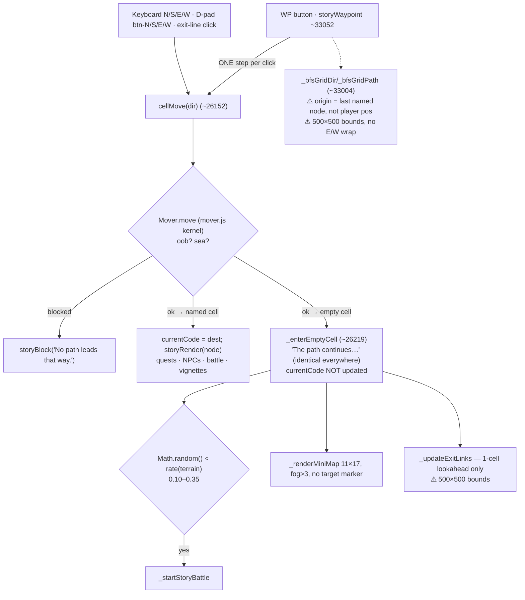
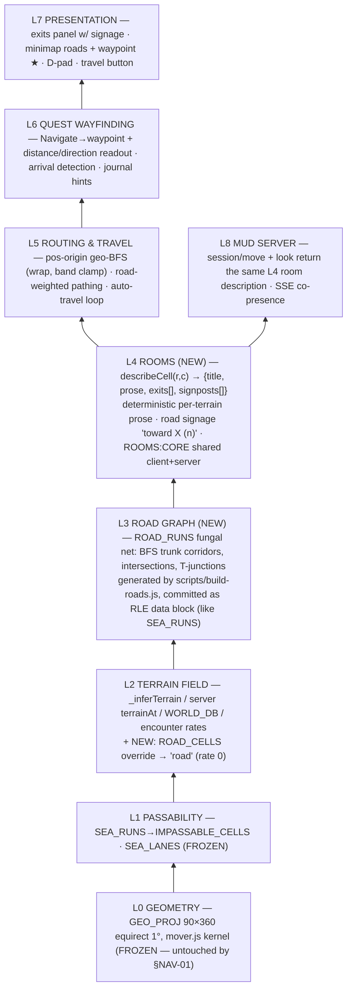

<!-- SPDX-License-Identifier: MIT — Copyright (c) 2026 paul@roll2hit.com -->
# plan.md — Archive (closed / completed work)

> Completed items moved out of `plan.md` on 2026-06-28 to keep the active plan lean.
> This is the verbatim record of finished work. Open work lives in `plan.md`.
> Per-wave §ARCH-01 UQF detail is also in `lab-reports/lab-report-uqf-migration-playbook.md`.

---

## Stale resume snapshots (superseded — kept for history)

### §RESUME — Continue Here (2026-06-26 snapshot)

**Current state (2026-06-26, last commit `d44f8b9`):** **§TIMELESS-01** (A–D + FU) and **§WALK-3** (1–3) are complete. **§WALK-4 is complete** (committed `d44f8b9`) — Inc 1 invariant proof (`scripts/check-invariants.js`, I1/I2/I3), Inc 2 CI gate (`.github/workflows/walk-invariants.yml` + `npm run check:walk`), Inc 3 rebuilt Playwright nav tests. **§WALK-4 caught + fixed 3 latent bugs:** orphaned `junction` WORLD_DB terrain, VBY `'bar (Visby)'`→`'bar'` key, and a **P0 `_enterEmptyCell` crash** (`#story-content` null on every empty-cell step; restored the §UNIFY-01 shared shell). All checks green (invariants + mover parity + Playwright: navigation 13/13, worldbuilder 18/18, autosave 4/4, debug+fishing 10/10). **§WALK-5 lab report ✅ DESIGN LOCKED** (`lab-reports/lab-report-walk5-mud-harness.md`); **§WALK-5 Inc 1 ✅** (`getMoverWorld()` terrain/encounter inputs + `scripts/check-terrain-parity.js`); **§WALK-5 Inc 2 ✅** (per-session seeded RNG + instanced encounter roll, stored at `s.encounter`); **§WALK-5 ✅ COMPLETE** (Inc 1–4) — server-side instanced encounters + `tests/mud-harness.mjs` (`npm run test:mud`): HTTP+SSE K-client driver, spawns throwaway servers, **24/24** assertions (co-presence delivery + instancing/no-bleed + `who`/`look` social state + idle-TTL prune); caught + fixed a real `session/say` double-send bug; wired into CI as a `mud` job. **This closes the entire §WALK series**, including **§WALK-5-FU ✅** (ferry kernel branch deleted 2026-06-26 — SEA_LANES already carries crossings, so no `FERRY_EDGES` data was needed). No open §WALK items remain. **Next work = top of the backlog** (§WALK-1.5-FU geo cleanups, §WALK-2-FU hook bug, then Tooling / Game-content / Mechanics arcs). Working tree: untracked `1367-sources/pla.md` + incidental `milepoints/api-cli.log` churn (hook-managed; don't stage). Full status + copy-paste prompt at the bottom of this file.

---

## Navigation Core Redesign — §WALK series ✅ CLOSED

> Data shapes locked in `lab-reports/lab-report-terrain-field-mover-redesign.md` (2026-06-25). Strictly sequential; each step is a green-CI checkpoint. Decisions: delete junctions (not transparency); **geo-grid** coordinate system (equirectangular 1°, 360×90, band 70°N→20°S, E↔W wrap, sea impassable + ferry edges, hub=LHR/Birka, 1° city collisions held as locale lists); instanced encounters v1.

- [x] **§WALK-1** — Deleted 316 `junction:true` boilerplate stubs (commit efa8f7a); predicate extended to `"Signpost says:"`; audit clean. Folded in the transparency revert.
- [x] **§WALK-1.5** — Geo re-projection (SCOPED — lab report §3.5). **DONE 2026-06-25.** Applied in 3 steps: (1) equirectangular 1° projection written to NODE_COORDS for all 409 nodes (geo-seed dryRun:false; CELL_GRID auto-rebuilds at load); (2) SEA_MASK installed — `SEA_RUNS` RLE from Natural Earth 110m coastline rasterized at 1°, builds `IMPASSABLE_CELLS` (4790 sea cells); node-occupied cells force-landed (0 nodes on sea); (3) ports+ferry model via **sea-lane land bridges** — `SEA_LANES` (59 cells) carve 1-wide walkable channels reconnecting all 26 island nodes (Iceland/Gotland/Sicily/Malta/Azores/Canaries/CapeVerde/Åland/Doha) + 3 hub maritime shortcuts (VEN↔CON, CON↔CAI, MAR↔ROM); lane cells render as `ocean` terrain (ocean encounters apply). Verified: 409/409 reachable from Birka. NEXT: §WALK-2. Ground truth: 409 nodes, ~84 geocoded, ~325 to place; 23 GEO2 cities collide at 1° (11 cells); CELL_GRID is last-write-wins (10 read sites). Decisions: geo-seed → equirectangular 1°; satellites offset to **own** true-coord cell (sub-degree residue co-locates as locale lists); off-Earth nodes (ASG/AEG/EHZ/MONS) → sub-location of entry-quest anchor; SEA_MASK from Natural Earth 1:110m coastline raster + snap-to-land reconciliation. Open: revisit 0.25° for dense regions?
  - Increment 1 ✅ equirectangular projection in geo-seed (wbapi-server.js), dry-run verified (LHR→10,197; London→18,179; 12 collisions/11 cells). NOT applied.
  - Increment 2 ✅ CELL_GRID → locale lists + `cellCode`/`cellCodes` helpers (10 read sites routed, verified no-op: 0 current collisions). Geocode METHOD validated = **invert-and-reproject** (abstract grid is geo-faithful, median 3 cells to GEO2 anchor; inversion exact on GEO2). Label-matching only covers 22/228 — rejected.
  - Increment 3 ❌ invert-and-reproject REJECTED by dry-run: abstract grid is not geo-faithful (409→108 cells, LHR+Damascus+Nuremberg merged; CAI/ATH/ROM/DAM/TBS cluster near Birka). Reverted; nothing applied. Only reliable source = true GEO2 lat/lon.
  - Increment 3 (gazetteer) ✅ `walk-geo-gazetteer.json` built + validated (254/254 non-GEO2 covered, no overlaps, parents/anchors resolve, in-band): 132 realPlaces, 26 satellites, 54 anchors (flagged), 42 offEarth. With 155 GEO2 → 287/409 have true coords. Surfaced: ~42 offEarth are whole fantasy SUB-REALMS (Atlantis DA/DS, Littoral Courts LC, epic peaks/jungle KTM/SJO, oriental BKK, cyberpunk HKG, Camelot BHD) — bigger than the "handful" the sub-location decision assumed. NEEDS DECISION: Earth-anchor sub-location vs off-grid/portal realm.
  - Increment 3 wiring ✅ geo-seed GEO2 synced to full 155; gazetteer loaded + resolver (satellites/anchors/offEarth chain to anchor cell). Full dry-run: all 409 project, 0 skipped, real cities at TRUE cells (CAI/ATH/ROM/DAM/BAG correct). Realm anchors REDISTRIBUTED by entry-quest where they exist (math→JRS confirmed) else by theme/biome: Birka pile 30→2; clusters now coherent (Tuscany, English literary, hag→Danube marsh, math→Jerusalem, Atlantis/Littoral→Athens). Residue: 4 anachronistic realms (HKG/BKK/CTU/SJO)→Samarkand, flagged off-grid candidates; ~19 German/scholarly interiors→Weimar hub. NOT YET APPLIED.
  - Increment 3 remaining (next) = author SEA_MASK (Natural Earth coastline) + snap-to-land reconciliation → coordinated apply (geo-seed dryRun:false writes NODE_COORDS).
- [x] **§WALK-2** — Extract pure shared mover `mover.js` (`move(world,pos,dir)→MoveResult` with wrap/clamp/sea/ferry/locale); rewire `cellMove` + `session/move` to thin callers; inline-and-verify for single-file guarantee. **DONE 2026-06-26.**
  - Inc 1 ✅ **client extraction** — `mover.js` created (pure kernel, geo wrap/clamp per §2.1, ferry kept as inert hook since §WALK-1.5 uses SEA_LANES land-bridges not ferry edges); `MOVER:CORE` block inlined byte-identically into roll2hit-v3.html (after TERRAIN_ENCOUNTER_RATE); `cellMove` rewired as thin caller via `_moverWorld()`. Verifiers added: `scripts/check-mover-parity.js` (structural byte-identity ✓ 2070B) + `scripts/check-mover-behaviour.js` (replays real CELL_GRID/IMPASSABLE: 41515/41760 exact, **0 content mismatches**, 245 empty-ocean edge/wrap fringe tolerated). Inline scripts parse clean; no identifier collisions.
  - Inc 2 ✅ **server extraction** — `require('./mover')` in wbapi-server.js; added `getImpassable()` (parses `SEA_RUNS` from `WBAPI._rawSrc` → 4790 sea cells, **matches client**), `getLocaleGrid()` (first-wins locale lists), `getMoverWorld()`; `POST /api/session/move` rewired as thin `Mover.move()` caller. **Latent bug fixed** (lab report §8): server now blocks sea/oob (S from Birka 10,197→sea = 409) and **unifies empty-cell movement** with the SP client (was 409, now 200 "unmarked crossroads"). Also made `buildCellGrid` **first-wins** so the primary at collided 1° cells (LHR/BK @ 10,197) matches the client's `CELL_GRID[key][0]` everywhere (start/look/move all report LHR). Verified end-to-end over HTTP: sea-block ✓, named move ✓, empty move ✓. Server restarted (in-memory copy matches disk). NEXT: §WALK-3.
- [x] **§WALK-3** ✅ — Recast reweave as read-only `GET /api/graph/reachability`; retire `fill-gap`/`rip-and-connect`/`fix-all-broken`/`fix-bidirectional`/`reweave-all` (410); delete dead reweave body (`wbapi-server.js`). Inc 1 ✅ + Inc 2 ✅ + Inc 3 ✅ — all done.
  - Inc 1 ✅ **reachability recast** — `GET /api/graph/reachability` now does a terrain-field LAND FLOOD (passable cells via `getImpassable()`, 4-conn + E↔W wrap + N/S clamp; lanes passable for free) instead of node-to-node adjacency. Old endpoint reported a bogus **2 reachable / 407 unreachable / 331 clusters** (it couldn't walk through empty land cells post-§WALK-1.5); recast reports the truth: **409/409 reachable, 0 unreachable, 1 component** (matches §WALK-1.5 offline verify; satisfies §WALK-4 I3). Added `components` (distinct land regions w/ ≥1 node) + lab-report `unreachable:[{code,r,c,terrain,label}]`. Scoped to the `reachability` branch only — `connect`/`broken` untouched. **fix-all-broken/fix-bidirectional are NOT separate endpoints** — they're phase labels inside `reweave-all`'s dead body, so they vanish with Inc 3.
  - Inc 2 ✅ **410 the mutators** — `POST /api/graph/fill-gap` + `POST /api/graph/rip-and-connect` now return **410** (`{ok:false, error, see:'GET /api/graph/reachability'}`); their full bodies were deleted (they sit outside the Inc 3 deletion range, so cleaned in place). Dropped both `./api.sh` command handlers and all dependent help/index/example entries; rewired stale suggestion strings (`broken`/`reachability`/`verify`/`connect`/`spawn-junction` now point at re-anchor-lat-lon / sea-lane / `./api.sh reachability` instead of the dead mutators). `reweave` (CLI orchestrator of rip-and-connect) un-advertised from help/command-list since it now hits the 410 — its code + the server `reweave-all` body are deleted in Inc 3. Verified live over HTTP: fill-gap→410, rip-and-connect→410, `GET /api/graph/reachability`=409/409 (1 component), both CLI commands now "Unknown command", mover parity still green. (`reweave-all` already 410s at :5763.)
  - **Doc-sync follow-up ✅ (2026-06-26, `check reweave`)** — Inc 2 claimed it dropped "all dependent help/index/example entries," but the audit found `API-README.md` + `docs-dev-environment.md` still advertised `reweave`/`fill-gap`/`rip-and-connect` as **live** commands (CLI help carried the retirement NOTE; these two standalone docs did not). Runtime confirmed correct first (CLI → "Unknown command", endpoints → 410). Removed the stale examples (2 `fill-gap` lines, 3 `reweave` lines, the `fill-gap` + `reweave-all` mapping-table rows) and added a **Retired (§WALK-3)** note in API-README pointing to `reachability` + `cluster-bridge`; repointed the dev-env cheat-sheet line at `reachability`. `fix-all-broken`/`fix-bidirectional`/`highway`/`junction` confirmed **still live** (left as-is). Docs-only; live-command refs intact (23).
  - Inc 3 ✅ **delete dead reweave body** — deleted `wbapi-server.js` lines 5759–8998 (3,240 lines: the entire dead body after the `reweave-all` 410 early-return, incl. P1 rip-and-connect / P4 fix-all-broken / P5 fix-bidirectional phases + all streaming/snail/map helpers); file 12,510→9,270 lines, then trimmed the stale doc-comment header + added a `logResponse` to the 410 handler. Fixed the now-stale `buildHighway` comment in `cluster-bridge` (it always used its own inline bridge). **Also deleted the orphaned `reweave` CLI orchestrator** in `api/wb.js` (lines 1201–1304, the `async 'reweave'()` method + comment block; it called the now-410 rip-and-connect) and updated the `streamPost` example comment. **Verified live:** both files `node --check` clean; server restarted; `POST /reweave-all`→410, `POST /rip-and-connect`→410, `GET /api/graph/reachability`=**409/409** (0 unreachable, 0 clusters); `node scripts/check-mover-parity.js` ✓ + `check-mover-behaviour.js` ✓ (0 content mismatches); `./api.sh reweave`→"Unknown command"; `./api.sh help` clean (only the §WALK-3 retirement NOTE mentions the dead endpoints).
- [x] **§WALK-4** ✅ — CI-gated invariant suite: reachability proof (I1/I2/I3) + walk parity (structural inline-identity + behavioural kernel trace) + rebuilt Playwright nav tests. Spec: lab report §6. Inc 1 ✅ + Inc 2 ✅ + Inc 3 ✅ — all done. **Surfaced + fixed 3 latent bugs:** orphaned `junction` WORLD_DB terrain, VBY `'bar (Visby)'`→`'bar'` key, and a P0 `_enterEmptyCell` crash (`#story-content` null).
  - Inc 1 ✅ **invariant proof script** — `scripts/check-invariants.js` (standalone, no server; line-based object slicing robust to narrative quotes). **I3:** replicates the server land-flood (ROWS=90/COLS=360, MOVES4 + E↔W wrap) from LHR → **409/409 reachable, 0 unreachable, 1 component**. **I2:** no `junction:true`, no WORLD_DB `junction` key. **I1:** `WORLD_DB.midlands` fallback exists + all **409** node terrains ∈ WORLD_DB. **The suite caught two real latent bugs on main — both fixed:** (1) an **orphaned `junction` WORLD_DB terrain** left behind by §WALK-1/§CELL-05 junction deletion (0 nodes reference it; nothing reads `WORLD_DB.junction`) — removed; (2) **VBY's malformed terrain key** `name:'bar (Visby)'` → the `(Visby)` suffix broke the `WORLD_DB['bar']` lookup, silently falling Visby's tavern back to midlands monsters instead of `bar`/Tavern-Brawl — corrected to `name:'bar'` (matches the `name`-must-be-terrain-key rule). Verified green + headless (0 console errors, VBY resolves to `bar`, junction gone, mover parity + behaviour still green).
  - Inc 2 ✅ **CI wiring** — added `.github/workflows/walk-invariants.yml` (job `invariants`, runs-on ubuntu-latest, `actions/checkout@v4` + `setup-node@v4` lts, **no `npm ci`** — the three proofs need only the Node stdlib + committed `mover.js`/`roll2hit-v3.html`) running `npm run check:walk` on push/PR with a `paths:` filter on `mover.js`/`roll2hit-v3.html`/`wbapi-server.js`/the three `scripts/check-*.js`/`package.json`/the workflow itself. Added `npm run` aliases: `check:invariants`, `check:parity`, `check:behaviour`, and `check:walk` (chains all three). Verified locally: `npm run check:walk` exits 0 (all green); gate fails red on any violation (proven in Inc 1 when the junction terrain + VBY key were still broken).
  - Inc 3 ✅ **rebuild stale Playwright nav tests** — fully reseeded `tests/integration/navigation.test.js` against current geo (LHR 10,197; E→BMA named move; N→empty; S→sea-block; NUE/MUC single-occupant cells for BFS/waypoint), ground-truthed every fixture headlessly. Covers: one-cell movement, **timeless movement** (hoursElapsed never advances — §TIMELESS-01 lock), empty-cell shell render, sea-block gate, BFS connectivity + reachability spot-check, waypoint follow, status bar. Dropped obsolete tests (`_gameWarn` deleted; the §UNIFY-03 gold-mutation premise — storyRender no longer calls storyCheckQuests). **13/13 green.** `worldbuilder-walk.test.js` turned out NOT stale (self-contained mock world) — **18/18 green** as-is. Also fixed the same stale-geo failures in `autosave.spec.js` (BOO→LXF→ LHR→BMA) — **4/4 green**; `debug`+`fishing` already green (10/10).
    - **🐞 P0 bug caught + fixed:** rebuilding the empty-cell test surfaced that `_enterEmptyCell` wrote to **`#story-content`, which does not exist in the DOM** (the real body container is `#story-text-box`) — so **every empty-cell step threw `TypeError: Cannot set properties of null`** and crashed the render. Root cause: `§MATH-01` (56af011) clobbered the `§UNIFY-01` shared-shell render and reintroduced the dead `#story-content` write. Earlier §TIMELESS smoke missed it because it wrapped `cellMove` in try/catch. **Fix:** restored the `_renderNodeShell(numBadge, name, act, badge, body)` helper + shell-based render (populates `#s-node-num`/`#s-node-name`/`#s-node-act`/`#story-act-badge`/`#story-text-box`, clears stale action cards). Verified headless: 0 console errors, shell renders, currentCode unchanged on empty cells.
- [x] **§WALK-5** ✅ — MUD multi-client harness; instanced per-session encounters on `session/move`; assert no cross-session encounter bleed. Inc 1 ✅ + Inc 2 ✅ + Inc 3 ✅ + Inc 4 ✅ — **all done; closes the §WALK series.** **Lab report ✅ COMPLETE** — `lab-reports/lab-report-walk5-mud-harness.md` (2026-06-26). Reconciled the parent §7 sketch with current code: (1) **no `huntMode`** (§TIMELESS-01 removed it — roll is just `roll < baseRate`); (2) blocked move stays **409** (the parent's `200 {ok:false}` predates the live handler — additive on the 200 path only); (3) encounter stored at **`s.encounter`** (new field), NOT `s.state.encounter` (`s.state` is the `'active'` lifecycle string serialized by `who`). Ferry **deferred not deleted** → **§WALK-5-FU** (author `FERRY_EDGES` for server+SP together, or drop the kernel branch). Monster pick uses **flat tier weights** (server has no notoriety state) — logged SP/MP divergence.
  - Inc 1 ✅ **world inputs + parity guard** — `getMoverWorld()` (wbapi-server.js) now wires **`terrainAt`** (mirrors client `_inferTerrain`: sea-lane→`ocean`, else majority of 4 orthogonal PRIMARY neighbour `name`s, strict-> tie-break in N,S,E,W order, `midlands` fallback — same `MOVES4` order as the client), **`encounterRate`** (parses `TERRAIN_ENCOUNTER_RATE` from `_rawSrc`, `_default` fallback), and **`getSeaLanes()`** (parses the `SEA_LANES` `new Set([...])` literal like `getImpassable()` parses `SEA_RUNS`). Kernel now reports real `encounter.{eligible,baseRate}` on empty cells (verified: LHR N→empty `eligible:true baseRate:0.15`; E→named BMA `eligible:false`). Added **`scripts/check-terrain-parity.js`** (folded into `npm run check:walk` + CI `paths:`): runs the REAL `_inferTerrain` (HTML) and `terrainAt` (server) — extracted from source + eval'd in a sandbox, no replicas — and asserts (A) the server rate-regex round-trips the client literal (15 keys), (A2) the SEA_LANES regex round-trips (59 cells), (B) both algorithms agree on every band cell (**10440/10440**). ferryEdges still unset (→ §WALK-5-FU).
  - Inc 2 ✅ **per-session seeded RNG + instanced roll** — `session/start` now seeds a per-session RNG (`s.seed`/`s.rngState`, derived from `sessionId` or an optional `body.seed` for the harness) and inits `s.encounter=null`. `session/move` **success path** rolls the instanced encounter (lab report §4.4): on an **empty** cell `s.encounter = seededNext(s) < baseRate ? pickMonster(terrain,s) : null`; on a **named** cell it clears `s.encounter`; a blocked **409** returns early so a pending encounter survives (you didn't leave the cell). Roll reads/writes **only `s.*`** → instanced by construction. `pickMonster` mirrors `_weightedMonsterPick` but **flat base-tier weights** `{trivial:40,easy:35,medium:20,hard:4,deadly:1}` (= `_notorietyWeights` at base n≤5; server has no notoriety — logged SP/MP divergence) and uses `WBAPI.monsters.byTerrain` (midlands fallback). Surfaced `encounter` on the move response + `who` (which also exposes `seed`). **Verified live over HTTP (throwaway :1368 instance, user's :1367 untouched):** determinism (same seed+path ⇒ identical trace), firing (32/40 seeds fired ≥1 encounter), per-seed divergence (31 distinct traces / 40 seeds). `check:walk` still green (terrainAt unchanged). The automated multi-client no-bleed/SSE assertions are Inc 3 (the harness).
  - Inc 3 ✅ **MUD multi-client harness** — `tests/mud-harness.mjs` (+ `npm run test:mud`): pure HTTP+SSE Node driver, **no Playwright**. Spawns a **throwaway** `wbapi-server` on `MUD_HARNESS_PORT` (default 13679 — never touches the dev :1367; pre-checks the port, kills the child in `finally`), starts K seeded sessions, opens an SSE stream per client (parses `event:`/`data:` frames), drives scripted move/say sequences, and asserts the three §5 properties: **(a) co-presence delivery** — chat reaches every co-present session (incl. sender) exactly once; a session that walks away stops hearing the cell; `player_arrived` fires once, only to sessions already at the destination, never the mover; **(b) instancing/no-bleed** — encounters are NEVER delivered over SSE (session-private), each trace is a pure fn of its own seed (determinism: same seed+path ⇒ identical trace), and different seeds diverge; **(c) social state** — `who` count + `look` `players[]` reflect true co-presence. **18/18 assertions, green across 3 consecutive runs.** **🐞 caught + fixed a real §CELL-07 bug:** `session/say` **double-delivered the sender's own chat** — `broadcastCell(...,null)` already includes the sender (they're at their own cell), then a redundant second `sseSend` to the sender fired it again; removed the redundant send. (CI wiring deferred to Inc 4 — the harness boots the server, which top-level-requires `@anthropic-ai/sdk`, so it needs `npm ci`, unlike the pure-stdlib `check:walk`.)
  - Inc 4 ✅ **TTL-prune assertion + CI job + doc-sync (FINAL)** — added property **(d)** to the harness: a **second** throwaway server booted with a `SESSION_TTL_MS` env override (new in `wbapi-server.js`; **inert in prod** — `SESSION_TTL` falls back to the 30-min default when unset) so the idle-prune path runs in ms. The harness keeps a **"Warm"** session alive with periodic `look`s and leaves a **"Ghost"** idle, then triggers the sweep (every `/session/*` request calls `sessionPrune()` first) and asserts **only** the idle Ghost is dropped (gone from `who`; `look`→404) **and** its SSE stream was server-closed (`res.end()` → client `'end'`), while Warm survives — proving prune is **selective**, not a blanket reap. Harness now **24/24** (18 + 6 TTL), green across 3 runs; no orphan servers; dev :1367 untouched. Wired into CI as a **separate `mud` job** in `.github/workflows/walk-invariants.yml` (`npm ci` + `npm run test:mud`) — can't ride the stdlib-only `invariants` job because the server requires `@anthropic-ai/sdk`; added `tests/mud-harness.mjs` to the trigger `paths:`. Refactored the harness server lifecycle into a `startServer(port,env)` factory + base-aware HTTP/SSE helpers to support the 2nd server. **§WALK-5-FU** (ferry) remains the only open §WALK item. **Closes §WALK-5 and the entire §WALK series.**
- [x] **§WALK-1.5-FU** ✅ **DONE 2026-06-26** — Geo follow-ups (user decisions: a=move to frontier cells, b=full redistribute, c=adopt 0.25° dense regions→**reversed to no-change after analysis**, d=run smoke-test). **(a) ✅** — HKG/BKK/CTU/SJO de-piled from SAM to own empty cells (29,246/31,246/30,247/30,245) via API; gazetteer offEarth→anchors+lat/lon, dry-run consistent. **(b) ✅** — 21-node Weimar pile redistributed to source-text homes: WM+ERF stay at Weimar (19,191); the other 19 to distinct empty cells near their narrative frame (Chaucer→England/Flanders, Grimm Goose-Girl/Faithful-John→Hesse, Faust→Leipzig, Maid-of-Astolat RVP→Astolat, Frithiof RNG/ING→Norway, Edda RSS→Iceland, Rustaveli PHY/GHC→Tbilisi, Cantor CNTR→math realm near JRS). Corrected 2 mislabels: GLD is a Goose-Girl court (NOT Florence — that's PSAGLD), CNTR is §MATH-01 (not a Weimar interior). PUT enforces 1-node/cell so each got its own cell; gazetteer rewritten, dry-run reproduces all 21 cells. **(c) ✅ no change** — `lab-report-walk15fu-grid-resolution.md`: 0.25° doesn't fix the anchor-chained piles (Weimar 21→2 bins) and costs 16× cells + 4× steps; de-piling done via (a)+(b) at 1° instead. **(d) ✅** — browser nav 14/14 (added positive sea-lane walkability test). **All 23 coord moves: reachability 409/409, check:walk green, diff coords-only.** Original notes: (a) 4 anachronistic realms (HKG cyberpunk / BKK oriental / CTU heavenly / SJO jungle) currently anchored to Samarkand — decide off-grid/portal realm vs Earth-anchor; (b) ~19 German/scholarly + Grimm interiors piled on Weimar hub — revisit distribution; (c) revisit 0.25° resolution for dense regions (Tuscany/London locale lists) if 1° co-location proves too coarse; (d) optional browser smoke-test of the new sea-gated overworld; (e) **Playwright nav tests stale** — `tests/integration/navigation.test.js` (+`worldbuilder-walk.test.js`) hardcode pre-§WALK-1.5 coords/adjacencies (BOO r:47,c:223→now r:2,c:194; BOO→LXF→SEN no longer adjacent) and assume one node per cell (LHR+BK now co-locate at cell 10,197). Already red on `main` independent of §WALK-2. Rebuild belongs in §WALK-4 (invariant suite); until then use the node parity harnesses (`scripts/check-mover-*.js`). See `project_walk_redesign` in memory.

---

## §TIMELESS-01 — Timeless movement + Hunt removal ✅ CLOSED

> User directive 2026-06-26: movement is pure one-cell N/E/S/W, no "walkable gap distance", no time advancing from travel, no hunting time bonus — the hunt screen/concept is gone. **Spec + data shapes locked in `lab-reports/lab-report-timeless-movement-hunt-removal.md`.** Decisions: (D1) **only movement is timeless** — keep the `⏱ Hours` HUD, fatigue, and Day 1→49 deadline; battles/sleep/fishing/short-rest still cost time; (D2) **remove the entire Hunt/Stalk feature**; (D3) plan + lab report first, then implement B→C ordered. Note: runtime is already one-cell (§CELL-03/§WALK-2) — "gap distance" is only leftover hint wording + the worldbuilder concept already retiring in §WALK-3. `slStalksWon` is mislabeled (counts BMA battle wins, not stalks) so `quest_slums_cleanup` survives hunt removal unchanged. API-First N/A: all changes are engine code (`_S_DEFAULTS`, `cellMove`, `QUEST_DB.completeFn`), not WBAPI data.

- [x] **Inc A — Movement timeless** ✅ — removed the two `hoursElapsed`/`hoursSinceSlept` += 1 lines in `cellMove` (replaced with a §TIMELESS-01 marker comment). Confirmed the remaining 4 time-write sites are all non-movement: short-rest (6449/23413), battle-start `_storyRollInit` (22337), sleep (31909); the hunt `+2` (26726) goes in Inc B. `⏱ Hours` HUD + fatigue + Day-49 all retained.
- [x] **Inc B — Hunt logic + state** ✅ — `cellMove`/`_enterEmptyCell` encounter branch → plain path (always `baseRate` + `_weightedMonsterPick` + "Wild …"); removed all hunt-only fns (`storyToggleHunt`, `_updateHuntBtn`, `storyQuestHunt`, `storyQuickWait`, `_stalkedMonsterPick`, `_getQuestTargetKeys`), the `HUNTING_GROUNDS` constant, both `huntMode` defaults, all `pb.stalk` flags + `!pb.stalk` guards, the storyRender hunt cards + per-quest hunt buttons (`huntBtnHtml` + the quest-card `🎯 Hunt` branch), the `_updateHuntBtn()` render call, the `btn-hunt-toggle` listener, and the stalk-modal JS (direct hide at 27226 + entries in two modal-ID arrays). The STALK section is now a fishing-only `🎣 Fish` section. **Grep-clean** (only §TIMELESS-01 marker comments remain); all inline `<script>` parses (0 syntax errors). Kept the shared `.btn-hunt`/`.hunt-accordion` CSS classes (reused by fish/condition/stealth/tournament UI) and `_notoriety`/`_notorietyWeights` (still used elsewhere) and `slStalksWon` (counts BMA wins).
- [x] **Inc C — Hunt UI/DOM/CSS** ✅ — replaced the 🎯 `#btn-hunt-toggle` with an inert `dpad-center-spacer` (keeps the 3×3 d-pad grid); removed the `#story-stalk-modal` HTML and its light+dark CSS, the hunt-specific CSS (`.hunt-section-hd`, `.hunt-target-*`, `.hunt-on`, `.stalk-chip`, `.stalk-quest-entry`, light+dark), and the now-orphaned `.dpad-center` rules. **Kept** the shared `.btn-hunt` + `.hunt-accordion` classes (still used by fish/condition/stealth/tournament UI). (HUNT cards in `storyRender` were already removed in Inc B.) **Verified in headless Chromium:** page loads with **0 console/page errors**; `#btn-hunt-toggle`/`#story-stalk-modal` absent; `storyToggleHunt`/`storyQuestHunt` undefined; `cellMove`/`storyFishing` intact; **5 cell-moves keep `hoursElapsed` at 0** (movement timeless, Inc A confirmed) while position changes.
- [x] **Inc D — Quest + wording + docs** ✅ — (a) commented the `slStalksWon` increment at `pb.nodeCode === 'BMA'` (`roll2hit-v3.html` :22762) noting it counts plain BMA combat wins, never depended on Hunt Mode; field name kept (no save migration); confirmed `completeFn:() => (S_story.slStalksWon||0) >= 3` is unchanged so `quest_slums_cleanup` still completes via 3 BMA wins. (b) Reworded the map-click hint from "not reachable in one step. Use D-pad to navigate toward it." → "only an adjacent cell can be clicked to move there. Use the D-pad to travel toward it." (adjacency, not gap-distance). (c) Doc sync: retired `mechanics-combat.md` §Stalk/Hunt Mechanic (replaced the full spec with a Retired pointer; reworded the 3 incidental Stalk refs at §How-combat-starts / §XP / §battlesWon to "random movement / corridor"); updated `index.md` — reverse-lookup row marked *retired §TIMELESS-01*, dropped the `HUNTING_GROUNDS` constant row + `huntMode` state-field row, state-field count **194→193** (verified: exactly one `_S_DEFAULTS` key removed vs pre-TIMELESS), `slStalksWon` redocumented as BMA-win counter, doc-health badge HTML-lines + last-sync-pass refreshed; removed the stale `huntMode` field from `tests/integration/helpers.js` SEED_STATE. **Verified in headless Chromium:** 0 console errors, all hunt fns/`HUNTING_GROUNDS`/`#btn-hunt-toggle`/`huntMode` field absent, 5 cell-moves keep `hoursElapsed` at 0. **Follow-up tracked → §TIMELESS-01-FU** (broader doc residue not in Inc D's scope).
- [x] **§TIMELESS-01-FU — Deep doc residue sweep** ✅ — retired/rewrote the stale Hunt/Stalk residue across all 7 deeper docs: **`monsters.md`** (rewrote the CS note + FL9 "Hunt & Corridor" → "Empty-Cell Encounter" milepoints; retired FL13 Stalk; deleted 7 removed-fn rows from the F5 table, re-anchored `_weightedMonsterPick`/`_enterEmptyCell` line numbers; dropped "stalk events" from the bait-fish note); **`maps.md`** (retired the Hunt-mode line, fixed `_storyFindTerrainNode` to read `NODE_COORDS` not `HUNTING_GROUNDS` — verified against the live fn body, retired the `HUNTING_GROUNDS` data-structure row, dropped "no stalk mechanic"); **`spec-engine.md`** (Layer 10 → REMOVED, annotated Layer 34/37 changelog entries, fixed the D-pad ASCII to the inert `dpad-center-spacer` + removed Wait, dropped `btn-dpad-stalk`/`btn-dpad-wait` guard rows + `storyQuickWait` fn row, rewrote the `.dpad-center` CSS to match the live `display:block` spacer); **`spec-world.md`** (kept "The Vermin Pit" as lore, retired the `HUNTING_GROUNDS` display-name pointer); **`mechanics.md`** (dropped "Stalk" from 3 lines, rewrote the bogus `S_story.hunting` "Hunt Mode" paragraph to the real auto-roll behavior); **`docs-node-network.md`** (rewrote the Hunt-Mode `effectiveRate=1.0` paragraph). **`cell-resume-prompts.md`** is a frozen archive of completed §CELL prompts — added a staleness banner flagging its Hunt-Mode references as obsolete rather than rewriting history. Final grep confirms every surviving mention is a retirement note, a historical annotation, or generic "hunting ground" terrain prose. Two-way sync rule satisfied.

---

## Tooling — closed items

- [x] **§WORLDBUILDER-01 ✅ RESOLVED-BY-RETIREMENT (2026-06-28)** — original spec ("visual grid editor, **exit bidirectional wiring**, collision detection") is **half-obsolete**: §CELL/§WALK made navigation cell-first (geo-grid `(r,c)`, adjacency `(r±1,c)`, **zero N/S/E/W exit pointers**), so all exit-wiring UI now edits dead fields and *re-injects* them into the game on save. The canvas node map already exists (Map tab + §WALK-G). **Decision (2026-06-28): retire the dead exit UI first**, then (later) build cell-first drag-to-reposition. **Inc 1 ✅ (2026-06-28) — scattered dead-exit UI retired** (`worldbuilder.html`): Map-tab node-detail **Exits N/S/E/W panel** + **degree/junction badges** (→ replaced with a read-only `⌖ cell (r,c)` row) + dead **renderMap N/S/E/W edge-drawing**; **CRUD node form** N/E/S/W cols/labels/fields/rowData + the dead `junction` list filter; the **relationship-graph** N/S/E/W node-node edges; the **"Map Connectivity Audit"** op (`opMapAuditRun` → `/api/audit/map`) + its Builder row (→ pointer to §WALK-3 `GET /api/graph/reachability`); the schema help-doc N/S/E/W line (→ cell-first note); and `createNodeAt`'s new-node template dropped `N/S/E/W:null`. 106 worldbuilder tests pass; no test depended on the removed UI. **Inc 2 ✅ (2026-06-28) — 🔲 Grid tab DELETED** (user decision: delete entirely). The Grid tab was a *whole* second exit-wiring editor — a self-contained IIFE (`worldbuilder.html` 8027–8716: ~90 HTML via `insertAdjacentHTML` + ~700 JS): drag-to-move + `OPP` N/S/E/W bidirectional wiring + `edgeIsBroken`/degree filters (broken/stray/deg-4-full/deadend/open) + a `switchTab` monkey-patch + `refreshHealth` BFS-over-exits — **and its toolbar called §WALK-3-RETIRED endpoints** (`🔧 Fix Broken`→`fix-all-broken`, `🔀 Rip+Connect`→`rip-and-connect`, both now **410**), so it was obsolete *and* actively broken under cell-first. Removed: the `🔲 Grid` nav button (line 415), the entire IIFE (690 lines, 10516→9826), and repointed the one external dependency — §EDITOR-01 Quest Creator anchored its panel `afterend` of `#tab-grid` → now `#tab-wizard` (grid's own old anchor). All `refreshHealth`/`degOf`/`edgeIsBroken`/`gridSelected`/ghost-list/etc. were grid-IIFE-internal (no external callers). Inline script parses; **106 worldbuilder tests pass** (editor/mission/walk tabs, which chain off the repointed insertion, all green). **§WORLDBUILDER-01 RESOLVED-BY-RETIREMENT** — the dead exit-wiring "visual grid editor" is fully gone; the live node-map capability lives on the **Map tab** (canvas + §WALK-G act filter / terrain color / compass / 📍 place mode). **Optional future (unscheduled): drag-to-reposition on the Map-tab canvas** (geo `(r,c)` with the 1-node/cell rule, reachability via the §WALK-3 land-flood) if a richer cell-first editor is wanted.
- [x] **§EDITOR-02 ✅ CORE COMPLETE (Inc 1–4)** — Mission Builder tab in worldbuilder.html (form-based arc insertion with Preview Chain + POST All). **Inc 1 ✅ lab report DESIGN LOCKED** (`lab-reports/lab-report-editor02-mission-builder.md`): an arc = an ordered list of quests linked *purely by flags* (`WBAPI.quests.chain` derives up/down from flag reads vs writes; no dedicated arc runtime object), so the builder's whole job is generating those flags correctly. Locked: the `arcDraft={arcId,arcLabel,activateNode,steps[]}` model; a **pure** `buildArcQuests(draft)→questObj[]` compiler (seq ids `<arcId>_<n>`, auto-wire step *k*'s `activateCond:(s)=>s.<prev flag>` — MUST emit arrow-fn source, never bare ident, or the save-abort guard wbapi-core.js:1195 fires; skill_check producer flag = `checkPassFlag` (auto `<arcId>_<n>_passed`), non-skill producer = appended `grantBit|<arcId>_<n>_done` → **depends on §EDITOR-01-D's itemChain runtime**); per-step itemChain via the shared `parseItemChainText` codec; **Preview Chain** renders compiled steps as `.chain-link` rows + `↓ reads <flag>` connectors + per-step `advise` badges (red badge disables POST); **POST All** = sequential `WBAPI.quests.create` (the existing single-quest path, worldbuilder.html:1996), stop-on-first-error + already-posted skip. **No engine, no server, no wbapi-core change — pure worldbuilder authoring tool.** **Inc 2 ✅ `buildArcQuests` compiler DONE** — pure arc compiler in worldbuilder.html (editor IIFE, after the itemChain codec; `window.buildArcQuests` bridged for tests + the Inc 3 UI). Helpers `edArcProducerFlag`/`edArcEffectiveGate`; emits seq ids, arrow-fn `activateCond` (verified never a bare ident), skill_check `checkPassFlag` (always) / non-skill `grantBit|…_done` (only when a downstream auto step consumes it → no stray token on the last/unread step), parses side/itemChain text via the shared codec. **Refinement vs Inc-1 lock:** producer grantBit is *consumption-gated*, not unconditional (lab report §4 updated). New spec `tests/integration/worldbuilder-mission-builder.test.js` — 6 passed. check:walk green. **Inc 3 ✅ tab UI DONE** — new `⛓ Mission` nav tab + `#tab-mission` panel (own IIFE after the editor IIFE, inserted afterend of `#tab-editor`). Arc-header form (`#mb-arcId`/`#mb-arcLabel`/`#mb-node`) + add/remove step rows (`mbStepRow` — type-conditional skill/side blocks, gate select w/ manual `activateCond` reveal, itemChain textarea); **Build Chain** calls `window.buildArcQuests(mbCollectDraft())` and **Preview Chain** renders `.chain-link` rows + `↓ reads <flag>` connectors + per-step `WBAPI.quests.advise` badges (🔴/🟡/✓); POST All present but disabled (Inc 4). Test hooks `__mbCollectDraft`/`__mbCompiled`. Spec +2 DOM tests (2-step arc Build→preview w/ connector flag; remove-step renumber) — **8 passed**; quest-editor + crud-arrays unbroken (7 passed). **Inc 4 ✅ POST All wiring DONE — closes core** (`293808e`) — `mbPostAll()` iterates `mbCompiled` **sequentially** (each `WBAPI.quests.create` runs `_buildIndexes`, so later steps' `advise()` sees earlier ones), with **stop-on-first-error** + an **already-posted skip** (a step whose id is already in `questDb` is `⊘ skipped`, never re-created → re-pressing after a partial/failed run resumes instead of dying on "already exists"). Per-step render into `#mb-result` (`✓ posted` / `⊘ skipped` / `🔴 error` + "Stopped at step N"), `Done — N posted` summary on a clean run, then `_buildIndexes()` + `renderQuestList()`; re-entrancy guard (`mbPosting`) + `window.__mbPostAll` hook; wired `mb-post` click. **Incidental fix:** `mbShowResult` sets `display:block` — base `.op-result` is `display:none`, and the existing `style.display=''` pattern (`showResult`/`edShowResult`) actually leaves the box hidden (never asserted on). Spec +2 Playwright with a **mocked create**: in-order post→done summary, and skip-existing + stop-on-error (create called only for the non-existing step) — **10 passed**; quest-editor + crud-arrays unbroken (7 passed). **Remaining: §EDITOR-02-FU** (branching arcs, drag-reorder shared w/ §EDITOR-01-D-FU, whole-arc UQF export → §EDITOR-03).
- [x] **§WALK-G extensions ✅ COMPLETE (2026-06-28)** — ~~terrain-color dots~~, ~~act filter~~, ~~node creation in-context~~, ~~compass rose~~ (see index.md Planned Features). **Terrain-color dots ✅ (2026-06-27)** — Map tab gained a `#map-color-mode` select (Color: by Act | by Terrain); `renderMap` fills each node dot from `terrainColor(node.name)` (a deterministic HSL string-hash — no 40-entry palette to maintain, new terrains colored for free) when terrain mode is active, else `ACT_COLORS[act]`. Tooltip now also shows the terrain key (`⛰ name`). New spec `worldbuilder-map-color.test.js` (terrainColor stable/distinct/fallback; canvas-pixel scan proves the act-green dot fill disappears under terrain mode). **Act filter on the map canvas ✅ (2026-06-28)** — the existing `#map-act-filter` (which previously filtered only the sidebar list) now also dims the canvas: `renderMap` reads the filter + an `inAct(code)` helper (same `node.act||1` default as `renderMapNodeList` so list/canvas agree); out-of-act node dots render as a faded grey `#2d333b` 3px disc (keeps spatial context, no markers/label) and edges with an out-of-act endpoint draw in `#191f26`; the `change` listener now calls `renderMap()` too. Spec +1 in `worldbuilder-map-color.test.js` (two nodes diff acts → filter to Act II → in-act dot keeps `#3fb950`, out-of-act dot dimmed to `#2d333b`). **Compass rose ✅ (2026-06-28)** — a north-up SVG overlay (`#map-compass`, 4-point star + N/E/S/W labels, `pointer-events:none` so it never intercepts map clicks) anchored bottom-right of the **map column** div (made `position:relative`; NOT inside `#map-canvas-wrap`, which scrolls — the column has `overflow:hidden` so the compass stays pinned while the canvas pans). Theme-driven colors (`--bg2`/`--border`/`--accent`/`--red`/`--text`/`--muted`); north tip flagged red. Spec +1 (4 tests total): N label above S, E right of W, exactly the 4 cardinals, `pointer-events:none`. **In-context node creation ✅ (2026-06-28)** — a `📍 Place node` toggle in the map footer (`#btn-place-node`); when active, clicking an **empty** map cell prompts for a code and drops a new node at that cell's real `(r,c)` (vs the off-grid `c:64` virtual cell the `+ Add` button uses), then one-shot-exits place mode. Factored the create logic into a shared `createNodeAt(code,coord)` (validates 1-6 `[A-Z0-9_]`, dedups, alerts on bad/dup; both `+ Add` and place-mode route through it); `cellFromPx`/`cellOccupied` helpers; clicking an existing node in place mode just selects it + exits (hitNode's `0.85·S` catch radius exceeds the cell half-diagonal `0.707·S`, so `cellOccupied` is a defensive guard for the programmatic path, not click-reachable). Live `＋ place at cell (r, c)` readout in `#map-hover-info` + `copy` cursor while placing; `.btn.active` style. Test hooks `__createNodeAt`/`__setPlaceMode`; spec +3 (7 map-color tests total): empty-cell drop at real coords + one-shot exit, click-node-selects-not-creates, dup/invalid reject. **§WALK-G CLOSED — all 4 extensions shipped.**
- [x] **§WBAPI-01 phases 3–5 (+ ph4-FU) ✅ FULLY CLOSED** — **ph3 (full-array PATCH) ✅ DONE 2026-06-27** (`lab-report-wbapi01-ph3-array-patch.md`): `PUT /api/{type}/{key}` array/number/boolean values now patch `_rawSrc` at source level (persist through `save()`) instead of the old in-memory-only `ns.put`. Added `serializeJsLiteral` + `patchLiteralField` + `WBAPI.editStructuredField` (wbapi-core.js), wired the server dispatch (wbapi-server.js ~8905), regression guard `scripts/check-array-patch.js` (`npm run check:arraypatch`, 13 checks: string/object arrays + number round-trip + insert + fn-reject). Verified core + end-to-end HTTP (throwaway server) + check:walk + mud harness green. **ph5 (standalone Node module) ✅ ALREADY DONE 2026-06-27** — both interpretations already shipped: `wbapi-core.js` is a standalone requirable module (`require('./wbapi-core')`), and `GET /api/export/{collection|all}?format=module` emits valid `module.exports = {…}`. Verified requirable: quest_db (2839), monster_pool (392), node_map (410), and `export/all` (NODE_MAP/QUEST_DB/MONSTER_POOL/WORLD_DB/FISH_POOL/NIGHT_FISH_POOL/LAKE_MAGIC_DB) all `require()` clean. No new code. **ph4 (worldbuilder write tab) — increment 1 ✅ DONE 2026-06-27:** discovery showed the write infra mostly pre-existed (PUT/POST/DELETE across map/crud/editor/builder tabs); the genuine gap was **array-field authoring**. Added `targetMonsterKeys` (comma-separated) + `killGoals` (line-based `key:need:label` → object array) inputs to the §EDITOR-01 Quest Creator (it already had `completeItems`), wired through `edBuildQuestObj` → Export JS / POST + preset-reset + live-preview lists. New Playwright spec `tests/integration/worldbuilder-quest-editor.test.js` (2 tests: full serialize incl. killGoals object array + need/label defaults). Full suite 40 passed (2 pre-existing worldbuilder-walk flakies). **ph4-FU ✅ DONE 2026-06-27:** the CRUD quest form now edits EXISTING entities' array fields. Added `completeItems`/`targetMonsterKeys`/`killGoals` to the quest CRUD field defs with an `arr` codec layer (`arrToText`/`textToArr` in the CRUD IIFE — `csv` ↔ string array, `objlines` ↔ `{key,need,label}` array); `renderDetailForm` seeds the inputs from the stored array, `collectFormData` parses them back to real arrays. The existing PUT dispatch (wbapi-server.js ~8905) already routes array values to ph3 `editStructuredField`, so no server change. Verified end-to-end via a live server round-trip on `mq_1` (PUT updated `completeItems` + inserted `killGoals`; `save()` wrote both to `roll2hit-v3.html` source; reverted). New spec `tests/integration/worldbuilder-crud-arrays.test.js` (2 tests: codec round-trip + DOM form → `collectFormData` array emission via `window.__crudTest`). check:walk green. **§WBAPI-01 is now FULLY CLOSED (ph1–5 + ph4-FU).**
- [x] **§EDITOR-01-D ✅ CORE COMPLETE** (Inc 1–4) — Token item manager. **User decision 2026-06-27: build the clean declarative `itemChain` quest field** (runtime compiles grant/take/grantBit/takeBit steps into inventory mutations) — NOT a fragile regex function-body editor, because every token push/splice currently lives inside quest handler bodies + a 58-branch `if(id===…)` reward ladder in `storyCheckQuests` (~25835), unreachable by the source-patch API. **Inc 1 ✅ lab report DESIGN LOCKED** (`lab-reports/lab-report-editor01d-itemchain.md`): `itemChain:Step[]` schema (4 action kinds), `_applyItemChain`+`_takeMissionBit` applier hooked into both completion paths (`_rollCeremonia` 6251 skill_check + `storyCheckQuests` 25829 main), additive/inert migration, pipe-delimited `arr:'itemchain'` authoring codec on both Quest Creator + CRUD form, persists via existing ph3 `editStructuredField` (no server change — `itemChain` is greenfield, 0 refs). `takeBit` adds `_takeMissionBit` (advances §MBIT-02). Increments: 2=runtime+check script, 3=Quest Creator authoring, 4=CRUD edit authoring, 5=FU (visual UI + ladder migration → §EDITOR-01-D-FU/§DATA-01-REVERTED). **Inc 2 ✅ runtime DONE** — added `_takeMissionBit` (clears flag + splices token by `flagRef`; also advances §MBIT-02) + `_applyItemChain(q)` (grant w/ defaults+`once`, take first/all, grantBit/takeBit, unknown-action no-throw) after `_grantMissionBit` (~23527); hooked additively into both completion paths (`_rollCeremonia` 6252 → `storyMsg`; `storyCheckQuests` 25830 → `msgs.push(...)`). **Inert** (0 quests author `itemChain` yet → no behavior change). Guard `scripts/check-itemchain.js` (`npm run check:itemchain`, **19 checks**: semantics + `once` idempotency + take-all + ph3 source round-trip) wired into CI `invariants` job + `paths:`. Verified: 19/19, check:walk green, headless smoke 0 console errors (grant/grantBit/takeBit mutate live inventory, `hoursElapsed` untouched). **Inc 3 ✅ Quest Creator authoring DONE** — added an always-visible `#ed-itemChain` textarea (item chains apply to ALL quest types, so it sits outside the skill_check/side toggle) + shared codec fns `parseItemChainText`/`itemChainToText` (pipe-delimited grammar ⇄ Step[], `|` survives in desc, `all|true|1`→take-all); wired into `edBuildQuestObj` (type-agnostic, after the if/else), the `edGenerateExport` serializer (new `itemChain:[…]` branch beside `bits`), and the preset-reset + live-preview id lists. Playwright `worldbuilder-quest-editor.test.js` +2 tests (4-action Export serialization + name-only grant); full worldbuilder suite **27 passed** (4 pre-existing worldbuilder-walk flakies). Codec round-trip verified in node-vm (incl. take-all, minimal grant, pipe-in-desc); worldbuilder loads 0 page errors. **Inc 4 ✅ CRUD edit authoring DONE** — added `itemChain` to `CRUD_TYPES.quest.fields` with `arr:'itemchain'` (textarea); `renderDetailForm`/`collectFormData` already route `f.arr` generically (no change). The CRUD `arrToText`/`textToArr` codec gained an `itemchain` branch — but the codec fns live in a **separate IIFE** from the CRUD one, so bridged via `window.parseItemChainText`/`window.itemChainToText` (set from the editor IIFE; CRUD calls `window.*`). Tests: `worldbuilder-crud-arrays.test.js` +1 (4-action codec round-trip via `__crudTest`) + extended the form test (itemChain TEXTAREA + `collectFormData` emits the parsed array) — **7 passed** (quest-editor + crud-arrays). **Live HTTP round-trip** on a throwaway server (PORT/ROLL2HIT_FILE env, on a /tmp copy, real file + user :1367 untouched): `PUT /api/quest/mq_1 {itemChain:[…]}` → `editStructuredField` (`inserted:true`) → `POST /api/save` wrote the `itemChain:[{action:'grant',…}]` literal to the copy's source (grep ✓); artifacts cleaned. check:walk + check:itemchain green. **FU remains (§EDITOR-01-D-FU):** visual drag-reorder chain UI + mechanical migration of the 58-branch reward ladder → itemChain (→ §DATA-01-REVERTED).
- [x] **§EDITOR-01-D-FU ✅ CLOSED (a + b)** — itemChain follow-ups (opened 2026-06-27, after §EDITOR-01-D core; closed same day): (a) **visual drag-reorder chain UI** — replace the textarea codec with a step-list editor (add/remove/reorder action rows, per-action field inputs) on both the Quest Creator + CRUD form; (b) **mechanical migration** of the 58-branch `if(id===…)` reward ladder in `storyCheckQuests` (~25835) — extract the *pure* `inv.push`/`splice` branches to declarative `itemChain` (the mixed gold/favor/conditional/msg branches stay as code or move to a future effects layer); overlaps §DATA-01-REVERTED. Runtime + authoring + persistence already shipped in §EDITOR-01-D. **(a) Inc 1 ✅ lab report DESIGN LOCKED** (`lab-reports/lab-report-editor01d-fu-chain-ui.md`): pure authoring-UI change — no data-shape/runtime/server change. Locked: a window-bridged `buildChainEditor(host,{initial,onChange})` **factory** (per-mount instance, NOT a singleton — Quest Creator + CRUD can coexist) returning `{getSteps,setSteps,el}`; `.chain-row` = drag-handle + kind `<select>` (grant/take/grantBit/takeBit) + kind-conditional field inputs (`data-cf`) + ▲/▼ (canonical, testable reorder) + ✕, drag as additive enhancement; per-kind field schema is a **superset** of the text grammar (adds `grant.once` checkbox, emitted only as `once:false`); `getSteps()` byte-identical to `parseItemChainText` output otherwise (codec **kept** for export + tests + a parity assertion). Integration: Quest Creator swaps `#ed-itemChain` textarea → `#ed-itemChain-editor` host (`edBuildQuestObj`→`edChain.getSteps()`, drop id from `liveIds`/reset, `onChange:edSchedule`); CRUD special-cases `f.arr==='itemchain'` in `renderDetailForm`+`collectFormData` (other `arr` fields untouched). Increments: 2=`buildChainEditor` factory + headless tests (round-trip all 4 kinds, reorder, required-drop, `once`, codec parity), 3=Quest Creator wiring + Playwright, 4=CRUD wiring + Playwright (closes (a)). **(a) Inc 2 ✅ factory DONE** (`78ca3ae`) — `buildChainEditor(host,{initial,onChange})` in the editor IIFE (after the codec, `window.buildChainEditor` bridged); per-mount instance `{el,getSteps,setSteps,addStep}`; `.chain-row` = grip + kind `<select>` + kind-conditional `data-cf` inputs + ▲/▼ + ✕, native drag additive; `CHAIN_KINDS` schema + injected `.chain-*` CSS. `getSteps()` byte-identical to `parseItemChainText` plus `grant.once` (emitted only as `once:false`); blank-required rows drop (mirrors `.filter(Boolean)`). New spec `worldbuilder-chain-editor.test.js` — **6 passed** (4-kind round-trip, once superset, ▲/▼ reorder, required-drop, codec parity, instance independence); quest-editor + crud-arrays + mission-builder unbroken (17). **(a) Inc 3 ✅ Quest Creator wired** (`0198149`) — replaced the `#ed-itemChain` pipe-grammar textarea with a mounted `buildChainEditor` instance (`#ed-itemChain-editor`); `edBuildQuestObj` now reads `q.itemChain` from `edChain.getSteps()` so Export JS round-trips the widget; dropped `'ed-itemChain'` from the `liveIds` listener loop + the `edApplyPreset` blank-reset loop, clear via `edChain.setSteps([])` on reset; `onChange:edSchedule` drives live preview; `window.__edChain` test hook (mirrors `__mbPostAll`). Codec kept for export/parity. Tests: migrated the 2 existing itemChain export tests off the removed textarea onto `__edChain.setSteps`, +4 Inc 3 tests driving the real widget DOM (Add step / kind select / `data-cf` inputs / ▲▼) end-to-end — mixed-chain export, `once:false`, reorder reflected in export order, blank-preset clears rows. **14 quest-editor + 6 chain-editor passed; 13 sibling worldbuilder (crud-arrays + mission-builder) unbroken.** **(a) Inc 4 ✅ CRUD form wired — CLOSES (a)** (`c2e6892`) — `renderDetailForm` special-cases `f.arr==='itemchain'` **before** the generic textarea branch: mounts a `buildChainEditor` seeded from `entity.itemChain`, stashes it on the host (`data-chain-field` + `._chainEd`); `collectFormData` reads that instance's `getSteps()` instead of a `#crud-field-*` input. Other `arr` fields (csv/objlines) keep their `arrToText`/`textToArr` textarea path untouched; the CRUD `itemchain` codec stays live for `__crudTest`. Exposed `renderDetailForm` on `window.__crudTest` so the seed path is testable server-free. Tests: migrated the form round-trip off the removed `#crud-field-itemChain` textarea onto the widget; +3 Inc 4 tests (entity-seed renders one row/step in order + round-trips, ▲/▼ reorder reflected in `collectFormData`, empty-entity mounts empty widget then DOM authoring shows up). **30 worldbuilder tests pass** (crud-arrays + quest-editor + chain-editor + mission-builder); check:itemchain 19/19. **(a) DONE.** **(b) Inc 1 ✅ design lock** (`27956e4`, `lab-reports/lab-report-editor01d-fu-b-ladder-migration.md`) — full re-runnable classification of all 61 `storyCheckQuests` reward-ladder branches: **7 expressible-now** grants + **3 take-only** (→ wave b2a, no grammar change) · **14 rich-field** pushes (readText/bonus/passive/weapon-stats/uses → need grant-grammar widening **b1**) · **2 dynamic-item** (`tl_01`/`tl_03`, never migratable) · **19 no-inventory** (gold/favor/flag → future effects layer, OUT) · **16 msg-only** (nothing to move). Reframes the FU brief — there are ~no "pure push" branches, so (b) is **PARTIAL extraction** (pull only the inventory ingredient; gold/favor/xp/flag/msg stay code). Locked: (b1) grant-shape widening (explicit allow-list across `_applyItemChain` runtime + codec + (a) `CHAIN_KINDS.grant` widget + check:itemchain); migrated grants run **silent** so the ladder's verbatim narrative msg is preserved (parity-checkable); **item names byte-preserved** (KEY_EVENTS/completeItems reference them); once-dedup → grant default `once:true`; hard scope fence vs **§DATA-01-REVERTED** effects layer. Parity guard `scripts/check-ladder-migration.js` built first. Increment plan: 2=parity guard, 3=wave b2a (10 branches, silent grants), 4=b1 widening, 5=wave b2b (14 branches, **closes (b)**). No code changed in Inc 1. **(b) Inc 2 ✅ parity guard built first** (`3b04691`) — `scripts/check-ladder-migration.js`, a **manifest-driven** safety net (empty `MIGRATION_MANIFEST` at this increment). Per migrated quest it asserts vs the live game file: (a) inventory parity (`_applyItemChain` on the real itemChain, replayed from empty, reproduces the recorded grant(s) field-by-field over the allow-list + applies recorded take(s)); (b) **silent** grants (`silent:true` so no double "<item> obtained." vs the ladder's verbatim msg); (c) no double-grant (surviving branch no longer pushes the migrated name); (d) name preservation (KEY_EVENTS[].item + completeItems references persist). Extractor lifts `_applyItemChain` into a vm sandbox + parses `storyCheckQuests` into quest→branch source + indexes key-event/completeItems names; structural smoke independently finds **exactly 61 ladder branches** (matches Inc-1 classification) + 7 key-event items → 6 checks green; dry-ran (a)-(d) against a synthetic migration (positives pass, wrong-field + non-silent caught). Stdlib-only → rides the no-install `invariants` CI job beside `check:itemchain` (npm `check:laddermigration` + path triggers + run step). **(b) Inc 3 ✅ wave b2a — 9 branches migrated** (`5454543`) — moved the inventory effect of 9 reward-ladder branches into each quest's `itemChain` (gold/favor/XP/flag + verbatim msg stay in the branch; grants `silent:true`). Grants: cat_03 Rhinestone Collar, cat_04 Furball Crown, cat_05 Don's Signet Ring, cat_06 Cat-King's Claw, night_eel Eel Skin Pouch, pit_training Pit Legend Token, couperin Cipher Scrap. Takes: couperin Quill's Lute, brynn_ledger Worn Ledger Book, pachelbel Sealed Scholar Box. **Excluded the 10th (`wm_01`)** — its seal removal is conditional + count-limited-to-3, not expressible as a simple `take` (stays code, effects-layer territory). Runtime: `_applyItemChain` grant honors `silent` (minimal slice of b1). **The parity guard caught a real latent bug** — `take all:true` reassigned `S_story.inventory`, orphaning the cached `inv` ref so a later grant in the same chain (couperin) vanished; fixed by splicing in place. Guards: manifest populated → 56 checks; check:itemchain +4 regressions (silent; take-all-then-grant) → 23; game-level Playwright (navigation + fishing smoke) 23 pass. **(b) Inc 4 ✅ b1 grant-grammar widening** (`7fc0d8e`) — grant can now carry the full item shape (unblocks b2b's 14 rich branches), kept in lockstep across 4 consumers: **runtime** `_applyItemChain` grant copies an explicit allow-list when present (`desc`/`description`, `readText`, `readableKey`, `readable`, `passive`, `bonus`, `uses`, `minLevel`, `atkBonus`/`dmgDie`/`dmgCount`/`dmgFlat`; off-list dropped — no arbitrary passthrough); **widget** grant rows gain an "advanced (JSON)" rich field + a `silent` checkbox, `readRow` merges parsed JSON (invalid ignored, off-list dropped) and `renderFields` pre-fills both from the step → editing a migrated rich/silent quest in the CRUD form no longer drops `bonus`/`readText`/`silent` on save (round-trip safety — the real reason the widget had to widen before b2b); **export serializer** JSON-stringifies object fields (`bonus:{…}`) instead of coercing to `"[object Object]"`; **check:itemchain** +rich passthrough/off-list-drop/rich-source-round-trip → 28. Tests: chain-editor +4 (rich round-trip, invalid-JSON ignored, off-list drop, silent round-trip), quest-editor +1 (rich grant exports valid JS); 35 worldbuilder + 28 itemchain + 56 ladder + 23 game-level pass. **(b) Inc 5 ✅ wave b2b — 13 rich-field branches migrated → CLOSES (b) and §EDITOR-01-D-FU** (`de64c16`) — moved the inventory effect of the rich-field branches into each quest's `itemChain` via the b1-widened grant grammar (gold/favor/XP/ability-score writes/flag + verbatim msg stay in the branch; every grant `silent:true`). Done by a throwaway mechanical transform (object literals incl. long `readText` blobs moved **byte-for-byte** — zero hand transcription), re-verified field-by-field by the parity guard. **Grants:** void_below (Scholar's Note + EMP Grenade `uses:1`), shale_drop (Y. Gurt Field Survey), guide_06 (Rod of Self-Discovery — weapon `atkBonus/dmgDie/dmgCount/dmgFlat/minLevel`), scar_04 (The Scar's Light `passive` + Orrens Manuscript), wm_02/03/04 (tomes w/ `bonus:{deathSave|initiative|atkWhileQuestActive}`), muffat_05/solm_01/signal_01/muffat_03/muffat_02 (readable logs), va_02 (Constructor's Log `readable/readableKey` + Antecedent Seal). **`muffat_02` Shipping Manifest + `va_02` Antecedent Seal are KEY_EVENTS items** — names byte-preserved, guard cross-checks. **Excluded `fishing_guide`** (the one "pure push"): its `readText` is `FISHING_GUIDE_TEXT`, a const defined at line 24017 **after** `QUEST_DB` (9373) — a TDZ ref in a data literal; inlining would duplicate canonical text → **stays code** (lab report §7 residue). Tidied now-dead `if (!S_story.inventory)` inits + blank lines in the stripped branches (game file net −22 lines). Guards: `MIGRATION_MANIFEST` +13 → **148 checks (22 quests migrated)**; check:itemchain 28; **25 worldbuilder + 23 game-level pass** (game boots clean — file parses). Lab report → **✅ CLOSED**.
  - **↳ Undone residue from (b) (LOCKED out of scope — stays code by design, lab report §7):** `fishing_guide` (const-after-QUEST_DB readText — would need the const relocated); `tl_01`/`tl_03` (dynamic/computed item description — only a computed-effects layer could take them); `wm_01` (conditional + count-limited-to-3 seal removal, no flat `take`); **19 no-inventory branches** (gold/favor/XP/flag) + **16 message-only branches** → the **§DATA-01-REVERTED effects layer** is the larger lever that would subsume them. Every one of the 22 migrated branches is **PARTIAL** (gold/favor/XP/ability/flag/NPC-favor + verbatim narrative msg all still code; only `inv.push`/`filter` left). No second gold/favor mechanism was invented.

---

## §CELL-14 / §CELL-14-FU ✅ CLOSED

- [~] **§CELL-14** — Strip dead `N/S/E/W/portal/spire` fields from `NODE_MAP` source. **Mostly done 2026-06-26.** The "2,095 fields / 404 nodes" estimate was STALE — the bulk strip already happened under §CELL-01; only **7 residual fields across 6 nodes** remained (re-added by later node edits/junction promotion), all pointing to junctions deleted in §WALK-1 (`E:"J87"` ODD, `S:"J307"` LYG, `N:"J76"` TWY, `N:"J62"` VS, `N:"J56"`+`E:"J123"` ISL, `S:"J291"` NID). Stripped via `POST /api/migrate/strip-exit-fields {dryRun:false}`; check:walk green, nav 14/14, diff = removals only. The last 4 fields (`N:null, S:'BMA', E:'DUS', W:'MUC'` on `ZRH`) were stripped after §CELL-14-FU resolved the duplicate (the tool then reached the lone ZRH). **§CELL-14 ✅ COMPLETE** — 11 total dead dir fields removed; 0 remain. See `data-code-migration-into-cells.md` §6.
- [x] **§CELL-14-FU — duplicate `ZRH` node code** ✅ **DONE 2026-06-26.** Two NODE_MAP entries shared `ZRH`: `num:143 'Dunfall — The Loch Harbor'` (highlands §PORT-02/§SPARK-02 arc) and `num:72 'The Unbanked Quarter'` (defi_land). JS last-wins → game used the Unbanked Quarter; **the entire Dunfall arc (7 quests, Mairén/Bram/Oat NPCs) was misfiring onto the DeFi node**. Fix (user-approved): kept `ZRH`=Unbanked Quarter (Zurich coord/theme); **renamed Dunfall→`DNF` at `(17,171)`** beside its loch KIR. Rewired: NODE_MAP entry, new `NODE_COORDS.DNF`, Mairén NPC dialogue, **11 quest refs** (`quest_df_01/02`+`quest_spark2_01–05`), and **2 `node.code==='ZRH'` render hooks** (§PORT-02 Dunfall-access @30701 + §SPARK-02 Harmony-Chain @30735; the 3rd `==='ZRH'` @27529 is the Defiant-Fields void-toll = correctly Unbanked Quarter). KIR gate (`defeatedBattles['KIR']`) intact. **Verified:** nodes 409→410, reachable 410/410, DNF reachable, check:walk green, nav 14/14, both nodes parse distinctly. NB: this duplicate was a **regression** — §DATA-01 (2026-06-16) had already resolved it as `DFL`; see §DATA-01-REVERTED below.

---

## §WALK-2-FU — Mover follow-ups ✅ CLOSED

- [x] **Pre-commit hook bug — `cleanup-cruft.sh` `PRUNE_LIST[@]: unbound variable`** ✅ **DONE 2026-06-26.** Root cause: **bash 3.2** (macOS default; `env bash`=3.2.57) treats `"${arr[@]}"` on an EMPTY array as unbound under `set -u`. The two `finalize_archive` loops expanded `PRUNE_LIST` unguarded; the `--no-archive` loop runs unconditionally and the archive-staging loop runs whenever a log was capped (`has_log_snapshots=1`) even with `pruned=0`. (`PRUNE_LIST=()` was already declared — declaration is fine; only empty-array *expansion* errors on 3.2.) Fix: guarded both expansions with `${PRUNE_LIST[@]+"${PRUNE_LIST[@]}"}` (lines 140, 156). The old script masked its own failure (EXIT-trap `rm` reset `$?` to 0, so commits landed but the archive build + prune-removal were **skipped** that run). **Verified**: `bash -n` clean; sandbox before/after — old prints `unbound variable` and skips the archive, fixed completes (log capped, archive built, exit 0). Other `[@]` expansions (arcs/patches/heat/rw/snaps) are all guarded by `${#…}` count checks. (~~wire server `terrainAt`/`encounterRate`~~ ✅ §WALK-5 Inc 1.)
- [x] **`terrainAt`/`encounterRate` on the server world** ✅ **DONE — §WALK-5 Inc 1** (`getMoverWorld()` wires `terrainAt`/`encounterRate`/`getSeaLanes()`; kernel reports real `encounter.baseRate`, `scripts/check-terrain-parity.js` guards it). `MoveResult.encounter` is populated server-side and the instanced roll reads it.
- [x] **Ferry hook removed** ✅ (§WALK-5-FU, 2026-06-26) — `mover.js`'s `world.ferryEdges` branch is **deleted**, not data-authored: §WALK-1.5 carries every crossing as a SEA_LANES land-bridge (passable cell), so a `FERRY_EDGES` table would be a redundant parallel mechanism. Dropped `viaFerry` + unused `fromKey` from both byte-identical MOVER:CORE copies (`via` is now always `'step'`; no consumer branched on `'ferry'`); rewrote the doc-comments in `mover.js`/`roll2hit-v3.html`/`wbapi-server.js`. `check:walk` green (parity 1847B identical), MUD harness 24/24. See lab report §4.5.

---

## §ARCH-01 — full original entry (pre-condense, verbatim — wave-by-wave history through Wave 1o)

> Condensed in plan.md on 2026-06-28. This is the complete original entry.

- [~] **§ARCH-01 — Universal Quest Format (UQF v1.0)** — unify 3 incompatible quest formats. Phase 0 ✅ (anchors + worldbuilder.html). **Phase 1 ✅ (2026-06-28)** — full **inert** UQF runtime in roll2hit-v3.html (~line 20089): `SCHEMA_VERSION='UQF-1.0'`, `BIT_CONTRACTS` (9 kinds incl. lab Open-Q#3 `item_check` + adapter `_legacy_fn`), pure `validateQuest()`, `adaptLegacyQuest()` (wraps legacy skill_check + closures verbatim, never parses them), and `QuestRuntime` = declarative `canActivate()` gate + `execBits()` + `resolveSkillCheck()` (mirrors `_rollCeremonia` roll math) + `HANDLERS` bound to the REAL game state/fns (`S_story`, `_grantMissionBit`, `_checkLevelUp`, `storyMsg`, `storyPreBattle`). Exposed on `window` for the worldbuilder bridge. **Phase 2 ENGINE WIRING ✅ (2026-06-28)** — dual-path dispatch now live: `_rollCeremonia` (the real skill-check button entry) delegates to `_resolveQuestUQF`→`QuestRuntime` when a quest carries `schema:'UQF-1.0'` (renders the same roll hcard + status + re-render, drawing flags/rewards/narrative from the bit chains); the quest panel + quest sheet render a Roll Ceremonia card for UQF skill_check quests (stat/skill/dc from the bit; `storyRenderQuests` hardened for typeless/descless UQF entries); `storyCheckQuests` honors the declarative `gate` via `canActivate` on activation. **Every legacy quest stays byte-for-byte on the closure path** (guarded by `schema==='UQF-1.0'`; roll math factored into one `QuestRuntime._rollSkill`). Test: `tests/integration/quest-runtime-uqf.test.js` (11 total — 6 Phase-1 engine + 5 Phase-2: passing UQF resolves through engine, failing non-retryable→failed / retryable→stays, legacy still legacy via checkPassFlag, panel renders Roll card, gate gates activation). check:walk + navigation/debug/autosave (19) green. (Pre-existing unrelated: `worldbuilder-quest-editor.test.js` 9 fail on baseline too — needs :1367 server / welcome-screen hardening, same as the mission-builder tests got.) **Phase 3 STARTED (2026-06-28) — first real migration, §WISDOM-01 `quest_wis_01`:** legacy skill_check closure → UQF v1.0 with byte-level behavior parity. `activateCond`→`gate:{flags:['wisHookReceived']}`; the `onPass` closure → bit chain `[mission_bit{flag:'wisPage1_masks'}, reward{gold:150,xp:250,knowledge:'…W1…'}, narrative{msg:'…verbatim…'}]`, `onFail`→`[narrative]`. Two reusable engine additions this required: (1) **`mission_bit` bit kind** → `_grantMissionBit(flag,label)` so the migrated quest still drops the same mission-bit inventory token + sets the flag exactly as legacy `_grantMissionBit(checkPassFlag)` did (§MBIT-01); (2) `_resolveQuestUQF` now rides `passText`/`failText` in the roll-card `dmg` slot for presentation parity. **All five skill-checks (`quest_wis_01`–`05`) now migrated (2026-06-28)** — wis_02 (WIS Insight DC12, +250xp), wis_03 (INT Investigation DC11, +300xp), wis_04 (INT Investigation DC12, +300xp), wis_05 (WIS Insight DC12, +300xp + extra `flag_write:['wisArchiveLetter']`), each `activateCond`→`gate` (wis_02/03/05 are 2-flag AND-gates) and `onPass`→`mission_bit`+`reward`+`narrative`. **Side quests wis_00/06/07 also migrated (2026-06-28) → §WISDOM-01 is the first 100%-UQF arc.** Built the declarative **completion path**: `QuestRuntime.canComplete(id)` evaluates a `completion` gate (`flags` AND-group, `flagsAny`+`battles` OR-group, `notFlags`), wired into the `storyCheckQuests` completeFn loop (`schema==='UQF-1.0' && completion && canComplete`); `validateQuest` relaxed to allow empty `bits` when a `completion` gate is present. wis_07's compound `AND(5 page flags) ∧ (wisPage6_shadow OR defeated VS_SHADOW)` is expressed via flags+flagsAny+battles — **resolves lab Open-Q#5 (compound gate) without a boolean-expr language**. The VS storyRender block that sets `wisPage6_shadow`/triggers `VS_SHADOW` is untouched. Tests: quest-runtime-uqf.test.js now **22** (wis_01: 4; wis_02–05: 3; side quests: validate-all, wis_07 compound canComplete truth-table, wis_06 both-OR-branch auto-complete, wis_00 activation→completion). check:walk + navigation/debug/autosave/worldbuilder-quest-editor (28) green. **FULL-MIGRATION PLAN set** in `lab-reports/lab-report-uqf-migration-playbook.md` (success report + per-quest playbook + test playbook). **⚠ LANDSCAPE CORRECTED (2026-06-28, brace-walker survey):** the earlier "284 quests / 113 skill_check" count was wrong by ~9×. Real: **2515 top-level quests, 2227 skill_check, 14 UQF (§WISDOM-01 ×8 + Wane ×6), ~2501 remain.** Only **78** skill_checks carry an `onPass` closure (Wave 1); the other **~2149** are "simple" (checkPassFlag-only) → candidates for a **bulk script-assisted transform**, not one-by-one. **Waves:** W0 ✅ §WISDOM-01 pilot · **W1 (78 onPass-closure skill-checks) — STARTED:** arcs `wane(6) whisper(5) glut(5) ceremonia_yael(5) 1367(4) d0205–d0210(15) inn(3) spark(3) inquisitor(3) sea sb hunt hunt2 spark2 bilge alch scar(2 ea) + ~13 singletons` · **W2** ~2149 simple skill-checks (checkPassFlag→mission_bit, xpAward→reward — **script-assisted bulk**) · **W3** side quests → declarative completion · **W4** combat quests (needs UQF combat resolver) · **W5** epics (different lifecycle; design pass first) · **W6=Phase 4** retire legacy `_rollCeremonia`/completeFn branches · **W7=Phase 5** QUEST_DB single source of truth. **Wave 1a ✅ Wane's Crown (quest_wane_01–06) (2026-06-28):** 6 sequential skill_checks → UQF. `activateCond:()=>(quests['prev']||'')!==''` → new declarative **`gate.questsAttempted`** term in `canActivate` (alongside `questsDone` [done/complete] — generalizes the 23×-used chain idiom); `xpAward`→`reward` bit; the imperative `onPass:()=>_addCroneMark()` closure preserved verbatim behind a `_legacy_fn` bit (wane_06's compound `waneCrownComplete` computation kept byte-identical). 6 new tests (validate+transcription, PASS parity incl. +1 croneMark, non-retry FAIL locks, questsAttempted chaining, wane_06 compound closure, questsDone truth-table). quest-runtime-uqf **28 passed**; check:walk + navigation/autosave/worldbuilder-quest-editor **27 passed**. **Wave 1b ✅ Whisper's Crown (quest_whisper_01–06) (2026-06-28):** 5 skill_checks (01–04, 06) same wane pattern + **whisper_05 (type:'side')** — first Wave-1 side quest: `completeFn:()=>!!whisperSaintSeen`→`completion:{flags:['whisperSaintSeen']}`, `onComplete` (sets flag + `_innKindness`) kept verbatim (fires from storyCheckQuests for any schema — no bit migration needed). whisper_06 compound `whisperCrownComplete` kept via `_legacy_fn`. +4 tests (validate-all incl. side, PASS parity ×5, whisper_06 compound, whisper_05 gate→completion→onComplete-hook). **Also fixed a flaky Wave-1a test** — the wane non-retry FAIL test used ability score 1 (mod −5 ⇒ d20≥16 could still pass DC 13, 25% flake); switched to a deeply-negative score so even a natural 20 fails deterministically (verified `--repeat-each=3` → 96/96). quest-runtime-uqf **32 passed**; suites green. **Wave 1c ✅ Glut's Crown (quest_glut_01–06) (2026-06-28):** 5 skill_checks (01–05) + glut_06 (type:'side'). Twist: glut_05 carries **no** crown computation (unlike wane_06/whisper_06) — the crown flag lives on glut_06's `onComplete` instead. glut_06 has a **flag** activation gate (`gate:{flags:['glut_gift_held']}`, not a chain) + `completion:{flags:['glutGiftReturned']}`; its multi-effect `onComplete` (clears held flag, **removes "Glut's Gift" from inventory**, `_innKindness`, sets `glutCrownComplete`) kept verbatim. +3 tests (validate-all incl. side flag-gate, PASS parity ×5, glut_06 flag-gate→completion→onComplete incl. inventory-splice + unrelated-item-untouched assertions). quest-runtime-uqf **35 passed** (`--repeat-each=3` → 105/105); check:walk + nav/autosave/worldbuilder-quest-editor **27 passed**. **→ All three crone Crowns (Wane/Whisper/Glut) are now 100% UQF.** **Wave 1d ✅ Ceremonia: Yael romance arc (quest_ceremonia_yael_01–05) (2026-06-28):** the richest arc yet — exercised most of the registry. Each quest has a real `checkPassFlag`→`mission_bit` (token+flag on PASS), `xpAward`→`reward`, numeric `onPass` counter (`ceremoniaYaelAct=N`) kept via `_legacy_fn`; **yael_04** `checkFailFlag`→`onFail:[mission_bit]` (the legacy non-retryable fail path grants the fail flag via `_grantMissionBit`, line 6308 — `_resolveQuestUQF` doesn't, so it must be an explicit onFail bit); **yael_05** onPass also grants favor + an inventory token (verbatim closure). **3 engine/parity additions:** (1) new **`gate.favorMin`** term (`{npc:n}`, replaces `(npcFavorability||{}).x >= n`, 3 uses now + future NPC arcs); (2) **vignetteTextAlt parity fix** — the panel render (`storyRender` ~L30051) now honors `vignetteTextAlt` on the **UQF** path too, not just legacy (was silently dropped for migrated quests); (3) confirmed `retryGateDays` needs no migration (read directly from `q.` by the retry helpers at L6219/L30058, schema-agnostic). +6 tests (validate+transcription, PASS parity ×5 incl. token/flag/xp/act + yael_05 favor/item, yael_04 fail-flag grant, yael_01 retryable-fail stays active, favorMin truth-table, vignetteTextAlt render via `#story-info-row`). **Test gotcha logged:** assert against the rendered container (`#story-info-row`), NOT `document.body.innerHTML` (which includes `<script>` source where the quest literals live → false matches). quest-runtime-uqf **41 passed** (`--repeat-each=3` → 123/123); check:walk + nav/autosave/worldbuilder-quest-editor **27 passed**. **Wave 1e ✅ §1367 historical skill-checks (4 of 6) (2026-06-28):** `quest_1367_{e_wycliffe,b_tamerlane,c_ottoman,d_hansa}` migrated (the 2 combat quests `a_najera`/`f_plague` deferred to Wave 4). Simpler shape — **no `checkPassFlag`** (no mission_bit), independent `gate:{}` (activateCond was `()=>true`), `onPass`/`onFail` nudge **clamped faction/faith track counters** (`faith_reform`/`faith_folk`/`faith_orthodox`/`faction_hansa`) preserved verbatim via `_legacy_fn`. **d_hansa** is the first Wave-1 quest with a real **`onFail`** effect (faction_hansa −1 on a failed, retryable check) → `onFail:[_legacy_fn]`; the clamp (`Math.min(5,…)`) verified preserved (4→5, not 6). +3 tests (validate-all incl. no-mission_bit + empty-gate, PASS parity ×4 with track deltas + clamp, d_hansa retryable-fail onFail). quest-runtime-uqf **44 passed** (`--repeat-each=3` → 132/132); suites green. **Wave 1f ✅ Ceremonia d0207 arc — first FULL d02xx arc, 5 acts (2026-06-28):** migrated end-to-end like §WISDOM-01 (a1/a4/a5 skill_check, a2/a3 side) → a 100%-UQF arc. New patterns handled: **notFlags activation** (a1 `!flag`→`gate:{notFlags}`), **flag completion** (a2), **battle completion** (a3 `!!defeatedBattles['HKG']`→`completion:{battles:['HKG']}`), and a new engine term **`gate.battles`** (a4 activation needs `defeatedBattles['HKG']` — `canComplete` already had battles, `canActivate` didn't). a1 has `checkPassFlag` but no onPass closure (onPass:[mission_bit,reward] only); a4/a5 keep onPass via `_legacy_fn` (a5 pushes the Scholar King's Name Plate item). Side acts a2/a3 keep `reward:0`/`waypointNode`/`desc` as-is (no onComplete existed). **The d02xx family is 9 arcs × 5 = 40 quests; d0207 is the template.** +5 tests (validate-all 3sk+2side, a1 notFlags+PASS, gate.battles a4 truth-table, a2/a3 declarative completion via flag/battle, a5 item-push). quest-runtime-uqf **49 passed** (`--repeat-each=3` → 147/147); suites green. **Wave 1g ✅ d0201 + d0205 + d0209 — 3 full d02xx arcs via codemod (2026-06-28):** first **script-assisted batch** — a one-shot codemod (`scripts/_codemod_d02_batch.js`, deleted after use) did within-block structural replacements (only structural fragments, never narrative) across 15 quests, verified by syntax+structure+tests. **Zero engine changes** — these 3 arcs use only already-supported terms (flags/notFlags/battles gates, flag/battle completion). New wrinkles handled: **onFail closures** (d0201 a2/a4 `voidPressure+1` → `onFail:[_legacy_fn]`, fires on retryable fails), **reward.gold** on a5 finales (d0201 +100, d0205/d0209 +75), and a **side-quest onComplete** kept verbatim (d0205_a3 sets `mazeSolvedChecks=3` + `voidMazeEntered`). +5 tests (validate-all 15, PASS parity ×12 with xp+gold, onPass-closure effects, onFail voidPressure, side declarative completion + d0205_a3 onComplete). quest-runtime-uqf **54 passed** (`--repeat-each=3` → 162/162); suites green. **d02xx now 20/40 (d0207+d0201+d0205+d0209).** **Wave 1h ✅ d0204/d0206/d0208/d0210 — final 4 d02xx arcs → d02xx 40/40 COMPLETE (2026-06-28):** codemod #2, 20 quests. **4 new engine terms:** `gate.shardsMin` (d0210 `shards>=6`), `gate.notBattles` (d0210 `!defeatedBattles['TLS']`), `gate.restedAtMin` (d0206_a3 `shortRestedAtNodes['SZG']>=1`), `completion.questsComplete` (d0204_a3 OR-group, strict `==='complete'`). **⚠ NOT PURE PARITY — deliberate bug-fix (user-approved):** discovered that `completeItems` on a skill_check is **dead code** (only read in the completion loop, which skill_checks never enter → Memory Token / Blueprint Roll / Baby Mimic / Loop Closure Seal were **never granted** in legacy). Per user decision, converted these to `onPass reward.items` so they ARE granted now. Live onPass closures (wand/cache/tribbles/flag sets) kept verbatim via `_legacy_fn`. +5 tests (validate-all 20, new-gate-term truth-tables, questsComplete strict-vs-done parity, the 4 bug-fixed item grants + xp/gold, preserved live onPass pushes). quest-runtime-uqf **59 passed** (`--repeat-each=3` → 177/177); suites green. **§DUNGEON-01 FOLLOW-UP (latent, not introduced here):** per-id completion handlers (storyCheckQuests ~L26334-26337) and mimic-naming (~L28682) check skill_check status `==='complete'`, which skill_checks never reach (`'done'` is terminal) → those remain dead; a separate fix from this migration. Rules: arc-sized commits, test-first, generalize each engine gap, keep docs synced. **Wave 1i ✅ Innmother skill-checks (quest_inn_02/03/04) (2026-06-28):** first non-d02 Wave-1 arc. 3 skill_checks → UQF; no `checkPassFlag` (no mission_bit), `xpAward`→`reward`, `onPass:()=>_innKindness(1)` kept verbatim via `_legacy_fn`. New engine term **`gate.sleptAt`** (array of node codes, each needs a truthy `S_story.sleptAtNodes[code]`) replaces `activateCond:()=>!!(sleptAtNodes||{})['INN']` — generalizes the slept-at idiom (canActivate, after restedAtMin). Side quests inn_01/05/06 (+inn_eel) stay legacy. +4 tests (validate-all incl. sleptAt gate JSON + no-mission_bit, sleptAt activation truth-table, PASS parity ×3 with xp + kindness+1, non-retryable FAIL locks + grants nothing). quest-runtime-uqf **63 passed**; check:walk + navigation/autosave green. **§SKILLFIX-01 ✅ game-wide bug-fix (2026-06-28, user-approved):** discovered while prepping the `spark` arc that the live resolver `_rollCeremonia` reads `q.checkAbility`/`q.checkLabel`, but **2443 of ~2473** skill_check quests define `checkStat`/`checkSkill` (the convention `adaptLegacyQuest` already reads) — so they rolled with a **flat +0 ability mod** and an **"undefined" skill label** (verified live: CHA-20 on `quest_spark_01` → `d20 + undefined(+0) + Prof`). Only the ~30 `checkAbility` quests (which every prior migration happened to use) worked. **Fix:** aliased `checkAbility||checkStat` + `checkLabel||checkSkill` at all 4 read sites (roll math 6272/6289 + panel render 30072/30073); `adaptLegacyQuest` already had it. The ~30 `checkAbility` quests are byte-unchanged. This makes **every future `checkStat`→UQF migration pure-parity** (legacy + UQF both apply the mod). +2 tests (checkStat quest applies +5 mod & named label; checkAbility quest unchanged). quest-runtime-uqf **65 passed**. **Wave 1j ✅ Spark: the Harmony Chain (quest_spark_01–05) (2026-06-28):** first arc to land on the new §SKILLFIX-01 pure-parity footing. 3 skill_checks (01 CHA Persuasion DC10 **retryable**; 03 WIS Medicine DC13; 04 INT Investigation DC14) + 2 side quests (02/05). Each skill_check's `checkPassFlag`→`mission_bit` (spark_01 with `bitLabel:'Smalt Befriended'`; **spark_03/04 have no bitLabel** → `mission_bit{flag}` falls back to `_flagToLabel`, byte-identical to legacy `_grantMissionBit(flag, undefined)`); the rich `onPass` closures (+100/200/300 gp & xp, `Smalt's Trust`/`Clot's Glow`/`Letter of Safe Passage` items, a knowledge entry, the verbatim storyMsg) preserved whole via **`_legacy_fn`** (no decomposition into reward bits — the closures also set the flag and push items, so wrapping is the cleanest parity); **spark_01 keeps its `onFail` closure** (hp−1 + msg) via `onFail:[_legacy_fn]`, spark_03/04 have `onFail:[]`. Side quests 02/05: `activateCond`→`gate` (spark_05 is a 2-flag AND-gate: `whodunitSolved` ∧ `wrenpemburyInconsistencyNoticed`), `completeFn`→`completion:{flags}`, and the multi-effect **`onComplete` kept verbatim** (engine fires `q.onComplete()` on the UQF completion path in `storyCheckQuests` — spark_05 splices the counterfeit Writ, pushes Letter of True Passage, sets `harmonyChainComplete`). **Zero engine changes** — every gate/bit term already existed. +5 tests (validate 3 skill_checks incl. mb-label/no-label + gates; validate 2 side quests retain onComplete; spark_01 PASS flag+token+Smalt's Trust+100/100; spark_03/04 PASS gold/xp/item/knowledge/flag; spark_01 retryable-FAIL stays active + hp−1 + attempt recorded + no reward). quest-runtime-uqf **70 passed**; check:walk + navigation 14/14 green. **Wave 1k ✅ Spark2: the Dunfall Harmony Chain (quest_spark2_01–05) (2026-06-28):** the Bram/Oat/Fehn arc at Dunfall (DNF). 2 skill_checks (02 WIS Animal Handling DC11 **retryable**; 04 INT Nature DC12 **non-retryable**) + 3 side quests (01/03/05). Both skill_checks: `checkPassFlag`→`mission_bit{flag}` (no bitLabel → `_flagToLabel`), rich onPass closures via `_legacy_fn` (02: +150xp + Bram's Fish Scale; 04: +200xp + knowledge + splices `Oat's Harbor Bead`→`Dunfall Drift Spore`), and **both keep their onFail msg** via `onFail:[_legacy_fn]` — spark2_04's non-retryable FAIL runs the msg then locks (`'failed'`), byte-identical to legacy. The 3 side quests (01/03/05) are **pure hook/waypoint gates with NO onComplete** (completion flags `spark2HookReceived`/`oatMet`/`fehnConfessed` set by story interaction elsewhere) → migrate purely structurally: `gate`←activateCond, `completion`←completeFn, `bits:[]`, keeping `reward:0`/`waypointNode`/`completeItems:[]`. **Zero engine changes.** +5 tests (validate 2 skill_checks incl. no-label + retryability; validate 3 side quests have no onComplete; spark2_02 PASS flag+token+scale+150xp; spark2_04 PASS xp/knowledge/bead-splice/spore/flag; spark2_04 non-retryable FAIL locks + grants nothing). quest-runtime-uqf **75 passed**; check:walk + navigation 14/14 green. **→ both Harmony Chains (Tilbury spark + Dunfall spark2) are now 100% UQF.** **Wave 1l ✅ Codex Inquisitor gauntlet (quest_inquisitor_handshake/questions/final) (2026-06-28):** the 3-question construct at NUE. These are **`checkAbility`/`checkLabel`** quests (the ~30 that worked pre-§SKILLFIX-01) → pure parity. **Fully decomposed** (first non-d02 arc with no onPass `_legacy_fn`): `checkPassFlag`→`mission_bit{flag}` (no bitLabel → `_flagToLabel`), `xpAward`→`reward{xp}` (50/75/200), and the final's onPass item-push → **`reward{items:[Archive Key]}`** (the reward handler spreads full item objects incl. `type:'key_item'`; the closure's redundant `inquisitorPassed=true` now covered by mission_bit). Only **questions** keeps an `onFail:[_legacy_fn]` (hp−10 psychic — no declarative damage bit kind). Chained gates: handshake←`wmLowerArchiveUnlocked`, questions←`inquisitorHandshakePassed`, final←`inquisitorQuestionsPassed`; `retryGateDays` (0/0/1) kept top-level (schema-agnostic). The §D01-02 NUE story-render handshake button (`_rollCeremonia('quest_inquisitor_handshake')` ~L28446) dispatches transparently through the UQF resolver — unchanged. **Zero engine changes.** +4 tests (validate-all incl. no-onPass-legacy_fn + reward.xp + gates + retryGateDays; PASS ×3 flag+token+xp + final's Archive Key; questions retryable-FAIL hp−10; the NUE button still drives the migrated quest). quest-runtime-uqf **79 passed**; check:walk + navigation 14/14 green. **Wave 1m ✅ Sea: The Warmth Calm (quest_sea_01/02/03) (2026-06-28):** the Deep Warmth Eel arc (SEN→NWI). 2 skill_checks (02 INT Investigation DC13, 03 WIS Nature DC14, both retryable) + 1 side (01). Both skill_checks pure-parity: `checkPassFlag`→`mission_bit{flag}` (no bitLabel → `_flagToLabel`), rich onPass via `_legacy_fn` (02: +200gp/+200xp/knowledge; 03: `pirateCrew_allied` + +400gp/+400xp + Joint Pirate Debt Note). **sea_01 needed a NEW completion term `completion.atNode:'NWI'`** ← `completeFn:()=>S_story.currentCode==='NWI'` (waypoint-arrival completion — completes only while the player is standing at the node; added to `canComplete` after notFlags); `gate:{}`←`activateCond:()=>true`; `onComplete` (seaStrangenessNoticed + 100xp + msg) kept verbatim. +3 tests (atNode truth-table SEN-vs-NWI; validate 2 skill_checks + gates; sea_02/03 PASS gold/xp/flags/knowledge/note/ally). quest-runtime-uqf **82 passed**; check:walk + navigation 14/14 green. **Wave 1n ✅ Naval Intercept branch (quest_sb_01/fight/parley/examine) (2026-06-28):** Captain Keel's role-choice intercept at GCI. sb_01 is the structural hook (gate:{}, completion:{flags:['sbApproachSeen']}); the 3 branch quests gate on a **NEW `gate.flagEquals` term** (`{field:value}` strict equality, ALL required) ← `S_story.sbChosenRole === 'fight'|'parley'|'examine'`, alongside `flags:['sbApproachSeen']`. sb_parley (CHA Persuasion DC12) + sb_examine (INT Investigation DC11) are `retryable:false` skill_checks: `checkPassFlag`→`mission_bit{flag}` (no bitLabel), onPass `_legacy_fn` (parley −80gp/+350xp/Letter of Marque; examine +300xp/Letter), and **onFail `_legacy_fn` flips `sbChosenRole`→'fight'** — the branch fallthrough, after which the resolver locks 'failed' and sb_fight's flagEquals gate activates. sb_fight: `completion:{battles:['SB_PRIVATEER']}`, `onComplete` kept verbatim. **⚠ Latent bug noted (NOT fixed — parity-preserved):** sb_fight has BOTH an `onComplete` that adds +400xp AND `xpAward:400` (the side-quest xpAward engine path fires on completion) → a **+800xp double-count**; preserved verbatim, flagged for a later user-approved fix like the §DUNGEON-01 follow-ups. +5 tests (flagEquals truth-table across roles; validate all 4; parley PASS gold/xp/letter; parley non-retryable FAIL locks+flips→fight-activatable; sb_fight onComplete closure +400 + xpAward:400 still set). quest-runtime-uqf **87 passed**; check:walk + navigation 14/14 green. **Wave 1o ✅ Lake/Relay Monster Hunt arcs (quest_hunt_01–04 + quest_hunt2_01–04) (2026-06-28):** two structurally identical investigate→clear arcs — hunt2 (Night Hag relay road, WRO→BNX) + hunt (lake drowners, HFT→VAW), 8 quests. Each: structural hook side (_01, `gate:{}` + `completion:{flags}`), 2 `retryable:false` skill_checks (_02/_03, checkStat → pure parity, `mission_bit{flag}` no-label + onPass/onFail `_legacy_fn` with knowledge/xp/msg), and a lair-clear side (_04, `completion:{battles}` + verbatim onComplete granting gold/xp/item/knowledge). **Zero engine changes.** ⚠ **hunt_04 (+1000xp) & hunt2_04 (+1200xp) share the sb_fight latent double-count** (onComplete +Nxp ∧ xpAward:N) — preserved verbatim, recorded in `project_open_gaps`; confirms the pattern is systematic across "clear-the-lair" side quests. +3 tests (validate all 8; every skill_check PASS done/flag/token/xp/knowledge; both lair onComplete closures grant item/knowledge/gold/xp + xpAward still set). quest-runtime-uqf **90 passed**; check:walk + navigation 14/14 green. **Next op:** `bilge`, `alch`, `scar`, + ~10 singletons (incl. `sea_overseer` — checkAbility singleton w/ `checkFailFlag`, distinct LSO storyline). **Also still open:** Phase 2 content (author a brand-new arc in UQF, needs a content lab report); Phase 4 remove legacy path; Phase 5 QUEST_DB = single source of truth. Prereq: `lab-report-quest-api-architecture.md`. See `project_quest_api`. **Also still open:** Phase 2 content (author a brand-new arc in UQF, needs a content lab report); Phase 4 remove legacy path; Phase 5 QUEST_DB = single source of truth. Prereq: `lab-report-quest-api-architecture.md`. See `project_quest_api`.

---

## Newest §RESUME block (2026-06-27 snapshot) + outstanding-work index + retrospective (superseded)

## §RESUME — Continue Here (newest)

> **Updated 2026-06-27 · branch `main` · last commit `de64c16` — §WALK series CLOSED; §WBAPI-01 fully closed; §EDITOR-01-D ✅ CORE COMPLETE (Inc 1–4). **§EDITOR-02 Mission Builder ✅ CORE COMPLETE (Inc 1–4)** (`lab-report-editor02-mission-builder.md`): a form-based arc builder atop the existing single-quest `WBAPI.quests.create` path. An arc = quests linked *purely by flags* (no arc runtime object), so the builder's job is generating those flags correctly: pure `buildArcQuests(arcDraft)→questObj[]` compiler (seq ids `<arcId>_<n>`, auto-wire step *k*'s `activateCond:(s)=>s.<prev flag>` as arrow-fn source — never bare ident, or the save-abort guard fires; skill_check producer flag = `checkPassFlag`, non-skill = appended `grantBit|…_done` → **leans on §EDITOR-01-D itemChain**); **Preview Chain** (`.chain-link` rows + flag connectors + `advise` badges); **POST All** = `mbPostAll()` sequential create, **stop-on-first-error** + **already-posted skip** (id already in `questDb` → `⊘ skipped`, so re-runs resume), per-step `#mb-result` render + done summary, then `_buildIndexes()`+`renderQuestList()`. **No engine/server/wbapi-core change — pure worldbuilder tool.** Inc 2 compiler+headless tests ✅, Inc 3 tab UI ✅, **Inc 4 POST All+Playwright ✅ — mission-builder spec now 10 passed, quest-editor + crud-arrays unbroken.** Incidental fix: `#mb-result` needs `display:block` (base `.op-result` is `display:none`; the existing `style.display=''` pattern leaves the box hidden). **§EDITOR-01-D-FU ✅ CLOSED (a + b)** — visual `buildChainEditor` widget (Quest Creator + CRUD) + the reward-ladder→itemChain migration (22 branches: 9 b2a + 13 b2b; rest stay code by design — lab report §7 residue, → §DATA-01-REVERTED effects layer). **NEXT: rest of Tooling — §EDITOR-03 (UQF export), §WORLDBUILDER-01, §WALK-G; FU open: §EDITOR-02-FU.** Open finding: §DATA-01-REVERTED (index.md corrected; restore deferred) — now the larger lever for the un-migrated gold/favor/flag + dynamic-item ladder branches.** This is the canonical handoff — the most current snapshot of where the work stands and everything still outstanding. (The top-of-file §RESUME just points here.)

### Where we are

**§TIMELESS-01 (timeless one-cell movement + Hunt-feature removal)** is **complete** (user directive 2026-06-26; spec: `lab-reports/lab-report-timeless-movement-hunt-removal.md`). Done: **Inc A** (movement no longer advances the clock), **Inc B** (removed all Hunt/Stalk JavaScript — encounter branch → plain `baseRate`+`_weightedMonsterPick`; deleted hunt fns, `HUNTING_GROUNDS`, `huntMode` state, `pb.stalk` flags/guards, hunt cards), **Inc C** (removed the 🎯 button → inert spacer, the stalk modal HTML + hunt-specific CSS), **Inc D** (commented the `slStalksWon` BMA-win counter + confirmed `quest_slums_cleanup` 3-win completion unchanged; reworded the map-click hint to adjacency-not-distance; retired `mechanics-combat.md` §Stalk/Hunt + scoped `index.md` sync — reverse-lookup row, `HUNTING_GROUNDS`/`huntMode` rows dropped, state-field count 194→193, doc-health badge). Verified in headless Chromium after each: 0 console errors; hunt fns/modal/`#btn-hunt-toggle`/`huntMode` field gone; 5 cell-moves keep `hoursElapsed` at 0. **§TIMELESS-01-FU also done** — the deep Hunt-residue doc sweep across all 7 deeper spec/architecture docs (monsters.md, maps.md, spec-engine.md, spec-world.md, mechanics.md, docs-node-network.md; cell-resume-prompts.md got a staleness banner as it's a frozen archive). The thread is fully closed.

**§WALK navigation-core redesign** (lab report: `lab-reports/lab-report-terrain-field-mover-redesign.md`): **§WALK-1** (junctions deleted), **§WALK-1.5** (geo re-projection + SEA_MASK + sea-lane land-bridges), **§WALK-2** (shared `mover.js`), **§WALK-3** ✅ (reachability=land-flood 409/409, mutators→410, dead `reweave-all` body + `reweave` CLI deleted), **§WALK-4** ✅ — Inc 1 invariant proof (`scripts/check-invariants.js`, I1/I2/I3), Inc 2 CI gate (`.github/workflows/walk-invariants.yml` + `npm run check:walk`), Inc 3 rebuilt Playwright nav tests. **§WALK-4 caught + fixed 3 latent bugs:** orphaned `junction` WORLD_DB terrain, VBY `'bar (Visby)'`→`'bar'` terrain key, and a **P0 `_enterEmptyCell` crash** (wrote to non-existent `#story-content` → every empty-cell step threw; restored the §UNIFY-01 shared-shell render). **§WALK-5 ✅ COMPLETE** — lab report DESIGN LOCKED→DONE + **Inc 1 ✅** (`getMoverWorld()` terrain/encounter inputs + `scripts/check-terrain-parity.js`) + **Inc 2 ✅** (per-session seeded RNG + instanced encounter roll, stored at `s.encounter`) + **Inc 3 ✅** (`tests/mud-harness.mjs` HTTP+SSE K-client driver; caught + fixed a `session/say` double-send bug) + **Inc 4 ✅** (idle-TTL-prune assertion via `SESSION_TTL_MS` env override + CI `mud` job + doc-sync). Harness **24/24**. **This closes the §WALK series**; **§WALK-5-FU ✅** (ferry kernel branch deleted 2026-06-26) closed the last open item — no §WALK follow-ups remain.

**Test integrity (all green):** `npm run check:walk` (invariants + structural + behavioural parity + **§WALK-5 terrain parity** — `check-terrain-parity.js`, terrainAt==_inferTerrain 10440/10440); **`npm run test:mud`** (§WALK-5 MUD harness — spawns throwaway servers :13679/:13680, **24/24**: co-presence + instancing/no-bleed + who/look + idle-TTL prune; CI `mud` job); Playwright integration suite — `navigation` 13/13, `worldbuilder-walk` 18/18, `autosave` 4/4 (2 stale-geo tests reseeded LHR→BMA), `debug`+`fishing` 10/10. Working tree clean except untracked `1367-sources/pla.md` + incidental `milepoints/api-cli.log` churn (pre-commit hook manages `milepoints/`; never stage it). Verify nav-tooling with `./api.sh reachability` (409/409) + `node scripts/check-mover-{parity,behaviour}.js`; full Playwright via `npx playwright test`.

### Immediate next step

**§WALK is fully closed and both follow-ups (§WALK-1.5-FU, §WALK-2-FU) are committed.** The next operation is the **Tooling arc**. Start with the lowest-friction item and work one increment per "continue":

**§CELL-14 ✅ DONE** (`8398b94` + `291c82a`) — stripped all 11 dead `N/S/E/W` direction fields. Surfaced + fixed a real shipping bug along the way (**§CELL-14-FU**): `ZRH` was a duplicate node code so the whole **Dunfall** arc (§PORT-02 + §SPARK-02, 7 quests, 3 NPCs) was misfiring onto the DeFi node; renamed Dunfall→`DNF` @ `(17,171)`, rewired all 16 refs, verified (nodes 409→410, 410/410 reachable, check:walk + nav 14/14). That bug was a **regression from §DATA-01** (2026-06-16), which `index.md` claimed shipped but is entirely absent from code (`QUEST_EFFECTS`/`QUEST_HOOKS`/`applyQuestEffects`/`DFL` all 0; `onPass` still 94) → corrected `index.md` (`664c234`), restore deferred (**§DATA-01-REVERTED**, plan.md).

**§WBAPI-01 ph3 ✅ DONE** (`a105e0e`) — structured-field PATCH: array/object/number/boolean field edits now patch `_rawSrc` at source level (persist through `save()`), not in-memory-only. `serializeJsLiteral`+`patchLiteralField`+`editStructuredField` in wbapi-core.js; server dispatch wired; `npm run check:arraypatch` (13 checks, in CI). Lab report `lab-report-wbapi01-ph3-array-patch.md`.

**§WBAPI-01 ph4-FU ✅ DONE** — CRUD quest form now edits existing entities' array fields. Added `completeItems`/`targetMonsterKeys`/`killGoals` to the quest CRUD field defs with an `arr` codec layer (`arrToText`/`textToArr` — `csv` ↔ string array, `objlines` ↔ `{key,need,label}` array); `renderDetailForm` populates the inputs from the stored array, `collectFormData` parses them back to real arrays. The existing PUT dispatch already routes array values to ph3 `editStructuredField` (source-level patch), so no server change was needed. Verified end-to-end: live server round-trip on `mq_1` (PUT updated `completeItems` + inserted `killGoals`, `save()` wrote both to `roll2hit-v3.html` source, reverted). Tests: `tests/integration/worldbuilder-crud-arrays.test.js` (codec round-trip + DOM form → `collectFormData` array emission via the `window.__crudTest` hook), 4/4 worldbuilder green, check:walk green. **§WBAPI-01 is now fully closed (ph1–5 + ph4-FU).**

**§EDITOR-01-D ✅ CORE COMPLETE** (Inc 1–4) — declarative `itemChain` quest field (user chose this over a function-body regex editor). Lab report `lab-report-editor01d-itemchain.md`. Runtime `_applyItemChain`+`_takeMissionBit` hooked into both completion paths (inert until authored); `scripts/check-itemchain.js` (19 checks, CI); Quest Creator + CRUD authoring via the shared pipe-delimited `itemchain` codec (window-bridged across the two IIFEs); persists via the ph3 `editStructuredField` source patch (live HTTP round-trip verified). Tests: quest-editor +2, crud-arrays +1/extended. **§EDITOR-01-D-FU** open (visual drag-reorder UI + 58-branch ladder migration → §DATA-01-REVERTED).

**§EDITOR-02 Mission Builder ✅ CORE COMPLETE (Inc 1–4)** (`lab-report-editor02-mission-builder.md`): form-based arc builder. Locked the `arcDraft` model, the pure `buildArcQuests` auto-chaining compiler (seq ids + `activateCond:(s)=>s.<prev flag>` arrow-fn wiring + skill_check `checkPassFlag` / non-skill `grantBit` producer flags — leans on §EDITOR-01-D), Preview Chain (`.chain-link` + advise badges), POST All (sequential `WBAPI.quests.create`, stop-on-error + already-posted skip). No engine/server/core change. **Inc 2 ✅** pure `buildArcQuests` compiler (window-bridged); producer grantBit consumption-gated. **Inc 3 ✅** — `⛓ Mission` tab + panel (own IIFE): arc-header form, add/remove step rows (type-conditional fields, gate select, itemChain textarea), **Build Chain** + **Preview Chain** (`.chain-link` + connector flags + `advise` badges). **Inc 4 ✅ POST All DONE — closes core** (`293808e`): `mbPostAll()` sequential create (each runs `_buildIndexes`), **stop-on-first-error** + **already-posted skip** (`⊘ skipped` when id ∈ `questDb` → re-runs resume), per-step `#mb-result` render (`✓`/`⊘`/`🔴` + "Stopped at step N") + `Done — N posted`, then `_buildIndexes()`+`renderQuestList()`; `mbPosting` guard + `__mbPostAll` hook. Incidental fix: `#mb-result` `display:block` (base `.op-result` is `display:none`). Spec **10 passed** (+2 Playwright with mocked create: in-order post→done, skip+stop-on-error); quest-editor + crud-arrays unbroken (7). **→ NEXT: rest of Tooling — §EDITOR-03 (UQF export)**, **§WALK-G extensions**, **§WORLDBUILDER-01** (+ §EDITOR-02-FU; §EDITOR-01-D-FU ✅ closed (a)+(b)). (Or take the **§DATA-01-REVERTED** restore decision — overlaps §ARCH-01 UQF; big.) Reminders for any node/coord/quest work: **`POST /api/reload` the running wbapi BEFORE any mutating call** (stale-snapshot clobber hazard — [[feedback_api_only_connections]]); `PUT /api/coords` enforces 1-node/cell; after changes run `npm run check:walk` + `npx playwright test navigation`, keep plan.md + index.md in sync, commit. Then Game-content arcs (each needs a `lab-report-*.md` first) and Mechanics/Design-decisions — see the index below.

**For reference — §WALK-5 (the prior op) ✅ COMPLETE** (`lab-reports/lab-report-walk5-mud-harness.md`): Inc 1 world inputs + `check-terrain-parity.js`, Inc 2 per-session seeded RNG + instanced roll at `s.encounter`, Inc 3 `tests/mud-harness.mjs` (`npm run test:mud`; fixed a `session/say` double-send), Inc 4 idle-TTL-prune assert + CI `mud` job. Harness **24/24**. §WALK-5-FU (ferry) closed by deleting the inert kernel branch.

### All outstanding work (index into the sections above)

**✅ Closed (do not reopen):** §WALK-1→5 + §WALK-1.5-FU + §WALK-2-FU + §WALK-5-FU · §TIMELESS-01 + FU · §CELL-14 (+§CELL-14-FU Dunfall→DNF) · §WBAPI-01 ph1–5 + ph4-FU · §EDITOR-01-D core (Inc 1–4) · **§EDITOR-01-D-FU (a)+(b)** (visual `buildChainEditor` + 22-branch ladder→itemChain) · §EDITOR-02 core (Inc 1–4).

**⏳ OPEN — complete checklist (consolidated 2026-06-27, in execution order). Every code item is one-increment-per-"continue"; every Game-content arc needs a `lab-report-*.md` locking data shapes BEFORE any HTML edit.**

_Tooling (the active arc — lowest-friction first):_
- [~] **§EDITOR-02-FU** — Mission Builder follow-ups: ~~branching arcs~~, ~~drag-reorder~~, whole-arc UQF export (→ feeds §EDITOR-03). Pure worldbuilder; no lab report needed to start. **Drag-reorder ✅ (2026-06-27)** — `mb-step` rows gained ▲/▼ (canonical, testable) + a `⠿` grip drag handle (additive), mirroring the §EDITOR-01-D-FU(a) `buildChainEditor` reorder idiom; `buildArcQuests` already numbers by DOM position so reorder + re-Build re-wires the seq ids + `activateCond` flags (no compiler change). Spec +1 (`worldbuilder-mission-builder.test.js`: ▲ moves Beta above Alpha → compiled `['Beta','Alpha']`, top-row ▲ is a no-op). Also hardened the 4 pre-existing DOM tests to hide `#welcome-screen` (z-index:100 overlay) so they no longer depend on a running :1367 server. **Branching arcs ✅ (2026-06-27)** — an auto-gated step can now **fork off any earlier step** (not just the immediately-previous one) via a new `gateAfter` field (1-based step #; blank/forward/out-of-range → previous, so a plain linear arc is unchanged). New compiler helper `edArcGateIndex(step,i)` resolves the predecessor; the producer-grantBit "consumed" check widened from "the next step gates auto" → "**any** downstream step gates auto onto me" (so a fork point that two branches read still gets exactly one producer token, and a terminal leaf gets none). UI: a `.mb-after` number picker revealed only for `gate:auto` (mutually exclusive with the manual `.mb-cond` reveal); collected into the draft as `gateAfter`. Tree branching only (single predecessor) — true joins/merges (AND of two branches) would need a composite `activateCond` (future). Spec +3 (two-branches-off-one-root incl. single-producer-token assertion; blank/forward/oob fallback; DOM "after #" picker → forked `activateCond`). **14 mission-builder + 12 sibling worldbuilder pass; check:walk green.** **Remaining: whole-arc UQF export (gated on §ARCH-01 — needs the UQF schema).**
- [x] **§WALK-G extensions ✅ COMPLETE (2026-06-28)** — ~~terrain-color dots~~, ~~act filter~~, ~~in-context node creation~~, ~~compass rose~~ (worldbuilder map UI). No engine change. **Terrain-color dots ✅ (2026-06-27)** — `#map-color-mode` toggle on the Map tab; `renderMap` colors dots via `terrainColor(node.name)` (deterministic HSL hash) vs `ACT_COLORS[act]`; terrain shown in the tooltip. Spec `worldbuilder-map-color.test.js` (2 tests, canvas-pixel proof). **Act filter on canvas ✅ (2026-06-28)** — the `#map-act-filter` select (previously list-only) now also dims the canvas via `renderMap`'s `inAct(code)` helper (`node.act||1` default, matches `renderMapNodeList`): out-of-act dots → faded grey `#2d333b` discs (no markers/label), out-of-act edges → `#191f26`; listener re-renders the canvas. Spec +1 (3 tests total). **Compass rose ✅ (2026-06-28)** — north-up `#map-compass` SVG overlay (4-point star + N/E/S/W, `pointer-events:none`) pinned bottom-right of the non-scrolling map column. Spec +1 (4 tests total). **In-context node creation ✅ (2026-06-28)** — `📍 Place node` footer toggle (`#btn-place-node`); click an empty cell → prompt → drop a node at its real `(r,c)`, one-shot exit. Shared `createNodeAt(code,coord)` (validate/dedup; `+ Add` routes through it too); `cellFromPx`/`cellOccupied`; live cell readout + `copy` cursor. Hooks `__createNodeAt`/`__setPlaceMode`; spec +3 (7 total). **§WALK-G CLOSED — all 4 extensions shipped.**
- [ ] **§WORLDBUILDER-01** — visual grid editor: canvas node map, bidirectional exit wiring, collision detection. Larger; API-first (all graph mutations via WBAPI per [[feedback_api_only_connections]]).
- [ ] **§EDITOR-03 — Worldbuilder UQF export** — "export UQF" button in worldbuilder.html. **Gated on §ARCH-01 landing** (needs the UQF schema).

_Data / Architecture (big levers — each needs a lab report first):_
- [ ] **§DATA-01-REVERTED** — restore the quest data/code separation (`QUEST_EFFECTS`/`QUEST_HOOKS`/`applyQuestEffects`) that index.md once claimed but is **absent from code**. This is the declarative **effects layer** that would subsume the §EDITOR-01-D-FU(b) residue — the 19 gold/favor/XP/flag ladder branches, the 2 dynamic-item branches (`tl_01`/`tl_03`), and `wm_01`'s count-limited seal removal. Overlaps §ARCH-01. Prereq: lab report. See `project_data01_reverted`.
- [~] **§ARCH-01 — Universal Quest Format (UQF v1.0)** — unify the 3 incompatible quest formats. Phase 0 ✅ (anchors + worldbuilder). **P1 ✅ (2026-06-28)** — full inert UQF runtime (`SCHEMA_VERSION`/`BIT_CONTRACTS`/`validateQuest`/`adaptLegacyQuest`/`QuestRuntime` with `canActivate`+`execBits`+`resolveSkillCheck`+real-fn `HANDLERS`) in roll2hit-v3.html ~L20089. **P2 engine wiring ✅ (2026-06-28)** — dual-path dispatch: `_rollCeremonia`→`_resolveQuestUQF` for `schema:'UQF-1.0'` quests, panel/sheet render a Roll card from the skill_check bit, `storyCheckQuests` honors the declarative gate; legacy quests untouched. 11 Playwright tests. → P2 content: real new arcs in UQF (each needs a content lab report) → P3 arc-by-arc migration (§WISDOM-01 first) → P4 remove legacy path → P5 QUEST_DB = single source of truth. Prereq: `lab-report-quest-api-architecture.md`. See `project_quest_api`.

_Game-content arcs (each REQUIRES a `lab-report-*.md` before HTML edits):_
- [ ] **§GR — La Riva grief arc** — design-complete (2026-05-26), Layer 78+; corruption→grief causal chain; node AMS (design: FR). See `project_grief_arc`.
- [ ] **§DESIGN-03 — Ceremonia Roll + starting-city expansion** — `d20+abilityMod+profBonus≥DC` skill checks, `type:'skill_check'` quests, Yael 5-act romantic vignette arc, 4 new Birka missions. See `project_ceremonia_roll`.
- [ ] **§DUNGEON-01 — 10 dungeon themes** — priority D01-03 hero-origin canon (player = trapped Scholar King Apprentice; Prior Carrier NPC at NUE); Mimic Meadows (Node LIM), Loop Heart, Shifting Labyrinth, Sacrifice Gates, Scholar Workshop. See `project_dungeon_themes`.
- [ ] **§MATH-01 — Mathematical world** — group-theory overlay; nodes EHZ (Event Horizon) + MONS (Monster's Manifold ~8×10^53); counting quest; Adventure Time register for EHZ/MONS. See `project_math_world`.
- [ ] **§1367 — Historical 1367 AD integration** — 6 events → quest seeds (Nájera/routiers, Tamerlane, Ottoman Balkans, Hanseatic peak, Wycliffe, Black Death). **8 clarification questions gate integration.** See `project_1367_setting`.
- [ ] **§FUTURE-01 — Saul→Paul arc** — unscheduled; Middle East node map; Acts/Pauline fidelity; Damascus-Road conversion mechanic rewrites quest availability (combat→rhetoric); 13 nodes, 9 quests. See `project_future_saul_paul`.
- [ ] **§GR-D — Froberger Entry 42** — blank page filled on second playthrough. **Blocked: requires NG+ state tracking (currently unsupported).**

_Mechanics & systems:_
- [ ] **§MBIT-02 — mission-bit follow-ups** — `bitLabel` cleanup (Paul-arc quests), `_takeMissionBit` call sites for consumed tokens, worldbuilder schema update, token timeline in journal. See `project_mission_bit_tokens`.
- [ ] **Global monster drop nerf (−3→0 floor)** — design intent (fishing = the exclusive positive-magic-loot vector) never shipped; monster drops still yield 0..+3. See `project_open_gaps`.
- [ ] **`fishmongerRowRestored` visual rebuild** — flag sets on `quest_la_riva_03` but AMS node has no `partial_market` "after restoration" text variant. **Blocks on §GR.**
- [ ] **UI gaps** — `[INVESTIGATE]` buttons don't highlight on node entry (root cause unknown); reading-circle has no progress UI. See `project_open_gaps`.

_Design decisions (pending — resolve before the systems they touch):_
- [ ] **Arc ID as first-class UQF field** — add explicit `arc:'quest_wis'` to quest objects (enables arc sorting without string-splitting). Folds into §ARCH-01.
- [ ] **§MBIT-02-E token/gate ontology** — keep `KEY_EVENTS` items and mission-bit tokens separate (different ontology) vs unify. Decision pending; gates §MBIT-02 schema work.

_Retrospective (closed milestones, kept for context — see the ✅ line above):_

- **§TIMELESS-01:** Inc A ✅ + Inc B ✅ + Inc C ✅ + Inc D ✅ + FU ✅ — **fully complete** (incl. the deep Hunt-residue doc sweep across all 7 deeper spec docs). Spec: `lab-reports/lab-report-timeless-movement-hunt-removal.md`.
- **§WALK series (sequential): ✅ FULLY CLOSED.** §WALK-3 ✅ + §WALK-4 ✅ + **§WALK-5 ✅** (MUD multi-client harness — Inc 1 world inputs + parity guard, Inc 2 seeded RNG + instanced roll, Inc 3 `tests/mud-harness.mjs`, Inc 4 idle-TTL assert + CI `mud` job; **24/24**) + **§WALK-5-FU ✅** (ferry kernel branch deleted). No open §WALK items remain.
- **§WALK-1.5-FU** (geo follow-ups): (a) ✅ **done 2026-06-26** — 4 anachronistic realms HKG/BKK/CTU/SJO de-piled from SAM (cell 30,246) to their own empty E-frontier cells (HKG 29,246 N · BKK 31,246 S · CTU 30,247 E · SJO 30,245 W) via `PUT /api/coords`; moved offEarth→anchors in `walk-geo-gazetteer.json` with explicit lat/lon (geo-seed dry-run reproduces the cells, so re-apply is consistent); reachability still 409/409, check:walk green; (b) ✅ **done 2026-06-26** — 21-node Weimar pile redistributed: WM+ERF stay at Weimar; 19 nodes → distinct empty cells near their source-text frame (Chaucer→England/Flanders, Grimm→Hesse, Faust→Leipzig, Astolat RVP→Astolat, Frithiof RNG/ING→Norway, Edda RSS→Iceland, Rustaveli PHY/GHC→Tbilisi, Cantor CNTR→math/JRS); fixed GLD (Goose-Girl court, not Florence) + CNTR (math, not Weimar) mislabels; gazetteer rewritten, dry-run reproduces all 21 cells; (c) ✅ **resolved 2026-06-26 — NO resolution change** (`lab-report-walk15fu-grid-resolution.md`, Option A): data showed 0.25° does NOT fix the piles (they're anchor-chaining, not 1° rounding collisions — Weimar 21→2 bins, Atlantis 17→1 bin; only 17/66 shared cells fully separate) while costing 16× cells + ~4× steps/encounter rolls. De-piling is covered by (a)+(b) distinct-coordinate redistribution at 1°. This unblocks (b); (d) ✅ **done 2026-06-26** — browser smoke-test green (Playwright navigation 14/14 incl. new positive sea-lane walkability test: seas block, lanes walk + render ocean); (e) ✅ **done** — Playwright nav tests rebuilt in §WALK-4 Inc 3.
- **§WALK-2-FU** (mover follow-ups): ✅ **DONE 2026-06-26** — cleanup-cruft.sh `PRUNE_LIST[@]` unbound-var hook bug fixed (bash-3.2 empty-array guard on lines 140/156; verified before/after in sandbox). (~~wire server `terrainAt`/`encounterRate`~~ ✅ done in §WALK-5 Inc 1.)
- **§WALK-5-FU** (ferry): ✅ **DONE 2026-06-26** — resolved by **deleting** the kernel's inert `world.ferryEdges` branch (not authoring data). §WALK-1.5's SEA_LANES land-bridges already carry every water crossing as a passable cell, so a `FERRY_EDGES` table would be a redundant second mechanism. Removed `viaFerry`/`fromKey` from both byte-identical MOVER:CORE copies + the `getMoverWorld()` ferry comment; `via` is now always `'step'`. `check:walk` + MUD harness green. See `lab-report-walk5-mud-harness.md` §4.5. **This was the last open §WALK item — the series is now fully closed with no follow-ups.**
- **Tooling:** §WORLDBUILDER-01, §EDITOR-03 (UQF export), §WALK-G extensions, §EDITOR-02-FU (branching arcs + drag-reorder + whole-arc UQF). (✅ closed: §WBAPI-01 ph1–5 + ph4-FU; §CELL-14 dead N/S/E/W field strip; **§EDITOR-01-D core Inc 1–4** — declarative itemChain; **§EDITOR-01-D-FU (a)+(b)** — visual chain widget + 22-branch ladder→itemChain migration; **§EDITOR-02 core Inc 1–4** — Mission Builder tab + `buildArcQuests` compiler + POST All.)
- **Game content arcs** (each needs a `lab-report-*.md` before HTML edits): §GR (La Riva grief arc), §DESIGN-03 (Ceremonia Roll), §DUNGEON-01 (10 dungeon themes), §MATH-01 (mathematical world), §1367 (historical integration — 8 gating questions), §FUTURE-01 (Saul→Paul), §GR-D (Froberger Entry 42, needs NG+).
- **Mechanics & systems:** §ARCH-01 (UQF v1.0, phases 1–5), §MBIT-02 (mission-bit follow-ups), global monster drop nerf (−3→0 floor, never shipped), `fishmongerRowRestored` visual rebuild (blocks on §GR), UI gaps ([INVESTIGATE] highlight, reading-circle progress).
- **Design decisions (pending):** Arc ID as first-class UQF field; §MBIT-02-E token/gate ontology unification.

### Copy-paste prompt to resume

> Read plan.md §RESUME (newest, bottom of file). Work **one increment per "continue"** per the Directive; after each, commit + `say` the subject and keep plan.md + index.md in sync (two-way sync rule). Outstanding work, in order:
>
> 1. **✅ DONE — §WALK series + both follow-ups CLOSED.** §WALK-5 ✅ (MUD harness 24/24) + §WALK-5-FU ✅ (ferry branch deleted) + **§WALK-1.5-FU ✅ (`ebf88c8`)** — 4 realms de-piled off Samarkand, 21-node Weimar pile redistributed to source-text homes at 1°, 0.25° rejected (lab report), browser smoke 14/14 + **§WALK-2-FU ✅ (`c7dd73e`)** — cleanup-cruft.sh bash-3.2 empty-array guard. Nothing left under §WALK. **So the NEXT increment starts at item 2.**
> 2. **§CELL-14 ✅ DONE** (`8398b94`+`291c82a`) — all 11 dead `n/s/e/w` fields stripped. Caught + fixed **§CELL-14-FU** (duplicate `ZRH` → Dunfall renamed `DNF` @ `(17,171)`; the whole Dunfall arc was misfiring onto the DeFi node). That was a **§DATA-01 regression** — §DATA-01 (QUEST_EFFECTS/HOOKS + ZRH→DFL) is entirely absent from code though index.md claimed it shipped → index.md corrected (`664c234`), restore deferred as **§DATA-01-REVERTED**.
> 3. **§WBAPI-01 FULLY CLOSED** (ph3 ✅, ph5 ✅, ph4 inc1 ✅, **ph4-FU ✅** — CRUD quest form edits existing array fields via the ph3 PUT→`editStructuredField` source patch). **NEXT OP → rest of Tooling arc:** §EDITOR-03 (UQF export), §WALK-G, §WORLDBUILDER-01, §EDITOR-02-FU. (✅ §EDITOR-01-D core + **§EDITOR-01-D-FU (a)+(b)** + §EDITOR-02 core all closed.) (Or the §DATA-01-REVERTED restore — big, overlaps §ARCH-01.) Then **Game-content arcs** (each needs a lab report first: §GR, §DESIGN-03, §DUNGEON-01, §MATH-01, §1367, §FUTURE-01, §GR-D), **Mechanics** (§ARCH-01 UQF phases 1–5, §MBIT-02, monster drop nerf, `fishmongerRowRestored`, UI gaps), **Design decisions** (Arc ID as UQF field; §MBIT-02-E ontology). Reminders: `POST /api/reload` before mutating (stale-snapshot clobber); `PUT /api/coords` is 1-node/cell; run `check:walk` + `playwright test navigation` after; keep plan.md + index.md in sync.

---

## §ARCH-01 UQF migration — §RESUME snapshot + Wave-2 history (archived from plan.md 2026-07-02)

> Verbatim record of the plan.md §RESUME block as it stood after Wave 2bc (Wave 2 COMPLETE). The per-family runbook + machinery notes live on in `lab-reports/lab-report-uqf-migration-playbook.md`.

> **⟶ ACTIVE WORK: §NAV-01 — Navigable World / MUD-coherent map + fungal road net.** Updated 2026-07-01 at commit `3cd3f62`: Inc a/b/c/d + map suite + GLOBE panel shipped — **resume from the "§NAV-01 — UNFINISHED TASKS" section at the END of this file** (next: Inc e remainder — exits signage / waypoint ★ / distance readouts). Full spec in the §NAV-01 section below. UQF Wave 3 resumes after §NAV-01; everything below this line is the UQF migration context, kept verbatim for that resume. **§MESH-01** (multiuser MUD mesh) logged under Multiplayer — design phase, after §NAV-01.
>
> **Updated 2026-06-30 · branch `main` · last commit `e602d92` (Wave 2bc / `quest_*` singletons).** Wave 2bc migrated 11 `quest_*` singletons (out of 82 total — 71 already UQF, 11 legacy); mixed gates: 7 `_legacyFn` + 3 flags + 1 empty; all have xpAward → `reward` bit; 10/11 also have `mission_bit`; 3 with goldAward; retryable quests stay `active` on fail. Wave 2bb migrated `stn` (11, THIRD & LAST §SKILLFIX-02 family; 10/11 skill-name mapped, 1 "Wisdom"→WIS direct; **§SKILLFIX-02 trio COMPLETE**). Wave 2ba migrated `sen` (19, SECOND §SKILLFIX-02 family; gate split 12/7). Wave 2ax migrated `cph` (29, 9th head of the CLEAN mid-tail — no-underscore `cphNNN_actN` ids, 7 chapters × 5 acts minus 6 combat siblings (c1 has 2 at act2+act4; c2/c3/c5/c7 each have 1); SEVEN per-chapter internal chains gate split 22/7; UPPERCASE checkStat WIS/CHA only; CLEAN, mapped 0). Wave 2aw migrated `mol` (30, 8th head of the CLEAN mid-tail — Laxdæla saga arc, no-underscore `molNNN_actN` ids, 7 chapters × 5 acts minus 5 combat siblings (one act3 per chapter in c1/c4/c5/c6/c7; c2/c3 have all 5 acts); SEVEN per-chapter internal chains gate split 23/7; UPPERCASE checkStat WIS/CHA/DEX/STR; CLEAN, mapped 0). Wave 2av migrated `fro` (32, 7th head of the CLEAN mid-tail — Völsunga saga arc, single `fro_cNaM` ids, 7 chapters × 5 acts minus 3 type-gated siblings: 2 hybrid `fro_c1a3`/`fro_c5a3` + 1 combat `fro_c2a4`; SEVEN per-chapter internal chains gate split 25/7; UPPERCASE checkStat WIS/CHA/INT/DEX/CON; CLEAN, mapped 0). Wave 2au migrated `hty` (33, 6th head of the CLEAN mid-tail, FIRST MIXED flag/flagless mid-tail family — no-underscore `htyNN_actN` ids, 26 flag-bearing + 7 flagless (each chapter's act5 → `onPass:[]`), SEVEN per-chapter internal chains gate split 26/7; LOWERCASE checkStat cha/int/wis → real mod; CLEAN, mapped 0; TWO combat type-gated siblings `hty02_act4`/`hty06_act4` skipped). Wave 2at migrated `lbc` (33, 5th head of the CLEAN mid-tail, STRUCTURAL TWIN of `mse`/`lhr`/`cid` — `lbc_cNaM` ids, SEVEN per-chapter internal chains gate split 26/7; UPPERCASE checkStat ALL SIX abilities; CLEAN, mapped 0; TWO hybrid type-gated siblings `lbc_c1a3`/`lbc_c5a4` skipped). Wave 2as migrated `cid` (34, 4th head of the CLEAN mid-tail, STRUCTURAL TWIN of `mse`/`lhr` — `cid_cNaM` ids, SEVEN per-chapter internal chains gate split 27/7; UPPERCASE checkStat ALL SIX abilities; CLEAN, mapped 0; ONE combat type-gated sibling `cid_c2a4` skipped). Wave 2ar migrated `lhr` (34, 3rd head of the CLEAN mid-tail, STRUCTURAL TWIN of `mse` — `lhr_NN_actN` ids, SEVEN per-chapter internal chains gate split 27/7; UPPERCASE checkStat CHA/INT/STR/WIS; CLEAN, mapped 0; ONE combat type-gated sibling `lhr_02_act2` skipped). Wave 2aq migrated `mse` (34, 2nd head of the CLEAN mid-tail — Theseus/tournament classical arc; single `mse_cNaM` ids, SEVEN per-chapter internal chains, gate split 27/7; UPPERCASE checkStat CHA/CON/INT/STR/WIS; CLEAN, mapped 0; ONE combat type-gated sibling `mse_c2a4` skipped). Wave 2ap migrated `mla` (34, first head of the CLEAN mid-tail — Renaissance/classical-lives "Comparisons"/Tiro/Alcibiades/Gracchus arc; 7 sub-arcs chained into ONE cross-arc linear chain, gate split 33/1; LOWERCASE checkStat dex/cha/int/wis → real mod; CLEAN, mapped 0). Active work = **§ARCH-01 Phase 3 UQF migration**, **Wave 2 (script-assisted bulk)** in progress, **one family/cluster per "continue"** per the Directive. Each increment: migrate the next family via `scripts/uqf-bulk-migrate.js` → commit → `say` the subject → sync plan.md / index.md / the migration playbook → `npx playwright test quest-runtime-uqf` + `npm run check:walk` + `npx playwright test navigation`.
>
> **Verification (current):** `quest-runtime-uqf` **234 passed** (incl. Wave 2bc `quest_*` +2); `check:walk` green (0 content mismatches); `navigation` 14/14. **~2462 quests on UQF.** **§SKILLFIX-02 trio COMPLETE (man+sen+stn). Wave 2 COMPLETE.** **Wave 1 COMPLETE** (~115 quests). **Wave 2 in progress:** **`hav_*`** (30) + **`ada*`** (235) + **`ath*`** (113) + **`lis*`** (89) + **`zth*`** (75) + **`flr*`** (71) + **`hft_*`** (50) + **`rkv_*`** (50) + **`ist_*`** (48) + **`rix_*`** (47) + **`ost_*`** (46) + **`arn_*`** (43) families bulk-migrated (hft/rkv/rix/ost/arn = mixed flag/flagless; ist = first §SKILLFIX-02; rix/ost/arn = no §SKILLFIX-02). **§SKILLFIX-02 (user-approved):** ~176 skill_checks store a D&D **skill name** in `checkStat` (legacy rolled them at +0 ability mod — a latent bug; the UQF contract needs a real ability), so the migrator now **maps skill→governing ability** (the `skill` field keeps the name for display+proficiency); a deliberate behavior fix, parity asserted on display+structure+mapping. **~897 of ~2350 well-formed legacy skill_checks migrated; ~1451 remain.** Docs synced.
>
> **Wave-2 machinery (`scripts/uqf-bulk-migrate.js`):** deterministic, safe-by-construction — never re-serializes narrative strings; only deletes scalar legacy `check*`/`xpAward`/`goldAward`/`bitLabel`, decomposes the trivial `() => !!S_story.<flag>` activateCond → `gate:{flags:[…]}` (other activateConds kept verbatim behind `gate:{_legacyFn:true}`), inserts `schema/gate/bits` after `type:"skill_check",`. **Hardened in Wave 2c:** (a) trivial-gate match handles activateCond as the LAST field (no trailing comma); (b) it strips BOTH the function form AND any dead **string-copy duplicate** `activateCond:"() => …"` (a data-gen bug in ~36 quests whose last-key-wins STRING value made the legacy `q.activateCond()` THROW — migration removes both & decomposes, fixing the crash); (c) a hard post-condition errors if any `activateCond` survives a decompose. Run `--dry` to preview, `--prefix <fam>` or an id-list to apply; idempotent (skips already-UQF). **Per-family parity protocol:** capture golden (legacy resolution + verbatim display fields) **before** migrating → apply → re-run identical sim → assert byte-for-byte **+ gate behavior** (`canActivate` true iff gate flag set) + no-residual-`activateCond`.
>
> **Next (on "continue"):** migrate the **next Wave-2 family** (~1970 well-formed legacy skill_checks remain). **Key scoping finding:** across ALL top families, **0 have a "complex" activateCond** — every gate is either absent (→`gate:{}`) or the trivial `()=>!!S_story.<flag>` (→`gate:{flags:[…]}`); no xp/gold/bitLabel/retry/fail-flag anywhere. So the migrator handles every remaining family with **no `_legacyFn` fallbacks**. **Queue by size** (all `checkPassFlag`, mixed none/trivial gates) — take the top one each increment: ~~`lis`~~ ✅ (89) → ~~`zth`~~ ✅ (75) → ~~`flr`~~ ✅ (71) → ~~`hft_`~~ ✅ (50, **first mixed flag/flagless** — 35 carry `checkPassFlag`, 15 don't → `onPass:[]`) → ~~`rkv_`~~ ✅ (50, twin of hft_) → ~~`ist`~~ ✅ (48, **first §SKILLFIX-02** — skill-name checkStats mapped to abilities) → ~~`rix_`~~ ✅ (47, twin of rkv_ — mixed flag/flagless, NO §SKILLFIX-02) → ~~`ost_`~~ ✅ (46, twin of rix_ — mixed flag/flagless, NO §SKILLFIX-02) → ~~`arn_`~~ ✅ (43, twin of ost_ — mixed flag/flagless, NO §SKILLFIX-02) → ~~`vby_`~~ ✅ (42, twin of arn_ — 33 flag / 9 flagless, NO §SKILLFIX-02) → ~~`kya`~~ ✅ (52, **first uniform-flag family since flr** — all 52 flag-bearing, 0 flagless; NO §SKILLFIX-02) → ~~`jrs`~~ ✅ (51, uniform-flag like kya — all flag-bearing, mostly-empty gates 39/12; NO §SKILLFIX-02) → ~~`clj`~~ ✅ (42, mixed flag/flagless 33/9, no-underscore `cljNN` ids, NO §SKILLFIX-02) → ~~`nwi`~~ ✅ (42, uniform-flag, near-fully-chained 41/1 gates, no-underscore `nwiNN` ids, NO §SKILLFIX-02) → ~~`bey_`~~ ✅ (42, uniform-flag, dual `bey_cNaN`+`bey_N_actN` ids, NO §SKILLFIX-02) → ~~`tbs`~~ ✅ (41, uniform-flag, dual `tbs_cNaM` ids, gate split 32/9, NO §SKILLFIX-02) → ~~`crl`~~ ✅ (40, uniform-flag, `crlNNN_actN` ids, near-fully-chained 39/1 gates, NO §SKILLFIX-02) → ~~`shk`~~ ✅ (40, **mixed flag/flagless 27/13**, dual `shkNN_actN`+`shk_NN_actN` ids, gate split 18/22, 7 type-gated: 3 combat + 4 delivery, NO §SKILLFIX-02) → ~~`kir`~~ ✅ (35, uniform-flag, single `kir_cNaM` ids, gate split 28/7, clean 7×5 grid, NO §SKILLFIX-02) → ~~`lcy`~~ ✅ (35, uniform-flag, single `lcy_NN_actN` ids, **ONE linear 35-act chain** gate split 34/1, clean 7×5 grid, NO §SKILLFIX-02) → ~~`lgw`~~ ✅ (35, twin of lcy — uniform-flag, single `lgw_NN_actN` ids, ONE linear 35-act chain gate split 34/1, clean 7×5 grid, NO §SKILLFIX-02) → ~~`gci`~~ ✅ (35, twin of lcy/lgw — uniform-flag, single `gci_NN_actN` ids, ONE linear 35-act chain gate split 34/1, clean 7×5 grid, all six abilities, NO §SKILLFIX-02) → ~~`waw`~~ ✅ (38, **was tagged §SKILLFIX-02 but recon RECLASSIFIED it CLEAN** — lowercase-abbrev checkStats, mapped 0, pure parity; uniform-flag, gate split 30/8, external `wawNNNaM` gate flags, 2 combat type-gated siblings) → ~~`ams`~~ ✅ (35, **also mis-tagged → CLEAN** — abbrev checkStats, mapped 0; uniform-flag, gate split 28/7, 7 internal per-arc chains, kir-identical structure) → ~~`bgw`~~ ✅ (37, **GENUINE §SKILLFIX-02**, first since ist_ — 37/37 skill-name Deception/History/Insight/Investigation/Nature/Persuasion → CHA/INT/WIS, mapped 37, 0 mismatches; gates 0/37 all-empty; ist_ display+mapping protocol; 3 combat type-gated) → ~~`cai`~~ ✅ (35, **GENUINE §SKILLFIX-02**, twin of bgw — 35/35 skill-name → CHA/INT/WIS, mapped 35, 0 mismatches; gates 0/35 all-empty; ist_ protocol; 5 type-gated: 2 hybrid + 3 combat) → ~~`blq`~~ ✅ (Wave 2ad — **first id-list SPLIT family**: 29 well-formed migrated via explicit comma id-list, 30 degenerate Decameron book-stubs `blq_05`–`blq_10` left LEGACY/out of scope; CLEAN lowercase-abbrev, mapped 0, gate split 23/6) → **FRESH RE-SCOPE (Wave 2ae, post-`blq`): 777 legacy skill_checks remain (747 well-formed + 30 degenerate `blq` stubs). The well-formed split into 11 structurally-identical CLEAN 35-act families** — `inv`/`bhd`/`sdq`/`plw`/`gdn`/`boo`/`alf`/`ksu`/`cdg`/`vie`/`erf` (all uppercase-abbrev, one linear 35-act chain each, gate split 34/1, 0 skill-name, 0 flagless — the `gci`/`lcy`/`lgw` shape) — **plus a mid-tail of CLEAN families** (`mla`/`mse`/`lhr`/`cid` 34, `hty` 33 w/7 flagless, `lbc` 33, `fro` 32, `mol` 30, `cph` 29, `clr` 5) **and 3 §SKILLFIX-02 families** (`man` 23 all-skillname, `sen` 19 all-skillname, `stn` 11 mixed w/1 UNMAPPED — extend `SKILL_TO_ABILITY`), then ~13 `quest_*` singletons (several `_legacyFn` gates). → ~~`inv`~~ ✅ (Wave 2ae — first re-scope head; CLEAN linear 35-chain, all six abilities, mapped 0) → ~~`bhd`~~ ✅ (Wave 2af — 2nd of the 35-tier, "Fergus's Cloak", twin of `inv`, mapped 0) → ~~`sdq`~~ ✅ (Wave 2ag — 3rd of the 35-tier, Walter Scott "Rob Roy", twin of `inv`/`bhd`, all six abilities, mapped 0) → ~~`plw`~~ ✅ (Wave 2ah — 4th of the 35-tier, Langland "Piers Plowman", twin of `inv`/`bhd`/`sdq`, mapped 0) → ~~`gdn`~~ ✅ (Wave 2ai — 5th of the 35-tier, Njáls saga, twin of `inv`/`bhd`/`sdq`/`plw`, mapped 0) → ~~`boo`~~ ✅ (Wave 2aj — 6th of the 35-tier, Prose Edda/Gylfaginning, twin of `inv`/`bhd`/`sdq`/`plw`/`gdn`, all six abilities, mapped 0) → ~~`alf`~~ ✅ (Wave 2ak — 7th of the 35-tier, Kalevala, twin of the above, mapped 0) → ~~`ksu`~~ ✅ (Wave 2al — 8th of the 35-tier, St. Olaf canonization, twin of the above, mapped 0) → ~~`cdg`~~ ✅ (Wave 2am — 9th of the 35-tier, The Three Musketeers / "Diamond Studs" (Dumas), twin of the above, all five non-INT abilities, mapped 0) → ~~`vie`~~ ✅ (Wave 2an — 10th of the 35-tier, Goethe's Faust, twin of the above, all five non-INT abilities, mapped 0) → ~~`erf`~~ ✅ (Wave 2ao — 11th & LAST of the 35-tier, Brothers Grimm fairytales, twin of the above, CHA/CON/STR/WIS, mapped 0 — **TIER COMPLETE**) → ~~`mla`~~ ✅ (Wave 2ap — FIRST head of the CLEAN mid-tail; 34 acts / 7 sub-arcs [mla001 ×5, mla002 ×4 (no act4), mla02–mla06 ×5] chained into ONE cross-arc linear chain, gate split 33/1; LOWERCASE checkStat dex/cha/int/wis → real mod; CLEAN, mapped 0; "Comparisons"/Tiro/Alcibiades/Gracchus arc) → ~~`mse`~~ ✅ (Wave 2aq — 2nd head of the CLEAN mid-tail; 34 acts, single `mse_cNaM` ids (7 chapters × 5, c2a4 is a SKIPPED combat sibling), SEVEN per-chapter internal chains gate split 27/7; UPPERCASE checkStat CHA/CON/INT/STR/WIS; CLEAN, mapped 0; Theseus/tournament classical arc) → ~~`lhr`~~ ✅ (Wave 2ar — 3rd head of the CLEAN mid-tail, STRUCTURAL TWIN of `mse`; 34 acts, `lhr_NN_actN` ids (7 chapters × 5, `lhr_02_act2` a SKIPPED combat sibling), SEVEN per-chapter internal chains gate split 27/7; UPPERCASE checkStat CHA/INT/STR/WIS; CLEAN, mapped 0) → ~~`cid`~~ ✅ (Wave 2as — 4th head of the CLEAN mid-tail, STRUCTURAL TWIN of `mse`/`lhr`; 34 acts, `cid_cNaM` ids (7 chapters × 5, `cid_c2a4` a SKIPPED combat sibling), SEVEN per-chapter internal chains gate split 27/7; UPPERCASE checkStat ALL SIX abilities; CLEAN, mapped 0) → ~~`lbc`~~ ✅ (Wave 2at — 5th head of the CLEAN mid-tail, STRUCTURAL TWIN of `mse`/`lhr`/`cid`; 33 acts, `lbc_cNaM` ids (7 chapters × 5 minus 2 HYBRID siblings `lbc_c1a3`/`lbc_c5a4`), SEVEN per-chapter internal chains gate split 26/7; UPPERCASE checkStat ALL SIX abilities; CLEAN, mapped 0) → ~~`hty`~~ ✅ (Wave 2au — 6th head of the CLEAN mid-tail, FIRST MIXED flag/flagless mid-tail family; 33 acts, no-underscore `htyNN_actN` ids (7 chapters × 5 minus 2 COMBAT siblings `hty02_act4`/`hty06_act4`), 26 flag-bearing + 7 flagless (each chapter's act5 → `onPass:[]`), SEVEN per-chapter internal chains gate split 26/7; LOWERCASE checkStat cha/int/wis; CLEAN, mapped 0) → ~~`fro`~~ ✅ (Wave 2av — 7th head of the CLEAN mid-tail; 32 acts, single `fro_cNaM` ids (7 chapters × 5 minus 3 type-gated siblings: 2 hybrid `fro_c1a3`/`fro_c5a3` + 1 combat `fro_c2a4`); uniform-flag (all 32 carry `checkPassFlag`); SEVEN per-chapter internal chains gate split 25/7; UPPERCASE checkStat WIS/CHA/INT/DEX/CON; CLEAN, mapped 0) → ~~`mol`~~ ✅ (Wave 2aw — 8th head of the CLEAN mid-tail; 30 acts, no-underscore `molNNN_actN` ids (7 chapters × 5 minus 5 combat siblings, one act3 per chapter in c1/c4/c5/c6/c7; c2/c3 have full 5 acts); uniform-flag (all 30 carry `checkPassFlag`); SEVEN per-chapter internal chains gate split 23/7; UPPERCASE checkStat WIS/CHA/DEX/STR; CLEAN, mapped 0) → ~~`cph`~~ ✅ (Wave 2ax — 9th head of the CLEAN mid-tail; 29 acts, no-underscore `cphNNN_actN` ids (7 chapters × 5 minus 6 combat siblings — c1 has 2 at act2+act4, c2/c3/c5/c7 each have 1); uniform-flag (all 29 carry `checkPassFlag`); SEVEN per-chapter internal chains gate split 22/7; UPPERCASE checkStat WIS/CHA only; CLEAN, mapped 0) → **head: continue the CLEAN mid-tail — next `clr` (5); then the §SKILLFIX-02 trio (`man`/`sen`/`stn`) — extend the migrator's skill map for `stn`'s 1 unmapped first.** Historical RE-SCOPE (Wave 2v, 1091 legacy / 34 families): largest non-deferred are §SKILLFIX-02 — `waw` (38, 38/38 skill-name) → `bgw` (37) → `ams` (35) → `cai` (35); largest CLEAN (0 skill-name, pure parity) are `lcy`/`lgw`/`gci` (35 each), then a long tail. Either keep clearing clean families OR switch to the ist_ display+mapping protocol for the §SKILLFIX-02 cluster. `blq` (59) is a SPLIT family — 30 degenerate book-stubs (no checkStat/checkDC, out of scope) + 29 well-formed, needs an id-list not `--prefix`** → … **Re-scope finding (Wave 2m):** the stale `clj`/`nwi` head used the wrong prefix form — those families use the no-underscore `cljNN_actN`/`nwiNN_actN` convention, so `--prefix clj_` matches nothing; use `--prefix clj`/`nwi`. Both dry-run clean (42/42, 0 skill-names, clj 9 flagless / nwi 0 flagless). **`kya` (52) ✅ done in Wave 2n** (Trebizond/Constantinople, dual `kya_cNaM`+`kya_N_actN` ids, 8 type-gated: 2 hybrid + 1 combat + 5 delivery). **`jrs` (51, Jerusalem) ✅ done in Wave 2o** (dual `jrsNN`+`jrs_NN` ids, 4 delivery type-gated). **`clj` (42) ✅ done in Wave 2p** (mixed 33 flag/9 flagless, 3 combat type-gated). **`bey_` (42) ✅ done in Wave 2r** (uniform-flag, dual `bey_cNaN`+`bey_N_actN` ids, 8 type-gated: 3 hybrid + 2 combat + 3 delivery). **The 42-cluster (clj/nwi/bey) is fully done; `tbs` (41)/`crl` (40)/`shk` (40)/`kir` (35) done in Waves 2s–2v.** **Next head:** ~~`waw` (38)~~ ✅ 2z + ~~`ams` (35)~~ ✅ 2aa — **both were re-scope-tagged §SKILLFIX-02 but recon RECLASSIFIED them CLEAN** (lowercase-abbrev `checkStat`s, `mapped 0`, pure pass/fail parity). Batch-recon of the cluster settled it: **the only GENUINE §SKILLFIX-02 families are `bgw` (37/37 skill-name) and `cai` (35/35)** — both need the **ist_ display+mapping protocol** (assert display+structure+correct skill→ability mapping, NOT pass/fail parity vs the +0 legacy roll; gates: bgw 0/37 all-empty, cai 0/35 all-empty). Best done together as one deliberate §SKILLFIX-02 batch. Plus the `blq` (59) split (29 well-formed via id-list, 30 degenerate stubs out of scope). **Lesson:** always `--dry` first AND read the migrator's `skill→ability mapped N` line — the re-scope's skill-name count was wrong for 2 of 4 cluster members. **`blq` (59) is a SPLIT family** — 30 degenerate book-stubs (no checkStat/checkDC → out of scope) + 29 well-formed; migrate the well-formed via an explicit id-list, NOT `--prefix blq` (which would hit the degenerate stubs). `blq_` (59) is ~30 degenerate book-stubs (no checkStat/checkDC, out of scope) + ~29 well-formed — split family, defer. (ids beyond the head are approximate.) **Three recurring gotchas, all handled by the migrator + spec template:** (1) **UPPERCASE-`checkStat`** (the norm): legacy reads `abilityScores[checkStat]` raw-case ⇒ silent +0 mod, UQF lowercases ⇒ real mod — seed the golden under BOTH cases (`seed()`). (2) **Mixed flag/flagless** (hft/rkv): some acts have no `checkPassFlag` → migrator emits `onPass:[]` (legacy granted nothing — pure parity); specs branch on `g.flag`. (3) **§SKILLFIX-02 skill-name `checkStat`** (ist first; ~176 quests across many families — Persuasion/History/Insight/…): migrator maps skill→ability into `stat`, keeps the name in `skill`; **deliberate behavior change** (the check now rolls the mapped ability mod) ⇒ for these families parity is asserted on **display + structure + mapping**, NOT vs the +0 legacy roll (see the Wave-2i `ist_*` test block + the §SKILLFIX-02 row). **NB:** (a) `--prefix` matches by `startsWith` — eyeball the dry-run id list for **bleed** (a short prefix can catch a neighbouring arc, as `ath` caught both `ath_c1a*` and `ath_NN_act*`); tighten to an explicit id-list if needed. (b) `type:"hybrid"` quests are correctly skipped (skill_check-only). (c) 30 degenerate `blq_*` book-stubs are out of scope. → then Waves 3–7 (see §ARCH-01 entry). **Archive → `plan-archive.md`.**
>
> #### ▶ TODO — exact runbook for the next increment (`mla` ✅ 2ap, `mse` ✅ 2aq, `lhr` ✅ 2ar, `cid` ✅ 2as, `lbc` ✅ 2at, `hty` ✅ 2au, `fro` ✅ 2av, `mol` ✅ 2aw, `cph` ✅ 2ax, `clr` ✅ 2ay, `man` ✅ 2az, `sen` ✅ 2ba, `stn` ✅ 2bb (§SKILLFIX-02 trio COMPLETE), `quest_*` ✅ 2bc (11 singletons, 234 tests); **Wave 2 COMPLETE** → next: Wave 3 side quests → declarative completion. **Re-`--dry` each: verify the mid-tail families' exact id convention, gate-split & flagless split before capturing the golden** — the mid-tail is NOT uniformly single-chain: `mla` was 7 sub-arcs / mixed-id-convention (cross-arc chain 33/1), `mse` was 7 per-chapter internal chains (27/7) with a skipped combat sibling. Always `--dry` + comm-diff the skill_check targets vs all family ids to catch type-gated siblings.)
> A fresh session can run this verbatim. Replace the prefix with the queue's current head if it is already done (the steps below still read `rix_` as the worked example — swap in the current head). **Before applying, check the dry-run for three things:** (a) **`checkStat` case** — uppercase abbrevs are the norm; seed `abilityScores` under BOTH cases (`seed(k,v)=>({[k]:v,[k.toLowerCase()]:v})`). (b) **flagless acts** (no `checkPassFlag`) — if any, the golden/verify/permanent specs branch on `g.flag` (flagless ⇒ `onPass:[]`), per the Wave-2g/2h `hft_*`/`rkv_*` blocks. (c) **§SKILLFIX-02 skill-name `checkStat`** — if the migrator reports `skill→ability mapped N` with N>0 (or the dry-run shows `stat` values like `Persuasion`/`History`), this is a deliberate behavior-change family: capture the golden as **display + legacy checkStat** (not pass/fail outcome), and the verify/permanent specs assert **display untouched + valid + mapping (`SKILL_TO_ABILITY[skill]===stat`) + NEW behavior** (seed the mapped `bit.stat`), per the Wave-2i `ist_*` block. The migrator's `SKILL_TO_ABILITY`/`ABILITY_WORD` maps cover the standard D&D skills + homebrew Courage/Presence→CHA; if it errors `UNMAPPED checkStat`, extend the map.
> 1. **Pick & sanity-dry-run:** `node scripts/uqf-bulk-migrate.js --prefix rix_ --dry` → confirm `migrated == targets`, `skipped 0`, no `legacyGate`, no unexpected `xp`/`gold`/`skill`, and every id is genuinely in the family (no prefix bleed — e.g. `--prefix rix_`.would also match `istanbul…`; eyeball the id list, tighten to an explicit comma id-list if needed). **Also grep the family's `checkStat` case** — if uppercase, use the both-case `seed()` helper in steps 2/4/5 (see the `lis`/`zth` Wave-2d/2e specs).
> 2. **Capture golden (BEFORE migrating):** create a temp spec `tests/integration/_bulk-golden.spec.js` (env-driven; the body is preserved in the Wave-2d/2e history — it records, per quest in the prefix: verbatim display fields {title,desc,hint,passText,failText,npc,activateNode,waypointNode,retryable} + a forced-PASS sim (abilityScores `seed(stat,40)`, level 20) + a forced-FAIL sim (`seed(stat,-100)`, level 1, day 5), where `seed(k,v)=>({[k]:v,[k.toLowerCase()]:v})` so BOTH the raw-case legacy resolver and the lowercasing UQF resolver read the extreme). Run: `UQF_PREFIX=rix_ UQF_GOLDEN=/tmp/rix-golden.json npx playwright test _bulk-golden`, then `rm` the temp spec.
> 3. **Apply:** `node scripts/uqf-bulk-migrate.js --prefix rix_`.
> 4. **Verify byte-for-byte:** temp spec `_bulk-verify.spec.js` (reads `process.env.UQF_GOLDEN`) asserting, per id: `struct` (schema UQF-1.0, validateQuest true, onPass `['mission_bit']` (+`reward` only if golden had xp/gold), onFailLen 0, mbFlag === passFlag, mbHasLabel false), `disp` deep-equals golden (narrative untouched), `pass`/`fail` deep-equal golden (same `seed()` helper), AND `page.on('pageerror')` is empty (file still boots). Run `UQF_GOLDEN=/tmp/rix-golden.json npx playwright test _bulk-verify`, then `rm` it.
> 5. **Add a permanent self-contained test block** to `tests/integration/quest-runtime-uqf.test.js` (model on the `§ARCH-01 Wave 2b — ada*` describe): enumerate the family from `QUEST_DB`, assert structure + full pass/fail parity (it must not depend on `/tmp`). For families with trivial gates also assert the gate→prior-flag chaining (model on the `hav_*` gate test).
> 6. **Gates:** `npx playwright test quest-runtime-uqf` (expect +N), then `... --grep "Wave 2" --repeat-each=3` (roll-outcome stability), `npm run check:walk`, `npx playwright test navigation` (14/14).
> 7. **Commit** (stage only `roll2hit-v3.html` + the test file + `plan.md` + the playbook — NOT `playwright-report/`/`salvage/`), with the `Co-Authored-By: Claude Opus 4.8 (1M context) <noreply@anthropic.com>` trailer. **`say`** the subject. **Sync docs:** backfill the prior wave's `b299595` → its real hash in the playbook, add the new wave's row (Section-1 + Section-4 tables), bump counts/last-commit in this §RESUME + the §ARCH-01 entry.
> **Latent decision deferred to W6/W7:** Wave 2 leaves `gate:{}`/`gate:{flags:[…]}` driving activation but the legacy `activateCond` was *deleted* only when trivial — there are none kept here (0 complex), so nothing is dual-gated. The `mission_bit` token-on-pass is now the single grant path; no consumer reads these passFlags as anything but `S_story.<flag>` booleans (re-confirm with a grep if a family's flags look load-bearing).

### §ARCH-01 backlog entry (verbatim, archived from plan.md 2026-07-02)

- [~] **§ARCH-01 — Universal Quest Format (UQF v1.0)** — unify the 3 incompatible quest formats into `schema:'UQF-1.0'` declarative quests (`gate` activation + `bits` chain + `completion` gate). **Phases 0–2 ✅ (2026-06-28)** — inert `QuestRuntime` (`validateQuest`/`adaptLegacyQuest`/`canActivate`/`canComplete`/`execBits`/real-fn `HANDLERS`) + **dual-path dispatch** (`_rollCeremonia`→`_resolveQuestUQF` for `schema:'UQF-1.0'` quests; **every legacy quest stays byte-for-byte on the closure path**). **Phase 3 (arc-by-arc migration) IN PROGRESS.** Landscape: ~2515 quests / ~2227 skill_check. **Wave 1 = the 78 `onPass`-closure skill-checks**, migrated whole-arc, one increment per "continue". **Wave 1 COMPLETE (2026-06-29):** §WISDOM-01 (8) · Wane/Whisper/Glut Crowns (18) · Ceremonia Yael (5) · §1367 skill (4) · **d02xx family 40/40** · inn (3) · spark (5) · spark2 (5) · inquisitor (3) · sea (3) · sb (4) · hunt+hunt2 (8) · bilge (4) · alch (7) · scar (4) · §SIREN-01 Littoral Courts (5) · biblical singletons (2: `stoning_lystra`/`basket_damascus`) · Atlantean iodine chain (4: `iodine_01`/`shore_02`/`forge_01`/`sunken_01`) · Highland trade (2: `df_02`/`sk_02`) · folk wisdom (2: `lxvii67`/`guide_04`) = **~115 quests.** **Wave 2 (bulk) in progress:** `hav_*` (30) + `ada*` (235) + `ath*` (113) + `lis*` (89) + `zth*` (75) + `flr*` (71) + `hft_*` (50) + `rkv_*` (50) + `ist_*` (48) + `rix_*` (47) + `ost_*` (46) + `arn_*` (43) + `vby_*` (42) + `kya_*` (52) + `jrs_*` (51) + `clj_*` (42) + `nwi_*` (42) + `bey_*` (42) families via `scripts/uqf-bulk-migrate.js`, each parity-verified vs pre-migration golden (Wave 2c hardened the migrator + fixed a latent string-`activateCond` crash; Waves 2d–2l had UPPERCASE-`checkStat` families — golden seeded under both stat cases; 2g/2h/2j/2k/2l were MIXED flag/flagless — flagless acts → `onPass:[]`; 2e–2l type-gated past hybrid/combat/deliveries). **Wave 2i = first §SKILLFIX-02 family** (`ist_*`): the migrator now **maps skill-name `checkStat`→governing ability** (see §SKILLFIX-02 below); **Waves 2j–2m = `rix_*`/`ost_*`/`arn_*`/`vby_*`** (Egil's Saga / Ostmen / Arnarstapi sagas, twins of `rkv_` — mixed flag/flagless, NO skill-name stats); **Waves 2n–2o = `kya_*`/`jrs_*`** (52 Trebizond/Constantinople + 51 Jerusalem; uniform-flag, 0 flagless); **Waves 2p–2r = `clj_*`/`nwi_*`/`bey_*`** (the 42-cluster: clj mixed 33/9, nwi+bey uniform-flag; NO skill-name stats); **Wave 2s = `tbs_*`** (41, uniform-flag, dual `tbs_cNaM` ids, gate split 32/9, 4 combat type-gated; NO skill-name stats); **Wave 2t = `crl_*`** (40, uniform-flag, `crlNNN_actN` ids, near-fully-chained 39/1 gates, clean 8×5 grid; NO skill-name stats); **Wave 2u = `shk_*`** (40, **mixed flag/flagless 27/13**, dual `shkNN_actN`+`shk_NN_actN` ids, gate split 18/22, 7 type-gated: 3 combat + 4 delivery; NO skill-name stats); **Wave 2v = `kir_*`** (35, uniform-flag, single `kir_cNaM` ids, gate split 28/7, clean 7×5 grid; NO skill-name stats); **Wave 2w = `lcy_*`** (35, uniform-flag, single `lcy_NN_actN` ids, ONE linear 35-act chain gate split 34/1, clean 7×5 grid; NO skill-name stats); **Wave 2x = `lgw_*`** (35, twin of lcy — uniform-flag, single `lgw_NN_actN` ids, ONE linear 35-act chain gate split 34/1, clean 7×5 grid; NO skill-name stats); **Wave 2y = `gci_*`** (35, twin of lcy/lgw — uniform-flag, single `gci_NN_actN` ids, ONE linear 35-act chain gate split 34/1, clean 7×5 grid, all six abilities; NO skill-name stats); **Wave 2z = `waw_*`** (38, **re-scope tagged §SKILLFIX-02 but recon RECLASSIFIED it CLEAN** — lowercase-abbrev checkStats, `mapped 0`, pure parity; uniform-flag, gate split 30/8, external `wawNNNaM` gate flags, 2 combat type-gated siblings); **Wave 2aa = `ams_*`** (35, **also mis-tagged → CLEAN**, abbrev checkStats `mapped 0`; uniform-flag, gate split 28/7, 7 internal per-arc chains, kir-identical); **Wave 2ab = `bgw_*`** (37, **GENUINE §SKILLFIX-02**, first since ist_ — 37/37 skill-name mapped to CHA/INT/WIS, 0 mismatches; ist_ display+mapping protocol; gates 0/37 all-empty, 3 combat type-gated); **Wave 2ac = `cai_*`** (35, **GENUINE §SKILLFIX-02**, twin of bgw, 35/35 skill-name mapped, 0 mismatches; gates 0/35 all-empty, 5 type-gated 2 hybrid + 3 combat — **clears the §SKILLFIX-02 cluster**); **Wave 2ad = `blq_*`** (59 acts SPLIT → **29 well-formed migrated via explicit id-list + 30 degenerate Decameron book-stubs `blq_05`–`blq_10` left LEGACY/out of scope**; CLEAN lowercase-abbrev checkStats, `mapped 0`, uniform-flag, gate split 23/6; first id-list split family — `--prefix blq` would crash the well-formedness guard; the +2 tests inline the 29-id allowlist and assert the 30 stubs stay un-migrated); **Wave 2ae = `inv_*`** (35 acts, Macpherson's Ossian "Shield of Gormur" arc — **first head from the fresh post-`blq` re-scope**; CLEAN uppercase-abbrev linear 35-act chain, all six abilities, `mapped 0`, gate split 34/1, twin of `gci`/`lcy`/`lgw`); **Wave 2af = `bhd_*`** (35 acts, Ossian "Fergus's Cloak" arc — 2nd of the 35-tier, twin of `inv`; CLEAN, `mapped 0`, gate split 34/1); **Wave 2ag = `sdq_*`** (35 acts, Walter Scott "Rob Roy" arc — 3rd of the 35-tier, twin of `inv`/`bhd`, all six abilities; CLEAN, `mapped 0`, gate split 34/1); **Wave 2ah = `plw_*`** (35 acts, Langland "Piers Plowman" arc — 4th of the 35-tier, twin of `inv`/`bhd`/`sdq`; CLEAN, `mapped 0`, gate split 34/1); **Wave 2ai = `gdn_*`** (35 acts, Njáls saga arc — 5th of the 35-tier, twin of `inv`/`bhd`/`sdq`/`plw`; CLEAN, `mapped 0`, gate split 34/1); **Wave 2aj = `boo_*`** (35 acts, Prose Edda/Gylfaginning arc — 6th of the 35-tier, twin of `inv`/`bhd`/`sdq`/`plw`/`gdn`, all six abilities; CLEAN, `mapped 0`, gate split 34/1); **Wave 2ak = `alf_*`** (35 acts, Kalevala arc — 7th of the 35-tier, twin of the above; CLEAN, `mapped 0`, gate split 34/1); **Wave 2al = `ksu_*`** (35 acts, St. Olaf canonization arc — 8th of the 35-tier, twin of the above; CLEAN, `mapped 0`, gate split 34/1); **Wave 2am = `cdg_*`** (35 acts, The Three Musketeers / "Diamond Studs" (Dumas) arc — 9th of the 35-tier, twin of the above, all five non-INT abilities; CLEAN, `mapped 0`, gate split 34/1); **Wave 2an = `vie_*`** (35 acts, Goethe's Faust arc — 10th of the 35-tier, twin of the above, all five non-INT abilities; CLEAN, `mapped 0`, gate split 34/1); **Wave 2ao = `erf_*`** (35 acts, Brothers Grimm fairytale arc — 11th & LAST of the 35-tier, twin of the above, CHA/CON/STR/WIS; CLEAN, `mapped 0`, gate split 34/1 — **completes the 11-family CLEAN 35-tier**); **Wave 2ap = `mla`** (34 acts / 7 sub-arcs [mla001 ×5, mla002 ×4 (no act4), mla02–mla06 ×5] chained into ONE cross-arc linear chain — FIRST head of the post-35-tier CLEAN mid-tail; uniform-flag, gate split 33/1; LOWERCASE checkStat dex/cha/int/wis → real mod, no §SKILLFIX-01 silent +0; CLEAN, `mapped 0`, NOT §SKILLFIX-02; "Comparisons"/Tiro/Alcibiades/Gracchus arc); **Wave 2aq = `mse`** (34 acts, single `mse_cNaM` ids — 7 chapters × 5 acts, c2a4 a SKIPPED `combat` sibling; 2nd head of the CLEAN mid-tail; uniform-flag, SEVEN per-chapter internal chains gate split 27/7; UPPERCASE checkStat CHA/CON/INT/STR/WIS → real mod; CLEAN, `mapped 0`, NOT §SKILLFIX-02; Theseus/tournament classical arc); **Wave 2ar = `lhr`** (34 acts, `lhr_NN_actN` ids — 7 chapters × 5, `lhr_02_act2` a SKIPPED `combat` sibling; 3rd head of the CLEAN mid-tail, STRUCTURAL TWIN of `mse`; uniform-flag, SEVEN per-chapter internal chains gate split 27/7; UPPERCASE checkStat CHA/INT/STR/WIS → real mod; CLEAN, `mapped 0`, NOT §SKILLFIX-02); **Wave 2as = `cid`** (34 acts, `cid_cNaM` ids — 7 chapters × 5, `cid_c2a4` a SKIPPED `combat` sibling; 4th head of the CLEAN mid-tail, STRUCTURAL TWIN of `mse`/`lhr`; uniform-flag, SEVEN per-chapter internal chains gate split 27/7; UPPERCASE checkStat ALL SIX abilities → real mod; CLEAN, `mapped 0`, NOT §SKILLFIX-02); **Wave 2at = `lbc`** (33 acts, `lbc_cNaM` ids — 7 chapters × 5 minus 2 `hybrid` siblings `lbc_c1a3`/`lbc_c5a4`; 5th head of the CLEAN mid-tail, STRUCTURAL TWIN of `mse`/`lhr`/`cid`; uniform-flag, SEVEN per-chapter internal chains gate split 26/7; UPPERCASE checkStat ALL SIX abilities → real mod; CLEAN, `mapped 0`, NOT §SKILLFIX-02); **Wave 2au = `hty`** (33 acts, no-underscore `htyNN_actN` ids — 7 chapters × 5 minus 2 `combat` siblings `hty02_act4`/`hty06_act4`; 6th head of the CLEAN mid-tail, FIRST MIXED flag/flagless mid-tail family — 26 flag-bearing + 7 flagless (each chapter's act5 → `onPass:[]`); SEVEN per-chapter internal chains gate split 26/7; LOWERCASE checkStat cha/int/wis → real mod; CLEAN, `mapped 0`, NOT §SKILLFIX-02); **Wave 2av = `fro`** (32 acts, single `fro_cNaM` ids — 7 chapters × 5 minus 3 type-gated siblings (2 hybrid `fro_c1a3`/`fro_c5a3` + 1 combat `fro_c2a4`); 7th head of the CLEAN mid-tail; uniform-flag (all 32 carry `checkPassFlag`); SEVEN per-chapter internal chains gate split 25/7; UPPERCASE checkStat WIS/CHA/INT/DEX/CON; CLEAN, `mapped 0`, NOT §SKILLFIX-02); **Wave 2aw = `mol`** (30 acts, no-underscore `molNNN_actN` ids — 7 chapters × 5 minus 5 combat siblings (act3 per chapter in c1/c4/c5/c6/c7; c2/c3 have full 5 acts); 8th head of the CLEAN mid-tail; uniform-flag (all 30 carry `checkPassFlag`); SEVEN per-chapter internal chains gate split 23/7; UPPERCASE checkStat WIS/CHA/DEX/STR; CLEAN, `mapped 0`, NOT §SKILLFIX-02); **Wave 2ax = `cph`** (29 acts, no-underscore `cphNNN_actN` ids — 7 chapters × 5 minus 6 combat siblings (c1 has 2 at act2+act4; c2/c3/c5/c7 each have 1); 9th head of the CLEAN mid-tail; uniform-flag (all 29 carry `checkPassFlag`); SEVEN per-chapter internal chains gate split 22/7; UPPERCASE checkStat WIS/CHA only; CLEAN, `mapped 0`, NOT §SKILLFIX-02); **Wave 2ay = `clr`** (5 acts, single chapter `clr_01_actN` ids — PRE-MIGRATED (UQF at authoring time); 10th & LAST head of the CLEAN mid-tail; uniform-flag, 0 flagless; ALL OPEN GATES ⇒ split {flags:0, empty:5}; stats INT(2)+WIS(2)+CHA(1); CLEAN, `mapped 0`, NOT §SKILLFIX-02; zero type-gated siblings) → **~2398 quests on UQF; ~64 well-formed legacy skill_checks remain (+30 degenerate `blq` stubs out of scope); `quest-runtime-uqf` 226 tests green. CLEAN mid-tail COMPLETE. Next: §SKILLFIX-02 trio (`man`/`sen`/`stn`) + ~6 `quest_*` singletons.** Plus **§SKILLFIX-01** (game-wide `checkStat`/`checkSkill` resolver bug-fix — aliased `checkAbility||checkStat` so ability-abbrev checks apply the mod) **and §SKILLFIX-02** (user-approved 2026-06-29: ~176 skill_checks store a D&D **skill name** in `checkStat`, which legacy rolled at +0 ability mod AND which the UQF contract rejects; the migrator now **maps skill→governing ability** (D&D 5e; homebrew Courage/Presence→CHA) into `stat`, keeping the name in `skill` — a deliberate behavior fix; parity asserted on display+structure+mapping, not vs the +0 roll). Migration pattern: `activateCond`→`gate`, `checkPassFlag`→`mission_bit`, `xpAward`→`reward`, rich `onPass`/`onFail` closures preserved verbatim behind `_legacy_fn`, side quests' `onComplete` kept (engine fires it on the UQF completion path). Engine grew **reusable** gate/bit terms as each gap appeared: gates `questsAttempted`/`questsDone`/`favorMin`/`battles`/`notBattles`/`shardsMin`/`restedAtMin`/`sleptAt`/`flagEquals`; completion `atNode`/`questsComplete`; bits `mission_bit`/`reward`/`_legacy_fn`/`narrative`. **Next op:** **Wave 1 done; Wave 2 (bulk) in progress.** W2 machinery = `scripts/uqf-bulk-migrate.js` (deterministic per-family transform; trivial `()=>!!S_story.X` activateCond → `gate:{flags:[X]}`, else kept behind `gate:{_legacyFn:true}`; scalar `check*` fields deleted, `schema/gate/bits` inserted — narrative strings never re-serialized) + a pre-migration **golden capture** parity protocol. **W2a–2l done:** `hav_*` (30) + `ada*` (235) + `ath*` (113, which hardened the migrator + fixed a duplicate-key string-`activateCond` crash) + `lis*` (89) + `zth*` (75) + `flr*` (71) + `hft_*` (50) + `rkv_*` (50) + `ist_*` (48) + `rix_*` (47) + `ost_*` (46) + `arn_*` (43) + `vby_*` (42) + `kya_*` (52) + `jrs_*` (51) + `clj_*` (42) + `nwi_*` (42) + `bey_*` (42) + `tbs_*` (41) + `crl_*` (40) + `shk_*` (40) + `kir_*` (35) + `lcy_*` (35) + `lgw_*` (35) + `gci_*` (35) + `waw_*` (38) + `ams_*` (35) + `bgw_*` (37, §SKILLFIX-02) + `cai_*` (35, §SKILLFIX-02) (2d–2ac = uppercase-`checkStat` families, both-case golden seed; 2g/2h/2j/2k/2l/2m/2p/2u = mixed flag/flagless, flagless acts → `onPass:[]`; 2i = first §SKILLFIX-02 skill-name family, 32/48 skill-mapped; 2j/2k/2l = `rix_*`/`ost_*`/`arn_*` twins of `rkv_`, 14/14/11 flagless, NO skill-name stats; 2n/2o/2q/2r/2s/2t/2v/2w/2x/2y/2z/2aa = `kya_*`/`jrs_*`/`nwi_*`/`bey_*`/`tbs_*`/`crl_*`/`kir_*`/`lcy_*`/`lgw_*`/`gci_*`/`waw_*`/`ams_*` uniform-flag, 0 flagless; 2p/2u = `clj_*`/`shk_*` mixed (33/9, 27/13), 2u dual ids; 2e–2v type-gated past hybrid/combat/deliveries). Scoping shows **0 remaining families have a "complex" activateCond** → migrator needs no `_legacyFn` fallback anywhere; **~806 well-formed legacy skill_checks remain** (0 with closures); 30 degenerate `blq_*`-style book-stubs out of scope. Continue family-by-family (next: clean queue exhausted (`lcy`/`lgw`/`gci` in 2w/2x/2y, `waw` in 2z — `waw` was re-scope-tagged §SKILLFIX-02 but recon RECLASSIFIED it clean, mapped 0); §SKILLFIX-02 cluster fully resolved (`bgw` 2ab + `cai` 2ac genuine; `waw` 2z + `ams` 2aa mis-tagged → clean); remaining = `blq` 59 split via id-list (29 well-formed + 30 degenerate stubs out of scope), then a fresh re-scope of the ~770 legacy skill_checks still outstanding; §SKILLFIX-02 cluster `waw` 38/`bgw` 37/`ams`/`cai` 35; `blq` 59 split — 29 well-formed via id-list, 30 degenerate stubs out of scope) · W3 side quests → declarative completion · W4 combat (needs a UQF combat resolver) · W5 epics (design pass first) · W6 retire the legacy `_rollCeremonia`/completeFn path · W7 QUEST_DB = single source of truth. **Latent bugs flagged & parity-preserved** (NOT fixed): the `onComplete`+`xpAward` **double-count** on lair-clear side quests (sb_fight +800xp, hunt_04 +1000xp, hunt2_04 +1200xp, bilge_04 +1200xp — systematic across "clear-the-lair" side quests); §DUNGEON-01 dead `==='complete'` skill_check handlers — both in `project_open_gaps`. **Full wave-by-wave history → `plan-archive.md` + `lab-reports/lab-report-uqf-migration-playbook.md`.** Prereq lab report: `lab-report-quest-api-architecture.md`. See `project_quest_api`.

---

## index.md Doc-Health "Last sync pass" history (archived from index.md 2026-07-02)

> Verbatim record of the giant sync-pass table cell (§EDITOR-01-D / §EDITOR-01-D-FU / §EDITOR-02 / §WALK-5 close-out history).

| Last sync pass | 2026-06-27 **§EDITOR-01-D-FU(b) Inc 5 ✅ — wave b2b: 13 rich-field reward-ladder branches → itemChain; CLOSES (b) and all of §EDITOR-01-D-FU, `de64c16`.** Moved the *inventory* effect of the remaining 13 rich-field `storyCheckQuests` branches into each quest's declarative `itemChain` via the b1-widened grant grammar — gold/favor/XP, ability-score writes (`guide_06`/`scar_04` WIS), flag sets, NPC-favor calls, and the **verbatim narrative `msgs.push`** all stay in the ladder branch; every migrated grant carries **`silent:true`** so `_applyItemChain`'s auto "<item> obtained." line can't double the kept message. Done by a throwaway **mechanical transform** (object literals — including the long `readText` blobs — moved **byte-for-byte**, zero hand transcription), then independently re-verified field-by-field by the parity guard. **Grants:** `void_below` (Scholar's Note + EMP Grenade `uses:1`) · `shale_drop` (Y. Gurt Field Survey) · `guide_06` (Rod of Self-Discovery — weapon `atkBonus/dmgDie/dmgCount/dmgFlat/minLevel`) · `scar_04` (The Scar's Light `passive` + Orrens Manuscript) · `wm_02`/`wm_03`/`wm_04` (tomes, `bonus:{deathSave|initiative|atkWhileQuestActive}`) · `muffat_05`/`solm_01`/`signal_01`/`muffat_03`/`muffat_02` (readable logs) · `va_02` (Constructor's Log `readable`/`readableKey` + Antecedent Seal). **`muffat_02` Shipping Manifest + `va_02` Antecedent Seal are `KEY_EVENTS` items** — names byte-preserved, the guard cross-checks. **Excluded `fishing_guide`** (the one "pure push"): its `readText` is `FISHING_GUIDE_TEXT`, a const defined at line 24017 **after** `QUEST_DB` (9373) — a temporal-dead-zone reference inside a data literal; inlining the long canonical text would duplicate a single-source string and risk divergence → **stays code** (lab report §7 residue). Tidied the now-dead `if (!S_story.inventory)` inits + leftover blank lines in the stripped branches (game file **net −22 lines**). Guards: `MIGRATION_MANIFEST` +13 → **148 checks pass (22 quests migrated — 9 b2a + 13 b2b)**; `check-itemchain` 28; **25 worldbuilder + 23 game-level (navigation/fishing) pass** — the game boots clean, the file parses. **Residue staying code by design** (lab report §7): `fishing_guide` (const-after-QUEST_DB), `tl_01`/`tl_03` (dynamic item desc), `wm_01` (conditional count-limited seal removal), 19 no-inventory + 16 message-only branches → the **§DATA-01-REVERTED** effects layer is the larger lever that would subsume them. **§EDITOR-01-D-FU fully CLOSED (a + b).** — Earlier 2026-06-27 **§EDITOR-01-D-FU(b) Inc 4 ✅ — b1 grant-grammar widening (rich item fields), `7fc0d8e`.** Widen the declarative `grant` so `itemChain` can carry the **full item shape** the reward ladder used — the hard prerequisite that unblocks wave b2b's 14 rich-field branches. Kept in lockstep across all **four** consumers: **(1) runtime** `_applyItemChain` grant copies an explicit field allow-list when present — `desc`/`description`, `readText`, `readableKey`, `readable`, `passive`, `bonus`, `uses`, `minLevel`, `atkBonus`/`dmgDie`/`dmgCount`/`dmgFlat`; anything off-list is intentionally dropped (no arbitrary passthrough / prototype-pollution surface). **(2) widget** (`buildChainEditor`) grant rows gain an **"advanced (JSON)"** field carrying the rich allow-list the scalar inputs can't express, plus a **`silent` checkbox**; `readRow` merges the parsed JSON (invalid JSON ignored, off-list keys dropped) and `renderFields` pre-fills both from the step — so editing a migrated rich/silent quest in the **CRUD form no longer drops `bonus`/`readText`/`silent` on save** (round-trip safety, the real reason the widget had to widen *before* b2b creates rich itemChains). **(3) export serializer** now `JSON.stringify`s object-valued fields (`bonus:{…}`) instead of coercing them to `"[object Object]"`. **(4) `check-itemchain`** gains rich-field passthrough, off-allow-list drop, and a rich grant (`readText`+`bonus`+`silent`) through the ph3 source patch → **28 checks**. Tests: chain-editor **+4** (rich round-trip via advanced JSON, invalid-JSON ignored, off-list drop, `silent` round-trip), quest-editor **+1** (rich grant authored in the widget exports valid JS — proves the `bonus` serializer fix). **35 worldbuilder + 28 itemchain + 56 ladder-migration + 23 game-level (navigation/fishing) pass**; no regressions. **Next: Inc 5 — wave b2b** (14 rich-field branches → **closes (b)**). — Earlier 2026-06-27 **§EDITOR-01-D-FU(b) Inc 3 ✅ — wave b2a, 9 reward-ladder branches migrated to itemChain, `5454543`.** Moved the *inventory* effect of 9 branches into each quest's declarative `itemChain` (authored directly into the `QUEST_DB` literals); gold/favor/XP/flag and the verbatim narrative `msgs.push` stay in the ladder branch. Migrated grants carry **`silent:true`** so `_applyItemChain`'s auto "<item> obtained." line can't double the kept message. **Grants (7):** cat_03 Rhinestone Collar · cat_04 Furball Crown · cat_05 The Don's Signet Ring · cat_06 Cat-King's Claw Fragment · night_eel Eel Skin Pouch · pit_training Pit Legend Token · couperin_lute Cipher Scrap. **Takes (3):** couperin_lute Quill's Lute · brynn_ledger Worn Ledger Book · pachelbel_shipment Sealed Scholar Box (couperin is take + grant). **Excluded the 10th candidate `wm_01`** — its `Scholar Kings' Seal` removal is conditional (`!archiveLetterObtained`) and count-limited to 3, which a simple `take` can't express; it stays as code (effects-layer territory). Runtime: `_applyItemChain` grant now honors `silent:true` (a minimal slice of the b1 widening). **The Inc-2 parity guard immediately caught a real latent bug:** `take all:true` *reassigned* `S_story.inventory` to a filtered array, orphaning the function's cached `inv` reference — so a later grant in the **same** chain (couperin's Cipher Scrap) pushed into the dead array and vanished. Fixed: `take` now splices in place, keeping `inv === S_story.inventory`. Guards: `check-ladder-migration` `MIGRATION_MANIFEST` populated with the 9 entries → **56 checks pass** (inventory parity field-by-field over the allow-list, silent grants, no double-grant, name preservation); `check-itemchain` +4 regressions (silent suppresses the message but still adds the item; take-all-then-grant survives) → **23 pass**; game-level Playwright (navigation + fishing, incl. the full fishing smoke that loads the game) **23 pass** — the file parses and runs clean. **Next: Inc 4 — b1 grammar widening** (rich item fields: readText/bonus/passive/weapon-stats/...), then Inc 5 wave b2b (14 branches — closes (b)). — Earlier 2026-06-27 **§EDITOR-01-D-FU(b) Inc 2 ✅ — ladder-migration parity guard built first, `3b04691`.** `scripts/check-ladder-migration.js` is the migration safety net (lab report §3.6), shipped **before** any branch is touched. It is **manifest-driven**: a `MIGRATION_MANIFEST` (empty at this increment; waves b2a/b2b populate it) records, per migrated quest, the item(s) its ladder branch used to push/remove. For each entry the guard asserts against the **live** game file — (a) **inventory parity**: `_applyItemChain` on the quest's real `itemChain`, replayed from an empty inventory, reproduces the recorded grant(s) field-by-field over the b1 allow-list and applies the recorded take(s); (b) **silent grants**: each migrated grant step carries `silent:true` so the auto "<item> obtained." line can't double the ladder's verbatim narrative msg; (c) **no double-grant**: the surviving ladder branch no longer pushes the migrated item name; (d) **name preservation**: a migrated name referenced by `KEY_EVENTS[].item` or any `completeItems` still appears in the quest's `itemChain`. The extractor lifts `_applyItemChain` into a `vm` sandbox (same lift as `check-itemchain`), parses `storyCheckQuests` into a quest_id→branch-source map, and indexes key-event + completeItems names; structural smoke confirms the read — it independently finds **exactly 61 ladder branches** (matches the Inc-1 classification) and **7** key-event items, manifest empty → **6 checks green**. Dry-ran the (a)-(d) path against a synthetic migration: positives pass, wrong-field and non-silent grants are correctly caught. Pure/read-only, stdlib-only (`vm` + `wbapi-core`) → rides the no-install `invariants` CI job beside `check:itemchain` (added npm `check:laddermigration`, push/pull_request path triggers, run step). **Next: Inc 3 — wave b2a** (10 expressible-now branches, silent grants). — Earlier 2026-06-27 **§EDITOR-01-D-FU(b) Inc 1 ✅ — reward-ladder → itemChain migration DESIGN LOCKED, `27956e4`** (`lab-reports/lab-report-editor01d-fu-b-ladder-migration.md`). Grounded in a full, re-runnable classification of all **61** `storyCheckQuests` reward-ladder branches (roll2hit-v3.html 25875–26094): **7 expressible-now** grants + **3 take-only** removals (wave b2a — no grammar change) · **14 rich-field** literal pushes (`readText`/`bonus`/`passive`/weapon-stats/`uses`/`readableKey` → need grant-grammar widening, **b1**) · **2 dynamic/computed-item** (`tl_01`/`tl_03` — conditionally-built `description`, never migratable) · **19 no-inventory** (gold/favor/XP/flag only — the future §DATA-01-REVERTED effects layer, OUT of scope) · **16 message-only** (nothing to move). The finding reframes the FU brief: there are **~no "pure push" branches** — the ladder is overwhelmingly *mixed* effects, so (b) is **PARTIAL extraction** (pull only the inventory ingredient into `itemChain`; gold/favor/XP/flag/narrative-msg stay as code). Locked five blockers: **(b1)** grant-shape widening as a hard prerequisite for the 14 rich branches (explicit field allow-list kept in lockstep across `_applyItemChain` runtime + `parseItemChainText`/`itemChainToText` codec + the §EDITOR-01-D-FU(a) `CHAIN_KINDS.grant` widget + `check:itemchain`); migrated grants run **`silent`** so the ladder's hand-written narrative line is preserved verbatim (parity-checkable); **item names byte-preserved** (load-bearing — `KEY_EVENTS[].item` + `completeItems` match by string); name-dedup guards → grant's default `once:true`; and a hard **scope fence** vs the §DATA-01-REVERTED effects layer (gold/favor never re-mechanised here). A parity guard `scripts/check-ladder-migration.js` (inventory-delta + name-preservation + surviving-branch checks) is built **first**. Increment plan: 2=parity guard, 3=wave b2a (10 branches, silent grants), 4=b1 grammar widening, 5=wave b2b (14 branches — **closes (b)**). No code changed in Inc 1. — Earlier 2026-06-27 **§EDITOR-01-D-FU(a) Inc 4 ✅ — visual itemChain editor wired into the CRUD form; CLOSES (a), `c2e6892`.** `renderDetailForm` special-cases `f.arr==='itemchain'` **before** the generic textarea branch: it mounts a `buildChainEditor` instance seeded from `entity.itemChain` and stashes it on the host (`data-chain-field` + `._chainEd`); `collectFormData` reads that instance's `getSteps()` instead of a `#crud-field-*` input. All other `arr` fields (csv/objlines) keep their `arrToText`/`textToArr` textarea path untouched; the CRUD `itemchain` codec stays live for the `__crudTest` round-trip suite. Exposed `renderDetailForm` on `window.__crudTest` so the seed path is testable server-free. Tests: migrated the form round-trip off the removed `#crud-field-itemChain` textarea onto the widget (assert the host mounts, seed via `._chainEd.setSteps`), and added an Inc 4 block — entity-seed renders one row per step in order + `collectFormData` round-trips, ▲/▼ reorder reflected in collect, empty-entity mounts an empty widget (key omitted) then DOM authoring (Add step → `data-cf`) shows up. **30 worldbuilder tests pass** (crud-arrays + quest-editor + chain-editor + mission-builder); `check:itemchain` 19/19. **This closes §EDITOR-01-D-FU item (a); item (b) reward-ladder migration remains open** (overlaps §DATA-01-REVERTED). — Earlier 2026-06-27 **§EDITOR-01-D-FU(a) Inc 3 ✅ — visual itemChain editor wired into the Quest Creator, `0198149`.** Replaced the `#ed-itemChain` pipe-grammar textarea with a mounted `buildChainEditor` instance (`#ed-itemChain-editor`); `edBuildQuestObj` now sources `q.itemChain` from `edChain.getSteps()`, so Export JS round-trips whatever the visual widget holds. Dropped `'ed-itemChain'` from the `liveIds` input-listener loop and the `edApplyPreset` blank-reset loop (the element is gone), and clear the rows via `edChain.setSteps([])` on reset; `onChange:edSchedule` keeps the live preview current. Exposed `window.__edChain` as a test hook (mirrors `__mbPostAll`). The pipe codec (`parseItemChainText`/`itemChainToText`) stays — still backs Export's serializer + the codec-parity assertion. Tests: migrated the 2 existing itemChain export tests off the removed textarea onto `__edChain.setSteps`, and added an Inc 3 block driving the real widget DOM (Add step / kind `<select>` / `data-cf` inputs / ▲▼) end-to-end — mixed-chain export, `once:false`, ▲/▼ reorder reflected in export order, blank-preset clears rows. **14 quest-editor + 6 chain-editor passed; 13 sibling worldbuilder (crud-arrays + mission-builder) unbroken.** Remaining under §EDITOR-01-D-FU: (a) Inc 4 CRUD form wiring, (b) reward-ladder migration. — Earlier 2026-06-27 **§EDITOR-02 Inc 4 ✅ — Mission Builder CORE COMPLETE (Inc 1–4), `293808e`.** Wired the **POST All** button: `mbPostAll()` iterates the compiled arc (`mbCompiled`) **sequentially** — each `WBAPI.quests.create` runs `_buildIndexes`, so later steps' `advise()` sees the earlier ones — with **stop-on-first-error** and an **already-posted skip** (a step whose id is already in `questDb` renders `⊘ skipped` and is never re-created, so re-pressing after a partial/failed run resumes instead of dying on "already exists"). Per-step render into `#mb-result` (`✓ posted` / `⊘ skipped` / `🔴 error` + "Stopped at step N; M not posted") with a `Done — N posted` summary on a clean run, then `_buildIndexes()`+`renderQuestList()`; re-entrancy guard (`mbPosting`) + `window.__mbPostAll` hook. **Incidental fix:** `mbShowResult` sets `display:block` — the base `.op-result` rule is `display:none` and the long-standing `style.display=''` pattern (`showResult`/`edShowResult`) actually leaves the box hidden (never asserted on). Spec `worldbuilder-mission-builder.test.js` +2 Playwright with a **mocked `create`** (in-order post→done; skip-existing + stop-on-error, create called only for the non-existing step) — **10 passed**; quest-editor + crud-arrays unbroken (7). **This closes §EDITOR-02 core (Inc 1–4).** Remaining: §EDITOR-02-FU (branching arcs, drag-reorder, whole-arc UQF). — Earlier 2026-06-26 **§WALK-5-FU ✅ (ferry) — §WALK series now FULLY CLOSED.** Resolved the last open §WALK item by **deleting** the kernel's inert `world.ferryEdges` branch rather than authoring a `FERRY_EDGES` table: §WALK-1.5 already carries every water crossing as a **SEA_LANES land bridge** (a passable cell), so ferry edges would be a redundant second mechanism. Removed `viaFerry` + the now-unused `fromKey` from **both** byte-identical MOVER:CORE copies (`mover.js` + the inlined `roll2hit-v3.html` block — `via` is now always `'step'`; no consumer ever branched on `'ferry'`); rewrote the ferry doc-comments in all three files. Verified: `check:walk` green (MOVER:CORE parity **identical 1847 B**, behavioural 0 content mismatches, terrain 10440/10440), MUD harness **24/24**. — Earlier 2026-06-26 **doc-sync (`check reweave`):** audited the retired `reweave` command — runtime is correct (CLI → "Unknown command", `POST /api/graph/reweave-all` → HTTP 410) but `API-README.md` + `docs-dev-environment.md` still advertised `reweave`/`fill-gap`/`rip-and-connect` as **live** with no retirement note. Removed the stale examples (2 `fill-gap` + 3 `reweave` lines + 2 mapping-table rows) and added a **Retired (§WALK-3)** note pointing readers to `reachability` (read-only land-flood) + `cluster-bridge`; pointed the dev-env cheat-sheet line at `reachability`. The CLI's own help already carried this NOTE — docs now match. — Earlier 2026-06-26 **§WALK-5 Inc 4 (FINAL) — §WALK-5 ✅ COMPLETE, §WALK series CLOSED.** Added property (d) idle-TTL prune to `tests/mud-harness.mjs`: a 2nd throwaway server booted with a `SESSION_TTL_MS` env override (new in `wbapi-server.js`, **prod-inert** — falls back to the 30-min default) so the prune path runs in ms; a kept-warm "Warm" session survives while an idle "Ghost" is dropped (gone from `who`, `look`→404) and its SSE stream is server-closed — proving prune is **selective**. Harness now **24/24**. Wired into CI as a separate **`mud` job** in `.github/workflows/walk-invariants.yml` (`npm ci` + `npm run test:mud` — can't ride the stdlib-only `invariants` job since the server requires `@anthropic-ai/sdk`). Only **§WALK-5-FU** (ferry data) remains open under §WALK. Prior **§WALK-5 Inc 3** — `tests/mud-harness.mjs` (`npm run test:mud`): pure HTTP+SSE multi-client harness, no Playwright. Spawns a throwaway `wbapi-server` (port 13679, never the dev :1367), starts K seeded sessions, opens an SSE stream per client, drives scripted move/say, asserts co-presence chat (every co-present session incl. sender exactly once), cell-scoped `player_arrived`, instancing/no-SSE-bleed + seed determinism + per-seed divergence, `who`/`look` co-presence. **Caught + fixed a real §CELL-07 bug:** `session/say` double-delivered the sender's own chat (`broadcastCell(...,null)` already includes the sender; a redundant second `sseSend` fired it again) — removed it. Prior **§WALK-5 Inc 2** — `session/move` resolves an **instanced per-session encounter**: `session/start` seeds a per-session RNG (`s.seed`/`s.rngState`, optional `body.seed`), the move success path rolls `s.encounter` on empty cells (`seededNext(s) < baseRate ? pickMonster : null`) and clears it on named cells, surfaced on the move response + `who`. `pickMonster` = flat base-tier weights via `WBAPI.monsters.byTerrain`. Verified live: determinism + 32/40 seeds fire. Earlier **§WALK-5 Inc 1** — `getMoverWorld()` wires `terrainAt`/`encounterRate`/`getSeaLanes()` (kernel reports real `encounter.baseRate`); added `scripts/check-terrain-parity.js` to `npm run check:walk` (real `_inferTerrain`+`terrainAt`: rate-table 15 keys + SEA_LANES 59 cells round-trip + `terrainAt`==`_inferTerrain` 10440/10440). Earlier: **§WALK-5 lab report DESIGN LOCKED** (`lab-reports/lab-report-walk5-mud-harness.md`; reconciled vs current code — no `huntMode`, 409 block stays, `s.encounter` not `s.state`). Earlier: **§WALK-4 complete** (Inc 3 rebuilt nav tests 13/13, autosave 4/4, worldbuilder-walk 18/18; caught+fixed P0 `_enterEmptyCell` `#story-content` crash → restored §UNIFY-01 `_renderNodeShell`; Inc 2 CI gate `npm run check:walk`; Inc 1 `scripts/check-invariants.js` I1/I2/I3 — fixed orphaned `junction` terrain + VBY `'bar (Visby)'`→`'bar'`); §TIMELESS-01-FU; §WALK-3 | ✅ |

---

## Removable items archived from plan.md (2026-07-02)

> Moved by `scripts/archive-removable.js`; each block is verbatim. A pointer quote remains at the original location.

### cli-quick-reference

**CLI quick reference (`./api.sh`):**
```bash
./api.sh ping                              # health check
./api.sh get node LHR                      # fetch node + connections + _meta
./api.sh list quest --node LHR             # quests at a node
./api.sh list npc --node LHR               # NPCs at a node
./api.sh list monster --terrain city       # monsters by terrain
./api.sh put quest quest_wis_01 passText="..." # update field
./api.sh post quest id=q_foo npc=aldric type=side activateNode=CY title="..." # create
./api.sh del quest quest_old_01            # delete (nonce auto-handled)
./api.sh audit                             # full integrity scan (includes §ARCH-02 bits advisory)
./api.sh chain quest_wis_01               # quest dependency chain
./api.sh advise quest_wis_01              # quest fields + chain + advisory in one call
./api.sh export quest_db --out quests.json # dump collection to file
./api.sh location CY                       # composite node view
./api.sh --ai "how do I link two nodes?"  # ask Claude (ANTHROPIC_API_KEY)
```

### free-movement-enforcement-audit

**Enforcement / audit (run before shipping any movement or quest-availability change):**
- `grep -nE "canActivate|\.gate\b" mover.js` → must stay **0** (the movement kernel never reads quest gates).
- The only `__moverBlocked` reasons may be `'oob'` and `'sea'`; adding a quest/flag-derived block reason is a policy violation.
- `QuestRuntime.canActivate` / `q.gate` may be referenced only by quest-listing/journal code (`storyCheckQuests`), never by `moverMove` / `_enterEmptyCell` / any entry handler.

*(Verified true as of Wave 2g, 2026-06-29: mover has 0 gate refs; `canActivate` is called only in `storyCheckQuests`; the bulk UQF migration moves `activateCond`→`gate` 1:1, so it changes mission-listing logic only and touches movement nowhere.)*

### incremental-recitation-rule

### Incremental Recitation Rule

While writing vignette content, speak short segments aloud via `say` as you produce them — every page or every couple of paragraphs. Read the element type first, then its text.

Run `say` blocking (no `&`) so each announcement completes before writing continues. Write to file incrementally — after each act, save and run the next `say` call. After every full vignette, commit and speak the commit subject.


---

## Archived 2026-07-03 — plan cleanup pass (every ✅ claim re-verified before archiving)

> Verification run this session before moving anything: all 24 cited commit hashes exist with matching subjects (`git log`); shipped symbols grep in code (ROAD_RUNS · describeCell/rooms.js · presenceEvt · _mpResume · WORLD_NAME · pidOf · player_moved · _travelTick · _roadGridPath · _wpDistTag · `/api/roads/pins` + `/api/roads/lock`); gates green at archive time: **mud-harness 119/119 · check:walk 6/6** (invariants, mover parity, behaviour, terrain parity incl. A3 roads, check:roads R1–R4, rooms parity). Blocks below are verbatim from plan.md as of `fee7f8b`. Open items interleaved in the Multiplayer block (FU 7–13, gameplay ladder f–j, review remainders) stay LIVE in plan.md — this copy is the checkpoint record, not their new home.

### §RESUME snapshot (2026-07-02, superseded 2026-07-03)

### §RESUME — Continue Here

> **⟶ ACTIVE WORK: §MESH-01-FU — follow-up ladder** (user-directed 2026-07-02, working the FU list top-down before Inc (e)). **Shipped 2026-07-02: Inc a ✅ `acd9b77` (client presence) · b/c ✅ `80526b1` (gossip mesh + manifest + ACL) · d ✅ `d00faea` (tracker discovery) · d2 ✅ `ca284e6` (tracker federation) · d3 ✅ `8543e63` (world download + world-diff) · Mesh tab UI ✅ `6908504` · **FU 1 ✅ `8ef0e67` (LAN/WAN reachability: --bind/--advertise + loopback warning) · FU 2 ✅ `143a618` (join-by-magnet + server browser + WORLD_NAME tag `<name>-<hash5>`, user ask) · FU 3 ✅ `9dd029b` (pid-keyed presence) · **architecture write-up ✅ `lab-reports/lab-report-mesh-sync-architecture.md`** (user ask 2026-07-02: long IEEE-style academic read — 7-layer stack L0 identity → L6 human trust, single-writer thesis, gossip/vv/snapshot code samples, tracker+federation, bootstrap ladder + BOOTSTRAP_URLS-over-dumb-hosts, magnet flow, security limits, eval, references)**.** · FU 4 ✅ `0d79e18` (realtime map dots: worldwide `player_moved` + `world[]` + MP.remotes repaint) · FU 5 ✅ `a34b474` (auto-reconnect: `_mpResume()` boot/modal-handler probe of the stored sessionStorage id via the `pos` beacon — same session resumed, dead id → fresh connect, opt-in intact) · **Inc (e) ✅ `bc9e67f` (partition-heal harness: section [L] +18 — tracker + P/Q/R, ACL-file partition/heal, exactly-once across the split, stale-replica availability, snapshot re-convergence, incompat + segregation in-topology)**. Gates at checkpoint: mud-harness **98** · Playwright presence **7/7** + mesh tab 4/4 + navigation 29/29 · `check:walk` 6/6 (presence/mesh-tab/nav unchanged — Inc (e) was test-only). · **Docs close-out ✅ 2026-07-02 (audit A3+A4 + FU 6/14)** — §MESH sections in mechanics.md / docs-node-network.md §12 / maps.md / wbapi-help.md + index.md cross-refs; manifest-scope boundary formalized (document-don't-widen). **Hygiene batch B1–B3 ✅ `c6a78bb`** (artifacts untracked · `presenceEvt` envelope helper · prune double-guard dropped; harness 98/98, presence 7/7, mesh tab 4/4). **§NAV-01 Inc e remainder ✅ `3045727`** (wayfinding UI: room-layer exits signage, waypoint ★ on minimap + both world canvases, `(n steps, NE)` journal readouts; navigation 35/35, full Playwright 376/376). **§NAV-01 Inc f ✅ `d6f70f4`** (MUD server room parity: `require('./rooms')` + `getRoomWorld()`, `room` on all four session look surfaces via the shared `buildLook` — audit-A5 room drift closed; mud-harness section [M] +14 → **112**, byte-equal vs an independently rebuilt client world). **§NAV-01 Inc g ✅ `66584db`** (worldbuilder drag-&-lock cities: marker drag + lat/lon placement → `PUT /api/coords`, 🔒 → new `GET /api/roads/pins` + `PUT /api/roads/lock` → `roads-pins.json`, geo-seed keeps locked cities; walk spec +7 hermetic, harness [N] +7 → **119**). **Next on "continue": §NAV-01 Inc h — worldbuilder road-net editor** ("place the net": ROAD_RUNS chain-link overlay, vertex drag → pins, + / T palette, Reweave Net = `PUT /api/roads` runs build-roads.js with pins and patches ROAD_RUNS in place, then `check:roads`; see "§NAV-01 — UNFINISHED TASKS" at the END of this file), per the **§MESH-01-REVIEW audit (2026-07-02, below the FU list)**: half-done jobs ranked (FU 5 wire · Inc e gate · VERIFIED docs debt — mechanics/maps/node-network/wbapi-help have zero mesh coverage · move/look-vs-pos surface asymmetry blocking §NAV-01 Inc f), quick hygiene wins (tracked playwright-report churn, presenceEvt helper for 7 hand-built emit sites, test session leakage), and larger refactors (extract mesh.js, repaint debounce, `_mpBase` origin default). Full spec + increment history in the Multiplayer §MESH-01 section below + `lab-reports/lab-report-mesh-multiuser.md`.
>
> **Then:** **§NAV-01 Inc h worldbuilder road-net editor** (last §NAV-01 increment — see "§NAV-01 — UNFINISHED TASKS" at the END of this file), then §NAV-01 docs close-out + lab report, then **UQF Wave 3**. (Inc f MUD room parity ✅ `d6f70f4` · Inc g drag-&-lock cities ✅ `66584db`, both 2026-07-02.)
>
> **UQF migration status (Waves 1+2 ✅ COMPLETE, 2026-06-30):** ~2,462 quests on UQF · `quest-runtime-uqf` 234 passed · `check:walk` green · navigation green · §SKILLFIX-02 trio complete. Next UQF work = **Wave 3** (side quests → declarative completion), then W4 combat / W5 epics / W6 retire the legacy path / W7 QUEST_DB single source of truth — see the §ARCH-01 entry under Data / Architecture.
> **Full wave-by-wave history + the per-family migration runbook** (golden-capture parity protocol, §SKILLFIX gotchas, `scripts/uqf-bulk-migrate.js` usage): `plan-archive.md` (§ARCH-01 UQF archive section) + `lab-reports/lab-report-uqf-migration-playbook.md`. A fresh session resuming Wave 3+ should read the playbook first.

### §NAV-01 — full section (Inc a–g shipped; diagnosis, layer stack, locked data shapes, increment table)

### §NAV-01 — Navigable World: MUD-Coherent Map + Fungal Road Net (IN PROGRESS · plan `01c5187` · **Inc a ✅ `a96d935` · Inc b ✅ `7b503d1` · Inc c ✅ `3568fcc` (room layer + local-map recolor) · Inc e-maps ✅ `f8c341b`** (map tab 15×21 + amenity icons + FULL-world canvas w/ gold viewport traces; user-directed, pulled ahead of Inc d) · **Inc d ✅ `3cd3f62`** (auto-travel) · **Inc e remainder ✅ `3045727`** (wayfinding UI: exits signage / waypoint ★ / distance readouts) · **Inc f ✅ `d6f70f4`** (MUD server room parity: `room` on all session look surfaces, byte-equal to client `describeCell`, mud-harness [M] → 112) · **Inc g ✅ `66584db`** (worldbuilder drag-&-lock cities: marker drag + lat/lon → `PUT /api/coords`, 🔒 → `/api/roads` endpoints + `roads-pins.json`, geo-seed keeps locked; harness [N] → 119) · next on "continue": **Inc h — worldbuilder road-net editor**)

> **User directive (2026-07-01):** make the map playable *like a MUD* — walkable paths between cells, quests + locations connected by roads; worldbuilder gains drag-and-lock city placement and a draggable road "net" (chain links, intersections, T-junctions — "fungal roads" / world highways). This supersedes UQF Wave 3 as the active work item.

#### 1. Diagnosis — why the map is not navigable (measured 2026-07-01)

The §WALK series is genuinely done (`check:walk` green, mover parity byte-identical, 0 junction stubs, 235/235 named cells reachable from Birka). **The kernel works; the game layer above it is a featureless raster.** Measured on the live file:

- **410 nodes collapse into 235 occupied cells** — 0.85% of the 27,610 passable band cells. Cities cluster (median nearest-neighbor = **1 step**), but the clusters float in a void: from the LHR/Birka start the **median named cell is 33 blind steps away, p90 = 66, max = 102 (MLN)**. 2,829 quests across 353 activateNodes sit on the far side of that void.
- **Every empty cell is textually identical** — `_enterEmptyCell` always prints *"The path continues. No named location marks this ground."* + raw `Row r, Col c`. No landmark, no direction, no distance. >99% of walkable space carries zero information.
- **Every empty step is an encounter roll** (0.10–0.35 by terrain). A 33-step trip ≈ 5–8 forced battles. `TERRAIN_ENCOUNTER_RATE.road = 0` exists but **no cell ever resolves to `road`** — there is no road data.
- **No auto-travel.** The WP button (`storyWaypoint`) moves exactly **one cell per click**. `_bfsGridPath` computes a full route and nothing executes it.
- **BUG — stale waypoint origin:** `_bfsGridDir(S_story.currentCode, wp)` routes from the *last named node* (`NODE_COORDS[fromCode]`), not from `playerR/playerC` — `cellMove` never updates `currentCode` on empty cells, so the WP arrow/D-pad highlight is wrong for the entire wilderness leg of a journey.
- **BUG — pre-§WALK-1.5 bounds:** `_updateExitLinks` (~32795) and `_bfsGridPath` (~33022) still clamp to the **old 500×500 grid** (`nr>=1 && nc<=500`, no E/W wrap) while the kernel walks 90×360-with-wrap. Exit UI and BFS disagree with the mover at row 0 and the antimeridian.
- **Minimap/world map show unvisited nodes as `?`**, fog past distance 3, no waypoint marker, no road rendering. Quest "📍 Navigate →" sets a waypoint but never shows distance or direction.

**Root cause in one line:** a MUD is *rooms + exits + descriptions*; we built accurate geography but only 235 rooms and no exits worth describing — the space between locations is undifferentiated, dangerous, and unsigned.

#### 2. Current navigation flow (as-built)



#### 3. Target layered architecture



**Layer contract:** each layer reads only layers below it. The mover kernel (L0/L1) is never edited — roads are *terrain*, not permissions, so the Free-Movement invariant (`__moverBlocked` reasons stay exactly `'oob'`/`'sea'`; 0 gate refs in mover) is preserved by construction. Roads make travel *safer and legible*, never *required*.

#### 4. Data shapes (locked)

- **`ROAD_RUNS`** (game file, after `SEA_LANES`): RLE `{row:[[c0,c1],…]}` exactly like `SEA_RUNS`; builds `ROAD_CELLS` Set at load. Server parses the literal (new `getRoadCells()`, same pattern as `getSeaLanes()`). **Generator `scripts/build-roads.js`:** settlement graph = 235 occupied cells; edges = k-nearest (k≤3, BFS dist ≤ 30) + MST over the cluster graph (guarantees one component); corridor = BFS shortest path where **already-roaded cells cost 0.5** — trunk reuse is what makes the net *fungal* (organic trunks, natural intersections + T-junctions instead of 235² spaghetti). Excludes named cells + sea; SEA_LANES stay `ocean` (crossings keep their 0.10 risk — a deliberate texture). Deterministic; committed as data.
- **`_inferTerrain` / server `terrainAt` precedence:** `SEA_LANES → 'ocean'` ▸ `ROAD_CELLS → 'road'` ▸ majority-of-named-neighbors ▸ `'midlands'`. Both copies + `scripts/check-terrain-parity.js` updated in the same increment.
- **`describeCell(r,c) → room`** (Inc c, ROOMS:CORE inlined byte-identically like MOVER:CORE): `{icon, title, sub, body, exits:[{dir, kind:'node'|'road'|'terrain'|'blocked', label, hint}], signposts:[{label, dir, steps}]}`. Prose = 3–5 variants per terrain keyed by `hash(r,c)` (no `Math.random` — deterministic for MUD parity + tests). Road cells describe the highway and name the **next settlement along the road** in each road direction; every empty cell lists nearest landmarks within BFS radius 12.
- **Waypoint/travel state:** `S_story.waypoint` (exists) + travel loop flag; origin for all routing = `{r:S_story.playerR, c:S_story.playerC}` — **never** `NODE_COORDS[currentCode]`.
- **Worldbuilder net editor data:** `roads-pins.json` (repo root) — user-authored pins `{pins:[{r,c}], links:[[cellA,cellB]], locked:['CODE',…]}`; build-roads.js consumes pins as mandatory road vertices; `locked` codes are never moved by geo-seed/regeneration. New endpoints `GET/PUT /api/roads` (regenerate + patch ROAD_RUNS block), `PUT /api/coords` already exists for drag-drop city placement.

#### 5. Increments (one per "continue", each: implement → gates → commit → `say` → sync docs)

| Inc | Scope | Gates |
|-----|-------|-------|
| **a ✅** `a96d935` | **Wayfinding correctness (game file only):** `_playerPos()` helper; `_bfsGridPath`/`_bfsGridDir` take a `{r,c}` origin (player pos), geo bounds `0≤r<90` + E/W wrap w/ antimeridian dir-adjust (mirror `__moverStep`), predecessor-map BFS; `_updateExitLinks` passability = kernel rule, not 500×500; `storyWaypoint` routes from player pos + cell-based arrival (locale co-location safe). | ✅ navigation 14/14 · `check:walk` green |
| **b ✅** `7b503d1` | **Fungal road net:** `scripts/build-roads.js` (deterministic MST + local loops ≤8 + trunk-reuse Dijkstra costs settlement 2/road 4/virgin 10/lane 14; `roads-pins.json` hook for §NAV-01h) → `ROAD_RUNS` RLE block in game file (**400 road cells, 1.4% of passable, 88 intersections/T-junctions**); `_inferTerrain` + server `terrainAt`+`getRoadCells()` road override; parity script gained A3 road round-trip + road closures; `scripts/check-roads.js` (R1 235/235 touch net, R2 single component stitched via settlements+lanes, R3 0 overlaps, R4 1.4%<10%) wired into `check:walk` as `check:roads`. | ✅ `check:walk` (A3, B 10440/10440) · `check:roads` · navigation 14/14 |
| **c** | **Room layer:** `describeCell` (ROOMS:CORE, new `rooms.js` + inline + parity check); `_enterEmptyCell` renders it (terrain prose variants, signposts, exits-with-signage); region name replaces raw `Row r, Col c`. | new `navigation` cases (deterministic prose, signpost correctness) · parity |
| **d ✅** `3cd3f62` | **Auto-travel:** WP button = travel loop along road-weighted path (`_roadGridPath` Dijkstra/Dial buckets, road+lane cost 1 vs 2; ~120 ms/step `setTimeout` chain), halts on encounter-roll (`_encounterQueued`, before the 300ms battle fire)/arrival/any-input (`cellMove` guard + keydown hook)/blocked; Shift+WP = single step; `storySetWaypoint` (quest Navigate →) starts travel; WP D-pad arrow + single-step follow the same weighted route. | ✅ navigation 29/29 (+5 travel cases) · `check:walk` green · autosave+fishing 13/13 |
| **e** | **Wayfinding UI:** exits panel shows `E→ road — toward Visby (4)`; minimap draws roads + waypoint ★ (edge-of-window direction when off-screen); quest journal + Navigate button show `(n steps, NE)`; world-map sheet renders road net. | navigation UI cases green |
| **f** | **MUD server parity:** `session/move` + `look` responses carry the L4 room description; mud-harness asserts room text + signposts identical to client for same cell. | `npm run test:mud` 24/24 + new room cases |
| **g ✅** `66584db` | **Worldbuilder — drag & lock cities:** Walk-tab marker drag (gold ghost + readout, click-teleport preserved), drop → `PUT /api/coords` (1-node/cell guard mirrored client-side per [[feedback_api_only_connections]]); lat/lon entry converts via `row=floor(70−lat)`, `col=(floor(lon)+180)%360`; 🔒 → new `GET /api/roads/pins` + `PUT /api/roads/lock` persist `locked` into `roads-pins.json`; geo-seed skips locked (`lockedKept`). | ✅ walk spec +7 (hermetic) · mud-harness [N] +7 → 119 · `check:walk` 6/6 |
| **h** | **Worldbuilder — road-net editor ("place the net"):** render ROAD_RUNS as a draggable chain-link overlay; drag a link vertex → pin (`roads-pins.json`); palette to add **+ intersections** and **T-junctions**; **Reweave Net** button = run build-roads.js with pins → `PUT /api/roads` patches the ROAD_RUNS block in-place. All mutations API-first. | worldbuilder suite + `check-roads` after every reweave |

**Docs sync on close:** maps.md (road net section), docs-node-network.md (L0–L8 stack), mechanics.md, index.md registry row, `lab-reports/lab-report-nav01-navigable-world.md` (this diagnosis + the locked shapes above).

**Non-goals / guard-rails:** no stored node-to-node edge lists (roads are cells, resurrecting no §CELL-era pointer graph); no movement gating ever (roads are sugar, the open field stays walkable); no re-projection (coords are settled — §NAV-01g moves individual cities only, via API); mover.js untouched.

### §ARCH-01 entry (pre-condense verbatim — condensed in plan.md 2026-07-03, open waves W3–W7 remain live)

- [~] **§ARCH-01 — Universal Quest Format (UQF v1.0)** — unify the 3 incompatible quest formats into `schema:'UQF-1.0'` declarative quests (`gate` activation + `bits` chain + `completion` gate). **Phases 0–2 ✅ (2026-06-28):** inert `QuestRuntime` (`validateQuest`/`adaptLegacyQuest`/`canActivate`/`canComplete`/`execBits`) + dual-path dispatch (`_rollCeremonia`→`_resolveQuestUQF` for UQF quests; every legacy quest stays byte-for-byte on the closure path). **Phase 3 Waves 1+2 ✅ COMPLETE (2026-06-30, `e602d92`):** ~2,462 quests migrated — Wave 1 = 78 `onPass`-closure skill-checks whole-arc; Wave 2 = ~50 families bulk-migrated via `scripts/uqf-bulk-migrate.js` with per-family golden-capture parity (incl. the user-approved **§SKILLFIX-01/-02** fixes: ability-abbrev checks now apply the real mod; skill-name `checkStat`s mapped to their governing ability, name kept in `skill`). Migration pattern: `activateCond`→`gate`, `checkPassFlag`→`mission_bit`, `xpAward`→`reward`; engine grew reusable gate/bit terms as gaps appeared. **Remaining waves:** **W3** side quests → declarative completion · **W4** combat (needs a UQF combat resolver) · **W5** epics (design pass first) · **W6** retire the legacy `_rollCeremonia`/completeFn path · **W7** QUEST_DB = single source of truth. **Latent bugs flagged & parity-preserved (NOT fixed):** the `onComplete`+`xpAward` double-count on lair-clear side quests (sb_fight +800xp, hunt_04 +1000xp, hunt2_04 +1200xp, bilge_04 +1200xp) and §DUNGEON-01's dead `==='complete'` skill_check handlers — both in `project_open_gaps`. **Full wave-by-wave history + runbook → `plan-archive.md` (§ARCH-01 UQF archive) + `lab-reports/lab-report-uqf-migration-playbook.md`.** Prereq lab report: `lab-report-quest-api-architecture.md`. See `project_quest_api`.

### §IDEA-01 entry (pre-condense verbatim — S1–S3 processed-sources detail + cross-links)

- [~] **§IDEA-01 — Idea Generator: found-text → quest-theme seeds** — repeatable process: paste any found-text list (affirmation loops, song lyrics, transcripts) → dedupe repeats + ASR garbles → **every substantive line** becomes a categorized quest-theme one-liner in `brainstorm-one-liners.md`, with a per-line coverage table proving 100% coverage (artifacts like [Music]/timestamps discarded, garbles reconstructed + noted). Seeds are backlog fodder, NOT scoped work — promoting a seed = its own § entry here (+ lab report per policy if it grows to a chain/faction/system). **Processed 2026-07-02:** S1 "Quiet Power" affirmations (24 lines → AFF-01..24, 6 categories) · S2 "That Girl" affirmations (101 lines → AFF2-01..34, 9 categories incl. the Ten Titles litany) · S3 "Queen of Luxury" song (12 lines → AFF3-01..11). Cross-links landed where seeds touch live systems: §MESH-01 co-presence (AFF2-07) + mint-id ledger (AFF2-16/AFF3-03), §DESIGN-03 Ceremonia (AFF-21/AFF2-08), §DUNGEON-01 CY madness (AFF-04), §ARCH-01 W4 skill-check combat (AFF-11), ROAD_RUNS lore (AFF-19), Free-Movement canon (AFF2-27). New sources append as S4+.

### Multiplayer §MESH-01 — full section (FU checkpoint list, review audit, locked design decisions, increment sketch a–e)

### Multiplayer

- [ ] **§MESH-01-FU — session follow-up ideas (checkpoint 2026-07-02, shutdown; ordered roughly by value/effort):**
  1. ~~**LAN/WAN reachability**~~ ✅ `8ef0e67` (2026-07-02) — `--bind`/`--advertise` flag pair (env `BIND_ADDR`/`ADVERTISE_ADDR` still win; loopback default kept on purpose), ⚠ MESH REACHABILITY startup warning when peers/trackers are configured but bind is loopback or advertise is localhost, `GET /api/mesh/status → reachability{bind,advertise,warnings}` rendered on the Mesh tab identity strip; docs in peers.txt + lab report §5; harness [H] +5 (68).
  2. ~~**Join-by-magnet + server browser (client)**~~ ✅ `143a618` (2026-07-02) — shipped **plus world name tag (user ask)**: game client Shift+🌐 (or failed connect) opens the server-browser modal — paste magnet `r2h:?…`/tracker URL/server URL → tracker resolves → rows (server name · 🌍 worldTag · players · real ping · ⚠ build mismatch) → Join rewrites `mpServer` + reconnects; direct-server fallback via `/api/manifest`; addr-shape validation blocks hostile-tracker markup. **World tag:** `const WORLD_NAME` in the game file (display-only, deliberately NOT hashed — renaming never forks the swarm) → manifest `worldName`+`worldTag` `<name>-<hash5>` (e.g. `Roll2Hit-131ea`); announces carry it; tracker rows + `trackerGroups[].worldTag` emit it; `SERVER_NAME` env/`--name` flag names the server itself. Mesh tab: 🌍 tag on identity strip + groups, 🔭 on-demand server-browser box (query + ping + "different world" flag). Harness [I] +3 (71) · presence spec 3/3 (real magnet→tracker→join) · mesh tab 4/4. *Magnet-parse residue from d3 closed.*
  3. ~~**Client presence identity**~~ ✅ `9dd029b` (2026-07-02) — `pidOf(sessionId)` = `<serverId8>:<sessionId8>` on every presence surface (start response, look/pos/who/nearby, chat, all SSE+mesh arrive/left incl. end + TTL prune); client `MP.players` pid-keyed (a leave removes only the leaver, self-events ignored); `@server` suffix rendered only on display-name collision. Harness [J] +4 (75) · presence spec +1 (4/4, real two-Bobs test).
  4. ~~**Remote players on minimap in real time**~~ ✅ `0d79e18` (2026-07-02) — new worldwide `player_moved` SSE event (`broadcastAll`, NOT cell-scoped — arrive/left/chat untouched, §WALK-5 co-presence property preserved) on move/pos/end/prune + mesh fanout exception; `pos` response gains `world[]` (all players, live coords), `nearby` = its viewport subset; client `MP.remotes` pid-keyed worldwide track + `_mpRepaintMaps` (minimap ☺ between own steps, cyan dots on WORLD map + GLOBE panels via `_paintFullWorld`). Harness [K] +4 (79) · presence spec 5/5 (watcher map updates with zero watcher actions).
  5. ~~**Auto-reconnect**~~ ✅ `a34b474` (2026-07-02) — `_mpResume()` at boot (deferred to the continue/new-game modal handlers, where S_story position becomes final) probes the stored `sessionStorage.mpSession` via the `pos` beacon (now returns own `pid`/`name`): live id → same session resumed + SSE reopened; dead id → fresh connect under the same tab opt-in; unreachable server → key kept, next reload retries. Opt-in invariant intact (no key without a 🌐 click in that tab). Presence spec 7/7 (+2) · harness 80.
  6. ~~**Manifest scope decision**~~ ✅ 2026-07-02 — decided **document, don't widen**: the boundary is intended (spatial+mechanical only — "hash what determines where players can stand and what they can fight", architecture report §III.A); pure-dialogue mods deliberately don't fork the swarm. Formalized in `mechanics.md §Multiplayer → World identity`.
  7. **`scripts/publish-bootstrap.sh`** — one-liner helper: curl the tracker's `/api/tracker/peers?format=txt` → print/scp/gist-paste instructions (the designed manual publish path, items 9 in Extended design 2 — not yet scripted).
  8. **Ingress rate limiting** — gossip/announce/sync accept unauthenticated POSTs; ACL + 500-record cap exist, but a per-IP token bucket would blunt floods before JSON parse.
  9. **world-diff depth** — `keysOf` is an indent-regex approximation; deep-parse via wbapi-core `extractObj` for exact per-entry field diffs + a `--json` mode for tooling; optionally wire a `check:worlddiff --selftest` into CI.
  10. **`./api.sh mesh` commands** — `mesh status` / `mesh peers` / `mesh tracker <url>` CLI wrappers over the new endpoints (API-first parity with the Mesh tab).
  11. **`mesh-acl.json.example`** — commented template beside peers.txt (mode/allow/block shapes are only documented in the lab report today).
  12. **Tracker persistence + tracker bootstrap** — the announce table is in-memory (fine: servers re-announce ≤30 s; a restarted tracker heals fast) and a tracker can't yet BOOTSTRAP_URLS its *federation* peers; both are small.
  13. **Chat backlog on join** — fresh-event fanout is capped at 10 s, so a joining player gets no chat history; an optional "last N chat lines at this cell" on `session/start`/`look`.
  14. ~~**Docs close-out**~~ ✅ 2026-07-02 — §MESH sections landed in all four: `mechanics.md §Multiplayer — Mesh Presence` (player mechanics, invariants, FU 6 world-identity boundary, planned ladder), `docs-node-network.md §12` (sessions/beacon dichotomy, single-writer gossip/vv/snapshots, tracker/federation, ACL, bootstrap ladder, test gates), `maps.md §MULTIPLAYER ON THE MAPS` (surface/marker/data-source table), `wbapi-help.md` (session/pos in the Session API block + new Mesh API section: manifest/mesh/tracker/world-download/ACL, toggle-script tracker line); `index.md` cross-ref row + doc-table descriptions synced. §NAV-01 docs-sync item remains separate.
  15. **Then the designed ladder:** ~~(e) partition-heal harness~~ ✅ `bc9e67f` → (f) co-presence buffs + party loot share → (g) hireling guide bot → (h) sentry bots → (i) no-dupe ledger → (j) consensual PvP duels (item 14; DUEL:CORE shapes into the lab report first).

- [ ] **§MESH-01-REVIEW — improvements / refactor audit (2026-07-02, post-FU-4; every claim grep-verified this session):**
  **A. Half-done jobs, ranked by "finish this before building higher":**
  1. ~~**FU 5 auto-reconnect**~~ ✅ `a34b474` (2026-07-02) — the dangling wire is connected; see FU list item 5 above.
  2. ~~**Inc (e) partition-heal harness**~~ ✅ `bc9e67f` (2026-07-02) — harness section [L] (+18 checks, 98 total): tracker + P/Q/R converge from the tracker URL alone; partition = hot-reloaded block ACL on R (cuts dial-out + ingress in one file), heal = rewrite to open; asserts exactly-once across the split (partition-era chat + move cross exactly once despite the 100-event tail replaying every round), stale-replica availability during the split, snapshot anti-entropy correcting position after it, pre-partition history never re-delivered, re-convergence, incompat-refusal + world-group segregation in the same topology. 3 consecutive green runs.
  3. ~~**Docs debt = FU 14**~~ ✅ 2026-07-02 — all four docs now carry §MESH sections + the endpoint list; see FU 14 above for the per-file breakdown. Two-way-sync directive satisfied for §MESH.
  4. ~~**FU 6 manifest-scope decision**~~ ✅ 2026-07-02 — formalized in `mechanics.md §Multiplayer → World identity` (boundary documented as intended); "currently undocumented behavior" clause struck from FU 6.
  5. **`session/move`/`look` vs `pos` asymmetry** — ~~server `look` lacks the L4 room object~~ **room half resolved by §NAV-01 Inc f `d6f70f4`**: `room` now comes from the one shared `buildLook`, identical on `start`/`move`/`look`/`pos`. Remaining (minor): `nearby`+`world[]` are still pos-only — fold them into a shared presence-surfaces builder if a MUD client ever needs them on `move`/`look`.
  6. **§NAV-01 parked mid-ladder** (Inc e remainder / f / g / h) — the larger feature debt once the mesh loop closes; also carries the known **Void's First Sign (4,3) stale-anchor bug** (real cell in the North Atlantic on the new grid).
  **B. Hindrances / hygiene (quick wins, ~minutes each):**
  1. ~~**`playwright-report/index.html` is TRACKED**~~ ✅ `c6a78bb` (2026-07-02) — `playwright-report/` + `test-results/` untracked + gitignored (plus `wbapi-tracker.log`).
  2. ~~**Presence-event payload built by hand at ~7 emit sites**~~ ✅ `c6a78bb` — `presenceEvt(sessionId, name, from, to)` builds the `{pid, name, from, to}` envelope in one place; the 5 sites (prune/start/move/pos/end) spread in `node` where arrivals carry it; move's deliberate no-local-player_left asymmetry preserved + commented. Gates: harness 98/98, presence 7/7, mesh tab 4/4.
  3. ~~`sessionPrune` double guard~~ ✅ `c6a78bb` — dropped with B2 (hoisted declaration, always defined).
  4. **Presence Playwright tests share one server**; sessions from closed contexts linger to the 30-min TTL and one cross-test leak already caused a flake (fixed by asserting pid-membership, not counts). Rule: assert by pid, never by count; consider a `session/end` sweep in test teardown.
  5. **Untracked strays at repo root:** `salvage/` (one worktree-agent patch file) + `brainstorm-one-liners.md` — user decision: commit, fold in, or delete.
  **C. Refactor considerations (larger, schedule deliberately):**
  1. **Extract the mesh layer to `mesh.js`** (~450 self-contained lines: identity/manifest/ACL/gossip/tracker/federation/reachability) following the `mover.js`/`rooms.js` precedent — `wbapi-server.js` is at 10,107 lines and the mesh block is the most separable slice, unit-testable without booting the route file.
  2. **`_mpRepaintMaps` debounce (~100 ms coalesce)** — every remote `player_moved` currently rebuilds the full 11×17 minimap DOM + repaints 2 canvases; fine at 2 players, churns at 10 movers.
  3. **`_mpBase()` default is `http://localhost:1367`** — correct for file:// play, wrong when a downloaded world is served over http(s) by a friend; prefer a `location.origin`-derived default when the page has an http origin.
  4. **Mesh event volume:** each move now emits 3 mesh events (left + arrived + moved) into the 500-cap `MESH.log` — acceptable at friends scale; if log pressure ever shows, derive `moved` from `arrived` at fanout instead of a third event.
  5. FU 9 world-diff deep-parse + a `check:worlddiff --selftest` CI gate; FU 10 `./api.sh mesh` CLI parity; FU 11 `mesh-acl.json.example` — all unchanged, all small.
  **Recommended focus order:** ~~FU 5~~ ✅ → ~~Inc (e) harness~~ ✅ `bc9e67f` → ~~docs close-out (A3+A4)~~ ✅ 2026-07-02 → ~~hygiene batch (B1–B3)~~ ✅ `c6a78bb` → §NAV-01 Inc e remainder. (idea logged 2026-07-01; builds on §CELL-07 single-server sessions/SSE and the §NAV-01 L4 room layer / L8 MUD parity).
  **What exists:** `wbapi-server.js` already has `SESSIONS`, per-session SSE streams, cell-scoped `broadcastCell` (player_arrived/chat), `/api/session/{start,move,look,who,say,end,events}`. Missing: the game client never consumes the stream, and there is no server-to-server sync.
  **Locked design decisions:**
  1. **Presence rendering (client):** story UI opens `GET /api/session/events` when WBAPI is reachable (multiplayer strictly opt-in — single-file game unaffected offline); room output gains an "Also here: <names>" line (surfaced through the L4 room object, not a separate panel), minimap dots for players inside the viewport, `say` chat in the story log.
  2. **Mesh (self-discovering):** each server has a persistent random 16-byte `serverId` + a `worldHash` (CELL_GRID + ROAD_RUNS + file version); servers mesh ONLY with same-`worldHash` peers (prevents ghost players on non-existent cells). Gossip rounds (~2s) push presence deltas to a few random peers AND exchange peer lists (PEX) — one live peer address bootstraps the whole mesh; topology self-heals. Transport = plain HTTP POST server-to-server, new `/api/mesh/{gossip,peers}` endpoints.
  3. **Tracker (`tracker.js`, separate tiny process, one open port):** rendezvous only, never a relay. `POST /announce {serverId, host, port, worldHash, playerCount}` every ~30s → returns K random same-world live peers to seed the peer table. Not on the hot path: mesh survives tracker death via gossip + a cached last-known-peers file (DHT-bootstrap style fallback).
  4. **Deduplication (the load-bearing invariant): every presence record is SINGLE-WRITER** — only the origin server mutates its own sessions; replicas are read-only. Event id = `(originServerId, monotonic per-origin seq)`; player id = `(originServerId, sessionId)`, never display name. Receivers keep a version vector `maxSeqSeen[originId]` — anything ≤ is a dup: dropped AND not re-gossiped (this + hop TTL stops flood loops). Anti-entropy = periodic version-vector exchange, pull only missing ranges. No CRDTs/LWW needed (no concurrent writers per record); records expire on TTL when origin stops heartbeating.
  **Deferred hard problem (out of scope for presence):** cross-mesh WORLD mutations (WBAPI writes to the HTML) are multi-writer and need real conflict resolution — §MESH-01 syncs ephemeral presence/chat only; the ECONOMY ledger below (§MESH-01.4) is the narrow multi-writer slice that gets real integrity machinery.
  **Extended design (user Qs 2026-07-01 — tracker enablement, gameplay, no-dupe economy):**
  5. **Tracker enablement / unification:** tracker is a ROLE of the same codebase, not a new stack — `node wbapi-server.js --tracker-mode` (or `./wbapi-toggle.sh tracker`) serves ONLY `/announce` + `/peers` on an open port; game servers get `TRACKER_URL` (env or `--tracker <url>`) and announce every ~30s; `--peer host:port` = manual/LAN bootstrap without any tracker. Clients may also `GET /peers` from the tracker as a server browser (pick nearest same-`worldHash` server). **World magnet link:** `r2h:?wh=<worldHash>&tr=<trackerURL>` — worldHash plays the infohash role (identifies the world-swarm), tracker resolves it to live peers; paste a friend's magnet to join their mesh.
  6. **Gameplay layer (cheap→expensive):** (i) **co-presence buffs** — co-located players get "traveling with allies": +1 to hit per ally (cap +2), encounter rate halved on shared cells — works for two browsers or a friend, the "MUD advantage"; (ii) **party loot/xp share** on same-cell battles (each fights their own client-local instance, party bonus applies — battle engine stays client-local, NO synced turn engine in v1); (iii) **hireling/guide bots** — single-player-first: a hired hand NPC (daily gold fee, charged on day tick) that joins battles as an extra attacker die and, as *quest guide*, drives the §NAV-01d auto-travel loop toward the active quest's `waypointNode` ("follow me"); (iv) **bot sentries** — server-side bot sessions (origin = the server, same presence schema) stationed at road junctions: suppress encounters in their cell + auto-assist any player battle there; daily fee per sentry; (v) **true shared turn-based party combat** — deferred (requires a server-authoritative battle instance; design pass first).
  7. **No-double-spend / anti-dupe economy (the Diablo dupe problem):** no PoW, no blocks, no difficulty — the user's instinct is right that we only need ORDERING + IDENTITY: (a) every dropped/minted item gets a globally unique **mint id** `(originServerId, seq)` — same identity scheme as presence events; (b) each player's economy history is a **hash-chained per-player event log** (append-only; "block height" = per-origin seq — lamport-style, no computation); (c) a **trade** is one event signed into BOTH players' chains referencing the item's mint id + the giver's prior-ownership event; (d) ownership of an item = the longest valid transfer chain from its mint event; when gossip merges two conflicting transfers from the same prior state (the double-spend), a deterministic fork-choice rule (lowest event-hash wins) voids the loser — detection-and-void on merge, not up-front global consensus (trades are rare; optimistic is fine); (e) client-copied item BYTES without a valid mint lineage are worthless in any trade — which is exactly the Diablo-2 dupe fix (server-minted identity + ledger, not item-blob possession). Stat/save cheating stays out of scope (single-file game is client-authoritative; friends-mesh trust is social — the ledger protects TRADES, not stats).
  **Extended design 2 (user Qs 2026-07-02 — bootstrap files, world integrity, mod sync, tracker federation, ACLs, world download):**
  8. **Compatibility identity (three-part; "each game version is incompatible"):** `MESH_PROTO` (mesh wire-protocol int, server const) · `ENGINE_VER` (game build const **in the HTML** — single source of truth, server parses it; bump per release) · **`worldHash` v2** = sha256 over the **raw source spans of ALL data collections** (NODE_MAP, NODE_COORDS, SEA_RUNS, SEA_LANES, ROAD_RUNS, QUEST_DB, MONSTER_POOL, WORLD_DB — "all quests and data summed"). **World manifest** `GET /api/manifest` = `{proto, engineVer, worldHash, parts:{quest_db:h,…}}` — per-collection hashes so mismatched servers can see *where* they differ (mod diagnosis). Mesh/tracker sync requires equality of all three; per-part hashes are diagnostics + mod tooling, never a partial-sync license.
  9. **Bootstrap ladder (static files first):** (1) `--peer host:port` flags → (2) `peers-cache.json` (gossip-written last-known-live) → (3) **`peers.txt`** repo-root static file (operator-edited, scp-able) → (4) tracker → (5) **`BOOTSTRAP_URLS`** = plain **text file over HTTP(S)**, same format — recommended host: a **GitHub Gist raw URL** (versioned, controllable, free); any dumb host works (PHP echo, S3, an scp'd file on a VPS) since clients only GET text. Format: `#` comments · `tracker <url>` lines · `<host:port> <engineVer> <worldHash>` lines. Publishing is deliberately **manual** — `GET /peers?format=txt` emits the bootstrap format for the operator to scp/paste up; no automatic write path (a write path is a takeover vector).
  10. **Tracker federation ("hack a discovery tracker"):** trackers are the same codebase (`--tracker-mode`); **`--tracker-peer <url>`** (manual, operator-initiated) federates two trackers via periodic **anti-entropy merge of announce tables** — each record owned by its announcing serverId (single-writer again), merge by newest heartbeat, TTL expiry; idempotent state exchange ⇒ no flood loops by construction. Connecting tracker A↔B implicitly gives both each other's servers. ACL applies before merge.
  11. **ACLs:** `mesh-acl.json` (repo root, hot-reloaded): `{mode:'open'|'allowlist', allow/block × serverIds/ips/worldHashes}`. Enforced at gossip ingress, peer dial-out, tracker announce, federation merge. Default open + empty blocklist; `allowlist` = private friends mesh.
  12. **World download + mod inspection (the single file IS the server):** `GET /api/world/download` serves the peer's `roll2hit-v3.html` + manifest; worldbuilder "⬇ Download world" button behind a **BIG WARNING modal** — *"You are downloading someone else's CODE (a full HTML+JS game). It is MIT-licensed. Inspect before opening: run the diff, review every non-data change. Be responsible."* Saves as `downloads/world-<serverId>-<hash>.html`; **never** overwrites the local game file, never auto-opens. `scripts/world-diff.js` diffs two world files **by data collection** (the modification set: which quests/monsters/nodes differ) and **flags any difference outside the data spans as a CODE CHANGE** (loud). Mod "sync" v1 = operator-approved pull of specific collections via the existing `GET /api/export/:collection` + WBAPI write path — never automatic (world writes stay the deferred multi-writer problem).
  13. **Magnet v2:** `r2h:?p=<proto>&ev=<engineVer>&wh=<worldHash>&tr=<trackerURL>`.
  14. **Player↔player interaction + consensual PvP duels (user Qs 2026-07-02 — "they need to agree on each other, no cheaters"):** any two-player interaction is the multi-writer moment, and it always uses the same **handshake-contract-resolve** shape (trades §7 already do): (i) **Consent:** `challenge → accept` handshake with a ~30 s TTL, relayed over each player's own origin server (co-located same-server = local; cross-server = direct origin↔origin POST, addr from the peer table); a global "PvP: on/off" player toggle refuses challenges outright — nobody can be fought without an explicit accept. (ii) **Stat commitment:** at accept, each side's ORIGIN SERVER freezes the challenger's combat block `{level, hp, ac, atkBonus, weapon dice, mods}` into the duel contract and **validates it against derivable bounds from the shared world data** (level ≤ 20, HP ≤ class max at level, weapon dice must exist in WEAPON_ITEMS, atk ≤ prof+mod+magic cap) — the worldHash guarantees both servers validate with IDENTICAL tables; impossible stats ⇒ refusal with reason. *(Honest trust boundary: a legit-shaped maxed save can't be proven grinded vs edited — that stays social, via ACL blocklists; the contract stops impossible stats and mid-fight inflation.)* (iii) **No one rolls their own dice — commit-reveal seed:** each origin server generates a nonce, exchanges `sha256(nonce)` FIRST, then reveals; `duelSeed = sha256(nonceA‖nonceB‖duelId)` — neither side can steer the seed (the second committer is already bound). (iv) **Deterministic resolution:** `duelResolve(statsA, statsB, seed) → round-by-round transcript + winner` as a pure shared **DUEL:CORE** block (byte-identical client/server, parity-checked like MOVER:CORE, 5e initiative/attack/damage) — both sides replay the identical function, so a cheater is simply a machine that disagrees with a pure function of committed inputs: detectable by re-running, and the transcript is self-verifying. (v) **Outcome:** `{duelId, winner, transcriptHash}` recorded into BOTH players' hash-chained event logs (the §7 economy machinery reused; wagers later = trade-ledger escrow referenced by the contract). (vi) **Movement during a duel is never blocked** (Free-Movement invariant): walking off the cell = fleeing/forfeit — a consequence, not a gate. (vii) **v1 = agreed auto-resolve duel** (transcript plays back in the battle overlay at battle pace); **v1.5 option:** interactive rounds via per-round simultaneous commit-reveal of action choices (still no authoritative server); **v2** true realtime PvP joins shared party combat behind a server-authoritative battle instance (deferred, own design pass).
  **Increment sketch:** **(a) ✅ `acd9b77` (2026-07-02) — client presence on one server:** 🌐 opt-in toggle + `MP` module in the game file (EventSource consumer, "Also here:" strip under `#story-move-msg`, SSE chat in/out via `storyMsg`, minimap ☺ dots from `nearby`); new **`POST /api/session/pos`** display-only beacon (passability-validated against the mover world, broadcasts `player_left`+`player_arrived`, **rolls nothing** — `session/move` stays exclusive to headless MUD clients so the §WALK-5 instanced roll can't double the client's own); `session/start` now announces the newcomer to its spawn cell; beacon fires from `cellMove`/`storyPortal` (no-op when off). Gates: mud-harness **35 checks** (+11: pos accept/reject/idempotent/no-roll + start-announce), new 2-browser Playwright smoke `multiplayer-presence.test.js` 2/2 (real flow: connect/co-presence/chat/departure/opt-in-only), navigation 29/29, `check:walk` green, autosave+fishing 13/13. *Residue: `session/end` sends no `player_left` (list self-corrects on next beacon; fold into Inc b).* → **(b/c) ✅ `80526b1` (2026-07-02)** — identity + mesh shipped as designed: `ENGINE_VER` const in the HTML + persisted `.wbapi-server-id`; `GET /api/manifest` (worldHash v2 over all 8 data-collection raw spans + per-part hashes); bootstrap ladder `--peer`/`MESH_PEERS`/`peers.txt` (committed template)/`peers-cache.json`; `POST /api/mesh/gossip` (compat gate → ACL → single-writer merge; 2s rounds to ≤3 random peers, ≤100-event tail + full snapshot + PEX; fresh events ≤10s fan out to co-located local SSE, replays advance the vv silently); remote replicas in `look`/`who.remotes`/`pos.nearby`; `mesh-acl.json` hot-reloaded (block/allow serverIds/ips/worldHashes, allowlist mode); `player_left` now fires on end/prune (Inc-a residue closed). Harness [E] +13 (48 total): cross-server presence/chat/departure **exactly-once across replayed rounds**, incompat-worldHash 409 + invisible, allowlist 403. Prod-inert test envs: `MESH_SERVER_ID`/`MESH_WORLDHASH_OVERRIDE`/`MESH_GOSSIP_MS`/`PEERS_CACHE_FILE`/`MESH_ACL_FILE`; `BIND_ADDR` env for LAN exposure (default stays 127.0.0.1). *Client needs no changes — remote players flow through the same look/pos/SSE surfaces as Inc (a).* → **(d) ✅ `d00faea` (2026-07-02)** — tracker discovery shipped: `--tracker-mode` / `./wbapi-toggle.sh tracker [port]` (rendezvous only — 410s everything but ping/manifest/tracker/*); `POST /api/tracker/announce` + `GET /api/tracker/peers` **grouped by (proto, engineVer, worldHash)** — incompatible worlds are segregated into their own groups, never mixed; `?format=txt` emits the peers.txt bootstrap format (the gist-backup source); 30 s announce heartbeat merges returned same-world peers into gossip; `BOOTSTRAP_URLS` pulls plain-text peer lists over HTTP at boot. Harness [F] +8 (56 total): stranger-discovery via tracker alone, world-group segregation, and the text-file bootstrap exercised end-to-end. *Magnet v2 client parse → lands with the server-browser UI (d3/e).* **+ Mesh UI ✅ `6908504`** — worldbuilder **🌐 Mesh tab** (user ask 2026-07-02): identity strip, trackers + world groups, peers w/ liveness, remote players, and the **"information passed" packet log** backed by a server-side `MESH.traffic` ring (gossip in/out, announce, bootstrap, refusals w/ reason) via one-call `GET /api/mesh/status` (also served in tracker-mode); 2 s poll while active; `worldbuilder-mesh.test.js` 2/2. → **(d2) ✅ `ca284e6` (2026-07-02)** — tracker federation: `--tracker-peer <url>`/`TRACKER_PEERS` (manual, operator-initiated) + `POST /api/tracker/sync` bidirectional anti-entropy merge (single-writer per announcing serverId, `ageMs` clock-skew-safe freshness, younger wins, per-record ACL, 500-record spam backstop); federate packets in the Mesh-tab log; harness [G] +3 (60): a server announced only to tracker A is discovered via federated tracker B → **(d3) ✅ `8543e63` (2026-07-02)** — world download + mod inspection: `GET /api/world/download` (verbatim game file + `X-R2H-*` identity headers, tracker-mode refuses); worldbuilder ⬇ world per live peer behind the **BIG WARNING modal** (someone else's CODE · MIT · run world-diff · saved separately, never overwrites local); `scripts/world-diff.js` (per-collection modification set, LOUD CODE-DIFFERS block, exit 0/1/2 — verified on identical/data-mod/code-mod); `r2h:` magnet-v2 copy link on the identity strip; harness 63, mesh spec 3/3. *Residue: magnet PARSE / join-by-magnet UI → with the game-client server browser (e or later).* → **(e) ✅ `bc9e67f` (2026-07-02)** — partition-heal harness: mud-harness section [L] (+18, **98 total**): tracker + P/Q/R bootstrapped from the tracker URL alone; **partition = hot-reloaded block ACL** on R (one file cuts both directions — dial-out filter + ingress 403), heal = rewrite to `{mode:'open'}`, next 120 ms round reconnects; asserts 3-way convergence, healthy-mesh exactly-once, split tightness (chat/move never cross; refusals in the traffic ring; direct 403 probe), stale-replica availability during the split, **partition-era chat + move crossing exactly once at heal** (vv dedup vs the 100-event tail replayed every round; events kept < `MESH_FANOUT_MAX_AGE`), snapshot anti-entropy correcting the stale position, pre-partition history never re-delivered, re-convergence, and incompat-refusal + world-group segregation in the same topology. Test-only change; 3 consecutive green runs. → (f) co-presence buffs + party loot share → (g) hireling guide bot (single-player, drives auto-travel) → (h) sentry bots (server-side sessions) → (i) mint-id + per-player event chain + trade handshake + fork-choice void (no-dupe ledger) → (j) consensual PvP duels (item 14: challenge/accept, stat commitment + bounds validation, commit-reveal seed, DUEL:CORE deterministic resolve, outcome into both hash chains; prereq: extend the mesh lab report with the DUEL:CORE data shapes before code). Prereq lab report: `lab-reports/lab-report-mesh-multiuser.md` **✅ DESIGN LOCKED 2026-07-02** (adds the `session/pos` beacon-vs-move decision, worldHash over walkable-world literals only, render-time presence append — implementation may start at Inc a). Free-Movement invariant untouched (presence is display-only; mover never consults it).

### §NAV-01 — UNFINISHED TASKS checkpoint (2026-07-01) — shipped [x] entries Inc d–g

## §NAV-01 — UNFINISHED TASKS (session checkpoint 2026-07-01, resume here)

> **State at checkpoint:** last commit `3cd3f62` · shipped: plan `01c5187`, **Inc a** `a96d935` (pos-origin BFS + geo bounds), **Inc b** `7b503d1` (fungal ROAD_RUNS net, 400 cells / 88 junctions), **Inc c** `3568fcc` (ROOMS:CORE `describeCell` room layer + local-map terrain recolor), **map suite** `f8c341b` (map tab 15×21 + amenity icons + FULL-world canvas w/ gold viewport traces), **GLOBE panel** `435cc9f` (entire-world canvas in the story bottom bar; world+globe panels now refresh on empty-cell steps), **Inc d** `3cd3f62` (auto-travel: road-weighted `_roadGridPath` Dijkstra + `_travelTick` loop, all four interrupt classes). Gates at checkpoint: navigation **29/29** · `check:walk` **6/6** (invariants, mover parity, behaviour, terrain parity incl. A3 roads, check:roads R1–R4, rooms parity) · autosave+fishing 13/13. Full spec + data shapes: **§NAV-01 section above**.

- [x] **Inc d — Auto-travel ✅ `3cd3f62` (2026-07-01).** Shipped as specced: `_travelStart/_travelStop/_travelTick` loop (~120 ms/step `setTimeout` chain) + `_roadGridPath`/`_roadGridDir` (Dijkstra over Dial buckets, road/sea-lane cost 1 vs open 2 — snaps to the highway net when the detour is <2× the beeline); halts on encounter roll (`_encounterQueued` set in `_enterEmptyCell`, catching the battle BEFORE its 300ms `setTimeout` fires), `_startStoryBattle` hook, arrival (cell-based), blocked step, and any input (guard at top of `cellMove` via `_travelStepping` flag — covers D-pad/keyboard/exit-line — plus a keydown hook that consumes the halting key); Shift+WP = single step; `storySetWaypoint` switches to the story sheet and starts travel; WP arrow (`_updateExitLinks`) + `storyWaypoint` single-step now use the same weighted route. Travel state is transient module state (never persisted). Gates: navigation 29/29 (+5), `check:walk` green, autosave+fishing 13/13.
- [x] **Inc e remainder — wayfinding UI ✅ `3045727` (2026-07-02).** Shipped as specced (render-only): exits panel signage via `describeCell(_roomWorld(), pos).exits` — `road — toward Visby (4)` / `sea-lane — toward X (n)` / terrain label replace "open terrain"; waypoint gold ★ on the local minimap when in the 11×17 window (off-window direction stays with the d-pad WP highlight + ▶ WP exit tag — the "edge arrow" alternative was skipped as redundant) + gold cell on both full-world canvases (world panel + GLOBE, drawn under the player); `_wpDistTag(dest)` → `(12 steps, NE)` (grid-BFS length + wrap-safe 8-way bearing) on the journal Navigate/Active buttons + custom-waypoint entry — note it reads `q.waypointNode` (the button's real destination), not the spec's `q.activateNode`. Gates: navigation **35/35** (+6), full Playwright **376/376**, `check:walk` 6/6 (ROOMS:CORE untouched). (map suite + globe already shipped, see above)
- [x] **Inc f — MUD server room parity ✅ `d6f70f4` (2026-07-02).** Shipped as specced: `wbapi-server.js` `require('./rooms')` + `getRoomWorld()` (mover world + `getRoadCells`/`getSeaLanes` + `nodeLabel`/`terrainInfo` from `WBAPI.nodeMap`/`WBAPI.worldDb`, mirroring the client `_roomWorld()` field-for-field incl. fallbacks); `room` added to the shared `buildLook`, so **all four** look surfaces (`start`/`move`/`look`/`pos`) carry it from one builder — closes the audit-A5 "per-route surface drift" direction for the room object. mud-harness gains section **[M]** (+14, now **112**): rebuilds the client world INDEPENDENTLY (literals re-parsed from `roll2hit-v3.html` via wbapi-core, client `_inferTerrain`/CELL_GRID reproduced) and asserts server room JSON **byte-equal** to `describeCell` at the hub (named), a signposted road cell, and a wilderness cell w/ landmark; plus byte-stability across calls, "open sea" blocked-exit signage, and legacy `desc`/`exits` intact. Gates: mud-harness 112/112 · `check:walk` 6/6 · presence 7/7 · navigation 35/35. Docs: wbapi-help.md session block, docs-node-network.md §12, index.md (§NAV-01 row + `rooms.js` file row).
- [x] **Inc g — Worldbuilder drag-&-lock cities ✅ `66584db` (2026-07-02).** Shipped as specced: Walk-tab marker drag (dashed gold ghost + `CODE → r,c` readout; ½-cell threshold so click-teleport survives) → `PUT /api/coords` with the 1-node/cell guard mirrored client-side (refused drops never leave the page); Position section (cell + derived lat/lon, entry converts `row=floor(70−lat)`, `col=(floor(lon)+180)%360` — W-wrap verified at lon −0.1 → col 179); 🔒 toggle → **new `PUT /api/roads/lock`** persists `locked:[codes]` into `roads-pins.json` (+ `GET /api/roads/pins`; `ROADS_PINS_FILE` env for tests) and **`POST /api/layout/geo-seed` now skips locked cities** (`lockedKept` in dry-run + apply). Locked cities get a gold ring on the mini-map. Tests: worldbuilder-walk **+7** (hermetic: `:1367` route-firewalled BEFORE page boot — found and dodged the probeServer auto-load race, see follow-up below) · mud-harness section **[N] +7 → 119** (lock round-trip, pins-file persistence, geo-seed honors locked, dry-run only). Gates: harness 119/119 · walk spec 40 · other worldbuilder specs 50 · `check:walk` 6/6.

---

## Archived 2026-07-03 (afternoon pass) — §NAV-01 close-out · §CELL-13 re-removal · Wave-3a snapshot

> Verification state at archive time: all three blocks shipped and gate-checked **the same day** (commits `9d280f9` docs close-out · `b027440` jump-travel re-removal · `ea4f8d2` UQF Wave 3a). Gates: walk suite 89/89 · check:walk 6/6 · mud-harness 119 · quest-runtime-uqf 240/240 · navigation+autosave 39/39 · nav+autosave+fishing 48/48 (jump-travel commit).

### §NAV-01 — Inc h ship record + docs close-out (moved verbatim from plan.md)

> Inc a–g ✅ shipped (2026-07-01/02); archived detail in plan-archive.md §"Archived 2026-07-03". **Inc h ✅ shipped `0b341d1` (2026-07-03)** — worldbuilder road-net editor: ROAD_RUNS chain-link overlay; drag a road vertex → pin in `roads-pins.json` wired through the corridor's two BFS settlement anchors; drag a pin to move it (links re-point); ✚ intersection / ┬ T-junction palette pins (4/3 nearest-city links — both just pins); 🔗 link toggle; 🗑 delete; **♻ Reweave Net** = `PUT /api/roads` (build-roads.js --apply → check:roads, red check rolls the game file back); `GET /api/roads` + `PUT /api/roads/pins` (validated: no sea/settlement pins, endpoints pin-or-settlement, `locked` preserved); `./api.sh roads|reweave`. Gates at ship: walk suite 89/89 · check:walk 6/6 · mud-harness 119 · empty-pins reweave byte-identical · pinned corridor 400→412 cells/88→93 junctions then restored clean. **Guard-rails still in force:** mover.js untouched · roads are terrain, never permissions (Free-Movement) · no stored node-to-node edge lists · never hand-edit ROAD_RUNS (use ♻ Reweave).

- [x] **Docs sync on §NAV-01 close** ✅ 2026-07-03 (`9d280f9`): `lab-reports/lab-report-nav01-navigable-world.md` written (diagnosis, L0–L8 stack, locked shapes, increment record a–h, guard-rails); maps.md gained "ROAD NET & ROOM LAYER" + FL1/FL9/FL12 flows rewritten to mover-kernel reality + stale GATE_LOCKS section retired; docs-node-network.md gained §13 (layer stack) + §4/§9 rewritten + mud-harness gate updated to 119 [A]–[N]; mechanics.md gained "Roads, Rooms & Auto-Travel"; index.md registry row / doc-health badge / cross-refs / test counts synced. Sync findings promoted: §CELL-13-REVERTED.

### §CELL-13-REVERTED — resolved item (moved verbatim from plan.md Data / Architecture)

- [x] **§CELL-13-REVERTED — ✅ RESOLVED 2026-07-03: jump-travel re-removed** (`b027440`; user directive: "jump travel is not present"). The snapshot-rollback revert (found during the §NAV-01 docs sync) resurrected `storyPortal`/`storyUseTransmort`/`storySetHearthHome`/`hearthHome` + the spire special-exit block; all re-removed from `roll2hit-v3.html`: functions, vendor Transmort stock + POTION_TIERS entry, inventory Use button, HEARTH inn chip, PORTAL card, map legend + `_mapIcon` entries, `hearthHome` defaults (×2 + test SEED_STATE), portal/hearth CSS. Grep-verified 0 live refs (2 tombstone comments remain). Old saves: `hearthHome` ignored, scrolls inert. Gates: `check:walk` 6/6 · navigation+autosave+fishing 48/48. Docs synced: mechanics.md + mechanics-economy.md (sections → removal notes, state-field rows dropped), maps.md FL1, docs-node-network.md §8, index.md. `checkpointNode` (death respawn) is the only warp. **Standing rule: no jump travel, ever** (also in `project_open_gaps` memory).


---

## Archived 2026-07-06 — §RESUME condense (UQF W4–W8c / §ARCH-01 close · §MESH-01 ladder f/g/h · Tooling)

> Verification state at archive time (2026-07-06): every commit hash below re-verified present (`git cat-file` — 1215651 · 3460492 · ab996f1 · 8e852a1 · 478b5f2 · a79c76a · f8691c1 · b008cde · 11af1e5 · 647e070 · a07b281 · 26bfed0 · ff413f6); same-day gate check ran with the §MESH-01i slice-1 ship (`5536685`): mud-harness exit 0 (all sections incl. new [I] 26), check:walk clean, mesh Playwright suites 23/23, full Playwright **501 passed** (4 fails = the known pre-existing `worldbuilder-crud-arrays` §NAV-01-FU-5 server-dependency set).

### §RESUME snapshot (pre-condense, moved verbatim from plan.md)

> **⟶ UQF Wave 4 ✅ COMPLETE 2026-07-03** (`1215651`, ALL 78 combat quests → fight-roll resolver — recon showed EVERY legacy combat quest was dead: no resolver, no completion path, pass flags set nowhere, so W4 was a repair, not a parity migration; user call locked the roll-based design, real battles stay a possible W4b upgrade; the same commit fixed the `guide_02/03/06` dead gates → `questsDone` + new `gate.countMin`, and removed 3 string-duplicate `activateCond` crash artifacts (`ath_c1a3`/`zth_c1a3`/`cid_c2a4` — worldbuilder-export artifact, watch future exports). Full detail: playbook §1 Wave 4 row). **UQF Wave 5 ✅ COMPLETE 2026-07-03 same-day** (`3460492`, 106 other-type quests: the 99 delivery/escort/dialogue/hybrid were ALL dead like combat — user-locked typed default rolls (delivery CHA 12 📦 · escort STR 12 🛡 · dialogue mapped skill 💬 · hybrid real stat 🎲); mains mq_1–7 were alive → pure-parity `completion:{items}`; playbook §1 Wave 5 row). **UQF Wave 6 ✅ COMPLETE 2026-07-03 same-day** (`ab996f1`, all 40 epics → parity completion gates; the predicted design pass wasn't needed — the epic lifecycle lives outside the quest objects, the quests are passive completion watchers; existing `battles`/`flagsPath` terms, zero engine changes). **Phase 3 is now TYPE-COMPLETE: all ~2,700 quests are UQF except 6 deliberate holdouts (`quest_wm_01` bespoke + `quest_math_01–05` awaiting §MATH-01).** **W7a ✅ (`8e852a1`) · W7b ✅ (`478b5f2`) · W7c ✅ (`a79c76a`) · W7d ✅ 2026-07-03 (`f8691c1`) — Phase 4 (retire legacy paths) COMPLETE: the legacy `_rollCeremonia` roll body and the `completeFn`/`completeItems` terms in `storyCheckQuests` are DELETED (declarative canActivate/canComplete/execBits is the ONLY quest execution surface); `adaptLegacyQuest` is an identity no-op.** Holdout resolution first: `quest_wm_01` (the last completeFn) migrated via a new OR-position completion term **`itemsMinAny`** (exact-name inventory count `[{name,min}]` in the OR-group — "letter OR ≥3 seals" was inexpressible before); seal-spend chain + behavior tests unchanged. W7d recon corrected the holdout count: the true non-UQF residue was 36, not 6 — the 30 dead `blq_05–10` book-stubs (Wave 2ad split, stay-legacy by permanent test) ride no retired branch (gates never true, no checkDC), and `quest_math_01–05` are activate-only (legacy activateNode/activateCond activation is NOT retired — still live for them). New residue test pins the 35 remaining non-UQF ids and asserts zero completion surface. Gates: quest-runtime-uqf 284 (+4), check:walk clean, wb/nav/debug/autosave 49/49, fishing+wb-walk 98/98 (playbook §1 Wave 7d row + §4 row 7 closed). **W8a ✅ 2026-07-03 (`b008cde`) — Phase 5 (canonicalize) begins: dead-field sweep + display-from-bits.** All 100 inert `completeItems:[]` swept from QUEST_DB (anchor-scoped script), the last root-level check-field residue removed (`checkAbility`/`checkLabel`/`checkDC` on `quest_lxvii67`/`quest_guide_04` — verbatim duplicates of their bits), and the roll-card render is bits-only (legacy `q.check*` display fallback deleted; a non-UQF skill_check — only the dead blq stubs — falls through to the standard quest card). Post-sweep census: zero dead legacy fields at quest root; `xpAward` ×50 all side (live); `activateCond` ×44 all load-bearing-or-asserted. New permanent canonical-fields test. Gates: quest-runtime-uqf 285 (+1), check:walk clean, wb/nav/debug/autosave/fishing/wb-walk 147/147, wb mission-builder+chain-editor 24/24 (playbook §1 Wave 8a row). **W8b ✅ 2026-07-03 (`11af1e5`) — worldbuilder UQF export (§EDITOR-03 SHIPPED, closes §EDITOR-02-FU whole-arc export): the entire authoring pipeline emits UQF-1.0.** Mission Builder `buildArcQuests` compiles UQF (auto chain-wiring → `gate:{flags}` — the old `'(s)=>s.flag'` activateCond strings were dead/crashing at runtime, that W4 crash-artifact class is now impossible; skill_check → bits with onPass flag_write producer + reward; sides → `completion:{items/countMin(catKills)/atNode}`); ✏ Editor authors outcome bits via card widgets (onPass/onFail/completeFn JS textareas deleted, presets → bit chains, export/POST emit schema/gate/bits/completion/onComplete); wbapi-server `serializeQuestLiteral` writes all UQF fields (they were silently DROPPED on POST before — an API-posted UQF quest arrived stripped dead), POST bit checks + cycles bulk-import + `?complete=` filter moved to the runtime vocabulary. Gates: quest-runtime-uqf 285/285, check:walk clean, wb mission-builder (16, rewritten)+quest-editor (10, +2 UQF)+chain-editor+crud green (4 crud welcome-screen fails are the pre-existing §NAV-01-FU-5 server dependency, stash-verified), nav/debug/autosave/fishing/wb-walk 138/138 (playbook §1 Wave 8b row). **W8c ✅ COMPLETE 2026-07-05 — storyRender audit pass ⇒ §ARCH-01 CLOSED.** Audit verdict: the per-node storyRender hooks are legitimate **UI wiring** — they set world flags/status the engine observes and read **zero** legacy quest-execution fields (checkStat/onPass/completeFn/… all grep to 0 outside QuestRuntime + storyCheckQuests; the surviving `.onPass`/`.onFail` are bit-level in `execBits`). The one finding: two **redundant inline completion shortcuts** — the Yugurt tournament win (`quest_tour_0N`) and the free-rod coupon redemption (`quest_no_fishing_sign`) each set `='complete'`+xp inline **and** carried a live, tested engine completion gate (`completion`+`xpAward`). Because opp.xp === xpAward for every act (pip 100 … master 1000; coupon +50 === xpAward:50 — no divergence), the inline shortcut was deleted (kept the flag-sets/item grants/chaining; the handlers already/now call `storyCheckQuests`), making the **engine the sole completion authority** — behaviour-preserving. Sole documented exception: `quest_la_riva_02` stays inline-authoritative (its inline AMS hook grants +500g/account book/+Aldo favor/activates `la_riva_03` — rewards its `completion:{countMin,itemsAll}` gate does not carry; formalising it is deferred §GR work, lab-report-gated). New permanent §W8c test (3): engine-completability + opp.xp===xpAward, single-grant (no double-XP), source pin (shortcuts gone, la_riva_02 remains). Gates: quest-runtime-uqf **288/288** (+3), check:walk clean, fishing green, nav/debug boot-path green (playbook §1 Wave 8c row + Phase-5 table). **§ARCH-01 is DONE:** all ~2,700 quests are UQF-1.0, QuestRuntime is the single execution surface, QUEST_DB is the single source of truth. **Two deliberate residuals, both non-blocking:** `quest_math_01–05` (activate-only; completion design is §MATH-01's, a separate user call) + the 30 dead `blq_05–10` stubs (Wave-2ad split, permanent stay-legacy test). **§MESH-01f ✅ SHIPPED 2026-07-05 (`a07b281`) — gameplay ladder (f) done:** co-presence combat buffs (+1/ally to-hit cap +2) + halved shared-cell encounter rate + party loot/XP share (+10%/ally cap +20%), all `MP.on`-guarded so single-player is a byte-for-byte no-op; ally count snapshotted at battle start into transient `S` (no mesh state in the save); Free-Movement held (encounter halving is a client roll adjustment, not a mover gate); new permanent `mesh-copresence-buff.test.js` (6); gates 6/6 + check:walk + 337/337 (§MESH-01 ladder row). **§MESH-01g ✅ SHIPPED 2026-07-05 (`26bfed0`) — gameplay ladder (g) done:** single-player-first hireling guide bot (persists in `S_story`) — 60g hire + 12g/day on the day tick (auto-dismiss when broke), one extra attacker die per battle (`_hirelingStrike` at the top of `_storyEnemyTurn`), and "follow me" quest-guide that drives §NAV-01d auto-travel to the active quest's node (sets the same waypoint a player could; mover never reads it → Free-Movement held); "🧭 Hired Guide" quest-panel UI; new `mesh-hireling-guide.test.js` (6); gates 6/6 + navigation green + check:walk + 349/349 (§MESH-01 ladder row). **§MESH-01h ✅ SHIPPED 2026-07-06 (`ff413f6`) — gameplay ladder (h) done (user call: server-side slice, as designed):** server-owned sentry **bot sessions** (`bot:true`/`kind:'sentry'`) stationed at a junction — because a sentry IS a SESSION it rides every presence surface for free (`buildLook.players`/`who`/`player_arrived` carry it, tagged `kind:'sentry'`); `sessionPrune` skips bots (never idle-expires) and bots never roll encounters. Endpoints `POST /api/sentry/deploy` (`{node}`|`{r,c}`) · `/recall` · `GET /api/sentry/list`. **Encounter suppression** in `/session/move` nulls the freshly-rolled `s.encounter` on a sentry's cell (RNG stream still advances → instanced trace stays byte-deterministic, only the result voided; `sentryGuard:<name>` in the response). **Client** reads the co-present sentry off presence: `_sentryHere()`→ `_partyEncounterRate` suppresses to 0 + `_sentryStrike()` extra die in `_storyEnemyTurn`; `_mpAllyCount` now EXCLUDES sentries. Player bankrolls their own posts (`S_story.sentries`, persists): 120g up front + 20g/day (`_sentryDayTick`, drops newest unpaid, never negative); "🛡 Sentries" quest-panel section; all server-presence reads gated on the connection → SP byte-for-byte unchanged. New mud-harness `[H]`+`[H6]` (22 checks incl. deterministic `guarded.guarded===baseline.enc` suppression + bot prune-immunity) + page-context `mesh-sentry.test.js` (7); gates: mud-harness exit 0 · mesh-sentry 7/7 · copresence+hireling unregressed · check:walk clean · full Playwright **471 passed** (§MESH-01 ladder row). **§MESH-01 (i)/(j) design pass ✅ DONE 2026-07-06 — mesh-multiuser lab report §6 added:** concrete data shapes for BOTH the no-dupe ledger (§6.1–6.2) and consensual duels (§6.1, §6.3) — durable per-player hash chain (persisted, uncapped, parallel gossip channel — the one asymmetry from display-only presence), event envelope + mint/trade/duel `body` schemas, `trade/*` + `duel/*` endpoint signatures, `DUEL:CORE(statA,statB,duelSeed)→transcript` pure-kernel contract (new `duel.js` + `check:duelparity`, MOVER:CORE precedent), ownership-resolution + lowest-hash fork-choice, and per-rung harness case lists. §4 increment table now carries rows (i) + (j) with gates; §3.4/§3.5 marked f/g/h shipped. **§MESH-01i SLICE 1 ✅ SHIPPED 2026-07-06 — single-server mint+trade ledger (the scoping §RESUME recommended):** durable per-origin hash chains (`ledger/<originServerId>.jsonl`, fsync on append, `LEDGER_DIR` env, gitignored), §6.1 envelope verbatim (canonical sorted-key JSON, HMAC per participating origin, sha256 identity hash), `ledger/mint|owner|chain|status|ingest` + `trade/propose|accept|cancel` endpoints (two-phase, accept = ONE co-signed dual-chain event, SSE notifications), and `ledgerResolve` — ownership + lowest-hash dupe-void as one pure fixpoint function (identical verdict on any server from any arrival order; `ingest` validates foreign events and is already slice 2's gossip receive half). New mud-harness `[I]` (26 checks: genesis/linkage, provenance-reject, counterparty-only accept, cancel+TTL, bad-sig/forged-origin rejects, dupe-void determinism incl. independent-second-server agreement, restart durability + seq continuation). Gates: mud-harness exit 0 (all sections) · check:walk clean · mesh Playwright suites 23/23 · full Playwright **501 passed** (4 fails = the known pre-existing `worldbuilder-crud-arrays` §NAV-01-FU-5 server-dependency set, unrelated). Full detail: §MESH-01 ladder row (i). **Next on "continue":** (i) **slice 2** — the parallel durable gossip channel + anti-entropy replication + cross-mesh dupe-void over real gossip + the client rung (S_story `mintId` stamping + trade UI); **but the slice-2 durable-player-identity design call (ladder row (i) note: session-scoped pids strand chains after the 30-min TTL) should be put to the user first**. OR implement **(j) duels** (independent of slice 2 — reuses the shipped chain/envelope/endpoints pattern; `DUEL:CORE` shapes in lab report §6.3). OR take a planned arc (§GR grief / §DESIGN-03 Ceremonia / §DUNGEON-01 themes / §MATH-01 math world).

### §MESH-01 gameplay ladder — shipped rung ship-records (f)/(g)/(h) (moved verbatim)

  - [x] **(f) co-presence buffs + party loot share** ✅ SHIPPED 2026-07-05 (`a07b281`) — co-located players get "traveling with allies": +1 to hit per ally (cap +2, `_partyHitBonus` on main + off-hand strike), wilderness encounter rate halved on shared cells (`_partyEncounterRate` in `_enterEmptyCell` — client-side roll adjustment only, mover never reads it, Free-Movement holds), party loot/XP share on victory (+10% XP+gold per ally cap +20%, `_partyLootMult` in `_storyBattleVictory`; heal stays base). Each fights their own client-local instance (NO synced turn engine in v1) — the multiplier IS the share. Ally count snapshotted once at battle start (`_storyRollInit` → transient `S.partyAllies`, never `S_story`, so no mesh state hits the save). All buffs guarded on `MP.on` → single-player byte-for-byte unchanged. New permanent suite `mesh-copresence-buff.test.js` (6). Gates: 6/6; check:walk clean; quest-runtime-uqf+fishing+nav+debug+autosave 337/337.
  - [x] **(g) hireling guide bot** ✅ SHIPPED 2026-07-05 (`26bfed0`) — single-player-first (record in `S_story`, persists in save; NOT `MP.on`-gated). Hire for 60g up front + 12g/day drawn on the day advance (`_hirelingDayTick` in `storyConfirmSleep`; can't pay → auto-dismiss, gold never negative). Joins every battle as one extra attacker die (`_hirelingStrike` at the top of `_storyEnemyTurn`, before the enemy acts; killing blow ends the fight; pure `_hirelingResolve` nat1/nat20/threshold). As *quest guide*, `_hirelingGuide` ("follow me") resolves the active quest's node (waypointNode→completion.atNode→activateNode) and drives the §NAV-01d auto-travel loop toward it — sets the SAME `S_story.waypoint` a player could set by hand; **mover never consults the hireling (grep-verified), Free-Movement holds**. UI: "🧭 Hired Guide" block in the quest panel (Hire/Dismiss/Follow). New permanent suite `mesh-hireling-guide.test.js` (6). Gates: 6/6; navigation travel cases green; check:walk clean; nav+copresence+hireling+fishing+debug+autosave+quest-runtime-uqf 349/349.
  - [x] **(h) sentry bots** ✅ SHIPPED 2026-07-06 (`ff413f6`) — server-owned bot sessions (`bot:true`, `kind:'sentry'`) stationed at a junction. Because a sentry IS a SESSION it rides every presence surface for free (co-present players see it in `buildLook.players`/`who`/`player_arrived`, tagged `kind:'sentry'`); two differences from a player session — `sessionPrune` SKIPS bots (never idle-expires, recall is the only removal) and it never rolls encounters (never calls `/session/move`). Endpoints `POST /api/sentry/deploy` (`{node}`|`{r,c}`) · `/recall` · `GET /api/sentry/list`. **Encounter suppression**: `/session/move` nulls the freshly-rolled `s.encounter` when a sentry occupies the destination cell — the RNG stream still advances (`pickMonster` evaluated before the null), so the instanced trace stays byte-deterministic, only the result is voided (response carries `sentryGuard:<name>`). **Client**: `_sentryHere()` reads `MP.players kind:'sentry'` (server presence only → SP/disconnected always false), `_partyEncounterRate→0` suppresses, `_sentryStrike()` adds an extra attacker die in `_storyEnemyTurn`, `_mpAllyCount` now EXCLUDES sentries (a garrison isn't a party ally). Economy for YOUR posts lives in `S_story.sentries` (persists): 120g up front + 20g/day upkeep on rest (`_sentryDayTick` drops the newest unpaid posts, gold never negative); "🛡 Sentries" quest-panel section. All server-presence reads gated on the connection → single-player byte-for-byte unchanged. New mud-harness `[H]`+`[H6]` (22 checks: presence, deterministic suppression `guarded.guarded===baseline.enc`, recall, prune-immunity) + page-context `mesh-sentry.test.js` (7). Gates: mud-harness exit 0; mesh-sentry 7/7; copresence 6/6 + hireling 6/6 unregressed; check:walk clean; full Playwright **471 passed** (§MESH-01 ladder row).

### Tooling — completed items (moved verbatim)

- [x] **§EDITOR-02-FU** — Mission Builder follow-ups ✅ COMPLETE: branching arcs (`gateAfter` fork) + drag-reorder shipped 2026-06-27; **whole-arc UQF export shipped 2026-07-03 with §EDITOR-03** (`buildArcQuests` compiles UQF-1.0; POST All posts functional arcs).
- [x] **§EDITOR-03 — Worldbuilder UQF export** ✅ SHIPPED 2026-07-03 (§ARCH-01 W8b): quest editor, mission builder, ops-tab form, and the server serializer all emit UQF-1.0 (gate/bits/completion/onComplete); legacy `completeItems`/`completeFn` authoring retired. Detail: playbook §1 Wave 8b row.

### §ARCH-01 — closed row (moved verbatim from plan.md Data / Architecture)

- [x] **§ARCH-01 — Universal Quest Format (UQF v1.0)** ✅ **CLOSED 2026-07-05 (W8c)** — Phases 0–2 + Phase 3 Waves 1+2 ✅ COMPLETE (2026-06-30, `e602d92`): ~2,462 quests on `schema:'UQF-1.0'`, `quest-runtime-uqf` 234 green, incl. the user-approved §SKILLFIX-01/-02 fixes. **W3 side quests ✅ COMPLETE 2026-07-03 (Waves 3a+3b, 93/99):** 4 new completion/gate terms (`items` fuzzy-OR, `countMin`, `itemsAll`, `flagsPath` — details in the playbook Wave-3 rows); sides keep `onComplete`/`xpAward` verbatim (completion-bit execution point deferred → now the W6 gatekeeper); terminal holdouts = `quest_wm_01` (bespoke) + `quest_math_01–05` (no completion mechanism — §MATH-01 design gap). **W4 combat ✅ COMPLETE 2026-07-03 (`1215651`): ALL 78 → fight-roll resolver** (every legacy combat quest was DEAD — see §RESUME + playbook Wave 4 row; STR DC 12 defaults for placeholder/absent stats; new `gate.countMin`; `guide_02/03/06` dead gates fixed → `questsDone` — the Wave-3b flag is RESOLVED; 3 string-dup `activateCond` crash artifacts removed). **W5 other types ✅ COMPLETE 2026-07-03 (`3460492`): 106 migrated — 99 dead → typed rolls, mains → completion:{items}.** **W6 epics ✅ COMPLETE 2026-07-03 (`ab996f1`): 40 parity migrations, zero engine changes — Phase 3 TYPE-COMPLETE (holdouts: wm_01 + math×5).** **W7a+7b ✅ 2026-07-03 (`8e852a1`/`478b5f2`): completion-bit execution point + all 27 onComplete closures → chains. W7c ✅ 2026-07-03 (`a79c76a`): the 61-id per-id effects block → onComplete chains, block deleted; new `favor` bit kind; `_legacy_fn` ctx. W7d ✅ 2026-07-03 (`f8691c1`): legacy `_rollCeremonia` body + `completeFn`/`completeItems` terms DELETED, `adaptLegacyQuest` → no-op, `quest_wm_01` migrated (new `itemsMinAny` OR-term); non-UQF residue = math×5 + 30 dead blq stubs, all activate-only; quest-runtime-uqf 284 green — Phase 4 COMPLETE. W8a ✅ 2026-07-03 (`b008cde`): dead-field sweep (100 `completeItems:[]` + root check* residue on lxvii67/guide_04) + roll-card display reads bits only; new canonical-fields test; quest-runtime-uqf 285 green — Phase 5 begun. W8b ✅ 2026-07-03 (`11af1e5`): worldbuilder UQF export (§EDITOR-03 SHIPPED) — buildArcQuests/✏ Editor/serializeQuestLiteral all emit UQF-1.0 (gate.flags chain wiring replaces the dead `(s)=>s.flag` activateCond strings; server serializer previously dropped every UQF field on POST); legacy authoring surfaces retired; wb mission-builder tests rewritten to the UQF contract. W8c ✅ 2026-07-05 — storyRender audit: per-node hooks are UI wiring (zero legacy-field reads outside the engine); removed the 2 redundant inline completion shortcuts (`quest_tour_0N` tournament win + `quest_no_fishing_sign` coupon) so the engine is the sole completer (opp.xp===xpAward, behaviour-preserving); `quest_la_riva_02` is the sole inline-authoritative exception (its rewards have no engine home — deferred §GR); +3 permanent W8c tests; quest-runtime-uqf 288 green. §ARCH-01 CLOSED.** QUEST_DB is the single source of truth; QuestRuntime is the single execution surface. **Latent bugs flagged & parity-preserved (NOT fixed):** the `onComplete`+`xpAward` double-count on lair-clear side quests (sb_fight +800xp, hunt_04 +1000xp, hunt2_04 +1200xp, bilge_04 +1200xp) and §DUNGEON-01's dead `==='complete'` skill_check handlers — both in `project_open_gaps`. **Wave-by-wave history + per-family migration runbook:** plan-archive.md (§ARCH-01 UQF archive + pre-condense entry in the 2026-07-03 section) + `lab-reports/lab-report-uqf-migration-playbook.md` — read the playbook before resuming W3. Prereq lab report: `lab-report-quest-api-architecture.md`. See `project_quest_api`.

---

## Archived 2026-07-06 (ladder-close pass) — §MESH-01 (i)/(j) ship records · FU 7 · §RESUME snapshot

> Verification at archive time (2026-07-06): all ladder commits present (`git cat-file`: 5536685 · 87970d1 · a3836f5 · c27f6f5 · 73f7faf · 02470c3); `duel.js` + `scripts/publish-bootstrap.sh` on disk; `check:duelparity` in package.json; `/api/trade/relay` + duel endpoints live in wbapi-server.js. Gate numbers are those recorded at the (j) ship same day: mud-harness **224/224** ([A]–[O]) · mesh Playwright **39/39** (two-browser duel E2E + two-server cross-origin trade E2E) · check:walk 6/6 · check:duelparity · quest-runtime-uqf 288/288.

### §RESUME snapshot (pre-condense, moved verbatim from plan.md)

> **⟶ Current state (2026-07-06):** **§ARCH-01 UQF is CLOSED** (all ~2,700 quests UQF-1.0; QuestRuntime the single execution surface; QUEST_DB the single source of truth; residuals: `quest_math_01–05` activate-only awaiting §MATH-01 + 30 dead `blq_05–10` stubs — both pinned by permanent tests; quest-runtime-uqf 288 green). **§MESH-01 GAMEPLAY LADDER (f–j) COMPLETE 2026-07-06:** (f) co-presence buffs `a07b281` · (g) hireling guide `26bfed0` · (h) sentry bots `ff413f6` · **(i) no-dupe economy ledger — ALL RUNGS** (slice 1 `5536685` · slice 2a `87970d1` · slice 2b `a3836f5` · cross-origin co-signed trades `c27f6f5`) · **(j) consensual PvP duels v1** (`duel.js` DUEL:CORE kernel + `check:duelparity`, commit-reveal `duel/challenge|accept|reveal`, dual-chain `kind:'duel'` events riding the ledger gossip, ⚔ client UI with verified replay playback, `S_story.pvpOff` opt-out, forfeit-on-walk-off that NEVER blocks the step — full ship record in the ladder row (j) below). Gates at close: mud-harness **224/224** ([A]–[O]) · mesh Playwright **39/39** (incl. two-browser duel E2E + two-server cross-origin trade E2E) · check:walk 6/6 · check:duelparity · quest-runtime-uqf 288/288. Wave-by-wave UQF history, the f/g/h ship records, and the pre-condense §RESUME snapshot: **plan-archive.md §"Archived 2026-07-06"** + `lab-reports/lab-report-uqf-migration-playbook.md`.
>
> **Next on "continue":** the §MESH-01 ladder is done — take a planned arc: **§GR grief / §DESIGN-03 Ceremonia / §DUNGEON-01 themes / §MATH-01 math world** (each needs its lab report locked before HTML edits — see Game Content list below). OR pick up §MESH-01-FU small follow-ups / §MESH-01-REVIEW refactors / §DATA-01-REVERTED decision. Deferred duel work (cross-origin duels, per-round commit-reveal, server-authoritative shared combat) lives in the ladder row (j).
>
> Before running any test gate, re-read **Test-Run Rules** (§I above): piped exit codes lie, and the WBAPI server must be stopped for Playwright.
>
> All previously-listed shipped work (§WALK, §NAV-01 **a–h incl. docs close-out + lab report — FULLY CLOSED**, §MESH-01 core, UQF Waves 1+2, §CELL-13 jump-travel re-removal) is archived in **plan-archive.md** §"Archived 2026-07-03" + §"Archived 2026-07-03 (afternoon pass)" + §"Archived 2026-07-06" (UQF W4–W8c/§ARCH-01 close, MESH ladder f/g/h, Tooling) — each block re-verified (or same-day gate-checked) before the move. **Standing rule from §CELL-13: no jump travel, ever** — `checkpointNode` death-respawn is the only warp.

### §MESH-01-FU 7 — publish-bootstrap.sh (moved verbatim)

  7. ~~**`scripts/publish-bootstrap.sh`**~~ ✅ DONE 2026-07-06 — snapshot a tracker's peer table in peers.txt format (`--wh/--ev/--proto` filters map to the endpoint's `wh/ev/p`); snapshot → stdout (clean for `> bootstrap.txt`), gist/scp publish howto → stderr (`--no-howto` to suppress); fetch-only by design — no auto-publish path (lab-report-mesh-sync-architecture.md "the publish path is a human"). Verified live against a throwaway tracker-mode server (full + filtered snapshot, round-trips the peers.txt parser, exit 1 on unreachable). Doc: wbapi-help.md mesh section.

### §MESH-01 gameplay ladder — full block incl. (i)/(j) ship records (moved verbatim)

- [~] **§MESH-01 gameplay ladder (f–j)** — design locked (shapes in the mesh lab report + the archived Extended-design items 6/7/14):
  - [x] **(f) co-presence buffs + party loot share** ✅ SHIPPED 2026-07-05 (`a07b281`) — +1 to-hit/ally (cap +2), halved shared-cell encounters, +10%/ally loot-XP share (cap +20%); `MP.on`-guarded, SP byte-identical. Ship record → plan-archive.md §"Archived 2026-07-06"; permanent suite `mesh-copresence-buff.test.js` (6).
  - [x] **(g) hireling guide bot** ✅ SHIPPED 2026-07-05 (`26bfed0`) — 60g + 12g/day single-player hireling (persists in `S_story`): extra battle die + "follow me" quest-guide driving §NAV-01d auto-travel (mover never reads it — Free-Movement held). Ship record → plan-archive.md §"Archived 2026-07-06"; permanent suite `mesh-hireling-guide.test.js` (6).
  - [x] **(h) sentry bots** ✅ SHIPPED 2026-07-06 (`ff413f6`) — server-owned bot SESSIONS (`bot:true`, `kind:'sentry'`) at junctions: ride every presence surface free, deterministic encounter suppression (RNG advances, result voided), 120g + 20g/day (`S_story.sentries`), prune-immune, recall-only removal. Ship record → plan-archive.md §"Archived 2026-07-06"; mud-harness `[H]`/`[H6]` (22) + `mesh-sentry.test.js` (7).
  - [x] **(i) no-dupe economy ledger** ✅ **COMPLETE 2026-07-06 (all rungs incl. cross-origin)** — mint id `(originServerId, seq)` per item, hash-chained per-player event log, trade = one event signed into BOTH chains referencing mint id + prior ownership, deterministic fork-choice (lowest event-hash) voids double-spends on merge. Protects TRADES, not stats (client-authoritative single-file game; friends-mesh trust is social). Data shapes: mesh lab report §6.1–6.2. **Slice 1 ✅ SHIPPED 2026-07-06 — single-server mint+trade:** durable per-origin chains persisted to `ledger/<originServerId>.jsonl` (one JSON line per event, fsync on append, lazy load, `LEDGER_DIR` env for tests, gitignored), §6.1 envelope verbatim (`{kind,id:[origin,seq],ts,chain:{pid:{height,prevHash}},body,sig,hash}`, canonical sorted-key JSON; hash preimage excludes `hash` only, HMAC sig excludes `sig`+`hash`), endpoints `POST /api/ledger/mint` (session-bound, `mintId===event.id`) · `GET ledger/owner|chain|status` · `POST /api/trade/propose|accept|cancel` (two-phase, 60s TTL — propose/cancel ephemeral, accept re-validates ownership then appends ONE co-signed dual-chain event; SSE `trade_proposed/completed/cancelled` to both parties) · `POST /api/ledger/ingest` (validated foreign-event receive path: shape + hash recompute + per-origin HMAC self-consistency + vv dedup + own-origin forgery reject — already the receive half of slice 2's gossip). Ownership + dupe-void are ONE pure fixpoint fn (`ledgerResolve`): longest valid transfer path from the mint, conflicts → lowest event-hash wins, losers + transitive descendants voided — byte-identical verdict on any server, any arrival order. New mud-harness `[I]` (26 checks: chain genesis/linkage, provenance-reject, counterparty-only accept, cancel + TTL expiry, bad-sig/forged-origin ingest rejects, dupe-void determinism incl. an independent second server on a different arrival order, restart durability + monotonic-seq continuation). **Durable player identity ✅ LOCKED 2026-07-06 (user call): persistent player key** — client generates `S_story.playerKey` once (32 hex, `crypto.getRandomValues`), persisted in the save; server derives **ledger/duel pid = `(origin8, sha256(playerKey).slice(0,8))`**; full note: mesh lab report §6.4. **Slice 2a ✅ SHIPPED 2026-07-06 — server half (identity + cross-mesh replication):** `session/start` takes optional `playerKey` (32 hex, validated; raw key never stored — `ledger/players.json` keeps the full sha256, player8 collision refused 409 first-writer-wins) → `s.player8` + `ledgerPid` in the response; mint/trade/notify all key on `ledgerPidOf` (keyless sessions fall back to session-scoped pids); **parallel durable gossip channel:** every presence gossip payload advertises `ledgerVV` (per-origin frontier), mismatch triggers anti-entropy BOTH ways — pull via new `POST /api/ledger/sync` (compat+ACL gated like presence gossip, per-origin seq order, 500-event cap per response with continuation) + push via existing `/api/ledger/ingest` — so replication converges regardless of which side is dialable (NAT'd server pushes out, joiner pulls history); no TTL/age cap: a late joiner back-fills everything. Mud-harness `[I2]` 14 checks (identity survives session death + resumed chain trades; mint AND trade replicate over real 3-server gossip; late-joining C back-fills history it never witnessed; doctored double-spend propagates mesh-wide and A/B/C void the identical branch); full run 182/182, mesh Playwright suites 19/19. **Slice 2b ✅ SHIPPED 2026-07-06 — the client rung:** `_mpPlayerKey()` generates `S_story.playerKey` once (32 hex, `crypto.getRandomValues`, save-persisted) and every `session/start` presents it (409 collision → keyless fallback + loud warning, key never regenerated — it owns chains on other servers); `MP.ledgerPid` restored on connect AND on reload-resume (pos response now echoes `ledgerPid`); **mint stamping** via `mpMintStamp(item)` (fire-and-forget `/api/ledger/mint`, stamps `mintId`/`mintKey` onto the live inventory object) at the four acquisition choke points — UQF `reward` bits, battle-win drops (monster `_pendingDrop` + d100 loot + weapon drop), node loot (`storyCollectLoot`), lake-magic grant — with progression types (`shard/key_item/key/mission_bit/quest`) never minting; 🔗 badge on minted items in the inventory; **trade UI**: ⇄ button per co-present player (needs their `ledgerPid` — server now sends it in `players[]`), give/want checkbox modal (counterparty items via new `GET /api/ledger/owned?pid=`), propose → SSE `trade_proposed` opens the counterparty's Accept/✕ view → accept → SSE `trade_completed` → `_mpTradeApply` mirrors the co-signed event into both inventories (remove by mintKey, add with ledger-resolved names) — server stays authoritative throughout. Tests: `mesh-ledger-client.test.js` (7: 6 pure page-context + a two-real-client END-TO-END trade over a throwaway server — connect → mint → ⇄ → propose → accept → both inventories + ledger agree) + mud-harness `[I2]` I12 (4 checks; full run 186/186); mesh suites 26/26, quest-runtime-uqf 288/288. **Found & fixed while gating:** (1) the presence gossip round had NO dial timeout — one dead cached LAN peer stalled every 120 ms round to ~10 s (serial dials, OS connect timeout); now `AbortSignal.timeout(3000)` + `timeout` lastErr; (2) mud-harness PEERS_CACHE_FILE was port-scoped ACROSS runs, so the [G] reachability test's fake `10.0.0.5` advertise poisoned [E] on every subsequent run — cache files now pid-scoped (this was why a fresh checkout showed 6 [E] failures on a re-run). Docs: mechanics.md §Trading (player) + state-fields rows, wbapi-help.md ledger section. **Final rung ✅ SHIPPED 2026-07-06 — CROSS-ORIGIN co-signed trades** (parties on different servers): the client is UNCHANGED (⇄/propose/accept/cancel all key on `ledgerPid`) — the servers grew the rung: (1) **`p8` rides the presence snapshot** (`localSnapshot`/`meshMergeSnapshot`/`remotePlayersAt`), so a REMOTE co-present player's roster entry now carries `ledgerPid` and the ⇄ button just works; (2) **`POST /api/trade/relay`** (server↔server only; compat+ACL gated exactly like gossip/`ledger/sync`; ops `propose|accept|cancel`): a cross-origin propose resolves the counterparty origin's addr from the gossip peer table (`meshAddrForOrigin8`, freshest-gossip-wins), **pulls its ledger frontier first** (`ledgerPullFrom` — a seconds-old foreign mint is visible to the ownership verdict), validates, relays in; the counterparty origin re-validates on ITS replica (symmetric pull — every relay leg carries the caller's `vv` and blocks on the new `ledgerSyncCover`, which also made in-flight `ledgerSyncWith` calls awaitable via a promise-map instead of a skip-if-busy Set), stores the pending offer, SSEs its player; the accept relays back and the **PROPOSER's origin authors the ONE event with the counterparty origin as cosigner** (`ledgerEvent(..., cosigners)`) — sig carries BOTH origins per §6.1 (HMAC keys are public serverIds; the assent IS the relayed accept); (3) **`trade_completed` now fires from the ledger ingest hook** (hash-deduped, at most once per event) so a lost relay reply after the event was authored is healed by gossip back-fill — the party still gets notified exactly once; (4) cancel relays best-effort (TTL backstop); an unknown/never-gossiped counterparty origin is refused up front with reason `peer-unreachable` (mutual dialability is the documented constraint). Tests: **mud-harness `[I3]` 15 checks** (remote-roster ledgerPid over real gossip, relayed propose/accept, dual-origin sig + dual-chain linkage, exactly-once SSE, ownership convergence on A/B AND bystander C, cancel relay, wrong-acceptor 403, unknown-origin refuse; full run 202/202) + **Playwright two-SERVER two-browser cross-origin E2E** in `mesh-ledger-client.test.js` (remote ⇄ → relayed propose → co-signed accept → both inventories + BOTH ledgers agree; mesh suites 34/34 green). Docs: mechanics.md §Trading cross-server para, wbapi-help.md relay section, mesh lab report §6.2 cross-origin handshake + ladder row. **(i) IS COMPLETE — every rung shipped.**
  - [x] **(j) consensual PvP duels** ✅ **SHIPPED 2026-07-06 (v1: same-origin, auto-resolve playback, no stakes) — THE LADDER (f–j) IS COMPLETE.** Implemented exactly to the §6.3 shapes: **`duel.js` DUEL:CORE kernel** (pure mulberry32 combat over `(statA, statB, duelSeed)`; initiative/crits/200-round cap; includes its own pure-JS sha256 — FIPS-vector + node:crypto-verified — so commit hashing can never diverge across environments; inlined byte-identical into the game, **new `check:duelparity` gate** mirrors check:parity/roomsparity) · **server** `POST /api/duel/challenge|accept|reveal` + `GET duel/list` (challenge requires live co-present same-origin sessions + pvp on both sides, 30 s TTL per phase `DUEL_TTL_MS`; challenged player commits FIRST, then challenger; commit = `sha256(nonce‖statHash)` re-verified at reveal — mismatch kills the duel loudly, no event; `DUEL.checkBounds` rejects impossible statBlocks (level/hp/atk caps derivable from world data); second reveal derives `duelSeed = sha256(nonceA‖nonceB‖duelId)`, runs the kernel, appends **ONE `kind:'duel'` event into BOTH chains** — transcript NOT stored, the event replays; duel events ride the shipped durable ledger gossip for free) · **forfeit** — `duelForfeitCheck` in move/pos runs strictly AFTER a successful step (challenge-phase walk-off cancels; post-commit walk-off = forfeit event, stayer wins; **the step is never refused — Free-Movement audited**: mover untouched, refusal reasons still only oob/sea, check:walk 6/6) · **client** ⚔ button per same-origin co-present player, SSE-driven handshake (`duel_challenged/accepted/commit_ready/completed/cancelled`), `_duelStatBlock()` derives a always-in-bounds block from the live save, transcript playback **re-runs DUEL:CORE locally and verifies the server's verdict** ("Replay verified ✓"), `S_story.pvpOff` 🚫 decline-all toggle (presented at session/start), zero S_story mutation on win/loss (SP byte-identical). Tests: **mud-harness `[O]` 22 checks** (kernel sha256≡node:crypto + determinism + bounds; handshake ordering; reveal-mismatch reject + loud cancel; replay-agreement; event replicates to a peer server; pvp-off/not-co-present/cross-origin refusals; forfeit with never-blocked step; TTL expiry; full run **224/224**) + **Playwright `mesh-duel-client.test.js` 5** (kernel inline, statBlock bounds under a corrupted save, ⚔ render rules, pvp toggle + disconnect cleanup, **two-browser E2E**: challenge → accept → verified playback both screens → saves untouched → dual-chain event; mesh suites 39/39) · quest-runtime-uqf 288/288. Docs: mechanics.md §Duels, wbapi-help.md duel section, lab report §6.3 row. **Deferred (beyond the ladder):** cross-origin duels (reuse the trade relay + cosigner machinery), v1.5 per-round commit-reveal, v2 server-authoritative shared combat (own design pass).

### §MESH-01-FU 8 — ingress rate limiting (moved verbatim; shipped `0f5439e`, archived same day)

  8. ~~**Ingress rate limiting**~~ ✅ DONE 2026-07-06 — per-IP token bucket (`meshRateAllows`) on ALL six unauthenticated server↔server POSTs (`mesh/gossip` · `tracker/announce` · `tracker/sync` · `ledger/sync` · `ledger/ingest` · `trade/relay` — the ledger/relay endpoints postdate the original item and are the same class), checked BEFORE `readBody` so a flood never reaches the JSON parser → flat `429 {reason:'rate'}`. `MESH_RATE_LIMIT` tokens/s (default 30, 0 disables) + `MESH_RATE_BURST` (default 120) — a healthy peer spends ~0.5 token/s (one gossip per `MESH_GOSSIP_MS`), so defaults leave ~60× headroom incl. the harness's localhost fleet at 120 ms gossip; client-facing routes (sessions, mint, trade propose/accept) never metered; 10k-IP table cap; traffic ring logs ≤1 `rate` row per 5 s flood; config surfaced in `GET /api/mesh/status → rate`. New mud-harness **[P]** (11 checks: compat-gate-not-bucket inside burst, flood → reason:rate tail, all six endpoints share the drained per-IP bucket, session/start + GETs untouched while drained, ring throttling, refill re-serves a backed-off peer). Gates: mud-harness **235/235** exit 0 · mesh Playwright suites 36/36 + multiplayer-presence 7/7 · check:walk clean. Doc: wbapi-help.md mesh section (Rate limiting para).

### §MESH-01 gameplay ladder — condensed closed row (moved verbatim; full rungs above/§"Archived 2026-07-06")

- [x] **§MESH-01 gameplay ladder (f–j)** ✅ **COMPLETE 2026-07-06** — (f) co-presence buffs `a07b281` · (g) hireling guide `26bfed0` · (h) sentry bots `ff413f6` · (i) no-dupe economy ledger incl. durable player identity + cross-mesh replication + cross-origin co-signed trades (`5536685` · `87970d1` · `a3836f5` · `c27f6f5`) · (j) consensual PvP duels v1 (`73f7faf`, duel.js DUEL:CORE + check:duelparity). Full ship records (verbatim): plan-archive.md §"Archived 2026-07-06" (f/g/h) + §"Archived 2026-07-06 (ladder-close pass)" ((i)/(j)); design shapes: lab-reports/lab-report-mesh-multiuser.md §6. **Deferred beyond the ladder:** cross-origin duels (reuse trade relay + cosigner machinery), v1.5 per-round commit-reveal, v2 server-authoritative shared combat — detail in the archived row (j).

### §ARCH-01 — condensed closed row (moved verbatim; full wave-by-wave row above)

- [x] **§ARCH-01 — Universal Quest Format (UQF v1.0)** ✅ **CLOSED 2026-07-05** (W8c `647e070`) — all ~2,700 quests are UQF-1.0; QuestRuntime is the single execution surface; QUEST_DB is the single source of truth; quest-runtime-uqf 288 green. Full wave-by-wave row (verbatim) + history: plan-archive.md §"Archived 2026-07-06" (+ the earlier §ARCH-01 archive blocks) + `lab-reports/lab-report-uqf-migration-playbook.md`. **Latent bugs flagged & parity-preserved, NOT fixed:** the `onComplete`+`xpAward` double-count on lair-clear sides (sb_fight/hunt_04/hunt2_04/bilge_04) and §DUNGEON-01's dead `==='complete'` skill_check handlers — both in `project_open_gaps`. Residuals: `quest_math_01–05` (activate-only, §MATH-01) + 30 dead `blq_05–10` stubs (permanent stay-legacy test). Prereq lab report: `lab-report-quest-api-architecture.md`. See `project_quest_api`.

---

## Archived 2026-07-06 (FU-close pass) — §MESH-01-FU 9–13 ship records · §RESUME snapshot

> Verification at archive time (2026-07-06): FU commits are the top of main (`5ccec4b` FU 9 · `131cee0` FU 10 · `e13338e` FU 11–13); artifacts on disk/grep-green: `scripts/world-diff.js` + `check:worlddiff` in package.json (FU 9) · `./api.sh mesh` commands in api/wb.js (FU 10) · `mesh-acl.json.example` + the `MESH ACL` fail-open warning in wbapi-server.js (FU 11) · `TRACKER_CACHE_FILE`/`addTrackerUrl`/`trackerLoadCache` (FU 12) · `CHAT_LOG`/`chatBacklogAt` server-side + `_mpChatBacklog` in roll2hit-v3.html (FU 13). Gates recorded same day at the 11–13 ship: mud-harness **251/251** ([A]–[Q]) · mesh Playwright 42 passed · check:walk 6/6.

### §RESUME snapshot (pre-condense, moved verbatim from plan.md)

> **⟶ Current state (2026-07-06):** **§ARCH-01 UQF is CLOSED** (all ~2,700 quests UQF-1.0; QuestRuntime the single execution surface; residuals `quest_math_01–05` activate-only + 30 dead `blq_05–10` stubs, both test-pinned) and the **§MESH-01 gameplay ladder (f–j) is COMPLETE 2026-07-06** — co-presence buffs, hireling guide, sentry bots, no-dupe economy ledger (durable player identity, cross-mesh replication, cross-origin co-signed trades), consensual PvP duels v1. Gates at close: mud-harness **224/224** · mesh Playwright **39/39** · check:walk 6/6 · check:duelparity · quest-runtime-uqf 288/288. Ship records + pre-condense snapshot: **plan-archive.md §"Archived 2026-07-06" + §"Archived 2026-07-06 (ladder-close pass)"**; design shapes: `lab-reports/lab-report-mesh-multiuser.md` §6.
>
> **§MESH-01-FU is now FULLY CLOSED** (FU 11–13 ✅ 2026-07-06 in one pass — ACL template + fail-open warning · tracker cache + bootstrap-fed federation · chat backlog on join; mud-harness **251/251** incl. the new [Q] section, mesh Playwright 42 passed, check:walk 6/6 — see the FU rows below for ship records). **Next on "continue":** §MESH-01-REVIEW refactors (mesh.js extraction · `_mpRepaintMaps` debounce · `_mpBase()` origin fix) · §DATA-01-REVERTED decision · or a planned arc (**§GR / §DESIGN-03 / §DUNGEON-01 / §MATH-01** — each needs its lab report locked before HTML edits; see Game Content below). A plan.md archive pass for the closed §MESH-01-FU rows is also due.
>
> Before running any test gate, re-read **Test-Run Rules** (§I above): piped exit codes lie, and the WBAPI server must be stopped for Playwright.
>
> All earlier shipped work (§WALK, §NAV-01, §MESH-01 core, the UQF waves, §CELL-13 re-removal) is archived in **plan-archive.md** — each block re-verified before the move. **Standing rule from §CELL-13: no jump travel, ever** — `checkpointNode` death-respawn is the only warp.

### §MESH-01-FU — full closed block incl. FU 9–13 ship records (moved verbatim)

- [x] **§MESH-01-FU — ✅ ALL FOLLOW-UPS CLOSED 2026-07-06** (numbering preserved from the archived checkpoint list; 7 publish-bootstrap.sh + 8 ingress rate limiting ✅ 2026-07-06 → archived; 11–13 shipped in one pass, see rows below — gates at close: mud-harness **251/251** (new [Q] section, 12 checks) · mesh Playwright 42 passed · check:walk 6/6):
  9. ~~**world-diff depth**~~ ✅ DONE 2026-07-06 — `scripts/world-diff.js` rewritten around the wbapi-core deep pipeline (new `WBAPI._parse` export: extrSection/extractObj/removeFns/parseSimple/parseArr/parseWithP/parseSanitized): every manifest part normalized to a keyed object (SEA_LANES `new Set` → cell keys; WORLD_DB parsed with the P proxy over the same file's MONSTER_POOL), changed entries report **exact field paths** (`fish_01: hp: 4 → 5`, `completion.items[0]: "rope" → "lantern"`) with functions compared by source text (an edited hook body inside a data span is named, not silent); old indent-regex `keysOf` kept as the labelled `mode:'approx'` fallback (script copied standalone / parse-defeating span); **`--json`** machine-readable report; **`--selftest`** (17 assertions on synthetic worlds incl. P-proxy resolution, Set normalization, fn-body diff, exit codes 0/1/2, approx fallback) wired as **`npm run check:worlddiff`** + a CI step in walk-invariants.yml `invariants`. Verified against the real file: self-diff exit 0 · MONSTER_POOL entry add + field edit both keyed exactly · an ENEMY_DB edit correctly trips CODE-differs (ENEMY_DB is not a manifest part — matches the server's `MANIFEST_PARTS` contract). **Found & fixed while gating — two CI guards stale-broken by §ARCH-01 (red on main since W7c/W8a, unrelated to this FU):** `check-array-patch` crashed hunting the swept `completeItems` field (repointed to `targetMonsterKeys`, 13/13) and `check-ladder-migration`'s `LADDER.size >= 30` baseline inverted to `=== 0` now the W7c ladder deletion is permanent (148/148). Gates: check:worlddiff 17/17 · arraypatch 13/13 · laddermigration 148/148 · itemchain 28/28 · check:walk 6/6. Doc: wbapi-help.md mesh section.
  10. ~~**`./api.sh mesh` commands**~~ ✅ DONE 2026-07-06 — `mesh status` / `mesh peers` / `mesh tracker [url]` in api/wb.js, read-only wrappers over `GET /api/mesh/status` + `GET /api/tracker/peers`: `status` pretty-prints identity · worldTag/hash · ACL+rate · players/peers/tracker-groups + reachability warnings (stderr); `peers` renders the gossip table (live ●/○, last-seen, last error) + remote players; `tracker` is the Mesh-tab server browser on the CLI — queries the configured tracker(s) or an explicit url (a tracker-mode server with no upstream browses itself), dedupes by serverId, flags **≠ different world** on foreign worldHash; all three take `--json` (clean payload on stdout when piped — synopsis/info stay on stderr/TTY). Synopsis + HELP manual (new MULTIPLAYER MESH section) + `--ai` cheatsheet updated. Verified live against :1367 (all subcommands, --json, explicit-url, unreachable-tracker + usage error paths). Gate: mud-harness [F] grew 4 CLI-parity checks (execFile vs the live throwaway tracker mesh) — **239/239**. Docs: wbapi-help.md §Mesh API (CLI now the lead read surface, "planned FU 10" note removed), docs-node-network.md §12, API-README.md quick reference.
  11. ~~**`mesh-acl.json.example`**~~ ✅ DONE 2026-07-06 — committed template beside peers.txt: valid JSON verbatim (`"//"`-keys as comments, mode `open` + all six allow/block lists empty = default behavior), documents every field, all applied surfaces, hot-reload, and the fail-open caveat. **Hardening found while writing it:** an ACL file that exists but fails `JSON.parse` used to silently open the mesh — `getAcl` now warns LOUDLY on console (once per mtime change) and `mesh-acl.json` joined .gitignore (per-deployment config, real IPs). Harness [Q]: template parses + copied-verbatim server reports `acl.mode:'open'` + malformed file fails open with the warning.
  12. ~~**Tracker persistence + tracker bootstrap**~~ ✅ DONE 2026-07-06 — (a) announce table persists to `tracker-cache.json` (`TRACKER_CACHE_FILE` / `TRACKER_PERSIST_MS` default 30 s; dirty-flagged — idle tracker never writes; never creates an empty cache); on load records are **re-aged by the downtime** (`savedAt`) and pushed through `trackerMergeRecords` (same validation + ACL as a live sync), so a quick restart serves peers immediately and a long outage honestly expires them. (b) `tracker <url>` lines from peers.txt/BOOTSTRAP_URLS now feed **federation** in tracker mode (`addTrackerUrl` routes by role; federate heartbeat starts unconditionally in tracker mode so bootstrap-fed peers work; `mesh/status → federationPeers`). Harness [Q]: cache written → tracker killed/restarted → serves the table with the announcer on a 600 s cadence (only possible via cache); a tracker bootstrapped ONLY by a text-file line federates.
  13. ~~**Chat backlog on join**~~ ✅ DONE 2026-07-06 — bounded `CHAT_LOG` ring (200; local `say` + fresh cross-server mesh chat, origin-tagged; replayed history excluded by vv) served as `chat: [{ts,name,msg,r,c,server?}]` on the **shared `buildLook`** (start/move/look/pos — the one-look-surface rule), last `MESH_CHAT_BACKLOG` lines at the cell (default 10, 0 disables, cap 50), oldest→newest. Client: `_mpChatBacklog` prints "🕰 Earlier here:" once per connect (`mpToggle`) and resume (`_mpResume`); live lines still arrive via SSE. Display-only — never consulted by mover/quest code. Harness [Q]: start replays attributed lines in order · look serves the same tail · cell-scoped (BMA vs hub) · cross-server line lands origin-tagged.

---

## Archived 2026-07-07 — §MESH-02 (a)–(j) ship records · five Game Content closes (§GR · §DESIGN-03 · §DUNGEON-01 · §MATH-01 · §FUTURE-01) · fishmongerRowRestored payoff · §MBIT-02 bitLabel record · §RESUME snapshot

> Verification at archive time (2026-07-07): all ship commits on main — §MESH-02 `14bd572`(a) `a0e89cb`(b) `da268d6`(c) `1e08f04`(d) `1bd963a`(e) `d86aeea`(f) `c03cdc5`(g, close) `2ca5179`(h+i) `7ca3be7`(j); arcs `d055f2a`(§DESIGN-03) `868b34c`(§DUNGEON-01) `d6957ad`(§GR) `85faf9b`(fishmonger payoff) `32d7bb0`(§MATH-01) `8aef96c`(§FUTURE-01) `6375dcd`(cloak residual) `ce8dbc9`(§MBIT-02 bitLabel). Artifacts grep-green at HEAD: `tests/integration/mesh-connections-ui.test.js` on disk · `MESH_ACL_FILE` ×6 in tests/mud-harness.mjs ([R]) · `mesh acl|blocklist|connect` subcommands in api/wb.js + `./api.sh mesh acl` answered live · `msubSwitch`/`__mesh02` ×4 in roll2hit-v3.html · quests `quest_la_riva_01`, `quest_ceremonia_yael_05`, `quest_d0208_a1`, `quest_math_05`, `quest_road_damascus`, `quest_rome_arrest` all defined · `textVariants` ×3 · `connie_tuna` in both NPC_DIALOGUES and BIRKA_NPC_PROFILES · EHZ at `{r:29,c:247}`. Gates: quest-runtime-uqf **296/296** run this session (§MBIT-02 close); mud-harness **270/270** ([A]–[R]) + nav+autosave+mesh Playwright 86 + worldbuilder-mesh 4/4 recorded at the §MESH-02 close.

### §RESUME snapshot (pre-condense, moved verbatim from plan.md)

> **⟶ Current state (2026-07-06): §MESH-01 is DONE in full** — core mesh, the gameplay ladder (f–j), and **every follow-up (§MESH-01-FU 1–14, last batch ✅ 2026-07-06 + same-day archive pass)**. Likewise closed: **§ARCH-01 UQF** (all ~2,700 quests UQF-1.0; QuestRuntime the single execution surface; residuals `quest_math_01–05` activate-only + 30 dead `blq_05–10` stubs, both test-pinned; quest-runtime-uqf 288 green). Gates at the FU close: mud-harness **251/251** ([A]–[Q]) · mesh Playwright 42 · check:walk 6/6. Ship records: **plan-archive.md** (the three "Archived 2026-07-06" sections, newest = "FU-close pass"); design shapes: `lab-reports/lab-report-mesh-multiuser.md` §6.
>
> **§MESH-02 (Map-Tab Connection Center)** — design locked in `lab-reports/lab-report-mesh02-connections-ui.md`; increments **(a) mesh ACL/blocklist endpoints · (h) multi-user chat history · (i) runtime mesh connect ✅ SHIPPED 2026-07-06/07** (`14bd572`, `2ca5179` — full ship records in the Multiplayer section rows). Gates at (h)/(i): mud-harness **251/251** · mesh Playwright **36/36** · two-server live verify. Same session: §DATA-01-REVERTED ✅ resolved (superseded by UQF; journal-renderer textContent residual shipped `1479e29`) · cellMove crash on pre-§CELL-04 saves fixed (`d1216f6`, loads layer `_S_DEFAULTS()` under saved data, autosave+navigation 39/39) · wbapi-toggle port check LISTEN-only · mud-harness main server pid-scopes its peers cache.
>
> **§MESH-02 is ✅ COMPLETE 2026-07-07 — all increments (a)–(j) shipped** (final pair same day: **(f)** committed tests — mud-harness **[R]** on a scratch `MESH_ACL_FILE` + hermetic `mesh-connections-ui.test.js` 8 via `window.__mesh02`; **(g)** docs + CLI — `./api.sh mesh acl|blocklist|connect` live-verified on two scratch servers, wbapi-help/mechanics/docs-node-network/index/lab-report all synced). Gates at close: mud-harness **270/270** ([A]–[R]) · nav+autosave+mesh Playwright 86 + worldbuilder-mesh 4/4. Ship records: the (a)–(j) rows below (candidates for the next archive pass).
>
> **Next on "continue": pick a planned arc — an ASK task, not a loop task.** The multiplayer track is fully closed (§MESH-01 + §MESH-02), and **§DESIGN-03 closed 2026-07-07 as already-shipped** (audit found the whole Ceremonia system live; one stale-hint fix + 7/7 functional smoke — row below). **Stale-PLANNED sweep 2026-07-07: §DESIGN-03, §DUNGEON-01, and §GR all closed as already-shipped** (audits + hermetic smokes 7/7 · 7/7 · 6/6; the real fixes were one dead-code-hint PUT, the quest.md id/node sync, and confirming the AMS-variant gap — rows below). Remaining Game Content backlog: **§MATH-01 ✅ CLOSED 2026-07-07** (completions shipped — UQF collect quests + nodes moved to the walkable HKG pocket; WBAPI object-field PUT fixed en route; quest-runtime-uqf 293/293 — full ship record in its row below) · **§1367** (8 clarification questions gate it) · **§FUTURE-01 ✅ CLOSED 2026-07-07 as already-shipped** (fifth stale-PLANNED close overall: 13 nodes + 18 quests §LIX–§LXIX/§PAUL-01 + conversion mechanic all live; the fix was the quest.md 13-missing-rows sync; smoke 9/9 — row below) · **§GR-D** Froberger Entry 42 (needs NG+ tracking, unsupported) — new arcs need their `lab-report-*.md` locked before any HTML edit. Smaller loops available without a decision: §MBIT-02 follow-ups, the monster-drop nerf, `fishmongerRowRestored` visual (blocks on §GR), `[INVESTIGATE]`/reading-circle UI gaps, §NAV-01-FU small items, and the flagged latent quest bugs awaiting user approval (`project_open_gaps` items 3/4/6: skill_check 'done'-vs-'complete' dead handlers, onComplete+xpAward double-counts, guide_02/03/06 dead gates). After §MESH-02 closes: pick a planned arc — §GR / §DESIGN-03 / §DUNGEON-01 / §MATH-01 — each needs its lab report locked before any HTML edit (Game Content below). *(The §MESH-01-REVIEW refactor trio — mesh.js extraction, `_mpRepaintMaps` debounce, `_mpBase()` origin fix — ✅ all SHIPPED 2026-07-06; only minor conditional notes remain in the Multiplayer section.)*

### §MESH-02 — Map-Tab Connection Center, parent + increments (a)–(j) (moved verbatim)

- [x] **§MESH-02 — Map-Tab Connection Center** ✅ **COMPLETE 2026-07-07 (all increments a–j)** (user directive 2026-07-06; design locked: `lab-reports/lab-report-mesh02-connections-ui.md`). All multiplayer menus move into the **Map sheet** as sub-tabs; discovery, list-sources, and ACL become first-class UI. **Locked decisions:** D2 blocklists are share-OUT only, never auto-imported (fetch → preview → explicit merge); D3 sharing is opt-in (`shareBlocklist:true` in mesh-acl.json, else 403); D4 auto-fetch of server-list sources only for hosts on the client whitelist; D6 local discovery = parallel `/api/manifest` probes of localhost:1360–1380 (a browser can't listen, only probe — the Node server stays the only listener); D7 everything is connection/display layer — the mover never reads any of it (Free-Movement), presence stays single-writer. The 🌐 strip + Shift+🌐 modal remain as shortcuts.
  - [x] **(a) Server endpoints** ✅ 2026-07-06 — `GET/PUT /api/mesh/acl` (validated merge-write to `ACL_FILE`, comment keys preserved, hot-reload via mtime; unknown field/bad mode/bad list → 400) + `GET /api/mesh/blocklist` (403 `not-shared` unless opted in; publishes the three block* lists + serverId/engineVer). Tracker-mode exemption extended (a tracker has an ACL too); `mesh-acl.json.example` documents `shareBlocklist`. **Verified live:** PUT dedupes + trims, share flips 403→200, bad mode 400, file delete restores defaults.
  - [x] **(b) Map-sheet sub-tab shell** ✅ 2026-07-06 — `#map-subtab-bar` (🗺 Map · 🌐 Connect · 🔭 Discover · 🛡 Lists) under `#sheet-map-hd`; existing map content wrapped in `#msub-map` untouched (all map code selects by id — grep confirmed no direct-child `#sheet-map >` selectors); `#msub-connect/-discover/-lists` placeholder panes await (c)/(d)/(e); `.map-subtab`/`.map-subpane` CSS mirrors the `.sheet-tab` idiom (msub-active ↔ st-active); `msubSwitch(id)` + click wiring, exposed as the first `window.__mesh02` server-free test hook (D7: display layer only, mover untouched). **Verified:** hermetic smoke (file://, `:1367` route-blocked before goto — 4 tabs/4 panes, map pane default-active + grid renders, click and hook switching both ways, zero pageerrors) · navigation+autosave 39/39 · mesh Playwright 43/43 · mud-harness 251/251.
  - [x] **(c) Connect pane** ✅ 2026-07-06 — status card in `#msub-connect` (server base · 🟢/🔴 state with name/pid/session · world tag + mesh-peer count · engine ver with ⚠ build-mismatch vs `ENGINE_VER`, offline → red "no server" hint) fed by `/api/manifest`; card re-renders through `_mpSetStatus` (tracks every strip state change, no-op while hidden) + fresh fetch on pane open via `msubSwitch`. Server-or-magnet input (prefills last magnet/base like the modal) + 🔌 Connect / 🔭 Find / ✕ Disconnect: `mcConnect` shape-checks then delegates to `mpJoin`/`mpToggle` (magnet → resolver; garbage → note, `mpServer` untouched); **no second connect path**. Reuse per design: `mpResolveMagnet(ui={input,note,rows})` + `_mpRenderServerRows(rows, contId)` parameterized by container — modal defaults unchanged (test-pinned `mp-srv-ping-` ids kept), pane gets `mc-server-rows-ping-` ids. Hooks: `mcConnect/mcFind/mcDisconnect/_mcRenderStatus` on `window.__mesh02`. **Verified:** hermetic smoke 11/11 (offline card, prefill, garbage refusal, magnet→resolver, modal intact, hidden-pane no-op, zero pageerrors) · live 17/17 vs dev server (world tag + build match, pane connect→🟢 card+strip, tracker-path note routing, renderer into pane container + live ping, disconnect flips both) · nav+autosave+mesh Playwright 81 passed (+1 known §MESH-01-FU 4 flake, retry-passed) · mud-harness 251/251.
  - [x] **(d) Discover pane** ✅ 2026-07-07 — 🖥 local port scan (D6: `_mdProbeManifest` = `/api/manifest` + AbortController ~600 ms, 21 parallel probes of localhost:1360–1380, rows join by the probed `localhost:port` with the mesh-advertise addr as name) + 🔭 Find (`mpResolveMagnet` third surface — `md-` id trio, same resolver as modal/Connect) + **server-list sources**: `mpParseServerList(text)` (txt one-entry-per-line `host:port`/URL/`r2h:?…`, `#` comments, or JSON array of strings/`{addr,name}`; classified + deduped; garbage → `[]`), `mpListSources [{url,auto}]` via new `_mpClientLists()`/`_mpSaveList()` (corrupt-JSON-safe; also reads `mpBlacklist`/`mpWhitelist` as groundwork for (e)), add/remove/auto-toggle rows + `mdLoadSource` → `_mdResolveEntry` (addr → manifest-enrich, unreachable still lists; url/magnet → tracker-then-manifest via extracted `_mpTrackerQuery` now shared with the resolver). **D4:** `_mdHostApproved` (hostname or host:port ∈ `mpWhitelist`) gates auto-load on pane open (`_mdOnOpen` via `msubSwitch`); non-whitelisted auto sources show ⚠ and are never fetched. Hooks: `mpParseServerList/_mpClientLists/_mpSaveList/mdScanLocal/mdFind/mdAddSource/mdRemoveSource/mdLoadSource/_mdRenderSources/_mdHostApproved/_mdOnOpen` on `window.__mesh02`. **Verified:** hermetic smoke 16/16 (route-firewalled: parse txt/JSON/garbage, client-lists roundtrip + corrupt value, D4 approval matrix, add/dup/remove/⚠, stubbed scan row with per-container ping id + build ⚠, D4 auto-load fires for whitelisted only — denied host fetch count 0, Connect/modal untouched, zero pageerrors) · live 9/9 (two servers :1367+:1370 — scan finds both w/ real world tags + build match, Join from scan row → 🟢 :1370 + Connect card agrees, list-source load enriched by real manifests, whitelisted auto-load on pane open, clean disconnect) · nav+autosave+mesh Playwright 81 passed (+1 known §MESH-01-FU 4 flake, retry-passed) · mud-harness 251/251.
  - [x] **(e) Lists pane** ✅ 2026-07-07 — client quick-lists: `ml-black/-white` add/dedupe/remove editors over `_mpClientLists()`/`_mpSaveList()`; **enforcement at both choke points**: `_mpBlacklisted(rowOrAddr)` (matches addr, bare host, serverId, worldHash; url-form normalized) filters inside `_mpRenderServerRows` (every surface — modal, Connect, Discover) AND guards `mpJoin` (refusal storyMsg, no `mpServer` write); whitelist edits drive `_mdHostApproved` (D4) live. Server ACL editor: `_mlAclLoad` GET on pane open via `msubSwitch` (offline → 🔌 hint + editor hidden, quick-lists still work; `exists:false` → "defaults — no file yet"), mode select + shareBlocklist toggle + six one-per-line textareas, `mlAclSave` PUT (trimmed line-split lists, response re-populates fields, 400 → "server refused" note). Peer blocklist (D2/D3): `mlPeerFetch` (host:port or URL) → 403 `not-shared` → 🤐 opt-in note; 200 → count preview (serverId · IP · world hash) held in `_ML_PEER`, **merge only on explicit `mlPeerMerge` click** into the client blacklist (deduped, count reported, preview cleared). Hooks: `_mpBlacklisted/mlAddEntry/mlRemoveEntry/_mlRenderClientLists/_mlAclLoad/mlAclSave/mlPeerFetch/mlPeerMerge/_mlOnOpen` on `window.__mesh02`. **Verified:** hermetic smoke 14/14 (route-firewalled: offline hint, add/dedupe/remove, blacklist matrix incl. serverId/worldHash row-hiding + Join refusal, stubbed ACL GET/PUT roundtrip w/ trimmed body, 403→200 peer flip, D2 nothing-merged-before-click, merge dedupe, zero pageerrors) · live 9/9 (:1367 defaults read-only + :1370 on a scratch `MESH_ACL_FILE` — D3 share flip 403→preview via the pane's own PUT, file-on-disk verified, D2 merge of live entries, blacklisted :1370 vanishes from a live scan and Join refuses it) · nav+autosave+mesh Playwright 81 passed (+1 known §MESH-01-FU 4 flake, retry-passed) · mud-harness 251/251.
  - [x] **(f) Tests** ✅ 2026-07-07 — mud-harness **[R]** (dedicated server on a scratch `MESH_ACL_FILE`, 19 checks: GET-no-file → defaults + all six lists empty · PUT roundtrip echoes trimmed+deduped, file-on-disk verified, merge-write preserves operator comment keys · validation 400s — bad mode / unknown field / non-boolean share / non-array list / empty-string entry — with the file untouched · blocklist 403 `not-shared` → PUT share flip → 200 carrying exactly the three block* lists + full serverId/engineVer, never the allow* lists → off again → 403); harness now **270/270** ([A]–[R]). Playwright `mesh-connections-ui.test.js` — 8 hermetic tests distilled from the (b)–(e) scratch smokes (route firewall aborts `:1367` + every unstubbed host BEFORE goto; fixture hosts serve txt/JSON list files): sub-tab shell 4×4 + click AND `msubSwitch` switching, `mpParseServerList` txt/JSON/garbage, `_mpBlacklisted` 5-way matrix, `_mpRenderServerRows` row-filter (addr + serverId forms), `mpJoin` refusal (no `mpServer` write, MP off), `_mdHostApproved` host/host:port matrix, D4 auto-load on pane open (whitelisted source rows appear, denied auto host fetch count 0 + ⚠ row), zero pageerrors. **Gates:** nav+autosave+mesh Playwright 86 passed (incl. the new 8; the §MESH-01-FU 4 flake didn't fire this run) + worldbuilder-mesh 4/4 · mud-harness 270/270.
  - [x] **(g) Docs + CLI parity** ✅ 2026-07-07 — CLI: `./api.sh mesh acl [k=v ...]` (GET, or validated merge-PUT: lists comma-split, `k=` clears, 400s surface), `mesh blocklist [host:port]` (own share or read-only peer PREVIEW — D2: merging stays a UI click), `mesh connect <addr|tracker-url>` (auto-detects shape, reports live/serverId from the same-request dial); usage + `./api.sh help` + wbapi-help.md cheatsheet all updated. **Live-verified** on two scratch servers (`MESH_ACL_FILE`/`PEERS_CACHE_FILE` isolated): acl defaults → edit → file-on-disk, blocklist 403→preview-from-peer→403, connect ○-not-answering while the target ACL was allowlist-empty (outbound gate working as designed) → ● live + serverId after `mode=open`. **Docs:** wbapi-help.md §Mesh API (§MESH-02g CLI block + curl reference for acl GET/PUT · blocklist · connect · session/chat, ACL paragraph rewritten, test-gate line → 270/[R]); mechanics.md §Multiplayer (💬 history + 👣 footprints bullets, "Connection center" section for the three panes, two-window quick-start); docs-node-network.md §12 ("Connection center + operator endpoints" subsection, gates line updated); index.md (test row, §MESH-02 registry row, mesh02 lab-report row, cross-ref + file-table rows); lab report gains the a–j increment table (status → SHIPPED).
  - [x] **(h) Multi-user chat history** ✅ 2026-07-06 (user directive) — server: `GET /api/session/chat[?limit=&r=&c=]` serves the whole CHAT_LOG ring (global, oldest→newest, optional cell filter; display-only, no session needed). Client: `MP.chat` accumulating log (cap 200, localStorage `mpChatLog` — persists across reloads) fed by every source under one 2-min dedupe (live SSE, per-cell join backlog, global history fetch once per connect/resume); 💬 toggle + unread badge in the mp-bar opens `#mp-chat-panel` (timestamps, cross-server `@origin8` tags, XSS-escaped). **Verified:** two-server + two-user live run (both speakers accumulate in order, cell filter works) + hermetic Playwright (dedupe 3→2, badge set/clear, server tag, escape, survives reload); mud-harness 251/251 · mesh Playwright 36/36.
  - [x] **(j) Footprints** ✅ 2026-07-07 (user directive: "players leave footprints; chat says who passed through recently") — server: every step (both move paths — `session/move` AND the game client's `session/pos` beacon) stamps the arrival cell into a `FOOTPRINTS` ring (`"r,c"` → `[{pid,name,ts}]`, one entry per player per cell — a re-pass refreshes the ts — ≤8/cell, 30-min TTL, sweep-on-read + size-capped full sweep); `buildLook` carries `footprints` (pid, name, agoMs) so start/move/look/pos all serve it (one-look-surface rule). Client: `_mpFootprints(look)` announces on arrival — `👣 Name passed through here N min ago` as a storyMsg + a dim italic `👣` line in the 💬 history (stamped with the passage's real time so the 2-min dedupe folds repeat sightings) — once per cell (`MP._fpCell` guard, reset on disconnect), self and co-present players excluded (you can see them; prints are who you missed). Display-only end to end: the mover never reads FOOTPRINTS (Free-Movement). **Deferred:** cross-server prints (presence snapshot doesn't carry them; local-server only for now). **Verified:** live walk-through (Scout's trail read by Tracker via pos, pos-path stamps too, per-player refresh not duplicate, virgin cell empty) + hermetic client (self/co-present skipped, once-per-cell, new-cell re-announce); mud-harness 251/251 · mesh Playwright 35 passed + 1 pre-existing flaky (§MESH-01d3 modal, passed on retry).
  - [x] **(i) Runtime mesh connect** ✅ 2026-07-06 (user directive) — server: `POST /api/mesh/connect` `{addr:'host:port'}` (seeds a gossip peer) or `{tracker:'http(s)://…'}` (adds an announce target), same shapes as the boot flags (`--peer`/`TRACKER_URL`), dials in the SAME request (immediate gossip/announce round) so the result is instant; outbound still ACL-gated; tracker-mode serves it too. worldbuilder Mesh tab: 🔌 Connect box (auto-detects peer vs tracker from input shape, live result note, status poll refresh). Connect-added peers persist via the standing peers-cache mechanism — connect once, remembered. **Verified live:** second server dialed → `peer.live:true` + serverId in the same response. *(Harness hardening found during verify: the MAIN mud-harness server now pid-scopes `PEERS_CACHE_FILE` too — a live dev server's repo-root peers-cache.json poisoned the [H] solo-reachability check, same class as the [E]/[G] 2026-07-06 note.)*

### Game Content — the five closed arcs (moved verbatim)

- [x] **§GR — Grief Arc / "La Riva"** ✅ **ALREADY SHIPPED (at Layer 78, as designed) — audit-verified + closed 2026-07-07** (third stale-PLANNED entry closed this day). Live: 3-quest chain `quest_la_riva_01..03` (Kenickie hook → Connie + 5 Corrupted-Cat clear + Vincenzo's Net → Aldo's account book delivered to Kenickie, favor 3 "Dear Friend"); NPCs `connie_tuna`/`aldo_sardino` with full NPC_DIALOGUES (object-anchored grief prose per the vignette spec); nodes AMS "Fishmonger's Row" (`ruins`) + CDG "The Cat Quarter"; `catKingDefeated` set by the quest_cat_06 battle; delivery button at CDG sets `laRivaComplete` + `fishmongerRowRestored`. Lab report + story.md §478+ coverage pre-existed; quest.md already counted "✅ Live §GR 3". **Verified:** hermetic smoke 6/6 (chain+cast present, _01 completes on `connieMet`, _02 needs kills AND net, _03 on delivery flag, zero pageerrors). **Confirmed real residual (now UNBLOCKED, its own Mechanics row):** `fishmongerRowRestored` is set but never read — AMS has no post-restoration text variant. *(Noted, not fixed: `npc:"long_john_silver_sen"` stamped on the chain is inert bulk metadata — `quest.npc` has no JS consumer, ~1,600 quests carry such stamps.)*
- [x] **§DESIGN-03 — Ceremonia Roll + Starting City Expansion** ✅ **ALREADY SHIPPED — audit-verified + closed 2026-07-07** (user picked this arc; the audit found every scoped piece live, §DATA-01 lesson in reverse). **Mechanic:** UQF `skill_check` bits — `d20 + statMod + prof (+Iodine/LakeMagic) ≥ dc` via `_resolveQuestUQF` + `QuestRuntime._rollSkill` (`_rollCeremonia` is the dispatch shim), `retryable`/`retryGateDays` + `S_story.skillCheckAttempts` day-gate, 🎲 Roll Ceremonia quest-card buttons — **104 live skill_check quests**. **Birka L3–6 missions:** `quest_courier_release` (CHA 10, LHR) · `quest_crypt_survey` (WIS 12, KRN) · `quest_city_watch_patrol` (LHR→TLL→MHQ accomplishment, Yael fav-gated) · `quest_pit_debut` (HKG). **Yael "Watchpost" 5-act arc:** `quest_ceremonia_yael_01–05` (DCs 10/12/12/14/15, acts 4–5 no-retry, act 5 `flagsAny` dual-path — a failed Report still reaches The Name via `vignetteTextAlt` — + `favorMin` 3; Watch Token + `ceremonia_yael_complete`). Lab report, quest.md `[✅ LIVE]` rows, index.md state fields all pre-existed. **One fix this pass:** the patrol hint named dead node codes (CI/IN/TV) → API PUT to the live route (LHR/TLL/MHQ). **Verified:** hermetic functional smoke 7/7 on the post-fix file (pass path rewards+bit · retryable fail records attempt · same-day retry blocked, next-day passes · non-retryable → failed + fail-bit · act-5 completion grants token/favor/flag · `canActivate` gate matrix · zero pageerrors).
- [x] **§DUNGEON-01 — 10 Dungeon Themes** ✅ **ALREADY SHIPPED — audit-verified + closed 2026-07-07** (second stale-PLANNED entry found in one day; same audit as §DESIGN-03). **All ten themes live:** 8 five-act `quest_d02NN_a1–a5` arcs (d0201 Scriptorium Approach · d0204 Memory/Sacrifice Gate · d0205 Void Maze · d0206 Scholar's Workshop · d0207 CY-madness "Maintenance Plate" · d0208 Mimic Meadows · d0209 Void Flux inversion · d0210 Loop Heart) + D02-02 as the 3-quest Inquisitor gauntlet at NUE (`quest_inquisitor_handshake/_questions/_final`, psychic-damage lie penalty, Archive Key) + D02-03 Prior Carrier as a node-woven NUE story interaction behind the Archive Key (`priorCarrierSeen/Spoke`, Codex-finale passText variant). Node LIM "The Mimic Meadows" (`mimic_meadow` terrain) and SZG "Scholar King's Workshop" (`workshop` terrain, design code SW) live; 12/13 planned state fields in `_S_DEFAULTS` (only `tribbleOverflow` unused). Lab report + index.md rows pre-existed. **Fixes this pass (doc sync):** quest.md's ten §D02 rows carried design-era ids (`quest_mimic_colony` …) and dead node codes — annotated with live ids, Ceremonia/Weimar headers moved to LHR/BMA/NUE/SZG, summary count corrected. **Verified:** hermetic smoke 7/7 (8 arcs complete in QUEST_DB, theme fields in `_S_DEFAULTS`, d0208 gate chain opens act-by-act, a2 roll grants Tribble + count, LIM on-grid, workshop terrain pooled, zero pageerrors). *Known nearby residual (pre-flagged, awaiting approval): skill_check 'done'-vs-'complete' dead per-id handlers incl. mimic naming — `project_open_gaps` item 3.*
- [x] **§MATH-01 — Mathematical World** ✅ **COMPLETIONS SHIPPED 2026-07-07** (design locked first: `lab-reports/lab-report-math01-completions.md`). **Audit found the collect mechanism pre-existed** — `storyCollectLoot` grants every ` · `-separated `node.loot` entry by exact name on first visit, and the four math nodes already carried the five quest documents; the quests just never checked inventory. **Also found: EHZ/MONS/ZERO were unreachable** — all at `(38,215)` (a JRS-cell copy-paste) where JRS is the CELL_GRID primary, so math_02/_05 could never even activate. **Shipped (all via API):** nodes moved to the walkable 2×2 pocket NE of HKG "Neon Undercity" — EHZ (29,247 "east panel") · ZERO (28,247 "north of the station") · MONS (29,248 "east") · CNTR (28,248 "northeast") — every hint literally true on the grid, plain land, Free-Movement intact (the old "carry 3 documents to enter" idea REJECTED as a movement gate); all five quests → UQF-1.0 `gate:{}`, `bits:[]`, `completion:{ itemsAll:[<document>], atNode:<collect node> }`, gold via `onComplete` reward bits (300/350/350/500/600, narrative lines in register), xpAward engine-paid; **WBAPI fix en route:** PUT routed plain-object field values to a memory-only path that was silently lost on reload — now `editStructuredField` (which already serialized objects) handles them at source level. **Tests:** 4 census pins flipped (W3A/W3B holdouts → 0, non-UQF residue 35→30, onComplete carriers 88→93) + new §MATH-01 describe (5 tests: shapes, pocket cells, same-visit double completion at ZERO, EHZ→MONS activation flow, atNode hold). Gates: quest-runtime-uqf **293/293** · nav+autosave 39/39 · mud-harness 270/270. Docs: quest.md §Mathematics-Pocket rows + count, index.md registry/test/lab-report/QUEST_DB rows.
- [x] **§FUTURE-01 — Saul→Paul arc** ✅ **ALREADY SHIPPED — audit-verified + closed 2026-07-07** (fourth stale-PLANNED close; the plan note undercounted by 13 quests). **Live:** all 13 Middle East/Mediterranean nodes on distinct walkable cells (JRS/DAM/RUH/ADA/HTY/CI2/KYA/KVA/ATH/EF2/ZTH/MLA/FCO + 14 terrain keys incl. `mediterranean`) and **18 UQF quests §LIX–§LXIX + §PAUL-01** (`quest_road_damascus` → `quest_rome_arrest`). **The conversion mechanic shipped as designed by the locked spec:** `saulConverted` set by `storyRender` on first DAM arrival (external-facts-only vignette, per voice rule 6); the entire arc is flag-gated downstream of it (availability rewrite — mission listing only, Free-Movement intact); combat→rhetoric realized as content (post-conversion checks are CHA/WIS persuasion-insight-faith, not battles); `Thorn (Permanent)` char-sheet row post-conversion, no penalty, no removal quest; Anath/Barnach `NPC_DIALOGUE` quoteFn ladders; sleep-day counters (3 blind days at DAM, 15 Hellenist days at JRS); Malta snake plays straight — arrival vignette, no roll. Design docs pre-existed: `lab-report-saul-paul-vignette-spec.md` (all 13 node texts + quest descriptions shipped under real-world renames — HR→JRS, KS→DAM, LT→KYA, PL→KVA, AE→ATH, KR→ZTH, MT→MLA, ST→FCO; ids `prison_phillam`/`shipwreck_melta` keep the design names, inert) + travel reference (source material, not scope). **Fix this pass (doc sync):** quest.md carried only the 5 §LXV–§LXIX rows with design-era node codes → full 18-row table + chain-order line + node-code annotations; count 5→18, total ~115→~128; index.md cross-ref row widened. **Verified:** hermetic smoke 9/9 (18 quests UQF + 13 distinct cells · conversion fires once w/ "Saul of Tarsus fell" · road_damascus completes · 10-link gate matrix closed-before/open-after · Anath day-1-waits/day-3-restores ladder · basket pass grants both bits +150xp · MLA snake no-roll + quest completes · Thorn post-conversion only · zero pageerrors); a 450-xp reading en route resolved as the same-visit activate+complete pattern (§MATH-01's ZERO precedent), not a bug. **Residuals:** the cloak-with-Carpus letter line ✅ **SHIPPED 2026-07-07** (spec object table's "(letter)" row — now lives in both surfaces per the spec's object principle: FCO node text "letters he writes here" paragraph + `quest_rome_arrest` passText; both via API PUT; smoke 1/1 clean-load + line-in-both-surfaces, quest-runtime-uqf 293/293; *WBAPI hazard found en route: PUT of a string field containing real newlines writes them raw into the JS string literal and breaks the file — pass literal `\n` two-char escapes in values; the JSON-string-literal form `text='"…\n…"'` decodes and corrupts*); §MBIT-02 bitLabel cleanup already tracked in Mechanics. Journey-2/3 stops beyond the spec (Thessalonica, Berea, Troas, Derbe, Jerusalem Council, Caesarea/Agrippa) were travel-reference material, never scoped — promoting any is a new § entry. *(The old open design call — tonal discontinuity — is moot; the register shipped and reads as one voice.)*

### Mechanics — closed rows (moved verbatim)

- [x] **`fishmongerRowRestored` visual rebuild** ✅ **SHIPPED 2026-07-07** — the §GR arc's missing payoff. **Engine:** small data-driven mechanism in `storyRender` — a node may carry `textVariants:[{flag,text}]` (authored via the API; first entry whose `S_story` flag is truthy replaces `node.text`; display-only, any future "node changes after an event" rides it free). **Data (via API):** AMS gains the restored "partial market" variant (recited per the vignette rule — one stall of three blocks rebuilt, Vincenzo's hook rack re-hung uncrafted, corrupted cats → harbor strays "after the grief was witnessed", Connie working the counter, Aldo coming in the front, the brick no longer the only thing that remembers). **Bonus latent bug fixed en route:** `connie_tuna`/`aldo_sardino` were never in `BIRKA_NPC_PROFILES`, so the AMS `_frNpcs` card wiring had been dead since Layer 78 — both profiles added via `./api.sh post npc` (greetings per favor tier, recited), and a restored-Row line keeps Aldo's card after the arc ends (deduped). **Verified:** hermetic smoke 6/6 (base text unrestored · variant + both cards restored · no card dupe when quest-active+restored · non-variant nodes untouched · zero pageerrors) · nav+autosave+fishing 48/48.

#### §MBIT-02 bitLabel-cleanup ship record (excised from the still-open §MBIT-02 row)

- [ ] **§MBIT-02 — Mission Bit Token follow-ups** — §MBIT-01 shipped (`_grantMissionBit`/`_takeMissionBit`, `type:'mission_bit'` items). **`bitLabel` cleanup ✅ SHIPPED 2026-07-07 (widened from Paul-arc to game-wide):** Paul-arc audit found all 11 mission_bits already explicitly labeled (UQF conversion carried them; source-checked against `lab-report-saul-paul-vignette-spec.md` + Acts, narrated per the say directive — labels faithful under the real-world renames). The real gap was the **fallback**: 2,420 label-less mission_bits (city-chain act flags `athC1A1Done`/`lis_08_act1`/`WAW_002_act1Pass`, blq/d02xx generated ids) expanded to garbage via the naive `_flagToLabel`. Fix = chain/act-aware `_flagToLabel` rewrite (underscore/camel/letter↔digit tokenizer, `C1`/`A1` unit merge, short chain-code uppercasing; plain camelCase unchanged, explicit labels still win): `athC1A1Done`→"ATH C1 A1 Done", `wisPage1_masks`→"WIS Page 1 Masks", `blq02GatePassed`→"BLQ 02 Gate Passed"; census residual-ugly 2,301→0. One pin flipped (`Df`→`DF Barter Learned Token`) + 3 permanent tests (expander spot-checks, full-census zero-residual, Paul-arc 11-label pin); quest-runtime-uqf **296/296**. Remaining: `_takeMissionBit` call sites for consumed tokens, worldbuilder schema update, token timeline in journal. See `project_mission_bit_tokens`.
