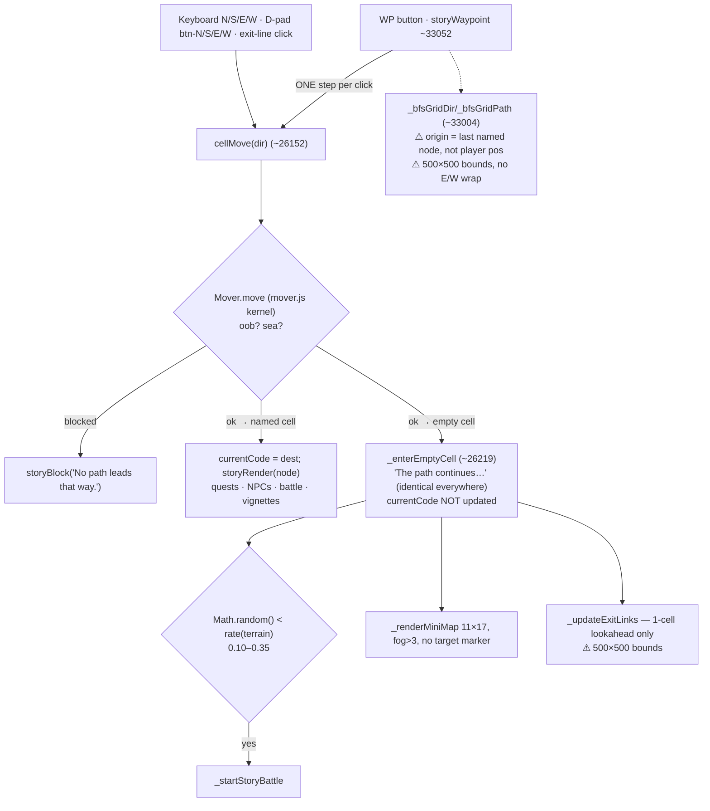
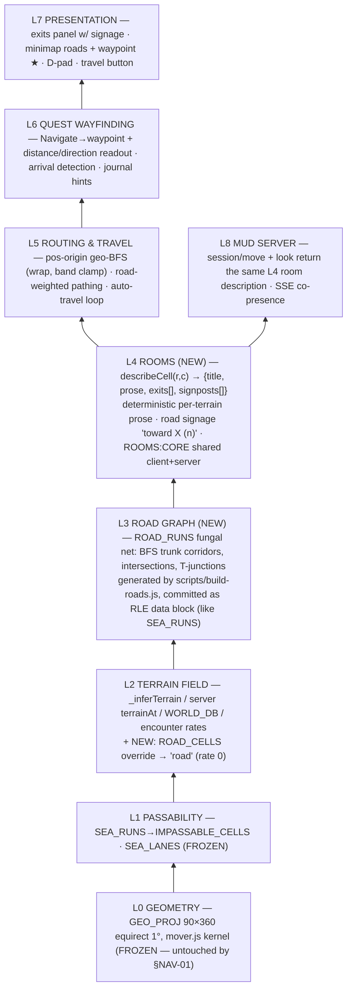

<!-- SPDX-License-Identifier: MIT — Copyright (c) 2026 paul@roll2hit.com -->
## I. Directive

> You are an expert prompt interpreter with an electrical engineering / computer science background. Follow the sections below: use the suggestions in II, III, IV to implement ideas from the list, or append new ideas to the end of the list when told about them. Work incrementally — present one step at a time and wait for "continue."

### API-First Development Policy

**Preferred workflow for any data addition or edit to `roll2hit-v3.html`:**

1. **Check API first** — before editing HTML, use `./api.sh` to confirm current state: `./api.sh ping`, `./api.sh list <type>`, `./api.sh audit`. Direct HTML edits are a fallback only when the API cannot yet express the operation.
2. **Write the API method first** — if the operation isn't yet supported, add the endpoint to `wbapi-server.js` and restart before touching the HTML.
3. **Create/modify via API, not HTML** — preferred: `./api.sh post <type> [k=v ...]` or `./api.sh put <type> <id> [k=v ...]`. The tool handles nonces automatically and queues all requests with retry.
4. **Restart server after adding endpoints** — `./wbapi-toggle.sh restart` (or `start` if stopped).
5. **When adding items to plan.md** — cross-reference current state with `./api.sh audit` and `./api.sh list <type>` to confirm what actually exists vs. what the plan assumes.

> *«cli-quick-reference» archived to plan-archive.md (2026-07-02). Day-to-day: ./api.sh help. Full reference: wbapi-help.md + API-README.md.*

**Single source of truth:** `roll2hit-v3.html` is the entire game. The API reads its text directly and writes mutations back in-place. `wbapi-server.js` and `worldbuilder.html` are authoring tools — the game requires neither at runtime.

### Cell-First Navigation Policy

**Cell = Location.** All map locations are identified by `(r, c)` cell coordinates. The two-letter node code is a lookup alias for a named cell, not a location pointer. Use `CELL_GRID["r,c"]` to resolve coordinates to node codes. Do not navigate by chasing `N/E/S/W` pointer fields — those were stripped in §CELL-01. When writing new features:

- Positions travel as `{ r, c }` pairs.
- Node codes are resolved from position: `CELL_GRID[\`${r},${c}\`]`.
- "Adjacent" means `(r±1, c)` or `(r, c±1)` — not stored edge links.
- Quest activation checks: `CELL_GRID[\`${s.r},${s.c}\`] === quest.activateNode`.

### Free-Movement / Mission-Gating Policy

**The world is freely traversable. Quests never block movement. "Gating" applies only to the *mission list*, never to a *road*.**

This is a hard invariant, not a preference. Two distinct, non-overlapping mechanisms — keep them separate:

1. **Movement gating = terrain/geometry ONLY.** A step is refused for exactly two reasons (`mover.js` / inlined `moverMove`): `'oob'` (off the grid) and `'sea'` (destination cell is in the `impassable` set — sea + `IMPASSABLE_CELLS`). **No quest, flag, `S_story` field, mission bit, or item may ever cause a step to be refused.** There is no "blocked road," no "locked gate on a path," no "come back when you've done quest X to pass here." Water crossings are carried as **SEA_LANES land bridges** (passable cells), not as conditional barriers. If a future feature needs a place to feel impassable until something happens, it must do so by **changing terrain/`CELL_GRID`/`IMPASSABLE_CELLS` state** (the cell genuinely becomes/stops-being sea), *not* by consulting quest state inside the mover.

2. **Mission gating = quest `gate` ONLY (listing, not traversal).** A quest's `gate` (UQF) / legacy `activateCond` decides **whether a mission is *offered/listed* when you arrive at its `activateNode`** — consulted in exactly one place, `storyCheckQuests` (`if (q.schema==='UQF-1.0' && !QuestRuntime.canActivate(q.id)) return;`). An unsatisfied gate means the quest simply isn't added to your journal yet (e.g. act 2 of an arc lists only after act 1 passes — sequential **mission availability**). You always reached the node freely; only the *listing* was deferred. `gate:{}` = always listed; `gate:{flags:[…]}` = listed once the prior flag is set. **`gate` is mission metadata; it must never be read by the mover or any movement/entry code.**

**Allowed:** gating mission *listing* (sequential arc unlock, prerequisite missions, flag/node/battle-conditioned availability). **Forbidden:** gating *movement* on quest/flag state (a quest that bars a road, an exit that won't open until a mission is done, an NPC who physically blocks a cell).

> *«free-movement-enforcement-audit» archived to plan-archive.md (2026-07-02). Re-run the mover-gate greps (archived) before shipping any movement or quest-availability change.*

> *«incremental-recitation-rule» archived to plan-archive.md (2026-07-02). Applies only when writing vignette content: say each segment aloud, write incrementally, commit + speak per vignette.*

### Loop vs. Ask Rule

Before starting any task:

- **Loop tasks** (no user input needed — clear next step): begin immediately, state what you are doing in one sentence.
- **Ask tasks** (user decision required): present a yes/no or choice prompt. Then run:
  ```bash
  say "If you say yes: <one sentence describing the intention and outcome of yes>"
  ```

### Commit + Speak Rule

After every `git commit`, immediately run:

```bash
say "<commit subject line>"
```

Read the **subject line only** aloud via macOS `say`. This confirms the commit completed and anchors the session.

### Lab Report Policy

Write a new `lab-report-<title>.md` when any of the following is true:

| Trigger | Examples |
|---------|---------|
| Major collection added or redesigned | New monster group, terrain cluster, NPC faction, item economy |
| Large redesign touching multiple systems | Weapon drop overhaul, Luck Stat, fishing bait sub-system |
| New narrative theme or arc | New quest chain spanning 3+ nodes, new named faction, new NPC arc |
| Design review before implementation | IEEE-format spec locking data shapes and flow before any HTML edit |
| Session postmortem with non-obvious decisions | Choices that won't be recoverable from code or core docs alone |

Do **not** write a lab report for: a single monster/quest addition, a value correction, or small additions that fit in an existing doc section.

---

## II + III. Design Constants & State Fields

> **Moved to `index.md`** — see "Design Constants Quick Reference" and "State Fields Quick Reference (S_story)" sections there.

---

## §BACKLOG — Open Items

### §RESUME — Continue Here

> **⟶ ACTIVE WORK: §NAV-01 — Navigable World / MUD-coherent map + fungal road net.** Inc a/b/c/d + map suite + GLOBE panel shipped (last commit `3cd3f62`, 2026-07-01) — **resume from the "§NAV-01 — UNFINISHED TASKS" section at the END of this file** (next: Inc e remainder — exits signage / minimap waypoint ★ / distance readouts; then Inc f MUD room parity, Inc g/h worldbuilder editors). Full spec + locked data shapes in the §NAV-01 section below.
>
> **Then:** **§MESH-01 — multiuser MUD mesh** (Multiplayer section below; prereq lab report `lab-reports/lab-report-mesh-multiuser.md` per the Lab Report Policy), then **UQF Wave 3**.
>
> **UQF migration status (Waves 1+2 ✅ COMPLETE, 2026-06-30):** ~2,462 quests on UQF · `quest-runtime-uqf` 234 passed · `check:walk` green · navigation green · §SKILLFIX-02 trio complete. Next UQF work = **Wave 3** (side quests → declarative completion), then W4 combat / W5 epics / W6 retire the legacy path / W7 QUEST_DB single source of truth — see the §ARCH-01 entry under Data / Architecture.
> **Full wave-by-wave history + the per-family migration runbook** (golden-capture parity protocol, §SKILLFIX gotchas, `scripts/uqf-bulk-migrate.js` usage): `plan-archive.md` (§ARCH-01 UQF archive section) + `lab-reports/lab-report-uqf-migration-playbook.md`. A fresh session resuming Wave 3+ should read the playbook first.

### §NAV-01 — Navigable World: MUD-Coherent Map + Fungal Road Net (IN PROGRESS · plan `01c5187` · **Inc a ✅ `a96d935` · Inc b ✅ `7b503d1` · Inc c ✅ `3568fcc` (room layer + local-map recolor) · Inc e-maps ✅ `f8c341b`** (map tab 15×21 + amenity icons + FULL-world canvas w/ gold viewport traces; user-directed, pulled ahead of Inc d) · **Inc d ✅ `3cd3f62`** (auto-travel) · next on "continue": **Inc e remainder** (exits signage / minimap waypoint ★ / distance readouts))

> **User directive (2026-07-01):** make the map playable *like a MUD* — walkable paths between cells, quests + locations connected by roads; worldbuilder gains drag-and-lock city placement and a draggable road "net" (chain links, intersections, T-junctions — "fungal roads" / world highways). This supersedes UQF Wave 3 as the active work item.

#### 1. Diagnosis — why the map is not navigable (measured 2026-07-01)

The §WALK series is genuinely done (`check:walk` green, mover parity byte-identical, 0 junction stubs, 235/235 named cells reachable from Birka). **The kernel works; the game layer above it is a featureless raster.** Measured on the live file:

- **410 nodes collapse into 235 occupied cells** — 0.85% of the 27,610 passable band cells. Cities cluster (median nearest-neighbor = **1 step**), but the clusters float in a void: from the LHR/Birka start the **median named cell is 33 blind steps away, p90 = 66, max = 102 (MLN)**. 2,829 quests across 353 activateNodes sit on the far side of that void.
- **Every empty cell is textually identical** — `_enterEmptyCell` always prints *"The path continues. No named location marks this ground."* + raw `Row r, Col c`. No landmark, no direction, no distance. >99% of walkable space carries zero information.
- **Every empty step is an encounter roll** (0.10–0.35 by terrain). A 33-step trip ≈ 5–8 forced battles. `TERRAIN_ENCOUNTER_RATE.road = 0` exists but **no cell ever resolves to `road`** — there is no road data.
- **No auto-travel.** The WP button (`storyWaypoint`) moves exactly **one cell per click**. `_bfsGridPath` computes a full route and nothing executes it.
- **BUG — stale waypoint origin:** `_bfsGridDir(S_story.currentCode, wp)` routes from the *last named node* (`NODE_COORDS[fromCode]`), not from `playerR/playerC` — `cellMove` never updates `currentCode` on empty cells, so the WP arrow/D-pad highlight is wrong for the entire wilderness leg of a journey.
- **BUG — pre-§WALK-1.5 bounds:** `_updateExitLinks` (~32795) and `_bfsGridPath` (~33022) still clamp to the **old 500×500 grid** (`nr>=1 && nc<=500`, no E/W wrap) while the kernel walks 90×360-with-wrap. Exit UI and BFS disagree with the mover at row 0 and the antimeridian.
- **Minimap/world map show unvisited nodes as `?`**, fog past distance 3, no waypoint marker, no road rendering. Quest "📍 Navigate →" sets a waypoint but never shows distance or direction.

**Root cause in one line:** a MUD is *rooms + exits + descriptions*; we built accurate geography but only 235 rooms and no exits worth describing — the space between locations is undifferentiated, dangerous, and unsigned.

#### 2. Current navigation flow (as-built)



#### 3. Target layered architecture



**Layer contract:** each layer reads only layers below it. The mover kernel (L0/L1) is never edited — roads are *terrain*, not permissions, so the Free-Movement invariant (`__moverBlocked` reasons stay exactly `'oob'`/`'sea'`; 0 gate refs in mover) is preserved by construction. Roads make travel *safer and legible*, never *required*.

#### 4. Data shapes (locked)

- **`ROAD_RUNS`** (game file, after `SEA_LANES`): RLE `{row:[[c0,c1],…]}` exactly like `SEA_RUNS`; builds `ROAD_CELLS` Set at load. Server parses the literal (new `getRoadCells()`, same pattern as `getSeaLanes()`). **Generator `scripts/build-roads.js`:** settlement graph = 235 occupied cells; edges = k-nearest (k≤3, BFS dist ≤ 30) + MST over the cluster graph (guarantees one component); corridor = BFS shortest path where **already-roaded cells cost 0.5** — trunk reuse is what makes the net *fungal* (organic trunks, natural intersections + T-junctions instead of 235² spaghetti). Excludes named cells + sea; SEA_LANES stay `ocean` (crossings keep their 0.10 risk — a deliberate texture). Deterministic; committed as data.
- **`_inferTerrain` / server `terrainAt` precedence:** `SEA_LANES → 'ocean'` ▸ `ROAD_CELLS → 'road'` ▸ majority-of-named-neighbors ▸ `'midlands'`. Both copies + `scripts/check-terrain-parity.js` updated in the same increment.
- **`describeCell(r,c) → room`** (Inc c, ROOMS:CORE inlined byte-identically like MOVER:CORE): `{icon, title, sub, body, exits:[{dir, kind:'node'|'road'|'terrain'|'blocked', label, hint}], signposts:[{label, dir, steps}]}`. Prose = 3–5 variants per terrain keyed by `hash(r,c)` (no `Math.random` — deterministic for MUD parity + tests). Road cells describe the highway and name the **next settlement along the road** in each road direction; every empty cell lists nearest landmarks within BFS radius 12.
- **Waypoint/travel state:** `S_story.waypoint` (exists) + travel loop flag; origin for all routing = `{r:S_story.playerR, c:S_story.playerC}` — **never** `NODE_COORDS[currentCode]`.
- **Worldbuilder net editor data:** `roads-pins.json` (repo root) — user-authored pins `{pins:[{r,c}], links:[[cellA,cellB]], locked:['CODE',…]}`; build-roads.js consumes pins as mandatory road vertices; `locked` codes are never moved by geo-seed/regeneration. New endpoints `GET/PUT /api/roads` (regenerate + patch ROAD_RUNS block), `PUT /api/coords` already exists for drag-drop city placement.

#### 5. Increments (one per "continue", each: implement → gates → commit → `say` → sync docs)

| Inc | Scope | Gates |
|-----|-------|-------|
| **a ✅** `a96d935` | **Wayfinding correctness (game file only):** `_playerPos()` helper; `_bfsGridPath`/`_bfsGridDir` take a `{r,c}` origin (player pos), geo bounds `0≤r<90` + E/W wrap w/ antimeridian dir-adjust (mirror `__moverStep`), predecessor-map BFS; `_updateExitLinks` passability = kernel rule, not 500×500; `storyWaypoint` routes from player pos + cell-based arrival (locale co-location safe). | ✅ navigation 14/14 · `check:walk` green |
| **b ✅** `7b503d1` | **Fungal road net:** `scripts/build-roads.js` (deterministic MST + local loops ≤8 + trunk-reuse Dijkstra costs settlement 2/road 4/virgin 10/lane 14; `roads-pins.json` hook for §NAV-01h) → `ROAD_RUNS` RLE block in game file (**400 road cells, 1.4% of passable, 88 intersections/T-junctions**); `_inferTerrain` + server `terrainAt`+`getRoadCells()` road override; parity script gained A3 road round-trip + road closures; `scripts/check-roads.js` (R1 235/235 touch net, R2 single component stitched via settlements+lanes, R3 0 overlaps, R4 1.4%<10%) wired into `check:walk` as `check:roads`. | ✅ `check:walk` (A3, B 10440/10440) · `check:roads` · navigation 14/14 |
| **c** | **Room layer:** `describeCell` (ROOMS:CORE, new `rooms.js` + inline + parity check); `_enterEmptyCell` renders it (terrain prose variants, signposts, exits-with-signage); region name replaces raw `Row r, Col c`. | new `navigation` cases (deterministic prose, signpost correctness) · parity |
| **d ✅** `3cd3f62` | **Auto-travel:** WP button = travel loop along road-weighted path (`_roadGridPath` Dijkstra/Dial buckets, road+lane cost 1 vs 2; ~120 ms/step `setTimeout` chain), halts on encounter-roll (`_encounterQueued`, before the 300ms battle fire)/arrival/any-input (`cellMove` guard + keydown hook)/blocked; Shift+WP = single step; `storySetWaypoint` (quest Navigate →) starts travel; WP D-pad arrow + single-step follow the same weighted route. | ✅ navigation 29/29 (+5 travel cases) · `check:walk` green · autosave+fishing 13/13 |
| **e** | **Wayfinding UI:** exits panel shows `E→ road — toward Visby (4)`; minimap draws roads + waypoint ★ (edge-of-window direction when off-screen); quest journal + Navigate button show `(n steps, NE)`; world-map sheet renders road net. | navigation UI cases green |
| **f** | **MUD server parity:** `session/move` + `look` responses carry the L4 room description; mud-harness asserts room text + signposts identical to client for same cell. | `npm run test:mud` 24/24 + new room cases |
| **g** | **Worldbuilder — drag & lock cities:** Walk/Map tab: drag a node marker (ghost preview), drop → `PUT /api/coords` (existing endpoint; 1-node/cell guard per [[feedback_api_only_connections]]); lat/lon entry field converts via `row=floor(70−lat)`, `col=(floor(lon)+180)%360`; 🔒 lock toggle persists `locked` into `roads-pins.json`/gazetteer so regeneration never moves a locked city. | worldbuilder Playwright suite |
| **h** | **Worldbuilder — road-net editor ("place the net"):** render ROAD_RUNS as a draggable chain-link overlay; drag a link vertex → pin (`roads-pins.json`); palette to add **+ intersections** and **T-junctions**; **Reweave Net** button = run build-roads.js with pins → `PUT /api/roads` patches the ROAD_RUNS block in-place. All mutations API-first. | worldbuilder suite + `check-roads` after every reweave |

**Docs sync on close:** maps.md (road net section), docs-node-network.md (L0–L8 stack), mechanics.md, index.md registry row, `lab-reports/lab-report-nav01-navigable-world.md` (this diagnosis + the locked shapes above).

**Non-goals / guard-rails:** no stored node-to-node edge lists (roads are cells, resurrecting no §CELL-era pointer graph); no movement gating ever (roads are sugar, the open field stays walkable); no re-projection (coords are settled — §NAV-01g moves individual cities only, via API); mover.js untouched.

### Tooling

- [~] **§EDITOR-02-FU** — Mission Builder follow-ups. ✅ branching arcs (`gateAfter` fork field) + drag-reorder (▲/▼ + grip) shipped 2026-06-27. **Remaining: whole-arc UQF export** — gated on §ARCH-01 landing (needs the UQF schema; feeds §EDITOR-03). Pure worldbuilder; no lab report needed.
- [ ] **§EDITOR-03 — Worldbuilder UQF export** — once §ARCH-01 (Mechanics) lands, add "export UQF" to worldbuilder.html. (Canonical migration plan now under Mechanics → §ARCH-01.)

### Data / Architecture

- [ ] **§DATA-01-REVERTED — entire §DATA-01 quest data/code separation is missing from code** (found 2026-06-26) — index.md L155 records §DATA-01 (2026-06-16) as DONE: `QUEST_EFFECTS` (121 declarative descriptors) + `QUEST_HOOKS` (91 handlers) + `applyQuestEffects()`, `QUEST_DB` purged of 127 `onPass`/`onFail` fns, ZRH duplicate resolved (Dunfall→`DFL`), and `q.title/desc/hint` → `textContent`. **None of it is in the current code** (`QUEST_EFFECTS`/`applyQuestEffects`/`DFL` all grep to 0) — the whole change was reverted/lost, which is why the ZRH duplicate resurfaced (re-fixed above as `DNF`). Likely a snapshot rollback clobbered it. **Decision needed:** restore §DATA-01 from `lab-reports/lab-report-quest-data-code-separation.md` (large) vs fold into §ARCH-01 UQF vs accept the loss + correct index.md. Big — overlaps §ARCH-01.
- [~] **§ARCH-01 — Universal Quest Format (UQF v1.0)** — unify the 3 incompatible quest formats into `schema:'UQF-1.0'` declarative quests (`gate` activation + `bits` chain + `completion` gate). **Phases 0–2 ✅ (2026-06-28):** inert `QuestRuntime` (`validateQuest`/`adaptLegacyQuest`/`canActivate`/`canComplete`/`execBits`) + dual-path dispatch (`_rollCeremonia`→`_resolveQuestUQF` for UQF quests; every legacy quest stays byte-for-byte on the closure path). **Phase 3 Waves 1+2 ✅ COMPLETE (2026-06-30, `e602d92`):** ~2,462 quests migrated — Wave 1 = 78 `onPass`-closure skill-checks whole-arc; Wave 2 = ~50 families bulk-migrated via `scripts/uqf-bulk-migrate.js` with per-family golden-capture parity (incl. the user-approved **§SKILLFIX-01/-02** fixes: ability-abbrev checks now apply the real mod; skill-name `checkStat`s mapped to their governing ability, name kept in `skill`). Migration pattern: `activateCond`→`gate`, `checkPassFlag`→`mission_bit`, `xpAward`→`reward`; engine grew reusable gate/bit terms as gaps appeared. **Remaining waves:** **W3** side quests → declarative completion · **W4** combat (needs a UQF combat resolver) · **W5** epics (design pass first) · **W6** retire the legacy `_rollCeremonia`/completeFn path · **W7** QUEST_DB = single source of truth. **Latent bugs flagged & parity-preserved (NOT fixed):** the `onComplete`+`xpAward` double-count on lair-clear side quests (sb_fight +800xp, hunt_04 +1000xp, hunt2_04 +1200xp, bilge_04 +1200xp) and §DUNGEON-01's dead `==='complete'` skill_check handlers — both in `project_open_gaps`. **Full wave-by-wave history + runbook → `plan-archive.md` (§ARCH-01 UQF archive) + `lab-reports/lab-report-uqf-migration-playbook.md`.** Prereq lab report: `lab-report-quest-api-architecture.md`. See `project_quest_api`.

### Game Content — Major Planned Arcs

> Each is design-complete or scoped in a memory file; **all require a `lab-report-*.md` locking data shapes before any HTML edit.** Restored here 2026-06-25 from memory (dropped from plan.md during the §WALK rewrite).

- [ ] **§GR — Grief Arc / "La Riva"** — design-complete (2026-05-26), deferred to Layer 78+. Corruption→grief causal chain; node AMS (design: FR) Fishmonger's Row unlocks after `catKingDefeated`; NPCs `connie_tuna`/`aldo_sardino`; 3-quest chain (`quest_la_riva_01..03`); French 5-act vignette technique (object-per-act). Prereq: `lab-report-la-riva-grief-arc.md`. See `project_grief_arc` in memory + story.md §GRIEF AND CORRUPTION.
- [ ] **§DESIGN-03 — Ceremonia Roll + Starting City Expansion** — PLANNED. `d20+abilityMod+profBonus≥DC` skill-check mechanic; new `type:'skill_check'` quest fields; fills the Birka L3–6 XP gap (4 new missions); Yael "The Watchpost" 5-act romantic Ceremonia arc. Prereq: `lab-report-ceremonia-roll-skill-checks.md`. See `project_ceremonia_roll`. *(Note: `type:'skill_check'` quests already exist live — confirm what's shipped vs scoped before building.)*
- [ ] **§DUNGEON-01 — 10 Dungeon Themes** — PLANNED. Priority: D01-03 hero-origin canon (player = trapped Scholar King Apprentice; Prior Carrier NPC at NUE) → D01-07 CY first-visit madness WIS DC12 → D01-08 Mimic Meadows (node LIM, `mimic_meadow`, `quest_mimic_colony`, Tribbles) → D01-10 Loop Heart at CO (pre-boss choice). Plus Sacrifice Gates, Shifting Labyrinth, Scholar Workshop (node SW), Arcane Inversion, Inquisitor interview. Many new state fields. Prereq: `lab-report-dungeon-ten-themes.md`. See `project_dungeon_themes`.
- [ ] **§MATH-01 — Mathematical World** — PLANNED (2026-06-02). Group-theory overlay; nodes EHZ (Event Horizon station), MONS (Monster's Manifold 196,883-dim), ZERO, CNTR (Cantor's Attic); 5 quest seeds (MATH-01..05) connecting Roman/Byzantine/Arabic zero, Galois quintic, Monstrous Moonshine. Adventure-Time register for EHZ/MONS only (French-noir elsewhere). See `project_math_world`.
- [ ] **§1367 — Historical 1367 AD integration** — 6 events→quest seeds (Nájera/routiers, Tamerlane, Ottoman Balkans, Hanseatic peak, Wycliffe, Black Death aftermath); **8 clarification questions in §1367-D gate HTML integration**. No anachronisms. See `project_1367_setting`.
- [ ] **§FUTURE-01 — Saul→Paul arc** — unscheduled. Middle East node map; Acts/Pauline fidelity; Damascus-Road conversion reframes toolkit (combat→rhetoric) and rewrites quest availability — a world-first conversion mechanic. Node map/quest IDs/NPC keys drafted. See `project_future_saul_paul`. *(Open design call: does Acts-fidelity register create tonal discontinuity?)*
- [ ] **§GR-D Froberger Entry 42** — blank page filled on second playthrough. Requires NG+ state tracking (currently unsupported).

### Mechanics & Systems

- [ ] **§MBIT-02 — Mission Bit Token follow-ups** — §MBIT-01 shipped (`_grantMissionBit`/`_takeMissionBit`, `type:'mission_bit'` items). Remaining: `bitLabel` cleanup for Paul-arc quests, `_takeMissionBit` call sites for consumed tokens, worldbuilder schema update, token timeline in journal. See `project_mission_bit_tokens`.
- [ ] **Global monster drop nerf (−3→0 floor)** — design intent (fishing = exclusive positive-magic-loot vector) never shipped; monster drops still yield 0..+3. Open loot-balance gap. See `project_open_gaps`.
- [ ] **`fishmongerRowRestored` visual rebuild** — flag sets on `quest_la_riva_03` but AMS node has no `partial_market` "after restoration" text variant; Row never visually rebuilds. (Blocks on §GR.)
- [ ] **UI gaps** — `[INVESTIGATE]` buttons don't highlight on node entry (root cause unknown); reading-circle has no progress UI. See `project_open_gaps`.

### Design Decisions (pending)

- [ ] **Arc ID as first-class UQF field** — add `arc: 'quest_wis'` explicitly to quest objects; enables arc sorting without string-splitting heuristics
- [ ] **§MBIT-02-E token/gate unification** — leaning toward keeping KEY_EVENTS items and mission bit tokens separate (different ontology). Decision pending.

### Multiplayer

- [ ] **§MESH-01 — Multiuser MUD: presence rendering + self-discovering server mesh + tracker** (idea logged 2026-07-01; builds on §CELL-07 single-server sessions/SSE and the §NAV-01 L4 room layer / L8 MUD parity).
  **What exists:** `wbapi-server.js` already has `SESSIONS`, per-session SSE streams, cell-scoped `broadcastCell` (player_arrived/chat), `/api/session/{start,move,look,who,say,end,events}`. Missing: the game client never consumes the stream, and there is no server-to-server sync.
  **Locked design decisions:**
  1. **Presence rendering (client):** story UI opens `GET /api/session/events` when WBAPI is reachable (multiplayer strictly opt-in — single-file game unaffected offline); room output gains an "Also here: <names>" line (surfaced through the L4 room object, not a separate panel), minimap dots for players inside the viewport, `say` chat in the story log.
  2. **Mesh (self-discovering):** each server has a persistent random 16-byte `serverId` + a `worldHash` (CELL_GRID + ROAD_RUNS + file version); servers mesh ONLY with same-`worldHash` peers (prevents ghost players on non-existent cells). Gossip rounds (~2s) push presence deltas to a few random peers AND exchange peer lists (PEX) — one live peer address bootstraps the whole mesh; topology self-heals. Transport = plain HTTP POST server-to-server, new `/api/mesh/{gossip,peers}` endpoints.
  3. **Tracker (`tracker.js`, separate tiny process, one open port):** rendezvous only, never a relay. `POST /announce {serverId, host, port, worldHash, playerCount}` every ~30s → returns K random same-world live peers to seed the peer table. Not on the hot path: mesh survives tracker death via gossip + a cached last-known-peers file (DHT-bootstrap style fallback).
  4. **Deduplication (the load-bearing invariant): every presence record is SINGLE-WRITER** — only the origin server mutates its own sessions; replicas are read-only. Event id = `(originServerId, monotonic per-origin seq)`; player id = `(originServerId, sessionId)`, never display name. Receivers keep a version vector `maxSeqSeen[originId]` — anything ≤ is a dup: dropped AND not re-gossiped (this + hop TTL stops flood loops). Anti-entropy = periodic version-vector exchange, pull only missing ranges. No CRDTs/LWW needed (no concurrent writers per record); records expire on TTL when origin stops heartbeating.
  **Deferred hard problem (out of scope for presence):** cross-mesh WORLD mutations (WBAPI writes to the HTML) are multi-writer and need real conflict resolution — §MESH-01 syncs ephemeral presence/chat only; the ECONOMY ledger below (§MESH-01.4) is the narrow multi-writer slice that gets real integrity machinery.
  **Extended design (user Qs 2026-07-01 — tracker enablement, gameplay, no-dupe economy):**
  5. **Tracker enablement / unification:** tracker is a ROLE of the same codebase, not a new stack — `node wbapi-server.js --tracker-mode` (or `./wbapi-toggle.sh tracker`) serves ONLY `/announce` + `/peers` on an open port; game servers get `TRACKER_URL` (env or `--tracker <url>`) and announce every ~30s; `--peer host:port` = manual/LAN bootstrap without any tracker. Clients may also `GET /peers` from the tracker as a server browser (pick nearest same-`worldHash` server). **World magnet link:** `r2h:?wh=<worldHash>&tr=<trackerURL>` — worldHash plays the infohash role (identifies the world-swarm), tracker resolves it to live peers; paste a friend's magnet to join their mesh.
  6. **Gameplay layer (cheap→expensive):** (i) **co-presence buffs** — co-located players get "traveling with allies": +1 to hit per ally (cap +2), encounter rate halved on shared cells — works for two browsers or a friend, the "MUD advantage"; (ii) **party loot/xp share** on same-cell battles (each fights their own client-local instance, party bonus applies — battle engine stays client-local, NO synced turn engine in v1); (iii) **hireling/guide bots** — single-player-first: a hired hand NPC (daily gold fee, charged on day tick) that joins battles as an extra attacker die and, as *quest guide*, drives the §NAV-01d auto-travel loop toward the active quest's `waypointNode` ("follow me"); (iv) **bot sentries** — server-side bot sessions (origin = the server, same presence schema) stationed at road junctions: suppress encounters in their cell + auto-assist any player battle there; daily fee per sentry; (v) **true shared turn-based party combat** — deferred (requires a server-authoritative battle instance; design pass first).
  7. **No-double-spend / anti-dupe economy (the Diablo dupe problem):** no PoW, no blocks, no difficulty — the user's instinct is right that we only need ORDERING + IDENTITY: (a) every dropped/minted item gets a globally unique **mint id** `(originServerId, seq)` — same identity scheme as presence events; (b) each player's economy history is a **hash-chained per-player event log** (append-only; "block height" = per-origin seq — lamport-style, no computation); (c) a **trade** is one event signed into BOTH players' chains referencing the item's mint id + the giver's prior-ownership event; (d) ownership of an item = the longest valid transfer chain from its mint event; when gossip merges two conflicting transfers from the same prior state (the double-spend), a deterministic fork-choice rule (lowest event-hash wins) voids the loser — detection-and-void on merge, not up-front global consensus (trades are rare; optimistic is fine); (e) client-copied item BYTES without a valid mint lineage are worthless in any trade — which is exactly the Diablo-2 dupe fix (server-minted identity + ledger, not item-blob possession). Stat/save cheating stays out of scope (single-file game is client-authoritative; friends-mesh trust is social — the ledger protects TRADES, not stats).
  **Extended design 2 (user Qs 2026-07-02 — bootstrap files, world integrity, mod sync, tracker federation, ACLs, world download):**
  8. **Compatibility identity (three-part; "each game version is incompatible"):** `MESH_PROTO` (mesh wire-protocol int, server const) · `ENGINE_VER` (game build const **in the HTML** — single source of truth, server parses it; bump per release) · **`worldHash` v2** = sha256 over the **raw source spans of ALL data collections** (NODE_MAP, NODE_COORDS, SEA_RUNS, SEA_LANES, ROAD_RUNS, QUEST_DB, MONSTER_POOL, WORLD_DB — "all quests and data summed"). **World manifest** `GET /api/manifest` = `{proto, engineVer, worldHash, parts:{quest_db:h,…}}` — per-collection hashes so mismatched servers can see *where* they differ (mod diagnosis). Mesh/tracker sync requires equality of all three; per-part hashes are diagnostics + mod tooling, never a partial-sync license.
  9. **Bootstrap ladder (static files first):** (1) `--peer host:port` flags → (2) `peers-cache.json` (gossip-written last-known-live) → (3) **`peers.txt`** repo-root static file (operator-edited, scp-able) → (4) tracker → (5) **`BOOTSTRAP_URLS`** = plain **text file over HTTP(S)**, same format — recommended host: a **GitHub Gist raw URL** (versioned, controllable, free); any dumb host works (PHP echo, S3, an scp'd file on a VPS) since clients only GET text. Format: `#` comments · `tracker <url>` lines · `<host:port> <engineVer> <worldHash>` lines. Publishing is deliberately **manual** — `GET /peers?format=txt` emits the bootstrap format for the operator to scp/paste up; no automatic write path (a write path is a takeover vector).
  10. **Tracker federation ("hack a discovery tracker"):** trackers are the same codebase (`--tracker-mode`); **`--tracker-peer <url>`** (manual, operator-initiated) federates two trackers via periodic **anti-entropy merge of announce tables** — each record owned by its announcing serverId (single-writer again), merge by newest heartbeat, TTL expiry; idempotent state exchange ⇒ no flood loops by construction. Connecting tracker A↔B implicitly gives both each other's servers. ACL applies before merge.
  11. **ACLs:** `mesh-acl.json` (repo root, hot-reloaded): `{mode:'open'|'allowlist', allow/block × serverIds/ips/worldHashes}`. Enforced at gossip ingress, peer dial-out, tracker announce, federation merge. Default open + empty blocklist; `allowlist` = private friends mesh.
  12. **World download + mod inspection (the single file IS the server):** `GET /api/world/download` serves the peer's `roll2hit-v3.html` + manifest; worldbuilder "⬇ Download world" button behind a **BIG WARNING modal** — *"You are downloading someone else's CODE (a full HTML+JS game). It is MIT-licensed. Inspect before opening: run the diff, review every non-data change. Be responsible."* Saves as `downloads/world-<serverId>-<hash>.html`; **never** overwrites the local game file, never auto-opens. `scripts/world-diff.js` diffs two world files **by data collection** (the modification set: which quests/monsters/nodes differ) and **flags any difference outside the data spans as a CODE CHANGE** (loud). Mod "sync" v1 = operator-approved pull of specific collections via the existing `GET /api/export/:collection` + WBAPI write path — never automatic (world writes stay the deferred multi-writer problem).
  13. **Magnet v2:** `r2h:?p=<proto>&ev=<engineVer>&wh=<worldHash>&tr=<trackerURL>`.
  14. **Player↔player interaction + consensual PvP duels (user Qs 2026-07-02 — "they need to agree on each other, no cheaters"):** any two-player interaction is the multi-writer moment, and it always uses the same **handshake-contract-resolve** shape (trades §7 already do): (i) **Consent:** `challenge → accept` handshake with a ~30 s TTL, relayed over each player's own origin server (co-located same-server = local; cross-server = direct origin↔origin POST, addr from the peer table); a global "PvP: on/off" player toggle refuses challenges outright — nobody can be fought without an explicit accept. (ii) **Stat commitment:** at accept, each side's ORIGIN SERVER freezes the challenger's combat block `{level, hp, ac, atkBonus, weapon dice, mods}` into the duel contract and **validates it against derivable bounds from the shared world data** (level ≤ 20, HP ≤ class max at level, weapon dice must exist in WEAPON_ITEMS, atk ≤ prof+mod+magic cap) — the worldHash guarantees both servers validate with IDENTICAL tables; impossible stats ⇒ refusal with reason. *(Honest trust boundary: a legit-shaped maxed save can't be proven grinded vs edited — that stays social, via ACL blocklists; the contract stops impossible stats and mid-fight inflation.)* (iii) **No one rolls their own dice — commit-reveal seed:** each origin server generates a nonce, exchanges `sha256(nonce)` FIRST, then reveals; `duelSeed = sha256(nonceA‖nonceB‖duelId)` — neither side can steer the seed (the second committer is already bound). (iv) **Deterministic resolution:** `duelResolve(statsA, statsB, seed) → round-by-round transcript + winner` as a pure shared **DUEL:CORE** block (byte-identical client/server, parity-checked like MOVER:CORE, 5e initiative/attack/damage) — both sides replay the identical function, so a cheater is simply a machine that disagrees with a pure function of committed inputs: detectable by re-running, and the transcript is self-verifying. (v) **Outcome:** `{duelId, winner, transcriptHash}` recorded into BOTH players' hash-chained event logs (the §7 economy machinery reused; wagers later = trade-ledger escrow referenced by the contract). (vi) **Movement during a duel is never blocked** (Free-Movement invariant): walking off the cell = fleeing/forfeit — a consequence, not a gate. (vii) **v1 = agreed auto-resolve duel** (transcript plays back in the battle overlay at battle pace); **v1.5 option:** interactive rounds via per-round simultaneous commit-reveal of action choices (still no authoritative server); **v2** true realtime PvP joins shared party combat behind a server-authoritative battle instance (deferred, own design pass).
  **Increment sketch:** **(a) ✅ `acd9b77` (2026-07-02) — client presence on one server:** 🌐 opt-in toggle + `MP` module in the game file (EventSource consumer, "Also here:" strip under `#story-move-msg`, SSE chat in/out via `storyMsg`, minimap ☺ dots from `nearby`); new **`POST /api/session/pos`** display-only beacon (passability-validated against the mover world, broadcasts `player_left`+`player_arrived`, **rolls nothing** — `session/move` stays exclusive to headless MUD clients so the §WALK-5 instanced roll can't double the client's own); `session/start` now announces the newcomer to its spawn cell; beacon fires from `cellMove`/`storyPortal` (no-op when off). Gates: mud-harness **35 checks** (+11: pos accept/reject/idempotent/no-roll + start-announce), new 2-browser Playwright smoke `multiplayer-presence.test.js` 2/2 (real flow: connect/co-presence/chat/departure/opt-in-only), navigation 29/29, `check:walk` green, autosave+fishing 13/13. *Residue: `session/end` sends no `player_left` (list self-corrects on next beacon; fold into Inc b).* → **(b/c) ✅ `80526b1` (2026-07-02)** — identity + mesh shipped as designed: `ENGINE_VER` const in the HTML + persisted `.wbapi-server-id`; `GET /api/manifest` (worldHash v2 over all 8 data-collection raw spans + per-part hashes); bootstrap ladder `--peer`/`MESH_PEERS`/`peers.txt` (committed template)/`peers-cache.json`; `POST /api/mesh/gossip` (compat gate → ACL → single-writer merge; 2s rounds to ≤3 random peers, ≤100-event tail + full snapshot + PEX; fresh events ≤10s fan out to co-located local SSE, replays advance the vv silently); remote replicas in `look`/`who.remotes`/`pos.nearby`; `mesh-acl.json` hot-reloaded (block/allow serverIds/ips/worldHashes, allowlist mode); `player_left` now fires on end/prune (Inc-a residue closed). Harness [E] +13 (48 total): cross-server presence/chat/departure **exactly-once across replayed rounds**, incompat-worldHash 409 + invisible, allowlist 403. Prod-inert test envs: `MESH_SERVER_ID`/`MESH_WORLDHASH_OVERRIDE`/`MESH_GOSSIP_MS`/`PEERS_CACHE_FILE`/`MESH_ACL_FILE`; `BIND_ADDR` env for LAN exposure (default stays 127.0.0.1). *Client needs no changes — remote players flow through the same look/pos/SSE surfaces as Inc (a).* → (d) tracker mode (`--tracker-mode`, announce/peers, compat grouping, `format=txt`, BOOTSTRAP_URLS fetch) + magnet v2 → (d2) tracker federation (`--tracker-peer` anti-entropy) → (d3) world download button + BIG WARNING + `scripts/world-diff.js` → (e) harness: 3 servers + tracker, convergence/exactly-once/partition-heal/incompat-refusal/ACL → (f) co-presence buffs + party loot share → (g) hireling guide bot (single-player, drives auto-travel) → (h) sentry bots (server-side sessions) → (i) mint-id + per-player event chain + trade handshake + fork-choice void (no-dupe ledger) → (j) consensual PvP duels (item 14: challenge/accept, stat commitment + bounds validation, commit-reveal seed, DUEL:CORE deterministic resolve, outcome into both hash chains; prereq: extend the mesh lab report with the DUEL:CORE data shapes before code). Prereq lab report: `lab-reports/lab-report-mesh-multiuser.md` **✅ DESIGN LOCKED 2026-07-02** (adds the `session/pos` beacon-vs-move decision, worldHash over walkable-world literals only, render-time presence append — implementation may start at Inc a). Free-Movement invariant untouched (presence is display-only; mover never consults it).

---

## §NAV-01 — UNFINISHED TASKS (session checkpoint 2026-07-01, resume here)

> **State at checkpoint:** last commit `3cd3f62` · shipped: plan `01c5187`, **Inc a** `a96d935` (pos-origin BFS + geo bounds), **Inc b** `7b503d1` (fungal ROAD_RUNS net, 400 cells / 88 junctions), **Inc c** `3568fcc` (ROOMS:CORE `describeCell` room layer + local-map terrain recolor), **map suite** `f8c341b` (map tab 15×21 + amenity icons + FULL-world canvas w/ gold viewport traces), **GLOBE panel** `435cc9f` (entire-world canvas in the story bottom bar; world+globe panels now refresh on empty-cell steps), **Inc d** `3cd3f62` (auto-travel: road-weighted `_roadGridPath` Dijkstra + `_travelTick` loop, all four interrupt classes). Gates at checkpoint: navigation **29/29** · `check:walk` **6/6** (invariants, mover parity, behaviour, terrain parity incl. A3 roads, check:roads R1–R4, rooms parity) · autosave+fishing 13/13. Full spec + data shapes: **§NAV-01 section above**.

- [x] **Inc d — Auto-travel ✅ `3cd3f62` (2026-07-01).** Shipped as specced: `_travelStart/_travelStop/_travelTick` loop (~120 ms/step `setTimeout` chain) + `_roadGridPath`/`_roadGridDir` (Dijkstra over Dial buckets, road/sea-lane cost 1 vs open 2 — snaps to the highway net when the detour is <2× the beeline); halts on encounter roll (`_encounterQueued` set in `_enterEmptyCell`, catching the battle BEFORE its 300ms `setTimeout` fires), `_startStoryBattle` hook, arrival (cell-based), blocked step, and any input (guard at top of `cellMove` via `_travelStepping` flag — covers D-pad/keyboard/exit-line — plus a keydown hook that consumes the halting key); Shift+WP = single step; `storySetWaypoint` switches to the story sheet and starts travel; WP arrow (`_updateExitLinks`) + `storyWaypoint` single-step now use the same weighted route. Travel state is transient module state (never persisted). Gates: navigation 29/29 (+5), `check:walk` green, autosave+fishing 13/13.
- [ ] **Inc e remainder — wayfinding UI** (next on "continue"). (map suite + globe already shipped, see above)
  - Exits panel signage: `_updateExitLinks` renders "open terrain" for empty neighbours — use `describeCell(_roomWorld(), _playerPos()).exits` instead, so lines read `E→ road — toward Visby (4)` / terrain label / `sea-lane toward X (n)`. The data is already computed; this is render-only.
  - Local minimap waypoint marker: draw ★ (or edge-of-window direction arrow) for `S_story.waypoint` on `_renderMiniMap` + a marker on the world panel/globe (globe: gold dot at waypoint cell).
  - Quest journal + Navigate button distance readout: `(n steps, NE)` via `_bfsGridPath(_playerPos(), q.activateNode).length`.
- [ ] **Inc f — MUD server room parity.** `wbapi-server.js`: `require('./rooms')`, build the server room-world (`getRoadCells`/`getSeaLanes`/`getLocaleGrid`/labels from `WBAPI.nodeMap` + WORLD_DB parse for `terrainInfo`), return `room` on `POST /api/session/move` + a `look` command; mud-harness (`npm run test:mud`, currently 24/24) gains cases asserting server room text/signposts byte-equal to client `describeCell` for the same cell.
- [ ] **Inc g — Worldbuilder drag-&-lock cities** (user directive). Walk/Map tab: drag a node marker (ghost preview) → drop calls existing `PUT /api/coords` (1-node/cell guard per [[feedback_api_only_connections]]); lat/lon entry converts `row=floor(70−lat)`, `col=(floor(lon)+180)%360`; 🔒 lock toggle persists `locked:[codes]` into `roads-pins.json` (schema stub already consumed by build-roads.js) so geo regeneration never moves locked cities.
- [ ] **Inc h — Worldbuilder road-net editor ("place the net")**. Render ROAD_RUNS as a draggable chain-link overlay; dragging a vertex writes a pin into `roads-pins.json` (`{links:[["r,c","r,c"]]}` — generator support ALREADY SHIPPED in `scripts/build-roads.js`); palette for + intersections and T-junctions (both are just pins); **Reweave Net** button = `node scripts/build-roads.js --apply` via a new `PUT /api/roads` endpoint that regenerates + patches the ROAD_RUNS block between its `◆ §NAV-01b` markers, then `check:roads`. Never hand-edit ROAD_RUNS.
- [ ] **Docs sync on §NAV-01 close:** maps.md (road-net + rooms section), docs-node-network.md (L0–L8 layer stack), mechanics.md, index.md Completed-Work registry row, and `lab-reports/lab-report-nav01-navigable-world.md` (diagnosis numbers + locked data shapes from the §NAV-01 section above — Lab Report Policy trigger: multi-system redesign).
- [ ] **Small follow-ups found during the session:** (1) `_renderMiniMap`'s "Void's First Sign" special case still targets cell `(4,3)` — a pre-§WALK-1.5 coordinate on the old 500×500 grid, now a real band cell in the North Atlantic; re-anchor or retire (L44-R). (2) `_questNodes()` set is built once per session — fine today (QUEST_DB static at runtime), invalidate if quests ever mutate live. (3) Map-tab hover info for road cells could name the road's destinations (reuse `__roadDestination`). (4) Consider a GLOBE panel click → jump the map tab / world panel to that region (read-only navigation aid, no teleport).
- [ ] **After §NAV-01:** UQF **Wave 3** (side quests → declarative completion) — full context preserved in §RESUME above.

---

> **Archive:** all closed / completed work (§WALK, §TIMELESS-01, §WBAPI-01, §EDITOR-01-D / -02 / -FU, §CELL-14, the full §ARCH-01 wave-by-wave history, and prior §RESUME snapshots) lives in **[plan-archive.md](plan-archive.md)**.

---

*© 2026 Paul Richeson — MIT License.*
